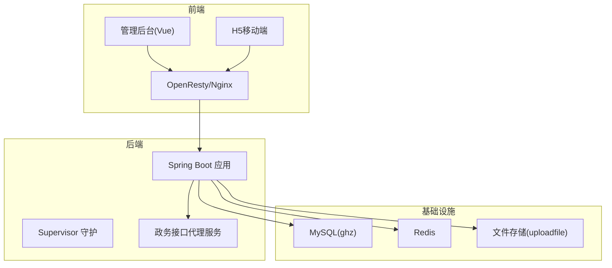
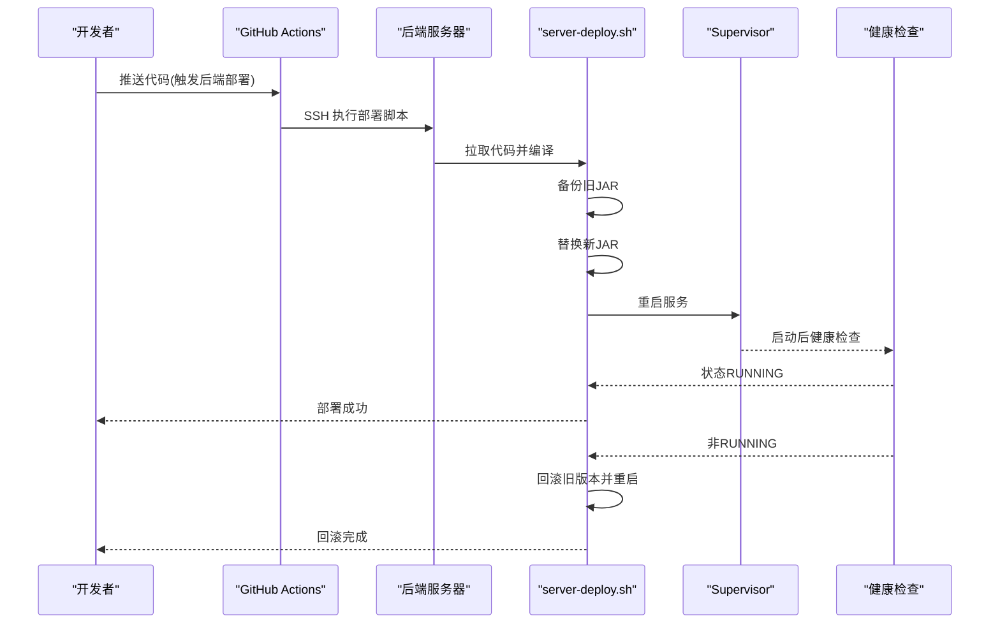
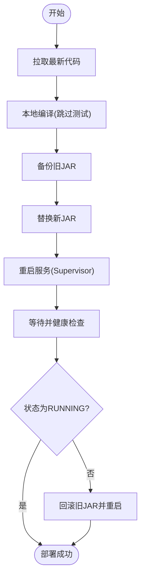
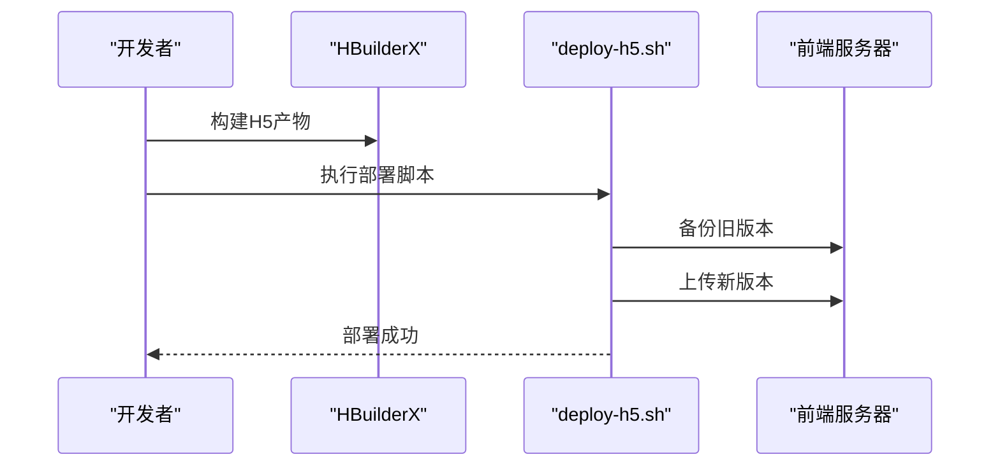
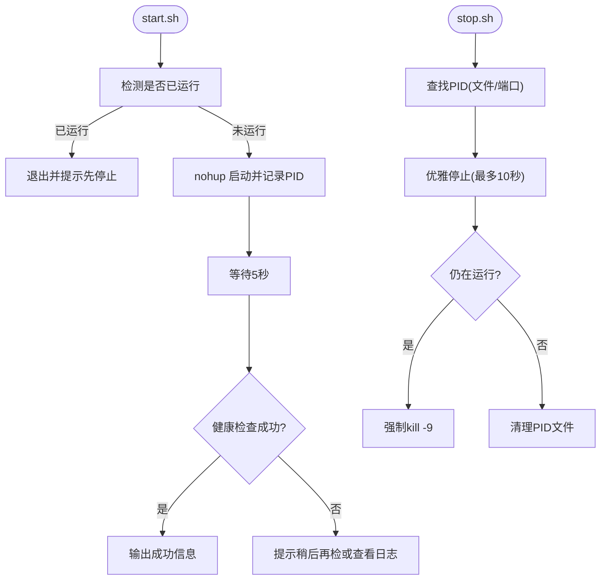
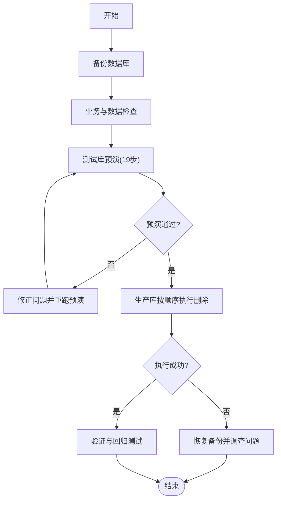
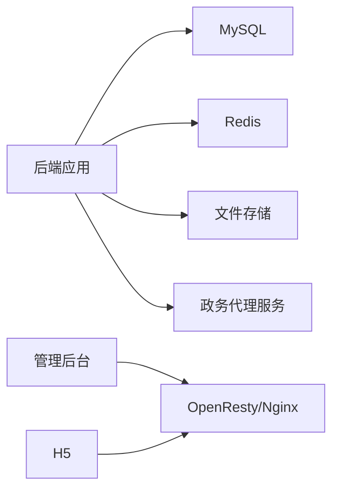

# 应急处理方案

<cite>
**本文引用的文件**
- [部署总结.md](file://部署总结.md)
- [server-deploy.sh](file://server-deploy.sh)
- [uniapp-h5/deploy-h5.sh](file://uniapp-h5/deploy-h5.sh)
- [ghz-gov-proxy/deploy/start.sh](file://ghz-gov-proxy/deploy/start.sh)
- [ghz-gov-proxy/deploy/stop.sh](file://ghz-gov-proxy/deploy/stop.sh)
- [README_数据清理研究.md](file://README_数据清理研究.md)
- [gitee的ci-cd方案.md](file://gitee的ci-cd方案.md)
- [.github/workflows/backend-deploy.yml](file://.github/workflows/backend-deploy.yml)
- [ruoyi-admin/src/main/resources/application.yml](file://ruoyi-admin/src/main/resources/application.yml)
- [ruoyi-admin/src/main/resources/application-druid.yml](file://ruoyi-admin/src/main/resources/application-druid.yml)
</cite>

## 目录
1. [简介](#简介)
2. [项目结构](#项目结构)
3. [核心组件](#核心组件)
4. [架构总览](#架构总览)
5. [详细组件分析](#详细组件分析)
6. [依赖分析](#依赖分析)
7. [性能考虑](#性能考虑)
8. [故障排查指南](#故障排查指南)
9. [结论](#结论)
10. [附录](#附录)

## 简介
本方案面向港好住信息系统在生产环境中的应急处理，聚焦系统崩溃、服务中断、数据丢失、网络故障、硬件故障等突发状况的应急响应与恢复流程。内容覆盖系统重启标准流程、服务恢复策略、数据备份与恢复操作、手动部署与回滚步骤（后端服务、前端页面、数据库），以及紧急联系与上报机制。方案结合部署总结中的实际案例，提供可操作的步骤与注意事项。

## 项目结构
系统采用前后端分离架构，后端基于Spring Boot，前端包含Vue管理后台与H5移动端，辅以OpenResty/Nginx提供静态资源与反向代理，数据库为MySQL，缓存为Redis，文件存储独立于应用服务器。

**图表来源**
- [部署总结.md:1-120](file://部署总结.md#L1-L120)
- [ruoyi-admin/src/main/resources/application.yml:70-100](file://ruoyi-admin/src/main/resources/application.yml#L70-L100)
- [ruoyi-admin/src/main/resources/application-druid.yml:1-34](file://ruoyi-admin/src/main/resources/application-druid.yml#L1-L34)

**章节来源**
- [部署总结.md:1-120](file://部署总结.md#L1-L120)

## 核心组件
- 后端服务（Spring Boot JAR）：通过Supervisor守护，支持健康检查与自动回滚。
- 前端服务（OpenResty/Nginx）：管理后台与H5静态资源托管，支持热部署与一键回滚。
- 政务接口代理服务：独立进程，提供健康检查与优雅停止。
- 数据库与缓存：MySQL主库直连，Redis用于会话与缓存。
- 文件存储：独立服务器，确保静态资源与上传文件的高可用。

**章节来源**
- [部署总结.md:1-120](file://部署总结.md#L1-L120)
- [ghz-gov-proxy/deploy/start.sh:1-47](file://ghz-gov-proxy/deploy/start.sh#L1-L47)
- [ghz-gov-proxy/deploy/stop.sh:1-42](file://ghz-gov-proxy/deploy/stop.sh#L1-L42)

## 架构总览
系统采用“CI/CD触发 + 服务器本地编译 + 健康检查 + 自动回滚”的部署与应急恢复模式，降低网络抖动对部署的影响，并在服务启动失败时自动回滚至上一个稳定版本。

**图表来源**
- [gitee的ci-cd方案.md:8-24](file://gitee的ci-cd方案.md#L8-L24)
- [server-deploy.sh:1-42](file://server-deploy.sh#L1-L42)
- [部署总结.md:17-66](file://部署总结.md#L17-L66)

**章节来源**
- [gitee的ci-cd方案.md:8-35](file://gitee的ci-cd方案.md#L8-L35)
- [server-deploy.sh:1-42](file://server-deploy.sh#L1-L42)
- [部署总结.md:17-66](file://部署总结.md#L17-L66)

## 详细组件分析

### 后端服务应急处理（系统崩溃/服务中断）
- 健康检查与自动回滚
  - 部署脚本在替换JAR后等待并检查服务状态，若非RUNNING则自动回滚至备份版本并重启。
- 手动重启
  - 通过Supervisor命令重启后端服务。
- 日志定位
  - 部署日志与应用运行日志路径明确，便于快速定位问题。
- CI/CD触发
  - 仅发送SSH命令触发，服务器本地编译，缩短部署时间并降低失败概率。

**图表来源**
- [server-deploy.sh:1-42](file://server-deploy.sh#L1-L42)
- [部署总结.md:41-66](file://部署总结.md#L41-L66)

**章节来源**
- [server-deploy.sh:1-42](file://server-deploy.sh#L1-L42)
- [部署总结.md:41-66](file://部署总结.md#L41-L66)
- [.github/workflows/backend-deploy.yml:1-31](file://.github/workflows/backend-deploy.yml#L1-L31)

### 前端页面应急处理（H5/管理后台）
- H5部署
  - HBuilderX构建产物后，通过部署脚本上传至远端站点目录，并保留旧版本以便回滚。
- 管理后台
  - GitHub Actions触发构建，SCP传输至前端服务器，OpenResty重载生效。
- 常见问题
  - 刷新404：需在1Panel中为站点配置伪静态规则。
  - 图片无法访问：检查文件路径与权限。

**图表来源**
- [uniapp-h5/deploy-h5.sh:1-42](file://uniapp-h5/deploy-h5.sh#L1-L42)
- [部署总结.md:94-127](file://部署总结.md#L94-L127)

**章节来源**
- [uniapp-h5/deploy-h5.sh:1-42](file://uniapp-h5/deploy-h5.sh#L1-L42)
- [部署总结.md:69-127](file://部署总结.md#L69-L127)

### 政务接口代理服务应急处理
- 启动
  - 检测是否已运行，设置JVM参数，后台启动并输出健康检查提示。
- 停止
  - 优雅停止：先尝试正常终止，超时后强制kill，确保进程释放。
- 健康检查
  - 启动后通过本地接口进行健康检查，便于快速判断服务可用性。

**图表来源**
- [ghz-gov-proxy/deploy/start.sh:1-47](file://ghz-gov-proxy/deploy/start.sh#L1-L47)
- [ghz-gov-proxy/deploy/stop.sh:1-42](file://ghz-gov-proxy/deploy/stop.sh#L1-L42)

**章节来源**
- [ghz-gov-proxy/deploy/start.sh:1-47](file://ghz-gov-proxy/deploy/start.sh#L1-L47)
- [ghz-gov-proxy/deploy/stop.sh:1-42](file://ghz-gov-proxy/deploy/stop.sh#L1-L42)

### 数据库应急处理（数据丢失/损坏）
- 备份与恢复
  - 生产库需定期备份，执行前需完成前置检查（业务确认、合同账单检查、用户隔离、停用定时任务、前端禁用入口、测试验证、日志准备、回滚方案）。
- 删除与回滚
  - 删除操作必须按层级顺序执行，不可跳步或乱序，违反将导致外键约束失败；如遇异常立即停止并恢复备份。
- 验证与成功标志
  - 删除后需验证目标数据为空、用户端不可访问、数据库日志无错误、系统功能测试正常、关键用户数据不受影响。

**图表来源**
- [README_数据清理研究.md:155-244](file://README_数据清理研究.md#L155-L244)

**章节来源**
- [README_数据清理研究.md:155-244](file://README_数据清理研究.md#L155-L244)

### 网络故障应急处理
- DNS/路由异常
  - 检查域名解析与出口路由，确认各服务器间连通性。
- CDN/静态资源不可达
  - 切换备用CDN或回源至OpenResty/Nginx，确认文件权限与路径正确。
- 接口代理不可用
  - 检查代理服务健康状态与日志，必要时重启代理服务。

**章节来源**
- [部署总结.md:1-120](file://部署总结.md#L1-L120)
- [ghz-gov-proxy/deploy/start.sh:38-46](file://ghz-gov-proxy/deploy/start.sh#L38-L46)

### 硬件故障应急处理
- 服务器宕机
  - 启动备用服务器，挂载共享存储，恢复服务。
- 磁盘故障
  - 切换到热备磁盘，恢复文件存储与日志目录。
- 网络设备故障
  - 切换到备用链路，检查防火墙策略与安全组规则。

**章节来源**
- [部署总结.md:1-120](file://部署总结.md#L1-L120)

## 依赖分析
- 后端依赖
  - 数据库：MySQL主库直连，Druid连接池配置明确。
  - 缓存：Redis用于会话与缓存。
  - 文件存储：独立路径配置，便于灾备与迁移。
  - 政务接口：通过代理服务统一接入，避免直接暴露政府接口。
- 前端依赖
  - OpenResty/Nginx托管静态资源，支持热部署与一键回滚。
  - 管理后台通过GitHub Actions构建并部署，H5需手动打包后部署。

**图表来源**
- [ruoyi-admin/src/main/resources/application.yml:70-100](file://ruoyi-admin/src/main/resources/application.yml#L70-L100)
- [ruoyi-admin/src/main/resources/application-druid.yml:1-34](file://ruoyi-admin/src/main/resources/application-druid.yml#L1-L34)
- [部署总结.md:1-120](file://部署总结.md#L1-L120)

**章节来源**
- [ruoyi-admin/src/main/resources/application.yml:70-100](file://ruoyi-admin/src/main/resources/application.yml#L70-L100)
- [ruoyi-admin/src/main/resources/application-druid.yml:1-34](file://ruoyi-admin/src/main/resources/application-druid.yml#L1-L34)
- [部署总结.md:1-120](file://部署总结.md#L1-L120)

## 性能考虑
- 启动与健康检查
  - 部署脚本在重启后等待并检查服务状态，避免误判部署成功。
- 编译与传输
  - 服务器本地编译，仅触发SSH命令，缩短部署时间。
- 缓存与限流
  - Redis缓存高频数据，接口限流与IP黑名单降低突发流量冲击。
- 文件上传
  - 调整文件上传大小限制以支持VR全景图等大文件。

**章节来源**
- [server-deploy.sh:29-41](file://server-deploy.sh#L29-L41)
- [gitee的ci-cd方案.md:26-35](file://gitee的ci-cd方案.md#L26-L35)
- [ruoyi-admin/src/main/resources/application.yml:60-66](file://ruoyi-admin/src/main/resources/application.yml#L60-L66)

## 故障排查指南
- 后端服务未重启
  - 检查Supervisor状态并手动重启；查看部署日志与应用日志。
- 管理后台404
  - 在1Panel中为站点配置伪静态规则。
- 图片无法访问
  - 检查文件路径与权限，确保deploy用户具备读写权限。
- H5 API地址错误
  - 确认H5配置文件中的环境变量为production，重新打包部署。
- 数据库异常
  - 检查连接池配置、慢SQL与白名单；必要时执行备份恢复。

**章节来源**
- [部署总结.md:189-221](file://部署总结.md#L189-L221)

## 结论
本方案建立了以“健康检查+自动回滚”为核心的后端应急恢复机制，明确了前端部署与回滚流程，提供了数据库删除与回滚的标准化步骤，并给出了网络与硬件故障的通用处置思路。建议在生产环境中持续完善监控告警、演练与文档更新，确保应急响应的时效性与准确性。

## 附录

### 紧急联系与上报流程
- 故障分级
  - 一级：系统完全不可用，影响全体用户与业务。
  - 二级：部分功能不可用，影响特定模块或用户群体。
  - 三级：性能下降或偶发异常，影响体验但可恢复。
- 影响评估
  - 影响范围、业务损失、用户规模、恢复时限。
- 处理时限
  - 一级：30分钟内响应，2小时内恢复；超过2小时需升级。
  - 二级：1小时内响应，6小时内恢复。
  - 三级：2小时内响应，24小时内恢复。
- 上报路径
  - 立即通知值班负责人与二线专家，同步运维平台与企业微信群，按级别升级。

### 手动部署与回滚操作清单
- 后端服务
  - 手动触发部署脚本：在项目根目录执行部署脚本。
  - 手动重启：通过Supervisor命令重启后端服务。
  - 回滚：复制备份JAR覆盖当前JAR并重启。
- 前端页面
  - H5：HBuilderX构建后执行部署脚本，保留旧版本以便回滚。
  - 管理后台：确认构建产物，SCP传输后OpenResty重载。
- 数据库
  - 执行前检查清单：备份、业务确认、合同与账单检查、用户隔离、停用定时任务、前端禁用入口、测试验证、日志准备、回滚方案。
  - 按顺序执行删除步骤，每5步验证一次；出现异常立即停止并恢复备份。

**章节来源**
- [部署总结.md:41-66](file://部署总结.md#L41-L66)
- [uniapp-h5/deploy-h5.sh:1-42](file://uniapp-h5/deploy-h5.sh#L1-L42)
- [README_数据清理研究.md:175-244](file://README_数据清理研究.md#L175-L244)