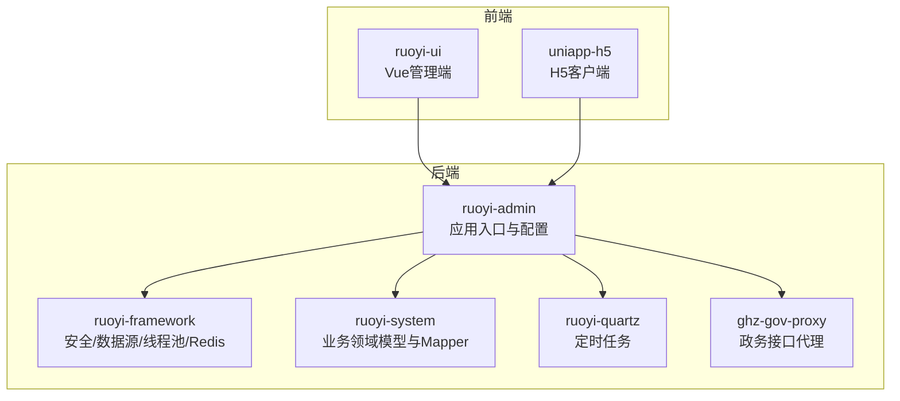
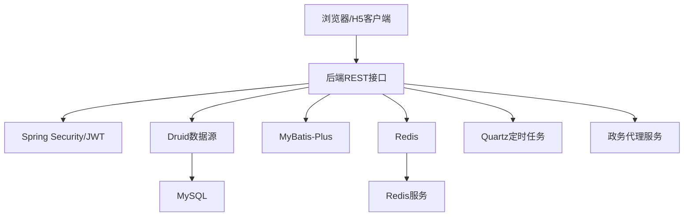
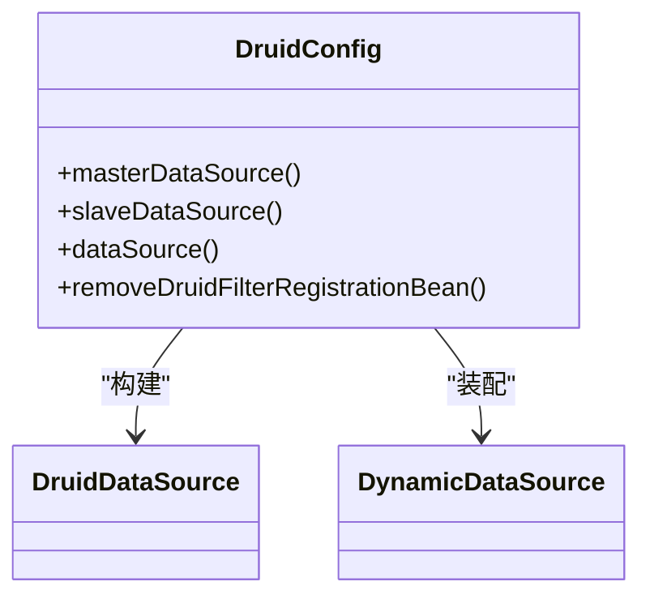
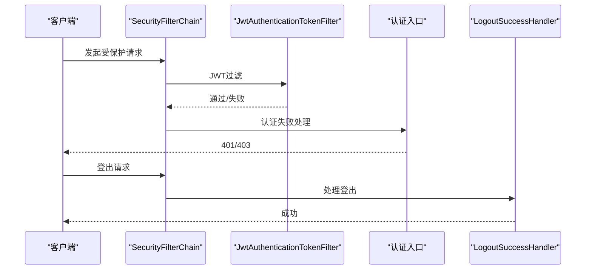
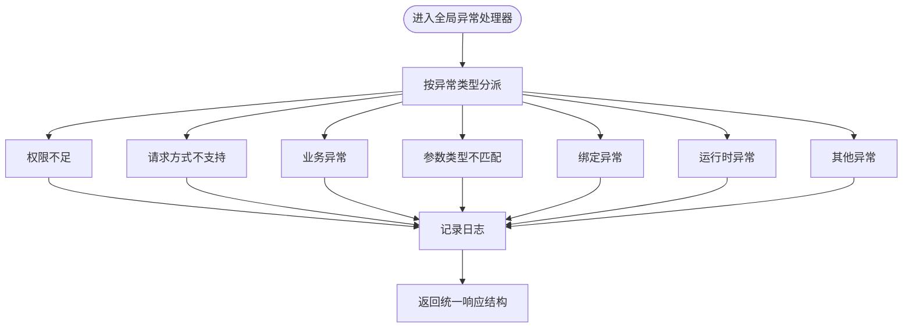
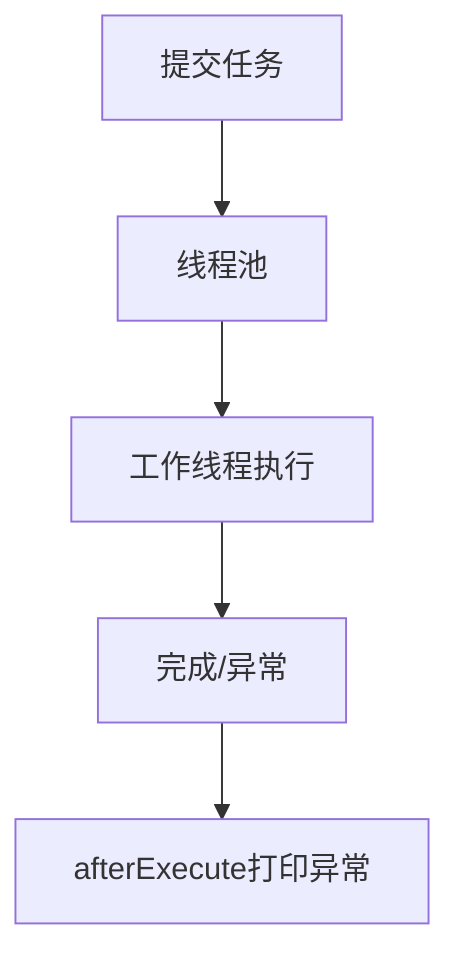
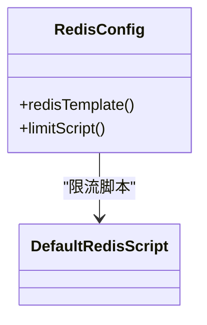
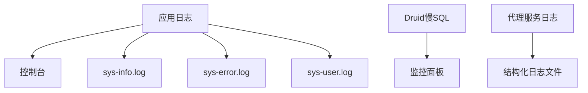
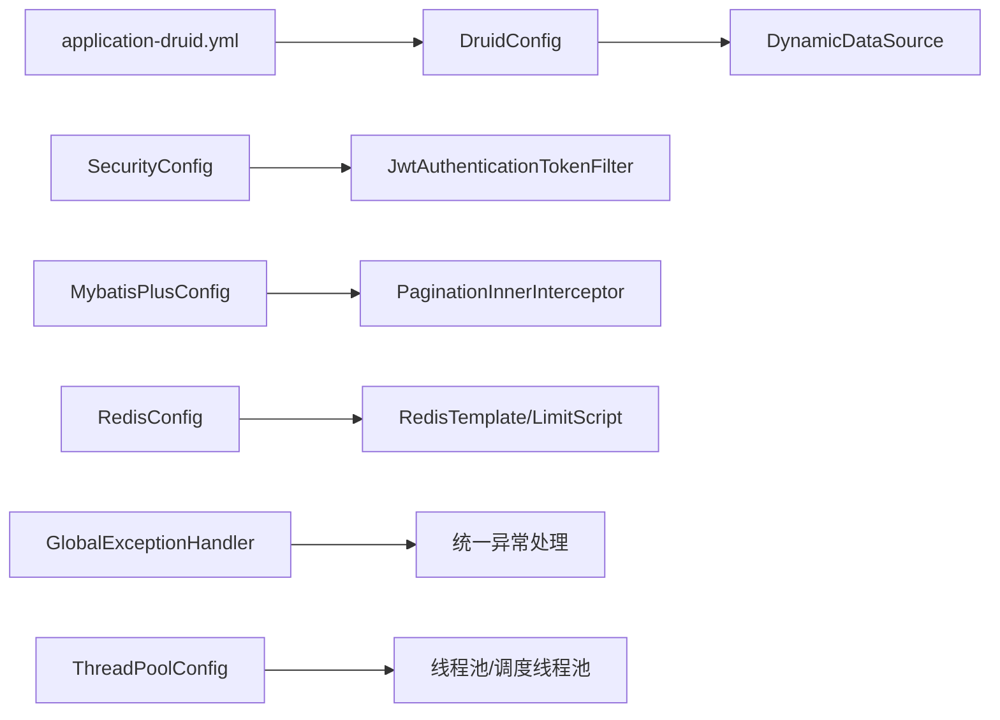

# 故障排除与维护

<cite>
**本文引用的文件**
- [application.yml](file://ruoyi-admin/src/main/resources/application.yml)
- [application-druid.yml](file://ruoyi-admin/src/main/resources/application-druid.yml)
- [logback.xml](file://ruoyi-admin/src/main/resources/logback.xml)
- [DruidConfig.java](file://ruoyi-framework/src/main/java/com/ruoyi/framework/config/DruidConfig.java)
- [MybatisPlusConfig.java](file://ruoyi-framework/src/main/java/com/ruoyi/framework/config/MybatisPlusConfig.java)
- [SecurityConfig.java](file://ruoyi-framework/src/main/java/com/ruoyi/framework/config/SecurityConfig.java)
- [GlobalExceptionHandler.java](file://ruoyi-framework/src/main/java/com/ruoyi/framework/web/exception/GlobalExceptionHandler.java)
- [ThreadPoolConfig.java](file://ruoyi-framework/src/main/java/com/ruoyi/framework/config/ThreadPoolConfig.java)
- [RedisConfig.java](file://ruoyi-framework/src/main/java/com/ruoyi/framework/config/RedisConfig.java)
- [application-prod.yml](file://ghz-gov-proxy/deploy/application-prod.yml)
- [run.bat](file://bin/run.bat)
- [migrate_hanggang_nanyuan.py](file://scripts/migrate_hanggang_nanyuan.py)
</cite>

## 目录
1. [简介](#简介)
2. [项目结构](#项目结构)
3. [核心组件](#核心组件)
4. [架构总览](#架构总览)
5. [详细组件分析](#详细组件分析)
6. [依赖分析](#依赖分析)
7. [性能考虑](#性能考虑)
8. [故障排除指南](#故障排除指南)
9. [结论](#结论)
10. [附录](#附录)

## 简介
本指南面向港好住信息系统运维与开发团队，聚焦系统故障排除与日常维护。内容涵盖系统启动失败、数据库连接异常、接口调用错误、性能瓶颈等常见问题的诊断与解决流程；提供数据备份恢复、系统重启、网络与硬件故障的应急处理步骤；总结定期维护计划、性能优化、安全加固、版本升级等最佳实践；并给出监控告警配置、处理流程与维护工具使用方法，帮助快速定位问题、降低停机时间、提升系统稳定性。

## 项目结构
系统采用前后端分离与多模块组合的架构，后端基于 Spring Boot 与 RuoYi 框架，包含管理后台、定时任务、数据访问层、安全与异常处理、日志与监控等模块。前端包含 Vue 管理端与 H5 客户端，另有政务接口代理服务模块。

**图表来源**
- [application.yml:1-238](file://ruoyi-admin/src/main/resources/application.yml#L1-L238)
- [SecurityConfig.java:1-135](file://ruoyi-framework/src/main/java/com/ruoyi/framework/config/SecurityConfig.java#L1-L135)
- [DruidConfig.java:1-127](file://ruoyi-framework/src/main/java/com/ruoyi/framework/config/DruidConfig.java#L1-L127)
- [ThreadPoolConfig.java:1-64](file://ruoyi-framework/src/main/java/com/ruoyi/framework/config/ThreadPoolConfig.java#L1-L64)
- [RedisConfig.java:1-71](file://ruoyi-framework/src/main/java/com/ruoyi/framework/config/RedisConfig.java#L1-L71)
- [application-prod.yml:1-26](file://ghz-gov-proxy/deploy/application-prod.yml#L1-L26)

**章节来源**
- [application.yml:1-238](file://ruoyi-admin/src/main/resources/application.yml#L1-L238)
- [application-druid.yml:1-64](file://ruoyi-admin/src/main/resources/application-druid.yml#L1-L64)

## 核心组件
- 应用配置与端口：服务器端口、上下文路径、Tomcat 线程与排队、文件上传大小、国际化与XSS防护、微信/电子签等第三方集成参数。
- 数据源与监控：Druid 连接池、主从库配置、慢SQL记录、控制台白名单与登录凭据。
- 安全与鉴权：基于 JWT 的无状态认证、跨域过滤、匿名放行路径、登出处理。
- 异常处理：全局异常捕获与统一返回，覆盖权限不足、请求方式不支持、业务异常、参数类型不匹配等。
- ORM 与分页：MyBatis-Plus 分页插件。
- 线程池与并发：固定核心/最大线程池、队列容量、拒绝策略与调度线程池。
- 缓存：Redis 序列化与限流脚本。
- 日志：控制台与滚动文件输出、INFO/ERROR 分离、用户操作日志。
- 政务代理：代理服务端口、API Key、日志级别与文件落盘。

**章节来源**
- [application.yml:1-238](file://ruoyi-admin/src/main/resources/application.yml#L1-L238)
- [application-druid.yml:1-64](file://ruoyi-admin/src/main/resources/application-druid.yml#L1-L64)
- [DruidConfig.java:1-127](file://ruoyi-framework/src/main/java/com/ruoyi/framework/config/DruidConfig.java#L1-L127)
- [MybatisPlusConfig.java:1-28](file://ruoyi-framework/src/main/java/com/ruoyi/framework/config/MybatisPlusConfig.java#L1-L28)
- [SecurityConfig.java:1-135](file://ruoyi-framework/src/main/java/com/ruoyi/framework/config/SecurityConfig.java#L1-L135)
- [GlobalExceptionHandler.java:1-146](file://ruoyi-framework/src/main/java/com/ruoyi/framework/web/exception/GlobalExceptionHandler.java#L1-L146)
- [ThreadPoolConfig.java:1-64](file://ruoyi-framework/src/main/java/com/ruoyi/framework/config/ThreadPoolConfig.java#L1-L64)
- [RedisConfig.java:1-71](file://ruoyi-framework/src/main/java/com/ruoyi/framework/config/RedisConfig.java#L1-L71)
- [logback.xml:1-93](file://ruoyi-admin/src/main/resources/logback.xml#L1-L93)
- [application-prod.yml:1-26](file://ghz-gov-proxy/deploy/application-prod.yml#L1-L26)

## 架构总览
系统后端以 Spring Boot 为核心，通过配置文件与框架配置类完成数据源、安全、缓存、线程池等基础设施装配。前端通过 REST 接口与后端交互，H5 客户端直接访问后端接口；政务接口通过独立代理服务转发。

**图表来源**
- [SecurityConfig.java:86-124](file://ruoyi-framework/src/main/java/com/ruoyi/framework/config/SecurityConfig.java#L86-L124)
- [DruidConfig.java:52-60](file://ruoyi-framework/src/main/java/com/ruoyi/framework/config/DruidConfig.java#L52-L60)
- [MybatisPlusConfig.java:20-26](file://ruoyi-framework/src/main/java/com/ruoyi/framework/config/MybatisPlusConfig.java#L20-L26)
- [RedisConfig.java:22-41](file://ruoyi-framework/src/main/java/com/ruoyi/framework/config/RedisConfig.java#L22-L41)
- [application-prod.yml:7-26](file://ghz-gov-proxy/deploy/application-prod.yml#L7-L26)

## 详细组件分析

### 数据库连接与监控（Druid）
- 主库地址与凭据、连接池初始/最小/最大连接数、获取连接超时、Socket 超时、空闲检测与失效时间、慢SQL阈值与记录。
- 控制台白名单与登录凭据，便于运维查看连接池状态与慢SQL。
- 动态数据源装配，支持主从切换（从库默认关闭）。

**图表来源**
- [DruidConfig.java:35-79](file://ruoyi-framework/src/main/java/com/ruoyi/framework/config/DruidConfig.java#L35-L79)
- [application-druid.yml:6-64](file://ruoyi-admin/src/main/resources/application-druid.yml#L6-L64)

**章节来源**
- [application-druid.yml:1-64](file://ruoyi-admin/src/main/resources/application-druid.yml#L1-L64)
- [DruidConfig.java:1-127](file://ruoyi-framework/src/main/java/com/ruoyi/framework/config/DruidConfig.java#L1-L127)

### 安全与鉴权（JWT + CORS）
- 禁用CSRF，无状态 Session，统一异常入口与登出处理。
- 允许匿名访问路径包括登录、注册、验证码、用户端 APP/H5 接口、静态资源、Swagger/Druid 页面。
- 添加 JWT 与 CORS 过滤器，确保跨域与认证链路正确。

**图表来源**
- [SecurityConfig.java:86-124](file://ruoyi-framework/src/main/java/com/ruoyi/framework/config/SecurityConfig.java#L86-L124)

**章节来源**
- [SecurityConfig.java:1-135](file://ruoyi-framework/src/main/java/com/ruoyi/framework/config/SecurityConfig.java#L1-L135)

### 全局异常处理
- 统一拦截权限不足、请求方式不支持、业务异常、参数类型不匹配、未知运行时异常、绑定异常等，并记录日志与返回标准结构。

**图表来源**
- [GlobalExceptionHandler.java:35-144](file://ruoyi-framework/src/main/java/com/ruoyi/framework/web/exception/GlobalExceptionHandler.java#L35-L144)

**章节来源**
- [GlobalExceptionHandler.java:1-146](file://ruoyi-framework/src/main/java/com/ruoyi/framework/web/exception/GlobalExceptionHandler.java#L1-L146)

### 线程池与并发
- 固定核心/最大线程池、队列容量、空闲存活时间、拒绝策略为调用方执行，避免丢弃任务。
- 调度线程池守护，afterExecute 中打印异常，便于排查任务执行问题。

**图表来源**
- [ThreadPoolConfig.java:48-62](file://ruoyi-framework/src/main/java/com/ruoyi/framework/config/ThreadPoolConfig.java#L48-L62)

**章节来源**
- [ThreadPoolConfig.java:1-64](file://ruoyi-framework/src/main/java/com/ruoyi/framework/config/ThreadPoolConfig.java#L1-L64)

### 缓存与限流
- RedisTemplate 序列化策略，Key/HashKey 使用字符串序列化，值使用 JSON 序列化。
- 提供限流脚本，基于 Lua 脚本实现滑动窗口限流。

**图表来源**
- [RedisConfig.java:22-70](file://ruoyi-framework/src/main/java/com/ruoyi/framework/config/RedisConfig.java#L22-L70)

**章节来源**
- [RedisConfig.java:1-71](file://ruoyi-framework/src/main/java/com/ruoyi/framework/config/RedisConfig.java#L1-L71)

### 日志与监控
- 控制台输出与滚动文件输出，INFO/ERROR 分离，用户操作日志单独输出。
- Druid 控制台慢SQL记录与白名单，便于定位慢查询与连接问题。
- 政务代理服务独立日志文件与级别配置。

**图表来源**
- [logback.xml:16-92](file://ruoyi-admin/src/main/resources/logback.xml#L16-L92)
- [application-druid.yml:58-61](file://ruoyi-admin/src/main/resources/application-druid.yml#L58-L61)
- [application-prod.yml:18-26](file://ghz-gov-proxy/deploy/application-prod.yml#L18-L26)

**章节来源**
- [logback.xml:1-93](file://ruoyi-admin/src/main/resources/logback.xml#L1-L93)
- [application-druid.yml:1-64](file://ruoyi-admin/src/main/resources/application-druid.yml#L1-L64)
- [application-prod.yml:1-26](file://ghz-gov-proxy/deploy/application-prod.yml#L1-L26)

### 政务接口代理
- 代理服务端口、API Key、日志级别与文件落盘，确保与后端通信安全与可观测。

**章节来源**
- [application-prod.yml:1-26](file://ghz-gov-proxy/deploy/application-prod.yml#L1-L26)

## 依赖分析
- 数据源依赖：DruidConfig 依赖 application-druid.yml 中的主从库配置，动态装配 DynamicDataSource。
- 安全依赖：SecurityConfig 依赖 PermitAllUrl 白名单与 JWT 过滤器，确保匿名访问与认证链路。
- ORM 依赖：MyBatis-PlusConfig 注入分页插件，影响查询性能与分页行为。
- 缓存依赖：RedisConfig 提供序列化与限流脚本，影响热点数据与接口限流。
- 异常处理：GlobalExceptionHandler 作为全局切面，统一处理各类异常。
- 线程池：ThreadPoolConfig 提供任务执行与调度线程池，影响异步任务与定时任务稳定性。

**图表来源**
- [application-druid.yml:1-64](file://ruoyi-admin/src/main/resources/application-druid.yml#L1-L64)
- [DruidConfig.java:52-60](file://ruoyi-framework/src/main/java/com/ruoyi/framework/config/DruidConfig.java#L52-L60)
- [SecurityConfig.java:86-124](file://ruoyi-framework/src/main/java/com/ruoyi/framework/config/SecurityConfig.java#L86-L124)
- [MybatisPlusConfig.java:20-26](file://ruoyi-framework/src/main/java/com/ruoyi/framework/config/MybatisPlusConfig.java#L20-L26)
- [RedisConfig.java:22-70](file://ruoyi-framework/src/main/java/com/ruoyi/framework/config/RedisConfig.java#L22-L70)
- [GlobalExceptionHandler.java:35-144](file://ruoyi-framework/src/main/java/com/ruoyi/framework/web/exception/GlobalExceptionHandler.java#L35-L144)
- [ThreadPoolConfig.java:32-62](file://ruoyi-framework/src/main/java/com/ruoyi/framework/config/ThreadPoolConfig.java#L32-L62)

**章节来源**
- [application-druid.yml:1-64](file://ruoyi-admin/src/main/resources/application-druid.yml#L1-L64)
- [DruidConfig.java:1-127](file://ruoyi-framework/src/main/java/com/ruoyi/framework/config/DruidConfig.java#L1-L127)
- [SecurityConfig.java:1-135](file://ruoyi-framework/src/main/java/com/ruoyi/framework/config/SecurityConfig.java#L1-L135)
- [MybatisPlusConfig.java:1-28](file://ruoyi-framework/src/main/java/com/ruoyi/framework/config/MybatisPlusConfig.java#L1-L28)
- [RedisConfig.java:1-71](file://ruoyi-framework/src/main/java/com/ruoyi/framework/config/RedisConfig.java#L1-L71)
- [GlobalExceptionHandler.java:1-146](file://ruoyi-framework/src/main/java/com/ruoyi/framework/web/exception/GlobalExceptionHandler.java#L1-L146)
- [ThreadPoolConfig.java:1-64](file://ruoyi-framework/src/main/java/com/ruoyi/framework/config/ThreadPoolConfig.java#L1-L64)

## 性能考虑
- 连接池参数：根据并发与数据库负载调整初始/最小/最大连接数、获取连接超时、空闲检测与失效时间，避免连接池耗尽或空闲连接过多。
- 线程池参数：根据任务类型与CPU核数调整核心/最大线程数、队列容量与拒绝策略，避免任务堆积或过早拒绝。
- 分页与慢SQL：启用分页插件，结合 Druid 慢SQL记录与阈值，定位慢查询并优化索引与SQL。
- 缓存命中：合理设置 Redis 序列化策略与过期时间，利用限流脚本保护下游服务。
- 日志级别：生产环境适度降低日志级别，减少IO开销，必要时开启慢SQL与结构化日志。

[本节为通用指导，无需列出具体文件来源]

## 故障排除指南

### 系统启动失败
- 检查端口占用与上下文路径配置，确认 server.port 与 context-path 合法。
- 查看日志输出，定位启动阶段异常；若为安全配置导致，检查匿名放行路径与JWT过滤器顺序。
- 若使用 DevTools 热部署，确认 devtools.restart.enabled 配置与打包产物一致性。

**章节来源**
- [application.yml:20-26](file://ruoyi-admin/src/main/resources/application.yml#L20-L26)
- [logback.xml:79-87](file://ruoyi-admin/src/main/resources/logback.xml#L79-L87)
- [SecurityConfig.java:86-124](file://ruoyi-framework/src/main/java/com/ruoyi/framework/config/SecurityConfig.java#L86-L124)

### 数据库连接异常
- 核对主库地址、用户名、密码与端口；确认网络连通性与防火墙策略。
- 检查连接池参数：initialSize/minIdle/maxActive/maxWait/connectTimeout/socketTimeout。
- 关注 Druid 控制台白名单与登录凭据，确认可访问 /druid/*。
- 若启用从库，检查 slave.enabled 与从库配置；默认从库关闭，避免误用。

**章节来源**
- [application-druid.yml:6-64](file://ruoyi-admin/src/main/resources/application-druid.yml#L6-L64)
- [DruidConfig.java:43-79](file://ruoyi-framework/src/main/java/com/ruoyi/framework/config/DruidConfig.java#L43-L79)

### 接口调用错误
- 权限不足：检查请求路径是否在匿名放行列表，或是否携带有效 JWT。
- 请求方式不支持：确认 HTTP 方法与控制器映射一致。
- 参数类型不匹配：检查请求体/路径变量类型与控制器签名一致。
- 业务异常：查看业务异常抛出处与错误码，结合日志定位上游调用。

**章节来源**
- [SecurityConfig.java:100-114](file://ruoyi-framework/src/main/java/com/ruoyi/framework/config/SecurityConfig.java#L100-L114)
- [GlobalExceptionHandler.java:35-91](file://ruoyi-framework/src/main/java/com/ruoyi/framework/web/exception/GlobalExceptionHandler.java#L35-L91)

### 性能瓶颈
- 慢SQL：通过 Druid 慢SQL记录与阈值定位，优化索引与SQL。
- 线程池饱和：观察队列长度与拒绝策略触发频率，调整线程池参数。
- 缓存命中率低：检查 Key 设计与过期策略，评估热点数据与限流脚本使用。

**章节来源**
- [application-druid.yml:58-61](file://ruoyi-admin/src/main/resources/application-druid.yml#L58-L61)
- [ThreadPoolConfig.java:32-43](file://ruoyi-framework/src/main/java/com/ruoyi/framework/config/ThreadPoolConfig.java#L32-L43)
- [RedisConfig.java:44-69](file://ruoyi-framework/src/main/java/com/ruoyi/framework/config/RedisConfig.java#L44-L69)

### 应急处理方案
- 数据库故障：优先隔离故障节点，切换至备用库；如需回滚，依据业务表 create_by 标记进行逆向操作。
- 网络故障：检查代理服务（如 ghz-gov-proxy）端口与 API Key，确认白名单与日志。
- 硬件故障：准备热备与快照，缩短RTO/RPO；执行系统重启脚本恢复服务。

**章节来源**
- [application-prod.yml:7-16](file://ghz-gov-proxy/deploy/application-prod.yml#L7-L16)
- [run.bat:9-11](file://bin/run.bat#L9-L11)

### 监控告警配置与处理流程
- 告警规则：数据库连接池超时/拒绝、慢SQL阈值、线程池队列积压、Redis 连接异常、代理服务错误日志。
- 通知机制：结合日志轮转与外部监控系统（如Prometheus/Grafana），设置阈值告警与邮件/IM通知。
- 处理流程：发现告警→查看日志与监控面板→定位异常类型→执行修复/回滚→复盘与优化。

**章节来源**
- [logback.xml:16-92](file://ruoyi-admin/src/main/resources/logback.xml#L16-L92)
- [application-druid.yml:58-61](file://ruoyi-admin/src/main/resources/application-druid.yml#L58-L61)
- [application-prod.yml:18-26](file://ghz-gov-proxy/deploy/application-prod.yml#L18-L26)

### 维护工具与脚本
- 数据迁移脚本：支持 DRY-RUN 预校验、异常汇总、按 tag 标记便于回滚；正式执行需二次确认参数。
- 系统重启：通过批处理脚本设置 JVM 参数并启动 jar 包。

**章节来源**
- [migrate_hanggang_nanyuan.py:700-753](file://scripts/migrate_hanggang_nanyuan.py#L700-L753)
- [run.bat:9-11](file://bin/run.bat#L9-L11)

## 结论
通过明确的配置项、完善的异常处理与监控日志、合理的线程池与缓存策略，以及标准化的应急处理与维护脚本，港好住信息系统能够在复杂环境中保持稳定运行。建议持续优化数据库索引与SQL、完善告警规则与演练、定期进行数据备份与迁移演练，以提升整体可靠性与可维护性。

[本节为总结性内容，无需列出具体文件来源]

## 附录

### 常见问题排查清单
- 启动失败：端口/上下文/安全过滤器/DevTools
- 数据库：连接串/凭据/连接池/慢SQL/从库
- 接口：权限/方法/参数/业务异常
- 性能：慢SQL/线程池/缓存命中率
- 应急：代理服务/API Key/日志/重启脚本

**章节来源**
- [application.yml:20-238](file://ruoyi-admin/src/main/resources/application.yml#L20-L238)
- [application-druid.yml:6-64](file://ruoyi-admin/src/main/resources/application-druid.yml#L6-L64)
- [SecurityConfig.java:86-124](file://ruoyi-framework/src/main/java/com/ruoyi/framework/config/SecurityConfig.java#L86-L124)
- [GlobalExceptionHandler.java:35-144](file://ruoyi-framework/src/main/java/com/ruoyi/framework/web/exception/GlobalExceptionHandler.java#L35-L144)
- [logback.xml:16-92](file://ruoyi-admin/src/main/resources/logback.xml#L16-L92)
- [application-prod.yml:7-26](file://ghz-gov-proxy/deploy/application-prod.yml#L7-L26)
- [run.bat:9-11](file://bin/run.bat#L9-L11)