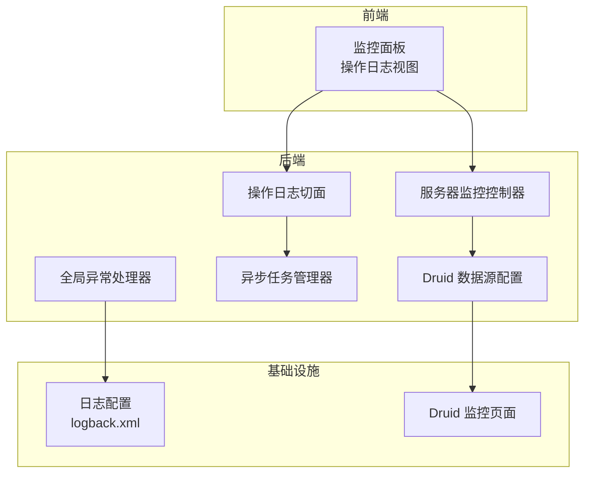
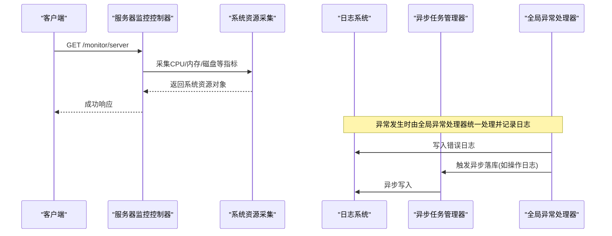
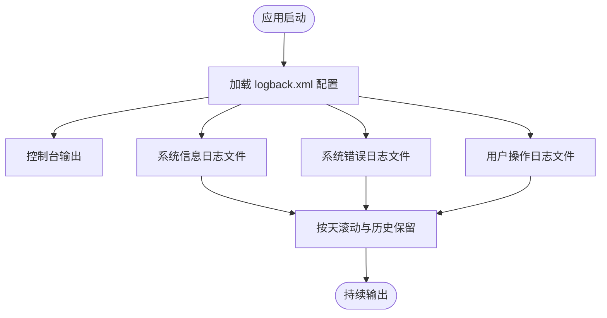
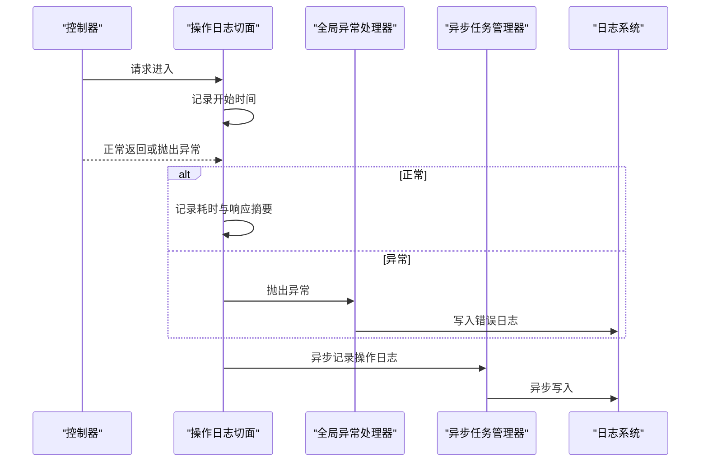
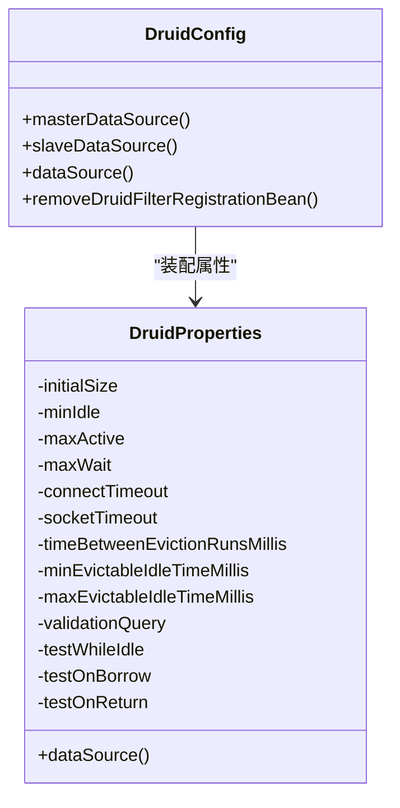
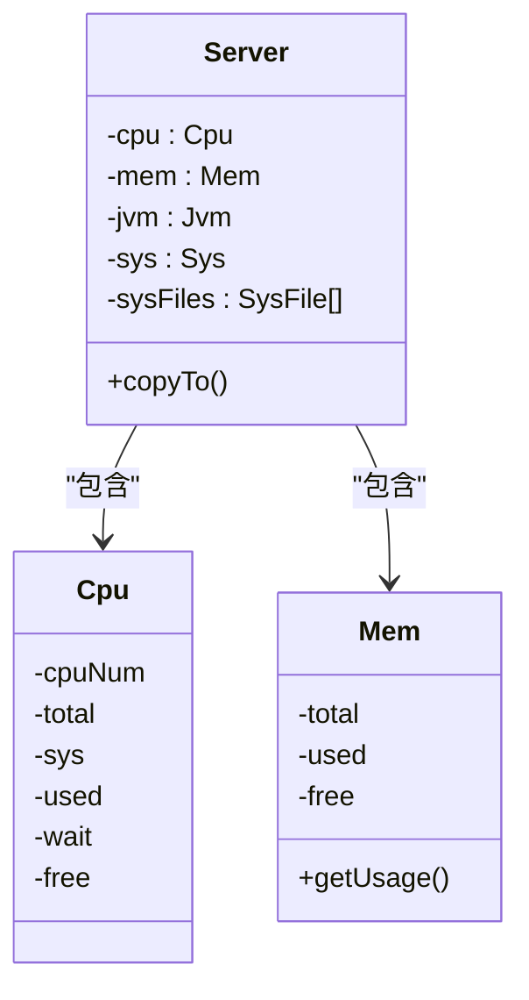
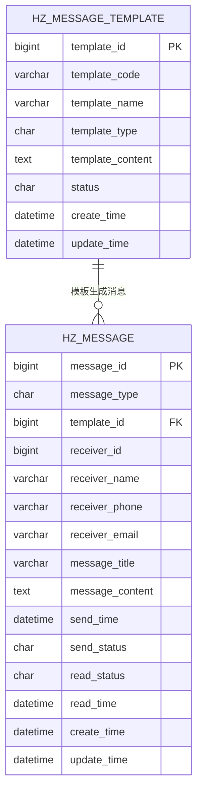
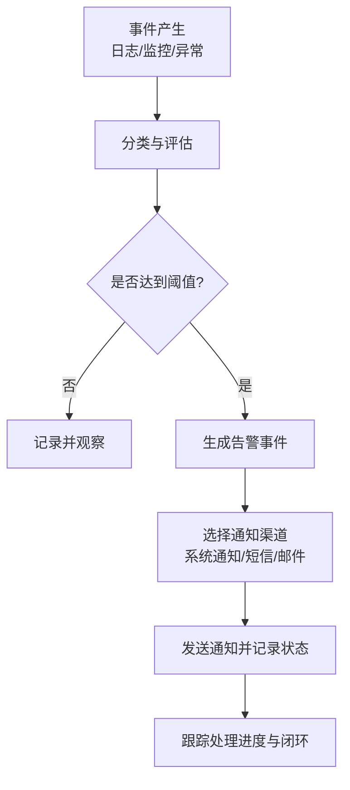
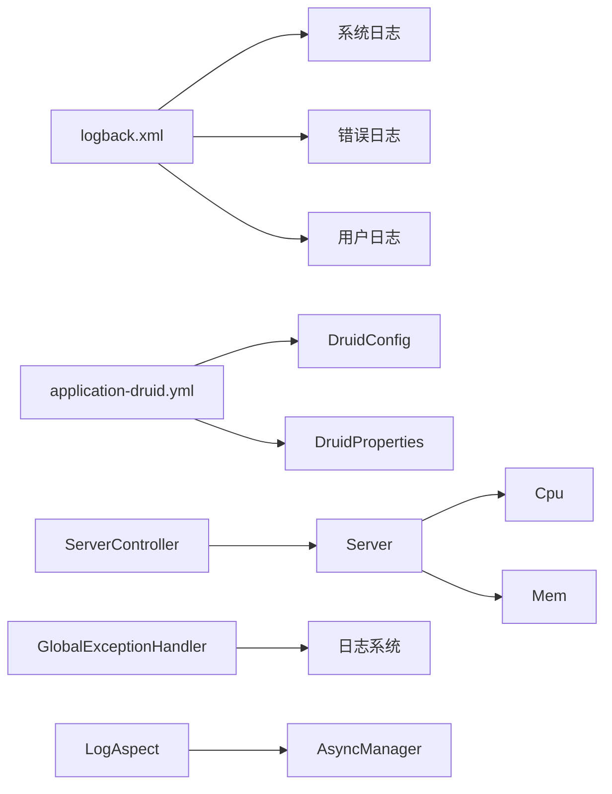

# 监控告警配置

<cite>
**本文引用的文件**
- [ruoyi-admin/src/main/resources/logback.xml](file://ruoyi-admin/src/main/resources/logback.xml)
- [ruoyi-admin/src/main/resources/application.yml](file://ruoyi-admin/src/main/resources/application.yml)
- [ruoyi-admin/src/main/resources/application-druid.yml](file://ruoyi-admin/src/main/resources/application-druid.yml)
- [ruoyi-framework/src/main/java/com/ruoyi/framework/aspectj/LogAspect.java](file://ruoyi-framework/src/main/java/com/ruoyi/framework/aspectj/LogAspect.java)
- [ruoyi-framework/src/main/java/com/ruoyi/framework/web/domain/Server.java](file://ruoyi-framework/src/main/java/com/ruoyi/framework/web/domain/Server.java)
- [ruoyi-framework/src/main/java/com/ruoyi/framework/web/domain/server/Cpu.java](file://ruoyi-framework/src/main/java/com/ruoyi/framework/web/domain/server/Cpu.java)
- [ruoyi-framework/src/main/java/com/ruoyi/framework/web/domain/server/Mem.java](file://ruoyi-framework/src/main/java/com/ruoyi/framework/web/domain/server/Mem.java)
- [ruoyi-admin/src/main/java/com/ruoyi/web/controller/monitor/ServerController.java](file://ruoyi-admin/src/main/java/com/ruoyi/web/controller/monitor/ServerController.java)
- [ruoyi-framework/src/main/java/com/ruoyi/framework/config/DruidConfig.java](file://ruoyi-framework/src/main/java/com/ruoyi/framework/config/DruidConfig.java)
- [ruoyi-framework/src/main/java/com/ruoyi/framework/config/properties/DruidProperties.java](file://ruoyi-framework/src/main/java/com/ruoyi/framework/config/properties/DruidProperties.java)
- [ruoyi-framework/src/main/java/com/ruoyi/framework/web/exception/GlobalExceptionHandler.java](file://ruoyi-framework/src/main/java/com/ruoyi/framework/web/exception/GlobalExceptionHandler.java)
- [ruoyi-framework/src/main/java/com/ruoyi/framework/manager/AsyncManager.java](file://ruoyi-framework/src/main/java/com/ruoyi/framework/manager/AsyncManager.java)
- [ruoyi-common/src/main/java/com/ruoyi/common/exception/GlobalException.java](file://ruoyi-common/src/main/java/com/ruoyi/common/exception/GlobalException.java)
- [ruoyi-common/src/main/java/com/ruoyi/common/utils/ExceptionUtil.java](file://ruoyi-common/src/main/java/com/ruoyi/common/utils/ExceptionUtil.java)
- [ruoyi-ui/src/views/monitor/operlog/index.vue](file://ruoyi-ui/src/views/monitor/operlog/index.vue)
- [docs/数据字典/09-消息通知.md](file://docs/数据字典/09-消息通知.md)
- [ghz-gov-proxy/src/main/resources/application.yml](file://ghz-gov-proxy/src/main/resources/application.yml)
</cite>

## 目录
1. [简介](#简介)
2. [项目结构](#项目结构)
3. [核心组件](#核心组件)
4. [架构总览](#架构总览)
5. [详细组件分析](#详细组件分析)
6. [依赖分析](#依赖分析)
7. [性能考虑](#性能考虑)
8. [故障排查指南](#故障排查指南)
9. [结论](#结论)
10. [附录](#附录)

## 简介
本指南面向港好住信息系统运维与开发团队，提供一套可落地的监控告警配置专业指南。内容涵盖系统监控指标设置、告警规则配置、日志监控策略、性能监控指标、告警通知机制以及告警处理流程设计。文档结合现有代码库中的日志配置、数据库监控、操作日志采集、异常处理与通知模型，给出可操作的配置示例与最佳实践。

## 项目结构
港好住系统采用前后端分离架构，后端基于 RuoYi 框架，包含统一的监控与日志基础设施。前端提供监控面板与操作日志展示界面。数据库连接池采用 Druid，并提供可视化监控页面。

**图表来源**
- [ruoyi-admin/src/main/java/com/ruoyi/web/controller/monitor/ServerController.java:1-27](file://ruoyi-admin/src/main/java/com/ruoyi/web/controller/monitor/ServerController.java#L1-L27)
- [ruoyi-framework/src/main/java/com/ruoyi/framework/aspectj/LogAspect.java:1-257](file://ruoyi-framework/src/main/java/com/ruoyi/framework/aspectj/LogAspect.java#L1-L257)
- [ruoyi-framework/src/main/java/com/ruoyi/framework/web/exception/GlobalExceptionHandler.java:1-146](file://ruoyi-framework/src/main/java/com/ruoyi/framework/web/exception/GlobalExceptionHandler.java#L1-L146)
- [ruoyi-framework/src/main/java/com/ruoyi/framework/manager/AsyncManager.java:1-56](file://ruoyi-framework/src/main/java/com/ruoyi/framework/manager/AsyncManager.java#L1-L56)
- [ruoyi-framework/src/main/java/com/ruoyi/framework/config/DruidConfig.java:1-127](file://ruoyi-framework/src/main/java/com/ruoyi/framework/config/DruidConfig.java#L1-L127)
- [ruoyi-admin/src/main/resources/logback.xml:1-93](file://ruoyi-admin/src/main/resources/logback.xml#L1-L93)

**章节来源**
- [ruoyi-admin/src/main/resources/logback.xml:1-93](file://ruoyi-admin/src/main/resources/logback.xml#L1-L93)
- [ruoyi-framework/src/main/java/com/ruoyi/framework/config/DruidConfig.java:1-127](file://ruoyi-framework/src/main/java/com/ruoyi/framework/config/DruidConfig.java#L1-L127)
- [ruoyi-admin/src/main/java/com/ruoyi/web/controller/monitor/ServerController.java:1-27](file://ruoyi-admin/src/main/java/com/ruoyi/web/controller/monitor/ServerController.java#L1-L27)

## 核心组件
- 日志与审计：通过 Logback 输出系统日志与用户操作日志，配合操作日志切面记录请求耗时、异常信息等。
- 数据库监控：Druid 提供连接池统计、慢 SQL 记录与监控页面。
- 服务器监控：提供 CPU、内存、磁盘等系统资源指标。
- 异常与告警：全局异常处理器统一拦截异常，结合日志与异步落库实现告警触发基础。
- 通知体系：消息模板与消息记录表支撑系统通知、短信、邮件等多通道通知。

**章节来源**
- [ruoyi-admin/src/main/resources/logback.xml:1-93](file://ruoyi-admin/src/main/resources/logback.xml#L1-L93)
- [ruoyi-framework/src/main/java/com/ruoyi/framework/aspectj/LogAspect.java:1-257](file://ruoyi-framework/src/main/java/com/ruoyi/framework/aspectj/LogAspect.java#L1-L257)
- [ruoyi-framework/src/main/java/com/ruoyi/framework/config/DruidConfig.java:1-127](file://ruoyi-framework/src/main/java/com/ruoyi/framework/config/DruidConfig.java#L1-L127)
- [ruoyi-framework/src/main/java/com/ruoyi/framework/web/domain/Server.java:1-61](file://ruoyi-framework/src/main/java/com/ruoyi/framework/web/domain/Server.java#L1-L61)
- [docs/数据字典/09-消息通知.md:1-51](file://docs/数据字典/09-消息通知.md#L1-L51)

## 架构总览
系统监控与告警的关键流转如下：

**图表来源**
- [ruoyi-admin/src/main/java/com/ruoyi/web/controller/monitor/ServerController.java:1-27](file://ruoyi-admin/src/main/java/com/ruoyi/web/controller/monitor/ServerController.java#L1-L27)
- [ruoyi-framework/src/main/java/com/ruoyi/framework/web/domain/Server.java:1-61](file://ruoyi-framework/src/main/java/com/ruoyi/framework/web/domain/Server.java#L1-L61)
- [ruoyi-framework/src/main/java/com/ruoyi/framework/web/exception/GlobalExceptionHandler.java:1-146](file://ruoyi-framework/src/main/java/com/ruoyi/framework/web/exception/GlobalExceptionHandler.java#L1-L146)
- [ruoyi-framework/src/main/java/com/ruoyi/framework/manager/AsyncManager.java:1-56](file://ruoyi-framework/src/main/java/com/ruoyi/framework/manager/AsyncManager.java#L1-L56)

## 详细组件分析

### 日志监控配置
- 日志输出：系统日志与错误日志分别输出到独立文件，按天滚动，保留历史天数可配置。
- 用户操作日志：独立 appender 输出到用户日志文件，便于审计与追踪。
- 日志级别：全局 info 级别，模块级别可按包名细化（如 com.ruoyi、org.springframework）。
- 建议：生产环境开启 ERROR 级别告警规则，结合日志轮转与归档策略，确保日志可检索性。

**图表来源**
- [ruoyi-admin/src/main/resources/logback.xml:1-93](file://ruoyi-admin/src/main/resources/logback.xml#L1-L93)

**章节来源**
- [ruoyi-admin/src/main/resources/logback.xml:1-93](file://ruoyi-admin/src/main/resources/logback.xml#L1-L93)

### 操作日志与异常监控
- 操作日志切面：统一记录请求耗时、异常信息、请求参数与响应摘要，异步落库，避免阻塞主线程。
- 全局异常处理：集中捕获各类异常，统一返回错误信息，同时记录日志，便于后续告警与定位。
- 建议：将异常信息与耗时纳入告警规则，如异常数量阈值、慢请求占比等。

**图表来源**
- [ruoyi-framework/src/main/java/com/ruoyi/framework/aspectj/LogAspect.java:1-257](file://ruoyi-framework/src/main/java/com/ruoyi/framework/aspectj/LogAspect.java#L1-L257)
- [ruoyi-framework/src/main/java/com/ruoyi/framework/web/exception/GlobalExceptionHandler.java:1-146](file://ruoyi-framework/src/main/java/com/ruoyi/framework/web/exception/GlobalExceptionHandler.java#L1-L146)
- [ruoyi-framework/src/main/java/com/ruoyi/framework/manager/AsyncManager.java:1-56](file://ruoyi-framework/src/main/java/com/ruoyi/framework/manager/AsyncManager.java#L1-L56)

**章节来源**
- [ruoyi-framework/src/main/java/com/ruoyi/framework/aspectj/LogAspect.java:1-257](file://ruoyi-framework/src/main/java/com/ruoyi/framework/aspectj/LogAspect.java#L1-L257)
- [ruoyi-framework/src/main/java/com/ruoyi/framework/web/exception/GlobalExceptionHandler.java:1-146](file://ruoyi-framework/src/main/java/com/ruoyi/framework/web/exception/GlobalExceptionHandler.java#L1-L146)
- [ruoyi-framework/src/main/java/com/ruoyi/framework/manager/AsyncManager.java:1-56](file://ruoyi-framework/src/main/java/com/ruoyi/framework/manager/AsyncManager.java#L1-L56)

### 数据库性能监控
- Druid 连接池：提供连接数、等待时间、超时、慢 SQL 等指标，支持可视化监控页面。
- 配置要点：初始化大小、最小/最大空闲、最大活跃、等待超时、连接超时、空闲回收周期、有效性检测等。
- 建议：开启慢 SQL 记录与统计，结合业务峰值流量设定阈值，异常时触发告警。

**图表来源**
- [ruoyi-framework/src/main/java/com/ruoyi/framework/config/DruidConfig.java:1-127](file://ruoyi-framework/src/main/java/com/ruoyi/framework/config/DruidConfig.java#L1-L127)
- [ruoyi-framework/src/main/java/com/ruoyi/framework/config/properties/DruidProperties.java:1-75](file://ruoyi-framework/src/main/java/com/ruoyi/framework/config/properties/DruidProperties.java#L1-L75)

**章节来源**
- [ruoyi-admin/src/main/resources/application-druid.yml:33-64](file://ruoyi-admin/src/main/resources/application-druid.yml#L33-L64)
- [ruoyi-framework/src/main/java/com/ruoyi/framework/config/DruidConfig.java:1-127](file://ruoyi-framework/src/main/java/com/ruoyi/framework/config/DruidConfig.java#L1-L127)
- [ruoyi-framework/src/main/java/com/ruoyi/framework/config/properties/DruidProperties.java:1-75](file://ruoyi-framework/src/main/java/com/ruoyi/framework/config/properties/DruidProperties.java#L1-L75)

### 服务器资源监控
- 指标采集：CPU 使用率、内存使用率、磁盘空间与使用率等。
- 接口暴露：通过监控控制器返回当前系统资源快照。
- 建议：将关键指标纳入告警规则，如 CPU 使用率连续超过阈值、内存使用率过高、磁盘剩余空间不足等。

**图表来源**
- [ruoyi-framework/src/main/java/com/ruoyi/framework/web/domain/Server.java:1-61](file://ruoyi-framework/src/main/java/com/ruoyi/framework/web/domain/Server.java#L1-L61)
- [ruoyi-framework/src/main/java/com/ruoyi/framework/web/domain/server/Cpu.java:1-101](file://ruoyi-framework/src/main/java/com/ruoyi/framework/web/domain/server/Cpu.java#L1-L101)
- [ruoyi-framework/src/main/java/com/ruoyi/framework/web/domain/server/Mem.java:1-61](file://ruoyi-framework/src/main/java/com/ruoyi/framework/web/domain/server/Mem.java#L1-L61)

**章节来源**
- [ruoyi-admin/src/main/java/com/ruoyi/web/controller/monitor/ServerController.java:1-27](file://ruoyi-admin/src/main/java/com/ruoyi/web/controller/monitor/ServerController.java#L1-L27)
- [ruoyi-framework/src/main/java/com/ruoyi/framework/web/domain/Server.java:1-61](file://ruoyi-framework/src/main/java/com/ruoyi/framework/web/domain/Server.java#L1-L61)
- [ruoyi-framework/src/main/java/com/ruoyi/framework/web/domain/server/Cpu.java:1-101](file://ruoyi-framework/src/main/java/com/ruoyi/framework/web/domain/server/Cpu.java#L1-L101)
- [ruoyi-framework/src/main/java/com/ruoyi/framework/web/domain/server/Mem.java:1-61](file://ruoyi-framework/src/main/java/com/ruoyi/framework/web/domain/server/Mem.java#L1-L61)

### 告警通知机制
- 通知模型：消息模板表与消息记录表支撑系统通知、短信、邮件三类通知类型。
- 建议：将异常与性能阈值触发的通知接入该模型，实现统一的发送与状态跟踪。

**图表来源**
- [docs/数据字典/09-消息通知.md:1-51](file://docs/数据字典/09-消息通知.md#L1-L51)

**章节来源**
- [docs/数据字典/09-消息通知.md:1-51](file://docs/数据字典/09-消息通知.md#L1-L51)

### 告警处理流程设计
- 告警接收：日志与数据库监控产生事件，异常处理器统一记录。
- 分类处理：区分业务异常、性能异常、资源异常等类别。
- 升级机制：同一类告警在短时间内重复触发，自动升级至更高优先级。
- 处理记录：通过消息模板与消息记录表实现通知与闭环跟踪。

[本图为概念性流程，无需图表来源]

## 依赖分析
- 日志配置依赖于 logback.xml 的 appender 与 logger 定义，控制台、系统日志、错误日志与用户日志分别输出。
- 数据库监控依赖 Druid 配置与属性注入，提供连接池与慢 SQL 统计。
- 服务器监控依赖系统信息采集组件，封装 CPU、内存、磁盘等指标。
- 异常处理与操作日志依赖 Spring AOP 与异步任务管理器，保证非阻塞与可靠性。

**图表来源**
- [ruoyi-admin/src/main/resources/logback.xml:1-93](file://ruoyi-admin/src/main/resources/logback.xml#L1-L93)
- [ruoyi-admin/src/main/resources/application-druid.yml:33-64](file://ruoyi-admin/src/main/resources/application-druid.yml#L33-L64)
- [ruoyi-framework/src/main/java/com/ruoyi/framework/config/DruidConfig.java:1-127](file://ruoyi-framework/src/main/java/com/ruoyi/framework/config/DruidConfig.java#L1-L127)
- [ruoyi-framework/src/main/java/com/ruoyi/framework/config/properties/DruidProperties.java:1-75](file://ruoyi-framework/src/main/java/com/ruoyi/framework/config/properties/DruidProperties.java#L1-L75)
- [ruoyi-admin/src/main/java/com/ruoyi/web/controller/monitor/ServerController.java:1-27](file://ruoyi-admin/src/main/java/com/ruoyi/web/controller/monitor/ServerController.java#L1-L27)
- [ruoyi-framework/src/main/java/com/ruoyi/framework/web/domain/Server.java:1-61](file://ruoyi-framework/src/main/java/com/ruoyi/framework/web/domain/Server.java#L1-L61)
- [ruoyi-framework/src/main/java/com/ruoyi/framework/web/exception/GlobalExceptionHandler.java:1-146](file://ruoyi-framework/src/main/java/com/ruoyi/framework/web/exception/GlobalExceptionHandler.java#L1-L146)
- [ruoyi-framework/src/main/java/com/ruoyi/framework/aspectj/LogAspect.java:1-257](file://ruoyi-framework/src/main/java/com/ruoyi/framework/aspectj/LogAspect.java#L1-L257)
- [ruoyi-framework/src/main/java/com/ruoyi/framework/manager/AsyncManager.java:1-56](file://ruoyi-framework/src/main/java/com/ruoyi/framework/manager/AsyncManager.java#L1-L56)

**章节来源**
- [ruoyi-admin/src/main/resources/logback.xml:1-93](file://ruoyi-admin/src/main/resources/logback.xml#L1-L93)
- [ruoyi-admin/src/main/resources/application-druid.yml:33-64](file://ruoyi-admin/src/main/resources/application-druid.yml#L33-L64)
- [ruoyi-framework/src/main/java/com/ruoyi/framework/config/DruidConfig.java:1-127](file://ruoyi-framework/src/main/java/com/ruoyi/framework/config/DruidConfig.java#L1-L127)
- [ruoyi-framework/src/main/java/com/ruoyi/framework/web/domain/Server.java:1-61](file://ruoyi-framework/src/main/java/com/ruoyi/framework/web/domain/Server.java#L1-L61)
- [ruoyi-framework/src/main/java/com/ruoyi/framework/web/exception/GlobalExceptionHandler.java:1-146](file://ruoyi-framework/src/main/java/com/ruoyi/framework/web/exception/GlobalExceptionHandler.java#L1-L146)
- [ruoyi-framework/src/main/java/com/ruoyi/framework/aspectj/LogAspect.java:1-257](file://ruoyi-framework/src/main/java/com/ruoyi/framework/aspectj/LogAspect.java#L1-L257)
- [ruoyi-framework/src/main/java/com/ruoyi/framework/manager/AsyncManager.java:1-56](file://ruoyi-framework/src/main/java/com/ruoyi/framework/manager/AsyncManager.java#L1-L56)

## 性能考虑
- 日志输出：INFO/ERROR 分离与按天滚动，避免单文件过大；合理设置保留天数。
- 数据库连接池：根据业务峰值调整初始大小、最大活跃与等待超时，启用空闲回收与有效性检测。
- 操作日志：异步落库降低对主请求的影响；对敏感字段进行脱敏处理。
- 服务器监控：定期采集指标，避免频繁系统调用造成额外负载。

[本节为通用指导，无需章节来源]

## 故障排查指南
- 日志定位：通过错误日志快速定位异常堆栈；结合操作日志查看请求参数与耗时。
- 数据库问题：关注慢 SQL 与连接池状态；检查连接超时与空闲回收配置。
- 异常处理：确认全局异常处理器是否正确拦截异常并记录；核对返回码与消息。
- 通知问题：核对消息模板与接收人信息；检查发送状态与阅读状态字段。

**章节来源**
- [ruoyi-framework/src/main/java/com/ruoyi/framework/web/exception/GlobalExceptionHandler.java:1-146](file://ruoyi-framework/src/main/java/com/ruoyi/framework/web/exception/GlobalExceptionHandler.java#L1-L146)
- [ruoyi-common/src/main/java/com/ruoyi/common/utils/ExceptionUtil.java:1-39](file://ruoyi-common/src/main/java/com/ruoyi/common/utils/ExceptionUtil.java#L1-L39)
- [ruoyi-common/src/main/java/com/ruoyi/common/exception/GlobalException.java:1-58](file://ruoyi-common/src/main/java/com/ruoyi/common/exception/GlobalException.java#L1-L58)
- [ruoyi-ui/src/views/monitor/operlog/index.vue:188-210](file://ruoyi-ui/src/views/monitor/operlog/index.vue#L188-L210)

## 结论
通过现有日志、异常处理、数据库监控与服务器监控能力，港好住系统具备完善的监控告警基础。建议在此基础上完善告警规则与通知机制，形成从“事件发现—分类—升级—通知—闭环”的完整告警管理体系，并结合实际业务场景持续优化阈值与策略。

[本节为总结，无需章节来源]

## 附录
- 配置参考
  - 日志配置：[ruoyi-admin/src/main/resources/logback.xml:1-93](file://ruoyi-admin/src/main/resources/logback.xml#L1-L93)
  - 数据库监控：[ruoyi-admin/src/main/resources/application-druid.yml:33-64](file://ruoyi-admin/src/main/resources/application-druid.yml#L33-L64)
  - 服务器监控：[ruoyi-admin/src/main/java/com/ruoyi/web/controller/monitor/ServerController.java:1-27](file://ruoyi-admin/src/main/java/com/ruoyi/web/controller/monitor/ServerController.java#L1-L27)
  - 通知模型：[docs/数据字典/09-消息通知.md:1-51](file://docs/数据字典/09-消息通知.md#L1-L51)
  - 政务代理日志级别：[ghz-gov-proxy/src/main/resources/application.yml:1-12](file://ghz-gov-proxy/src/main/resources/application.yml#L1-L12)