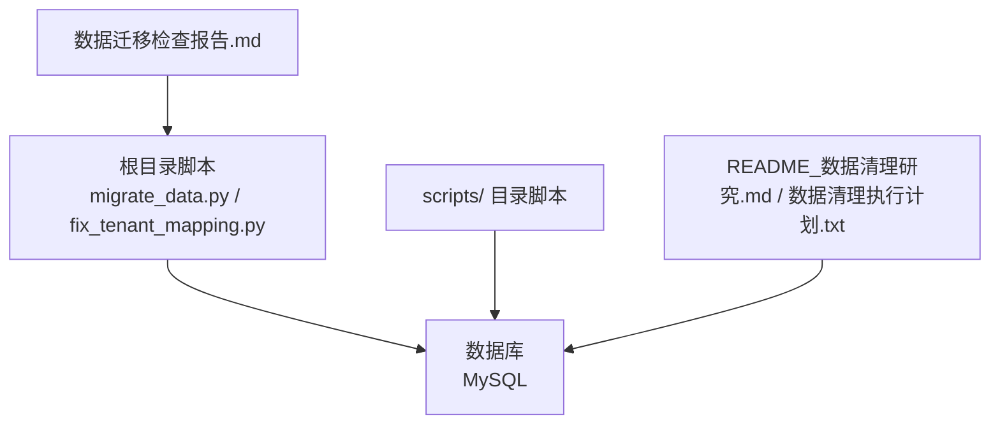
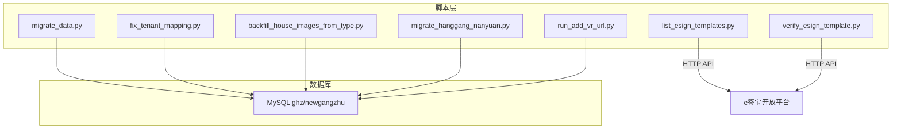
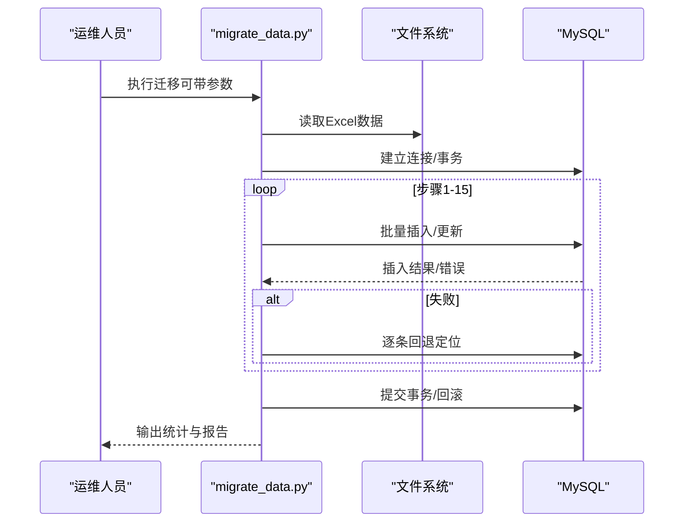
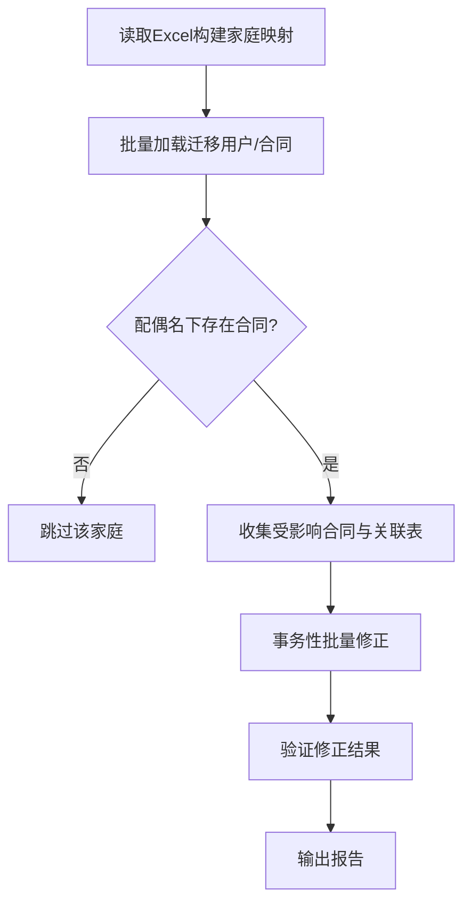
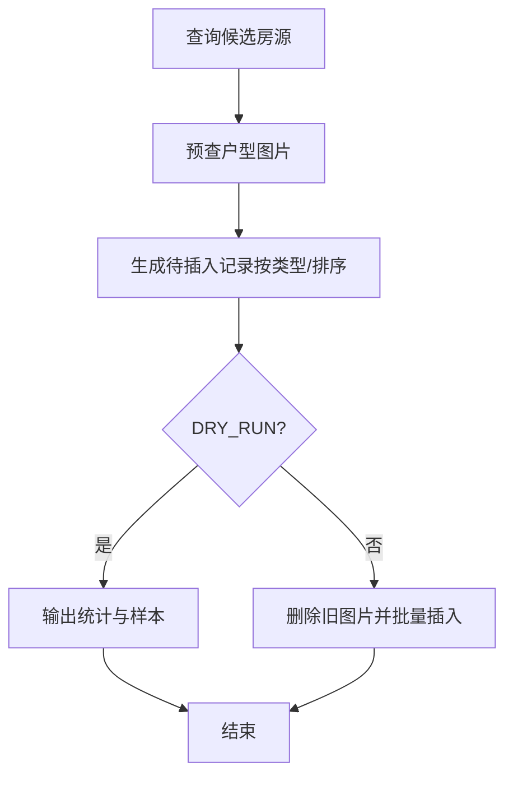
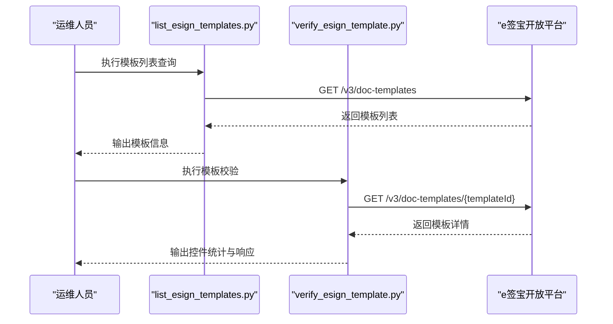
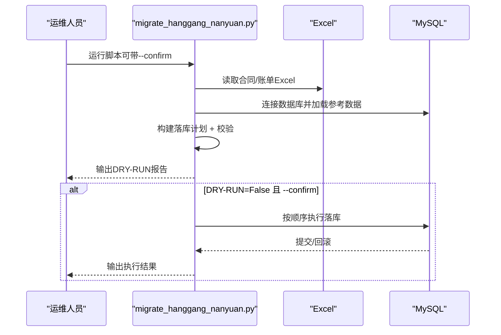
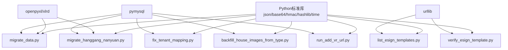

# 维护工具与脚本

<cite>
**本文引用的文件**
- [migrate_data.py](file://migrate_data.py)
- [fix_tenant_mapping.py](file://fix_tenant_mapping.py)
- [scripts/backfill_house_images_from_type.py](file://scripts/backfill_house_images_from_type.py)
- [scripts/list_esign_templates.py](file://scripts/list_esign_templates.py)
- [scripts/verify_esign_template.py](file://scripts/verify_esign_template.py)
- [scripts/run_add_vr_url.py](file://scripts/run_add_vr_url.py)
- [scripts/migrate_hanggang_nanyuan.py](file://scripts/migrate_hanggang_nanyuan.py)
- [数据迁移检查报告.md](file://数据迁移检查报告.md)
- [README_数据清理研究.md](file://README_数据清理研究.md)
- [数据清理执行计划.txt](file://数据清理执行计划.txt)
</cite>

## 目录
1. [简介](#简介)
2. [项目结构](#项目结构)
3. [核心组件](#核心组件)
4. [架构总览](#架构总览)
5. [详细组件分析](#详细组件分析)
6. [依赖分析](#依赖分析)
7. [性能考量](#性能考量)
8. [故障排查指南](#故障排查指南)
9. [结论](#结论)
10. [附录](#附录)

## 简介
本指南面向港好住信息系统运维与开发人员，系统化介绍仓库内的各类维护工具与Python脚本，涵盖数据修复、数据迁移、电子合同模板管理、数据清理与批量补全等场景。文档提供使用方法、执行流程、安全注意事项、错误处理与最佳实践，并给出可扩展的自定义脚本开发思路与实际案例。

## 项目结构
- 维护脚本集中在根目录与 scripts/ 目录：
  - 根目录脚本：migrate_data.py（全量迁移）、fix_tenant_mapping.py（租户映射修复）、数据迁移检查报告、数据清理相关文档
  - scripts/ 目录脚本：批量补图、电子合同模板查询/校验、航港南苑试点迁移、VR字段补全等
- 仓库还包含系统文档与数据字典，便于理解业务表结构与字段含义

图表来源
- [migrate_data.py:1-120](file://migrate_data.py#L1-L120)
- [fix_tenant_mapping.py:1-60](file://fix_tenant_mapping.py#L1-L60)
- [scripts/backfill_house_images_from_type.py:1-60](file://scripts/backfill_house_images_from_type.py#L1-L60)
- [scripts/migrate_hanggang_nanyuan.py:1-60](file://scripts/migrate_hanggang_nanyuan.py#L1-L60)

章节来源
- [migrate_data.py:1-120](file://migrate_data.py#L1-L120)
- [fix_tenant_mapping.py:1-60](file://fix_tenant_mapping.py#L1-L60)
- [scripts/backfill_house_images_from_type.py:1-60](file://scripts/backfill_house_images_from_type.py#L1-L60)
- [scripts/migrate_hanggang_nanyuan.py:1-60](file://scripts/migrate_hanggang_nanyuan.py#L1-L60)

## 核心组件
- 数据迁移脚本（migrate_data.py）
  - 功能：从Excel读取老系统数据，清洗转换后导入新系统MySQL数据库，支持断点续传、批量插入、ID映射与统计
  - 关键特性：步骤化迁移（1-15步）、枚举映射、批量插入、错误降级（逐条回退）、断点续传
- 租户映射修复脚本（fix_tenant_mapping.py）
  - 功能：修复“2人家庭”合同tenant_id映射错误，基于Excel与数据库批量排查与修正
  - 关键特性：批量加载用户、合同、账单、入住/退租/申请/缴费/签署记录，事务性修正与验证
- 批量补图脚本（scripts/backfill_house_images_from_type.py）
  - 功能：按户型图片规则批量补齐老房源图片，支持DRY_RUN模式
  - 关键特性：严格复刻前端补图流程、按类型与排序生成记录、覆盖策略（删除后批量插入）
- 电子合同模板管理脚本（scripts/list_esign_templates.py、scripts/verify_esign_template.py）
  - 功能：查询/校验e签宝正式环境模板有效性，复刻签名算法
  - 关键特性：标准HTTP签名头构造、模板列表与详情输出
- 航港南苑试点迁移脚本（scripts/migrate_hanggang_nanyuan.py）
  - 功能：航港南苑试点数据导入（合同/入住/退租/账单/用户），支持DRY-RUN与确认执行
  - 关键特性：预校验报告、落库计划、按tag回滚、批量插入加速
- VR字段补全脚本（scripts/run_add_vr_url.py）
  - 功能：幂等为hz_house_type表增加vr_url列
  - 关键特性：存在性检查、验证、幂等执行
- 数据清理研究与执行计划
  - 功能：系统化研究与制定测试数据清理的19步执行计划，强调顺序与回滚
  - 关键特性：前置检查、分层删除、SQL模板、验证与回滚

章节来源
- [migrate_data.py:1-200](file://migrate_data.py#L1-L200)
- [fix_tenant_mapping.py:1-120](file://fix_tenant_mapping.py#L1-L120)
- [scripts/backfill_house_images_from_type.py:1-120](file://scripts/backfill_house_images_from_type.py#L1-L120)
- [scripts/list_esign_templates.py:1-58](file://scripts/list_esign_templates.py#L1-L58)
- [scripts/verify_esign_template.py:1-83](file://scripts/verify_esign_template.py#L1-L83)
- [scripts/migrate_hanggang_nanyuan.py:1-120](file://scripts/migrate_hanggang_nanyuan.py#L1-L120)
- [scripts/run_add_vr_url.py:1-48](file://scripts/run_add_vr_url.py#L1-L48)
- [README_数据清理研究.md:1-120](file://README_数据清理研究.md#L1-L120)
- [数据清理执行计划.txt:1-120](file://数据清理执行计划.txt#L1-L120)

## 架构总览
下图展示维护脚本与数据库之间的交互关系，以及典型执行流程（迁移、修复、补图、模板校验、试点迁移、清理）。

图表来源
- [migrate_data.py:1-120](file://migrate_data.py#L1-L120)
- [fix_tenant_mapping.py:1-120](file://fix_tenant_mapping.py#L1-L120)
- [scripts/backfill_house_images_from_type.py:1-120](file://scripts/backfill_house_images_from_type.py#L1-L120)
- [scripts/migrate_hanggang_nanyuan.py:1-120](file://scripts/migrate_hanggang_nanyuan.py#L1-L120)
- [scripts/list_esign_templates.py:1-58](file://scripts/list_esign_templates.py#L1-L58)
- [scripts/verify_esign_template.py:1-83](file://scripts/verify_esign_template.py#L1-L83)
- [scripts/run_add_vr_url.py:1-48](file://scripts/run_add_vr_url.py#L1-L48)

## 详细组件分析

### 数据迁移脚本（migrate_data.py）
- 使用方法
  - 全量迁移：python3 migrate_data.py
  - 仅输出SQL不执行：python3 migrate_data.py --dry-run
  - 指定步骤：python3 migrate_data.py --step 1
  - 从某步开始：python3 migrate_data.py --from-step 3
  - 只导入活跃数据：python3 migrate_data.py --filter-active
- 关键步骤（1-15）
  - 1：导入项目（hz_project）
  - 2：导入楼栋（hz_building）
  - 3：导入单元（hz_unit）
  - 4：导入户型（hz_house_type）
  - 5：导入房源（hz_house）
  - 6：导入租户（hz_tenant）
  - 6.5：从租户创建用户（hz_user），并按手机号去重
  - 7-15：导入合同、账单、缴费、入住、退租、签署、交换、黑名单等
- 断点续传
  - 使用IdMapper保存映射关系，支持从断点继续执行
- 错误处理
  - 批量插入失败时逐条插入定位问题
  - 统一异常捕获与日志输出
- 安全与最佳实践
  - 建议先dry-run，核对统计与映射
  - 使用事务包裹，失败回滚
  - 注意过滤活跃数据以减少冗余

图表来源
- [migrate_data.py:360-750](file://migrate_data.py#L360-L750)
- [migrate_data.py:146-180](file://migrate_data.py#L146-L180)

章节来源
- [migrate_data.py:1-200](file://migrate_data.py#L1-L200)
- [migrate_data.py:360-750](file://migrate_data.py#L360-L750)
- [数据迁移检查报告.md:150-350](file://数据迁移检查报告.md#L150-L350)

### 租户映射修复脚本（fix_tenant_mapping.py）
- 场景
  - 修复“2人家庭”合同tenant_id映射错误：主申请人与配偶共享资格证号，配偶的user_id被错误关联到合同
- 执行流程
  - Step 1：从Excel构建2人家庭映射
  - Step 2-5：批量加载用户、合同、账单、入住/退租/申请/缴费/签署记录，排查并批量修正
  - 事务性修正与验证，输出修正报告
- 安全与最佳实践
  - 仅对create_by='migration'的迁移数据进行修正
  - 修正前先输出明细与统计
  - 修正后进行验证，确保tenant_id已切换为主申请人

图表来源
- [fix_tenant_mapping.py:53-210](file://fix_tenant_mapping.py#L53-L210)
- [fix_tenant_mapping.py:273-442](file://fix_tenant_mapping.py#L273-L442)

章节来源
- [fix_tenant_mapping.py:1-200](file://fix_tenant_mapping.py#L1-L200)
- [fix_tenant_mapping.py:273-442](file://fix_tenant_mapping.py#L273-L442)

### 批量补图脚本（scripts/backfill_house_images_from_type.py）
- 场景
  - 为“有户型但无图片”的老房源批量补齐图片，严格复刻前端补图流程
- 执行流程
  - 查询候选房源（有house_type_id且无有效图片）
  - 预查户型图片，按类型与排序生成待插入记录
  - DRY_RUN模式仅统计，正式模式覆盖删除后批量插入
- 安全与最佳实践
  - DRY_RUN模式先统计将补图数量、按类型分布与样本
  - 正式执行前务必确认覆盖策略与事务回滚

图表来源
- [scripts/backfill_house_images_from_type.py:102-237](file://scripts/backfill_house_images_from_type.py#L102-L237)

章节来源
- [scripts/backfill_house_images_from_type.py:1-200](file://scripts/backfill_house_images_from_type.py#L1-L200)

### 电子合同模板管理脚本（scripts/list_esign_templates.py、scripts/verify_esign_template.py）
- 场景
  - 查询/校验e签宝正式环境模板有效性，复刻签名算法
- 使用方法
  - 列出模板：python3 scripts/list_esign_templates.py
  - 校验模板：python3 scripts/verify_esign_template.py（输出模板详情与控件统计）
- 安全与最佳实践
  - 严格遵循e签宝v3签名规范，确保HTTP头与签名一致
  - 校验失败时保存完整响应以便排查

图表来源
- [scripts/list_esign_templates.py:1-58](file://scripts/list_esign_templates.py#L1-L58)
- [scripts/verify_esign_template.py:1-83](file://scripts/verify_esign_template.py#L1-L83)

章节来源
- [scripts/list_esign_templates.py:1-58](file://scripts/list_esign_templates.py#L1-L58)
- [scripts/verify_esign_template.py:1-83](file://scripts/verify_esign_template.py#L1-L83)

### 航港南苑试点迁移脚本（scripts/migrate_hanggang_nanyuan.py）
- 场景
  - 航港南苑试点数据导入（合同/入住/退租/账单/用户），支持DRY-RUN与确认执行
- 执行流程
  - 读取Excel → 加载目标库参考数据 → 构建落库计划（含异常收集）→ 输出报告 → 可选正式执行
- 安全与最佳实践
  - DRY_RUN=True时仅统计，不落库；确认无误后加--confirm执行
  - 所有记录create_by='migration_hanggang'，便于回滚
  - 落库顺序：users_update → users_new → contracts → checkin → checkout → bills

图表来源
- [scripts/migrate_hanggang_nanyuan.py:700-753](file://scripts/migrate_hanggang_nanyuan.py#L700-L753)

章节来源
- [scripts/migrate_hanggang_nanyuan.py:1-200](file://scripts/migrate_hanggang_nanyuan.py#L1-L200)
- [scripts/migrate_hanggang_nanyuan.py:700-753](file://scripts/migrate_hanggang_nanyuan.py#L700-L753)

### VR字段补全脚本（scripts/run_add_vr_url.py）
- 场景
  - 幂等为hz_house_type表增加vr_url列（新增房源选中户型时自动继承）
- 执行流程
  - 检查列是否存在 → 不存在则执行ALTER → 验证成功
- 安全与最佳实践
  - 幂等执行，避免重复ALTER
  - 建议在维护窗口执行

章节来源
- [scripts/run_add_vr_url.py:1-48](file://scripts/run_add_vr_url.py#L1-L48)

### 数据清理研究与执行计划
- 场景
  - 研究并制定测试数据清理的19步执行计划，强调顺序与回滚
- 执行要点
  - 前置检查：备份、业务确认、用户隔离、系统准备、测试验证
  - 分层删除：从叶子表到根表，严格顺序执行
  - SQL模板：提供每步删除SQL模板与分批建议
  - 验证与回滚：删除后验证、应用测试、回滚方案
- 安全与最佳实践
  - 逻辑删除（UPDATE...SET del_flag='1'）优于物理删除
  - 大批量删除建议分批执行
  - 高峰期外执行，保留完整日志

章节来源
- [README_数据清理研究.md:150-305](file://README_数据清理研究.md#L150-L305)
- [数据清理执行计划.txt:53-376](file://数据清理执行计划.txt#L53-L376)

## 依赖分析
- 外部依赖
  - Python第三方库：openpyxl、xlrd、pymysql、urllib、base64、hmac、hashlib、json、time
- 内部依赖
  - migrate_data.py：枚举映射、工具函数、批量插入、ID映射器、统计
  - fix_tenant_mapping.py：Excel读取、数据库批量查询与修正
  - scripts/backfill_house_images_from_type.py：数据库查询、图片生成与覆盖策略
  - scripts/migrate_hanggang_nanyuan.py：Excel解析、参考数据加载、落库计划与执行
  - scripts/list_esign_templates.py、scripts/verify_esign_template.py：HTTP请求与签名
  - scripts/run_add_vr_url.py：DDL检查与执行

图表来源
- [migrate_data.py:15-30](file://migrate_data.py#L15-L30)
- [fix_tenant_mapping.py:13-18](file://fix_tenant_mapping.py#L13-L18)
- [scripts/backfill_house_images_from_type.py:19-26](file://scripts/backfill_house_images_from_type.py#L19-L26)
- [scripts/migrate_hanggang_nanyuan.py:17-18](file://scripts/migrate_hanggang_nanyuan.py#L17-L18)
- [scripts/list_esign_templates.py:4-6](file://scripts/list_esign_templates.py#L4-L6)
- [scripts/verify_esign_template.py:7-14](file://scripts/verify_esign_template.py#L7-L14)
- [scripts/run_add_vr_url.py:4](file://scripts/run_add_vr_url.py#L4)

章节来源
- [migrate_data.py:15-40](file://migrate_data.py#L15-L40)
- [fix_tenant_mapping.py:13-18](file://fix_tenant_mapping.py#L13-L18)
- [scripts/backfill_house_images_from_type.py:19-26](file://scripts/backfill_house_images_from_type.py#L19-L26)
- [scripts/migrate_hanggang_nanyuan.py:17-18](file://scripts/migrate_hanggang_nanyuan.py#L17-L18)
- [scripts/list_esign_templates.py:4-6](file://scripts/list_esign_templates.py#L4-L6)
- [scripts/verify_esign_template.py:7-14](file://scripts/verify_esign_template.py#L7-L14)
- [scripts/run_add_vr_url.py:4](file://scripts/run_add_vr_url.py#L4)

## 性能考量
- 批量插入
  - migrate_data.py与migrate_hanggang_nanyuan.py采用批量插入（executemany）提升性能，失败时逐条回退定位
- 分批删除
  - 数据清理执行计划建议对大表（如hz_bill）分批执行，避免长时间锁表
- 查询优化
  - 修复脚本批量加载用户/合同/账单等，减少多次往返
- I/O与网络
  - Excel读取使用openpyxl/xlrd，HTTP请求使用urllib，注意超时与异常处理

[本节为通用指导，无需特定文件引用]

## 故障排查指南
- 数据迁移（migrate_data.py）
  - 症状：批量插入失败
  - 处理：脚本已内置逐条回退定位，查看日志中“第j行插入失败”提示，修正数据后重试
  - 症状：断点续传失败
  - 处理：检查id_mappings.json是否损坏，必要时重新执行
- 租户映射修复（fix_tenant_mapping.py）
  - 症状：修正后仍有部分合同tenant_id未变更
  - 处理：检查create_by过滤条件与关联表修正范围，确认修正事务是否提交
- 批量补图（backfill_house_images_from_type.py）
  - 症状：DRY-RUN统计与实际不符
  - 处理：确认户型图片是否为空、类型排序是否正确
- 电子合同模板（list/verify）
  - 症状：签名失败或HTTP错误
  - 处理：核对APP_ID/APP_SECRET、时间戳、签名串与Content-MD5
- 航港南苑迁移（migrate_hanggang_nanyuan.py）
  - 症状：DRY-RUN报告出现致命异常
  - 处理：根据报告中的致命异常（如重复编号、合同找不到）先行修复再执行
- 数据清理（README_数据清理研究.md / 数据清理执行计划.txt）
  - 症状：删除顺序错误导致外键约束失败
  - 处理：严格按19步顺序执行，必要时回滚并重新规划

章节来源
- [migrate_data.py:327-350](file://migrate_data.py#L327-L350)
- [fix_tenant_mapping.py:368-376](file://fix_tenant_mapping.py#L368-L376)
- [scripts/backfill_house_images_from_type.py:191-237](file://scripts/backfill_house_images_from_type.py#L191-L237)
- [scripts/list_esign_templates.py:53-58](file://scripts/list_esign_templates.py#L53-L58)
- [scripts/verify_esign_template.py:73-83](file://scripts/verify_esign_template.py#L73-L83)
- [scripts/migrate_hanggang_nanyuan.py:728-746](file://scripts/migrate_hanggang_nanyuan.py#L728-L746)
- [README_数据清理研究.md:155-172](file://README_数据清理研究.md#L155-L172)
- [数据清理执行计划.txt:315-335](file://数据清理执行计划.txt#L315-L335)

## 结论
本指南系统梳理了港好住信息系统中的维护工具与脚本，覆盖数据迁移、修复、补全、模板管理与清理等关键场景。建议在生产环境中：
- 优先使用DRY-RUN/预校验报告进行验证
- 严格按顺序执行清理与迁移，确保事务与回滚
- 对大表与外部API调用做好分批与超时控制
- 建立完善的日志与回滚机制，保障数据安全

[本节为总结性内容，无需特定文件引用]

## 附录
- 参数与配置
  - 数据库连接：DB_CONFIG（主机、端口、用户名、密码、数据库、字符集）
  - Excel数据目录：DATA_DIR（系统数据目录）
  - 脚本开关：DRY_RUN（补图脚本）、--confirm（试点迁移脚本）
- 常见问题
  - Excel编码与格式：确保使用UTF-8与正确的列名
  - 外键约束：删除顺序必须满足依赖关系
  - 模板签名：严格遵循e签宝v3签名规范

[本节为通用附录，无需特定文件引用]