# 业务功能表

<cite>
**本文档引用的文件**
- [01-房源管理.md](file://docs/数据字典/01-房源管理.md)
- [02-租户管理.md](file://docs/数据字典/02-租户管理.md)
- [03-合同管理.md](file://docs/数据字典/03-合同管理.md)
- [04-入住退租.md](file://docs/数据字典/04-入住退租.md)
- [05-账单缴费.md](file://docs/数据字典/05-账单缴费.md)
- [06-开票管理.md](file://docs/数据字典/06-开票管理.md)
- [07-预约看房.md](file://docs/数据字典/07-预约看房.md)
- [08-资料管理.md](file://docs/数据字典/08-资料管理.md)
- [09-消息通知.md](file://docs/数据字典/09-消息通知.md)
- [10-批量分配.md](file://docs/数据字典/10-批量分配.md)
- [11-企业管理.md](file://docs/数据字典/11-企业管理.md)
- [12-系统配置.md](file://docs/数据字典/12-系统配置.md)
</cite>

## 目录
1. [简介](#简介)
2. [项目结构](#项目结构)
3. [核心组件](#核心组件)
4. [架构概览](#架构概览)
5. [详细组件分析](#详细组件分析)
6. [依赖分析](#依赖分析)
7. [性能考虑](#性能考虑)
8. [故障排除指南](#故障排除指南)
9. [结论](#结论)

## 简介

港好住信息系统是一个综合性的住房管理平台，涵盖从房源管理到租户服务的完整业务流程。该系统通过规范化的数据表设计，实现了对房源信息、租户管理、合同管理、入住退租、账单缴费、开票管理等核心业务功能的数字化管理。

系统采用模块化设计理念，每个业务功能模块都有独立的数据表结构，同时通过外键关联实现业务逻辑的完整性。所有数据表都遵循统一的命名规范和字段标准，确保了系统的可维护性和扩展性。

## 项目结构

系统按照业务功能模块进行组织，主要包含以下12个核心模块：

```mermaid
graph TB
subgraph "业务功能模块"
A[房源管理<br/>项目/楼栋/单元/房源]
B[租户管理<br/>租户/资格/承诺/黑名单]
C[合同管理<br/>合同/模板/签署/换房]
D[入住退租<br/>入住/退租/物品清单]
E[账单缴费<br/>账单/支付/退款/交易]
F[开票管理<br/>申请/发票/附件]
G[预约看房<br/>预约/看房记录]
H[资料管理<br/>租户资料/审核记录]
I[消息通知<br/>模板/消息/公告/政策]
J[批量分配<br/>批次/房源/租户]
K[企业管理<br/>企业信息/批量业务]
L[系统配置<br/>运营配置/轮播图/快捷入口]
end
subgraph "数据表层次"
A1[hz_project<br/>项目表]
A2[hz_building<br/>楼栋表]
A3[hz_unit<br/>单元表]
A4[hz_house<br/>房源表]
A5[hz_house_image<br/>房源图片表]
A6[hz_house_vr<br/>房源VR表]
A7[hz_house_type<br/>户型表]
B1[hz_tenant<br/>租户表]
B2[hz_qualification<br/>资格审核表]
B3[hz_commitment<br/>承诺书表]
B4[hz_blacklist<br/>黑名单表]
C1[hz_contract<br/>合同表]
C2[hz_contract_template<br/>合同模板表]
C3[hz_contract_signature<br/>合同签署记录表]
C4[hz_house_exchange<br/>换房记录表]
D1[hz_checkin_apply<br/>入住申请表]
D2[hz_checkin_record<br/>入住记录表]
D3[hz_checkout_apply<br/>退租申请表]
D4[hz_checkout_record<br/>退租记录表]
D5[hz_inventory_list<br/>物品清单表]
E1[hz_bill<br/>账单表]
E2[hz_payment<br/>缴费记录表]
E3[hz_refund_apply<br/>退款申请表]
E4[hz_transaction<br/>交易流水表]
F1[hz_invoice_apply<br/>开票申请表]
F2[hz_invoice<br/>发票表]
F3[hz_invoice_attachment<br/>发票附件表]
G1[hz_appointment<br/>预约看房表]
G2[hz_viewing_record<br/>看房记录表]
H1[hz_tenant_document<br/>租户资料表]
H2[hz_document_audit<br/>资料审核记录表]
I1[hz_message_template<br/>消息模板表]
I2[hz_message<br/>消息记录表]
I3[hz_announcement<br/>通知公告表]
I4[hz_policy<br/>政策文件表]
J1[hz_batch_allocation<br/>集中配租批次表]
J2[hz_batch_house<br/>批次房源表]
J3[hz_batch_tenant<br/>批次租户表]
K1[hz_enterprise<br/>企业信息表]
L1[hz_operation_config<br/>运营配置表]
L2[hz_banner<br/>轮播图表]
L3[hz_shortcut<br/>快捷入口表]
end
A --> A1
A --> A2
A --> A3
A --> A4
A --> A5
A --> A6
A --> A7
B --> B1
B --> B2
B --> B3
B --> B4
C --> C1
C --> C2
C --> C3
C --> C4
D --> D1
D --> D2
D --> D3
D --> D4
D --> D5
E --> E1
E --> E2
E --> E3
E --> E4
F --> F1
F --> F2
F --> F3
G --> G1
G --> G2
H --> H1
H --> H2
I --> I1
I --> I2
I --> I3
I --> I4
J --> J1
J --> J2
J --> J3
K --> K1
L --> L1
L --> L2
L --> L3
```

**图表来源**
- [01-房源管理.md:1-203](file://docs/数据字典/01-房源管理.md#L1-L203)
- [02-租户管理.md:1-144](file://docs/数据字典/02-租户管理.md#L1-L144)
- [03-合同管理.md:1-165](file://docs/数据字典/03-合同管理.md#L1-L165)
- [04-入住退租.md:1-175](file://docs/数据字典/04-入住退租.md#L1-L175)
- [05-账单缴费.md:1-220](file://docs/数据字典/05-账单缴费.md#L1-L220)
- [06-开票管理.md:1-89](file://docs/数据字典/06-开票管理.md#L1-L89)
- [07-预约看房.md:1-60](file://docs/数据字典/07-预约看房.md#L1-L60)
- [08-资料管理.md:1-48](file://docs/数据字典/08-资料管理.md#L1-L48)
- [09-消息通知.md:1-101](file://docs/数据字典/09-消息通知.md#L1-L101)
- [10-批量分配.md:1-77](file://docs/数据字典/10-批量分配.md#L1-L77)
- [11-企业管理.md:1-27](file://docs/数据字典/11-企业管理.md#L1-L27)
- [12-系统配置.md:1-112](file://docs/数据字典/12-系统配置.md#L1-L112)

## 核心组件

### 数据表设计原则

系统数据表设计遵循以下核心原则：

1. **统一命名规范**：所有表名均以 `hz_` 前缀开头，模块内表名清晰表达业务含义
2. **标准化字段**：每张表都包含标准的审计字段（创建者、创建时间、更新者、更新时间、备注、删除标志）
3. **状态枚举**：关键业务状态使用字符型枚举值，便于业务理解和数据一致性
4. **外键约束**：通过外键关联实现业务逻辑的完整性
5. **索引优化**：对常用查询字段建立适当索引

### 通用字段结构

所有业务表都包含以下标准字段：

| 字段名 | 数据类型 | 说明 | 用途 |
|--------|----------|------|------|
| create_by | varchar(64) | 创建者 | 记录数据创建人 |
| create_time | datetime | 创建时间 | 记录数据创建时间 |
| update_by | varchar(64) | 更新者 | 记录数据最后修改人 |
| update_time | datetime | 更新时间 | 记录数据最后修改时间 |
| remark | varchar(500) | 备注 | 业务相关备注信息 |
| del_flag | char(1) | 删除标志 | 逻辑删除标记 |

**章节来源**
- [01-房源管理.md:1-33](file://docs/数据字典/01-房源管理.md#L1-L33)
- [02-租户管理.md:1-35](file://docs/数据字典/02-租户管理.md#L1-L35)
- [03-合同管理.md:1-42](file://docs/数据字典/03-合同管理.md#L1-L42)
- [04-入住退租.md:1-28](file://docs/数据字典/04-入住退租.md#L1-L28)

## 架构概览

系统采用分层架构设计，业务功能按模块划分，每个模块内部具有完整的数据模型：

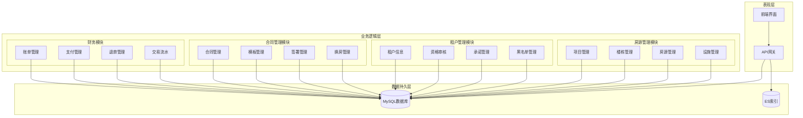

**图表来源**
- [01-房源管理.md:1-203](file://docs/数据字典/01-房源管理.md#L1-L203)
- [02-租户管理.md:1-144](file://docs/数据字典/02-租户管理.md#L1-L144)
- [03-合同管理.md:1-165](file://docs/数据字典/03-合同管理.md#L1-L165)
- [05-账单缴费.md:1-220](file://docs/数据字典/05-账单缴费.md#L1-L220)

## 详细组件分析

### 房源管理表

房源管理模块是整个系统的核心基础模块，负责管理项目的物理资源信息。

#### 项目表 (hz_project)
项目表存储房屋项目的整体信息，包括项目基本信息、地理位置、配套设施等。

**核心字段说明**：
- project_id: 项目唯一标识符
- project_name: 项目名称，用于用户界面展示
- project_code: 项目编码，用于系统内部识别
- project_type: 项目类型枚举（人才公寓、保租房、市场租赁）
- address: 项目详细地址
- longitude/latitude: 地理位置坐标
- facilities: 配套设施字符串（多个设施用逗号分隔）

#### 楼栋表 (hz_building)
楼栋表描述项目的建筑结构，是房源的上层组织单位。

**设计特点**：
- 与项目表建立一对多关系
- 包含楼层数、单元数等统计信息
- 支持显示顺序排序

#### 房源表 (hz_house)
房源表是房源管理的核心实体，存储具体的可出租单元信息。

**关键字段**：
- house_code: 房源编码，格式通常为"项目编码-楼栋-单元-房间号"
- house_status: 房源状态（空置、已预订、已出租、维修中、下架）
- rent_price: 租金价格，单位为元/月
- area: 建筑面积，单位为平方米
- facilities: 房间设施配置

#### 房源图片表 (hz_house_image)
支持房源的多角度展示，提升用户体验。

**图片类型**：
- 实景图：房屋实际拍摄照片
- 户型图：房屋平面布局图
- cover flag: 标识封面图片

#### 户型表 (hz_house_type)
标准化房屋户型信息，便于快速匹配和筛选。

**户型维度**：
- bedroom_count: 卧室数量
- livingroom_count: 客厅数量
- bathroom_count: 卫生间数量
- kitchen_count: 厨房数量
- balcony_count: 阳台数量

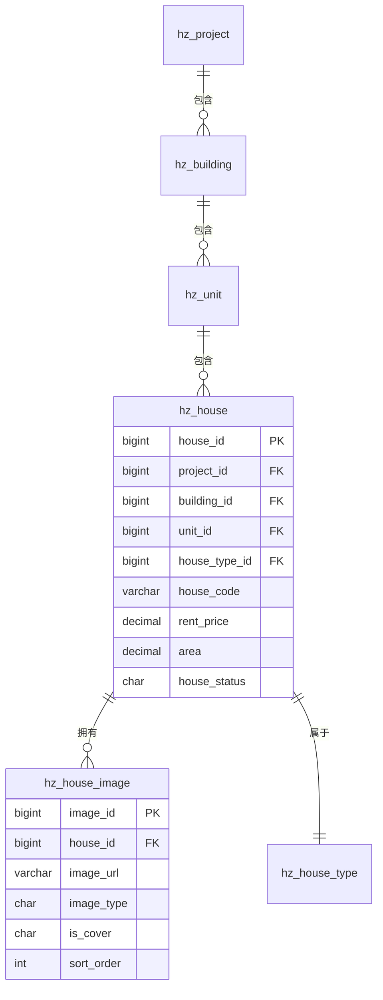

**图表来源**
- [01-房源管理.md:82-112](file://docs/数据字典/01-房源管理.md#L82-L112)
- [01-房源管理.md:116-133](file://docs/数据字典/01-房源管理.md#L116-L133)
- [01-房源管理.md:157-180](file://docs/数据字典/01-房源管理.md#L157-L180)

**章节来源**
- [01-房源管理.md:1-203](file://docs/数据字典/01-房源管理.md#L1-L203)

### 租户管理表

租户管理模块负责管理租户的基本信息、资格审核、承诺书签署和黑名单管理。

#### 租户表 (hz_tenant)
存储租户的基础个人信息和信用信息。

**个人信息字段**：
- user_id: 关联郑好办用户系统
- tenant_name/id_card/phone: 姓名、身份证号、手机号
- gender/birth_date: 性别和出生日期
- education/marriage_status: 教育程度和婚姻状况
- work_unit: 工作单位

**信用管理**：
- credit_score: 信用分数，默认100分
- is_blacklist: 黑名单标记

#### 资格审核表 (hz_qualification)
记录租户申请各类房源资格的审核过程。

**审核流程**：
1. 自动审核：基于系统规则自动判断
2. 人工审核：管理员人工复核
3. 最终结果：结合自动和人工审核得出最终结论

**审核维度**：
- 社保缴纳月数
- 本地房产情况
- 家庭人口数
- 月收入水平

#### 承诺书表 (hz_commitment)
存储租户签署的各种承诺书电子档案。

**承诺书类型**：
- 人才公寓承诺书
- 保租房承诺书

**电子签名**：
- signature_data: 签名数据（base64编码）
- sign_time/sign_ip: 签署时间和IP地址

#### 黑名单表 (hz_blacklist)
管理违规租户的黑名单信息。

**管理机制**：
- blacklist_reason: 列入原因
- blacklist_time/remove_time: 列入和移除时间
- status: 状态管理

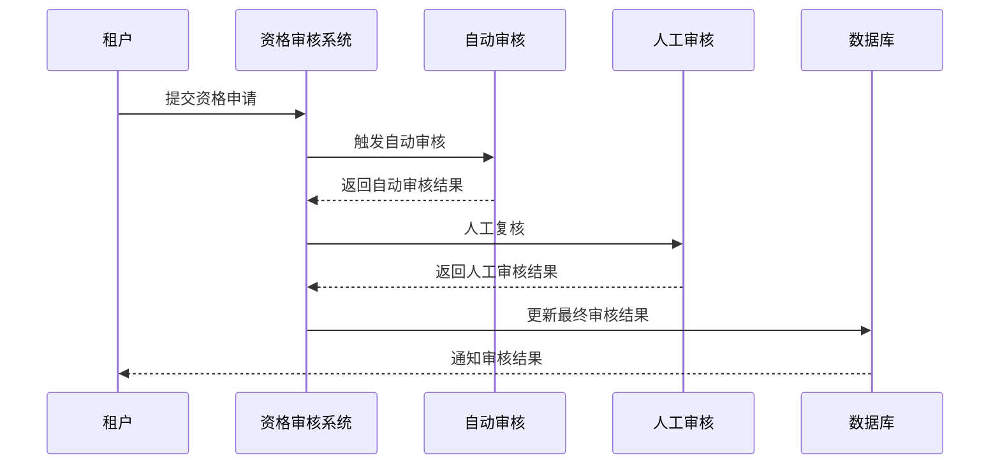

**图表来源**
- [02-租户管理.md:38-71](file://docs/数据字典/02-租户管理.md#L38-L71)
- [02-租户管理.md:101-120](file://docs/数据字典/02-租户管理.md#L101-L120)

**章节来源**
- [02-租户管理.md:1-144](file://docs/数据字典/02-租户管理.md#L1-L144)

### 合同管理表

合同管理模块提供完整的电子合同生命周期管理。

#### 合同表 (hz_contract)
存储房屋租赁合同的完整信息。

**合同要素**：
- contract_no: 合同编号，格式化生成
- contract_type: 合同类型（人才公寓、保租房、市场租赁）
- tenant_info: 租户基本信息（姓名、身份证、手机号）
- house_info: 房源基本信息（项目、房源编码、地址）
- financial_terms: 租金、押金、缴费周期等

**合同状态**：
- 草稿、待签署、已签署、履行中、已到期、已解约

#### 合同模板表 (hz_contract_template)
标准化合同模板管理。

**模板管理**：
- 支持不同类型的合同模板
- 版本控制机制
- 默认模板设置

#### 合同签署记录表 (hz_contract_signature)
记录每次签署的详细信息。

**签署信息**：
- signer_type: 签署人类型（租户、房东、共同租户）
- signature_data: 签名数据（base64编码）
- sign_time/sign_ip: 签署时间和IP地址

#### 换房记录表 (hz_house_exchange)
管理租户换房申请和审批流程。

**换房流程**：
1. 申请提交
2. 审批处理
3. 换房执行
4. 新合同生成

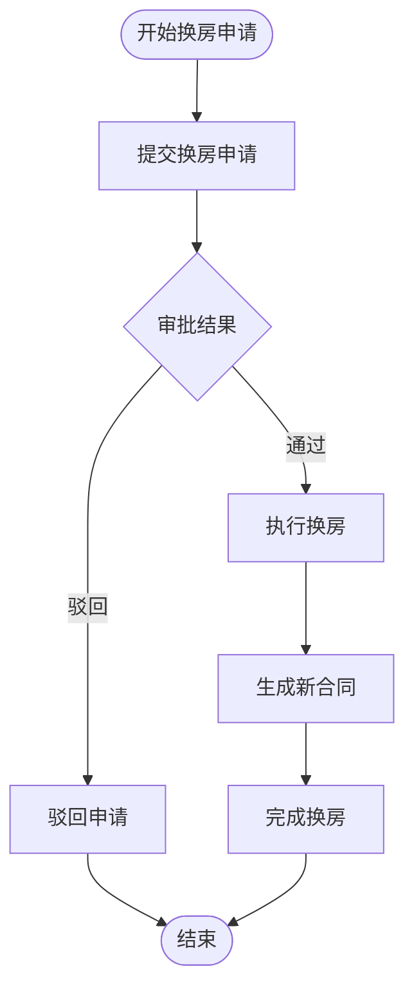

**图表来源**
- [03-合同管理.md:137-164](file://docs/数据字典/03-合同管理.md#L137-L164)

**章节来源**
- [03-合同管理.md:1-165](file://docs/数据字典/03-合同管理.md#L1-L165)

### 入住退租表

入住退租模块管理租户的入住和退租全流程。

#### 入住申请表 (hz_checkin_apply)
记录租户的入住申请信息。

**申请要素**：
- contract_id: 关联的租赁合同
- plan_checkin_date: 计划入住日期
- deposit_paid: 押金缴纳状态
- apply_status: 申请状态（待审核、已通过、已驳回、已入住）

#### 入住记录表 (hz_checkin_record)
详细记录实际入住情况。

**入住信息**：
- checkin_date/checkin_time: 入住日期和时间
- meter_reading: 水电燃气表初始读数
- checkin_photos: 入住现场照片
- inventory_list_id: 物品清单ID

#### 退租申请表 (hz_checkout_apply)
管理租户的退租申请。

**退租计算**：
- penalty_amount: 违约金计算
- unpaid_bills: 未结账单金额
- deposit_refund: 应退押金

#### 退租记录表 (hz_checkout_record)
记录完整的退租流程。

**退租结算**：
- damage_deduction: 损坏赔偿金额
- utility_bill: 水电燃气费用
- final_deposit_refund: 实际退还押金

#### 物品清单表 (hz_inventory_list)
管理入住和退租时的物品清单。

**清单管理**：
- list_type: 清单类型（入住/退租）
- list_items: JSON格式的物品列表
- template_id: 清单模板ID

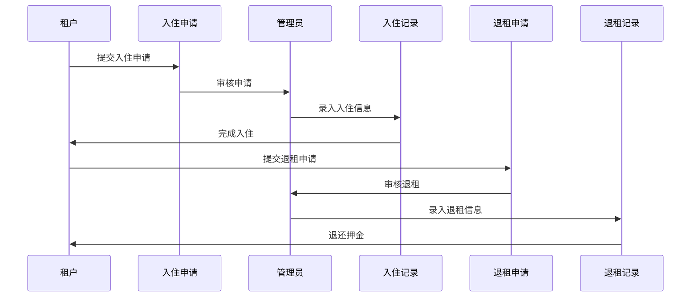

**图表来源**
- [04-入住退租.md:3-28](file://docs/数据字典/04-入住退租.md#L3-L28)
- [04-入住退租.md:31-60](file://docs/数据字典/04-入住退租.md#L31-L60)

**章节来源**
- [04-入住退租.md:1-175](file://docs/数据字典/04-入住退租.md#L1-L175)

### 账单缴费表

账单缴费模块提供完整的财务管理和支付流程。

#### 账单表 (hz_bill)
记录每次收费的详细信息。

**账单要素**：
- bill_no: 账单编号
- bill_type: 账单类型（押金、租金、水费、电费、燃气费、物业费、其他）
- bill_period: 账单周期（如2025-01）
- bill_amount/paid_amount/unpaid_amount: 总金额、已支付、未支付金额
- due_date: 应缴日期

**账单状态**：
- 待支付、已支付、部分支付、已逾期、已关闭

#### 缴费记录表 (hz_payment)
跟踪每次支付的详细信息。

**支付信息**：
- payment_method: 支付方式（支付宝、微信、银行卡等）
- transaction_no: 第三方交易流水号
- payment_status: 支付状态（待支付、支付成功、支付失败、已退款）
- callback_data: 支付回调数据

#### 退款申请表 (hz_refund_apply)
管理租户的退款申请。

**退款流程**：
1. 申请提交
2. 审批处理
3. 退款执行
4. 状态更新

#### 交易流水表 (hz_transaction)
记录所有财务交易的流水信息。

**流水记录**：
- transaction_type: 交易类型（收入/支出）
- business_type: 业务类型（缴费/退款）
- amount: 交易金额
- balance_before/balance_after: 交易前后余额

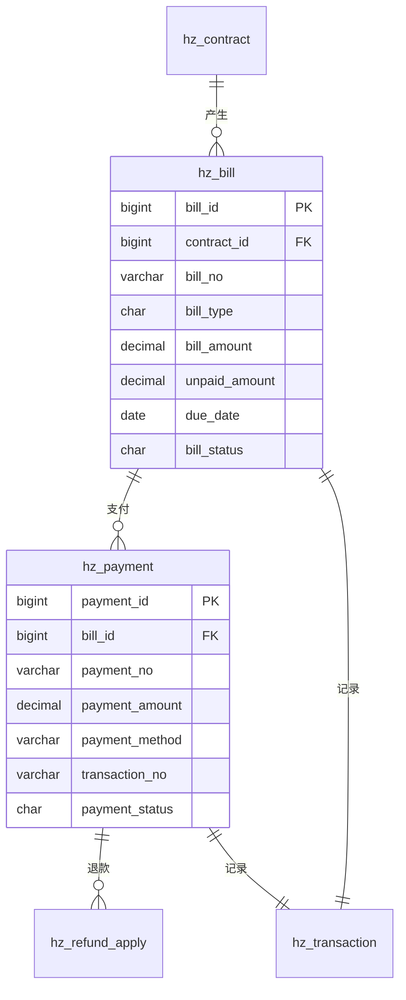

**图表来源**
- [05-账单缴费.md:3-34](file://docs/数据字典/05-账单缴费.md#L3-L34)
- [05-账单缴费.md:37-63](file://docs/数据字典/05-账单缴费.md#L37-L63)

**章节来源**
- [05-账单缴费.md:1-220](file://docs/数据字典/05-账单缴费.md#L1-L220)

### 开票管理表

开票管理模块提供发票申请和管理的完整流程。

#### 开票申请表 (hz_invoice_apply)
记录租户的发票申请信息。

**申请要素**：
- invoice_type: 发票类型（增值税普通发票、增值税专用发票）
- invoice_title: 发票抬头
- tax_no: 纳税人识别号
- invoice_amount: 开票金额
- bill_ids: 关联的账单ID列表

**申请状态**：
- 待审核、已开票、已驳回、已邮寄

#### 发票表 (hz_invoice)
存储正式发票的信息。

**发票信息**：
- invoice_no/invoice_code: 发票号码和代码
- invoice_type: 发票类型
- invoice_amount/tax_amount: 发票金额和税额
- invoice_date: 开票日期
- invoice_pdf: 发票PDF文件URL

#### 发票附件表 (hz_invoice_attachment)
管理发票相关的附件文件。

**附件类型**：
- 发票PDF文件
- 其他相关证明材料

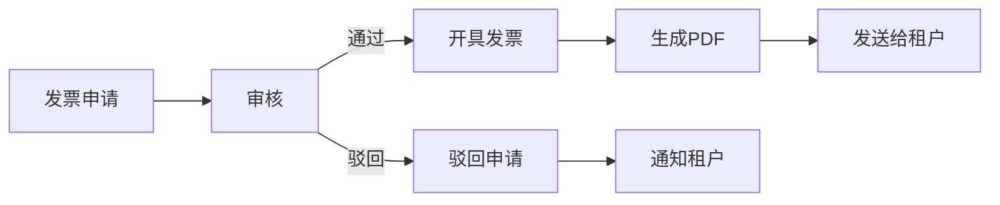

**图表来源**
- [06-开票管理.md:3-38](file://docs/数据字典/06-开票管理.md#L3-L38)
- [06-开票管理.md:41-67](file://docs/数据字典/06-开票管理.md#L41-L67)

**章节来源**
- [06-开票管理.md:1-89](file://docs/数据字典/06-开票管理.md#L1-L89)

### 预约看房表

预约看房模块管理租户的看房预约和记录。

#### 预约看房表 (hz_appointment)
记录租户的看房预约信息。

**预约要素**：
- appointment_no: 预约编号
- visitor_name/visitor_phone: 看房人信息
- id_card: 身份证号
- appointment_date/time: 预约日期和时间段
- visitor_count: 看房人数

**预约状态**：
- 待确认、已确认、已完成、已取消

#### 看房记录表 (hz_viewing_record)
记录实际看房的情况。

**看房信息**：
- viewing_date/viewing_time: 看房日期和时间
- guide_person: 带看人员
- satisfaction_score: 满意度评分（1-5分）
- is_interested: 是否有意向
- feedback: 反馈意见

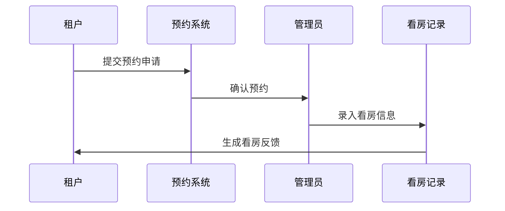

**图表来源**
- [07-预约看房.md:3-32](file://docs/数据字典/07-预约看房.md#L3-L32)
- [07-预约看房.md:35-59](file://docs/数据字典/07-预约看房.md#L35-L59)

**章节来源**
- [07-预约看房.md:1-60](file://docs/数据字典/07-预约看房.md#L1-L60)

### 资料管理表

资料管理模块负责租户各类证明材料的管理。

#### 租户资料表 (hz_tenant_document)
存储租户提交的各种证明材料。

**资料类型**：
- 身份证正反面
- 学历证明
- 社保证明
- 收入证明
- 工作证明

**资料管理**：
- document_url: 资料文件URL
- file_size: 文件大小
- audit_status: 审核状态（待审核、已通过、已驳回）

#### 资料审核记录表 (hz_document_audit)
记录资料审核的完整历史。

**审核流程**：
- audit_result: 审核结果（通过、驳回）
- audit_opinion: 审核意见
- audit_by: 审核人
- audit_time: 审核时间

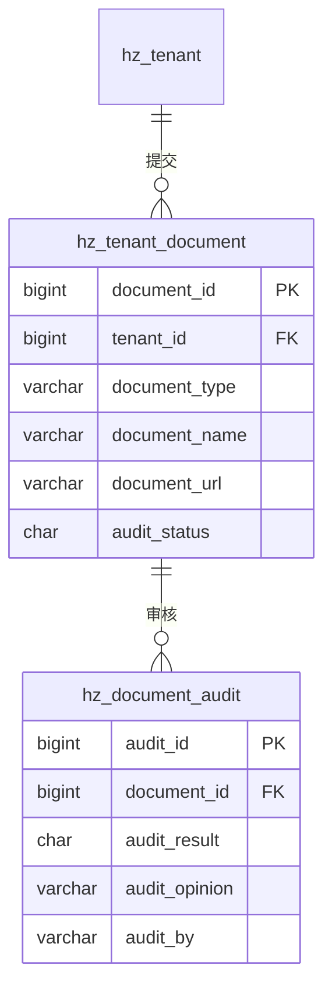

**图表来源**
- [08-资料管理.md:3-25](file://docs/数据字典/08-资料管理.md#L3-L25)
- [08-资料管理.md:29-47](file://docs/数据字典/08-资料管理.md#L29-L47)

**章节来源**
- [08-资料管理.md:1-48](file://docs/数据字典/08-资料管理.md#L1-L48)

### 消息通知表

消息通知模块提供系统消息、通知公告和政策发布的功能。

#### 消息模板表 (hz_message_template)
管理各类消息模板。

**模板类型**：
- 系统通知模板
- 短信模板
- 邮件模板

**模板内容**：
- 支持占位符替换
- 多语言支持
- 版本控制

#### 消息记录表 (hz_message)
记录发送的消息详情。

**消息要素**：
- message_type: 消息类型（系统通知、短信、邮件）
- receiver_info: 接收人信息（ID、姓名、手机、邮箱）
- message_title/content: 消息标题和内容
- send_status/read_status: 发送状态和阅读状态

#### 通知公告表 (hz_announcement)
管理系统的通知公告。

**公告类型**：
- 通知、公告、活动
- 支持置顶功能
- 有效时间控制

#### 政策文件表 (hz_policy)
管理相关政策文件。

**政策信息**：
- policy_no: 政策文号
- publish_dept: 发布部门
- effective_date: 生效日期
- policy_file: 政策文件URL

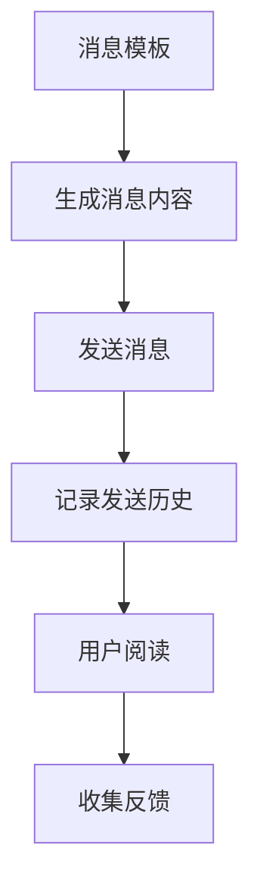

**图表来源**
- [09-消息通知.md:3-21](file://docs/数据字典/09-消息通知.md#L3-L21)
- [09-消息通知.md:24-48](file://docs/数据字典/09-消息通知.md#L24-L48)

**章节来源**
- [09-消息通知.md:1-101](file://docs/数据字典/09-消息通知.md#L1-L101)

### 批量分配表

批量分配模块专门处理企业用户的集中配租业务。

#### 集中配租批次表 (hz_batch_allocation)
管理企业批量配租的批次信息。

**批次要素**：
- batch_no: 批次编号
- enterprise_info: 企业信息（名称、联系人、电话）
- project_id: 关联项目
- house_count: 配租房源总数
- allocated_count: 已分配数量

**批次状态**：
- 待分配、分配中、已完成

#### 批次房源表 (hz_batch_house)
记录批次中每个房源的分配情况。

**分配信息**：
- allocation_status: 分配状态（未分配、已分配）
- tenant_id: 分配的租户ID
- allocation_time: 分配时间

#### 批次租户表 (hz_batch_tenant)
管理参与批量分配的租户信息。

**租户信息**：
- work_no: 工号
- dept_name: 部门
- house_id: 分配的房源ID

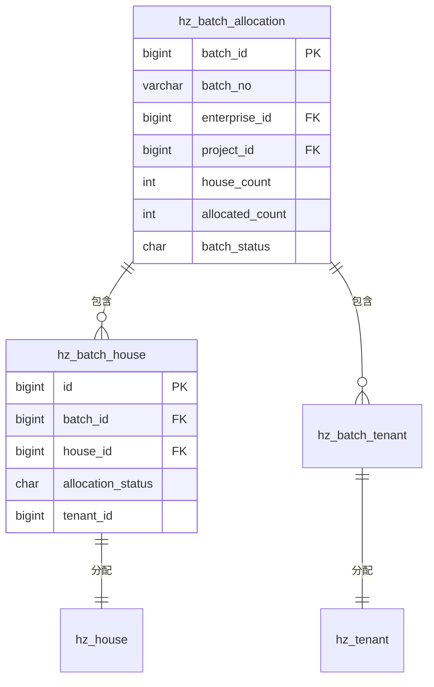

**图表来源**
- [10-批量分配.md:3-29](file://docs/数据字典/10-批量分配.md#L3-L29)
- [10-批量分配.md:33-51](file://docs/数据字典/10-批量分配.md#L33-L51)

**章节来源**
- [10-批量分配.md:1-77](file://docs/数据字典/10-批量分配.md#L1-L77)

### 企业管理表

企业管理模块管理参与批量配租的企业用户。

#### 企业信息表 (hz_enterprise)
存储企业用户的基本信息。

**企业信息**：
- enterprise_name: 企业名称
- social_credit_code: 统一社会信用代码
- legal_person: 法人代表
- contact_person/phone/email: 联系信息
- enterprise_address: 企业地址
- business_license: 营业执照URL

**企业状态**：
- 正常、停用

**企业统计**：
- employee_count: 员工数量
- rented_count: 已租房源数

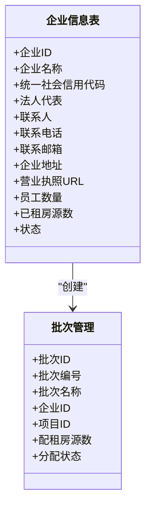

**图表来源**
- [11-企业管理.md:3-26](file://docs/数据字典/11-企业管理.md#L3-L26)

**章节来源**
- [11-企业管理.md:1-27](file://docs/数据字典/11-企业管理.md#L1-L27)

### 系统配置表

系统配置模块提供系统运行所需的各类配置信息。

#### 运营配置表 (hz_operation_config)
管理系统的运营配置参数。

**配置类型**：
- 系统参数配置
- 业务规则配置
- 业务开关配置

**配置要素**：
- config_key: 配置键
- config_value: 配置值
- config_type: 配置类型
- config_desc: 配置描述

#### 轮播图表 (hz_banner)
管理首页轮播图配置。

**轮播配置**：
- banner_title: 轮播图标题
- banner_image: 轮播图图片URL
- banner_url: 跳转链接
- banner_type: 轮播图类型（首页、项目详情）
- target_id: 目标ID（关联项目ID等）
- time_range: 显示时间范围

#### 快捷入口表 (hz_shortcut)
管理系统的快捷入口配置。

**入口配置**：
- shortcut_name: 入口名称
- shortcut_icon: 入口图标
- shortcut_url: 跳转链接
- shortcut_type: 入口类型
- sort_order: 显示顺序

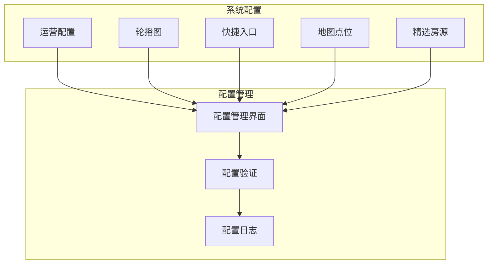

**图表来源**
- [12-系统配置.md:3-21](file://docs/数据字典/12-系统配置.md#L3-L21)
- [12-系统配置.md:24-45](file://docs/数据字典/12-系统配置.md#L24-L45)

**章节来源**
- [12-系统配置.md:1-112](file://docs/数据字典/12-系统配置.md#L1-L112)

## 依赖分析

系统各模块之间存在复杂的依赖关系，主要体现在数据关联和业务流程上：

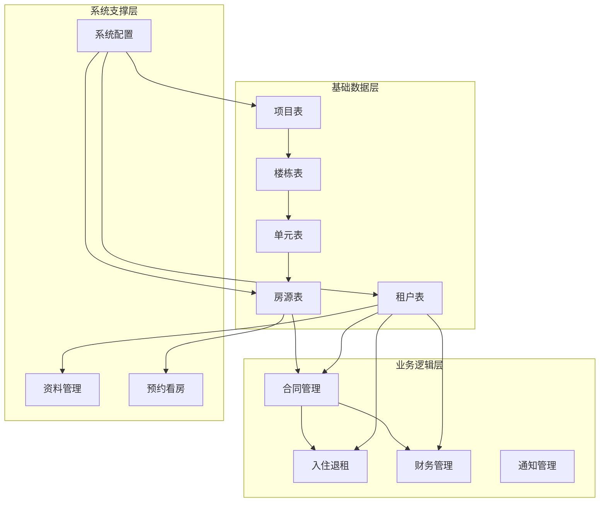

**图表来源**
- [01-房源管理.md:1-203](file://docs/数据字典/01-房源管理.md#L1-L203)
- [02-租户管理.md:1-144](file://docs/数据字典/02-租户管理.md#L1-L144)
- [03-合同管理.md:1-165](file://docs/数据字典/03-合同管理.md#L1-L165)
- [04-入住退租.md:1-175](file://docs/数据字典/04-入住退租.md#L1-L175)
- [05-账单缴费.md:1-220](file://docs/数据字典/05-账单缴费.md#L1-L220)
- [09-消息通知.md:1-101](file://docs/数据字典/09-消息通知.md#L1-L101)
- [12-系统配置.md:1-112](file://docs/数据字典/12-系统配置.md#L1-L112)

### 外键关系分析

系统通过外键约束确保数据一致性：

1. **层级关系**：项目 → 楼栋 → 单元 → 房源
2. **业务关联**：租户 → 合同 → 账单 → 缴费记录
3. **状态管理**：各表的状态字段形成完整的业务状态链

### 数据完整性约束

- 所有业务表都包含标准的审计字段
- 关键业务字段设置非空约束
- 外键字段设置级联更新和删除
- 状态字段使用枚举值确保数据有效性

**章节来源**
- [01-房源管理.md:1-203](file://docs/数据字典/01-房源管理.md#L1-L203)
- [02-租户管理.md:1-144](file://docs/数据字典/02-租户管理.md#L1-L144)
- [03-合同管理.md:1-165](file://docs/数据字典/03-合同管理.md#L1-L165)
- [04-入住退租.md:1-175](file://docs/数据字典/04-入住退租.md#L1-L175)
- [05-账单缴费.md:1-220](file://docs/数据字典/05-账单缴费.md#L1-L220)

## 性能考虑

### 索引策略

针对高频查询场景，建议在以下字段建立索引：

1. **房源查询索引**：
   - house_status（房源状态）
   - project_id/building_id/unit_id（层级过滤）
   - area/rent_price（价格区间查询）

2. **租户查询索引**：
   - id_card（身份认证）
   - phone（联系方式）
   - tenant_name（模糊搜索）

3. **合同查询索引**：
   - contract_no（合同编号）
   - tenant_id（租户关联）
   - contract_status（状态过滤）

4. **账单查询索引**：
   - bill_no（账单编号）
   - due_date（到期提醒）
   - bill_status（状态统计）

### 查询优化

1. **分页查询**：对列表查询使用LIMIT和OFFSET
2. **批量操作**：支持批量插入和更新
3. **缓存策略**：对静态配置信息进行缓存
4. **异步处理**：对耗时操作采用异步队列

### 数据分区

对于大表建议采用分区策略：
- 按时间分区（账单、支付记录）
- 按业务类型分区（不同类型的合同）
- 按地理区域分区（项目分布）

## 故障排除指南

### 常见问题诊断

1. **数据重复问题**
   - 检查唯一约束是否正确设置
   - 验证业务逻辑的幂等性
   - 检查并发访问的冲突

2. **状态不一致问题**
   - 检查状态转换的业务规则
   - 验证事务的完整性
   - 查看状态变更的日志

3. **性能问题**
   - 分析慢查询SQL
   - 检查索引使用情况
   - 监控数据库连接池

### 数据修复流程

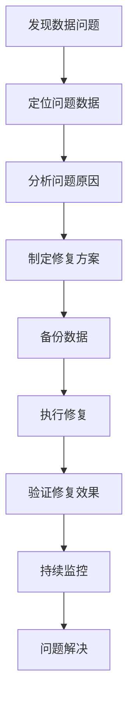

### 系统监控

1. **数据库监控**：连接数、查询性能、锁等待
2. **业务监控**：关键指标、异常报警、性能阈值
3. **日志监控**：错误日志、审计日志、操作日志

**章节来源**
- [01-房源管理.md:1-203](file://docs/数据字典/01-房源管理.md#L1-L203)
- [02-租户管理.md:1-144](file://docs/数据字典/02-租户管理.md#L1-L144)
- [03-合同管理.md:1-165](file://docs/数据字典/03-合同管理.md#L1-L165)
- [04-入住退租.md:1-175](file://docs/数据字典/04-入住退租.md#L1-L175)
- [05-账单缴费.md:1-220](file://docs/数据字典/05-账单缴费.md#L1-L220)

## 结论

港好住信息系统通过规范化的数据表设计，构建了一个完整的住房管理生态系统。各业务模块相互协作，形成了从房源管理到租户服务的全生命周期管理体系。

系统的主要优势包括：

1. **模块化设计**：每个业务模块都有清晰的职责边界
2. **数据一致性**：通过外键约束和业务规则确保数据完整性
3. **扩展性强**：标准化的表结构便于功能扩展和业务变化
4. **用户体验**：完整的业务流程支持提升了用户满意度

未来可以进一步优化的方向包括：
- 引入更智能的推荐算法
- 增强数据分析和报表功能
- 优化移动端用户体验
- 加强安全防护措施