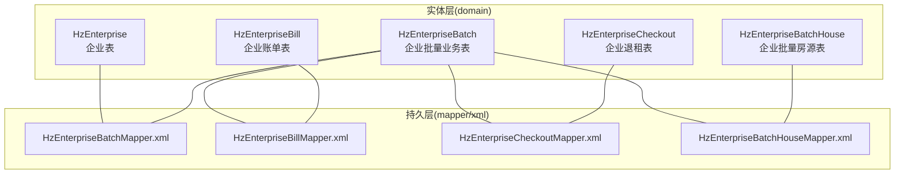
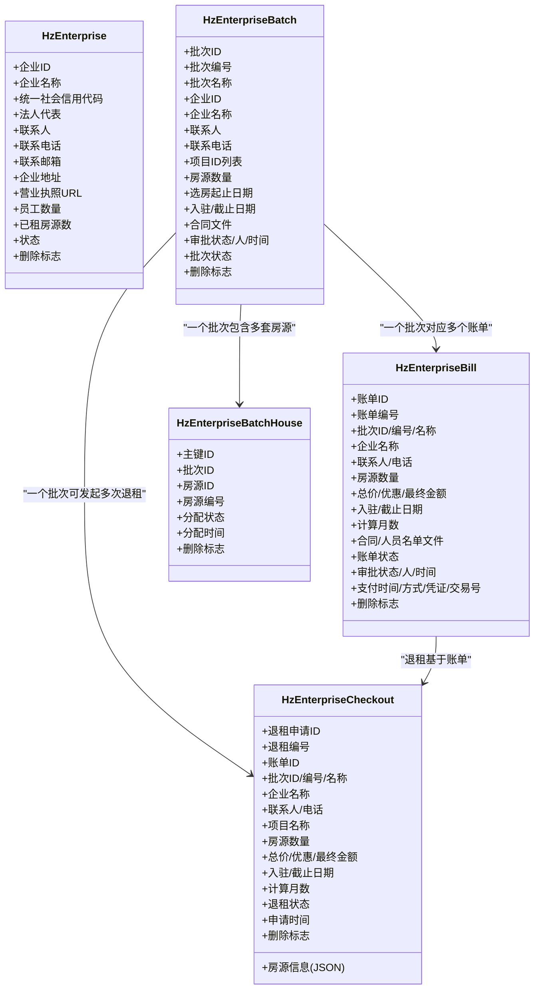
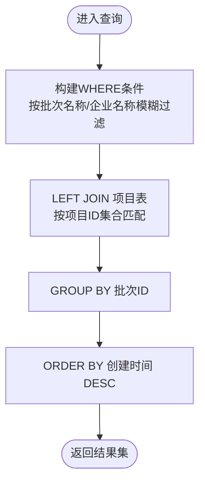
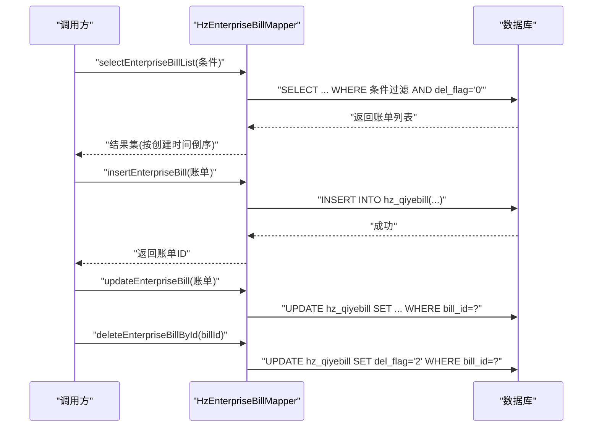
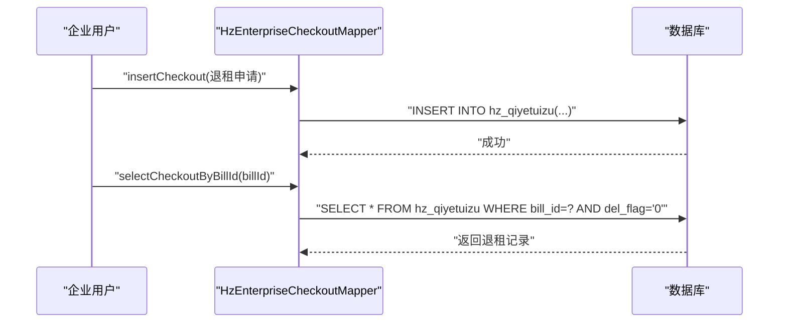
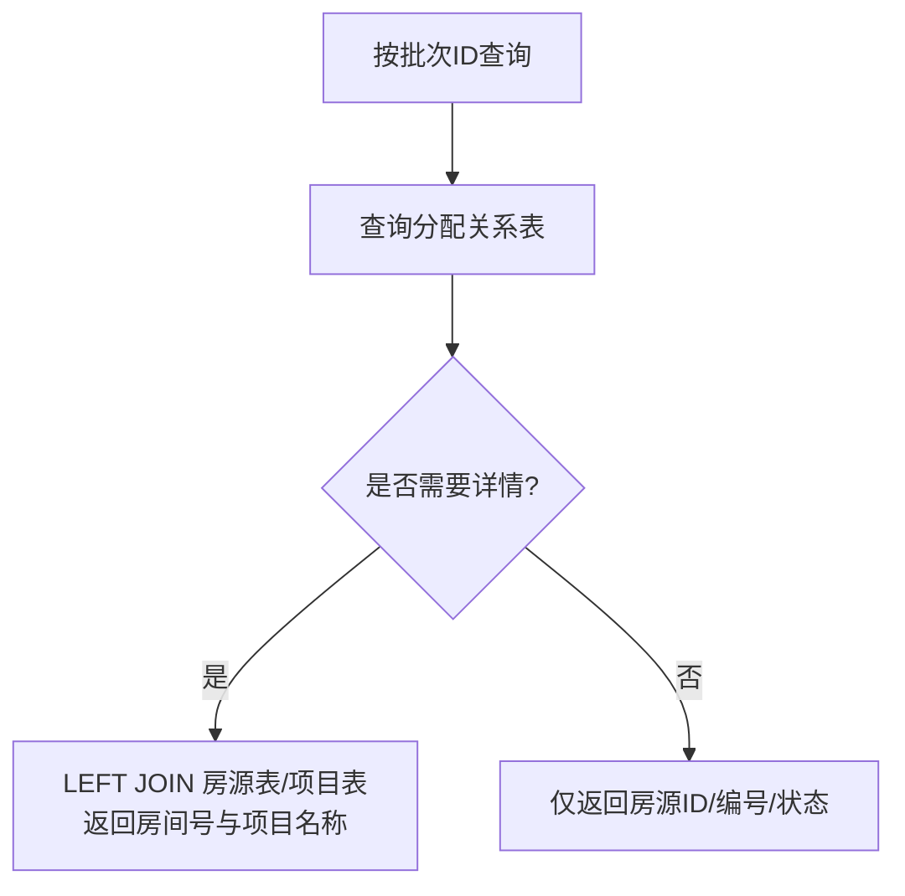
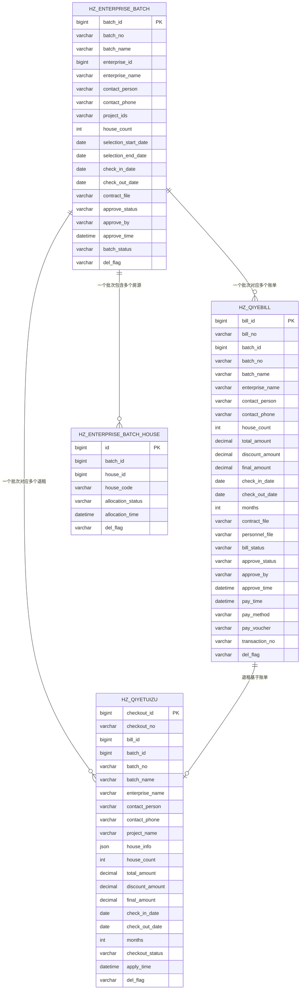

# 企业管理表

<cite>
**本文引用的文件**
- [HzEnterprise.java](file://ruoyi-system/src/main/java/com/ruoyi/system/domain/HzEnterprise.java)
- [HzEnterpriseBatch.java](file://ruoyi-system/src/main/java/com/ruoyi/system/domain/HzEnterpriseBatch.java)
- [HzEnterpriseBill.java](file://ruoyi-system/src/main/java/com/ruoyi/system/domain/HzEnterpriseBill.java)
- [HzEnterpriseCheckout.java](file://ruoyi-system/src/main/java/com/ruoyi/system/domain/HzEnterpriseCheckout.java)
- [HzEnterpriseBatchHouse.java](file://ruoyi-system/src/main/java/com/ruoyi/system/domain/HzEnterpriseBatchHouse.java)
- [HzEnterpriseBatchMapper.xml](file://ruoyi-system/src/main/resources/mapper/system/HzEnterpriseBatchMapper.xml)
- [HzEnterpriseBillMapper.xml](file://ruoyi-system/src/main/resources/mapper/system/HzEnterpriseBillMapper.xml)
- [HzEnterpriseCheckoutMapper.xml](file://ruoyi-system/src/main/resources/mapper/system/HzEnterpriseCheckoutMapper.xml)
- [HzEnterpriseBatchHouseMapper.xml](file://ruoyi-system/src/main/resources/mapper/system/HzEnterpriseBatchHouseMapper.xml)
- [11-企业管理.md](file://docs/数据字典/11-企业管理.md)
</cite>

## 目录
1. [简介](#简介)
2. [项目结构](#项目结构)
3. [核心组件](#核心组件)
4. [架构总览](#架构总览)
5. [详细组件分析](#详细组件分析)
6. [依赖分析](#依赖分析)
7. [性能考虑](#性能考虑)
8. [故障排查指南](#故障排查指南)
9. [结论](#结论)
10. [附录](#附录)

## 简介
本文件面向“企业管理模块”的数据表设计与业务实现，聚焦以下核心表及其职责：
- 企业表：hz_enterprise，用于存储企业客户的基础信息与状态
- 企业批量业务表：hz_enterprise_batch，用于承载企业批次的选房、入驻、合同等生命周期信息
- 企业账单表：hz_qiyebill，用于统一生成与管理企业批次的费用账单
- 企业退租表：hz_qiyetuizu，用于记录企业退租申请及处理状态
- 企业批量房源表：hz_enterprise_batch_house，用于记录批次与房源的分配关系

围绕上述表，文档阐述企业用户管理、批量业务处理、统一缴费管理、企业合同管理等业务逻辑，并给出数据模型设计要点与常见问题排查建议。

## 项目结构
企业管理相关的核心文件分布如下：
- 实体类：位于系统模块的domain目录，映射数据库表结构
- Mapper XML：位于resources/mapper/system目录，定义SQL查询、分页与CRUD
- 数据字典：位于docs/数据字典，提供表结构与字段说明

图表来源
- [HzEnterprise.java:1-201](file://ruoyi-system/src/main/java/com/ruoyi/system/domain/HzEnterprise.java#L1-L201)
- [HzEnterpriseBatch.java:1-299](file://ruoyi-system/src/main/java/com/ruoyi/system/domain/HzEnterpriseBatch.java#L1-L299)
- [HzEnterpriseBill.java:1-378](file://ruoyi-system/src/main/java/com/ruoyi/system/domain/HzEnterpriseBill.java#L1-L378)
- [HzEnterpriseCheckout.java:1-312](file://ruoyi-system/src/main/java/com/ruoyi/system/domain/HzEnterpriseCheckout.java#L1-L312)
- [HzEnterpriseBatchHouse.java:1-127](file://ruoyi-system/src/main/java/com/ruoyi/system/domain/HzEnterpriseBatchHouse.java#L1-L127)
- [HzEnterpriseBatchMapper.xml:1-87](file://ruoyi-system/src/main/resources/mapper/system/HzEnterpriseBatchMapper.xml#L1-L87)
- [HzEnterpriseBillMapper.xml:1-189](file://ruoyi-system/src/main/resources/mapper/system/HzEnterpriseBillMapper.xml#L1-L189)
- [HzEnterpriseCheckoutMapper.xml:1-171](file://ruoyi-system/src/main/resources/mapper/system/HzEnterpriseCheckoutMapper.xml#L1-L171)
- [HzEnterpriseBatchHouseMapper.xml:1-52](file://ruoyi-system/src/main/resources/mapper/system/HzEnterpriseBatchHouseMapper.xml#L1-L52)

章节来源
- [HzEnterprise.java:1-201](file://ruoyi-system/src/main/java/com/ruoyi/system/domain/HzEnterprise.java#L1-L201)
- [HzEnterpriseBatch.java:1-299](file://ruoyi-system/src/main/java/com/ruoyi/system/domain/HzEnterpriseBatch.java#L1-L299)
- [HzEnterpriseBill.java:1-378](file://ruoyi-system/src/main/java/com/ruoyi/system/domain/HzEnterpriseBill.java#L1-L378)
- [HzEnterpriseCheckout.java:1-312](file://ruoyi-system/src/main/java/com/ruoyi/system/domain/HzEnterpriseCheckout.java#L1-L312)
- [HzEnterpriseBatchHouse.java:1-127](file://ruoyi-system/src/main/java/com/ruoyi/system/domain/HzEnterpriseBatchHouse.java#L1-L127)
- [HzEnterpriseBatchMapper.xml:1-87](file://ruoyi-system/src/main/resources/mapper/system/HzEnterpriseBatchMapper.xml#L1-L87)
- [HzEnterpriseBillMapper.xml:1-189](file://ruoyi-system/src/main/resources/mapper/system/HzEnterpriseBillMapper.xml#L1-L189)
- [HzEnterpriseCheckoutMapper.xml:1-171](file://ruoyi-system/src/main/resources/mapper/system/HzEnterpriseCheckoutMapper.xml#L1-L171)
- [HzEnterpriseBatchHouseMapper.xml:1-52](file://ruoyi-system/src/main/resources/mapper/system/HzEnterpriseBatchHouseMapper.xml#L1-L52)

## 核心组件
本节对各表进行逐项说明，包含表用途、关键字段、业务含义与典型操作。

- 企业表 hz_enterprise
  - 用途：存储企业客户的基本信息、联系信息、状态与计数字段
  - 关键字段：企业ID、企业名称、统一社会信用代码、法人代表、联系人、联系电话、联系邮箱、企业地址、营业执照URL、员工数量、已租房源数、状态、删除标志
  - 典型操作：新增/更新企业信息；按状态/关键字检索；软删除标记
  - 参考路径：[HzEnterprise.java:1-201](file://ruoyi-system/src/main/java/com/ruoyi/system/domain/HzEnterprise.java#L1-L201)，[11-企业管理.md:1-27](file://docs/数据字典/11-企业管理.md#L1-L27)

- 企业批量业务表 hz_enterprise_batch
  - 用途：承载企业批次的生命周期信息，包括选房期、入驻/退租期、合同文件、审批状态、批次状态等
  - 关键字段：批次ID、批次编号、批次名称、企业ID/名称、联系人/电话、项目ID列表、房源数量、选房起止日期、入驻/截止日期、合同文件、审批状态/人/时间、批次状态、删除标志
  - 典型操作：按批次/企业条件分页查询；根据项目ID集合关联项目名称；软删除
  - 参考路径：[HzEnterpriseBatch.java:1-299](file://ruoyi-system/src/main/java/com/ruoyi/system/domain/HzEnterpriseBatch.java#L1-L299)，[HzEnterpriseBatchMapper.xml:1-87](file://ruoyi-system/src/main/resources/mapper/system/HzEnterpriseBatchMapper.xml#L1-L87)

- 企业账单表 hz_qiyebill
  - 用途：统一生成企业批次账单，记录费用计算、优惠、最终金额、合同与人员名单文件、审批与支付状态
  - 关键字段：账单ID、账单编号、批次ID/编号/名称、企业名称、联系人/电话、房源数量、总价、优惠金额、优惠后总价、入驻/截止日期、计算月数、合同/人员名单文件、账单状态、审批状态/人/时间、支付时间/方式/凭证/交易号、删除标志
  - 典型操作：按账单号/批次/企业/手机号/状态分页查询；插入/更新账单；软删除
  - 参考路径：[HzEnterpriseBill.java:1-378](file://ruoyi-system/src/main/java/com/ruoyi/system/domain/HzEnterpriseBill.java#L1-L378)，[HzEnterpriseBillMapper.xml:1-189](file://ruoyi-system/src/main/resources/mapper/system/HzEnterpriseBillMapper.xml#L1-L189)

- 企业退租表 hz_qiyetuizu
  - 用途：记录企业退租申请，包含账单/批次/企业信息、房源明细（JSON）、费用计算与退租状态
  - 关键字段：退租申请ID、编号、账单ID、批次ID/编号/名称、企业名称、联系人/电话、项目名称、房源信息（JSON）、房源数量、总价、优惠金额、优惠后总价、入驻/截止日期、计算月数、退租状态、申请时间、删除标志
  - 典型操作：按退租编号/批次/企业/手机号/状态查询；按账单ID查询；插入/更新；软删除
  - 参考路径：[HzEnterpriseCheckout.java:1-312](file://ruoyi-system/src/main/java/com/ruoyi/system/domain/HzEnterpriseCheckout.java#L1-L312)，[HzEnterpriseCheckoutMapper.xml:1-171](file://ruoyi-system/src/main/resources/mapper/system/HzEnterpriseCheckoutMapper.xml#L1-L171)

- 企业批量房源表 hz_enterprise_batch_house
  - 用途：记录批次与房源的分配关系，支持分配状态与分配时间追踪
  - 关键字段：主键ID、批次ID、房源ID、房源编号、分配状态、分配时间、删除标志
  - 典型操作：按批次ID查询房源列表；按批次ID查询房源详情（含房间号与项目名称）
  - 参考路径：[HzEnterpriseBatchHouse.java:1-127](file://ruoyi-system/src/main/java/com/ruoyi/system/domain/HzEnterpriseBatchHouse.java#L1-L127)，[HzEnterpriseBatchHouseMapper.xml:1-52](file://ruoyi-system/src/main/resources/mapper/system/HzEnterpriseBatchHouseMapper.xml#L1-L52)

章节来源
- [HzEnterprise.java:1-201](file://ruoyi-system/src/main/java/com/ruoyi/system/domain/HzEnterprise.java#L1-L201)
- [HzEnterpriseBatch.java:1-299](file://ruoyi-system/src/main/java/com/ruoyi/system/domain/HzEnterpriseBatch.java#L1-L299)
- [HzEnterpriseBill.java:1-378](file://ruoyi-system/src/main/java/com/ruoyi/system/domain/HzEnterpriseBill.java#L1-L378)
- [HzEnterpriseCheckout.java:1-312](file://ruoyi-system/src/main/java/com/ruoyi/system/domain/HzEnterpriseCheckout.java#L1-L312)
- [HzEnterpriseBatchHouse.java:1-127](file://ruoyi-system/src/main/java/com/ruoyi/system/domain/HzEnterpriseBatchHouse.java#L1-L127)
- [11-企业管理.md:1-27](file://docs/数据字典/11-企业管理.md#L1-L27)

## 架构总览
企业管理模块采用“领域模型 + MyBatis Mapper”的分层设计：
- 领域模型（Domain）：以Java实体类映射数据库表，封装字段与toString输出
- 持久层（Mapper/XML）：定义SQL查询、分页、条件过滤、插入/更新/删除（软删除）
- 业务层（Service）：由Service接口与实现承载业务规则（在本文件不展开具体实现细节）

图表来源
- [HzEnterprise.java:1-201](file://ruoyi-system/src/main/java/com/ruoyi/system/domain/HzEnterprise.java#L1-L201)
- [HzEnterpriseBatch.java:1-299](file://ruoyi-system/src/main/java/com/ruoyi/system/domain/HzEnterpriseBatch.java#L1-L299)
- [HzEnterpriseBill.java:1-378](file://ruoyi-system/src/main/java/com/ruoyi/system/domain/HzEnterpriseBill.java#L1-L378)
- [HzEnterpriseCheckout.java:1-312](file://ruoyi-system/src/main/java/com/ruoyi/system/domain/HzEnterpriseCheckout.java#L1-L312)
- [HzEnterpriseBatchHouse.java:1-127](file://ruoyi-system/src/main/java/com/ruoyi/system/domain/HzEnterpriseBatchHouse.java#L1-L127)

## 详细组件分析

### 企业表 hz_enterprise
- 设计要点
  - 主键自增企业ID
  - 关键识别字段：统一社会信用代码、企业名称
  - 状态字段用于启用/停用控制
  - 软删除字段便于审计与恢复
- 典型业务
  - 企业注册/变更：更新基础信息与联系信息
  - 企业统计：员工数量与已租房源数用于报表与额度控制
- 数据模型复杂度
  - 查询：按名称/状态/关键字模糊匹配
  - 更新：全量字段可更新，支持部分字段置空
  - 删除：软删除，避免物理删除影响关联数据

章节来源
- [HzEnterprise.java:1-201](file://ruoyi-system/src/main/java/com/ruoyi/system/domain/HzEnterprise.java#L1-L201)
- [11-企业管理.md:1-27](file://docs/数据字典/11-企业管理.md#L1-L27)

### 企业批量业务表 hz_enterprise_batch
- 设计要点
  - 批次维度承载选房期、入驻/退租期、合同文件、审批与批次状态
  - 项目ID列表采用逗号分隔，配合LEFT JOIN查询项目名称
  - 批次状态与审批状态双轨制，便于流程化管理
- 典型业务
  - 批次创建：设置选房期、入驻/截止期、合同文件、项目ID列表
  - 批次查询：按批次名称/企业名称模糊匹配，支持分页
  - 批次归档：完成或作废批次状态切换
- 数据模型复杂度
  - 关联查询：通过项目ID集合与项目表关联，聚合项目名称
  - 条件过滤：支持多字段组合过滤，排序按创建时间倒序

图表来源
- [HzEnterpriseBatchMapper.xml:35-63](file://ruoyi-system/src/main/resources/mapper/system/HzEnterpriseBatchMapper.xml#L35-L63)

章节来源
- [HzEnterpriseBatch.java:1-299](file://ruoyi-system/src/main/java/com/ruoyi/system/domain/HzEnterpriseBatch.java#L1-L299)
- [HzEnterpriseBatchMapper.xml:1-87](file://ruoyi-system/src/main/resources/mapper/system/HzEnterpriseBatchMapper.xml#L1-L87)

### 企业账单表 hz_qiyebill
- 设计要点
  - 账单与批次强绑定，记录费用计算、优惠与最终金额
  - 合同文件与人员名单文件用于合规与审计
  - 审批状态与账单状态分离，支付环节独立
- 典型业务
  - 账单生成：依据批次与房源明细计算总价、优惠与月数
  - 账单审核：审批通过后进入支付阶段
  - 账单支付：记录支付方式、凭证与交易号
  - 账单查询：按账单号、批次、企业、手机号、状态等多维过滤
- 数据模型复杂度
  - 插入/更新：支持全量字段更新，按ID更新
  - 删除：软删除，保留历史轨迹

图表来源
- [HzEnterpriseBillMapper.xml:51-157](file://ruoyi-system/src/main/resources/mapper/system/HzEnterpriseBillMapper.xml#L51-L157)

章节来源
- [HzEnterpriseBill.java:1-378](file://ruoyi-system/src/main/java/com/ruoyi/system/domain/HzEnterpriseBill.java#L1-L378)
- [HzEnterpriseBillMapper.xml:1-189](file://ruoyi-system/src/main/resources/mapper/system/HzEnterpriseBillMapper.xml#L1-L189)

### 企业退租表 hz_qiyetuizu
- 设计要点
  - 退租申请基于账单ID，确保与账单一致性
  - 房源信息以JSON存储，便于灵活扩展
  - 退租状态用于区分“已申请”和“已处理”
- 典型业务
  - 退租申请：提交账单ID、批次信息、房源明细与费用计算
  - 退租处理：更新退租状态为“已处理”，记录处理时间
  - 退租查询：按退租编号、批次、企业、手机号、状态过滤
- 数据模型复杂度
  - 关联查询：按账单ID快速定位退租记录
  - 删除：软删除，保留审计痕迹

图表来源
- [HzEnterpriseCheckoutMapper.xml:76-102](file://ruoyi-system/src/main/resources/mapper/system/HzEnterpriseCheckoutMapper.xml#L76-L102)

章节来源
- [HzEnterpriseCheckout.java:1-312](file://ruoyi-system/src/main/java/com/ruoyi/system/domain/HzEnterpriseCheckout.java#L1-L312)
- [HzEnterpriseCheckoutMapper.xml:1-171](file://ruoyi-system/src/main/resources/mapper/system/HzEnterpriseCheckoutMapper.xml#L1-L171)

### 企业批量房源表 hz_enterprise_batch_house
- 设计要点
  - 记录批次与房源的分配关系，支持分配状态与分配时间
  - 提供按批次查询房源列表与房源详情（含房间号与项目名称）
- 典型业务
  - 批次分配：将房源分配给批次，更新分配状态与时间
  - 批次查询：按批次ID查询已分配房源，支持详情联查
- 数据模型复杂度
  - 查询：按批次ID过滤，按主键排序
  - 联合查询：左连房源与项目，获取房间号与项目名称

图表来源
- [HzEnterpriseBatchHouseMapper.xml:29-49](file://ruoyi-system/src/main/resources/mapper/system/HzEnterpriseBatchHouseMapper.xml#L29-L49)

章节来源
- [HzEnterpriseBatchHouse.java:1-127](file://ruoyi-system/src/main/java/com/ruoyi/system/domain/HzEnterpriseBatchHouse.java#L1-L127)
- [HzEnterpriseBatchHouseMapper.xml:1-52](file://ruoyi-system/src/main/resources/mapper/system/HzEnterpriseBatchHouseMapper.xml#L1-L52)

## 依赖分析
- 表间依赖
  - 批次表与账单表：一对多（一个批次可生成多笔账单）
  - 批次表与退租表：一对多（一个批次可有多次退租申请）
  - 批次表与批量房源表：一对多（一个批次包含多套房源）
  - 账单表与退租表：基于账单ID建立关联，退租基于账单发生
- SQL依赖
  - 批次查询通过项目ID集合与项目表JOIN，聚合项目名称
  - 账单与退租查询支持多维过滤与分页排序
  - 批量房源查询支持按批次ID过滤与详情联查

图表来源
- [HzEnterpriseBatch.java:1-299](file://ruoyi-system/src/main/java/com/ruoyi/system/domain/HzEnterpriseBatch.java#L1-L299)
- [HzEnterpriseBill.java:1-378](file://ruoyi-system/src/main/java/com/ruoyi/system/domain/HzEnterpriseBill.java#L1-L378)
- [HzEnterpriseCheckout.java:1-312](file://ruoyi-system/src/main/java/com/ruoyi/system/domain/HzEnterpriseCheckout.java#L1-L312)
- [HzEnterpriseBatchHouse.java:1-127](file://ruoyi-system/src/main/java/com/ruoyi/system/domain/HzEnterpriseBatchHouse.java#L1-L127)

章节来源
- [HzEnterpriseBatchMapper.xml:1-87](file://ruoyi-system/src/main/resources/mapper/system/HzEnterpriseBatchMapper.xml#L1-L87)
- [HzEnterpriseBillMapper.xml:1-189](file://ruoyi-system/src/main/resources/mapper/system/HzEnterpriseBillMapper.xml#L1-L189)
- [HzEnterpriseCheckoutMapper.xml:1-171](file://ruoyi-system/src/main/resources/mapper/system/HzEnterpriseCheckoutMapper.xml#L1-L171)
- [HzEnterpriseBatchHouseMapper.xml:1-52](file://ruoyi-system/src/main/resources/mapper/system/HzEnterpriseBatchHouseMapper.xml#L1-L52)

## 性能考虑
- 索引建议
  - 批次表：batch_no、batch_name、enterprise_name、create_time（分页与过滤常用）
  - 账单表：bill_no、batch_id、enterprise_name、contact_phone、bill_status、approve_status（多维过滤）
  - 退租表：checkout_no、bill_id、batch_id、enterprise_name、contact_phone、checkout_status（多维过滤）
  - 批量房源表：batch_id、house_id、allocation_status（按批次查询与状态过滤）
- SQL优化
  - 使用LEFT JOIN时注意ON条件与WHERE条件的先后顺序，避免索引失效
  - 分页查询使用ORDER BY + LIMIT，避免大偏移量导致的性能问题
  - 对模糊匹配使用LIKE '%keyword%'时尽量结合前缀索引或全文检索
- 缓存策略
  - 企业基础信息与项目名称可缓存，降低频繁查询成本
  - 批次与账单的高频过滤条件可引入二级缓存

## 故障排查指南
- 常见问题
  - 软删除未生效：确认删除操作为“更新del_flag为删除值”，而非物理删除
  - 批次查询无项目名称：检查项目ID集合是否正确，确认LEFT JOIN条件与GROUP BY
  - 账单/退租查询为空：核对过滤条件（如bill_status、approve_status、checkout_status），确认del_flag为正常值
  - 批量房源详情缺失：确认LEFT JOIN房源与项目表的连接条件与字段映射
- 排查步骤
  - 核对Mapper XML中的SQL语句与参数映射
  - 使用最小化条件复现问题，逐步增加过滤条件定位问题点
  - 检查实体类字段与数据库列名映射是否一致
  - 关注日期格式化与时间字段（如审批时间、支付时间、分配时间）是否正确

章节来源
- [HzEnterpriseBatchMapper.xml:1-87](file://ruoyi-system/src/main/resources/mapper/system/HzEnterpriseBatchMapper.xml#L1-L87)
- [HzEnterpriseBillMapper.xml:1-189](file://ruoyi-system/src/main/resources/mapper/system/HzEnterpriseBillMapper.xml#L1-L189)
- [HzEnterpriseCheckoutMapper.xml:1-171](file://ruoyi-system/src/main/resources/mapper/system/HzEnterpriseCheckoutMapper.xml#L1-L171)
- [HzEnterpriseBatchHouseMapper.xml:1-52](file://ruoyi-system/src/main/resources/mapper/system/HzEnterpriseBatchHouseMapper.xml#L1-L52)

## 结论
企业管理模块通过五张核心表实现了从企业信息、批次管理、账单生成到退租处理的完整闭环。借助MyBatis的XML映射，系统在保证灵活性的同时提供了清晰的查询与分页能力。建议在生产环境中完善索引、缓存与监控机制，持续优化查询性能与稳定性。

## 附录
- 字段对照与说明参考：[11-企业管理.md:1-27](file://docs/数据字典/11-企业管理.md#L1-L27)
- 实体类定义参考：
  - [HzEnterprise.java:1-201](file://ruoyi-system/src/main/java/com/ruoyi/system/domain/HzEnterprise.java#L1-L201)
  - [HzEnterpriseBatch.java:1-299](file://ruoyi-system/src/main/java/com/ruoyi/system/domain/HzEnterpriseBatch.java#L1-L299)
  - [HzEnterpriseBill.java:1-378](file://ruoyi-system/src/main/java/com/ruoyi/system/domain/HzEnterpriseBill.java#L1-L378)
  - [HzEnterpriseCheckout.java:1-312](file://ruoyi-system/src/main/java/com/ruoyi/system/domain/HzEnterpriseCheckout.java#L1-L312)
  - [HzEnterpriseBatchHouse.java:1-127](file://ruoyi-system/src/main/java/com/ruoyi/system/domain/HzEnterpriseBatchHouse.java#L1-L127)
- SQL映射参考：
  - [HzEnterpriseBatchMapper.xml:1-87](file://ruoyi-system/src/main/resources/mapper/system/HzEnterpriseBatchMapper.xml#L1-L87)
  - [HzEnterpriseBillMapper.xml:1-189](file://ruoyi-system/src/main/resources/mapper/system/HzEnterpriseBillMapper.xml#L1-L189)
  - [HzEnterpriseCheckoutMapper.xml:1-171](file://ruoyi-system/src/main/resources/mapper/system/HzEnterpriseCheckoutMapper.xml#L1-L171)
  - [HzEnterpriseBatchHouseMapper.xml:1-52](file://ruoyi-system/src/main/resources/mapper/system/HzEnterpriseBatchHouseMapper.xml#L1-L52)