# 入住退租表

<cite>
**本文引用的文件**
- [04-入住退租.md](file://docs/数据字典/04-入住退租.md)
- [HzCheckIn.java](file://ruoyi-system/src/main/java/com/ruoyi/system/domain/HzCheckIn.java)
- [HzCheckoutApply.java](file://ruoyi-system/src/main/java/com/ruoyi/system/domain/HzCheckoutApply.java)
- [HzCheckoutApplyVO.java](file://ruoyi-system/src/main/java/com/ruoyi/system/domain/HzCheckoutApplyVO.java)
- [HzCheckoutRecord.java](file://ruoyi-system/src/main/java/com/ruoyi/system/domain/HzCheckoutRecord.java)
- [HzCheckoutServiceImpl.java](file://ruoyi-system/src/main/java/com/ruoyi/system/service/impl/HzCheckoutServiceImpl.java)
- [IHzCheckoutService.java](file://ruoyi-system/src/main/java/com/ruoyi/system/service/IHzCheckoutService.java)
- [HzCheckoutApplyMapper.java](file://ruoyi-system/src/main/java/com/ruoyi/system/mapper/HzCheckoutApplyMapper.java)
- [HzContractMapper.java](file://ruoyi-system/src/main/java/com/ruoyi/system/mapper/HzContractMapper.java)
- [index.vue](file://ruoyi-ui/src/views/gangzhu/checkout/index.vue)
- [refund/index.vue](file://ruoyi-ui/src/views/gangzhu/refund/index.vue)
</cite>

## 更新摘要
**变更内容**
- 新增租户姓名过滤功能：在HzCheckoutApply和HzCheckoutApplyVO中新增tenantName字段，支持按合同表tenant_name快照进行模糊查询过滤
- 增强退租申请的搜索能力，通过合同表tenant_name快照实现稳定的租户姓名查询
- 完善按日精算的租金计算逻辑，支持四种退租场景的精确计算
- 增强退租流程的财务处理准确性和用户体验

## 目录
1. [简介](#简介)
2. [项目结构与定位](#项目结构与定位)
3. [核心数据表概览](#核心数据表概览)
4. [架构总览](#架构总览)
5. [详细组件分析](#详细组件分析)
6. [依赖关系分析](#依赖关系分析)
7. [性能与扩展性考虑](#性能与扩展性考虑)
8. [故障排查指南](#故障排查指南)
9. [结论](#结论)
10. [附录：数据流与状态机](#附录数据流与状态机)

## 简介
本文件聚焦"入住退租"业务模块的数据表设计与业务流程，围绕以下三张核心表展开：
- 入住登记表：hz_checkin_record（记录实际入住信息）
- 退租申请表：hz_checkout_apply（记录退租申请与费用核算）
- 退租记录表：hz_checkout_record（记录退租完成后的结算与归档）

文档同时给出业务场景下的数据流转模型（申请、审核、办理、完成），并结合实体类与服务接口，帮助读者理解从数据到业务处理的全链路。

**更新** 新增了租户姓名过滤功能，通过HzCheckoutApply和HzCheckoutApplyVO中的tenantName字段支持按合同表tenant_name快照进行模糊查询过滤，增强了退租申请的搜索能力。同时新增了currentPeriodOwed字段用于存储当期未缴费的按日折算金额，完善了按日精算的租金计算逻辑，支持四种退租场景的精确计算，显著提升了退租流程的费用结算准确性和用户体验。

## 项目结构与定位
- 数据字典来源：docs/数据字典/04-入住退租.md 提供了三张表的字段说明与用途概述。
- 实体类来源：ruoyi-system 模块中的领域对象（HzCheckIn、HzCheckoutApply、HzCheckoutRecord）承载数据库表到代码的映射。
- 视图对象来源：HzCheckoutApplyVO 包含退租申请、合同、房源的完整信息，新增checkinStatus字段用于退租场景判断。
- 服务接口来源：IHzCheckoutService 定义了退租相关的核心操作契约，包括按日精算的租金计算功能。
- 服务实现来源：HzCheckoutServiceImpl 实现了详细的按日精算逻辑，支持四种退租场景，新增租户姓名过滤功能。
- 前端界面来源：ruoyi-ui 提供了退租申请和退款管理的用户界面，支持rentRefund和currentPeriodOwed字段的显示和计算。
- 数据访问层：HzCheckoutApplyMapper和HzContractMapper提供租户姓名过滤的数据库访问能力。

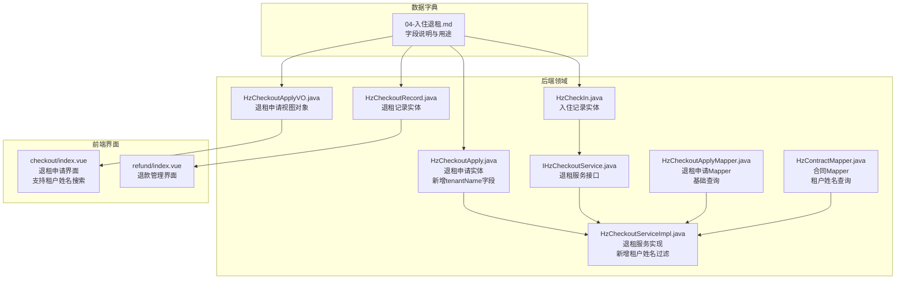

**图表来源**
- [04-入住退租.md:1-175](file://docs/数据字典/04-入住退租.md#L1-L175)
- [HzCheckIn.java:1-626](file://ruoyi-system/src/main/java/com/ruoyi/system/domain/HzCheckIn.java#L1-L626)
- [HzCheckoutApply.java:1-256](file://ruoyi-system/src/main/java/com/ruoyi/system/domain/HzCheckoutApply.java#L1-L256)
- [HzCheckoutApplyVO.java:1-584](file://ruoyi-system/src/main/java/com/ruoyi/system/domain/HzCheckoutApplyVO.java#L1-L584)
- [HzCheckoutRecord.java:1-364](file://ruoyi-system/src/main/java/com/ruoyi/system/domain/HzCheckoutRecord.java#L1-L364)
- [HzCheckoutServiceImpl.java:110-309](file://ruoyi-system/src/main/java/com/ruoyi/system/service/impl/HzCheckoutServiceImpl.java#L110-L309)
- [IHzCheckoutService.java:1-198](file://ruoyi-system/src/main/java/com/ruoyi/system/service/IHzCheckoutService.java#L1-L198)
- [HzCheckoutApplyMapper.java:1-28](file://ruoyi-system/src/main/java/com/ruoyi/system/mapper/HzCheckoutApplyMapper.java#L1-L28)
- [HzContractMapper.java:1-36](file://ruoyi-system/src/main/java/com/ruoyi/system/mapper/HzContractMapper.java#L1-L36)
- [checkout/index.vue:1-200](file://ruoyi-ui/src/views/gangzhu/checkout/index.vue#L1-L200)
- [refund/index.vue:142-162](file://ruoyi-ui/src/views/gangzhu/refund/index.vue#L142-L162)

**章节来源**
- [04-入住退租.md:1-175](file://docs/数据字典/04-入住退租.md#L1-L175)
- [HzCheckIn.java:1-626](file://ruoyi-system/src/main/java/com/ruoyi/system/domain/HzCheckIn.java#L1-L626)
- [HzCheckoutApply.java:1-256](file://ruoyi-system/src/main/java/com/ruoyi/system/domain/HzCheckoutApply.java#L1-L256)
- [HzCheckoutApplyVO.java:1-584](file://ruoyi-system/src/main/java/com/ruoyi/system/domain/HzCheckoutApplyVO.java#L1-L584)
- [HzCheckoutRecord.java:1-364](file://ruoyi-system/src/main/java/com/ruoyi/system/domain/HzCheckoutRecord.java#L1-L364)
- [HzCheckoutServiceImpl.java:110-309](file://ruoyi-system/src/main/java/com/ruoyi/system/service/impl/HzCheckoutServiceImpl.java#L110-L309)
- [IHzCheckoutService.java:1-198](file://ruoyi-system/src/main/java/com/ruoyi/system/service/IHzCheckoutService.java#L1-L198)

## 核心数据表概览
- 入住登记表（hz_checkin_record）
  - 关键字段：入住单号、申请ID、合同ID、租户ID、房源ID、入住日期/时间、电/水/燃气表读数、钥匙数量、物品清单ID、照片、租户/管理员签名、状态、经办人信息等。
  - 用途：记录实际入住时点、设施快照、费用初始读数、现场确认与归档。
- 退租申请表（hz_checkout_apply）
  - 关键字段：申请ID、合同ID、租户ID、房源ID、申请时间、计划退租日期、退租原因、是否提前解约、违约金、未结账单、押金退款、申请状态、审批人/时间/意见、费用明细（水/电/燃气/物业/供暖等）、物品清单ID、表计读数、钥匙归还数量、照片、租户签名等。
  - 用途：承载退租申请、费用计算、审批流与现场确认。
  - **更新** 新增rentRefund字段用于存储审批时确定的应退租金金额，支持精确的租金退款计算。
  - **更新** 新增currentPeriodOwed字段用于存储当期未缴费的按日折算金额，完善按日精算的财务处理。
  - **更新** 新增tenantName字段（仅查询参数透传，不映射数据库），支持按合同表tenant_name快照进行模糊查询过滤。
- 退租记录表（hz_checkout_record）
  - 关键字段：记录ID、申请ID、合同ID、租户ID、房源ID、退租日期/时间、表计读数、钥匙归还数量、物品清单ID、照片、损坏描述/扣款、各类费用（水电燃气、欠租、违约金）、押金退款、退款状态/时间、付款方式/凭证/备注、租户/管理员签名、经办人信息等。
  - 用途：记录退租完成后的最终结算、退款与归档。

**章节来源**
- [04-入住退租.md:3-175](file://docs/数据字典/04-入住退租.md#L3-L175)

## 架构总览
从业务视角，入住退租涉及"申请—审核—办理—完成"的闭环流程；数据层面则由三张表串联，形成"申请→记录"的数据链路，并在退租环节补充"费用结算→退款"的闭环。

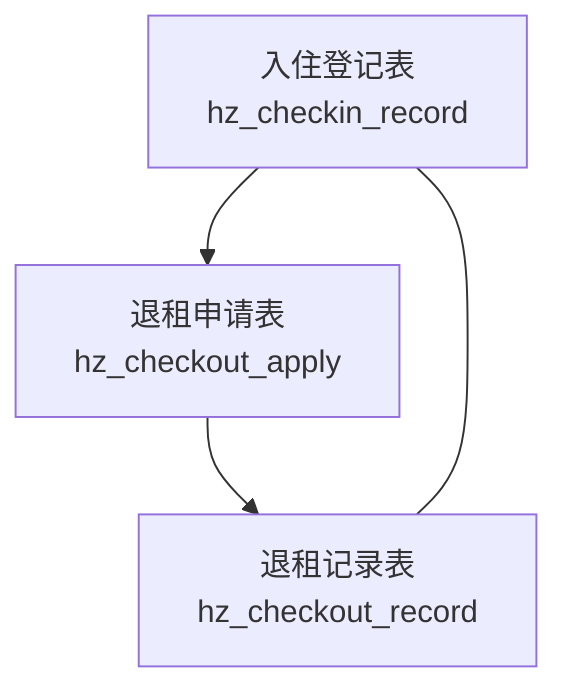

**图表来源**
- [04-入住退租.md:3-175](file://docs/数据字典/04-入住退租.md#L3-L175)

## 详细组件分析

### 入住登记表（hz_checkin_record）
- 设计要点
  - 主键与唯一标识：记录ID；业务单号字段在实体中体现为"入住单号"，便于外部检索与对账。
  - 关联关系：合同ID、租户ID、房源ID构成业务主键组合，确保一次入住的三方关系清晰。
  - 现场采集：电/水/燃气表初始读数、钥匙数量、物品清单ID、入住照片、租户/管理员签名，支撑现场确认与责任划分。
  - 状态管理：状态字段用于标识当前所处阶段（如待办理、待审核、已入住、已拒绝），配合审批流使用。
- 业务场景
  - 入住前准备：根据合同与房源信息生成申请，采集表计读数与物品清单。
  - 现场确认：租户与管理员共同确认设施状态，拍照留痕，签署确认。
  - 入住完成：更新状态为"已入住"，后续进入账单与退租流程。

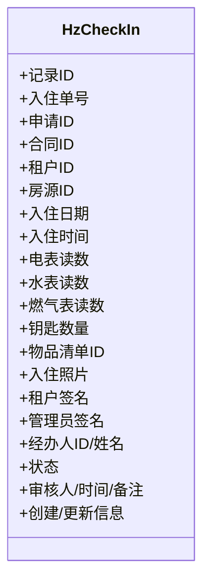

**图表来源**
- [HzCheckIn.java:1-626](file://ruoyi-system/src/main/java/com/ruoyi/system/domain/HzCheckIn.java#L1-L626)

**章节来源**
- [HzCheckIn.java:1-626](file://ruoyi-system/src/main/java/com/ruoyi/system/domain/HzCheckIn.java#L1-L626)
- [04-入住退租.md:31-61](file://docs/数据字典/04-入住退租.md#L31-L61)

### 退租申请表（hz_checkout_apply）
- 设计要点
  - 申请生命周期：申请时间、计划退租日期、申请状态（审批中/通过/驳回/取消/待确认）。
  - 费用核算：违约金、未结账单、押金退款、水/电/燃气/物业/供暖等费用明细，以及损坏扣款与描述。
  - 现场确认：物品清单ID、表计读数、钥匙归还数量、退租照片、租户签名，作为结算依据。
  - **更新** 新增rentRefund字段用于存储审批时确定的应退租金金额，支持精确的租金退款计算。
  - **更新** 新增currentPeriodOwed字段用于存储当期未缴费的按日折算金额，完善按日精算的财务处理。
  - **更新** 新增refundAmount字段用于存储管理员可编辑的应退总额，支持灵活的退款管理。
  - **更新** 新增tenantName字段（仅查询参数透传，不映射数据库），支持按合同表tenant_name快照进行模糊查询过滤。
- 业务场景
  - 申请提交：租户填写退租原因、计划退租日期及相关费用明细。
  - 审核决策：管理员基于现场盘点与费用明细进行审批，决定通过或驳回。
  - 待确认：部分场景下需租户二次确认，形成"待确认"状态，确保双方一致。

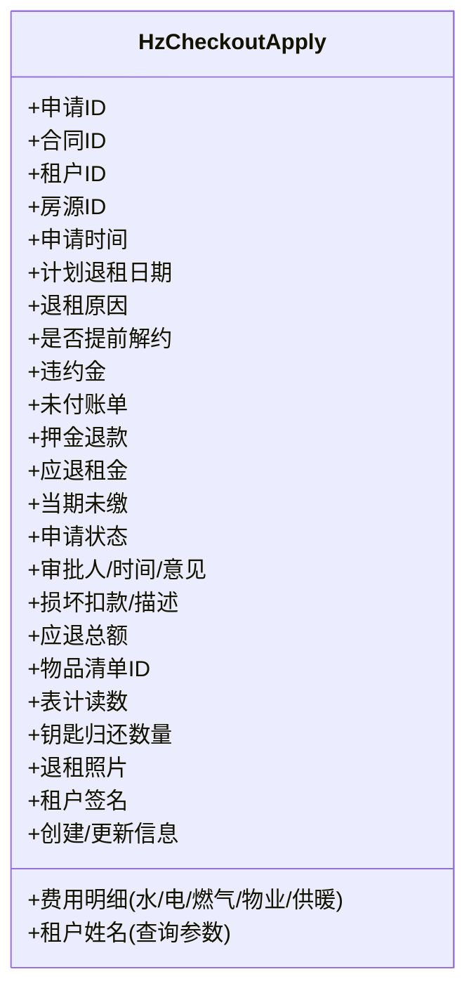

**图表来源**
- [HzCheckoutApply.java:1-256](file://ruoyi-system/src/main/java/com/ruoyi/system/domain/HzCheckoutApply.java#L1-L256)

**章节来源**
- [HzCheckoutApply.java:1-256](file://ruoyi-system/src/main/java/com/ruoyi/system/domain/HzCheckoutApply.java#L1-L256)
- [04-入住退租.md:64-91](file://docs/数据字典/04-入住退租.md#L64-L91)

### 退租申请视图对象（HzCheckoutApplyVO）
- 设计要点
  - **新增** checkinStatus字段：用于退租时判断"未入住"场景，值为null/0=未提交入住，1=待审核，2=审核通过，3=审核拒绝。
  - **更新** depositRefund字段：用于存储应退押金金额，支持精确的退款计算。
  - **更新** rentRefund字段：用于存储审批时确定的应退租金金额，支持精确的租金退款计算。
  - 完整信息聚合：包含退租申请、合同、房源的完整信息，便于前端展示和业务处理。
- 业务场景
  - 退租场景判断：通过checkinStatus字段判断租户是否已完成入住，影响退租流程的处理逻辑。
  - 退款计算：通过depositRefund和rentRefund字段提供精确的应退押金和应退租金金额，提升用户体验。

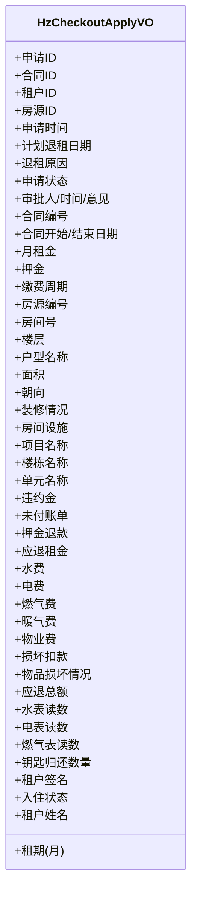

**图表来源**
- [HzCheckoutApplyVO.java:1-584](file://ruoyi-system/src/main/java/com/ruoyi/system/domain/HzCheckoutApplyVO.java#L1-L584)

**章节来源**
- [HzCheckoutApplyVO.java:1-584](file://ruoyi-system/src/main/java/com/ruoyi/system/domain/HzCheckoutApplyVO.java#L1-L584)

### 退租记录表（hz_checkout_record）
- 设计要点
  - 结算闭环：记录最终结算项（水电燃气费、欠租、违约金、押金退款）、退款状态与时间、付款方式/凭证/备注。
  - 现场证据：损坏描述/扣款、钥匙归还数量、退租照片、租户/管理员签名，确保可追溯。
  - 关联一致性：与申请表保持申请ID、合同ID、租户ID、房源ID一致，保证数据一致性。
- 业务场景
  - 办理完成：管理员确认结算无误，发起退款或线下结算，更新退款状态与时间。
  - 归档保存：将所有证据与结算结果写入记录表，形成历史档案。

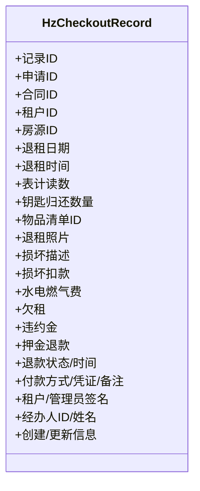

**图表来源**
- [HzCheckoutRecord.java:1-364](file://ruoyi-system/src/main/java/com/ruoyi/system/domain/HzCheckoutRecord.java#L1-L364)

**章节来源**
- [HzCheckoutRecord.java:1-364](file://ruoyi-system/src/main/java/com/ruoyi/system/domain/HzCheckoutRecord.java#L1-L364)
- [04-入住退租.md:94-131](file://docs/数据字典/04-入住退租.md#L94-L131)

### 按日精算的退租租金计算
- 设计要点
  - **新增** 按日精算功能：覆盖四种退租场景的精确计算逻辑
  - **场景一**：不满一月退租，退租当期已缴 → rentRefund = 已缴 - 日租金×入住天数
  - **场景二**：满一月退租，退租当期(下一期)已缴 → 同上
  - **场景三**：退租当期未缴费 → currentPeriodOwed = 日租金×入住天数（从应退总额中扣）
  - **场景四**：未入住（退租日 <= 合同生效日） → 全部已付租金账单全额退
  - **精度控制**：日租金 = 月租金 / 当期天数，先保留2位小数（HALF_UP）再乘入住天数
  - **天数计算**：入住天数含两端：end - start + 1
- 业务场景
  - 精确计算：根据合同生效日、计划退租日期和账单周期进行精确的租金计算
  - 财务处理：支持当期未缴费的按日折算，完善退租流程的财务处理
  - 用户体验：提供详细的计算明细，增强透明度和可信度

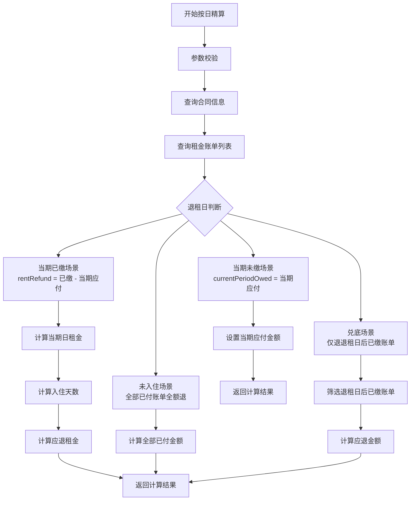

**图表来源**
- [HzCheckoutServiceImpl.java:1000-1065](file://ruoyi-system/src/main/java/com/ruoyi/system/service/impl/HzCheckoutServiceImpl.java#L1000-L1065)

**章节来源**
- [HzCheckoutServiceImpl.java:1000-1065](file://ruoyi-system/src/main/java/com/ruoyi/system/service/impl/HzCheckoutServiceImpl.java#L1000-L1065)
- [IHzCheckoutService.java:184-196](file://ruoyi-system/src/main/java/com/ruoyi/system/service/IHzCheckoutService.java#L184-L196)

### 租户姓名过滤功能
- 设计要点
  - **新增** tenantName字段：在HzCheckoutApply中新增tenantName字段（仅查询参数透传，不映射数据库），用于支持按合同表tenant_name快照进行模糊查询过滤。
  - **查询逻辑**：通过HzCheckoutServiceImpl中的selectCheckoutApplyListWithDetails方法实现租户姓名过滤，使用合同表的tenant_name快照进行模糊匹配。
  - **稳定性保障**：使用合同表tenant_name快照而非当前租户姓名，确保即使租户改名也不会影响历史退租申请的查询结果。
  - **性能优化**：先通过合同表查询匹配的contract_id列表，再在退租申请表中使用in条件进行高效过滤。
- 业务场景
  - 退租申请搜索：管理员可通过租户姓名快速查找特定租户的退租申请记录。
  - 历史记录查询：支持按租户姓名搜索历史退租记录，不受租户姓名变更影响。
  - 精准定位：结合其他筛选条件（申请状态、申请时间等）进行精准的退租申请定位。

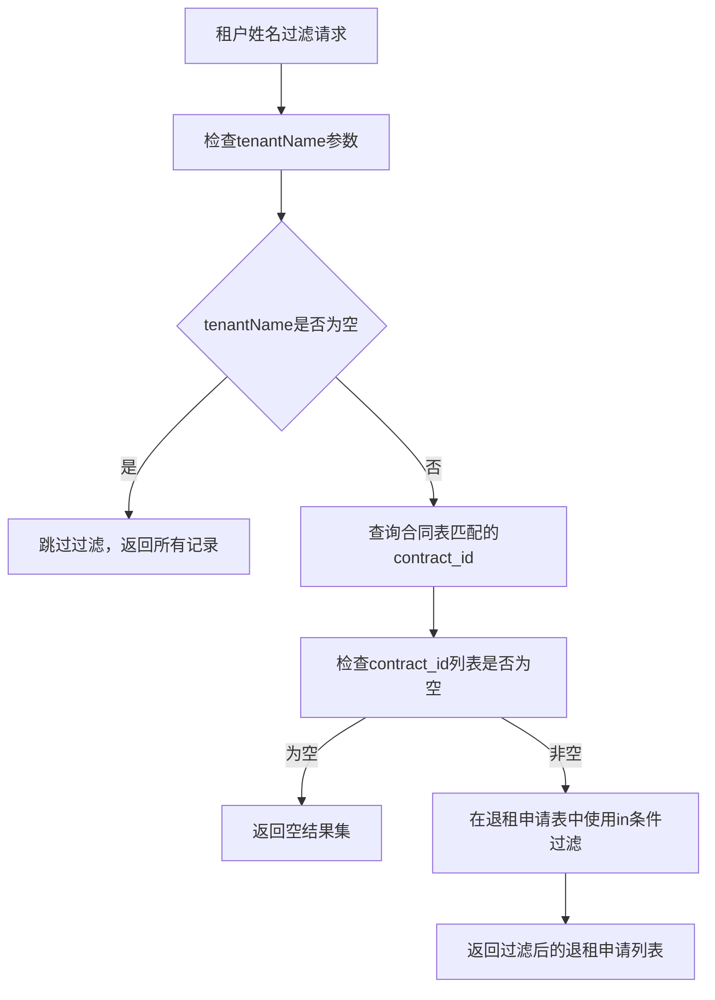

**图表来源**
- [HzCheckoutServiceImpl.java:119-134](file://ruoyi-system/src/main/java/com/ruoyi/system/service/impl/HzCheckoutServiceImpl.java#L119-L134)
- [HzCheckoutApply.java:153-155](file://ruoyi-system/src/main/java/com/ruoyi/system/domain/HzCheckoutApply.java#L153-L155)

**章节来源**
- [HzCheckoutServiceImpl.java:119-134](file://ruoyi-system/src/main/java/com/ruoyi/system/service/impl/HzCheckoutServiceImpl.java#L119-L134)
- [HzCheckoutApply.java:153-155](file://ruoyi-system/src/main/java/com/ruoyi/system/domain/HzCheckoutApply.java#L153-L155)

### 业务流程与数据流（申请—审核—办理—完成）
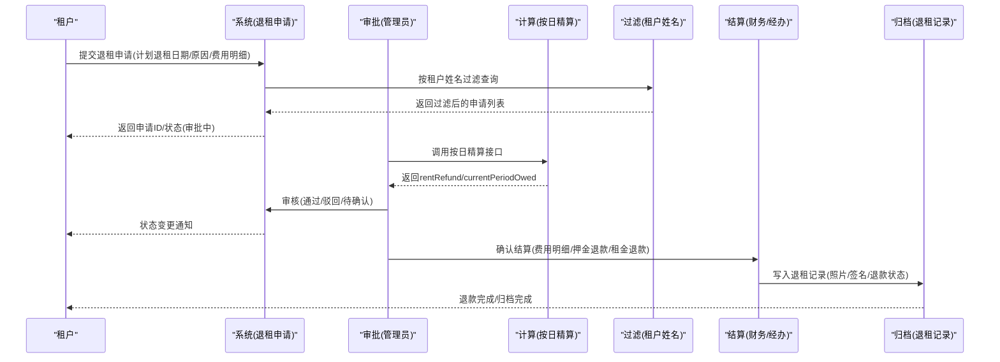

**图表来源**
- [04-入住退租.md:64-131](file://docs/数据字典/04-入住退租.md#L64-L131)
- [HzCheckoutApply.java:1-256](file://ruoyi-system/src/main/java/com/ruoyi/system/domain/HzCheckoutApply.java#L1-L256)
- [HzCheckoutRecord.java:1-364](file://ruoyi-system/src/main/java/com/ruoyi/system/domain/HzCheckoutRecord.java#L1-L364)
- [HzCheckoutServiceImpl.java:119-134](file://ruoyi-system/src/main/java/com/ruoyi/system/service/impl/HzCheckoutServiceImpl.java#L119-L134)

## 依赖关系分析
- 表间依赖
  - 退租申请表与退租记录表通过申请ID建立直接关联，确保申请与完成记录的一致性。
  - 入住登记表与退租申请表通过合同ID、租户ID、房源ID形成业务关联，便于跨表查询与统计。
- 代码层依赖
  - 实体类（HzCheckIn、HzCheckoutApply、HzCheckoutRecord）映射数据库表，字段命名与数据字典保持一致。
  - 视图对象（HzCheckoutApplyVO）包含完整的业务信息，新增checkinStatus、depositRefund、rentRefund字段用于退租场景判断和精确计算。
  - 服务接口（IHzCheckoutService）定义退租相关操作契约，包括按日精算的租金计算功能和租户姓名过滤功能。
  - 服务实现（HzCheckoutServiceImpl）负责退租流程的具体业务逻辑，包括rentRefund和currentPeriodOwed字段的计算和处理，以及租户姓名过滤的实现。
  - Mapper接口（HzCheckoutApplyMapper、HzContractMapper）提供数据访问能力，支持退租申请查询和合同信息查询。
- 前端依赖
  - checkout/index.vue界面支持rentRefund和currentPeriodOwed字段的显示和计算，提供精确的应退租金金额展示。
  - refund/index.vue界面支持rentRefund字段的退款明细展示，便于财务管理和审计。
  - 前端查询表单支持tenantName字段的输入，实现租户姓名的模糊搜索。
- 数据库依赖
  - 退租申请表新增rentRefund和currentPeriodOwed字段，支持按日精算的财务处理。
  - 退租记录表保持现有字段结构，用于记录最终结算结果。
  - 合同表tenant_name字段用于租户姓名过滤的稳定查询。

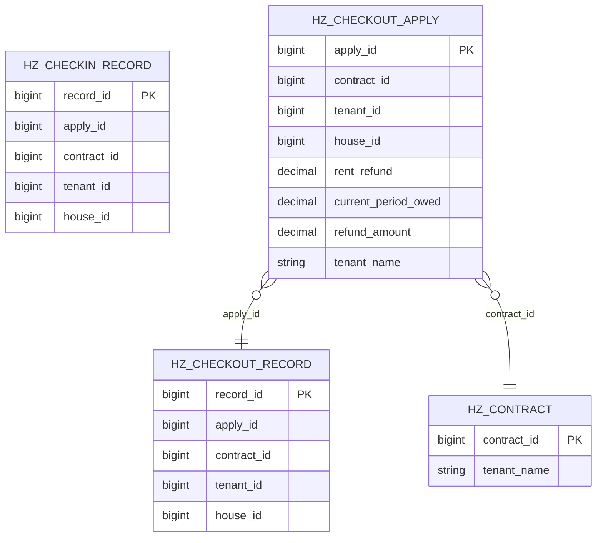

**图表来源**
- [04-入住退租.md:3-175](file://docs/数据字典/04-入住退租.md#L3-L175)
- [HzCheckoutApply.java:71-73](file://ruoyi-system/src/main/java/com/ruoyi/system/domain/HzCheckoutApply.java#L71-L73)
- [HzCheckoutApplyVO.java:137-139](file://ruoyi-system/src/main/java/com/ruoyi/system/domain/HzCheckoutApplyVO.java#L137-L139)
- [HzContractMapper.java:18-35](file://ruoyi-system/src/main/java/com/ruoyi/system/mapper/HzContractMapper.java#L18-L35)

**章节来源**
- [04-入住退租.md:3-175](file://docs/数据字典/04-入住退租.md#L3-L175)
- [HzCheckIn.java:1-626](file://ruoyi-system/src/main/java/com/ruoyi/system/domain/HzCheckIn.java#L1-L626)
- [HzCheckoutApply.java:1-256](file://ruoyi-system/src/main/java/com/ruoyi/system/domain/HzCheckoutApply.java#L1-L256)
- [HzCheckoutRecord.java:1-364](file://ruoyi-system/src/main/java/com/ruoyi/system/domain/HzCheckoutRecord.java#L1-L364)

## 性能与扩展性考虑
- 字段类型与精度
  - 金额类字段采用高精度数值类型，避免浮点误差；日期/时间字段采用日期与时间分离，便于统计与排序。
  - **更新** 新增的rentRefund和currentPeriodOwed字段同样采用BigDecimal类型，确保租金退款金额的精确计算。
- 索引建议
  - 在合同ID、租户ID、房源ID、申请ID、记录ID等高频查询字段上建立索引，提升关联查询效率。
  - **更新** 在合同表tenant_name字段上建立索引，提升租户姓名过滤的查询性能。
- 扩展点
  - 申请状态与记录状态可抽象为枚举或字典值，便于未来扩展新状态而不改动表结构。
  - 照片/签名等大字段建议落盘存储并仅保留路径，减少数据库体积。
  - **更新** 按日精算功能可扩展为多种退款类型的区分，支持更复杂的退款场景。
  - **更新** currentPeriodOwed字段可用于未来支持分期付款的退租场景。
  - **更新** 租户姓名过滤功能可扩展为多条件组合查询，支持更复杂的搜索场景。
- 数据一致性
  - **更新** 租户姓名过滤使用合同表tenant_name快照，确保历史数据查询的稳定性，不受租户姓名变更影响。

## 故障排查指南
- 常见问题
  - 申请状态异常：检查退租申请表的状态字段与审批流程是否一致；核对审批人/时间/意见是否正确更新。
  - 结算不一致：比对退租申请表与退租记录表的费用明细字段，确认是否存在遗漏或重复计算。
  - 现场证据缺失：核查物品清单ID、表计读数、钥匙归还数量、照片、签名是否完整上传。
  - **更新** 退款计算错误：检查rentRefund和currentPeriodOwed字段的值是否正确，确认按日精算逻辑的执行结果。
  - **更新** 未入住退租异常：检查checkinStatus字段的值，确认退租场景的正确判断。
  - **更新** 按日精算异常：检查calculateRentRefund方法的执行结果，确认合同生效日、计划退租日期和账单周期的处理逻辑。
  - **更新** 租户姓名过滤异常：检查tenantName字段的查询逻辑，确认合同表tenant_name快照的匹配结果。
  - **更新** 查询性能问题：检查合同表tenant_name字段的索引是否有效，确认查询语句的执行计划。
- 定位方法
  - 通过合同ID与租户ID快速定位相关记录，核对三表之间的关联字段一致性。
  - 使用服务接口（如退租服务接口）辅助定位与验证数据状态。
  - **更新** 通过HzCheckoutServiceImpl的按日精算逻辑检查rentRefund和currentPeriodOwed字段的计算和验证。
  - **更新** 检查HzCheckoutApply表的rentRefund和currentPeriodOwed字段是否正确保存到数据库。
  - **更新** 通过HzCheckoutServiceImpl的租户姓名过滤逻辑检查tenantName参数的处理和查询结果。

**章节来源**
- [IHzCheckoutService.java:1-198](file://ruoyi-system/src/main/java/com/ruoyi/system/service/IHzCheckoutService.java#L1-L198)
- [04-入住退租.md:64-131](file://docs/数据字典/04-入住退租.md#L64-L131)
- [HzCheckoutServiceImpl.java:119-134](file://ruoyi-system/src/main/java/com/ruoyi/system/service/impl/HzCheckoutServiceImpl.java#L119-L134)
- [HzCheckoutServiceImpl.java:1000-1065](file://ruoyi-system/src/main/java/com/ruoyi/system/service/impl/HzCheckoutServiceImpl.java#L1000-L1065)

## 结论
- 三张表覆盖了"入住—退租"的完整业务闭环：申请、审核、办理、完成。
- 数据字典明确了字段含义与用途，实体类与服务接口提供了清晰的代码边界。
- **更新** 新增的rentRefund和currentPeriodOwed字段显著提升了退租流程的费用结算准确性和用户体验。
- **更新** 按日精算功能实现了四种退租场景的精确计算，完善了财务处理逻辑。
- **更新** 租户姓名过滤功能通过合同表tenant_name快照实现了稳定的租户姓名查询，增强了退租申请的搜索能力。
- 建议在生产环境中完善索引策略、状态枚举化与大字段落盘策略，以及合同表tenant_name字段的索引优化，以提升稳定性与可维护性。

## 附录：数据流与状态机
- 入住登记表状态（示例）
  - 待办理 → 待审核 → 已入住 → 已拒绝（或已退租）
- 退租申请表状态（示例）
  - 审批中 → 审批通过 → 审批驳回 → 已取消 → 待确认
- 退租记录表状态（示例）
  - 退款状态：待退还 → 已退还
- **更新** 退租场景状态（示例）
  - 未入住退租：checkinStatus=null/0 → 退租申请 → 退款处理
  - 已入住退租：checkinStatus=2 → 正常退租流程
  - **更新** 按日精算状态：rentRefund/currentPeriodOwed字段的计算与应用
  - **更新** 租户姓名过滤状态：tenantName字段的查询与过滤
- **更新** 按日精算场景（示例）
  - 不满一月退租：rentRefund = 已缴 - 日租金×入住天数
  - 满一月退租：rentRefund = 已缴 - 日租金×入住天数
  - 当期未缴费：currentPeriodOwed = 日租金×入住天数（从应退总额中扣）
  - 未入住退租：rentRefund = 全部已付租金账单
- **更新** 租户姓名过滤场景（示例）
  - 模糊匹配：tenantName字段支持模糊查询，使用合同表tenant_name快照
  - 稳定查询：不受租户姓名变更影响的历史记录查询
  - 性能优化：先查询contract_id再过滤退租申请，提升查询效率

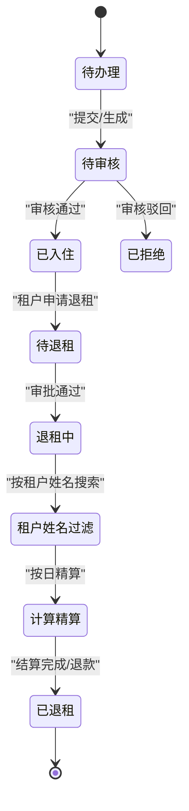

**图表来源**
- [04-入住退租.md:3-175](file://docs/数据字典/04-入住退租.md#L3-L175)
- [HzCheckIn.java:1-626](file://ruoyi-system/src/main/java/com/ruoyi/system/domain/HzCheckIn.java#L1-L626)
- [HzCheckoutApply.java:1-256](file://ruoyi-system/src/main/java/com/ruoyi/system/domain/HzCheckoutApply.java#L1-L256)
- [HzCheckoutRecord.java:1-364](file://ruoyi-system/src/main/java/com/ruoyi/system/domain/HzCheckoutRecord.java#L1-L364)
- [HzCheckoutServiceImpl.java:119-134](file://ruoyi-system/src/main/java/com/ruoyi/system/service/impl/HzCheckoutServiceImpl.java#L119-L134)
- [HzCheckoutServiceImpl.java:1000-1065](file://ruoyi-system/src/main/java/com/ruoyi/system/service/impl/HzCheckoutServiceImpl.java#L1000-L1065)