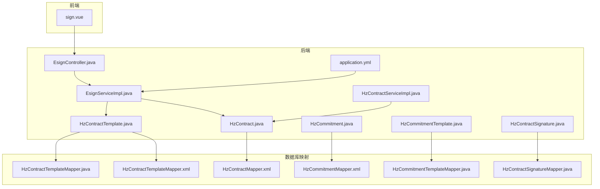
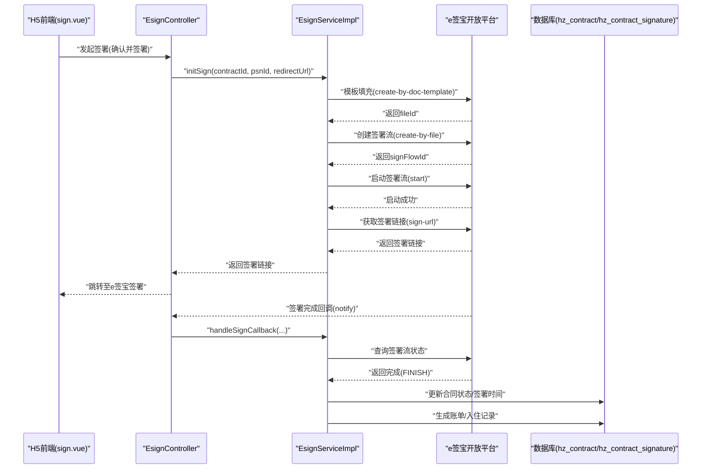
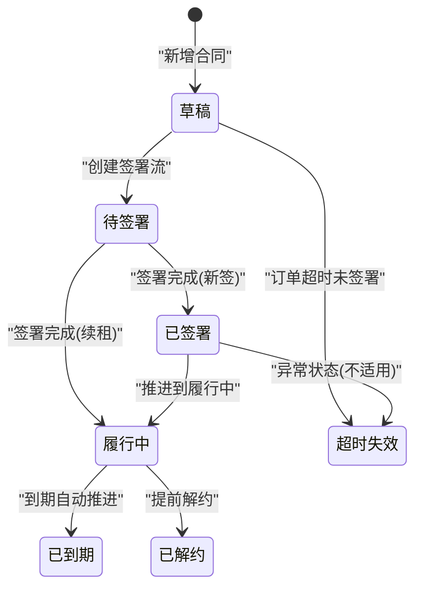
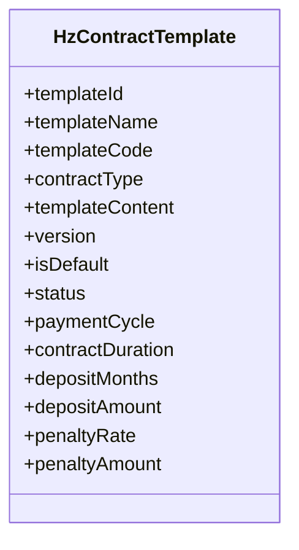
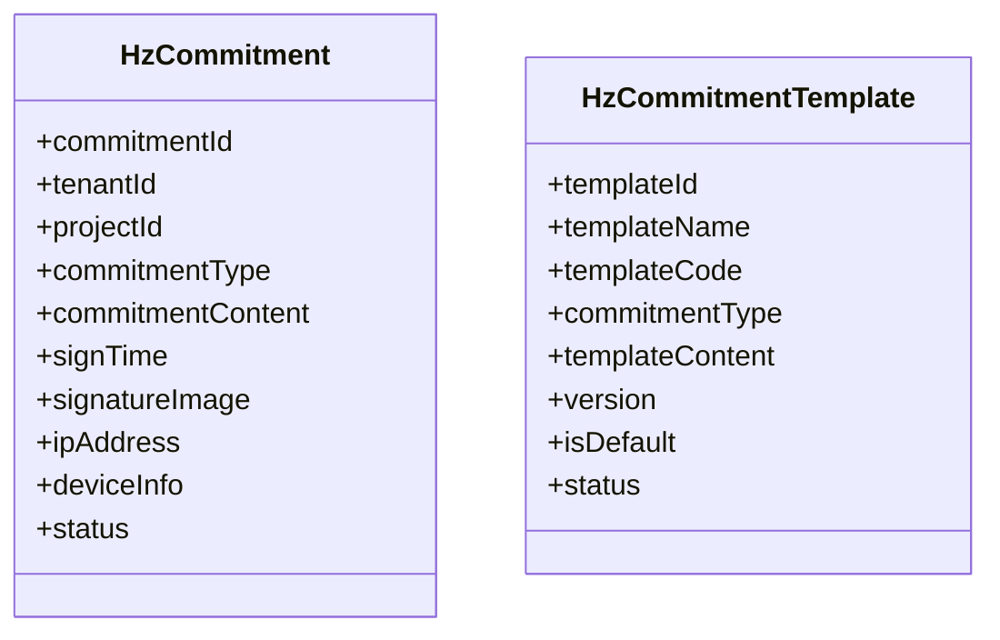
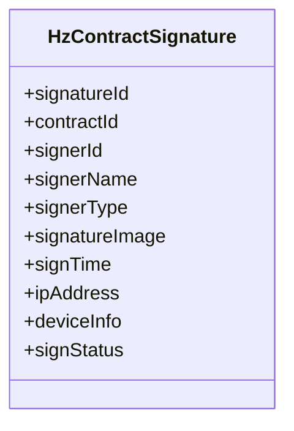
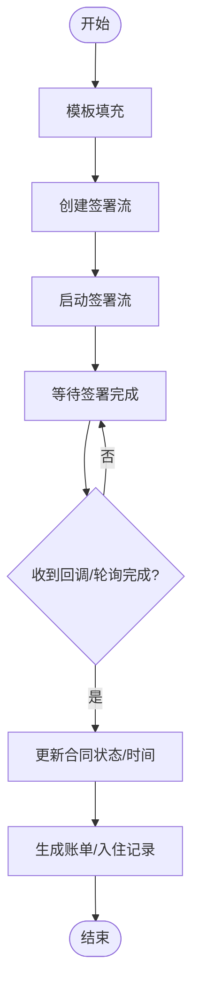
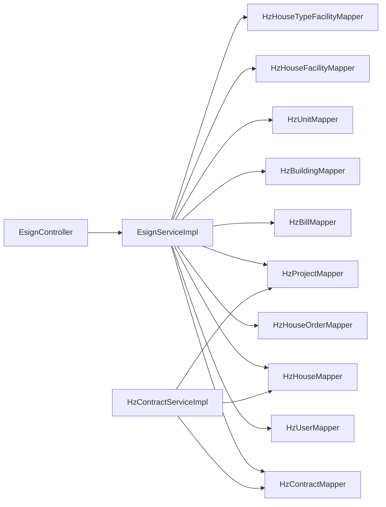

# 合同管理表

<cite>
**本文引用的文件**
- [HzContract.java](file://ruoyi-system/src/main/java/com/ruoyi/system/domain/HzContract.java)
- [HzContractTemplate.java](file://ruoyi-system/src/main/java/com/ruoyi/system/domain/HzContractTemplate.java)
- [HzCommitment.java](file://ruoyi-system/src/main/java/com/ruoyi/system/domain/HzCommitment.java)
- [HzCommitmentTemplate.java](file://ruoyi-system/src/main/java/com/ruoyi/system/domain/HzCommitmentTemplate.java)
- [HzContractSignature.java](file://ruoyi-system/src/main/java/com/ruoyi/system/domain/HzContractSignature.java)
- [HzContractMapper.xml](file://ruoyi-system/src/main/resources/mapper/system/HzContractMapper.xml)
- [HzContractTemplateMapper.xml](file://ruoyi-system/src/main/resources/mapper/system/HzContractTemplateMapper.xml)
- [HzContractSignatureMapper.java](file://ruoyi-system/src/main/java/com/ruoyi/system/mapper/HzContractSignatureMapper.java)
- [HzContractTemplateMapper.java](file://ruoyi-system/src/main/java/com/ruoyi/system/mapper/HzContractTemplateMapper.java)
- [HzCommitmentMapper.xml](file://ruoyi-system/src/main/resources/mapper/system/HzCommitmentMapper.xml)
- [HzCommitmentTemplateMapper.java](file://ruoyi-system/src/main/java/com/ruoyi/system/mapper/HzCommitmentTemplateMapper.java)
- [EsignServiceImpl.java](file://ruoyi-system/src/main/java/com/ruoyi/system/service/impl/EsignServiceImpl.java)
- [IHzContractService.java](file://ruoyi-system/src/main/java/com/ruoyi/system/service/IHzContractService.java)
- [HzContractServiceImpl.java](file://ruoyi-system/src/main/java/com/ruoyi/system/service/impl/HzContractServiceImpl.java)
- [HzHouseOrderServiceImpl.java](file://ruoyi-system/src/main/java/com/ruoyi/system/service/impl/HzHouseOrderServiceImpl.java)
- [EsignController.java](file://ruoyi-admin/src/main/java/com/ruoyi/web/controller/h5/EsignController.java)
- [application.yml](file://ruoyi-admin/src/main/resources/application.yml)
- [sign.vue](file://uniapp-h5/pages/contract/sign.vue)
- [03-合同管理.md](file://docs/数据字典/03-合同管理.md)
</cite>

## 目录
1. [简介](#简介)
2. [项目结构](#项目结构)
3. [核心组件](#核心组件)
4. [架构总览](#架构总览)
5. [详细组件分析](#详细组件分析)
6. [依赖分析](#依赖分析)
7. [性能考虑](#性能考虑)
8. [故障排查指南](#故障排查指南)
9. [结论](#结论)
10. [附录](#附录)

## 简介
本文件面向合同管理模块，系统性梳理合同表(hz_contract)、合同模板表(hz_contract_template)、承诺书表(hz_commitment)、承诺书模板表(hz_commitment_template)、合同签署记录表(hz_contract_signature)的设计与用途，并结合电子合同签署流程、模板管理、签署状态跟踪、合同生命周期管理等业务逻辑，提供数据模型与电子合同服务集成的技术实现说明。

## 项目结构
合同管理模块涉及后端领域模型、MyBatis映射、服务层、控制器以及前端H5页面协同工作，形成“数据模型-服务-接口-前端”的完整闭环。

**图表来源**
- [HzContract.java:1-606](file://ruoyi-system/src/main/java/com/ruoyi/system/domain/HzContract.java#L1-L606)
- [HzContractTemplate.java:1-228](file://ruoyi-system/src/main/java/com/ruoyi/system/domain/HzContractTemplate.java#L1-L228)
- [HzCommitment.java:1-174](file://ruoyi-system/src/main/java/com/ruoyi/system/domain/HzCommitment.java#L1-L174)
- [HzCommitmentTemplate.java:1-148](file://ruoyi-system/src/main/java/com/ruoyi/system/domain/HzCommitmentTemplate.java#L1-L148)
- [HzContractSignature.java:1-174](file://ruoyi-system/src/main/java/com/ruoyi/system/domain/HzContractSignature.java#L1-L174)
- [EsignServiceImpl.java:1-1158](file://ruoyi-system/src/main/java/com/ruoyi/system/service/impl/EsignServiceImpl.java#L1-L1158)
- [HzContractServiceImpl.java:1-334](file://ruoyi-system/src/main/java/com/ruoyi/system/service/impl/HzContractServiceImpl.java#L1-L334)
- [EsignController.java:191-231](file://ruoyi-admin/src/main/java/com/ruoyi/web/controller/h5/EsignController.java#L191-L231)
- [application.yml:199-218](file://ruoyi-admin/src/main/resources/application.yml#L199-L218)
- [HzContractMapper.xml](file://ruoyi-system/src/main/resources/mapper/system/HzContractMapper.xml)
- [HzContractTemplateMapper.xml](file://ruoyi-system/src/main/resources/mapper/system/HzContractTemplateMapper.xml)
- [HzCommitmentMapper.xml](file://ruoyi-system/src/main/resources/mapper/system/HzCommitmentMapper.xml)
- [HzContractSignatureMapper.java:1-15](file://ruoyi-system/src/main/java/com/ruoyi/system/mapper/HzContractSignatureMapper.java#L1-L15)
- [HzContractTemplateMapper.java:1-14](file://ruoyi-system/src/main/java/com/ruoyi/system/mapper/HzContractTemplateMapper.java#L1-L14)
- [HzCommitmentTemplateMapper.java:1-14](file://ruoyi-system/src/main/java/com/ruoyi/system/mapper/HzCommitmentTemplateMapper.java#L1-L14)
- [sign.vue:108-139](file://uniapp-h5/pages/contract/sign.vue#L108-L139)

**章节来源**
- [HzContract.java:1-606](file://ruoyi-system/src/main/java/com/ruoyi/system/domain/HzContract.java#L1-L606)
- [HzContractTemplate.java:1-228](file://ruoyi-system/src/main/java/com/ruoyi/system/domain/HzContractTemplate.java#L1-L228)
- [HzCommitment.java:1-174](file://ruoyi-system/src/main/java/com/ruoyi/system/domain/HzCommitment.java#L1-L174)
- [HzCommitmentTemplate.java:1-148](file://ruoyi-system/src/main/java/com/ruoyi/system/domain/HzCommitmentTemplate.java#L1-L148)
- [HzContractSignature.java:1-174](file://ruoyi-system/src/main/java/com/ruoyi/system/domain/HzContractSignature.java#L1-L174)

## 核心组件
- 合同表 hz_contract：承载合同主体信息、模板引用、费用要素、签署状态、电子合同流程ID等。
- 合同模板表 hz_contract_template：定义合同模板的通用条款、计费周期、押金与违约金规则、默认模板标识等。
- 承诺书表 hz_commitment：记录租户签署的各类承诺书内容、签名图片、设备信息、状态等。
- 承诺书模板表 hz_commitment_template：定义承诺书模板的类型、HTML内容、版本与默认模板等。
- 合同签署记录表 hz_contract_signature：记录每次签署的签署人、签名图片、IP与设备信息、签署状态等。

上述表均采用统一的审计字段（创建者、创建时间、更新者、更新时间、备注、删除标志）与状态字段，便于追踪与合规。

**章节来源**
- [03-合同管理.md:42-136](file://docs/数据字典/03-合同管理.md#L42-L136)
- [HzContract.java:1-606](file://ruoyi-system/src/main/java/com/ruoyi/system/domain/HzContract.java#L1-L606)
- [HzContractTemplate.java:1-228](file://ruoyi-system/src/main/java/com/ruoyi/system/domain/HzContractTemplate.java#L1-L228)
- [HzCommitment.java:1-174](file://ruoyi-system/src/main/java/com/ruoyi/system/domain/HzCommitment.java#L1-L174)
- [HzCommitmentTemplate.java:1-148](file://ruoyi-system/src/main/java/com/ruoyi/system/domain/HzCommitmentTemplate.java#L1-L148)
- [HzContractSignature.java:1-174](file://ruoyi-system/src/main/java/com/ruoyi/system/domain/HzContractSignature.java#L1-L174)

## 架构总览
电子合同签署流程围绕“模板填充→创建签署流→启动签署→回调/轮询→账单/入住生成”展开，前后端与电子合同服务（e签宝）协同。

**图表来源**
- [EsignController.java:191-231](file://ruoyi-admin/src/main/java/com/ruoyi/web/controller/h5/EsignController.java#L191-L231)
- [EsignServiceImpl.java:180-288](file://ruoyi-system/src/main/java/com/ruoyi/system/service/impl/EsignServiceImpl.java#L180-L288)
- [application.yml:199-218](file://ruoyi-admin/src/main/resources/application.yml#L199-L218)
- [sign.vue:108-139](file://uniapp-h5/pages/contract/sign.vue#L108-L139)

## 详细组件分析

### 合同表 hz_contract
- 关键字段
  - 合同标识、合同编号、合同类型（首次签约/续租/换房）、模板ID、租户信息、房源信息、租金/押金、起止日期、缴费周期、免租期、合同内容/文件、双方签名、签署时间、合同状态、是否续租、续租合同ID、电子合同流程ID等。
- 状态流转
  - 草稿(0) → 待签署(1) → 已签署(2)/履行中(3) → 已到期(4)/已解约(5)/超时失效(6)。
- 生命周期管理
  - 与订单状态联动：订单超时未签署，同步将合同推进到超时失效(6)。
  - 与续租流程联动：续租合同签署完成后直接进入履行中(3)，新签合同进入已签署(2)。
- 电子合同集成
  - 通过模板填充生成PDF文件，创建签署流并启动；签署完成后回调或轮询更新合同状态与签署时间，并生成账单与入住记录。

**图表来源**
- [HzContract.java:139-142](file://ruoyi-system/src/main/java/com/ruoyi/system/domain/HzContract.java#L139-L142)
- [HzHouseOrderServiceImpl.java:290-309](file://ruoyi-system/src/main/java/com/ruoyi/system/service/impl/HzHouseOrderServiceImpl.java#L290-L309)
- [EsignServiceImpl.java:718-796](file://ruoyi-system/src/main/java/com/ruoyi/system/service/impl/EsignServiceImpl.java#L718-L796)

**章节来源**
- [HzContract.java:1-606](file://ruoyi-system/src/main/java/com/ruoyi/system/domain/HzContract.java#L1-L606)
- [IHzContractService.java:1-120](file://ruoyi-system/src/main/java/com/ruoyi/system/service/IHzContractService.java#L1-L120)
- [HzContractServiceImpl.java:303-334](file://ruoyi-system/src/main/java/com/ruoyi/system/service/impl/HzContractServiceImpl.java#L303-L334)
- [HzHouseOrderServiceImpl.java:290-309](file://ruoyi-system/src/main/java/com/ruoyi/system/service/impl/HzHouseOrderServiceImpl.java#L290-L309)
- [EsignServiceImpl.java:718-796](file://ruoyi-system/src/main/java/com/ruoyi/system/service/impl/EsignServiceImpl.java#L718-L796)

### 合同模板表 hz_contract_template
- 关键字段
  - 模板名称/编码、合同类型（人才公寓/保租房/市场租赁）、模板内容（支持占位符）、版本号、是否默认模板、状态、计费周期、合同期限、押金规则（月数/固定金额）、违约金规则（比例/固定金额）等。
- 模板管理
  - 默认模板用于新合同快速生成；版本控制便于迭代；状态控制启用/停用。
- 与电子合同集成
  - 模板内容与电子合同模板ID绑定，服务层通过模板填充接口将合同数据映射到电子合同控件。

**图表来源**
- [HzContractTemplate.java:1-228](file://ruoyi-system/src/main/java/com/ruoyi/system/domain/HzContractTemplate.java#L1-L228)
- [HzContractTemplateMapper.xml:7-27](file://ruoyi-system/src/main/resources/mapper/system/HzContractTemplateMapper.xml#L7-L27)

**章节来源**
- [03-合同管理.md:42-66](file://docs/数据字典/03-合同管理.md#L42-L66)
- [HzContractTemplate.java:1-228](file://ruoyi-system/src/main/java/com/ruoyi/system/domain/HzContractTemplate.java#L1-L228)
- [HzContractTemplateMapper.xml:7-27](file://ruoyi-system/src/main/resources/mapper/system/HzContractTemplateMapper.xml#L7-L27)

### 承诺书表 hz_commitment 与承诺书模板表 hz_commitment_template
- 承诺书表
  - 记录租户签署的承诺书类型（资格申请/入住/其他）、承诺内容、签名图片、IP与设备信息、状态（有效/失效）、删除标志等。
- 承诺书模板表
  - 定义模板名称/编码、承诺书类型、HTML模板内容、版本号、默认模板与状态。
- 业务要点
  - 通过模板生成承诺书内容；支持按租户与类型查询最新有效承诺书；模板默认化与版本化管理。

**图表来源**
- [HzCommitment.java:1-174](file://ruoyi-system/src/main/java/com/ruoyi/system/domain/HzCommitment.java#L1-L174)
- [HzCommitmentTemplate.java:1-148](file://ruoyi-system/src/main/java/com/ruoyi/system/domain/HzCommitmentTemplate.java#L1-L148)
- [HzCommitmentMapper.xml](file://ruoyi-system/src/main/resources/mapper/system/HzCommitmentMapper.xml)
- [HzCommitmentTemplateMapper.java:1-14](file://ruoyi-system/src/main/java/com/ruoyi/system/mapper/HzCommitmentTemplateMapper.java#L1-L14)

**章节来源**
- [03-合同管理.md:115-136](file://docs/数据字典/03-合同管理.md#L115-L136)
- [HzCommitment.java:1-174](file://ruoyi-system/src/main/java/com/ruoyi/system/domain/HzCommitment.java#L1-L174)
- [HzCommitmentTemplate.java:1-148](file://ruoyi-system/src/main/java/com/ruoyi/system/domain/HzCommitmentTemplate.java#L1-L148)

### 合同签署记录表 hz_contract_signature
- 关键字段
  - 签署ID、合同ID、签署人类型（租户/房东/管理员）、签署人ID/姓名、签名图片、签署时间、IP与设备信息、签署状态（未签署/已签署）、删除标志等。
- 作用
  - 记录每次签署的法律证据，支持审计与追溯；与合同状态联动，确保签署完整性。

**图表来源**
- [HzContractSignature.java:1-174](file://ruoyi-system/src/main/java/com/ruoyi/system/domain/HzContractSignature.java#L1-L174)
- [HzContractSignatureMapper.java:1-15](file://ruoyi-system/src/main/java/com/ruoyi/system/mapper/HzContractSignatureMapper.java#L1-L15)

**章节来源**
- [03-合同管理.md:90-112](file://docs/数据字典/03-合同管理.md#L90-L112)
- [HzContractSignature.java:1-174](file://ruoyi-system/src/main/java/com/ruoyi/system/domain/HzContractSignature.java#L1-L174)

### 电子合同签署流程与模板管理
- 模板填充
  - 服务层根据合同与用户数据构建电子合同控件映射，调用“模板填充”接口生成PDF文件ID。
- 签署流创建与启动
  - 使用文件ID创建签署流，配置通知地址、自动完成、签章位置与样式；启动签署流后返回签署链接。
- 回调与轮询
  - 通过回调或轮询查询签署流状态，完成则更新合同状态、签署时间，并生成账单与入住记录。
- 前端交互
  - H5页面展示签署提示与认证状态，引导用户完成签署与认证。

**图表来源**
- [EsignServiceImpl.java:180-288](file://ruoyi-system/src/main/java/com/ruoyi/system/service/impl/EsignServiceImpl.java#L180-L288)
- [EsignServiceImpl.java:718-796](file://ruoyi-system/src/main/java/com/ruoyi/system/service/impl/EsignServiceImpl.java#L718-L796)
- [EsignController.java:191-231](file://ruoyi-admin/src/main/java/com/ruoyi/web/controller/h5/EsignController.java#L191-L231)
- [application.yml:199-218](file://ruoyi-admin/src/main/resources/application.yml#L199-L218)
- [sign.vue:108-139](file://uniapp-h5/pages/contract/sign.vue#L108-L139)

**章节来源**
- [EsignServiceImpl.java:180-288](file://ruoyi-system/src/main/java/com/ruoyi/system/service/impl/EsignServiceImpl.java#L180-L288)
- [EsignServiceImpl.java:718-796](file://ruoyi-system/src/main/java/com/ruoyi/system/service/impl/EsignServiceImpl.java#L718-L796)
- [EsignController.java:191-231](file://ruoyi-admin/src/main/java/com/ruoyi/web/controller/h5/EsignController.java#L191-L231)
- [application.yml:199-218](file://ruoyi-admin/src/main/resources/application.yml#L199-L218)
- [sign.vue:108-139](file://uniapp-h5/pages/contract/sign.vue#L108-L139)

## 依赖分析
- 表与映射
  - 合同/模板/承诺书/签署记录均有对应的实体类与MyBatis映射文件或Mapper接口，遵循统一命名规范。
- 服务层依赖
  - EsignServiceImpl依赖用户、合同、订单、账单、房源、项目、楼栋、单元、设施等多张表的Mapper，用于模板填充与状态推进。
  - HzContractServiceImpl提供合同查询、分页、生成编号、原子锁定房源与失效释放等能力。
- 控制器与前端
  - EsignController提供签署回调、状态查询、模板详情查询等接口；H5前端负责引导用户完成签署与认证。

**图表来源**
- [EsignServiceImpl.java:55-74](file://ruoyi-system/src/main/java/com/ruoyi/system/service/impl/EsignServiceImpl.java#L55-L74)
- [HzContractServiceImpl.java:36-46](file://ruoyi-system/src/main/java/com/ruoyi/system/service/impl/HzContractServiceImpl.java#L36-L46)
- [EsignController.java:191-231](file://ruoyi-admin/src/main/java/com/ruoyi/web/controller/h5/EsignController.java#L191-L231)

**章节来源**
- [EsignServiceImpl.java:55-74](file://ruoyi-system/src/main/java/com/ruoyi/system/service/impl/EsignServiceImpl.java#L55-L74)
- [HzContractServiceImpl.java:36-46](file://ruoyi-system/src/main/java/com/ruoyi/system/service/impl/HzContractServiceImpl.java#L36-L46)
- [EsignController.java:191-231](file://ruoyi-admin/src/main/java/com/ruoyi/web/controller/h5/EsignController.java#L191-L231)

## 性能考虑
- 模板填充与文件生成
  - 模板填充后需轮询等待文件就绪，建议设置合理的重试次数与间隔，避免阻塞线程。
- 签署状态查询
  - 前端轮询与回调并用，减少等待时间；对高频查询可增加缓存策略（注意状态变更后的缓存失效）。
- 数据库更新
  - 签署完成后批量更新合同状态、生成账单与入住记录，建议在事务内执行，保证一致性。
- 字段长度控制
  - 模板控件存在最大长度限制，服务层已内置截断与告警，避免因超长导致签署失败。

[本节为通用指导，不直接分析具体文件]

## 故障排查指南
- 模板填充失败
  - 现象：模板填充接口返回错误，日志包含控件映射详情。
  - 排查：核对合同与用户数据是否完整；检查设施映射与控件ID是否匹配；关注字段长度截断日志。
- 签署流创建/启动失败
  - 现象：创建/启动签署流报错。
  - 排查：确认电子合同服务配置（应用ID、密钥、模板ID、回调地址）正确；检查网络连通性与证书。
- 回调未触发或状态不同步
  - 现象：前端显示未签署，实际已完成。
  - 排查：检查回调地址可达性与签名验证；必要时使用“主动查询签署状态”接口进行补偿处理。
- 订单超时未签署
  - 现象：订单超时，合同未推进到已签署。
  - 排查：确认订单服务对合同状态的推进逻辑；检查合同状态是否被其他流程覆盖。

**章节来源**
- [EsignServiceImpl.java:196-201](file://ruoyi-system/src/main/java/com/ruoyi/system/service/impl/EsignServiceImpl.java#L196-L201)
- [EsignServiceImpl.java:264-282](file://ruoyi-system/src/main/java/com/ruoyi/system/service/impl/EsignServiceImpl.java#L264-L282)
- [EsignController.java:208-219](file://ruoyi-admin/src/main/java/com/ruoyi/web/controller/h5/EsignController.java#L208-L219)
- [HzHouseOrderServiceImpl.java:290-299](file://ruoyi-system/src/main/java/com/ruoyi/system/service/impl/HzHouseOrderServiceImpl.java#L290-L299)

## 结论
合同管理模块通过标准化的数据表设计与完善的电子合同服务集成，实现了从模板管理、签署流程到生命周期管理的全链路闭环。借助清晰的状态机与服务层编排，系统在保证合规与可追溯的同时，提升了业务效率与用户体验。

[本节为总结性内容，不直接分析具体文件]

## 附录
- 数据字典参考
  - 合同模板表、合同附件表、合同签署记录表、共同租户表等字段定义与说明详见数据字典文档。

**章节来源**
- [03-合同管理.md:42-136](file://docs/数据字典/03-合同管理.md#L42-L136)