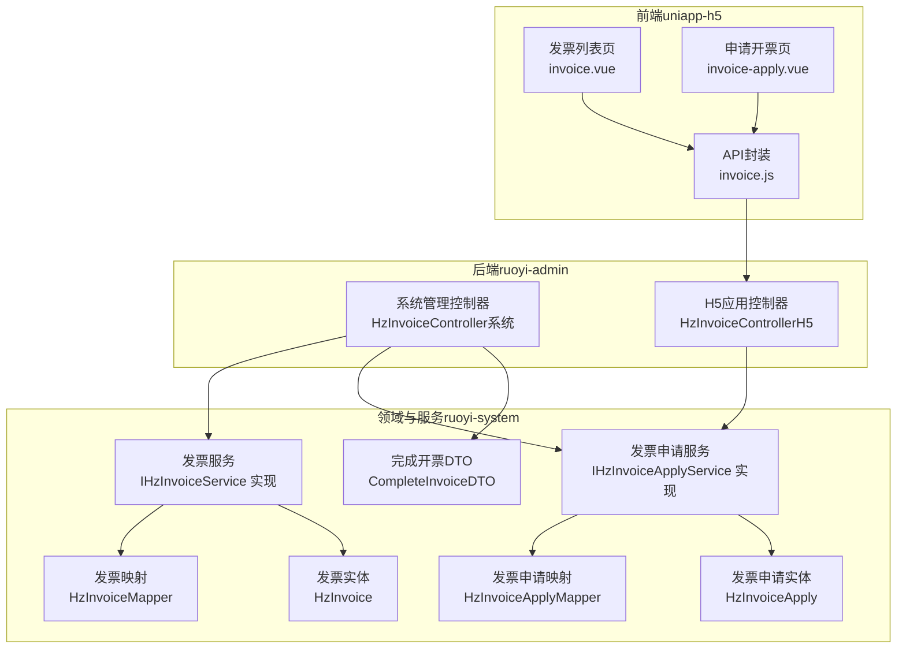
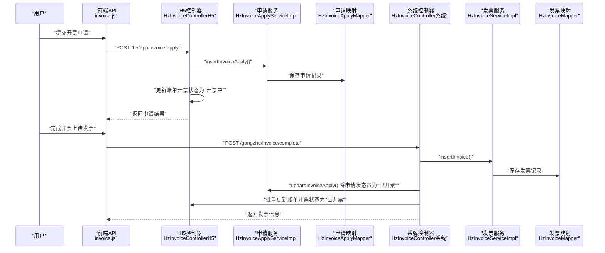
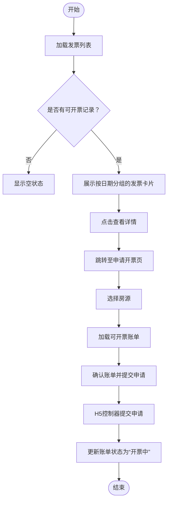
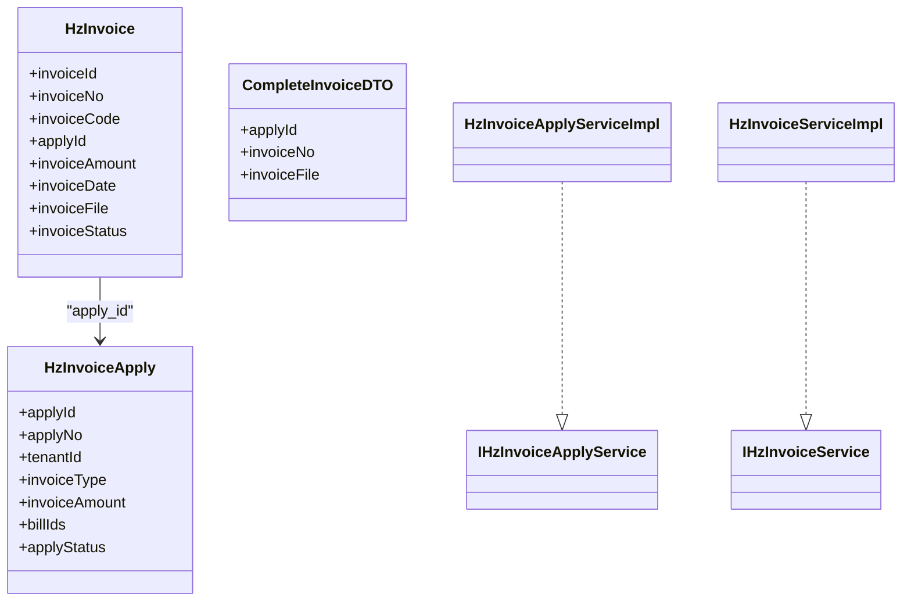

# 开票管理表

<cite>
**本文引用的文件**
- [06-开票管理.md](file://docs/数据字典/06-开票管理.md)
- [HzInvoice.java](file://ruoyi-system/src/main/java/com/ruoyi/system/domain/HzInvoice.java)
- [HzInvoiceApply.java](file://ruoyi-system/src/main/java/com/ruoyi/system/domain/HzInvoiceApply.java)
- [CompleteInvoiceDTO.java](file://ruoyi-system/src/main/java/com/ruoyi/system/domain/CompleteInvoiceDTO.java)
- [IHzInvoiceApplyService.java](file://ruoyi-system/src/main/java/com/ruoyi/system/service/IHzInvoiceApplyService.java)
- [IHzInvoiceService.java](file://ruoyi-system/src/main/java/com/ruoyi/system/service/IHzInvoiceService.java)
- [HzInvoiceApplyServiceImpl.java](file://ruoyi-system/src/main/java/com/ruoyi/system/service/impl/HzInvoiceApplyServiceImpl.java)
- [HzInvoiceServiceImpl.java](file://ruoyi-system/src/main/java/com/ruoyi/system/service/impl/HzInvoiceServiceImpl.java)
- [HzInvoiceController.java（系统管理）](file://ruoyi-admin/src/main/java/com/ruoyi/web/controller/system/HzInvoiceController.java)
- [HzInvoiceController.java（H5应用）](file://ruoyi-admin/src/main/java/com/ruoyi/web/controller/h5/HzInvoiceController.java)
- [invoice.js](file://uniapp-h5/api/invoice.js)
- [invoice.vue](file://uniapp-h5/subpkg/affairs/invoice.vue)
- [invoice-apply.vue](file://uniapp-h5/subpkg/affairs/invoice-apply.vue)
</cite>

## 目录
1. [简介](#简介)
2. [项目结构](#项目结构)
3. [核心组件](#核心组件)
4. [架构总览](#架构总览)
5. [详细组件分析](#详细组件分析)
6. [依赖关系分析](#依赖关系分析)
7. [性能考虑](#性能考虑)
8. [故障排查指南](#故障排查指南)
9. [结论](#结论)
10. [附录](#附录)

## 简介
本文件面向“开票管理模块”的数据库设计与业务实现，围绕以下目标展开：
- 详述发票表（hz_invoice）、发票申请表（hz_invoice_apply）及完整发票数据传输对象（CompleteInvoiceDTO）的设计与用途
- 解释发票申请流程、发票开具管理、发票状态跟踪与发票数据同步的业务逻辑
- 给出发票管理与税务系统的集成方案，涵盖发票数据格式、状态同步、异常处理等技术实现要点

## 项目结构
开票管理涉及三层：前端（uniapp-h5）、后端控制器（ruoyi-admin）、领域模型与服务（ruoyi-system）。数据字典位于 docs/数据字典。

图表来源
- [HzInvoiceController.java（系统管理）:37-235](file://ruoyi-admin/src/main/java/com/ruoyi/web/controller/system/HzInvoiceController.java#L37-L235)
- [HzInvoiceController.java（H5应用）:174-265](file://ruoyi-admin/src/main/java/com/ruoyi/web/controller/h5/HzInvoiceController.java#L174-L265)
- [IHzInvoiceApplyService.java:13-80](file://ruoyi-system/src/main/java/com/ruoyi/system/service/IHzInvoiceApplyService.java#L13-L80)
- [IHzInvoiceService.java:12-62](file://ruoyi-system/src/main/java/com/ruoyi/system/service/IHzInvoiceService.java#L12-L62)
- [HzInvoiceApplyServiceImpl.java:21-98](file://ruoyi-system/src/main/java/com/ruoyi/system/service/impl/HzInvoiceApplyServiceImpl.java#L21-L98)
- [HzInvoiceServiceImpl.java:19-74](file://ruoyi-system/src/main/java/com/ruoyi/system/service/impl/HzInvoiceServiceImpl.java#L19-L74)
- [HzInvoiceApply.java:16-374](file://ruoyi-system/src/main/java/com/ruoyi/system/domain/HzInvoiceApply.java#L16-L374)
- [HzInvoice.java:16-223](file://ruoyi-system/src/main/java/com/ruoyi/system/domain/HzInvoice.java#L16-L223)
- [CompleteInvoiceDTO.java:8-49](file://ruoyi-system/src/main/java/com/ruoyi/system/domain/CompleteInvoiceDTO.java#L8-L49)

章节来源
- [06-开票管理.md:1-89](file://docs/数据字典/06-开票管理.md#L1-L89)
- [HzInvoiceController.java（系统管理）:37-235](file://ruoyi-admin/src/main/java/com/ruoyi/web/controller/system/HzInvoiceController.java#L37-L235)
- [HzInvoiceController.java（H5应用）:174-265](file://ruoyi-admin/src/main/java/com/ruoyi/web/controller/h5/HzInvoiceController.java#L174-L265)

## 核心组件
- 发票申请表（hz_invoice_apply）
  - 关键字段：申请编号、租户ID/名称、发票类型、发票抬头、纳税人识别号、金额、账单ID列表、收件信息、申请状态、审批信息、时间戳与删除标志
  - 作用：承载用户开票申请的原始信息与流转状态
- 发票表（hz_invoice）
  - 关键字段：发票代码/号码、申请ID、租户ID、发票类型、抬头、税号、金额、开票日期、PDF文件路径、发票状态、作废信息、时间戳与删除标志
  - 作用：存储税务侧返回的正式发票信息
- 完整发票数据传输对象（CompleteInvoiceDTO）
  - 字段：申请ID、发票号码、发票文件路径
  - 作用：系统管理员在“完成开票”环节接收并写入正式发票记录

章节来源
- [06-开票管理.md:3-68](file://docs/数据字典/06-开票管理.md#L3-L68)
- [HzInvoiceApply.java:16-374](file://ruoyi-system/src/main/java/com/ruoyi/system/domain/HzInvoiceApply.java#L16-L374)
- [HzInvoice.java:16-223](file://ruoyi-system/src/main/java/com/ruoyi/system/domain/HzInvoice.java#L16-L223)
- [CompleteInvoiceDTO.java:8-49](file://ruoyi-system/src/main/java/com/ruoyi/system/domain/CompleteInvoiceDTO.java#L8-L49)

## 架构总览
下图展示从前端到后端再到数据库的完整调用链路与状态流转：

图表来源
- [HzInvoiceController.java（H5应用）:180-247](file://ruoyi-admin/src/main/java/com/ruoyi/web/controller/h5/HzInvoiceController.java#L180-L247)
- [HzInvoiceController.java（系统管理）:144-204](file://ruoyi-admin/src/main/java/com/ruoyi/web/controller/system/HzInvoiceController.java#L144-L204)
- [HzInvoiceApplyServiceImpl.java:69-96](file://ruoyi-system/src/main/java/com/ruoyi/system/service/impl/HzInvoiceApplyServiceImpl.java#L69-L96)
- [HzInvoiceServiceImpl.java:53-66](file://ruoyi-system/src/main/java/com/ruoyi/system/service/impl/HzInvoiceServiceImpl.java#L53-L66)

## 详细组件分析

### 发票申请表（hz_invoice_apply）设计与用途
- 设计要点
  - 申请编号自动生成，避免冲突
  - 申请状态包含“待审核/开票中/已开票/已驳回/已邮寄”，便于多角色协作与审计
  - 账单ID列表以逗号分隔，支持一次申请关联多个账单
  - 企业信息（地址、电话、开户行、账号）与个人/企业抬头分离
- 用途
  - 记录用户发起的开票请求，作为后续生成正式发票的基础
  - 与账单系统联动，防止重复开票

章节来源
- [06-开票管理.md:3-38](file://docs/数据字典/06-开票管理.md#L3-L38)
- [HzInvoiceApply.java:16-374](file://ruoyi-system/src/main/java/com/ruoyi/system/domain/HzInvoiceApply.java#L16-L374)
- [HzInvoiceApplyServiceImpl.java:69-96](file://ruoyi-system/src/main/java/com/ruoyi/system/service/impl/HzInvoiceApplyServiceImpl.java#L69-L96)

### 发票表（hz_invoice）设计与用途
- 设计要点
  - 存储税务侧返回的正式发票信息（代码/号码、PDF路径、开票日期）
  - 发票状态包含“正常/作废/红冲”，满足税务合规要求
  - 与申请表通过apply_id关联，形成“申请—发票”的闭环
- 用途
  - 作为对外可查验与归档的正式凭证
  - 与账单系统同步，确保账单状态一致性

章节来源
- [06-开票管理.md:41-68](file://docs/数据字典/06-开票管理.md#L41-L68)
- [HzInvoice.java:16-223](file://ruoyi-system/src/main/java/com/ruoyi/system/domain/HzInvoice.java#L16-L223)

### 完整发票数据传输对象（CompleteInvoiceDTO）设计与用途
- 设计要点
  - 仅包含完成开票所需的关键字段：申请ID、发票号码、发票文件路径
  - 通过系统管理端调用，避免泄露过多内部细节
- 用途
  - 在“完成开票”流程中，接收管理员输入的发票信息并写入正式发票记录

章节来源
- [CompleteInvoiceDTO.java:8-49](file://ruoyi-system/src/main/java/com/ruoyi/system/domain/CompleteInvoiceDTO.java#L8-L49)
- [HzInvoiceController.java（系统管理）:144-204](file://ruoyi-admin/src/main/java/com/ruoyi/web/controller/system/HzInvoiceController.java#L144-L204)

### 发票申请流程（前端到后端）
- 流程概览
  - 用户在“发票列表”页查看历史申请；在“申请开票”页选择房源与账单，提交申请
  - H5控制器校验账单是否已存在申请，若无则创建申请并更新账单状态为“开票中”
  - 管理员在系统后台完成开票，写入正式发票并同步申请与账单状态
- 关键点
  - 防重复：通过账单ID列表与租户ID联合校验
  - 状态同步：申请状态与账单状态保持一致

图表来源
- [invoice.vue:118-155](file://uniapp-h5/subpkg/affairs/invoice.vue#L118-L155)
- [invoice-apply.vue:166-242](file://uniapp-h5/subpkg/affairs/invoice-apply.vue#L166-L242)
- [HzInvoiceController.java（H5应用）:180-247](file://ruoyi-admin/src/main/java/com/ruoyi/web/controller/h5/HzInvoiceController.java#L180-L247)

章节来源
- [invoice.js:1-63](file://uniapp-h5/api/invoice.js#L1-L63)
- [invoice.vue:118-155](file://uniapp-h5/subpkg/affairs/invoice.vue#L118-L155)
- [invoice-apply.vue:166-242](file://uniapp-h5/subpkg/affairs/invoice-apply.vue#L166-L242)
- [HzInvoiceController.java（H5应用）:180-247](file://ruoyi-admin/src/main/java/com/ruoyi/web/controller/h5/HzInvoiceController.java#L180-L247)

### 发票开具管理与状态跟踪
- 状态定义
  - 申请状态：0=待审核、1=开票中、2=已开票、3=已邮寄
  - 发票状态：0=正常、1=作废、2=红冲
- 状态流转
  - 提交申请 → “开票中”（账单与申请均更新）
  - 管理员完成开票 → 写入正式发票 → 申请与账单均为“已开票”
- 同步策略
  - 申请状态变更时，同步更新对应账单的开票状态
  - 发票创建成功后，再次回写申请状态，保证最终一致性

章节来源
- [06-开票管理.md:3-38](file://docs/数据字典/06-开票管理.md#L3-L38)
- [HzInvoiceController.java（系统管理）:144-204](file://ruoyi-admin/src/main/java/com/ruoyi/web/controller/system/HzInvoiceController.java#L144-L204)
- [HzInvoiceApplyServiceImpl.java:69-96](file://ruoyi-system/src/main/java/com/ruoyi/system/service/impl/HzInvoiceApplyServiceImpl.java#L69-L96)
- [HzInvoiceServiceImpl.java:53-66](file://ruoyi-system/src/main/java/com/ruoyi/system/service/impl/HzInvoiceServiceImpl.java#L53-L66)

### 发票数据同步与税务系统集成
- 数据格式
  - 发票文件采用PDF路径存储，便于直接下载与归档
  - 发票号码与代码由税务系统生成，系统负责落库与展示
- 状态同步
  - 申请状态与账单状态双向同步，确保业务一致性
  - 管理员操作完成后，立即刷新前端状态
- 异常处理
  - 重复申请校验：若账单已存在申请则拒绝
  - 状态校验：仅允许处于“开票中”的申请进行完成操作
  - 错误日志：对账单状态更新失败进行捕获与记录

章节来源
- [HzInvoiceController.java（系统管理）:144-204](file://ruoyi-admin/src/main/java/com/ruoyi/web/controller/system/HzInvoiceController.java#L144-L204)
- [HzInvoiceController.java（H5应用）:191-247](file://ruoyi-admin/src/main/java/com/ruoyi/web/controller/h5/HzInvoiceController.java#L191-L247)

## 依赖关系分析
- 控制器依赖服务接口，服务实现依赖Mapper与实体
- 前端通过API封装调用控制器，控制器与服务层交互
- 申请与发票实体分别映射到两张表，通过外键（apply_id）建立关联

图表来源
- [HzInvoiceApply.java:16-374](file://ruoyi-system/src/main/java/com/ruoyi/system/domain/HzInvoiceApply.java#L16-L374)
- [HzInvoice.java:16-223](file://ruoyi-system/src/main/java/com/ruoyi/system/domain/HzInvoice.java#L16-L223)
- [CompleteInvoiceDTO.java:8-49](file://ruoyi-system/src/main/java/com/ruoyi/system/domain/CompleteInvoiceDTO.java#L8-L49)
- [IHzInvoiceApplyService.java:13-80](file://ruoyi-system/src/main/java/com/ruoyi/system/service/IHzInvoiceApplyService.java#L13-L80)
- [IHzInvoiceService.java:12-62](file://ruoyi-system/src/main/java/com/ruoyi/system/service/IHzInvoiceService.java#L12-L62)
- [HzInvoiceApplyServiceImpl.java:21-98](file://ruoyi-system/src/main/java/com/ruoyi/system/service/impl/HzInvoiceApplyServiceImpl.java#L21-L98)
- [HzInvoiceServiceImpl.java:19-74](file://ruoyi-system/src/main/java/com/ruoyi/system/service/impl/HzInvoiceServiceImpl.java#L19-L74)

## 性能考虑
- 分页查询：申请与发票列表均支持分页，减少一次性数据量
- 条件过滤：按租户ID、发票类型、申请状态等条件筛选，提升查询效率
- 状态索引：建议在申请状态与账单状态字段上建立索引，优化高频查询
- 并发控制：重复申请校验与状态更新需在事务内执行，避免竞态

## 故障排查指南
- 常见问题
  - 重复申请：提示“该账单已申请开票”，检查账单ID列表与租户ID匹配
  - 状态不符：仅“开票中”状态可完成开票，检查申请状态
  - 账单状态不同步：查看账单状态更新日志，确认是否抛出异常
- 定位方法
  - 查看控制器日志与返回码
  - 核对申请与发票实体字段映射
  - 检查Mapper SQL与事务边界

章节来源
- [HzInvoiceController.java（H5应用）:191-247](file://ruoyi-admin/src/main/java/com/ruoyi/web/controller/h5/HzInvoiceController.java#L191-L247)
- [HzInvoiceController.java（系统管理）:144-204](file://ruoyi-admin/src/main/java/com/ruoyi/web/controller/system/HzInvoiceController.java#L144-L204)

## 结论
本模块通过清晰的数据表设计与严格的业务流程控制，实现了从“申请—开具—同步—归档”的完整闭环。前端以用户友好方式引导开票流程，后端以服务与控制器保障状态一致性与数据完整性，具备良好的扩展性与合规性基础。

## 附录
- 数据字典参考
  - 发票申请表（hz_invoice_apply）
  - 发票表（hz_invoice）
  - 发票附件表（hz_invoice_attachment）

章节来源
- [06-开票管理.md:1-89](file://docs/数据字典/06-开票管理.md#L1-L89)