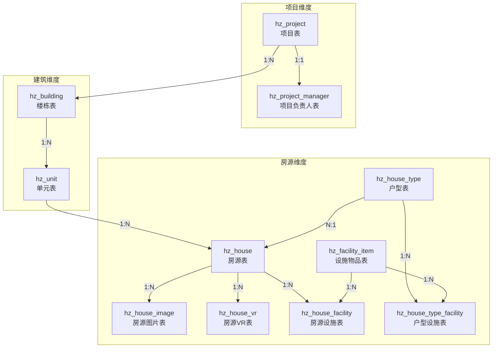
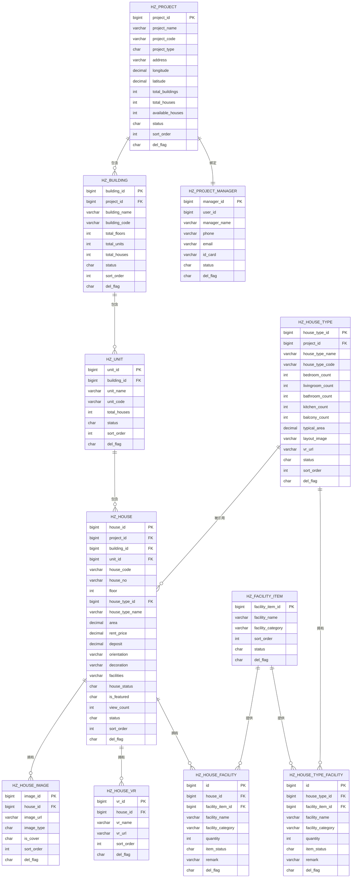
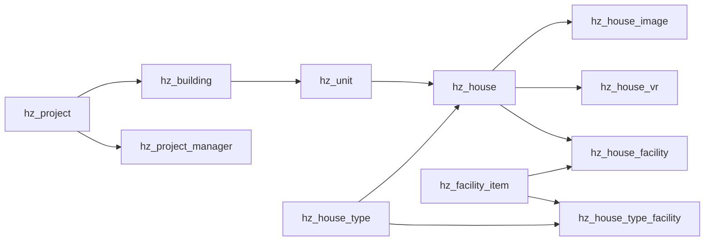

# 房源管理表

<cite>
**本文引用的文件**
- [01-房源管理.md](file://docs/数据字典/01-房源管理.md)
- [HzProject.java](file://ruoyi-system/src/main/java/com/ruoyi/system/domain/HzProject.java)
- [HzBuilding.java](file://ruoyi-system/src/main/java/com/ruoyi/system/domain/HzBuilding.java)
- [HzUnit.java](file://ruoyi-system/src/main/java/com/ruoyi/system/domain/HzUnit.java)
- [HzHouse.java](file://ruoyi-system/src/main/java/com/ruoyi/system/domain/HzHouse.java)
- [HzHouseImage.java](file://ruoyi-system/src/main/java/com/ruoyi/system/domain/HzHouseImage.java)
- [HzHouseVr.java](file://ruoyi-system/src/main/java/com/ruoyi/system/domain/HzHouseVr.java)
- [HzHouseType.java](file://ruoyi-system/src/main/java/com/ruoyi/system/domain/HzHouseType.java)
- [HzFacilityItem.java](file://ruoyi-system/src/main/java/com/ruoyi/system/domain/HzFacilityItem.java)
- [HzHouseFacility.java](file://ruoyi-system/src/main/java/com/ruoyi/system/domain/HzHouseFacility.java)
- [HzHouseTypeFacility.java](file://ruoyi-system/src/main/java/com/ruoyi/system/domain/HzHouseTypeFacility.java)
</cite>

## 目录
1. [简介](#简介)
2. [项目结构](#项目结构)
3. [核心组件](#核心组件)
4. [架构总览](#架构总览)
5. [详细组件分析](#详细组件分析)
6. [设施相关表结构更新](#设施相关表结构更新)
7. [依赖分析](#依赖分析)
8. [性能考虑](#性能考虑)
9. [故障排查指南](#故障排查指南)
10. [结论](#结论)
11. [附录](#附录)

## 简介
本文件面向"房源管理"模块，系统化梳理项目表(hz_project)、楼栋表(hz_building)、单元表(hz_unit)、房源表(hz_house)、房源图片表(hz_house_image)、房源VR表(hz_house_vr)、户型表(hz_house_type)、项目负责人表(hz_project_manager)以及设施相关表的设计与用途。内容涵盖表结构定义、字段说明、业务逻辑、表间关系、索引设计建议、数据类型选择、约束条件，并提供实际的SQL示例与业务场景说明，帮助开发者快速理解并正确使用该数据模型。

## 项目结构
围绕房源管理的核心数据表，采用"项目-楼栋-单元-房源"的层级组织方式；同时通过"户型"、"图片/VR"和"设施"对房源进行属性与展示增强。项目负责人信息在数据字典中独立列出，便于统一管理与查询。

**图表来源**
- [01-房源管理.md:3-203](file://docs/数据字典/01-房源管理.md#L3-L203)
- [HzProject.java:19-544](file://ruoyi-system/src/main/java/com/ruoyi/system/domain/HzProject.java#L19-L544)
- [HzBuilding.java:16-173](file://ruoyi-system/src/main/java/com/ruoyi/system/domain/HzBuilding.java#L16-L173)
- [HzUnit.java:16-171](file://ruoyi-system/src/main/java/com/ruoyi/system/domain/HzUnit.java#L16-L171)
- [HzHouse.java:20-441](file://ruoyi-system/src/main/java/com/ruoyi/system/domain/HzHouse.java#L20-L441)
- [HzHouseType.java:18-257](file://ruoyi-system/src/main/java/com/ruoyi/system/domain/HzHouseType.java#L18-L257)
- [HzHouseImage.java:17-137](file://ruoyi-system/src/main/java/com/ruoyi/system/domain/HzHouseImage.java#L17-L137)
- [HzHouseVr.java:17-123](file://ruoyi-system/src/main/java/com/ruoyi/system/domain/HzHouseVr.java#L17-L123)
- [HzFacilityItem.java:56-118](file://ruoyi-system/src/main/java/com/ruoyi/system/domain/HzFacilityItem.java#L56-L118)
- [HzHouseFacility.java:140-165](file://ruoyi-system/src/main/java/com/ruoyi/system/domain/HzHouseFacility.java#L140-L165)
- [HzHouseTypeFacility.java:140-165](file://ruoyi-system/src/main/java/com/ruoyi/system/domain/HzHouseTypeFacility.java#L140-L165)

**章节来源**
- [01-房源管理.md:3-203](file://docs/数据字典/01-房源管理.md#L3-L203)

## 核心组件
本节从"表结构+字段说明+业务逻辑+约束+索引建议+SQL示例"六个维度，逐表展开。

- 项目表 hz_project
  - 字段要点：项目ID、项目名称/编码、项目类型、地理坐标、统计量（总楼栋/总房源/可用房源）、负责人信息、状态/排序/删除标记、扩展字段（封面图、价格、设施、交通、物业公司/费用等）
  - 业务逻辑：作为房源的顶层归属，承载项目级配置与展示信息；支持按类型、状态、排序展示；统计字段可由子表聚合更新
  - 约束与索引：主键自增；建议对项目编码、状态、删除标记建立索引；地理坐标用于地图检索可考虑空间索引（视数据库能力）
  - SQL示例：查询可用房源数大于阈值的项目
    - 示例路径：[查询示例:3-33](file://docs/数据字典/01-房源管理.md#L3-L33)

- 楼栋表 hz_building
  - 字段要点：楼栋ID、所属项目、楼栋名称/编码、楼层/单元/房源统计、状态/排序/删除标记
  - 业务逻辑：承载单体建筑信息，用于筛选与聚合；与项目表形成一对多
  - 约束与索引：主键自增；建议对项目ID、状态、删除标记建立索引
  - SQL示例：按项目统计楼栋数量
    - 示例路径：[统计示例:36-57](file://docs/数据字典/01-房源管理.md#L36-L57)

- 单元表 hz_unit
  - 字段要点：单元ID、所属楼栋、单元名称/编码、房源统计、状态/排序/删除标记
  - 业务逻辑：承载单元级信息，用于精细化筛选；与楼栋表形成一对多
  - 约束与索引：主键自增；建议对楼栋ID、状态、删除标记建立索引
  - SQL示例：查询某楼栋下的所有单元
    - 示例路径：[查询示例:60-80](file://docs/数据字典/01-房源管理.md#L60-L80)

- 房源表 hz_house
  - 字段要点：房源ID、项目/楼栋/单元、房源编码/房间号/楼层、户型关联、面积/租金/押金、朝向/装修/设施、状态/精选/浏览计数、状态/排序/删除标记、分配类型/应届生标签、管家电话
  - 业务逻辑：房源的最小管理单元；状态枚举覆盖空置/预订/出租/维修/下架；支持按项目/楼栋/单元/状态/户型等多维筛选
  - 约束与索引：主键自增；建议对项目ID/楼栋ID/单元ID/状态/删除标记/房源编码建立复合或单列索引；面积/租金等数值字段需保证精度
  - SQL示例：查询某项目下空置且面积在区间内的房源
    - 示例路径：[查询示例:82-113](file://docs/数据字典/01-房源管理.md#L82-L113)

- 房源图片表 hz_house_image
  - 字段要点：图片ID、所属房源、图片URL、图片类型（实景/户型）、封面标记、排序、删除标记
  - 业务逻辑：为房源提供多角度展示；封面图优先用于列表/详情首图
  - 约束与索引：主键自增；建议对房源ID、类型、封面标记、排序建立索引
  - SQL示例：查询某房源的封面图
    - 示例路径：[查询示例:116-134](file://docs/数据字典/01-房源管理.md#L116-L134)

- 房源VR表 hz_house_vr
  - 字段要点：VRID、所属房源、VR名称/URL、排序、删除标记
  - 业务逻辑：为房源提供VR全景展示入口
  - 约束与索引：主键自增；建议对房源ID、排序建立索引
  - SQL示例：查询某房源的所有VR
    - 示例路径：[查询示例:137-154](file://docs/数据字典/01-房源管理.md#L137-L154)

- 户型表 hz_house_type
  - 字段要点：户型ID、所属项目、户型名称/编码、房间构成（卧室/客厅/卫生间/厨房/阳台）、典型面积、户型图URL、VR链接、状态/排序/删除标记
  - 业务逻辑：作为房源的规格模板；新增房源时可继承户型的VR链接等属性
  - 约束与索引：主键自增；建议对项目ID、状态、删除标记建立索引
  - SQL示例：查询某项目的全部户型
    - 示例路径：[查询示例:157-181](file://docs/数据字典/01-房源管理.md#L157-L181)

- 项目负责人表 hz_project_manager
  - 字段要点：负责人ID、关联用户ID、姓名/电话/邮箱/身份证、状态/删除标记
  - 业务逻辑：绑定项目与负责人，支持一键拨号等运营功能
  - 约束与索引：主键自增；建议对用户ID、状态、删除标记建立索引
  - SQL示例：查询某负责人的项目列表
    - 示例路径：[查询示例:184-203](file://docs/数据字典/01-房源管理.md#L184-L203)

**章节来源**
- [01-房源管理.md:3-203](file://docs/数据字典/01-房源管理.md#L3-L203)
- [HzProject.java:19-544](file://ruoyi-system/src/main/java/com/ruoyi/system/domain/HzProject.java#L19-L544)
- [HzBuilding.java:16-173](file://ruoyi-system/src/main/java/com/ruoyi/system/domain/HzBuilding.java#L16-L173)
- [HzUnit.java:16-171](file://ruoyi-system/src/main/java/com/ruoyi/system/domain/HzUnit.java#L16-L171)
- [HzHouse.java:20-441](file://ruoyi-system/src/main/java/com/ruoyi/system/domain/HzHouse.java#L20-L441)
- [HzHouseImage.java:17-137](file://ruoyi-system/src/main/java/com/ruoyi/system/domain/HzHouseImage.java#L17-L137)
- [HzHouseVr.java:17-123](file://ruoyi-system/src/main/java/com/ruoyi/system/domain/HzHouseVr.java#L17-L123)
- [HzHouseType.java:18-257](file://ruoyi-system/src/main/java/com/ruoyi/system/domain/HzHouseType.java#L18-L257)

## 架构总览
下图展示"项目-楼栋-单元-房源-户型/图片/VR/设施"的整体关系，以及项目负责人与项目的一对一绑定。

**图表来源**
- [01-房源管理.md:3-203](file://docs/数据字典/01-房源管理.md#L3-L203)
- [HzProject.java:19-544](file://ruoyi-system/src/main/java/com/ruoyi/system/domain/HzProject.java#L19-L544)
- [HzBuilding.java:16-173](file://ruoyi-system/src/main/java/com/ruoyi/system/domain/HzBuilding.java#L16-L173)
- [HzUnit.java:16-171](file://ruoyi-system/src/main/java/com/ruoyi/system/domain/HzUnit.java#L16-L171)
- [HzHouse.java:20-441](file://ruoyi-system/src/main/java/com/ruoyi/system/domain/HzHouse.java#L20-L441)
- [HzHouseType.java:18-257](file://ruoyi-system/src/main/java/com/ruoyi/system/domain/HzHouseType.java#L18-L257)
- [HzHouseImage.java:17-137](file://ruoyi-system/src/main/java/com/ruoyi/system/domain/HzHouseImage.java#L17-L137)
- [HzHouseVr.java:17-123](file://ruoyi-system/src/main/java/com/ruoyi/system/domain/HzHouseVr.java#L17-L123)
- [HzFacilityItem.java:56-118](file://ruoyi-system/src/main/java/com/ruoyi/system/domain/HzFacilityItem.java#L56-L118)
- [HzHouseFacility.java:140-165](file://ruoyi-system/src/main/java/com/ruoyi/system/domain/HzHouseFacility.java#L140-L165)
- [HzHouseTypeFacility.java:140-165](file://ruoyi-system/src/main/java/com/ruoyi/system/domain/HzHouseTypeFacility.java#L140-L165)

## 详细组件分析

### 项目表 hz_project
- 设计要点
  - 主键：自增ID
  - 地理位置：经纬度用于地图定位与周边检索
  - 统计字段：总楼栋/总房源/可用房源，可由子表聚合计算
  - 扩展字段：封面图、起租价、设施、交通、物业公司/费用、人才公寓服务/物业电话等
- 索引建议
  - 项目编码：唯一性保障与快速检索
  - 状态/删除标记：过滤常用字段
  - 经纬度：结合业务需求考虑空间索引
- 约束条件
  - 项目类型枚举（人才公寓/保租房/市场租赁）
  - 状态枚举（正常/停用），删除标记（正常/删除）
- SQL示例
  - 查询启用且可用房源数大于0的项目
    - 示例路径：[查询示例:3-33](file://docs/数据字典/01-房源管理.md#L3-L33)

**章节来源**
- [01-房源管理.md:3-33](file://docs/数据字典/01-房源管理.md#L3-L33)
- [HzProject.java:19-544](file://ruoyi-system/src/main/java/com/ruoyi/system/domain/HzProject.java#L19-L544)

### 楼栋表 hz_building
- 设计要点
  - 外键：指向项目表
  - 统计字段：总楼层、总单元、总房源
  - 展示字段：排序、状态、删除标记
- 索引建议
  - 项目ID：筛选常用
  - 楼栋编码：唯一性与快速检索
  - 状态/删除标记：过滤常用
- 约束条件
  - 状态枚举（正常/停用），删除标记（正常/删除）
- SQL示例
  - 查询某项目下所有启用楼栋
    - 示例路径：[查询示例:36-57](file://docs/数据字典/01-房源管理.md#L36-L57)

**章节来源**
- [01-房源管理.md:36-57](file://docs/数据字典/01-房源管理.md#L36-L57)
- [HzBuilding.java:16-173](file://ruoyi-system/src/main/java/com/ruoyi/system/domain/HzBuilding.java#L16-L173)

### 单元表 hz_unit
- 设计要点
  - 外键：指向楼栋表
  - 统计字段：总房源
  - 展示字段：排序、状态、删除标记
- 索引建议
  - 楼栋ID：筛选常用
  - 单元编码：唯一性与快速检索
  - 状态/删除标记：过滤常用
- 约束条件
  - 状态枚举（正常/停用），删除标记（正常/删除）
- SQL示例
  - 查询某楼栋下的所有单元
    - 示例路径：[查询示例:60-80](file://docs/数据字典/01-房源管理.md#L60-L80)

**章节来源**
- [01-房源管理.md:60-80](file://docs/数据字典/01-房源管理.md#L60-L80)
- [HzUnit.java:16-171](file://ruoyi-system/src/main/java/com/ruoyi/system/domain/HzUnit.java#L16-L171)

### 房源表 hz_house
- 设计要点
  - 外键：项目/楼栋/单元，以及户型
  - 核心字段：房源编码/房间号/楼层、面积/租金/押金、朝向/装修/设施
  - 状态：空置/已预订/已出租/维修中/下架
  - 展示字段：是否精选、浏览次数、分配类型、应届生标签、管家电话
- 索引建议
  - 房源编码：唯一性与快速检索
  - 项目/楼栋/单元/状态/删除标记：多维筛选
  - 户型ID：关联查询
- 约束条件
  - 房源状态枚举
  - 状态/删除标记
- SQL示例
  - 查询某项目下空置且面积在区间内的房源
    - 示例路径：[查询示例:82-113](file://docs/数据字典/01-房源管理.md#L82-L113)

**章节来源**
- [01-房源管理.md:82-113](file://docs/数据字典/01-房源管理.md#L82-L113)
- [HzHouse.java:20-441](file://ruoyi-system/src/main/java/com/ruoyi/system/domain/HzHouse.java#L20-L441)

### 房源图片表 hz_house_image
- 设计要点
  - 外键：指向房源
  - 类型：实景图/户型图
  - 封面：一张封面图用于列表/详情首图
  - 排序：控制展示顺序
- 索引建议
  - 房源ID：按房源查询
  - 类型/封面标记：快速定位封面或分类
  - 排序：保证展示顺序
- 约束条件
  - 删除标记
- SQL示例
  - 查询某房源的封面图
    - 示例路径：[查询示例:116-134](file://docs/数据字典/01-房源管理.md#L116-L134)

**章节来源**
- [01-房源管理.md:116-134](file://docs/数据字典/01-房源管理.md#L116-L134)
- [HzHouseImage.java:17-137](file://ruoyi-system/src/main/java/com/ruoyi/system/domain/HzHouseImage.java#L17-L137)

### 房源VR表 hz_house_vr
- 设计要点
  - 外键：指向房源
  - 名称/URL：VR全景入口
  - 排序：控制展示顺序
- 索引建议
  - 房源ID：按房源查询
  - 排序：保证展示顺序
- 约束条件
  - 删除标记
- SQL示例
  - 查询某房源的所有VR
    - 示例路径：[查询示例:137-154](file://docs/数据字典/01-房源管理.md#L137-L154)

**章节来源**
- [01-房源管理.md:137-154](file://docs/数据字典/01-房源管理.md#L137-L154)
- [HzHouseVr.java:17-123](file://ruoyi-system/src/main/java/com/ruoyi/system/domain/HzHouseVr.java#L17-L123)

### 户型表 hz_house_type
- 设计要点
  - 外键：指向项目
  - 户型构成：卧室/客厅/卫生间/厨房/阳台数量
  - 典型面积、户型图、VR链接
  - 状态/排序/删除标记
- 索引建议
  - 项目ID：按项目查询
  - 户型编码：唯一性与快速检索
  - 状态/删除标记：过滤常用
- 约束条件
  - 删除标记（逻辑删除）
- SQL示例
  - 查询某项目的全部户型
    - 示例路径：[查询示例:157-181](file://docs/数据字典/01-房源管理.md#L157-L181)

**章节来源**
- [01-房源管理.md:157-181](file://docs/数据字典/01-房源管理.md#L157-L181)
- [HzHouseType.java:18-257](file://ruoyi-system/src/main/java/com/ruoyi/system/domain/HzHouseType.java#L18-L257)

### 项目负责人表 hz_project_manager
- 设计要点
  - 外键：关联用户ID
  - 姓名/电话/邮箱/身份证
  - 状态/删除标记
- 索引建议
  - 用户ID：快速定位
  - 状态/删除标记：过滤常用
- 约束条件
  - 状态枚举（正常/停用），删除标记（正常/删除）
- SQL示例
  - 查询某负责人的项目列表
    - 示例路径：[查询示例:184-203](file://docs/数据字典/01-房源管理.md#L184-L203)

**章节来源**
- [01-房源管理.md:184-203](file://docs/数据字典/01-房源管理.md#L184-L203)
- [HzProject.java:19-544](file://ruoyi-system/src/main/java/com/ruoyi/system/domain/HzProject.java#L19-L544)

## 设施相关表结构更新

### 设施物品表 hz_facility_item
**更新** 新增设施类别标准化字段，完善设施分类管理

- 设计要点
  - 主键：自增ID
  - 设施名称：设施的标准名称
  - 设施类别：标准化的设施分类字段，支持统一管理
  - 排序字段：控制设施在列表中的显示顺序
  - 状态：启用/停用状态管理
  - 删除标记：逻辑删除支持
- 索引建议
  - 设施类别：按分类快速检索
  - 排序字段：保证显示顺序
  - 状态/删除标记：过滤常用
- 约束条件
  - 设施类别枚举（如：基础设施类、家电类、家具类、其他类）
  - 状态枚举（正常/停用），删除标记（正常/删除）
- 业务逻辑
  - 作为设施的标准字典表，为房源设施和户型设施提供统一的设施定义
  - 支持设施类别的标准化管理，确保数据一致性

**章节来源**
- [HzFacilityItem.java:56-118](file://ruoyi-system/src/main/java/com/ruoyi/system/domain/HzFacilityItem.java#L56-L118)

### 房源设施表 hz_house_facility
**更新** 新增设施类别字段，实现设施分类标准化

- 设计要点
  - 主键：自增ID
  - 房源ID：关联具体房源
  - 设施物品ID：关联设施物品表
  - 设施名称：设施标准名称
  - 设施类别：标准化的设施分类
  - 数量：设施数量
  - 设备状态：设施状态标识
  - 备注：设施相关信息
  - 删除标记：逻辑删除支持
- 索引建议
  - 房源ID：按房源查询设施
  - 设施类别：按分类查询
  - 设施物品ID：关联查询
- 约束条件
  - 设施类别标准化（与设施物品表保持一致）
  - 删除标记（正常/删除）
- 业务逻辑
  - 记录每个房源的具体设施配置
  - 支持三级回退机制：房源设施表 → 户型设施表 → 旧字段
  - 实现设施分类的标准化管理

**章节来源**
- [HzHouseFacility.java:140-165](file://ruoyi-system/src/main/java/com/ruoyi/system/domain/HzHouseFacility.java#L140-L165)

### 户型设施表 hz_house_type_facility
**更新** 新增设施类别字段，完善户型设施标准化

- 设计要点
  - 主键：自增ID
  - 户型ID：关联具体户型
  - 设施物品ID：关联设施物品表
  - 设施名称：设施标准名称
  - 设施类别：标准化的设施分类
  - 数量：设施数量
  - 设备状态：设施状态标识
  - 备注：设施相关信息
  - 删除标记：逻辑删除支持
- 索引建议
  - 户型ID：按户型查询设施
  - 设施类别：按分类查询
  - 设施物品ID：关联查询
- 约束条件
  - 设施类别标准化（与设施物品表保持一致）
  - 删除标记（正常/删除）
- 业务逻辑
  - 记录户型的标准设施配置
  - 作为房源设施的默认模板
  - 支持批量管理和继承机制

**章节来源**
- [HzHouseTypeFacility.java:140-165](file://ruoyi-system/src/main/java/com/ruoyi/system/domain/HzHouseTypeFacility.java#L140-L165)

### 设施管理控制器
**更新** 新增设施物品管理功能

- 设施物品控制器
  - 提供设施物品的增删改查功能
  - 支持设施类别的统一管理
  - 实现设施标准字典的维护

- 房源设施控制器
  - 实现三级回退机制的设施查询
  - 支持批量保存房源设施
  - 提供设施分类的标准化处理

**章节来源**
- [HzFacilityItemController.java:14-27](file://ruoyi-system/src/main/java/com/ruoyi/system/controller/HzFacilityItemController.java#L14-L27)
- [HzHouseFacilityController.java:18-82](file://ruoyi-system/src/main/java/com/ruoyi/system/controller/HzHouseFacilityController.java#L18-L82)

## 依赖分析
- 外键依赖
  - hz_building ← hz_project（1:N）
  - hz_unit ← hz_building（1:N）
  - hz_house ← hz_project/hz_building/hz_unit/hz_house_type（1:1 N:1 N:1 N:1）
  - hz_house_image ← hz_house（1:N）
  - hz_house_vr ← hz_house（1:N）
  - hz_house_facility ← hz_house（1:N）
  - hz_house_type_facility ← hz_house_type（1:N）
  - hz_facility_item ← hz_house_facility/hz_house_type_facility（1:N）
  - hz_project_manager ← hz_project（1:1）
- 耦合与内聚
  - 房源表聚合了项目/楼栋/单元/户型等信息，便于前端一次性渲染；但写入时需保持一致性
  - 图片/VR与房源为弱耦合，便于独立维护与扩展
  - 设施表通过设施物品表实现标准化管理，支持多级回退机制
- 循环依赖
  - 无循环依赖
- 外部依赖
  - 无外部依赖

**图表来源**
- [01-房源管理.md:3-203](file://docs/数据字典/01-房源管理.md#L3-L203)
- [HzFacilityItem.java:56-118](file://ruoyi-system/src/main/java/com/ruoyi/system/domain/HzFacilityItem.java#L56-L118)
- [HzHouseFacility.java:140-165](file://ruoyi-system/src/main/java/com/ruoyi/system/domain/HzHouseFacility.java#L140-L165)
- [HzHouseTypeFacility.java:140-165](file://ruoyi-system/src/main/java/com/ruoyi/system/domain/HzHouseTypeFacility.java#L140-L165)

**章节来源**
- [01-房源管理.md:3-203](file://docs/数据字典/01-房源管理.md#L3-L203)

## 性能考虑
- 索引策略
  - 房源表：对项目ID/楼栋ID/单元ID/状态/删除标记建立组合索引，以支撑高频筛选
  - 房源编码：唯一索引，避免重复
  - 图片/VR表：对房源ID建立索引，按房源批量查询
  - 项目/楼栋/单元：对状态/删除标记建立索引，提升过滤效率
  - 设施表：对设施类别、设施物品ID建立索引，支撑分类查询和关联查询
- 数值精度
  - 面积/租金/押金使用高精度小数类型，确保财务计算准确
  - 设施数量使用整数类型，确保准确性
- 统计字段更新
  - 项目/楼栋/单元的统计字段建议通过定时任务或事件驱动更新，避免频繁全表扫描
  - 设施统计可通过缓存机制减少查询压力
- 查询优化
  - 使用分页与必要字段投影，避免SELECT *
  - 对地理检索场景，结合经纬度与距离计算，必要时引入空间索引
  - 设施查询支持三级回退机制，减少复杂查询

## 故障排查指南
- 常见问题
  - 房源状态异常：核对状态枚举与业务流转（空置/预订/出租/维修/下架）
  - 房源图片未显示：确认封面标记仅有一张，排序字段正确
  - 户型VR未继承：检查户型表的VR链接字段是否填写
  - 项目负责人信息缺失：确认项目负责人表与项目表的绑定关系
  - 设施类别不一致：检查设施物品表的标准化字段是否正确设置
  - 设施回退机制失效：确认三级回退逻辑的执行顺序
- 排查步骤
  - 核对主外键关系与删除标记
  - 检查索引是否存在及是否生效
  - 校验数值字段精度与默认值
  - 验证设施类别标准化的一致性
  - 使用最小复现样例验证业务逻辑

**章节来源**
- [01-房源管理.md:3-203](file://docs/数据字典/01-房源管理.md#L3-L203)

## 结论
本数据模型以"项目-楼栋-单元-房源"为主线，配合"户型/图片/VR/设施"等维度，构建了完整的房源管理体系。通过合理的索引与约束设计，既能满足多维筛选与高效展示，又能保证数据一致性与可维护性。

**更新要点**
- 新增设施类别标准化机制，通过设施物品表统一管理设施分类
- 实现三级回退机制，确保设施信息的兼容性和完整性
- 完善设施管理的控制器功能，支持标准化的设施配置管理

建议在实际落地时，结合业务场景持续优化索引与统计字段更新策略，特别关注设施类别的标准化管理和回退机制的性能优化。

## 附录
- 实际SQL示例（路径参考）
  - 查询可用房源数大于阈值的项目
    - 示例路径：[查询示例:3-33](file://docs/数据字典/01-房源管理.md#L3-L33)
  - 按项目统计楼栋数量
    - 示例路径：[统计示例:36-57](file://docs/数据字典/01-房源管理.md#L36-L57)
  - 查询某楼栋下的所有单元
    - 示例路径：[查询示例:60-80](file://docs/数据字典/01-房源管理.md#L60-L80)
  - 查询某项目下空置且面积在区间内的房源
    - 示例路径：[查询示例:82-113](file://docs/数据字典/01-房源管理.md#L82-L113)
  - 查询某房源的封面图
    - 示例路径：[查询示例:116-134](file://docs/数据字典/01-房源管理.md#L116-L134)
  - 查询某房源的所有VR
    - 示例路径：[查询示例:137-154](file://docs/数据字典/01-房源管理.md#L137-L154)
  - 查询某项目的全部户型
    - 示例路径：[查询示例:157-181](file://docs/数据字典/01-房源管理.md#L157-L181)
  - 查询某负责人的项目列表
    - 示例路径：[查询示例:184-203](file://docs/数据字典/01-房源管理.md#L184-L203)