# 批量分配表

<cite>
**本文引用的文件**
- [docs/数据字典/10-批量分配.md](file://docs/数据字典/10-批量分配.md)
- [ruoyi-system/src/main/java/com/ruoyi/system/domain/HzBatchAllocation.java](file://ruoyi-system/src/main/java/com/ruoyi/system/domain/HzBatchAllocation.java)
- [ruoyi-system/src/main/java/com/ruoyi/system/domain/HzBatchHouse.java](file://ruoyi-system/src/main/java/com/ruoyi/system/domain/HzBatchHouse.java)
- [ruoyi-system/src/main/java/com/ruoyi/system/domain/HzBatchTenant.java](file://ruoyi-system/src/main/java/com/ruoyi/system/domain/HzBatchTenant.java)
- [ruoyi-system/src/main/java/com/ruoyi/system/domain/vo/BatchPreferenceVo.java](file://ruoyi-system/src/main/java/com/ruoyi/system/domain/vo/BatchPreferenceVo.java)
- [ruoyi-system/src/main/java/com/ruoyi/system/mapper/HzBatchAllocationMapper.java](file://ruoyi-system/src/main/java/com/ruoyi/system/mapper/HzBatchAllocationMapper.java)
- [ruoyi-system/src/main/java/com/ruoyi/system/mapper/HzBatchHouseMapper.java](file://ruoyi-system/src/main/java/com/ruoyi/system/mapper/HzBatchHouseMapper.java)
- [ruoyi-system/src/main/java/com/ruoyi/system/mapper/HzBatchTenantMapper.java](file://ruoyi-system/src/main/java/com/ruoyi/system/mapper/HzBatchTenantMapper.java)
- [ruoyi-system/src/main/java/com/ruoyi/system/service/IHzBatchAllocationService.java](file://ruoyi-system/src/main/java/com/ruoyi/system/service/IHzBatchAllocationService.java)
- [ruoyi-system/src/main/java/com/ruoyi/system/service/impl/HzBatchAllocationServiceImpl.java](file://ruoyi-system/src/main/java/com/ruoyi/system/service/impl/HzBatchAllocationServiceImpl.java)
- [ruoyi-system/src/main/java/com/ruoyi/system/service/impl/HzEnterpriseBatchServiceImpl.java](file://ruoyi-system/src/main/java/com/ruoyi/system/service/impl/HzEnterpriseBatchServiceImpl.java)
- [ruoyi-admin/src/main/java/com/ruoyi/web/controller/system/HzBatchAllocationController.java](file://ruoyi-admin/src/main/java/com/ruoyi/web/controller/system/HzBatchAllocationController.java)
- [ruoyi-system/src/main/resources/mapper/system/HzBatchAllocationMapper.xml](file://ruoyi-system/src/main/resources/mapper/system/HzBatchAllocationMapper.xml)
- [ruoyi-system/src/main/resources/mapper/system/HzBatchHouseMapper.xml](file://ruoyi-system/src/main/resources/mapper/system/HzBatchHouseMapper.xml)
- [ruoyi-system/src/main/java/com/ruoyi/system/domain/HzHouse.java](file://ruoyi-system/src/main/java/com/ruoyi/system/domain/HzHouse.java)
- [ruoyi-ui/src/views/gangzhu/house/batch/index.vue](file://ruoyi-ui/src/views/gangzhu/house/batch/index.vue)
- [ruoyi-ui/src/views/gangzhu/house/index.vue](file://ruoyi-ui/src/views/gangzhu/house/index.vue)
- [ruoyi-ui/src/api/gangzhu/batch.js](file://ruoyi-ui/src/api/gangzhu/batch.js)
- [uniapp-h5/pages/room/detail.vue](file://uniapp-h5/pages/room/detail.vue)
</cite>

## 更新摘要
**变更内容**
- **数据库查询排序优化**：将 `selectBatchAllocationList` 和 `selectBatchAllocationPage` 查询的 `ORDER BY` 从单一 `create_time` 字段扩展为 `create_time` 和 `batch_id` 的复合排序，提升结果排序的确定性和一致性
- 新增自动状态更新机制：当批次达到'已审批'状态时，系统会自动将相关房源状态更新为'已预订'
- 批量分配验证功能增强：后端用户分配验证逻辑完善，防止重复分配
- 前端审批界面增强：审批对话框展示更多批次信息，包括合同日期、免租政策、房源数量等
- 移动端房源详情增强：移动端房间详情页面增加批量分配状态控制，支持 `isBatchAssigned` 字段显示
- 批次偏好VO改进：新增入驻日期管理功能，支持批次级入驻开始日期和结束日期查询
- 冲突预防机制：完善 `checkHouseOccupation` 方法，提供更友好的错误提示
- 状态释放机制优化：`releaseHouseStatusByBatch` 方法优化，确保状态回退为修缮中状态
- 房源选择逻辑更新：批量分配服务的房源选择从空置状态(0)调整为修缮中状态(3)

## 目录
1. [简介](#简介)
2. [项目结构](#项目结构)
3. [核心组件](#核心组件)
4. [架构总览](#架构总览)
5. [详细组件分析](#详细组件分析)
6. [数据库查询排序优化](#数据库查询排序优化)
7. [自动状态更新机制](#自动状态更新机制)
8. [批量分配验证功能](#批量分配验证功能)
9. [前端审批界面增强](#前端审批界面增强)
10. [移动端房源详情增强](#移动端房源详情增强)
11. [批次偏好VO改进](#批次偏好vo改进)
12. [冲突预防机制](#冲突预防机制)
13. [状态释放机制](#状态释放机制)
14. [房源选择逻辑更新](#房源选择逻辑更新)
15. [依赖分析](#依赖分析)
16. [性能考虑](#性能考虑)
17. [故障排查指南](#故障排查指南)
18. [结论](#结论)
19. [附录](#附录)

## 简介
本文件聚焦"批量分配"模块的数据表与业务实现，覆盖以下核心内容：
- 数据表设计：集中配租批次表 `hz_batch_allocation`、批次房源表 `hz_batch_house`、批次租户表 `hz_batch_tenant` 的字段定义、业务含义与约束。
- 业务流程：企业批量配租流程、分配规则管理、房源批量锁定、租户批量导入等。
- 数据模型：分配计划、执行状态、结果记录等关键功能的实现要点与数据流转。
- **数据库查询排序优化**：通过 `create_time` 和 `batch_id` 的复合排序提升查询结果的确定性和一致性。
- 自动状态更新机制：当批次达到'已审批'状态时，系统自动将相关房源状态更新为'已预订'，提升批量分配流程的自动化程度和数据一致性。
- 批量分配验证功能：后端用户分配验证逻辑、前端审批界面增强展示更多信息、移动端房源详情增加批量分配状态控制。
- 批次偏好VO改进：新增入驻日期管理功能，支持批次级入驻开始日期和结束日期查询。
- 冲突预防机制：完善 `checkHouseOccupation` 方法，提供更友好的错误提示。
- 状态释放机制优化：`releaseHouseStatusByBatch` 方法优化，确保状态回退为修缮中状态。
- 房源选择逻辑更新：批量分配服务的房源选择从空置状态(0)调整为修缮中状态(3)。

## 项目结构
批量分配模块在后端采用典型的分层架构：
- 控制器层：对外提供REST接口，负责请求接收与响应封装。
- 服务层：实现业务逻辑，包括批次管理、房源与租户匹配、导入导出、状态变更等。
- 持久层：MyBatis Mapper与XML映射，完成SQL查询与分页。
- 数据模型：实体类与VO类，承载表结构与跨表聚合信息。
- 前端Vue组件与API封装，提供完整的用户界面与交互体验。

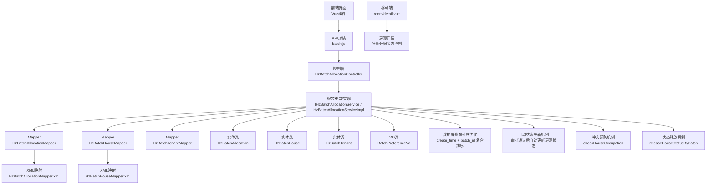

**图表来源**
- [ruoyi-admin/src/main/java/com/ruoyi/web/controller/system/HzBatchAllocationController.java:1-180](file://ruoyi-admin/src/main/java/com/ruoyi/web/controller/system/HzBatchAllocationController.java#L1-L180)
- [ruoyi-system/src/main/java/com/ruoyi/system/service/IHzBatchAllocationService.java:1-139](file://ruoyi-system/src/main/java/com/ruoyi/system/service/IHzBatchAllocationService.java#L1-L139)
- [ruoyi-system/src/main/java/com/ruoyi/system/service/impl/HzBatchAllocationServiceImpl.java:1-759](file://ruoyi-system/src/main/java/com/ruoyi/system/service/impl/HzBatchAllocationServiceImpl.java#L1-L759)
- [ruoyi-ui/src/views/gangzhu/house/batch/index.vue:466-516](file://ruoyi-ui/src/views/gangzhu/house/batch/index.vue#L466-L516)
- [ruoyi-ui/src/api/gangzhu/batch.js:1-129](file://ruoyi-ui/src/api/gangzhu/batch.js#L1-L129)
- [uniapp-h5/pages/room/detail.vue:136-139](file://uniapp-h5/pages/room/detail.vue#L136-L139)

**章节来源**
- [ruoyi-admin/src/main/java/com/ruoyi/web/controller/system/HzBatchAllocationController.java:1-180](file://ruoyi-admin/src/main/java/com/ruoyi/web/controller/system/HzBatchAllocationController.java#L1-L180)
- [ruoyi-system/src/main/java/com/ruoyi/system/service/impl/HzBatchAllocationServiceImpl.java:1-759](file://ruoyi-system/src/main/java/com/ruoyi/system/service/impl/HzBatchAllocationServiceImpl.java#L1-L759)

## 核心组件
- 集中配租批次表 `hz_batch_allocation`：记录一次企业批量配租的计划、审批、状态与优惠配置。
- 批次房源表 `hz_batch_house`：记录批次内每个房源的分配状态、关联租户与分配时间。
- 批次租户表 `hz_batch_tenant`：记录参与批量分配的租户信息及其分配状态与分配时间。
- 批次偏好VO `BatchPreferenceVo`：用于根据房源ID查询批次级优惠配置和入驻日期，包含批次ID、优惠类型、免租期数、入驻开始日期、入驻结束日期。
- **数据库查询排序优化**：通过 `create_time` 和 `batch_id` 的复合排序提升查询结果的确定性和一致性。
- 自动状态更新机制：当批次达到'已审批'状态时，系统自动将相关房源状态更新为'已预订'，提升批量分配流程的自动化程度和数据一致性。
- 冲突预防机制 `checkHouseOccupation`：防止同一房源被多个未作废/未驳回的批次同时占用。
- 状态释放机制 `releaseHouseStatusByBatch`：自动释放被锁定的房源状态，避免数据不一致。
- 房源选择逻辑更新：批量分配服务的房源选择从空置状态(0)调整为修缮中状态(3)。

**章节来源**
- [docs/数据字典/10-批量分配.md:1-77](file://docs/数据字典/10-批量分配.md#L1-L77)
- [ruoyi-system/src/main/java/com/ruoyi/system/domain/HzBatchAllocation.java:1-333](file://ruoyi-system/src/main/java/com/ruoyi/system/domain/HzBatchAllocation.java#L1-L333)
- [ruoyi-system/src/main/java/com/ruoyi/system/domain/HzBatchHouse.java:1-122](file://ruoyi-system/src/main/java/com/ruoyi/system/domain/HzBatchHouse.java#L1-L122)
- [ruoyi-system/src/main/java/com/ruoyi/system/domain/HzBatchTenant.java:1-158](file://ruoyi-system/src/main/java/com/ruoyi/system/domain/HzBatchTenant.java#L1-L158)
- [ruoyi-system/src/main/java/com/ruoyi/system/domain/vo/BatchPreferenceVo.java:1-76](file://ruoyi-system/src/main/java/com/ruoyi/system/domain/vo/BatchPreferenceVo.java#L1-L76)

## 架构总览
批量分配模块的控制流如下：
- 控制器接收请求，调用服务层方法。
- 服务层协调多个Mapper，完成批次、房源、租户的增删改查与状态变更。
- XML映射提供复杂查询（如多项目聚合、分页、条件过滤），**现已优化为 `create_time` 和 `batch_id` 的复合排序**。
- 实体类与VO承载数据结构，确保前后端交互清晰。
- 前端Vue组件提供用户界面，包括表单验证、数据展示、操作交互等。
- 移动端页面支持移动设备上的房源详情查看和状态控制。
- 自动状态更新机制在批次审批通过时自动更新相关房源状态为'已预订'。
- 冲突预防机制在保存批次时自动检查房源占用情况，防止重复分配。
- 状态释放机制在删除、审批驳回、作废等操作前自动释放房源状态。
- 房源选择逻辑更新，从空置状态(0)调整为修缮中状态(3)，确保批量分配的房源来源状态正确。

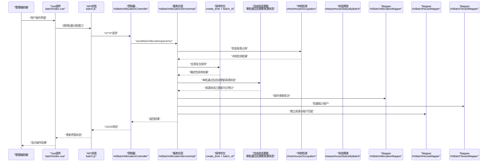

**图表来源**
- [ruoyi-ui/src/views/gangzhu/house/batch/index.vue:894-903](file://ruoyi-ui/src/views/gangzhu/house/batch/index.vue#L894-L903)
- [ruoyi-ui/src/api/gangzhu/batch.js:105-112](file://ruoyi-ui/src/api/gangzhu/batch.js#L105-L112)
- [ruoyi-admin/src/main/java/com/ruoyi/web/controller/system/HzBatchAllocationController.java:157-160](file://ruoyi-admin/src/main/java/com/ruoyi/web/controller/system/HzBatchAllocationController.java#L157-L160)
- [ruoyi-system/src/main/java/com/ruoyi/system/service/impl/HzBatchAllocationServiceImpl.java:383-390](file://ruoyi-system/src/main/java/com/ruoyi/system/service/impl/HzBatchAllocationServiceImpl.java#L383-L390)

## 详细组件分析

### 数据表设计与用途

- `hz_batch_allocation`（集中配租批次表）
  - 记录批次基本信息、企业联系信息、项目范围、人才类型、入驻日期、房源数量与已分配数量、审批状态与批次状态、优惠配置等。
  - 字段要点：批次编号、批次名称、企业ID/名称、联系人/电话、项目ID/IDs、人才类型、入驻起止日期、房源数、已分配数、审批状态、批次状态、优惠类型与免租期数、逻辑删除标志等。
  - 用途：作为一次批量配租的"计划书"，贯穿审批、执行、完成全过程。

- `hz_batch_house`（批次房源表）
  - 记录批次内每个房源的分配状态、关联租户ID、分配时间等。
  - 字段要点：批次ID、房源ID/编码、分配状态、租户ID、分配时间、逻辑删除标志等。
  - 用途：跟踪房源在批次内的分配情况，支持按批次查询与统计。

- `hz_batch_tenant`（批次租户表）
  - 记录参与批量分配的租户信息及分配状态、分配时间等。
  - 字段要点：批次ID、姓名、身份证号、手机号、工号、部门、分配房源ID、分配状态、分配时间、逻辑删除标志等。
  - 用途：支撑租户导入、匹配与查询，便于核对与导出。

**章节来源**
- [docs/数据字典/10-批量分配.md:1-77](file://docs/数据字典/10-批量分配.md#L1-L77)
- [ruoyi-system/src/main/java/com/ruoyi/system/domain/HzBatchAllocation.java:1-333](file://ruoyi-system/src/main/java/com/ruoyi/system/domain/HzBatchAllocation.java#L1-L333)
- [ruoyi-system/src/main/java/com/ruoyi/system/domain/HzBatchHouse.java:1-122](file://ruoyi-system/src/main/java/com/ruoyi/system/domain/HzBatchHouse.java#L1-L122)
- [ruoyi-system/src/main/java/com/ruoyi/system/domain/HzBatchTenant.java:1-158](file://ruoyi-system/src/main/java/com/ruoyi/system/domain/HzBatchTenant.java#L1-L158)

### 业务流程与规则

- 企业批量配租流程
  - 计划阶段：创建批次，填写企业信息、项目范围、人才类型、入驻日期、优惠配置等。
  - 审批阶段：提交审批，审批通过后批次进入"进行中"，系统自动将房源状态更新为"已预订"。
  - 执行阶段：导入租户，系统按顺序与房源建立一对一匹配；更新批次已分配数量与房源/租户分配状态。
  - 完成阶段：批次状态更新为"已完成"，可导出结果与凭证。

- 分配规则管理
  - 一对一匹配：导入的租户与房源按顺序一一对应，数量必须一致。
  - 优惠策略：批次级统一配置优惠类型与免租期数，可通过房源查询接口获取。
  - 项目范围：批次绑定项目IDs，查询可用房源时仅返回指定项目下空置且正常的房源。
  - 入驻日期管理：批次配租支持设置入驻开始日期和结束日期，用于合同创建和续租时的日期控制。
  - 房源来源状态：批量分配服务的房源选择从空置状态(0)调整为修缮中状态(3)，确保批量分配的房源来源于修缮中状态的房源。

- 房源批量锁定
  - 审批通过后，系统自动将批次内所有房源状态由"空置"变为"已预订"，避免重复分配。

- 租户批量导入
  - 提供标准模板下载，支持Excel导入校验（姓名、身份证、手机号必填，格式校验），导入后返回校验结果供确认。

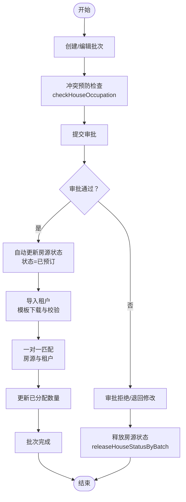

**图表来源**
- [ruoyi-system/src/main/java/com/ruoyi/system/service/impl/HzBatchAllocationServiceImpl.java:383-390](file://ruoyi-system/src/main/java/com/ruoyi/system/service/impl/HzBatchAllocationServiceImpl.java#L383-L390)
- [ruoyi-system/src/main/java/com/ruoyi/system/service/impl/HzBatchAllocationServiceImpl.java:159-196](file://ruoyi-system/src/main/java/com/ruoyi/system/service/impl/HzBatchAllocationServiceImpl.java#L159-L196)
- [ruoyi-system/src/main/java/com/ruoyi/system/service/impl/HzBatchAllocationServiceImpl.java:302-348](file://ruoyi-system/src/main/java/com/ruoyi/system/service/impl/HzBatchAllocationServiceImpl.java#L302-L348)
- [ruoyi-system/src/main/java/com/ruoyi/system/service/impl/HzBatchAllocationServiceImpl.java:350-490](file://ruoyi-system/src/main/java/com/ruoyi/system/service/impl/HzBatchAllocationServiceImpl.java#L350-L490)

**章节来源**
- [ruoyi-system/src/main/java/com/ruoyi/system/service/impl/HzBatchAllocationServiceImpl.java:78-113](file://ruoyi-system/src/main/java/com/ruoyi/system/service/impl/HzBatchAllocationServiceImpl.java#L78-L113)
- [ruoyi-system/src/main/java/com/ruoyi/system/service/impl/HzBatchAllocationServiceImpl.java:159-196](file://ruoyi-system/src/main/java/com/ruoyi/system/service/impl/HzBatchAllocationServiceImpl.java#L159-L196)
- [ruoyi-system/src/main/java/com/ruoyi/system/service/impl/HzBatchAllocationServiceImpl.java:302-348](file://ruoyi-system/src/main/java/com/ruoyi/system/service/impl/HzBatchAllocationServiceImpl.java#L302-L348)
- [ruoyi-system/src/main/java/com/ruoyi/system/service/impl/HzBatchAllocationServiceImpl.java:350-490](file://ruoyi-system/src/main/java/com/ruoyi/system/service/impl/HzBatchAllocationServiceImpl.java#L350-L490)

### 接口与数据模型

- 控制器接口
  - 列表查询、导出、详情、新增、修改、删除、审批、作废、模板下载、可用房源查询、租户导入、保存分配、查询房源/租户明细等。
  - 权限注解保证操作安全，分页查询通过Page工具与Mapper分页接口配合。

- 服务层能力
  - 批次生命周期管理：创建、修改、删除（逻辑删除）、审批、作废。
  - 批次分配：保存批次分配（含房源与租户匹配）、查询批次房源/租户明细。
  - 数据导入：模板下载、Excel导入与校验。
  - 数据查询：按项目ID查询可用房源、按条件分页查询批次列表。
  - **数据库查询排序优化**：通过 `create_time` 和 `batch_id` 的复合排序提升查询结果的确定性和一致性。
  - 自动状态更新：当批次达到'已审批'状态时，系统自动将相关房源状态更新为'已预订'。
  - 冲突预防：在保存批次时自动检查房源占用情况，防止重复分配。
  - 状态释放：在删除、审批驳回、作废等操作前自动释放房源状态。
  - 房源来源状态管理：批量分配服务的房源选择从空置状态(0)调整为修缮中状态(3)。

- 实体与映射
  - 实体类映射数据库字段，包含基础审计字段与业务字段。
  - XML映射提供复杂查询：多项目聚合、分页、模糊/精确条件过滤、GROUP BY与排序。
  - **BatchPreferenceVo通过HzBatchHouseMapper.xml的 `selectBatchPreferenceByHouseId` 查询包含入驻日期的批次信息**。

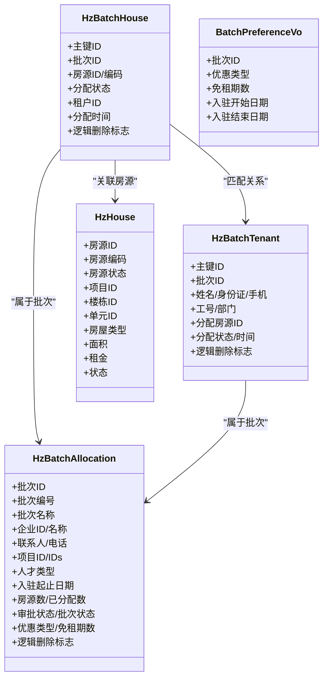

**图表来源**
- [ruoyi-system/src/main/java/com/ruoyi/system/domain/HzBatchAllocation.java:1-333](file://ruoyi-system/src/main/java/com/ruoyi/system/domain/HzBatchAllocation.java#L1-L333)
- [ruoyi-system/src/main/java/com/ruoyi/system/domain/HzBatchHouse.java:1-122](file://ruoyi-system/src/main/java/com/ruoyi/system/domain/HzBatchHouse.java#L1-L122)
- [ruoyi-system/src/main/java/com/ruoyi/system/domain/HzBatchTenant.java:1-158](file://ruoyi-system/src/main/java/com/ruoyi/system/domain/HzBatchTenant.java#L1-L158)
- [ruoyi-system/src/main/java/com/ruoyi/system/domain/vo/BatchPreferenceVo.java:1-76](file://ruoyi-system/src/main/java/com/ruoyi/system/domain/vo/BatchPreferenceVo.java#L1-L76)
- [ruoyi-system/src/main/java/com/ruoyi/system/domain/HzHouse.java:114-146](file://ruoyi-system/src/main/java/com/ruoyi/system/domain/HzHouse.java#L114-L146)

**章节来源**
- [ruoyi-admin/src/main/java/com/ruoyi/web/controller/system/HzBatchAllocationController.java:1-180](file://ruoyi-admin/src/main/java/com/ruoyi/web/controller/system/HzBatchAllocationController.java#L1-L180)
- [ruoyi-system/src/main/java/com/ruoyi/system/service/IHzBatchAllocationService.java:1-139](file://ruoyi-system/src/main/java/com/ruoyi/system/service/IHzBatchAllocationService.java#L1-L139)
- [ruoyi-system/src/main/resources/mapper/system/HzBatchAllocationMapper.xml:1-107](file://ruoyi-system/src/main/resources/mapper/system/HzBatchAllocationMapper.xml#L1-L107)
- [ruoyi-system/src/main/resources/mapper/system/HzBatchHouseMapper.xml:1-25](file://ruoyi-system/src/main/resources/mapper/system/HzBatchHouseMapper.xml#L1-L25)

### 数据库查询排序优化

**更新** 数据库查询排序优化：将 `selectBatchAllocationList` 和 `selectBatchAllocationPage` 查询的 `ORDER BY` 从单一 `create_time` 字段扩展为 `create_time` 和 `batch_id` 的复合排序，提升结果排序的确定性和一致性

#### 功能特性
- **复合排序提升确定性**：通过 `create_time DESC, batch_id DESC` 的复合排序，确保相同创建时间的批次也能按批次ID稳定排序
- **一致性保证**：避免因时间精度问题导致的排序不稳定，提升用户体验
- **性能优化**：复合索引可以更好地利用数据库索引，提升查询性能
- **向后兼容**：保持原有查询语义不变，仅优化排序逻辑

#### 核心实现
1. **查询优化**：在 `HzBatchAllocationMapper.xml` 中，将 `ORDER BY` 从 `b.create_time DESC` 更新为 `b.create_time DESC, b.batch_id DESC`
2. **列表查询**：`selectBatchAllocationList` 方法使用复合排序确保批次列表的稳定显示
3. **分页查询**：`selectBatchAllocationPage` 方法同样应用复合排序，保证分页结果的一致性
4. **查询条件**：保持原有的过滤条件不变，仅优化排序逻辑

#### 排序逻辑说明
- **主要排序**：按创建时间降序排列，最新的批次显示在前面
- **次要排序**：当多个批次创建时间相同时，按批次ID降序排列，确保相同时间创建的批次有稳定的显示顺序
- **排序稳定性**：通过 `batch_id` 作为第二排序键，完全消除了时间精度导致的排序不确定性

#### 影响范围
- **批次列表显示**：管理端批次列表的显示顺序更加稳定和可预测
- **分页结果一致性**：分页查询的结果在多次刷新时保持一致
- **导出数据排序**：导出的批次数据也遵循相同的排序规则
- **用户体验提升**：用户可以更准确地定位到特定批次，避免因排序不稳定造成的困扰

**章节来源**
- [ruoyi-system/src/main/resources/mapper/system/HzBatchAllocationMapper.xml:66-68](file://ruoyi-system/src/main/resources/mapper/system/HzBatchAllocationMapper.xml#L66-L68)
- [ruoyi-system/src/main/resources/mapper/system/HzBatchAllocationMapper.xml:84-86](file://ruoyi-system/src/main/resources/mapper/system/HzBatchAllocationMapper.xml#L84-L86)

### 自动状态更新机制

**更新** 新增自动状态更新机制，当批次达到'已审批'状态时，系统会自动将相关房源状态更新为'已预订'

#### 功能特性
- **自动触发**：当批次审批状态变为'已审批'（approve_status='1'）时，系统自动执行状态更新
- **批量更新**：对批次关联的所有房源执行状态更新操作
- **状态一致性**：确保房源状态与批次审批状态保持一致
- **事务安全**：在保存批次分配时的事务中执行状态更新，保证数据一致性

#### 核心逻辑
1. **审批通过处理**：在 `approveBatchAllocation` 方法中，当 `approveStatus='1'` 时，系统自动将批次内所有房源状态更新为'已预订'(house_status='1')
2. **保存后更新**：在 `saveBatchAllocation` 方法中，如果批次已审批通过，编辑保存后自动将新房源状态改为'已预订'
3. **状态回退**：当批次被驳回或作废时，通过 `releaseHouseStatusByBatch` 方法将状态回退为'修缮中'

#### 调用时机
- **审批通过时**：`approveBatchAllocation` 方法中自动更新房源状态
- **保存分配时**：`saveBatchAllocation` 方法中检查批次状态并更新新房源状态
- **状态回退时**：`deleteBatchAllocationById`、`cancelBatchAllocation`、`approveBatchAllocation`（驳回）时释放房源状态

**章节来源**
- [ruoyi-system/src/main/java/com/ruoyi/system/service/impl/HzBatchAllocationServiceImpl.java:173-188](file://ruoyi-system/src/main/java/com/ruoyi/system/service/impl/HzBatchAllocationServiceImpl.java#L173-L188)
- [ruoyi-system/src/main/java/com/ruoyi/system/service/impl/HzBatchAllocationServiceImpl.java:513-525](file://ruoyi-system/src/main/java/com/ruoyi/system/service/impl/HzBatchAllocationServiceImpl.java#L513-L525)

### 批次偏好VO改进

批次偏好VO的增强功能，支持入驻日期管理：

- **字段增强**
  - 新增 `entryStartDate`（入驻开始日期）：字符串格式，用于标识租户可以入住的最早日期
  - 新增 `entryEndDate`（入驻结束日期）：字符串格式，用于标识租户可以入住的最晚日期
  - 与原有的批次ID、优惠类型、免租期数字段保持一致

- **数据库查询增强**
  - 通过 `selectBatchPreferenceByHouseId` SQL查询，使用 `DATE_FORMAT` 函数将日期格式化为 `YYYY-MM-DD`
  - 查询条件包含：房源ID匹配、批次未删除、批次已审批通过
  - 返回包含入驻日期的批次偏好信息

- **业务应用场景**
  - 合同创建时优先使用批次配租的入驻日期
  - 续租时根据批次日期确定新的合同生效时间
  - 为租户提供准确的入住时间窗口

**章节来源**
- [ruoyi-system/src/main/java/com/ruoyi/system/domain/vo/BatchPreferenceVo.java:1-76](file://ruoyi-system/src/main/java/com/ruoyi/system/domain/vo/BatchPreferenceVo.java#L1-L76)
- [ruoyi-system/src/main/resources/mapper/system/HzBatchHouseMapper.xml:1-25](file://ruoyi-system/src/main/resources/mapper/system/HzBatchHouseMapper.xml#L1-L25)

### 房源选择逻辑更新

批量分配服务的房源选择逻辑已从空置状态(0)调整为修缮中状态(3)：

- **更新背景**
  - 批量分配服务的房源选择逻辑已从传统的空置状态(0)调整为修缮中状态(3)
  - 这一变更体现了批量分配的房源来源状态管理，确保批量分配的房源来源于修缮中状态的房源

- **具体实现**
  - 在 `getAvailableHousesByProjects` 方法中，查询条件已从 `.eq(HzHouse::getHouseStatus, "0")`（空置）更新为 `.eq(HzHouse::getHouseStatus, "3")`（修缮中）
  - 保持原有的 `.eq(HzHouse::getStatus, "0")`（正常）条件不变，确保只选择状态正常的房源
  - 通过 `orderByAsc(HzHouse::getProjectId, HzHouse::getHouseCode)` 进行排序

- **业务影响**
  - 批量分配只能选择处于修缮中状态的房源，这确保了批量分配的房源来源状态正确
  - 修缮中状态的房源通常意味着这些房源已经完成了必要的修缮工作，适合进行批量分配
  - 这一变更有助于提高批量分配的效率和准确性

- **状态管理**
  - 批量分配过程中，房源状态会从修缮中(3)变为已预订(1)
  - 批次取消或审批驳回时，房源状态会从已预订(1)回退为修缮中(3)
  - 已出租(2)状态的房源不会被批量分配服务影响

**章节来源**
- [ruoyi-system/src/main/java/com/ruoyi/system/service/impl/HzBatchAllocationServiceImpl.java:267-272](file://ruoyi-system/src/main/java/com/ruoyi/system/service/impl/HzBatchAllocationServiceImpl.java#L267-L272)
- [ruoyi-system/src/main/java/com/ruoyi/system/domain/HzHouse.java:114-117](file://ruoyi-system/src/main/java/com/ruoyi/system/domain/HzHouse.java#L114-L117)

### 批量分配验证功能

批量分配验证功能，包括后端用户分配验证逻辑、前端审批界面增强展示更多信息、移动端房源详情增加批量分配状态控制。

#### 后端用户分配验证逻辑

- **checkHouseOccupation 方法**
  - **功能特性**：防止同一房源被多个未作废/未驳回的批次同时占用
  - **实时冲突检测**：在保存批次时自动检查即将分配的房源是否已被其他活动批次占用
  - **智能排除机制**：排除当前批次自身，避免自检冲突
  - **友好错误提示**：提供包含房源编码和批次名称的详细错误信息
  - **有效性验证**：仅检查未删除、未作废、未驳回的有效批次

- **核心逻辑**
  1. 查询占用目标房源的关联记录（排除自身批次、排除已逻辑删除）
  2. 取出涉及的批次ID，进一步过滤出"有效"批次（未删除、未作废、未驳回）
  3. 取第一条冲突明细，组织友好的报错信息

- **调用时机**
  - 保存批次分配时自动调用
  - 企业批量分配服务中同样实现冲突检测

**章节来源**
- [ruoyi-system/src/main/java/com/ruoyi/system/service/impl/HzBatchAllocationServiceImpl.java:664-718](file://ruoyi-system/src/main/java/com/ruoyi/system/service/impl/HzBatchAllocationServiceImpl.java#L664-L718)
- [ruoyi-system/src/main/java/com/ruoyi/system/service/impl/HzEnterpriseBatchServiceImpl.java:216-249](file://ruoyi-system/src/main/java/com/ruoyi/system/service/impl/HzEnterpriseBatchServiceImpl.java#L216-L249)

#### 前端审批界面增强

审批对话框增强，展示更多批次相关信息：

- **合同日期展示**
  - 显示入驻开始日期和结束日期，格式化为 `YYYY-MM-DD`
  - 未设置时显示"未设置"提示

- **免租政策展示**
  - 无优惠：显示"无优惠（不免租）"标签
  - 免租政策：显示"免租 X 期"标签

- **房源数量展示**
  - 显示批次中房源总数，格式为 "X套"

- **分配房间展示**
  - 展示批次关联的房源分配信息表格
  - 包括房间位置、匹配人员、租金等信息

- **申请时间展示**
  - 显示批次申请时间

- **审批结果与意见**
  - 提供通过/拒绝选项
  - 支持输入审批意见

**章节来源**
- [ruoyi-ui/src/views/gangzhu/house/batch/index.vue:466-516](file://ruoyi-ui/src/views/gangzhu/house/batch/index.vue#L466-L516)
- [ruoyi-ui/src/views/gangzhu/house/batch/index.vue:915-931](file://ruoyi-ui/src/views/gangzhu/house/batch/index.vue#L915-L931)

#### 移动端房源详情增强

移动端房间详情页面增加批量分配状态控制：

- **批量分配状态字段**
  - `isBatchAssigned`：是否为批次配租分配给当前用户的房源
  - 默认值为 `false`，表示非批次分配房源

- **状态控制逻辑**
  - 当 `isBatchAssigned` 为 `false` 且房源状态为 "已预订"(1) 或 "已出租"(2) 时，禁止用户选择
  - 当房源状态为 "空闲"(0) 时，显示"房源选定"按钮
  - 当房源状态为 "已预订"(1) 且为当前用户分配时，显示"已被选定"

- **用户交互**
  - 支持用户查看房源详情和状态
  - 根据批量分配状态控制用户操作权限
  - 提供预约看房和选房功能

**章节来源**
- [uniapp-h5/pages/room/detail.vue:136-139](file://uniapp-h5/pages/room/detail.vue#L136-L139)
- [uniapp-h5/pages/room/detail.vue:321-325](file://uniapp-h5/pages/room/detail.vue#L321-L325)

### 冲突预防机制

#### checkHouseOccupation 方法
用于防止同一房源被多个未作废/未驳回的批次同时占用。

##### 功能特性
- **实时冲突检测**：在保存批次时自动检查即将分配的房源是否已被其他活动批次占用
- **智能排除机制**：排除当前批次自身，避免自检冲突
- **友好错误提示**：提供包含房源编码和批次名称的详细错误信息
- **有效性验证**：仅检查未删除、未作废、未驳回的有效批次

##### 核心逻辑
1. 查询占用目标房源的关联记录（排除自身批次、排除已逻辑删除）
2. 取出涉及的批次ID，进一步过滤出"有效"批次（未删除、未作废、未驳回）
3. 取第一条冲突明细，组织友好的报错信息

##### 调用时机
- 保存批次分配时自动调用
- 企业批量分配服务中同样实现冲突检测

**章节来源**
- [ruoyi-system/src/main/java/com/ruoyi/system/service/impl/HzBatchAllocationServiceImpl.java:663-718](file://ruoyi-system/src/main/java/com/ruoyi/system/service/impl/HzBatchAllocationServiceImpl.java#L663-L718)
- [ruoyi-system/src/main/java/com/ruoyi/system/service/impl/HzEnterpriseBatchServiceImpl.java:216-249](file://ruoyi-system/src/main/java/com/ruoyi/system/service/impl/HzEnterpriseBatchServiceImpl.java#L216-L249)

### 状态释放机制

#### releaseHouseStatusByBatch 方法
用于自动释放被锁定的房源状态，确保数据一致性。

##### 功能特性
- **批量状态释放**：将批次关联的房源状态从"已预订"（1）回滚为"空置"（0）。
- **智能状态管理**：已签合同（house_status='2' 已出租）的房源不动，避免误释放正在履约的合同
- **状态回退机制**：将已预订状态回退为修缮中（3），体现批量分配的房源来源状态
- **智能过滤**：仅处理未删除的关联房源记录
- **事务安全保障**：在删除、审批驳回、作废等操作前自动执行

##### 核心逻辑
1. 查询批次下所有未删除的关联房源
2. 对每个房源检查当前状态
3. 仅释放"已预订"状态，保持其他状态不变
4. 更新房源状态为"修缮中"

##### 调用时机
- 删除批次前自动调用
- 审批驳回时自动调用
- 作废批次时自动调用

**章节来源**
- [ruoyi-system/src/main/java/com/ruoyi/system/service/impl/HzBatchAllocationServiceImpl.java:726-752](file://ruoyi-system/src/main/java/com/ruoyi/system/service/impl/HzBatchAllocationServiceImpl.java#L726-L752)
- [ruoyi-system/src/main/java/com/ruoyi/system/service/impl/HzBatchAllocationServiceImpl.java:119](file://ruoyi-system/src/main/java/com/ruoyi/system/service/impl/HzBatchAllocationServiceImpl.java#L119)
- [ruoyi-system/src/main/java/com/ruoyi/system/service/impl/HzBatchAllocationServiceImpl.java:192](file://ruoyi-system/src/main/java/com/ruoyi/system/service/impl/HzBatchAllocationServiceImpl.java#L192)
- [ruoyi-system/src/main/java/com/ruoyi/system/service/impl/HzBatchAllocationServiceImpl.java:202](file://ruoyi-system/src/main/java/com/ruoyi/system/service/impl/HzBatchAllocationServiceImpl.java#L202)

### 依赖分析
- 组件耦合
  - 控制器依赖服务接口，服务实现依赖多个Mapper与实体类。
  - Mapper之间通过批次ID、房源ID、租户ID形成弱耦合关联，降低直接耦合度。
  - 前端Vue组件依赖API封装，API封装依赖后端控制器。
  - 移动端页面依赖后端房源详情接口，支持批量分配状态字段。
  - **数据库查询排序优化**依赖HzBatchAllocationMapper.xml中的复合排序逻辑。
  - 自动状态更新机制依赖批次审批状态和房源状态字段。
  - 冲突预防机制依赖批次分配记录和批次状态信息。
  - 状态释放机制依赖房源状态字段和批次关联关系。
  - BatchPreferenceVo依赖HzBatchHouseMapper.xml的数据库查询。
  - 房源选择逻辑依赖HzHouse表的house_status字段。
- 外部依赖
  - MyBatis用于ORM与SQL映射，Apache POI用于Excel导入导出。
  - Vue.js用于前端界面开发，Element UI用于组件库。
  - UniApp用于移动端页面开发。
- 潜在风险
  - 批次删除涉及逻辑删除，需确保关联记录同步更新，避免脏数据。
  - 批量导入需严格校验格式，异常需明确提示行号与原因。
  - **数据库查询排序优化**需要确保复合索引的有效性，避免性能回退。
  - 自动状态更新机制需要处理复杂的批次状态组合，需确保逻辑正确性。
  - 冲突预防机制需要处理复杂的批次状态组合，需确保逻辑正确性。
  - 状态释放机制需要避免误释放正在履约的合同状态。
  - 批次偏好VO的日期格式转换需要确保数据库查询的一致性。
  - 房源选择逻辑更新需要确保所有相关查询都使用新的状态条件。
  - 前端Vue组件需要处理用户交互和数据验证。
  - 移动端页面需要适配不同屏幕尺寸和交互方式。

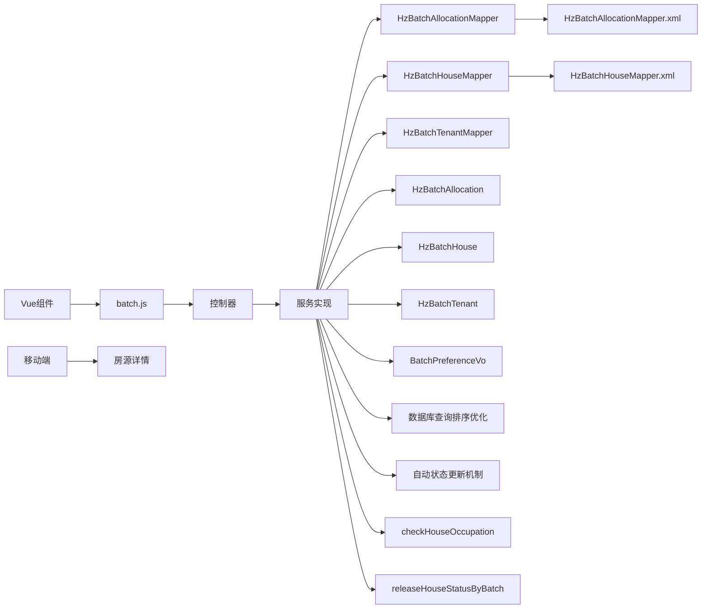

**图表来源**
- [ruoyi-admin/src/main/java/com/ruoyi/web/controller/system/HzBatchAllocationController.java:1-180](file://ruoyi-admin/src/main/java/com/ruoyi/web/controller/system/HzBatchAllocationController.java#L1-L180)
- [ruoyi-system/src/main/java/com/ruoyi/system/service/impl/HzBatchAllocationServiceImpl.java:1-759](file://ruoyi-system/src/main/java/com/ruoyi/system/service/impl/HzBatchAllocationServiceImpl.java#L1-L759)
- [ruoyi-ui/src/views/gangzhu/house/batch/index.vue:520-521](file://ruoyi-ui/src/views/gangzhu/house/batch/index.vue#L520-L521)
- [ruoyi-ui/src/api/gangzhu/batch.js:1-129](file://ruoyi-ui/src/api/gangzhu/batch.js#L1-L129)
- [uniapp-h5/pages/room/detail.vue:125-129](file://uniapp-h5/pages/room/detail.vue#L125-L129)

**章节来源**
- [ruoyi-system/src/main/java/com/ruoyi/system/service/impl/HzBatchAllocationServiceImpl.java:1-759](file://ruoyi-system/src/main/java/com/ruoyi/system/service/impl/HzBatchAllocationServiceImpl.java#L1-L759)

## 性能考虑
- 分页查询：使用MyBatis Plus Page与Mapper分页接口，避免一次性加载大量数据。
- 条件过滤：XML映射中使用LIKE、FIND_IN_SET等条件，建议在项目IDs、批次名称等字段上建立索引以提升查询效率。
- **数据库查询排序优化**：复合排序索引可以更好地利用数据库索引，提升查询性能，但需要注意索引维护成本。
- 批量操作：导入租户与批量插入租户记录时，注意事务边界与异常回滚，避免部分写入。
- 导出与模板：Excel导出与模板生成使用POI，建议限制单次导出条目上限，避免内存压力。
- 自动状态更新机制优化：使用批量更新而非逐个更新，减少数据库交互次数。
- 冲突预防机制优化：使用集合去重和早期返回，减少不必要的数据库查询。
- 状态释放机制优化：批量查询批次关联房源，避免逐个查询的性能开销。
- 批次偏好查询优化：通过HzBatchHouseMapper.xml的索引查询，使用LIMIT 1限制结果集大小。
- 房源选择逻辑优化：批量分配服务的房源选择逻辑已更新为修缮中状态(3)，减少了查询范围，提高了查询效率。
- 前端组件优化：Vue组件使用虚拟DOM和响应式数据，减少不必要的重新渲染。
- 移动端适配：UniApp框架优化移动端性能，支持触摸事件和手势操作。

## 故障排查指南
- 批次删除失败
  - 现象：删除批次后关联记录未同步更新。
  - 排查：确认服务实现中的逻辑删除是否对 hz_batch_house 与 hz_batch_tenant 同步更新。
  - 检查 `releaseHouseStatusByBatch` 方法是否正确执行，确保房源状态已释放。
  - 参考路径：[ruoyi-system/src/main/java/com/ruoyi/system/service/impl/HzBatchAllocationServiceImpl.java:119-146](file://ruoyi-system/src/main/java/com/ruoyi/system/service/impl/HzBatchAllocationServiceImpl.java#L119-L146)

- 审批通过后房源未锁定
  - 现象：审批通过但房源仍显示空置。
  - 排查：确认审批分支中对 hz_house 的状态更新逻辑是否执行。
  - 检查自动状态更新机制是否阻止了正常的房源锁定操作。
  - 参考路径：[ruoyi-system/src/main/java/com/ruoyi/system/service/impl/HzBatchAllocationServiceImpl.java:169-183](file://ruoyi-system/src/main/java/com/ruoyi/system/service/impl/HzBatchAllocationServiceImpl.java#L169-L183)

- 自动状态更新失败
  - 现象：批次审批通过后房源状态未更新为"已预订"。
  - 排查：确认 `saveBatchAllocation` 方法中的自动状态更新逻辑是否执行。
  - 检查批次审批状态是否正确设置为"已审批"。
  - 解决：验证自动状态更新机制的触发条件和执行逻辑。
  - 参考路径：[ruoyi-system/src/main/java/com/ruoyi/system/service/impl/HzBatchAllocationServiceImpl.java:513-525](file://ruoyi-system/src/main/java/com/ruoyi/system/service/impl/HzBatchAllocationServiceImpl.java#L513-L525)

- 导入租户报错
  - 现象：导入失败并提示某行格式错误。
  - 排查：检查身份证号与手机号正则校验，确认Excel列顺序与必填项。
  - 参考路径：[ruoyi-system/src/main/java/com/ruoyi/system/service/impl/HzBatchAllocationServiceImpl.java:324-348](file://ruoyi-system/src/main/java/com/ruoyi/system/service/impl/HzBatchAllocationServiceImpl.java#L324-L348)

- 查询不到可用房源
  - 现象：按项目查询可用房源为空。
  - 排查：确认项目IDs传参格式、房源状态与状态字段值，以及XML映射中的过滤条件。
  - 检查房源选择逻辑是否正确使用修缮中状态(3)而非空置状态(0)。
  - 参考路径：[ruoyi-system/src/main/java/com/ruoyi/system/service/impl/HzBatchAllocationServiceImpl.java:257-309](file://ruoyi-system/src/main/java/com/ruoyi/system/service/impl/HzBatchAllocationServiceImpl.java#L257-L309), [ruoyi-system/src/main/resources/mapper/system/HzBatchAllocationMapper.xml:38-68](file://ruoyi-system/src/main/resources/mapper/system/HzBatchAllocationMapper.xml#L38-L68)

- 重复分配错误
  - 现象：保存批次时报错"房源已被占用，无法重复分配"。
  - 排查：确认目标房源是否已被其他未作废/未驳回的批次占用。
  - 解决：调整批次时间安排或选择其他房源。
  - 参考路径：[ruoyi-system/src/main/java/com/ruoyi/system/service/impl/HzBatchAllocationServiceImpl.java:695-717](file://ruoyi-system/src/main/java/com/ruoyi/system/service/impl/HzBatchAllocationServiceImpl.java#L695-L717)

- 状态释放异常
  - 现象：删除批次后房源状态仍然为"已预订"。
  - 排查：确认 `releaseHouseStatusByBatch` 方法是否被正确调用，检查房源状态字段值。
  - 解决：手动检查房源状态，必要时进行数据修复。
  - 参考路径：[ruoyi-system/src/main/java/com/ruoyi/system/service/impl/HzBatchAllocationServiceImpl.java:726-752](file://ruoyi-system/src/main/java/com/ruoyi/system/service/impl/HzBatchAllocationServiceImpl.java#L726-L752)

- **数据库查询排序异常**
  - 现象：批次列表显示顺序不稳定或排序结果不一致。
  - 排查：确认HzBatchAllocationMapper.xml中的复合排序逻辑是否正确应用。
  - 检查数据库索引是否正确创建，确保 `create_time` 和 `batch_id` 的复合索引有效。
  - 解决：验证复合排序的SQL语法，确保排序字段的正确性。
  - 参考路径：[ruoyi-system/src/main/resources/mapper/system/HzBatchAllocationMapper.xml:66-68](file://ruoyi-system/src/main/resources/mapper/system/HzBatchAllocationMapper.xml#L66-L68), [ruoyi-system/src/main/resources/mapper/system/HzBatchAllocationMapper.xml:84-86](file://ruoyi-system/src/main/resources/mapper/system/HzBatchAllocationMapper.xml#L84-L86)

- 批次偏好查询失败
  - 现象：通过房源ID查询批次偏好信息返回null。
  - 排查：确认房源是否属于已审批通过的批次，检查HzBatchHouseMapper.xml的查询条件。
  - 解决：确保批次已审批通过且房源未被逻辑删除。
  - 参考路径：[ruoyi-system/src/main/resources/mapper/system/HzBatchHouseMapper.xml:7-22](file://ruoyi-system/src/main/resources/mapper/system/HzBatchHouseMapper.xml#L7-L22)

- 入驻日期格式错误
  - 现象：批次偏好VO中的入驻日期格式不符合预期。
  - 排查：确认数据库中日期字段的存储格式，检查HzBatchHouseMapper.xml中DATE_FORMAT函数的格式化。
  - 解决：确保日期格式为'YYYY-MM-DD'，与BatchPreferenceVo中的String类型兼容。
  - 参考路径：[ruoyi-system/src/main/resources/mapper/system/HzBatchHouseMapper.xml:13-14](file://ruoyi-system/src/main/resources/mapper/system/HzBatchHouseMapper.xml#L13-L14)

- 房源选择逻辑错误
  - 现象：批量分配无法选择任何房源。
  - 排查：确认HzHouse表中是否存在状态为修缮中(3)且状态为正常的房源。
  - 解决：检查房源状态是否正确设置为修缮中(3)，并确保状态字段值为"0"。
  - 参考路径：[ruoyi-system/src/main/java/com/ruoyi/system/service/impl/HzBatchAllocationServiceImpl.java:267-272](file://ruoyi-system/src/main/java/com/ruoyi/system/service/impl/HzBatchAllocationServiceImpl.java#L267-L272)

- 前端审批界面显示异常
  - 现象：审批对话框无法正确显示批次信息。
  - 排查：确认Vue组件中数据绑定是否正确，检查API调用和数据格式。
  - 解决：检查 `getBatchHouses` 接口调用和数据处理逻辑。
  - 参考路径：[ruoyi-ui/src/views/gangzhu/house/batch/index.vue:924-929](file://ruoyi-ui/src/views/gangzhu/house/batch/index.vue#L924-L929)

- 移动端状态控制异常
  - 现象：移动端房间详情无法正确显示批量分配状态。
  - 排查：确认 `isBatchAssigned` 字段是否正确传递，检查状态判断逻辑。
  - 解决：验证后端接口返回的批量分配状态字段。
  - 参考路径：[uniapp-h5/pages/room/detail.vue:405-408](file://uniapp-h5/pages/room/detail.vue#L405-L408)

**章节来源**
- [ruoyi-system/src/main/java/com/ruoyi/system/service/impl/HzBatchAllocationServiceImpl.java:119-146](file://ruoyi-system/src/main/java/com/ruoyi/system/service/impl/HzBatchAllocationServiceImpl.java#L119-L146)
- [ruoyi-system/src/main/java/com/ruoyi/system/service/impl/HzBatchAllocationServiceImpl.java:169-183](file://ruoyi-system/src/main/java/com/ruoyi/system/service/impl/HzBatchAllocationServiceImpl.java#L169-L183)
- [ruoyi-system/src/main/java/com/ruoyi/system/service/impl/HzBatchAllocationServiceImpl.java:513-525](file://ruoyi-system/src/main/java/com/ruoyi/system/service/impl/HzBatchAllocationServiceImpl.java#L513-L525)
- [ruoyi-system/src/main/java/com/ruoyi/system/service/impl/HzBatchAllocationServiceImpl.java:324-348](file://ruoyi-system/src/main/java/com/ruoyi/system/service/impl/HzBatchAllocationServiceImpl.java#L324-L348)
- [ruoyi-system/src/main/java/com/ruoyi/system/service/impl/HzBatchAllocationServiceImpl.java:257-309](file://ruoyi-system/src/main/java/com/ruoyi/system/service/impl/HzBatchAllocationServiceImpl.java#L257-L309)
- [ruoyi-system/src/main/java/com/ruoyi/system/service/impl/HzBatchAllocationServiceImpl.java:695-717](file://ruoyi-system/src/main/java/com/ruoyi/system/service/impl/HzBatchAllocationServiceImpl.java#L695-L717)
- [ruoyi-system/src/main/java/com/ruoyi/system/service/impl/HzBatchAllocationServiceImpl.java:726-752](file://ruoyi-system/src/main/java/com/ruoyi/system/service/impl/HzBatchAllocationServiceImpl.java#L726-L752)

## 结论
批量分配模块通过 hz_batch_allocation、hz_batch_house、hz_batch_tenant 三张表与配套的服务与控制器，实现了企业批量配租的全链路管理。其核心特性包括：
- 明确的生命周期与状态机：计划、审批、执行、完成。
- 严格的匹配与校验：一对一匹配、导入校验、项目范围控制。
- 可扩展的优惠策略：批次级统一配置，按房源查询。
- 清晰的接口与数据模型：前后端协作顺畅，易于维护与扩展。
- 完善的冲突预防机制：防止同一房源被多个活动批次重复占用。
- 智能状态释放机制：确保在各种业务操作中保持数据一致性。
- 增强的批次偏好VO：支持入驻日期管理，优化合同创建和续租流程。
- 更新的房源选择逻辑：从空置状态(0)调整为修缮中状态(3)，体现批量分配的房源来源状态管理。
- 全面的验证功能：后端用户分配验证、前端界面增强、移动端状态控制，确保系统的完整性和用户体验。
- **数据库查询排序优化**：通过 `create_time` 和 `batch_id` 的复合排序显著提升查询结果的确定性和一致性，改善用户体验。
- **新增自动状态更新机制**：当批次达到'已审批'状态时，系统会自动将相关房源状态更新为'已预订'，显著提升批量分配流程的自动化程度和数据一致性。

## 附录

### 数据模型ER图
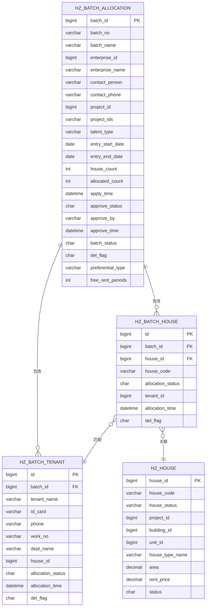

**图表来源**
- [ruoyi-system/src/main/java/com/ruoyi/system/domain/HzBatchAllocation.java:1-333](file://ruoyi-system/src/main/java/com/ruoyi/system/domain/HzBatchAllocation.java#L1-L333)
- [ruoyi-system/src/main/java/com/ruoyi/system/domain/HzBatchHouse.java:1-122](file://ruoyi-system/src/main/java/com/ruoyi/system/domain/HzBatchHouse.java#L1-L122)
- [ruoyi-system/src/main/java/com/ruoyi/system/domain/HzBatchTenant.java:1-158](file://ruoyi-system/src/main/java/com/ruoyi/system/domain/HzBatchTenant.java#L1-L158)
- [ruoyi-system/src/main/java/com/ruoyi/system/domain/HzHouse.java:114-146](file://ruoyi-system/src/main/java/com/ruoyi/system/domain/HzHouse.java#L114-L146)

### 数据库查询排序优化流程图
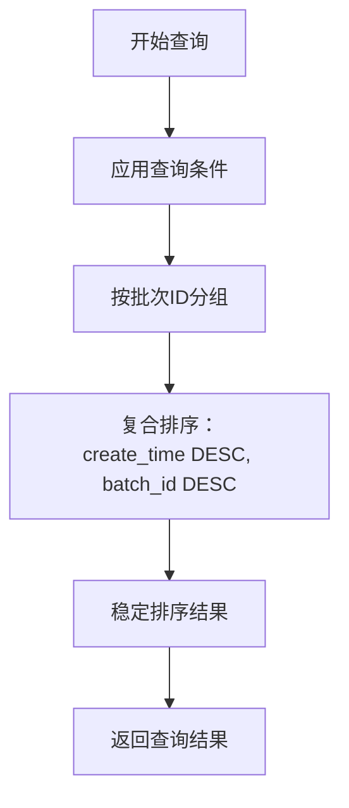

**图表来源**
- [ruoyi-system/src/main/resources/mapper/system/HzBatchAllocationMapper.xml:66-68](file://ruoyi-system/src/main/resources/mapper/system/HzBatchAllocationMapper.xml#L66-L68)
- [ruoyi-system/src/main/resources/mapper/system/HzBatchAllocationMapper.xml:84-86](file://ruoyi-system/src/main/resources/mapper/system/HzBatchAllocationMapper.xml#L84-L86)

### 自动状态更新机制流程图
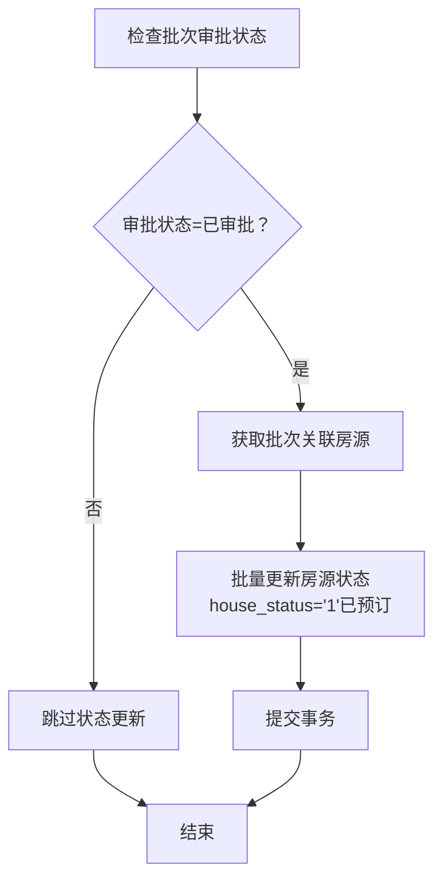

**图表来源**
- [ruoyi-system/src/main/java/com/ruoyi/system/service/impl/HzBatchAllocationServiceImpl.java:173-188](file://ruoyi-system/src/main/java/com/ruoyi/system/service/impl/HzBatchAllocationServiceImpl.java#L173-L188)
- [ruoyi-system/src/main/java/com/ruoyi/system/service/impl/HzBatchAllocationServiceImpl.java:513-525](file://ruoyi-system/src/main/java/com/ruoyi/system/service/impl/HzBatchAllocationServiceImpl.java#L513-L525)

### 冲突预防与状态释放流程图
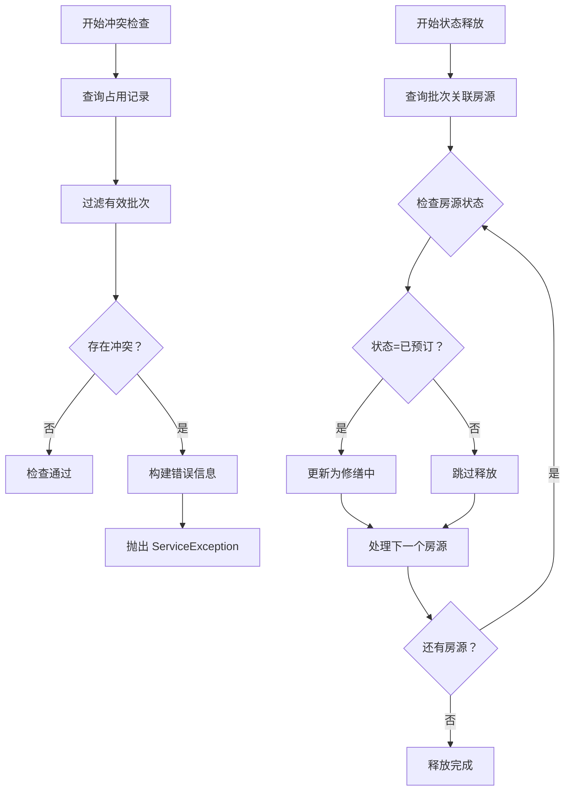

**图表来源**
- [ruoyi-system/src/main/java/com/ruoyi/system/service/impl/HzBatchAllocationServiceImpl.java:663-718](file://ruoyi-system/src/main/java/com/ruoyi/system/service/impl/HzBatchAllocationServiceImpl.java#L663-L718)
- [ruoyi-system/src/main/java/com/ruoyi/system/service/impl/HzBatchAllocationServiceImpl.java:726-752](file://ruoyi-system/src/main/java/com/ruoyi/system/service/impl/HzBatchAllocationServiceImpl.java#L726-L752)

### 批次偏好VO增强流程图
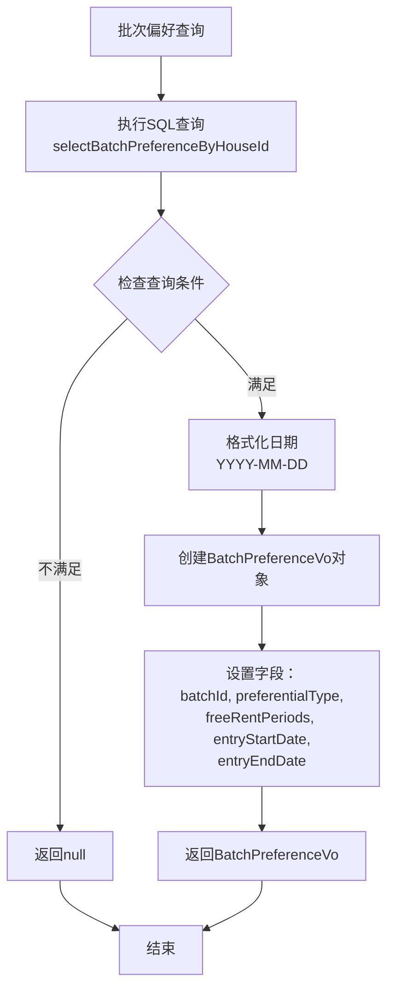

**图表来源**
- [ruoyi-system/src/main/resources/mapper/system/HzBatchHouseMapper.xml:7-22](file://ruoyi-system/src/main/resources/mapper/system/HzBatchHouseMapper.xml#L7-L22)
- [ruoyi-system/src/main/java/com/ruoyi/system/domain/vo/BatchPreferenceVo.java:1-76](file://ruoyi-system/src/main/java/com/ruoyi/system/domain/vo/BatchPreferenceVo.java#L1-L76)

### 房源选择逻辑更新流程图
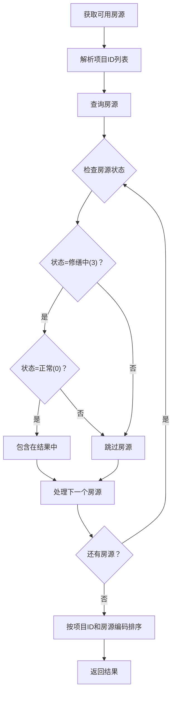

**图表来源**
- [ruoyi-system/src/main/java/com/ruoyi/system/service/impl/HzBatchAllocationServiceImpl.java:256-310](file://ruoyi-system/src/main/java/com/ruoyi/system/service/impl/HzBatchAllocationServiceImpl.java#L256-L310)
- [ruoyi-system/src/main/java/com/ruoyi/system/domain/HzHouse.java:114-117](file://ruoyi-system/src/main/java/com/ruoyi/system/domain/HzHouse.java#L114-L117)

### 批量分配验证功能流程图
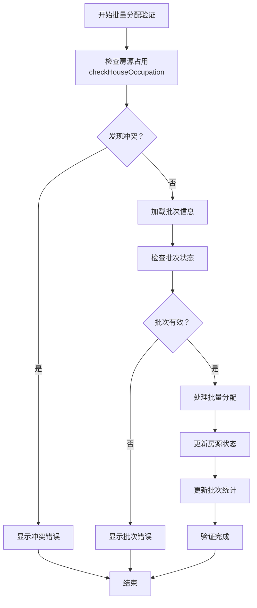

**图表来源**
- [ruoyi-system/src/main/java/com/ruoyi/system/service/impl/HzBatchAllocationServiceImpl.java:664-718](file://ruoyi-system/src/main/java/com/ruoyi/system/service/impl/HzBatchAllocationServiceImpl.java#L664-L718)
- [ruoyi-ui/src/views/gangzhu/house/batch/index.vue:466-516](file://ruoyi-ui/src/views/gangzhu/house/batch/index.vue#L466-L516)
- [uniapp-h5/pages/room/detail.vue:321-325](file://uniapp-h5/pages/room/detail.vue#L321-L325)