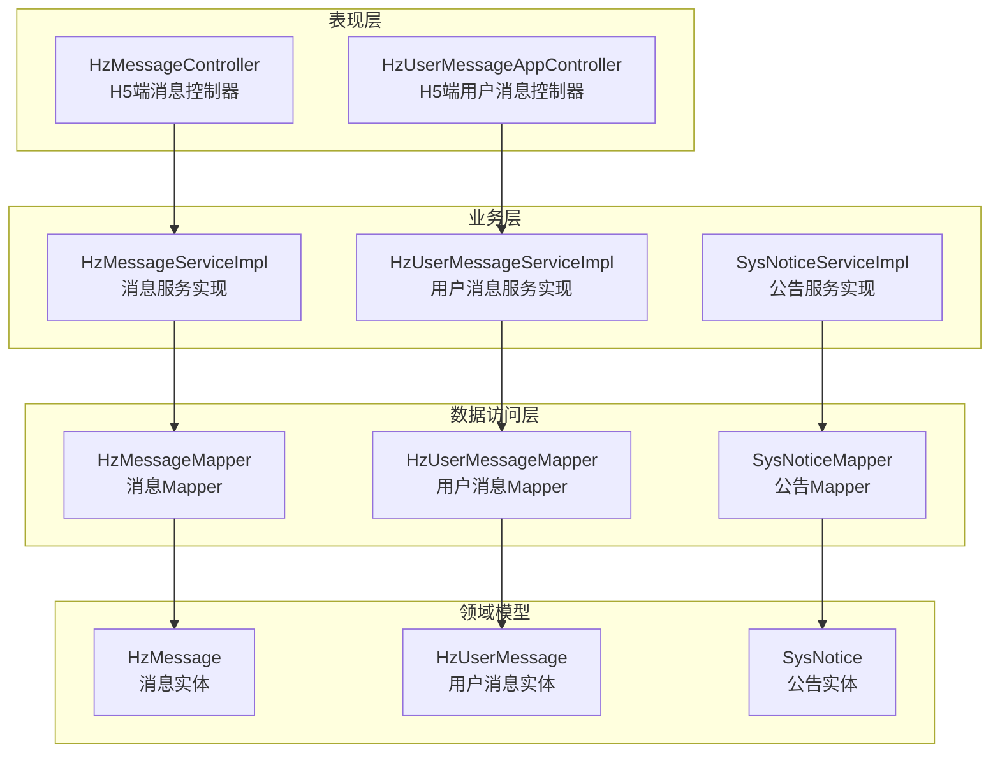
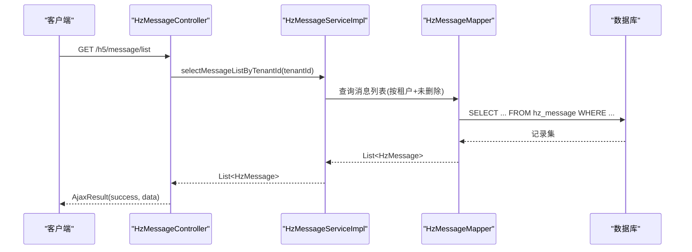
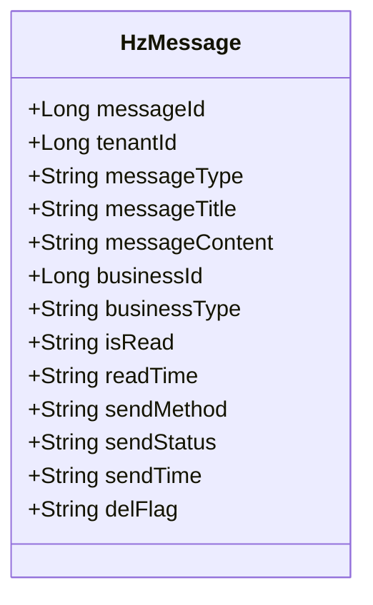
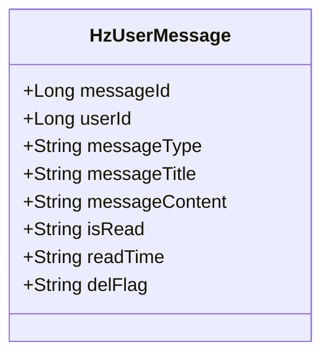
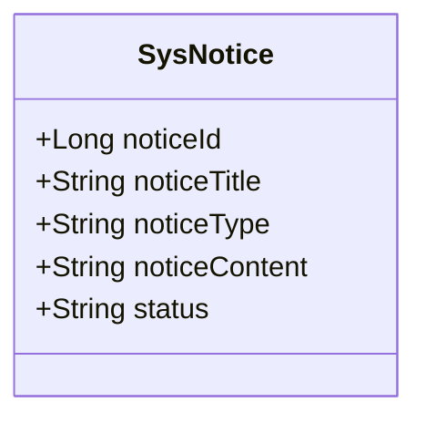
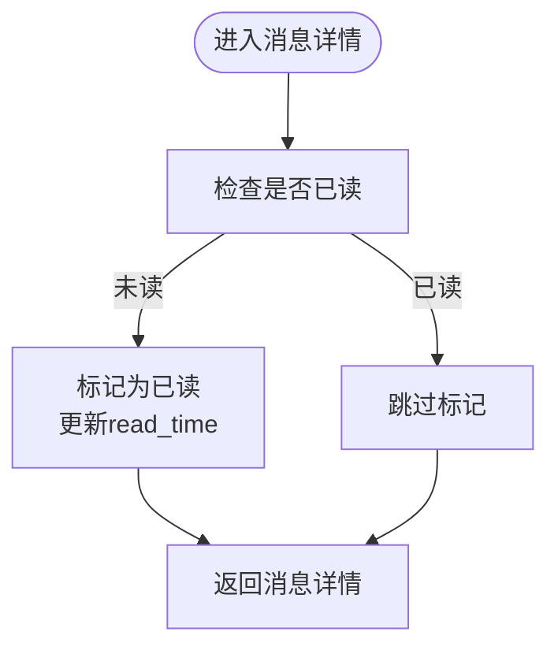
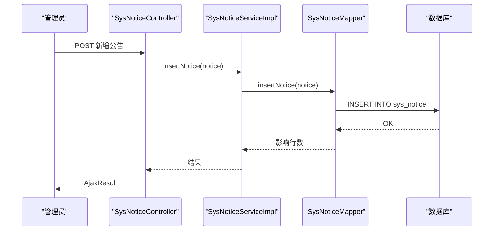
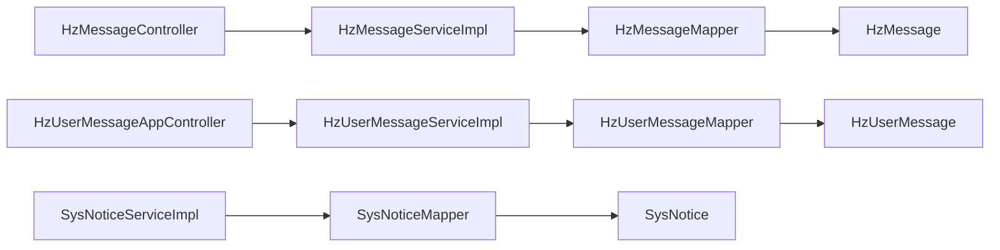

# 消息通知表

<cite>
**本文引用的文件**
- [09-消息通知.md](file://docs/数据字典/09-消息通知.md)
- [HzMessage.java](file://ruoyi-system/src/main/java/com/ruoyi/system/domain/HzMessage.java)
- [HzUserMessage.java](file://ruoyi-system/src/main/java/com/ruoyi/system/domain/HzUserMessage.java)
- [SysNotice.java](file://ruoyi-system/src/main/java/com/ruoyi/system/domain/SysNotice.java)
- [HzMessageMapper.java](file://ruoyi-system/src/main/java/com/ruoyi/system/mapper/HzMessageMapper.java)
- [HzUserMessageMapper.java](file://ruoyi-system/src/main/java/com/ruoyi/system/mapper/HzUserMessageMapper.java)
- [SysNoticeMapper.java](file://ruoyi-system/src/main/java/com/ruoyi/system/mapper/SysNoticeMapper.java)
- [HzMessageServiceImpl.java](file://ruoyi-system/src/main/java/com/ruoyi/system/service/impl/HzMessageServiceImpl.java)
- [HzUserMessageServiceImpl.java](file://ruoyi-system/src/main/java/com/ruoyi/system/service/impl/HzUserMessageServiceImpl.java)
- [SysNoticeServiceImpl.java](file://ruoyi-system/src/main/java/com/ruoyi/system/service/impl/SysNoticeServiceImpl.java)
- [HzMessageController.java](file://ruoyi-admin/src/main/java/com/ruoyi/web/controller/h5/HzMessageController.java)
- [HzUserMessageAppController.java](file://ruoyi-admin/src/main/java/com/ruoyi/web/controller/h5/HzUserMessageAppController.java)
</cite>

## 目录
1. [简介](#简介)
2. [项目结构](#项目结构)
3. [核心组件](#核心组件)
4. [架构总览](#架构总览)
5. [详细组件分析](#详细组件分析)
6. [依赖关系分析](#依赖关系分析)
7. [性能考虑](#性能考虑)
8. [故障排查指南](#故障排查指南)
9. [结论](#结论)
10. [附录](#附录)

## 简介
本文件聚焦于消息通知模块的数据表设计与业务实现，覆盖以下主题：
- 消息表 hz_message 的字段定义、业务含义与使用场景
- 用户消息表 hz_user_message 的字段定义、业务含义与使用场景
- 系统公告表 sys_notice 的字段定义、业务含义与使用场景
- 消息推送机制、用户通知管理、公告发布流程、消息状态跟踪等业务逻辑
- 技术实现方案：消息队列、推送策略、消息去重、读取状态等技术细节

## 项目结构
消息通知模块由“数据模型 + Mapper + Service + Controller”四层构成，分别对应数据库表、持久化、业务逻辑与对外接口。前端通过 H5 控制器暴露 REST 接口，供移动端或小程序调用。

图表来源
- [HzMessageController.java:1-166](file://ruoyi-admin/src/main/java/com/ruoyi/web/controller/h5/HzMessageController.java#L1-L166)
- [HzUserMessageAppController.java:1-139](file://ruoyi-admin/src/main/java/com/ruoyi/web/controller/h5/HzUserMessageAppController.java#L1-L139)
- [HzMessageServiceImpl.java:1-133](file://ruoyi-system/src/main/java/com/ruoyi/system/service/impl/HzMessageServiceImpl.java#L1-L133)
- [HzUserMessageServiceImpl.java:1-149](file://ruoyi-system/src/main/java/com/ruoyi/system/service/impl/HzUserMessageServiceImpl.java#L1-L149)
- [SysNoticeServiceImpl.java:1-101](file://ruoyi-system/src/main/java/com/ruoyi/system/service/impl/SysNoticeServiceImpl.java#L1-L101)
- [HzMessageMapper.java:1-17](file://ruoyi-system/src/main/java/com/ruoyi/system/mapper/HzMessageMapper.java#L1-L17)
- [HzUserMessageMapper.java:1-17](file://ruoyi-system/src/main/java/com/ruoyi/system/mapper/HzUserMessageMapper.java#L1-L17)
- [SysNoticeMapper.java:1-71](file://ruoyi-system/src/main/java/com/ruoyi/system/mapper/SysNoticeMapper.java#L1-L71)
- [HzMessage.java:1-221](file://ruoyi-system/src/main/java/com/ruoyi/system/domain/HzMessage.java#L1-L221)
- [HzUserMessage.java:1-143](file://ruoyi-system/src/main/java/com/ruoyi/system/domain/HzUserMessage.java#L1-L143)
- [SysNotice.java:1-103](file://ruoyi-system/src/main/java/com/ruoyi/system/domain/SysNotice.java#L1-L103)

章节来源
- [HzMessageController.java:1-166](file://ruoyi-admin/src/main/java/com/ruoyi/web/controller/h5/HzMessageController.java#L1-L166)
- [HzUserMessageAppController.java:1-139](file://ruoyi-admin/src/main/java/com/ruoyi/web/controller/h5/HzUserMessageAppController.java#L1-L139)
- [HzMessageServiceImpl.java:1-133](file://ruoyi-system/src/main/java/com/ruoyi/system/service/impl/HzMessageServiceImpl.java#L1-L133)
- [HzUserMessageServiceImpl.java:1-149](file://ruoyi-system/src/main/java/com/ruoyi/system/service/impl/HzUserMessageServiceImpl.java#L1-L149)
- [SysNoticeServiceImpl.java:1-101](file://ruoyi-system/src/main/java/com/ruoyi/system/service/impl/SysNoticeServiceImpl.java#L1-L101)

## 核心组件
本节对三个核心数据表进行逐项解析，并给出字段语义、取值范围与典型用途。

- hz_message（消息表）
  - 字段要点：消息ID、租户ID、消息类型、消息标题、消息内容、关联业务ID/类型、发送方式、发送状态、是否已读、阅读时间、删除标志等
  - 用途：记录面向租户的系统消息，支持按租户维度查询、分页、标记已读、统计未读数等
  - 关键字段示例路径：[HzMessage.java:19-69](file://ruoyi-system/src/main/java/com/ruoyi/system/domain/HzMessage.java#L19-L69)

- hz_user_message（用户消息表）
  - 字段要点：消息ID、用户ID、消息类型、消息标题、消息内容、是否已读、阅读时间、删除标志等
  - 用途：记录面向用户的站内信，支持按用户维度查询、分页、标记已读、统计未读数等
  - 关键字段示例路径：[HzUserMessage.java:16-46](file://ruoyi-system/src/main/java/com/ruoyi/system/domain/HzUserMessage.java#L16-L46)

- sys_notice（系统公告表）
  - 字段要点：公告ID、公告标题、公告类型、公告内容、公告状态等
  - 用途：记录系统级公告信息，支持查询、分页、新增、修改、删除等
  - 关键字段示例路径：[SysNotice.java:19-32](file://ruoyi-system/src/main/java/com/ruoyi/system/domain/SysNotice.java#L19-L32)

章节来源
- [09-消息通知.md:24-49](file://docs/数据字典/09-消息通知.md#L24-L49)
- [09-消息通知.md:52-75](file://docs/数据字典/09-消息通知.md#L52-L75)
- [HzMessage.java:19-69](file://ruoyi-system/src/main/java/com/ruoyi/system/domain/HzMessage.java#L19-L69)
- [HzUserMessage.java:16-46](file://ruoyi-system/src/main/java/com/ruoyi/system/domain/HzUserMessage.java#L16-L46)
- [SysNotice.java:19-32](file://ruoyi-system/src/main/java/com/ruoyi/system/domain/SysNotice.java#L19-L32)

## 架构总览
消息通知模块采用经典的分层架构：控制器负责接收请求并返回结果；服务层封装业务规则；数据访问层负责与数据库交互；领域模型映射到具体表结构。

图表来源
- [HzMessageController.java:30-45](file://ruoyi-admin/src/main/java/com/ruoyi/web/controller/h5/HzMessageController.java#L30-L45)
- [HzMessageServiceImpl.java:36-43](file://ruoyi-system/src/main/java/com/ruoyi/system/service/impl/HzMessageServiceImpl.java#L36-L43)
- [HzMessageMapper.java:1-17](file://ruoyi-system/src/main/java/com/ruoyi/system/mapper/HzMessageMapper.java#L1-L17)

## 详细组件分析

### 组件A：消息表 hz_message
- 设计要点
  - 主键自增，租户隔离字段，消息类型与业务类型解耦
  - 发送方式与发送状态用于区分推送渠道与发送结果
  - 是否已读与阅读时间用于用户侧状态跟踪
- 业务逻辑
  - 插入默认值：未读、已发送（站内信）、创建时间
  - 支持按租户维度查询、分页、统计未读数
  - 支持单条与批量标记已读
- 关键实现路径
  - 实体类字段定义：[HzMessage.java:19-69](file://ruoyi-system/src/main/java/com/ruoyi/system/domain/HzMessage.java#L19-L69)
  - 服务层插入与默认值设置：[HzMessageServiceImpl.java:81-88](file://ruoyi-system/src/main/java/com/ruoyi/system/service/impl/HzMessageServiceImpl.java#L81-L88)
  - 服务层按租户查询与未读统计：[HzMessageServiceImpl.java:36-64](file://ruoyi-system/src/main/java/com/ruoyi/system/service/impl/HzMessageServiceImpl.java#L36-L64)
  - 控制器读取详情并自动标记已读：[HzMessageController.java:84-100](file://ruoyi-admin/src/main/java/com/ruoyi/web/controller/h5/HzMessageController.java#L84-L100)

图表来源
- [HzMessage.java:19-69](file://ruoyi-system/src/main/java/com/ruoyi/system/domain/HzMessage.java#L19-L69)

章节来源
- [HzMessage.java:19-69](file://ruoyi-system/src/main/java/com/ruoyi/system/domain/HzMessage.java#L19-L69)
- [HzMessageServiceImpl.java:36-64](file://ruoyi-system/src/main/java/com/ruoyi/system/service/impl/HzMessageServiceImpl.java#L36-L64)
- [HzMessageController.java:84-100](file://ruoyi-admin/src/main/java/com/ruoyi/web/controller/h5/HzMessageController.java#L84-L100)

### 组件B：用户消息表 hz_user_message
- 设计要点
  - 用户维度的消息存储，便于按用户快速检索
  - 消息类型枚举化（如登录提醒、系统通知、账单提醒、合同提醒），利于前端展示与筛选
- 业务逻辑
  - 插入默认值：未读、创建时间、删除标志
  - 提供按用户查询、未读查询、未读统计、分页查询、标记已读、删除等能力
  - 提供统一的 sendMessage 方法用于快速落库
- 关键实现路径
  - 实体类字段定义：[HzUserMessage.java:16-46](file://ruoyi-system/src/main/java/com/ruoyi/system/domain/HzUserMessage.java#L16-L46)
  - 服务层插入与默认值设置：[HzUserMessageServiceImpl.java:96-102](file://ruoyi-system/src/main/java/com/ruoyi/system/service/impl/HzUserMessageServiceImpl.java#L96-L102)
  - 服务层按用户查询与未读统计：[HzUserMessageServiceImpl.java:38-66](file://ruoyi-system/src/main/java/com/ruoyi/system/service/impl/HzUserMessageServiceImpl.java#L38-L66)
  - 控制器读取详情并自动标记已读：[HzUserMessageAppController.java:77-91](file://ruoyi-admin/src/main/java/com/ruoyi/web/controller/h5/HzUserMessageAppController.java#L77-L91)

图表来源
- [HzUserMessage.java:16-46](file://ruoyi-system/src/main/java/com/ruoyi/system/domain/HzUserMessage.java#L16-L46)

章节来源
- [HzUserMessage.java:16-46](file://ruoyi-system/src/main/java/com/ruoyi/system/domain/HzUserMessage.java#L16-L46)
- [HzUserMessageServiceImpl.java:38-66](file://ruoyi-system/src/main/java/com/ruoyi/system/service/impl/HzUserMessageServiceImpl.java#L38-L66)
- [HzUserMessageAppController.java:77-91](file://ruoyi-admin/src/main/java/com/ruoyi/web/controller/h5/HzUserMessageAppController.java#L77-L91)

### 组件C：系统公告表 sys_notice
- 设计要点
  - 公告标题、类型、内容、状态构成核心字段
  - 支持分页查询与多条件过滤
- 业务逻辑
  - 提供查询、分页、新增、修改、删除等标准 CRUD 能力
- 关键实现路径
  - 实体类字段定义：[SysNotice.java:19-32](file://ruoyi-system/src/main/java/com/ruoyi/system/domain/SysNotice.java#L19-L32)
  - Mapper 接口方法：[SysNoticeMapper.java:18-70](file://ruoyi-system/src/main/java/com/ruoyi/system/mapper/SysNoticeMapper.java#L18-L70)
  - 服务层实现：[SysNoticeServiceImpl.java:29-99](file://ruoyi-system/src/main/java/com/ruoyi/system/service/impl/SysNoticeServiceImpl.java#L29-L99)

图表来源
- [SysNotice.java:19-32](file://ruoyi-system/src/main/java/com/ruoyi/system/domain/SysNotice.java#L19-L32)

章节来源
- [SysNotice.java:19-32](file://ruoyi-system/src/main/java/com/ruoyi/system/domain/SysNotice.java#L19-L32)
- [SysNoticeMapper.java:18-70](file://ruoyi-system/src/main/java/com/ruoyi/system/mapper/SysNoticeMapper.java#L18-L70)
- [SysNoticeServiceImpl.java:29-99](file://ruoyi-system/src/main/java/com/ruoyi/system/service/impl/SysNoticeServiceImpl.java#L29-L99)

### 组件D：消息推送机制与读取状态
- 推送策略
  - 站内信：直接写入 hz_user_message 或 hz_message，立即可见
  - 短信/邮件：可扩展至模板驱动与异步队列（见“技术实现方案”）
- 读取状态
  - 详情访问时自动标记已读
  - 支持单条、批量、全量标记已读
- 关键实现路径
  - 自动标记已读（消息详情）：[HzMessageController.java:94-97](file://ruoyi-admin/src/main/java/com/ruoyi/web/controller/h5/HzMessageController.java#L94-L97)，[HzUserMessageAppController.java:84-88](file://ruoyi-admin/src/main/java/com/ruoyi/web/controller/h5/HzUserMessageAppController.java#L84-L88)
  - 单条/批量标记已读：[HzMessageServiceImpl.java:98-125](file://ruoyi-system/src/main/java/com/ruoyi/system/service/impl/HzMessageServiceImpl.java#L98-L125)，[HzUserMessageServiceImpl.java:112-120](file://ruoyi-system/src/main/java/com/ruoyi/system/service/impl/HzUserMessageServiceImpl.java#L112-L120)

图表来源
- [HzMessageController.java:94-97](file://ruoyi-admin/src/main/java/com/ruoyi/web/controller/h5/HzMessageController.java#L94-L97)
- [HzUserMessageAppController.java:84-88](file://ruoyi-admin/src/main/java/com/ruoyi/web/controller/h5/HzUserMessageAppController.java#L84-L88)

章节来源
- [HzMessageController.java:94-97](file://ruoyi-admin/src/main/java/com/ruoyi/web/controller/h5/HzMessageController.java#L94-L97)
- [HzUserMessageAppController.java:84-88](file://ruoyi-admin/src/main/java/com/ruoyi/web/controller/h5/HzUserMessageAppController.java#L84-L88)
- [HzMessageServiceImpl.java:98-125](file://ruoyi-system/src/main/java/com/ruoyi/system/service/impl/HzMessageServiceImpl.java#L98-L125)
- [HzUserMessageServiceImpl.java:112-120](file://ruoyi-system/src/main/java/com/ruoyi/system/service/impl/HzUserMessageServiceImpl.java#L112-L120)

### 组件E：公告发布流程
- 发布流程
  - 新增公告 -> 设置状态为“正常” -> 前端展示
  - 支持分页查询与条件过滤
- 关键实现路径
  - 新增/修改/删除：[SysNoticeServiceImpl.java:54-81](file://ruoyi-system/src/main/java/com/ruoyi/system/service/impl/SysNoticeServiceImpl.java#L54-L81)
  - 分页查询：[SysNoticeServiceImpl.java:96-99](file://ruoyi-system/src/main/java/com/ruoyi/system/service/impl/SysNoticeServiceImpl.java#L96-L99)

图表来源
- [SysNoticeServiceImpl.java:54-57](file://ruoyi-system/src/main/java/com/ruoyi/system/service/impl/SysNoticeServiceImpl.java#L54-L57)
- [SysNoticeMapper.java:40](file://ruoyi-system/src/main/java/com/ruoyi/system/mapper/SysNoticeMapper.java#L40)

章节来源
- [SysNoticeServiceImpl.java:54-81](file://ruoyi-system/src/main/java/com/ruoyi/system/service/impl/SysNoticeServiceImpl.java#L54-L81)
- [SysNoticeMapper.java:40-48](file://ruoyi-system/src/main/java/com/ruoyi/system/mapper/SysNoticeMapper.java#L40-L48)

## 依赖关系分析
- 控制器依赖服务层接口，服务层依赖 Mapper 接口，Mapper 通过 MyBatis 与数据库交互
- HzMessage 与 HzUserMessage 分别服务于“租户维度消息”和“用户维度消息”，职责清晰
- SysNotice 作为独立公告模块，不与消息表产生直接依赖

图表来源
- [HzMessageController.java:23-27](file://ruoyi-admin/src/main/java/com/ruoyi/web/controller/h5/HzMessageController.java#L23-L27)
- [HzUserMessageAppController.java:22-26](file://ruoyi-admin/src/main/java/com/ruoyi/web/controller/h5/HzUserMessageAppController.java#L22-L26)
- [HzMessageServiceImpl.java:24](file://ruoyi-system/src/main/java/com/ruoyi/system/service/impl/HzMessageServiceImpl.java#L24)
- [HzUserMessageServiceImpl.java:24](file://ruoyi-system/src/main/java/com/ruoyi/system/service/impl/HzUserMessageServiceImpl.java#L24)
- [SysNoticeServiceImpl.java:20-21](file://ruoyi-system/src/main/java/com/ruoyi/system/service/impl/SysNoticeServiceImpl.java#L20-L21)

章节来源
- [HzMessageController.java:23-27](file://ruoyi-admin/src/main/java/com/ruoyi/web/controller/h5/HzMessageController.java#L23-L27)
- [HzUserMessageAppController.java:22-26](file://ruoyi-admin/src/main/java/com/ruoyi/web/controller/h5/HzUserMessageAppController.java#L22-L26)
- [HzMessageServiceImpl.java:24](file://ruoyi-system/src/main/java/com/ruoyi/system/service/impl/HzMessageServiceImpl.java#L24)
- [HzUserMessageServiceImpl.java:24](file://ruoyi-system/src/main/java/com/ruoyi/system/service/impl/HzUserMessageServiceImpl.java#L24)
- [SysNoticeServiceImpl.java:20-21](file://ruoyi-system/src/main/java/com/ruoyi/system/service/impl/SysNoticeServiceImpl.java#L20-L21)

## 性能考虑
- 查询优化
  - 在 hz_message 与 hz_user_message 上按租户 ID/用户 ID、状态、创建时间建立索引，提升分页与过滤效率
  - 对 is_read 字段建立索引，加速未读统计与查询
- 写入优化
  - 批量标记已读时，建议控制单次批处理大小，避免长事务锁竞争
- 缓存策略
  - 未读计数可短期缓存，结合定时刷新或事件触发更新
- 异步化
  - 短信/邮件等外部通道建议接入消息队列异步发送，避免阻塞主流程

## 故障排查指南
- 常见问题
  - 未读计数不准确：检查 is_read 字段更新逻辑与自动标记流程
  - 消息越权访问：控制器中存在 TODO 校验，需补充基于当前登录用户的身份校验
  - 批量标记失败：确认传入的 messageIds 非空且在当前用户/租户范围内
- 日志定位
  - 用户消息发送异常会记录错误日志，便于定位 userId 与消息标题
- 关键实现路径
  - 未读计数与查询：[HzMessageServiceImpl.java:57-64](file://ruoyi-system/src/main/java/com/ruoyi/system/service/impl/HzMessageServiceImpl.java#L57-L64)，[HzUserMessageServiceImpl.java:59-66](file://ruoyi-system/src/main/java/com/ruoyi/system/service/impl/HzUserMessageServiceImpl.java#L59-L66)
  - 自动标记已读：[HzMessageController.java:94-97](file://ruoyi-admin/src/main/java/com/ruoyi/web/controller/h5/HzMessageController.java#L94-L97)，[HzUserMessageAppController.java:84-88](file://ruoyi-admin/src/main/java/com/ruoyi/web/controller/h5/HzUserMessageAppController.java#L84-L88)
  - 发送消息异常日志：[HzUserMessageServiceImpl.java:143-146](file://ruoyi-system/src/main/java/com/ruoyi/system/service/impl/HzUserMessageServiceImpl.java#L143-L146)

章节来源
- [HzMessageServiceImpl.java:57-64](file://ruoyi-system/src/main/java/com/ruoyi/system/service/impl/HzMessageServiceImpl.java#L57-L64)
- [HzUserMessageServiceImpl.java:59-66](file://ruoyi-system/src/main/java/com/ruoyi/system/service/impl/HzUserMessageServiceImpl.java#L59-L66)
- [HzMessageController.java:94-97](file://ruoyi-admin/src/main/java/com/ruoyi/web/controller/h5/HzMessageController.java#L94-L97)
- [HzUserMessageAppController.java:84-88](file://ruoyi-admin/src/main/java/com/ruoyi/web/controller/h5/HzUserMessageAppController.java#L84-L88)
- [HzUserMessageServiceImpl.java:143-146](file://ruoyi-system/src/main/java/com/ruoyi/system/service/impl/HzUserMessageServiceImpl.java#L143-L146)

## 结论
消息通知模块以清晰的三层架构实现了消息与公告的完整生命周期管理。hz_message 与 hz_user_message 分别满足租户级与用户级的消息需求，sys_notice 提供系统公告能力。通过自动标记已读、未读统计与分页查询，系统具备良好的用户体验。建议后续引入消息队列与缓存策略，进一步提升高并发下的吞吐与响应性能。

## 附录

### 数据表字段速查
- hz_message（消息表）
  - 关键字段：message_id、tenant_id、message_type、message_title、message_content、business_id、business_type、is_read、read_time、send_method、send_status、send_time、del_flag
  - 示例路径：[HzMessage.java:19-69](file://ruoyi-system/src/main/java/com/ruoyi/system/domain/HzMessage.java#L19-L69)

- hz_user_message（用户消息表）
  - 关键字段：message_id、user_id、message_type、message_title、message_content、is_read、read_time、del_flag
  - 示例路径：[HzUserMessage.java:16-46](file://ruoyi-system/src/main/java/com/ruoyi/system/domain/HzUserMessage.java#L16-L46)

- sys_notice（系统公告表）
  - 关键字段：notice_id、notice_title、notice_type、notice_content、status
  - 示例路径：[SysNotice.java:19-32](file://ruoyi-system/src/main/java/com/ruoyi/system/domain/SysNotice.java#L19-L32)

### 技术实现方案（建议）
- 消息队列
  - 使用 RabbitMQ/Kafka 等消息中间件，将短信/邮件发送异步化，降低主流程延迟
- 推送策略
  - 站内信即时推送；短信/邮件按模板与变量渲染后异步投递
- 消息去重
  - 基于业务唯一标识（如 business_id + business_type + message_type）进行去重判断
- 读取状态
  - 详情访问自动标记已读；提供批量标记与全量标记接口；未读计数支持缓存与定时刷新