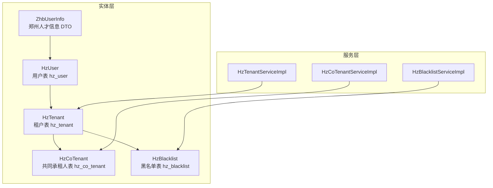
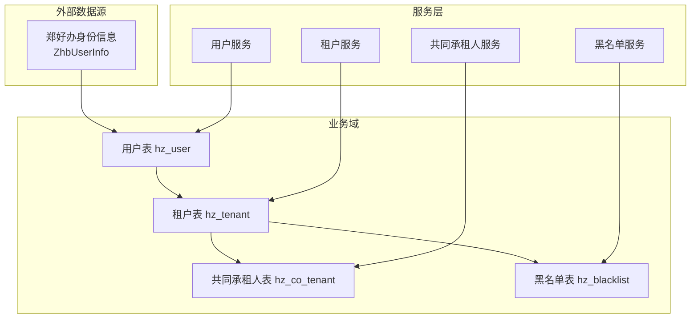
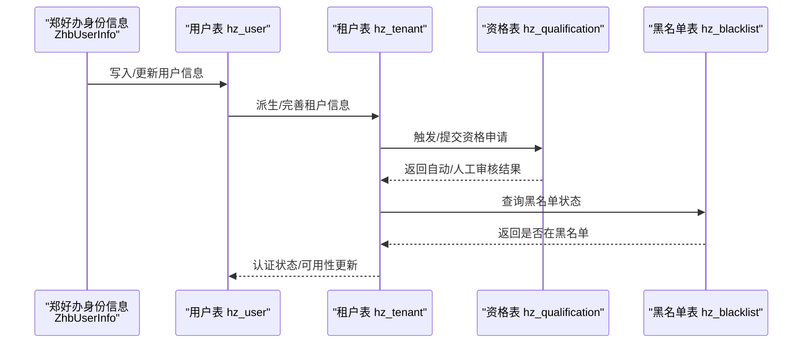
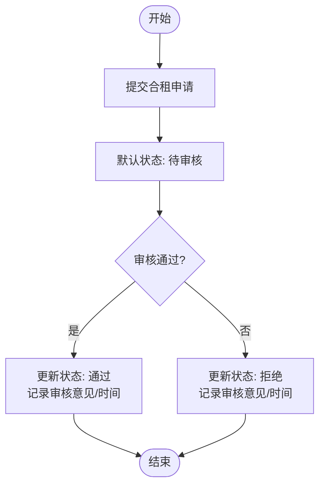
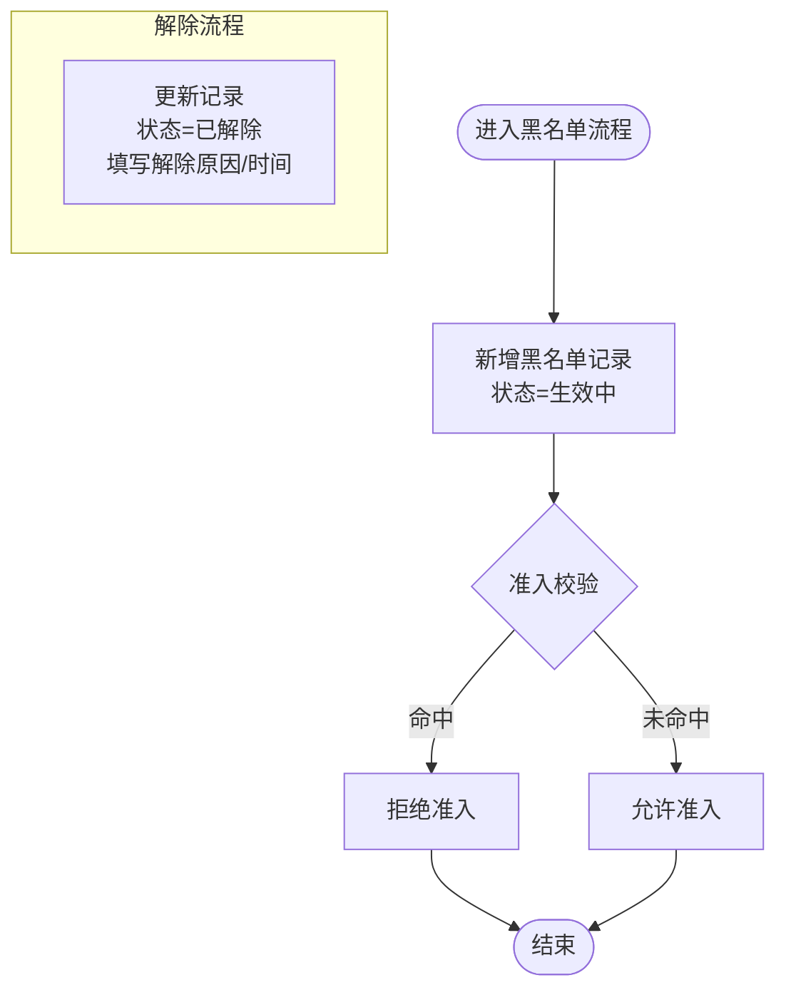
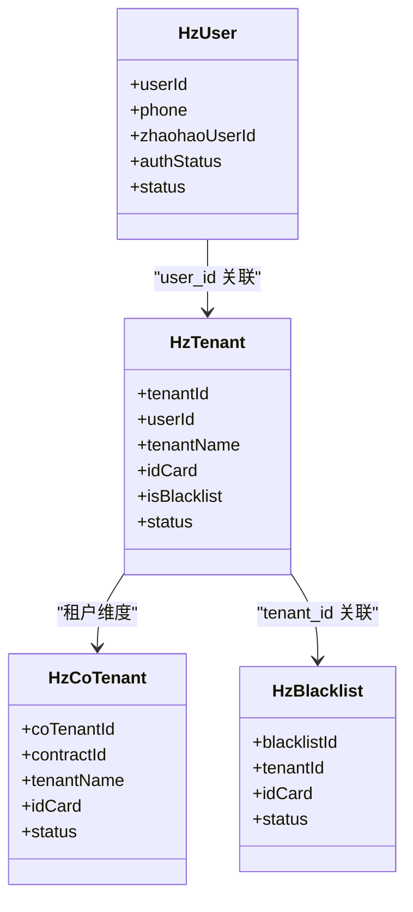

# 租户管理表

<cite>
**本文引用的文件**   
- [HzUser.java](file://ruoyi-system/src/main/java/com/ruoyi/system/domain/HzUser.java)
- [HzTenant.java](file://ruoyi-system/src/main/java/com/ruoyi/system/domain/HzTenant.java)
- [HzCoTenant.java](file://ruoyi-system/src/main/java/com/ruoyi/system/domain/HzCoTenant.java)
- [HzBlacklist.java](file://ruoyi-system/src/main/java/com/ruoyi/system/domain/HzBlacklist.java)
- [ZhbUserInfo.java](file://ruoyi-system/src/main/java/com/ruoyi/system/domain/ZhbUserInfo.java)
- [HzTenantServiceImpl.java](file://ruoyi-system/src/main/java/com/ruoyi/system/service/impl/HzTenantServiceImpl.java)
- [HzCoTenantServiceImpl.java](file://ruoyi-system/src/main/java/com/ruoyi/system/service/impl/HzCoTenantServiceImpl.java)
- [HzBlacklistServiceImpl.java](file://ruoyi-system/src/main/java/com/ruoyi/system/service/impl/HzBlacklistServiceImpl.java)
- [02-租户管理.md](file://docs/数据字典/02-租户管理.md)
</cite>

## 目录
1. [简介](#简介)
2. [项目结构](#项目结构)
3. [核心组件](#核心组件)
4. [架构总览](#架构总览)
5. [详细组件分析](#详细组件分析)
6. [依赖分析](#依赖分析)
7. [性能考虑](#性能考虑)
8. [故障排查指南](#故障排查指南)
9. [结论](#结论)
10. [附录](#附录)

## 简介
本文件聚焦于租户管理模块的数据表设计与业务流程，覆盖用户表(hz_user)、租户表(hz_tenant)、共同承租人表(hz_co_tenant)、黑名单表(hz_blacklist)以及郑州人才信息(ZhbUserInfo)在系统中的角色与交互。文档从数据模型、字段语义、业务规则、生命周期管理（注册、认证、状态变更、历史记录）等方面进行系统化梳理，并提供可视化图示帮助理解。

## 项目结构
围绕租户管理的核心文件组织如下：
- 实体类：定义数据库表映射与字段含义
- 服务实现：封装查询、分页、新增、更新、审核等业务逻辑
- 文档：数据字典对各表字段与用途进行规范说明

图表来源
- [HzUser.java:14-375](file://ruoyi-system/src/main/java/com/ruoyi/system/domain/HzUser.java#L14-L375)
- [HzTenant.java:11-316](file://ruoyi-system/src/main/java/com/ruoyi/system/domain/HzTenant.java#L11-L316)
- [HzCoTenant.java:11-221](file://ruoyi-system/src/main/java/com/ruoyi/system/domain/HzCoTenant.java#L11-L221)
- [HzBlacklist.java:11-200](file://ruoyi-system/src/main/java/com/ruoyi/system/domain/HzBlacklist.java#L11-L200)
- [ZhbUserInfo.java:10-132](file://ruoyi-system/src/main/java/com/ruoyi/system/domain/ZhbUserInfo.java#L10-L132)
- [HzTenantServiceImpl.java:14-86](file://ruoyi-system/src/main/java/com/ruoyi/system/service/impl/HzTenantServiceImpl.java#L14-L86)
- [HzCoTenantServiceImpl.java:17-80](file://ruoyi-system/src/main/java/com/ruoyi/system/service/impl/HzCoTenantServiceImpl.java#L17-L80)
- [HzBlacklistServiceImpl.java:11-69](file://ruoyi-system/src/main/java/com/ruoyi/system/service/impl/HzBlacklistServiceImpl.java#L11-L69)

章节来源
- [HzUser.java:14-375](file://ruoyi-system/src/main/java/com/ruoyi/system/domain/HzUser.java#L14-L375)
- [HzTenant.java:11-316](file://ruoyi-system/src/main/java/com/ruoyi/system/domain/HzTenant.java#L11-L316)
- [HzCoTenant.java:11-221](file://ruoyi-system/src/main/java/com/ruoyi/system/domain/HzCoTenant.java#L11-L221)
- [HzBlacklist.java:11-200](file://ruoyi-system/src/main/java/com/ruoyi/system/domain/HzBlacklist.java#L11-L200)
- [ZhbUserInfo.java:10-132](file://ruoyi-system/src/main/java/com/ruoyi/system/domain/ZhbUserInfo.java#L10-L132)
- [HzTenantServiceImpl.java:14-86](file://ruoyi-system/src/main/java/com/ruoyi/system/service/impl/HzTenantServiceImpl.java#L14-L86)
- [HzCoTenantServiceImpl.java:17-80](file://ruoyi-system/src/main/java/com/ruoyi/system/service/impl/HzCoTenantServiceImpl.java#L17-L80)
- [HzBlacklistServiceImpl.java:11-69](file://ruoyi-system/src/main/java/com/ruoyi/system/service/impl/HzBlacklistServiceImpl.java#L11-L69)

## 核心组件
- 用户表 hz_user：承载用户登录、来源渠道、实名认证、状态等基础信息，是租户身份绑定与认证的基础。
- 租户表 hz_tenant：存储租户的个人资料、联系信息、信用分、黑名单标记、状态等，是租赁业务的主体。
- 共同承租人表 hz_co_tenant：记录合租申请、关系、审核状态及关联合同信息，支撑合租管理。
- 黑名单表 hz_blacklist：记录列入/解除黑名单的原因、时间、状态等，用于风控与准入控制。
- 郑州人才信息 ZhbUserInfo：封装来自“郑好办”的用户身份信息（如 zid、realName、idCode 等），用于租户注册与认证的数据来源。

章节来源
- [02-租户管理.md:3-144](file://docs/数据字典/02-租户管理.md#L3-L144)
- [HzUser.java:14-375](file://ruoyi-system/src/main/java/com/ruoyi/system/domain/HzUser.java#L14-L375)
- [HzTenant.java:11-316](file://ruoyi-system/src/main/java/com/ruoyi/system/domain/HzTenant.java#L11-L316)
- [HzCoTenant.java:11-221](file://ruoyi-system/src/main/java/com/ruoyi/system/domain/HzCoTenant.java#L11-L221)
- [HzBlacklist.java:11-200](file://ruoyi-system/src/main/java/com/ruoyi/system/domain/HzBlacklist.java#L11-L200)
- [ZhbUserInfo.java:10-132](file://ruoyi-system/src/main/java/com/ruoyi/system/domain/ZhbUserInfo.java#L10-L132)

## 架构总览
租户管理模块以“用户-租户-共同承租人-黑名单”为主线，结合“郑好办”身份信息完成租户注册与认证。服务层提供查询、分页、新增、更新、审核等能力，确保租户生命周期的可追踪与可控。

图表来源
- [ZhbUserInfo.java:10-132](file://ruoyi-system/src/main/java/com/ruoyi/system/domain/ZhbUserInfo.java#L10-L132)
- [HzUser.java:14-375](file://ruoyi-system/src/main/java/com/ruoyi/system/domain/HzUser.java#L14-L375)
- [HzTenant.java:11-316](file://ruoyi-system/src/main/java/com/ruoyi/system/domain/HzTenant.java#L11-L316)
- [HzCoTenant.java:11-221](file://ruoyi-system/src/main/java/com/ruoyi/system/domain/HzCoTenant.java#L11-L221)
- [HzBlacklist.java:11-200](file://ruoyi-system/src/main/java/com/ruoyi/system/domain/HzBlacklist.java#L11-L200)
- [HzTenantServiceImpl.java:14-86](file://ruoyi-system/src/main/java/com/ruoyi/system/service/impl/HzTenantServiceImpl.java#L14-L86)
- [HzCoTenantServiceImpl.java:17-80](file://ruoyi-system/src/main/java/com/ruoyi/system/service/impl/HzCoTenantServiceImpl.java#L17-L80)
- [HzBlacklistServiceImpl.java:11-69](file://ruoyi-system/src/main/java/com/ruoyi/system/service/impl/HzBlacklistServiceImpl.java#L11-L69)

## 详细组件分析

### 用户表 hz_user
- 设计要点
  - 主键：自增用户ID
  - 登录与来源：手机号/微信OpenID/UnionID/郑好办用户ID
  - 个人资料：真实姓名、性别、身份证、学历、工作单位等
  - 认证与状态：认证状态、认证时间、状态、删除标志
  - 行为轨迹：最后登录时间、IP
- 用途
  - 作为租户注册与认证的“身份凭证”，与租户表建立关联
  - 提供“郑好办”来源的用户信息，支撑后续资格校验与承诺书签署
- 关键字段与约束
  - 字段覆盖登录、来源、认证、状态、删除标志等，便于审计与风控
- 生命周期
  - 注册：来源类型区分渠道
  - 认证：认证状态与时间记录
  - 状态变更：启用/停用
  - 历史记录：登录行为与时间

章节来源
- [HzUser.java:14-375](file://ruoyi-system/src/main/java/com/ruoyi/system/domain/HzUser.java#L14-L375)
- [02-租户管理.md:38-72](file://docs/数据字典/02-租户管理.md#L38-L72)

### 租户表 hz_tenant
- 设计要点
  - 主键：自增租户ID
  - 关联：user_id 关联用户表
  - 个人资料：姓名、身份证、手机、性别、出生日期、教育、婚姻状况、户籍/现住址、工作单位、紧急联系人/电话、邮箱、微信、头像
  - 信用与风控：信用分、是否黑名单标记
  - 状态与删除：状态、删除标志
  - 电子签名：e签宝个人认证psnId
- 用途
  - 承载租户在租赁业务中的完整画像
  - 与共同承租人、黑名单形成关联，支撑合租与风控
- 关键字段与约束
  - is_blacklist 与黑名单表联动，status 控制可用性
- 生命周期
  - 注册：由用户信息派生或补充完善
  - 认证：结合用户认证状态与e签宝认证
  - 状态变更：正常/停用
  - 历史记录：创建/更新时间与操作人

章节来源
- [HzTenant.java:11-316](file://ruoyi-system/src/main/java/com/ruoyi/system/domain/HzTenant.java#L11-L316)
- [02-租户管理.md:3-35](file://docs/数据字典/02-租户管理.md#L3-L35)

### 共同承租人表 hz_co_tenant
- 设计要点
  - 主键：自增共同承租人ID
  - 关联：contract_id 关联合同（业务扩展）
  - 申请信息：姓名、身份证、电话、与主承租人关系
  - 审核状态：待审核/通过/拒绝
  - 删除标志：软删除
  - 扩展字段：合同编号、房间地址、主承租人信息、申请/审核时间与意见（用于展示）
- 用途
  - 管理合租申请流程，支持审核与状态追踪
- 关键字段与约束
  - status 默认值为待审核，审核时更新状态与备注
- 生命周期
  - 申请：默认待审核
  - 审核：通过/拒绝
  - 历史记录：申请/审核时间与操作人

章节来源
- [HzCoTenant.java:11-221](file://ruoyi-system/src/main/java/com/ruoyi/system/domain/HzCoTenant.java#L11-L221)
- [HzCoTenantServiceImpl.java:17-80](file://ruoyi-system/src/main/java/com/ruoyi/system/service/impl/HzCoTenantServiceImpl.java#L17-L80)

### 黑名单表 hz_blacklist
- 设计要点
  - 主键：自增黑名单ID
  - 关联：tenant_id 关联租户，contract_id 可选关联合同
  - 人员信息：租户姓名、身份证、手机号
  - 黑名单原因、类型（违约/欠费/违规/其他）
  - 时间维度：列入/解除时间、解除原因
  - 状态：生效中/已解除
  - 删除标志：软删除
- 用途
  - 作为准入控制与风控依据，阻止违规或高风险人员参与租赁
- 关键字段与约束
  - 生效中状态仅保留最新一条记录
  - 解除时更新状态与解除时间/原因
- 生命周期
  - 列入：默认生效中
  - 解除：更新状态与解除信息
  - 历史记录：时间戳与操作人

章节来源
- [HzBlacklist.java:11-200](file://ruoyi-system/src/main/java/com/ruoyi/system/domain/HzBlacklist.java#L11-L200)
- [HzBlacklistServiceImpl.java:11-69](file://ruoyi-system/src/main/java/com/ruoyi/system/service/impl/HzBlacklistServiceImpl.java#L11-L69)
- [02-租户管理.md:124-144](file://docs/数据字典/02-租户管理.md#L124-L144)

### 郑州人才信息 ZhbUserInfo
- 设计要点
  - 字段：zid、phone、displayName、realName、idCode、avatarUrl、gender、uid
  - 用途：作为“郑好办”身份信息载体，用于租户注册与认证的数据来源
- 与租户管理的关系
  - 作为用户表 hz_user 的外部数据输入，驱动租户信息完善与认证

章节来源
- [ZhbUserInfo.java:10-132](file://ruoyi-system/src/main/java/com/ruoyi/system/domain/ZhbUserInfo.java#L10-L132)

### 租户身份验证与资质校验
- 身份验证
  - 用户来源：手机号、微信OpenID/UnionID、郑好办用户ID
  - 认证状态：用户表的认证状态与时间，配合e签宝个人认证psnId
- 资质校验
  - 资格表 hz_qualification 记录申请类型、社保、本地房产、家庭人口、收入等维度的自动/人工审核结果与最终结果
  - 黑名单联动：黑名单表状态影响准入
- 承诺书
  - 承诺书表 hz_commitment 记录签署内容、签名数据、签署时间/IP与状态

图表来源
- [ZhbUserInfo.java:10-132](file://ruoyi-system/src/main/java/com/ruoyi/system/domain/ZhbUserInfo.java#L10-L132)
- [HzUser.java:14-375](file://ruoyi-system/src/main/java/com/ruoyi/system/domain/HzUser.java#L14-L375)
- [HzTenant.java:11-316](file://ruoyi-system/src/main/java/com/ruoyi/system/domain/HzTenant.java#L11-L316)
- [02-租户管理.md:38-72](file://docs/数据字典/02-租户管理.md#L38-L72)
- [02-租户管理.md:124-144](file://docs/数据字典/02-租户管理.md#L124-L144)

### 共同承租人管理
- 申请与审核
  - 申请：默认待审核，填写关系、联系方式等
  - 审核：通过/拒绝，记录审核意见与时间
- 展示与查询
  - 支持按租户、合同、状态等条件分页查询，返回扩展字段用于界面展示

图表来源
- [HzCoTenantServiceImpl.java:69-78](file://ruoyi-system/src/main/java/com/ruoyi/system/service/impl/HzCoTenantServiceImpl.java#L69-L78)
- [HzCoTenant.java:44-46](file://ruoyi-system/src/main/java/com/ruoyi/system/domain/HzCoTenant.java#L44-L46)

### 黑名单控制
- 列入
  - 默认状态生效中，记录列入时间
- 解除
  - 更新状态为已解除，记录解除时间与原因
- 查询
  - 仅返回最新一条生效中的记录

图表来源
- [HzBlacklistServiceImpl.java:47-67](file://ruoyi-system/src/main/java/com/ruoyi/system/service/impl/HzBlacklistServiceImpl.java#L47-L67)
- [HzBlacklist.java:64-66](file://ruoyi-system/src/main/java/com/ruoyi/system/domain/HzBlacklist.java#L64-L66)

### 租户生命周期管理
- 注册
  - 来源于“郑好办”的 ZhbUserInfo 与用户表 hz_user 对接，生成/完善租户表 hz_tenant
- 认证
  - 用户认证状态与e签宝认证psnId共同决定租户可用性
- 状态变更
  - 正常/停用；黑名单状态变化影响可用性
- 历史记录
  - 创建/更新时间与操作人贯穿各表，支持审计与追溯

章节来源
- [HzTenantServiceImpl.java:22-84](file://ruoyi-system/src/main/java/com/ruoyi/system/service/impl/HzTenantServiceImpl.java#L22-L84)
- [HzBlacklistServiceImpl.java:19-67](file://ruoyi-system/src/main/java/com/ruoyi/system/service/impl/HzBlacklistServiceImpl.java#L19-L67)
- [02-租户管理.md:3-35](file://docs/数据字典/02-租户管理.md#L3-L35)

## 依赖分析
- 实体依赖
  - hz_user 与 hz_tenant 通过 user_id 关联
  - hz_tenant 与 hz_co_tenant 通过租户维度关联（申请/审核）
  - hz_tenant 与 hz_blacklist 通过 tenant_id 关联
- 服务依赖
  - 租户服务负责用户/租户/分页/查询
  - 共同承租人服务负责申请/审核/分页
  - 黑名单服务负责列入/解除/查询

图表来源
- [HzUser.java:14-375](file://ruoyi-system/src/main/java/com/ruoyi/system/domain/HzUser.java#L14-L375)
- [HzTenant.java:11-316](file://ruoyi-system/src/main/java/com/ruoyi/system/domain/HzTenant.java#L11-L316)
- [HzCoTenant.java:11-221](file://ruoyi-system/src/main/java/com/ruoyi/system/domain/HzCoTenant.java#L11-L221)
- [HzBlacklist.java:11-200](file://ruoyi-system/src/main/java/com/ruoyi/system/domain/HzBlacklist.java#L11-L200)

## 性能考虑
- 分页查询
  - 租户与共同承租人均提供分页查询接口，建议结合常用过滤条件（姓名、身份证、手机号、状态）使用
- 软删除
  - 使用 del_flag 进行软删除，避免物理删除带来的统计与审计困难
- 索引建议
  - 常用查询字段（如 user_id、id_card、phone、status、del_flag）建议建立索引以提升查询性能
- 审计字段
  - create_by/create_time/update_by/update_time 便于定位问题与回溯

## 故障排查指南
- 常见问题
  - 租户无法登录：检查用户表状态与认证状态，确认租户表状态与黑名单状态
  - 合租申请未生效：检查共同承租人表状态是否为“通过”
  - 黑名单误判：核查黑名单表最新记录的状态与原因
- 排查步骤
  - 根据用户ID/手机号/身份证在用户表与租户表交叉验证
  - 查看共同承租人表的审核记录与时间
  - 核查黑名单表的生效中记录
- 参考实现
  - 租户查询：按姓名/身份证/手机号/状态过滤，降序排列
  - 黑名单查询：仅返回最新一条生效中记录

章节来源
- [HzTenantServiceImpl.java:46-68](file://ruoyi-system/src/main/java/com/ruoyi/system/service/impl/HzTenantServiceImpl.java#L46-L68)
- [HzCoTenantServiceImpl.java:30-44](file://ruoyi-system/src/main/java/com/ruoyi/system/service/impl/HzCoTenantServiceImpl.java#L30-L44)
- [HzBlacklistServiceImpl.java:25-43](file://ruoyi-system/src/main/java/com/ruoyi/system/service/impl/HzBlacklistServiceImpl.java#L25-L43)

## 结论
租户管理模块通过用户、租户、共同承租人、黑名单四张核心表与“郑好办”身份信息协同，构建了从注册到认证、从合租到风控的完整数据闭环。服务层提供了完善的查询、分页、新增、更新与审核能力，满足业务对租户生命周期管理的需求。建议在生产环境中强化索引策略与审计字段使用，确保系统的稳定性与可追溯性。

## 附录
- 数据字典参考
  - 用户表、租户表、共同承租人表、黑名单表、资格表、承诺书表等字段与用途详见数据字典

章节来源
- [02-租户管理.md:3-144](file://docs/数据字典/02-租户管理.md#L3-L144)