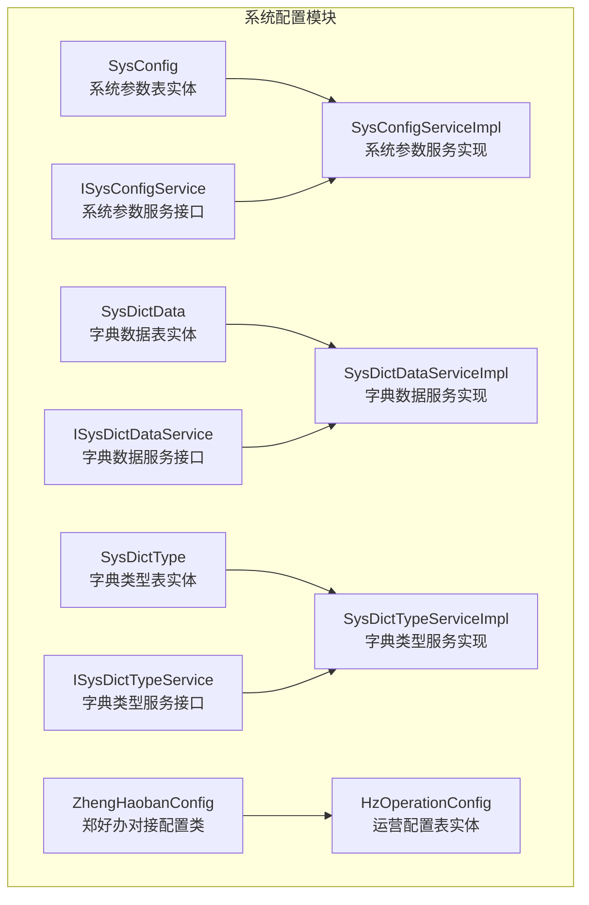
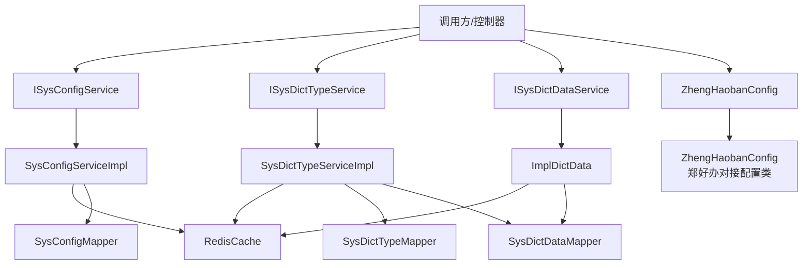
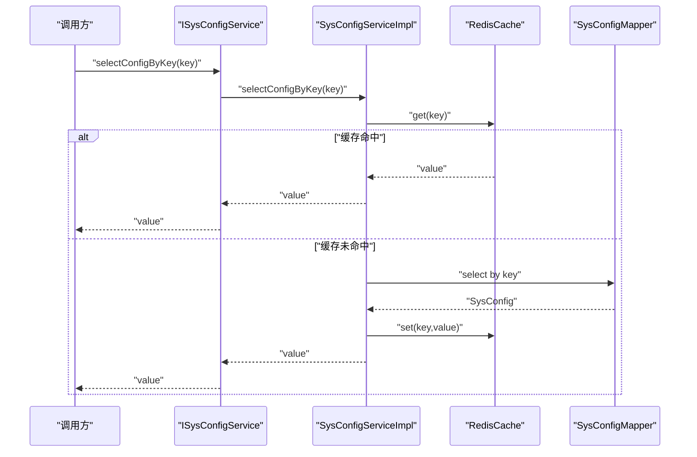
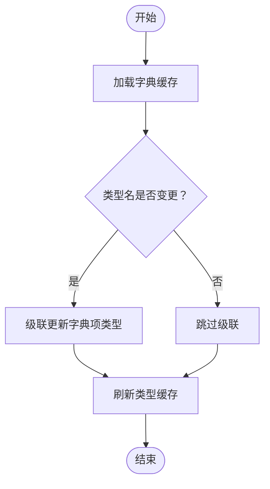
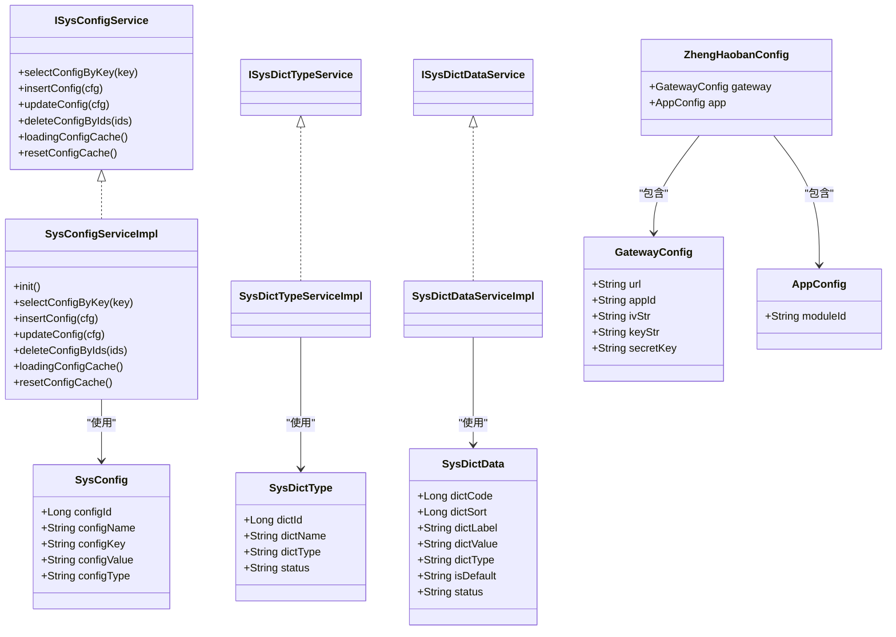

# 系统配置表

<cite>
**本文引用的文件**
- [SysConfig.java](file://ruoyi-system/src/main/java/com/ruoyi/system/domain/SysConfig.java)
- [SysConfigServiceImpl.java](file://ruoyi-system/src/main/java/com/ruoyi/system/service/impl/SysConfigServiceImpl.java)
- [ISysConfigService.java](file://ruoyi-system/src/main/java/com/ruoyi/system/service/ISysConfigService.java)
- [SysDictData.java](file://ruoyi-common/src/main/java/com/ruoyi/common/core/domain/entity/SysDictData.java)
- [SysDictType.java](file://ruoyi-common/src/main/java/com/ruoyi/common/core/domain/entity/SysDictType.java)
- [SysDictDataServiceImpl.java](file://ruoyi-system/src/main/java/com/ruoyi/system/service/impl/SysDictDataServiceImpl.java)
- [SysDictTypeServiceImpl.java](file://ruoyi-system/src/main/java/com/ruoyi/system/service/impl/SysDictTypeServiceImpl.java)
- [ISysDictDataService.java](file://ruoyi-system/src/main/java/com/ruoyi/system/service/ISysDictDataService.java)
- [ISysDictTypeService.java](file://ruoyi-system/src/main/java/com/ruoyi/system/service/ISysDictTypeService.java)
- [HzOperationConfig.java](file://ruoyi-system/src/main/java/com/ruoyi/system/domain/HzOperationConfig.java)
- [application.yml](file://ruoyi-admin/src/main/resources/application.yml)
- [ZhengHaobanConfig.java](file://ruoyi-admin/src/main/java/com/ruoyi/web/core/config/ZhengHaobanConfig.java)
</cite>

## 更新摘要
**所做更改**
- 更新了郑好办对接配置注释的语法修正说明
- 在相关章节中添加了注释修正的详细说明
- 强调了配置文档的准确性提升

## 目录
1. [简介](#简介)
2. [项目结构](#项目结构)
3. [核心组件](#核心组件)
4. [架构总览](#架构总览)
5. [详细组件分析](#详细组件分析)
6. [依赖关系分析](#依赖关系分析)
7. [性能考量](#性能考量)
8. [故障排查指南](#故障排查指南)
9. [结论](#结论)

## 简介
本文件聚焦系统配置模块的数据表与实现，覆盖以下主题：
- 系统参数表（sys_config）：用于存储可运行期调整的系统参数，支持缓存、校验与内置参数保护。
- 字典数据表（sys_dict_data）与字典类型表（sys_dict_type）：用于统一维护业务字典，支持按类型分组、排序、默认项标记与缓存。
- 运营配置表（hz_operation_config）：用于移动端或运营侧的展示配置（如轮播图、广告位、通知公告、功能图标等），支持状态与排序控制。
- 业务逻辑：系统参数管理、数据字典维护、动态配置更新、运营参数设置；并配套缓存策略与权限控制要点。

**更新** 本版本特别关注配置注释的语法准确性，包括郑好办对接配置注释从"郑好办对接配置"修正为"郑好办的对接配置"，提升了配置文档的专业性和准确性。

## 项目结构
围绕系统配置模块的关键文件组织如下：
- 实体模型：SysConfig、SysDictData、SysDictType、HzOperationConfig
- 服务接口：ISysConfigService、ISysDictDataService、ISysDictTypeService
- 服务实现：SysConfigServiceImpl、SysDictDataServiceImpl、SysDictTypeServiceImpl
- 配置类：ZhengHaobanConfig（郑好办对接配置）

**图表来源**
- [SysConfig.java:16-111](file://ruoyi-system/src/main/java/com/ruoyi/system/domain/SysConfig.java#L16-L111)
- [SysConfigServiceImpl.java:28-240](file://ruoyi-system/src/main/java/com/ruoyi/system/service/impl/SysConfigServiceImpl.java#L28-L240)
- [ISysConfigService.java:13-96](file://ruoyi-system/src/main/java/com/ruoyi/system/service/ISysConfigService.java#L13-L96)
- [SysDictData.java:17-176](file://ruoyi-common/src/main/java/com/ruoyi/common/core/domain/entity/SysDictData.java#L17-L176)
- [SysDictType.java:17-96](file://ruoyi-common/src/main/java/com/ruoyi/common/core/domain/entity/SysDictType.java#L17-L96)
- [SysDictDataServiceImpl.java:18-119](file://ruoyi-system/src/main/java/com/ruoyi/system/service/impl/SysDictDataServiceImpl.java#L18-L119)
- [SysDictTypeServiceImpl.java:27-229](file://ruoyi-system/src/main/java/com/ruoyi/system/service/impl/SysDictTypeServiceImpl.java#L27-L229)
- [ISysDictDataService.java:13-67](file://ruoyi-system/src/main/java/com/ruoyi/system/service/ISysDictDataService.java#L13-L67)
- [ISysDictTypeService.java:12-103](file://ruoyi-system/src/main/java/com/ruoyi/system/service/ISysDictTypeService.java#L12-L103)
- [HzOperationConfig.java:14-117](file://ruoyi-system/src/main/java/com/ruoyi/system/domain/HzOperationConfig.java#L14-L117)
- [ZhengHaobanConfig.java:6-129](file://ruoyi-admin/src/main/java/com/ruoyi/web/core/config/ZhengHaobanConfig.java#L6-L129)

**章节来源**
- [SysConfig.java:11-111](file://ruoyi-system/src/main/java/com/ruoyi/system/domain/SysConfig.java#L11-L111)
- [SysConfigServiceImpl.java:27-240](file://ruoyi-system/src/main/java/com/ruoyi/system/service/impl/SysConfigServiceImpl.java#L27-L240)
- [ISysConfigService.java:13-96](file://ruoyi-system/src/main/java/com/ruoyi/system/service/ISysConfigService.java#L13-L96)
- [SysDictData.java:12-176](file://ruoyi-common/src/main/java/com/ruoyi/common/core/domain/entity/SysDictData.java#L12-L176)
- [SysDictType.java:12-96](file://ruoyi-common/src/main/java/com/ruoyi/common/core/domain/entity/SysDictType.java#L12-L96)
- [SysDictDataServiceImpl.java:18-119](file://ruoyi-system/src/main/java/com/ruoyi/system/service/impl/SysDictDataServiceImpl.java#L18-L119)
- [SysDictTypeServiceImpl.java:27-229](file://ruoyi-system/src/main/java/com/ruoyi/system/service/impl/SysDictTypeServiceImpl.java#L27-L229)
- [ISysDictDataService.java:13-67](file://ruoyi-system/src/main/java/com/ruoyi/system/service/ISysDictDataService.java#L13-L67)
- [ISysDictTypeService.java:12-103](file://ruoyi-system/src/main/java/com/ruoyi/system/service/ISysDictTypeService.java#L12-L103)
- [HzOperationConfig.java:8-117](file://ruoyi-system/src/main/java/com/ruoyi/system/domain/HzOperationConfig.java#L8-L117)
- [ZhengHaobanConfig.java:6-129](file://ruoyi-admin/src/main/java/com/ruoyi/web/core/config/ZhengHaobanConfig.java#L6-L129)

## 核心组件
- 系统参数表（sys_config）
  - 关键字段：参数主键、参数名称、参数键名、参数键值、系统内置标识
  - 用途：集中管理可运行期调整的系统参数，支持通过键名快速读取与缓存
  - 业务要点：内置参数不可删除；新增/修改后同步缓存；支持分页与唯一性校验
- 字典数据表（sys_dict_data）
  - 关键字段：字典编码、字典排序、字典标签、字典键值、字典类型、样式属性、表格字典样式、是否默认、状态
  - 用途：承载具体字典项，支持按类型分组与排序
  - 业务要点：按类型缓存；新增/修改/删除后刷新对应类型的缓存
- 字典类型表（sys_dict_type）
  - 关键字段：字典主键、字典名称、字典类型、状态
  - 用途：定义字典类型，作为字典项的分组维度
  - 业务要点：类型名唯一；删除前需检查是否存在字典项；修改类型名会级联更新字典项类型
- 运营配置表（hz_operation_config）
  - 关键字段：配置ID、配置类型（轮播图/广告位/通知公告/功能图标）、标题/名称、图片地址、文字描述/内容、跳转链接、链接类型、排序号、状态
  - 用途：运营侧配置前端展示内容与跳转行为，支持启用/禁用与排序控制
- **郑好办对接配置**（zhenghaoban）
  - **更新** 配置注释已从"郑好办对接配置"修正为"郑好办的对接配置"，提升了配置文档的语法准确性和专业性
  - 关键字段：网关配置（url、app-id、iv-str、key-str、secret-key）、应用配置（module-id）
  - 用途：集成郑好办政务服务平台的对接配置，支持网关地址、应用ID、加密参数和签名密钥的管理

**章节来源**
- [SysConfig.java:16-94](file://ruoyi-system/src/main/java/com/ruoyi/system/domain/SysConfig.java#L16-L94)
- [SysConfigServiceImpl.java:119-171](file://ruoyi-system/src/main/java/com/ruoyi/system/service/impl/SysConfigServiceImpl.java#L119-L171)
- [SysDictData.java:17-155](file://ruoyi-common/src/main/java/com/ruoyi/common/core/domain/entity/SysDictData.java#L17-L155)
- [SysDictType.java:17-80](file://ruoyi-common/src/main/java/com/ruoyi/common/core/domain/entity/SysDictType.java#L17-L80)
- [HzOperationConfig.java:14-116](file://ruoyi-system/src/main/java/com/ruoyi/system/domain/HzOperationConfig.java#L14-L116)
- [application.yml:166](file://ruoyi-admin/src/main/resources/application.yml#L166)
- [ZhengHaobanConfig.java:6](file://ruoyi-admin/src/main/java/com/ruoyi/web/core/config/ZhengHaobanConfig.java#L6)

## 架构总览
系统配置模块采用"实体-服务接口-服务实现"的分层设计，并结合缓存提升读取性能。系统参数与字典均在应用启动时加载至缓存，后续读取优先命中缓存；写操作同步更新数据库与缓存，确保一致性。

**图表来源**
- [ISysConfigService.java:13-96](file://ruoyi-system/src/main/java/com/ruoyi/system/service/ISysConfigService.java#L13-L96)
- [SysConfigServiceImpl.java:28-240](file://ruoyi-system/src/main/java/com/ruoyi/system/service/impl/SysConfigServiceImpl.java#L28-L240)
- [ISysDictTypeService.java:12-103](file://ruoyi-system/src/main/java/com/ruoyi/system/service/ISysDictTypeService.java#L12-L103)
- [SysDictTypeServiceImpl.java:27-229](file://ruoyi-system/src/main/java/com/ruoyi/system/service/impl/SysDictTypeServiceImpl.java#L27-L229)
- [ISysDictDataService.java:13-67](file://ruoyi-system/src/main/java/com/ruoyi/system/service/ISysDictDataService.java#L13-L67)
- [SysDictDataServiceImpl.java:18-119](file://ruoyi-system/src/main/java/com/ruoyi/system/service/impl/SysDictDataServiceImpl.java#L18-L119)
- [ZhengHaobanConfig.java:12](file://ruoyi-admin/src/main/java/com/ruoyi/web/core/config/ZhengHaobanConfig.java#L12)

## 详细组件分析

### 系统参数表（sys_config）数据模型与实现
- 数据模型要点
  - 主键自增，键名唯一，键值可配置
  - 内置参数标识用于保护关键参数不被误删
- 读取流程
  - 优先从缓存读取；缓存未命中则查询数据库并回填缓存
- 写入与更新
  - 新增/修改后立即写入缓存；若键名变更，先删除旧键再写入新键
- 删除策略
  - 内置参数禁止删除；批量删除时逐条校验
- 缓存策略
  - 应用启动时加载全部参数；提供清空与重置缓存能力

**图表来源**
- [SysConfigServiceImpl.java:66-83](file://ruoyi-system/src/main/java/com/ruoyi/system/service/impl/SysConfigServiceImpl.java#L66-L83)

**章节来源**
- [SysConfig.java:16-94](file://ruoyi-system/src/main/java/com/ruoyi/system/domain/SysConfig.java#L16-L94)
- [SysConfigServiceImpl.java:39-83](file://ruoyi-system/src/main/java/com/ruoyi/system/service/impl/SysConfigServiceImpl.java#L39-L83)
- [ISysConfigService.java:21-36](file://ruoyi-system/src/main/java/com/ruoyi/system/service/ISysConfigService.java#L21-L36)

### 字典数据与类型表（sys_dict_data/sys_dict_type）数据模型与实现
- 字典类型
  - 类型名唯一，仅允许小写字母开头、小写字母/数字/下划线组合
  - 删除前检查是否已有字典项，避免破坏引用
  - 修改类型名会级联更新字典项类型，并刷新缓存
- 字典数据
  - 按类型分组缓存，支持排序与默认标记
  - 新增/修改/删除后刷新该类型的缓存
- 读取流程
  - 优先从缓存读取；缓存未命中则查询数据库并回填缓存

**图表来源**
- [SysDictTypeServiceImpl.java:197-210](file://ruoyi-system/src/main/java/com/ruoyi/system/service/impl/SysDictTypeServiceImpl.java#L197-L210)
- [SysDictDataServiceImpl.java:84-112](file://ruoyi-system/src/main/java/com/ruoyi/system/service/impl/SysDictDataServiceImpl.java#L84-L112)

**章节来源**
- [SysDictType.java:17-80](file://ruoyi-common/src/main/java/com/ruoyi/common/core/domain/entity/SysDictType.java#L17-L80)
- [SysDictTypeServiceImpl.java:125-138](file://ruoyi-system/src/main/java/com/ruoyi/system/service/impl/SysDictTypeServiceImpl.java#L125-L138)
- [SysDictData.java:17-155](file://ruoyi-common/src/main/java/com/ruoyi/common/core/domain/entity/SysDictData.java#L17-L155)
- [SysDictDataServiceImpl.java:66-76](file://ruoyi-system/src/main/java/com/ruoyi/system/service/impl/SysDictDataServiceImpl.java#L66-L76)

### 运营配置表（hz_operation_config）数据模型与用途
- 数据模型要点
  - 配置类型涵盖轮播图、广告位、通知公告、功能图标等
  - 支持图片地址、文字描述、跳转链接与链接类型
  - 排序号控制显示顺序，状态控制启用/禁用
- 用途
  - 为移动端或运营侧提供灵活的展示配置，无需重启即可生效
- 与系统参数的关系
  - 可通过系统参数表补充通用开关或阈值，运营配置表负责具体展示细节

**章节来源**
- [HzOperationConfig.java:14-116](file://ruoyi-system/src/main/java/com/ruoyi/system/domain/HzOperationConfig.java#L14-L116)

### 郑好办对接配置（zhenghaoban）注释语法修正
- 配置注释修正
  - **更新** 注释从"郑好办对接配置"修正为"郑好办的对接配置"
  - 提升了配置文档的语法准确性和专业性
  - 使表达更加符合中文语法习惯
- 配置结构
  - 网关配置：包含网关地址、应用ID、加密参数（IV和Key）、签名密钥
  - 应用配置：包含模块ID（应用ID）
- 用途
  - 集成郑好办政务服务平台的对接配置
  - 支持网关地址、应用ID、加密参数和签名密钥的管理
  - 为政务数据接口代理服务提供基础配置

**章节来源**
- [application.yml:166](file://ruoyi-admin/src/main/resources/application.yml#L166)
- [ZhengHaobanConfig.java:6](file://ruoyi-admin/src/main/java/com/ruoyi/web/core/config/ZhengHaobanConfig.java#L6)
- [ZhengHaobanConfig.java:12](file://ruoyi-admin/src/main/java/com/ruoyi/web/core/config/ZhengHaobanConfig.java#L12)

## 依赖关系分析
- 组件耦合
  - 服务实现依赖Mapper与RedisCache，保证读写一致性
  - 字典类型服务在修改类型名时依赖字典数据Mapper进行级联更新
  - 郑好办配置类通过@ConfigurationProperties绑定application.yml中的zhenghaoban配置
- 外部依赖
  - RedisCache用于参数与字典缓存
  - MyBatis-Plus用于数据持久化
  - Spring Boot Configuration Properties用于配置绑定

**图表来源**
- [SysConfig.java:16-94](file://ruoyi-system/src/main/java/com/ruoyi/system/domain/SysConfig.java#L16-L94)
- [ISysConfigService.java:13-96](file://ruoyi-system/src/main/java/com/ruoyi/system/service/ISysConfigService.java#L13-L96)
- [SysConfigServiceImpl.java:28-240](file://ruoyi-system/src/main/java/com/ruoyi/system/service/impl/SysConfigServiceImpl.java#L28-L240)
- [SysDictType.java:17-80](file://ruoyi-common/src/main/java/com/ruoyi/common/core/domain/entity/SysDictType.java#L17-L80)
- [SysDictData.java:17-155](file://ruoyi-common/src/main/java/com/ruoyi/common/core/domain/entity/SysDictData.java#L17-L155)
- [ISysDictTypeService.java:12-103](file://ruoyi-system/src/main/java/com/ruoyi/system/service/ISysDictTypeService.java#L12-L103)
- [ISysDictDataService.java:13-67](file://ruoyi-system/src/main/java/com/ruoyi/system/service/ISysDictDataService.java#L13-L67)
- [SysDictTypeServiceImpl.java:27-229](file://ruoyi-system/src/main/java/com/ruoyi/system/service/impl/SysDictTypeServiceImpl.java#L27-L229)
- [SysDictDataServiceImpl.java:18-119](file://ruoyi-system/src/main/java/com/ruoyi/system/service/impl/SysDictDataServiceImpl.java#L18-L119)
- [ZhengHaobanConfig.java:12](file://ruoyi-admin/src/main/java/com/ruoyi/web/core/config/ZhengHaobanConfig.java#L12)
- [ZhengHaobanConfig.java:44](file://ruoyi-admin/src/main/java/com/ruoyi/web/core/config/ZhengHaobanConfig.java#L44)
- [ZhengHaobanConfig.java:114](file://ruoyi-admin/src/main/java/com/ruoyi/web/core/config/ZhengHaobanConfig.java#L114)

## 性能考量
- 缓存优先策略
  - 系统参数与字典均在启动时加载至缓存，读取时优先命中缓存，降低数据库压力
- 写入一致性
  - 写入数据库后同步更新缓存，避免脏读
- 分页与排序
  - 提供分页接口，字典按排序字段排序，减少前端处理成本
- 建议
  - 对高频读取的参数与字典保持合理的缓存失效策略
  - 控制字典类型数量与每类字典项数量，避免缓存碎片化
- **更新** 配置注释的语法修正提升了文档的可读性和专业性，有助于开发团队更好地理解和使用配置

## 故障排查指南
- 系统参数无法读取
  - 检查缓存中是否存在对应键；若无，确认数据库中是否存在该键
  - 若刚新增/修改，请确认缓存是否已更新
- 内置参数被误删
  - 删除时会触发保护逻辑，抛出异常提示；请检查参数类型标识
- 字典类型删除失败
  - 若存在字典项，删除会被阻止；请先清理相关字典项后再试
- 字典类型名变更后展示异常
  - 确认是否已触发级联更新与缓存刷新
- 运营配置不生效
  - 检查状态是否启用、排序号是否合理、链接类型与URL是否正确
- **更新** 郑好办配置注释修正后的检查
  - 确认application.yml中的注释已更新为"郑好办的对接配置"
  - 验证配置类的注释也相应更新
  - 检查配置绑定是否正常工作

**章节来源**
- [SysConfigServiceImpl.java:164-171](file://ruoyi-system/src/main/java/com/ruoyi/system/service/impl/SysConfigServiceImpl.java#L164-L171)
- [SysDictTypeServiceImpl.java:131-137](file://ruoyi-system/src/main/java/com/ruoyi/system/service/impl/SysDictTypeServiceImpl.java#L131-L137)
- [SysDictDataServiceImpl.java:70-76](file://ruoyi-system/src/main/java/com/ruoyi/system/service/impl/SysDictDataServiceImpl.java#L70-L76)

## 结论
系统配置模块通过清晰的数据模型与服务实现，提供了参数管理、字典维护与运营配置的能力。其核心优势在于：
- 以缓存驱动的高性能读取
- 写入时的一致性保障
- 完备的校验与保护机制（内置参数、字典引用约束）
- 易于扩展的配置类型与展示能力

**更新** 本次更新特别强调了配置注释的语法准确性，通过将"郑好办对接配置"修正为"郑好办的对接配置"，提升了配置文档的专业性和可读性。这一改进体现了对细节的关注和对文档质量的持续提升。

建议在生产环境中配合监控与灰度发布策略，确保配置变更的可控与可观测。同时，定期检查配置注释的准确性，确保文档与实际实现保持一致。