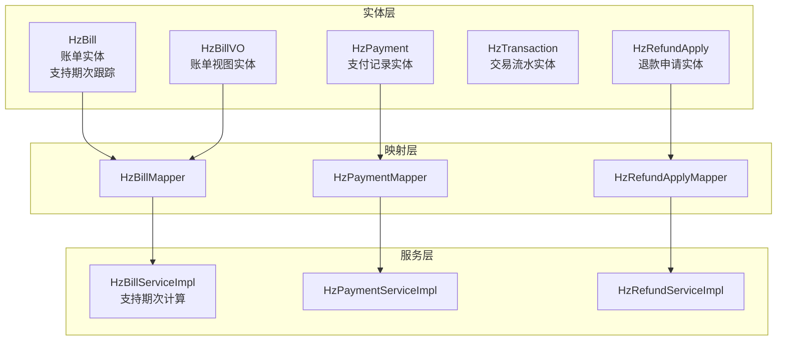
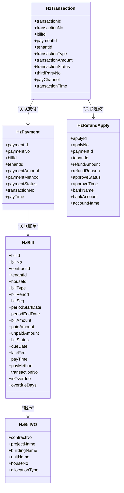
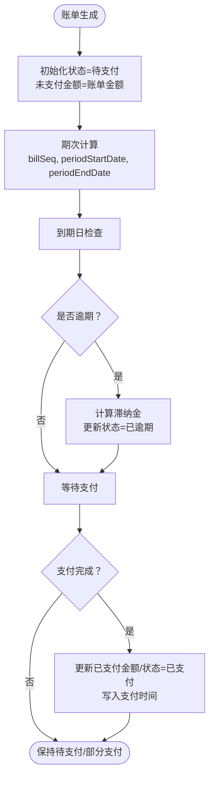
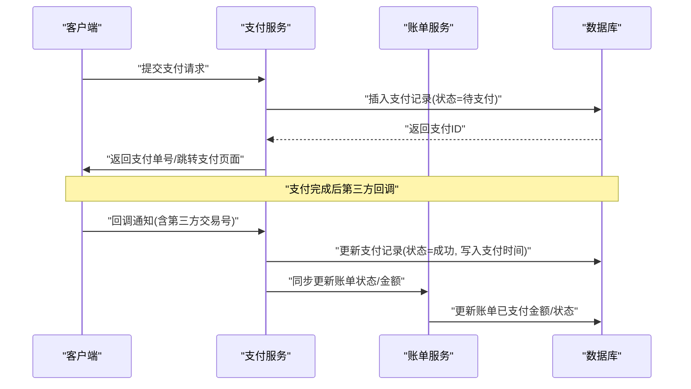
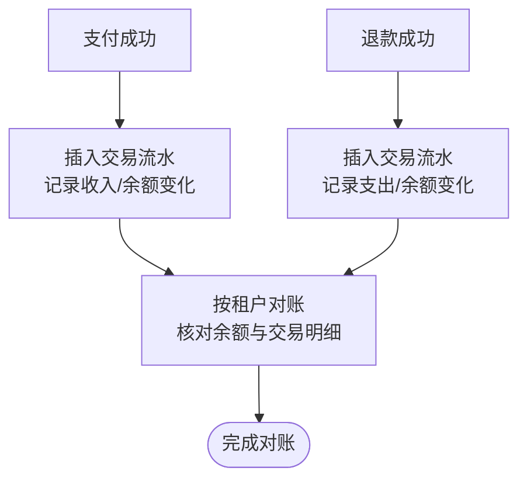
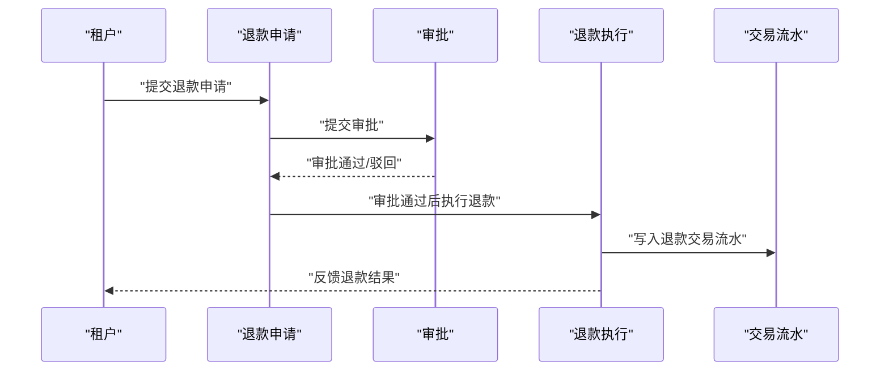
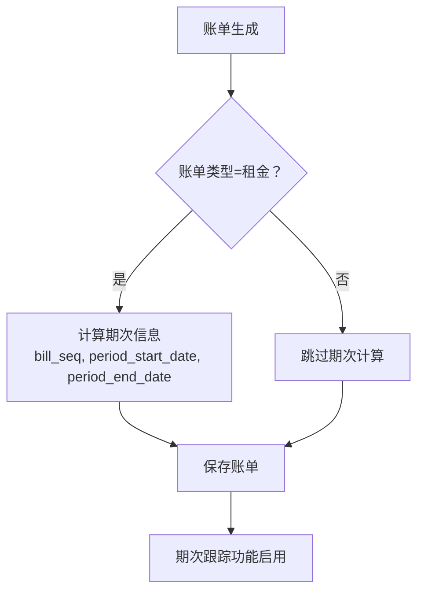
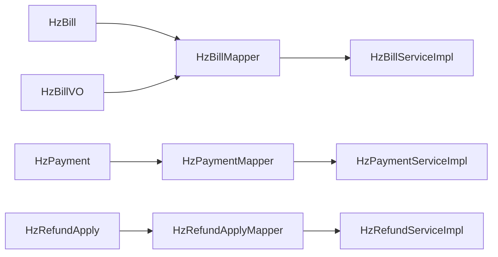

# 账单缴费表

<cite>
**本文档引用的文件**
- [HzBill.java](file://ruoyi-system/src/main/java/com/ruoyi/system/domain/HzBill.java)
- [HzBillVO.java](file://ruoyi-system/src/main/java/com/ruoyi/system/domain/HzBillVO.java)
- [HzBillMapper.java](file://ruoyi-system/src/main/java/com/ruoyi/system/mapper/HzBillMapper.java)
- [HzBillMapper.xml](file://ruoyi-system/src/main/resources/mapper/system/HzBillMapper.xml)
- [HzBillServiceImpl.java](file://ruoyi-system/src/main/java/com/ruoyi/system/service/impl/HzBillServiceImpl.java)
- [HzPayment.java](file://ruoyi-system/src/main/java/com/ruoyi/system/domain/HzPayment.java)
- [HzPaymentMapper.java](file://ruoyi-system/src/main/java/com/ruoyi/system/mapper/HzPaymentMapper.java)
- [HzTransaction.java](file://ruoyi-system/src/main/java/com/ruoyi/system/domain/HzTransaction.java)
- [HzRefundApply.java](file://ruoyi-system/src/main/java/com/ruoyi/system/domain/HzRefundApply.java)
- [HzRefundApplyMapper.java](file://ruoyi-system/src/main/java/com/ruoyi/system/mapper/HzRefundApplyMapper.java)
- [05-账单缴费.md](file://docs/数据字典/05-账单缴费.md)
</cite>

## 更新摘要
**变更内容**
- 新增期次跟踪功能字段：bill_seq、period_start_date、period_end_date
- 更新账单表结构以支持租金等周期性账单的期次管理
- 增强账单生命周期管理，支持期次计算和跟踪
- 完善账单查询和统计功能，支持按期次维度分析

## 目录
1. [简介](#简介)
2. [项目结构](#项目结构)
3. [核心组件](#核心组件)
4. [架构总览](#架构总览)
5. [详细组件分析](#详细组件分析)
6. [期次跟踪功能](#期次跟踪功能)
7. [依赖关系分析](#依赖关系分析)
8. [性能考虑](#性能考虑)
9. [故障排查指南](#故障排查指南)
10. [结论](#结论)
11. [附录](#附录)

## 简介
本文件面向账单缴费模块，系统化梳理并说明以下核心财务数据表的设计与用途：
- 账单表 hz_bill：记录租户在特定周期内的费用明细与状态，现已支持期次跟踪功能
- 支付记录表 hz_payment：记录每次支付的流水与状态
- 交易流水表 hz_transaction：统一记账的交易流水，支持对账
- 退款申请表 hz_refund_apply：记录退款申请与审批流程

同时，文档覆盖账单生命周期管理（生成、发送、支付、核销、退款等环节），并给出数据模型、处理流程、对账机制与常见问题排查建议。特别关注新增的期次跟踪功能，支持租金等周期性账单的精细化管理。

## 项目结构
围绕账单缴费模块的核心文件组织如下：
- 实体类：HzBill、HzBillVO、HzPayment、HzTransaction、HzRefundApply
- 映射器：HzBillMapper、HzPaymentMapper、HzRefundApplyMapper
- 服务实现：HzBillServiceImpl、HzPaymentServiceImpl、HzRefundServiceImpl
- 数据字典：05-账单缴费.md 提供标准表结构定义

**图表来源**
- [HzBill.java:19-390](file://ruoyi-system/src/main/java/com/ruoyi/system/domain/HzBill.java#L19-L390)
- [HzBillMapper.java:19-59](file://ruoyi-system/src/main/java/com/ruoyi/system/mapper/HzBillMapper.java#L19-L59)
- [HzBillServiceImpl.java:29-216](file://ruoyi-system/src/main/java/com/ruoyi/system/service/impl/HzBillServiceImpl.java#L29-L216)

**章节来源**
- [HzBill.java:19-390](file://ruoyi-system/src/main/java/com/ruoyi/system/domain/HzBill.java#L19-L390)
- [HzBillMapper.java:19-59](file://ruoyi-system/src/main/java/com/ruoyi/system/mapper/HzBillMapper.java#L19-L59)
- [HzBillMapper.xml:1-273](file://ruoyi-system/src/main/resources/mapper/system/HzBillMapper.xml#L1-L273)
- [HzBillServiceImpl.java:29-216](file://ruoyi-system/src/main/java/com/ruoyi/system/service/impl/HzBillServiceImpl.java#L29-L216)

## 核心组件
本节概述四大表的职责与关键字段含义，并结合服务层行为说明其在业务中的作用。

- 账单表 hz_bill
  - 职责：记录租户在某周期内的费用明细、金额、状态、逾期情况与支付信息，现支持期次跟踪
  - 关键字段：账单编号、合同ID、租户ID、房源ID、账单类型、账单周期、期数序号、期次起止日期、账单金额、已支付金额、未支付金额、应付日期、滞纳金、账单状态、支付方式、交易流水号等
  - 生命周期：默认生成时状态为"待支付"，逾期校验后可能更新为"已逾期"，支付完成后更新为"已支付"或"部分支付"
  - **新增功能**：期次跟踪，支持租金等周期性账单的期次管理和计算

- 支付记录表 hz_payment
  - 职责：记录每次支付的流水号、金额、渠道、状态、回调信息与时间戳
  - 关键字段：支付编号、账单ID、租户信息、支付金额、支付方式、第三方交易号、支付状态、支付时间、回调数据等
  - 生命周期：默认"待支付"，支付成功后更新状态并写入支付时间

- 交易流水表 hz_transaction
  - 职责：统一记账维度的流水，便于对账与余额计算
  - 关键字段：流水号、业务类型（缴费/退款）、业务ID、租户ID、交易金额、交易前/后余额、交易时间、交易状态等
  - 用途：支持按租户维度对账，确保收入/支出平衡

- 退款申请表 hz_refund_apply
  - 职责：记录退款申请、审批与退款执行过程的关键信息
  - 关键字段：申请编号、支付ID、租户信息、退款金额、退款原因、审批状态、审批人、审批时间、银行账户信息等
  - 与账单/支付的关系：退款通常基于已支付的账单与支付记录发起

**章节来源**
- [05-账单缴费.md:5-34](file://docs/数据字典/05-账单缴费.md#L5-L34)
- [05-账单缴费.md:37-63](file://docs/数据字典/05-账单缴费.md#L37-L63)
- [05-账单缴费.md:123-146](file://docs/数据字典/05-账单缴费.md#L123-L146)
- [05-账单缴费.md:66-93](file://docs/数据字典/05-账单缴费.md#L66-L93)

## 架构总览
账单缴费模块采用经典的分层架构：实体层负责数据模型，映射层负责数据库交互，服务层负责业务逻辑与流程编排。新增的期次跟踪功能通过HzBill实体和HzBillMapper实现。

**图表来源**
- [HzBill.java:23-140](file://ruoyi-system/src/main/java/com/ruoyi/system/domain/HzBill.java#L23-L140)
- [HzBillVO.java:10-85](file://ruoyi-system/src/main/java/com/ruoyi/system/domain/HzBillVO.java#L10-L85)
- [HzPayment.java:22-72](file://ruoyi-system/src/main/java/com/ruoyi/system/domain/HzPayment.java#L22-L72)
- [HzTransaction.java:22-72](file://ruoyi-system/src/main/java/com/ruoyi/system/domain/HzTransaction.java#L22-L72)
- [HzRefundApply.java:21-70](file://ruoyi-system/src/main/java/com/ruoyi/system/domain/HzRefundApply.java#L21-L70)

## 详细组件分析

### 账单表 hz_bill
- 设计要点
  - 主键自增，账单编号唯一且可生成
  - 账单金额、已支付金额、未支付金额三者动态维护
  - 账单状态涵盖"待支付/已支付/部分支付/已逾期/已关闭"
  - 逾期标识与滞纳金计算逻辑由服务层驱动
  - **新增期次跟踪**：支持租金等周期性账单的期次管理和计算
- 生命周期
  - 生成：插入时默认状态为"待支付"，未支付金额初始化为账单金额
  - 逾期：定时任务扫描未支付/部分支付账单，超过应付日期则标记为"已逾期"，并计算滞纳金
  - 支付：支付完成后根据实付金额更新状态与时间
  - 关闭：业务上可根据策略将不再需要的账单置为"已关闭"
- 关键字段与约束
  - 账单类型枚举：押金、租金、水费、电费、燃气费、物业费、其他
  - 状态枚举：0待支付、1已支付、2部分支付、3已逾期、4已关闭
  - 逾期字段：是否逾期、逾期天数、滞纳金
  - **期次字段**：期数序号、期次起始日期、期次结束日期

**图表来源**
- [HzBillServiceImpl.java:116-132](file://ruoyi-system/src/main/java/com/ruoyi/system/service/impl/HzBillServiceImpl.java#L116-L132)
- [HzBillServiceImpl.java:164-198](file://ruoyi-system/src/main/java/com/ruoyi/system/service/impl/HzBillServiceImpl.java#L164-L198)
- [HzBillServiceImpl.java:153-162](file://ruoyi-system/src/main/java/com/ruoyi/system/service/impl/HzBillServiceImpl.java#L153-L162)

**章节来源**
- [HzBill.java:68-78](file://ruoyi-system/src/main/java/com/ruoyi/system/domain/HzBill.java#L68-L78)
- [HzBillServiceImpl.java:116-132](file://ruoyi-system/src/main/java/com/ruoyi/system/service/impl/HzBillServiceImpl.java#L116-L132)
- [HzBillServiceImpl.java:164-198](file://ruoyi-system/src/main/java/com/ruoyi/system/service/impl/HzBillServiceImpl.java#L164-L198)
- [HzBillServiceImpl.java:153-162](file://ruoyi-system/src/main/java/com/ruoyi/system/service/impl/HzBillServiceImpl.java#L153-L162)

### 支付记录表 hz_payment
- 设计要点
  - 支付编号唯一，支持按账单ID查询历史支付记录
  - 支付状态涵盖"待支付/支付成功/支付失败/已退款"
  - 支持记录第三方交易号与回调数据，便于对账与重试
- 生命周期
  - 生成：插入时默认状态为"待支付"，若未指定支付编号则自动生成
  - 支付：收到支付回调后更新状态与支付时间
  - 退款：退款完成后状态更新为"已退款"
- 关键字段与约束
  - 支付方式：如支付宝、微信、银行卡等
  - 支付状态枚举：0待支付、1成功、2失败、3已退款
  - 关联字段：账单ID、租户ID、交易流水号

**图表来源**
- [HzPayment.java:22-72](file://ruoyi-system/src/main/java/com/ruoyi/system/domain/HzPayment.java#L22-L72)
- [HzPaymentServiceImpl.java:61-69](file://ruoyi-system/src/main/java/com/ruoyi/system/service/impl/HzPaymentServiceImpl.java#L61-L69)
- [HzPaymentServiceImpl.java:86-95](file://ruoyi-system/src/main/java/com/ruoyi/system/service/impl/HzPaymentServiceImpl.java#L86-L95)
- [HzBillServiceImpl.java:153-162](file://ruoyi-system/src/main/java/com/ruoyi/system/service/impl/HzBillServiceImpl.java#L153-L162)

**章节来源**
- [HzPayment.java:22-72](file://ruoyi-system/src/main/java/com/ruoyi/system/domain/HzPayment.java#L22-L72)
- [HzPaymentServiceImpl.java:61-69](file://ruoyi-system/src/main/java/com/ruoyi/system/service/impl/HzPaymentServiceImpl.java#L61-L69)
- [HzPaymentServiceImpl.java:86-95](file://ruoyi-system/src/main/java/com/ruoyi/system/service/impl/HzPaymentServiceImpl.java#L86-L95)

### 交易流水表 hz_transaction
- 设计要点
  - 统一记账维度，支持按租户、业务类型、业务ID进行查询
  - 交易前/后余额字段便于对账与余额校验
  - 交易状态区分"成功/失败"，失败原因可记录
- 对账机制
  - 以租户为维度，按交易时间排序，核对交易金额与余额变化
  - 可通过业务类型与业务ID快速定位对应支付或退款记录

**图表来源**
- [05-账单缴费.md:123-146](file://docs/数据字典/05-账单缴费.md#L123-L146)

**章节来源**
- [HzTransaction.java:22-72](file://ruoyi-system/src/main/java/com/ruoyi/system/domain/HzTransaction.java#L22-L72)
- [05-账单缴费.md:123-146](file://docs/数据字典/05-账单缴费.md#L123-L146)

### 退款申请表 hz_refund_apply
- 设计要点
  - 退款申请与审批流程分离，支持审批状态变更
  - 记录银行账户信息，便于退款打款
  - 与支付记录关联，确保退款基于已发生的支付
- 业务流程
  - 申请：填写退款金额、原因与账户信息
  - 审批：审批人审核通过或驳回
  - 执行：审批通过后触发退款流程，更新退款状态与时间

**图表来源**
- [HzRefundApply.java:21-70](file://ruoyi-system/src/main/java/com/ruoyi/system/domain/HzRefundApply.java#L21-L70)
- [05-账单缴费.md:66-93](file://docs/数据字典/05-账单缴费.md#L66-L93)

**章节来源**
- [HzRefundApply.java:21-70](file://ruoyi-system/src/main/java/com/ruoyi/system/domain/HzRefundApply.java#L21-L70)
- [05-账单缴费.md:66-93](file://docs/数据字典/05-账单缴费.md#L66-L93)

## 期次跟踪功能

### 功能概述
期次跟踪功能是本次更新的核心改进，专门针对租金等周期性账单设计，支持以下能力：
- **期数序号管理**：为每个账单分配唯一的期数序号（如第1期、第2期等）
- **期次时间范围**：精确记录每期的起始日期和结束日期
- **周期性账单支持**：自动计算账单的期次信息，便于财务对账和分析

### 数据结构增强
新增的期次相关字段：

| 字段名 | 类型 | 说明 | 示例 |
|--------|------|------|------|
| bill_seq | Integer | 期数序号 | 1, 2, 3... |
| period_start_date | String | 本期起始日期 | "2025-01-01" |
| period_end_date | String | 本期结束日期 | "2025-01-31" |

### 期次计算逻辑
期次跟踪功能通过HzBillServiceImpl中的期次计算方法实现：

**图表来源**
- [HzBillServiceImpl.java:116-132](file://ruoyi-system/src/main/java/com/ruoyi/system/service/impl/HzBillServiceImpl.java#L116-L132)

### 查询和统计功能
HzBillMapper通过MyBatis映射实现了期次相关的查询功能：

- **期次维度查询**：支持按期数序号、期次时间范围进行查询
- **期次统计分析**：支持按期次维度进行财务统计和报表生成
- **期次对账支持**：为财务对账提供精确的期次信息

**章节来源**
- [HzBill.java:68-78](file://ruoyi-system/src/main/java/com/ruoyi/system/domain/HzBill.java#L68-L78)
- [HzBillMapper.xml:18-20](file://ruoyi-system/src/main/resources/mapper/system/HzBillMapper.xml#L18-L20)
- [HzBillServiceImpl.java:116-132](file://ruoyi-system/src/main/java/com/ruoyi/system/service/impl/HzBillServiceImpl.java#L116-L132)

## 依赖关系分析
- 实体与映射器
  - 各实体均通过MyBatis-Plus的BaseMapper进行持久化操作
  - 映射器承担SQL查询与分页能力，服务层通过Mapper完成数据访问
  - **新增HzBillVO**：继承HzBill，扩展了合同、项目、房源等关联信息
- 服务层与业务
  - 账单服务负责账单状态与逾期计算，现支持期次跟踪
  - 支付服务负责支付状态与编号生成
  - 退款服务负责退款申请的查询与展示（当前版本主要面向退租场景）

**图表来源**
- [HzBillMapper.java:19-59](file://ruoyi-system/src/main/java/com/ruoyi/system/mapper/HzBillMapper.java#L19-L59)
- [HzPaymentMapper.java:13-15](file://ruoyi-system/src/main/java/com/ruoyi/system/mapper/HzPaymentMapper.java#L13-L15)
- [HzRefundApplyMapper.java:14-24](file://ruoyi-system/src/main/java/com/ruoyi/system/mapper/HzRefundApplyMapper.java#L14-L24)

**章节来源**
- [HzBillMapper.java:19-59](file://ruoyi-system/src/main/java/com/ruoyi/system/mapper/HzBillMapper.java#L19-L59)
- [HzPaymentMapper.java:13-15](file://ruoyi-system/src/main/java/com/ruoyi/system/mapper/HzPaymentMapper.java#L13-L15)
- [HzRefundApplyMapper.java:14-24](file://ruoyi-system/src/main/java/com/ruoyi/system/mapper/HzRefundApplyMapper.java#L14-L24)

## 性能考虑
- 查询优化
  - 账单与支付查询广泛使用Lambda条件构造器，建议在常用查询字段（如账单编号、租户ID、合同ID、账单状态、支付状态、期数序号）建立索引
  - 分页查询使用Page对象，避免一次性加载大量数据
  - **期次查询优化**：为bill_seq、period_start_date、period_end_date建立复合索引
- 事务与并发
  - 支付回调与账单状态更新应处于同一事务，保证一致性
  - 退款审批与执行需加锁或幂等控制，避免重复退款
  - **期次计算并发控制**：期次跟踪功能需要考虑并发场景下的期数序号生成
- 对账效率
  - 交易流水按租户ID+时间排序，建议在该组合上建立索引以提升对账查询性能
  - **期次对账优化**：期次跟踪功能支持按期次维度的快速对账

## 故障排查指南
- 常见问题
  - 账单未按时逾期：检查定时任务是否运行，确认账单应付日期格式与解析逻辑
  - 支付回调未生效：核对回调参数完整性与签名验证；检查支付记录状态是否正确更新
  - 交易流水不平：逐笔核对交易金额、余额变化与业务类型，确认是否存在漏记或重复记账
  - 退款申请无法审批：检查审批状态枚举值与审批流程是否一致
  - **期次跟踪异常**：检查期数序号生成逻辑，确认期次起止日期计算是否正确
- 排查步骤
  - 核对账单状态与逾期天数计算逻辑
  - 核对支付记录与账单的关联关系与状态流转
  - 核对交易流水的业务类型与业务ID是否指向正确的支付或退款记录
  - 核对退款申请的审批状态与银行账户信息
  - **核对期次信息**：检查bill_seq、period_start_date、period_end_date字段的正确性

**章节来源**
- [HzBillServiceImpl.java:164-198](file://ruoyi-system/src/main/java/com/ruoyi/system/service/impl/HzBillServiceImpl.java#L164-L198)
- [HzPaymentServiceImpl.java:86-95](file://ruoyi-system/src/main/java/com/ruoyi/system/service/impl/HzPaymentServiceImpl.java#L86-L95)
- [05-账单缴费.md:123-146](file://docs/数据字典/05-账单缴费.md#L123-L146)

## 结论
账单缴费模块通过清晰的表结构与服务层编排，实现了从账单生成、支付处理到退款与对账的完整闭环。本次更新的期次跟踪功能进一步增强了系统对周期性账单（特别是租金）的精细化管理能力。建议在生产环境中完善索引、事务与幂等控制，并持续优化对账流程与异常处理，以保障财务数据的准确性与时效性。

## 附录
- 表结构速览（摘自数据字典）
  - 账单表 hz_bill：包含账单编号、类型、周期、期次信息、金额、状态、逾期与支付信息等字段
  - 支付记录表 hz_payment：包含支付编号、金额、方式、状态、第三方交易号与回调数据等字段
  - 交易流水表 hz_transaction：包含流水号、业务类型与ID、租户ID、金额与余额、时间与状态等字段
  - 退款申请表 hz_refund_apply：包含申请编号、支付ID、租户信息、退款金额与审批状态等字段

**章节来源**
- [05-账单缴费.md:5-34](file://docs/数据字典/05-账单缴费.md#L5-L34)
- [05-账单缴费.md:37-63](file://docs/数据字典/05-账单缴费.md#L37-L63)
- [05-账单缴费.md:123-146](file://docs/数据字典/05-账单缴费.md#L123-L146)
- [05-账单缴费.md:66-93](file://docs/数据字典/05-账单缴费.md#L66-L93)