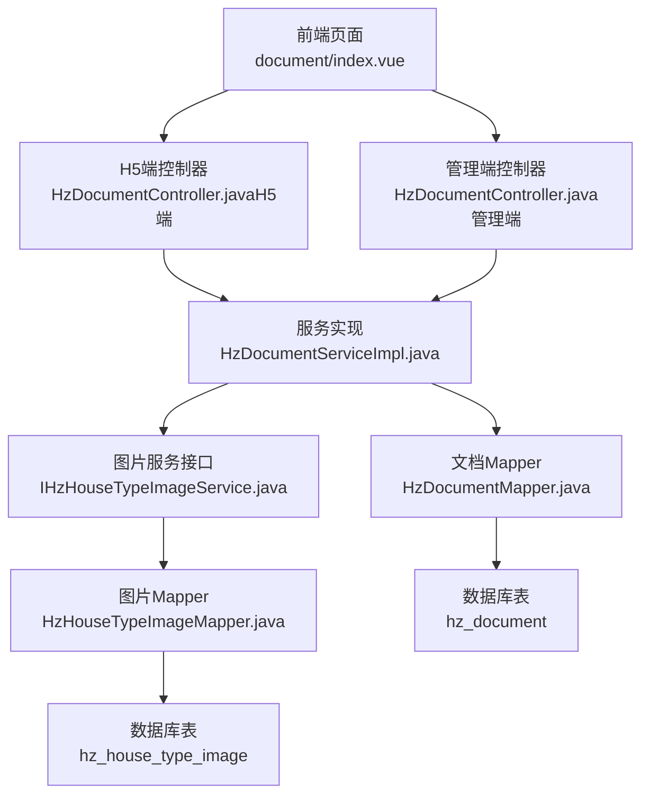
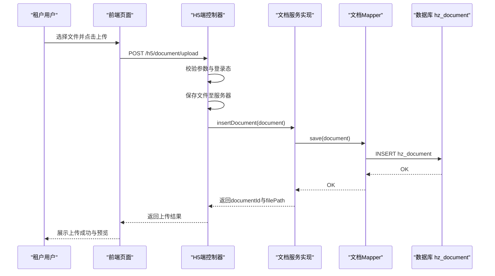
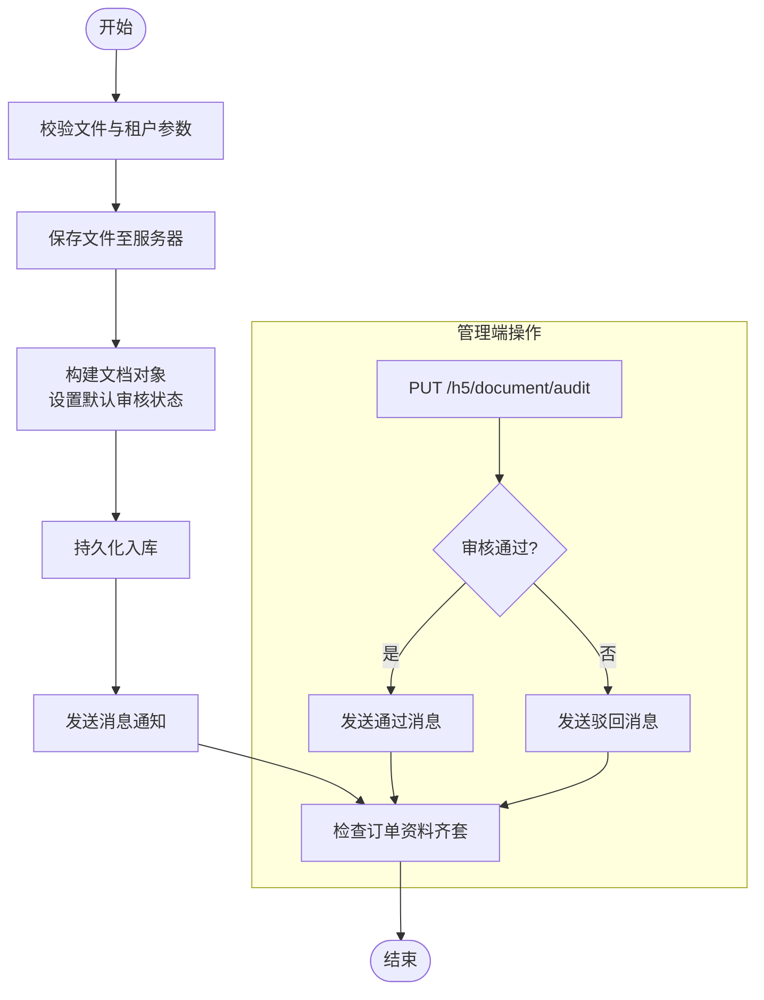
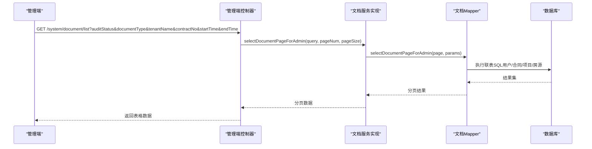
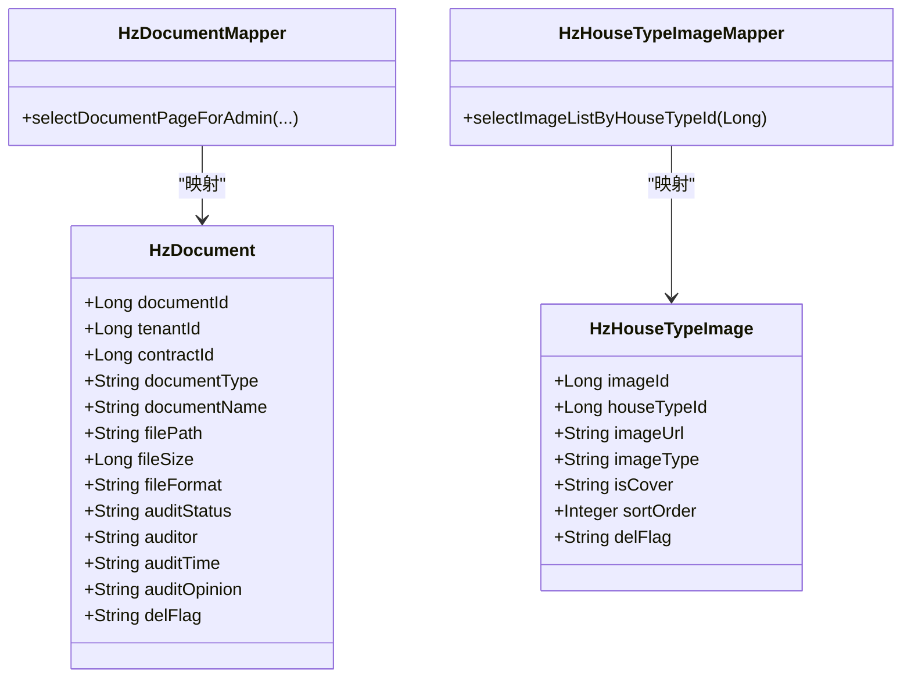

# 资料管理表

<cite>
**本文引用的文件**
- [HzDocument.java](file://ruoyi-system/src/main/java/com/ruoyi/system/domain/HzDocument.java)
- [HzDocumentMapper.java](file://ruoyi-system/src/main/java/com/ruoyi/system/mapper/HzDocumentMapper.java)
- [IHzDocumentService.java](file://ruoyi-system/src/main/java/com/ruoyi/system/service/IHzDocumentService.java)
- [HzDocumentServiceImpl.java](file://ruoyi-system/src/main/java/com/ruoyi/system/service/impl/HzDocumentServiceImpl.java)
- [HzDocumentController.java（管理端）](file://ruoyi-admin/src/main/java/com/ruoyi/web/controller/system/HzDocumentController.java)
- [HzDocumentController.java（H5端）](file://ruoyi-admin/src/main/java/com/ruoyi/web/controller/h5/HzDocumentController.java)
- [HzHouseTypeImage.java](file://ruoyi-system/src/main/java/com/ruoyi/system/domain/HzHouseTypeImage.java)
- [HzHouseTypeImageMapper.java](file://ruoyi-system/src/main/java/com/ruoyi/system/mapper/HzHouseTypeImageMapper.java)
- [资料管理.md](file://docs/数据字典/08-资料管理.md)
- [系统表.md](file://docs/数据字典/系统表.md)
- [01-房源管理.md](file://docs/数据字典/01-房源管理.md)
- [document/index.vue](file://ruoyi-ui/src/views/gangzhu/application/document/index.vue)
</cite>

## 目录
1. [简介](#简介)
2. [项目结构](#项目结构)
3. [核心组件](#核心组件)
4. [架构总览](#架构总览)
5. [详细组件分析](#详细组件分析)
6. [依赖关系分析](#依赖关系分析)
7. [性能考量](#性能考量)
8. [故障排查指南](#故障排查指南)
9. [结论](#结论)
10. [附录](#附录)

## 简介
本文件聚焦“资料管理模块”的数据表设计与业务实现，重点覆盖以下两张表：
- 文档表：hz_document（资料文档）
- 户型图片表：hz_house_type_image（户型图片）

围绕这两张表，文档将系统阐述：
- 文档上传管理（H5端上传、文件存储、默认审核策略）
- 图片资源管理（户型图/实景图的存储与展示）
- 文档分类存储（按租户、合同、类型维度组织）
- 访问权限控制（基于租户身份与审核状态的限制）
- 审核流程与消息通知（通过审核状态联动订单状态）
- 数据模型设计要点（元数据、存储路径、审核字段、软删除）

## 项目结构
资料管理模块在后端采用经典的分层架构：
- 控制器层：对外暴露REST接口，分别面向管理端与H5端
- 服务层：封装业务规则与流程控制
- 数据访问层：MyBatis-Plus映射数据库表
- 前端页面：表格展示、文件预览、状态标签

**图表来源**
- [HzDocumentController.java（H5端）:1-371](file://ruoyi-admin/src/main/java/com/ruoyi/web/controller/h5/HzDocumentController.java#L1-L371)
- [HzDocumentController.java（管理端）:1-77](file://ruoyi-admin/src/main/java/com/ruoyi/web/controller/system/HzDocumentController.java#L1-L77)
- [HzDocumentServiceImpl.java:1-99](file://ruoyi-system/src/main/java/com/ruoyi/system/service/impl/HzDocumentServiceImpl.java#L1-L99)
- [HzDocumentMapper.java:1-76](file://ruoyi-system/src/main/java/com/ruoyi/system/mapper/HzDocumentMapper.java#L1-L76)
- [HzHouseTypeImageMapper.java:1-26](file://ruoyi-system/src/main/java/com/ruoyi/system/mapper/HzHouseTypeImageMapper.java#L1-L26)
- [document/index.vue:72-100](file://ruoyi-ui/src/views/gangzhu/application/document/index.vue#L72-L100)

**章节来源**
- [HzDocumentController.java（H5端）:1-371](file://ruoyi-admin/src/main/java/com/ruoyi/web/controller/h5/HzDocumentController.java#L1-L371)
- [HzDocumentController.java（管理端）:1-77](file://ruoyi-admin/src/main/java/com/ruoyi/web/controller/system/HzDocumentController.java#L1-L77)
- [HzDocumentServiceImpl.java:1-99](file://ruoyi-system/src/main/java/com/ruoyi/system/service/impl/HzDocumentServiceImpl.java#L1-L99)
- [HzDocumentMapper.java:1-76](file://ruoyi-system/src/main/java/com/ruoyi/system/mapper/HzDocumentMapper.java#L1-L76)
- [HzHouseTypeImageMapper.java:1-26](file://ruoyi-system/src/main/java/com/ruoyi/system/mapper/HzHouseTypeImageMapper.java#L1-L26)
- [document/index.vue:72-100](file://ruoyi-ui/src/views/gangzhu/application/document/index.vue#L72-L100)

## 核心组件
- 实体类：HzDocument（hz_document）、HzHouseTypeImage（hz_house_type_image）
- Mapper接口：HzDocumentMapper、HzHouseTypeImageMapper
- Service接口与实现：IHzDocumentService、HzDocumentServiceImpl
- 控制器：管理端HzDocumentController、H5端HzDocumentController
- 前端视图：document/index.vue（列表、预览、状态标签）

关键职责划分：
- H5端控制器负责上传、删除、状态查询、重新上传、违规标记等
- 管理端控制器负责分页列表与筛选（联表用户/合同/项目/房源）
- 服务层统一处理业务规则（默认审核、状态校验、分页查询）
- Mapper负责SQL映射与联表查询

**章节来源**
- [HzDocument.java:1-199](file://ruoyi-system/src/main/java/com/ruoyi/system/domain/HzDocument.java#L1-L199)
- [HzHouseTypeImage.java:1-126](file://ruoyi-system/src/main/java/com/ruoyi/system/domain/HzHouseTypeImage.java#L1-L126)
- [IHzDocumentService.java:1-93](file://ruoyi-system/src/main/java/com/ruoyi/system/service/IHzDocumentService.java#L1-L93)
- [HzDocumentServiceImpl.java:1-99](file://ruoyi-system/src/main/java/com/ruoyi/system/service/impl/HzDocumentServiceImpl.java#L1-L99)
- [HzDocumentMapper.java:1-76](file://ruoyi-system/src/main/java/com/ruoyi/system/mapper/HzDocumentMapper.java#L1-L76)
- [HzHouseTypeImageMapper.java:1-26](file://ruoyi-system/src/main/java/com/ruoyi/system/mapper/HzHouseTypeImageMapper.java#L1-L26)
- [HzDocumentController.java（H5端）:1-371](file://ruoyi-admin/src/main/java/com/ruoyi/web/controller/h5/HzDocumentController.java#L1-L371)
- [HzDocumentController.java（管理端）:1-77](file://ruoyi-admin/src/main/java/com/ruoyi/web/controller/system/HzDocumentController.java#L1-L77)
- [document/index.vue:72-100](file://ruoyi-ui/src/views/gangzhu/application/document/index.vue#L72-L100)

## 架构总览
资料管理的端到端流程如下：

**图表来源**
- [HzDocumentController.java（H5端）:97-157](file://ruoyi-admin/src/main/java/com/ruoyi/web/controller/h5/HzDocumentController.java#L97-L157)
- [HzDocumentServiceImpl.java:71-75](file://ruoyi-system/src/main/java/com/ruoyi/system/service/impl/HzDocumentServiceImpl.java#L71-L75)
- [HzDocumentMapper.java:19-25](file://ruoyi-system/src/main/java/com/ruoyi/system/mapper/HzDocumentMapper.java#L19-L25)

## 详细组件分析

### 文档表 hz_document 设计与用途
- 表用途：存储租户上传的各类资料文档，支持按租户、合同、类型进行归档，并提供审核状态流转与消息通知集成。
- 关键字段与含义（摘自实体类与数据字典）：
  - 文档标识：document_id
  - 关联主体：tenant_id（租户ID，H5端以用户ID传入，但存储为租户ID关联）
  - 关联合同：contract_id（可选）
  - 文档类型：document_type（1:身份证 2:学历证明 3:工作证明 4:收入证明 5:人才证书）
  - 文档名称：document_name
  - 存储路径：file_path（相对路径，结合上传目录使用）
  - 文件大小：file_size（字节）
  - 文件格式：file_format
  - 审核状态：audit_status（0:待审核 1:已通过 2:已拒绝）
  - 审核人/时间/意见：auditor、audit_time、audit_opinion
  - 软删除：del_flag（0:正常 2:删除）
  - 创建/更新：create_by、create_time、update_by、update_time

- 业务特性：
  - H5上传默认通过：上传即设置audit_status=1，并写入默认意见与时间
  - 管理端复审：管理端接口支持分页查询与联表筛选（用户/合同/项目/房源）
  - 重新上传：仅对“已拒绝”状态允许覆盖上传，重置为“待审核”
  - 违规标记：管理端抽查可将状态标记为“已拒绝”，并写入违规原因
  - 状态校验：删除仅允许“待审核”状态的记录

- 数据模型复杂度：
  - 查询：按租户/合同/类型/时间范围等多维过滤，分页加载
  - 写入：默认审核策略与消息通知联动
  - 更新：审核、重新上传、违规标记等多场景

**章节来源**
- [HzDocument.java:1-199](file://ruoyi-system/src/main/java/com/ruoyi/system/domain/HzDocument.java#L1-L199)
- [资料管理.md:1-48](file://docs/数据字典/08-资料管理.md#L1-L48)
- [HzDocumentController.java（H5端）:97-157](file://ruoyi-admin/src/main/java/com/ruoyi/web/controller/h5/HzDocumentController.java#L97-L157)
- [HzDocumentController.java（管理端）:34-75](file://ruoyi-admin/src/main/java/com/ruoyi/web/controller/system/HzDocumentController.java#L34-L75)
- [HzDocumentServiceImpl.java:31-85](file://ruoyi-system/src/main/java/com/ruoyi/system/service/impl/HzDocumentServiceImpl.java#L31-L85)
- [HzDocumentMapper.java:27-75](file://ruoyi-system/src/main/java/com/ruoyi/system/mapper/HzDocumentMapper.java#L27-L75)

### 户型图片表 hz_house_type_image 设计与用途
- 表用途：存储户型图与实景图等图片资源，支持封面标记与排序展示。
- 关键字段与含义：
  - 图片标识：image_id
  - 关联户型：house_type_id
  - 图片URL：image_url
  - 图片类型：image_type（1:户型图 2:实景图）
  - 是否封面：is_cover（0:否 1:是）
  - 显示顺序：sort_order
  - 软删除：del_flag（0:正常 2:删除）

- 业务特性：
  - 查询按户型ID过滤图片列表
  - 支持封面优先展示与顺序控制
  - 与房源模块的户型表配合，支撑前端详情页展示

**章节来源**
- [HzHouseTypeImage.java:1-126](file://ruoyi-system/src/main/java/com/ruoyi/system/domain/HzHouseTypeImage.java#L1-L126)
- [HzHouseTypeImageMapper.java:1-26](file://ruoyi-system/src/main/java/com/ruoyi/system/mapper/HzHouseTypeImageMapper.java#L1-L26)
- [01-房源管理.md:157-203](file://docs/数据字典/01-房源管理.md#L157-L203)

### H5端上传与审核流程
- 上传流程：
  - 参数校验：文件非空、租户ID有效
  - 文件落盘：使用统一上传工具生成相对路径
  - 默认审核：audit_status=1，audit_opinion写默认意见，audit_time写当前时间
  - 保存入库：调用服务层insertDocument
  - 通知与订单检查：发送消息并尝试触发订单资料齐套检查

- 审核流程：
  - 管理端PUT /h5/document/augit：更新审核状态与意见
  - 通过：发送“审核通过”消息，触发订单检查
  - 驳回：发送“审核未通过”消息
  - 重新上传：仅针对“已拒绝”记录，覆盖原记录并重置为“待审核”

**图表来源**
- [HzDocumentController.java（H5端）:97-157](file://ruoyi-admin/src/main/java/com/ruoyi/web/controller/h5/HzDocumentController.java#L97-L157)
- [HzDocumentController.java（H5端）:230-265](file://ruoyi-admin/src/main/java/com/ruoyi/web/controller/h5/HzDocumentController.java#L230-L265)
- [HzDocumentServiceImpl.java:71-85](file://ruoyi-system/src/main/java/com/ruoyi/system/service/impl/HzDocumentServiceImpl.java#L71-L85)

**章节来源**
- [HzDocumentController.java（H5端）:97-157](file://ruoyi-admin/src/main/java/com/ruoyi/web/controller/h5/HzDocumentController.java#L97-L157)
- [HzDocumentController.java（H5端）:230-265](file://ruoyi-admin/src/main/java/com/ruoyi/web/controller/h5/HzDocumentController.java#L230-L265)
- [HzDocumentServiceImpl.java:71-85](file://ruoyi-system/src/main/java/com/ruoyi/system/service/impl/HzDocumentServiceImpl.java#L71-L85)

### 管理端分页与筛选
- 接口：GET /system/document/list
- 支持筛选条件：审核状态、文档类型、租户姓名（模糊）、合同编号（模糊）、上传时间区间
- 联表查询：用户（real_name/id_card）、合同（contract_no）、项目（project_name）、房源（house_no）、楼栋（building_name）、单元（unit_name）
- 排序：先按审核状态升序，再按创建时间降序

**图表来源**
- [HzDocumentController.java（管理端）:34-75](file://ruoyi-admin/src/main/java/com/ruoyi/web/controller/system/HzDocumentController.java#L34-L75)
- [HzDocumentMapper.java:27-75](file://ruoyi-system/src/main/java/com/ruoyi/system/mapper/HzDocumentMapper.java#L27-L75)

**章节来源**
- [HzDocumentController.java（管理端）:34-75](file://ruoyi-admin/src/main/java/com/ruoyi/web/controller/system/HzDocumentController.java#L34-L75)
- [HzDocumentMapper.java:27-75](file://ruoyi-system/src/main/java/com/ruoyi/system/mapper/HzDocumentMapper.java#L27-L75)

### 前端展示与交互
- 列表字段：文档类型标签、文件预览缩略图、上传时间、审核状态标签
- 预览：基于file_path解析完整URL进行图片预览
- 状态标签：根据audit_status渲染不同颜色标签（待审核/已通过/已驳回）

**章节来源**
- [document/index.vue:72-100](file://ruoyi-ui/src/views/gangzhu/application/document/index.vue#L72-L100)

## 依赖关系分析
- 控制器依赖服务接口，服务实现依赖Mapper与工具类（文件上传、消息服务、订单服务）
- Mapper通过XML SQL实现复杂联表查询
- 实体类与数据库表字段一一对应，遵循统一的软删除与创建/更新字段规范

**图表来源**
- [HzDocument.java:1-199](file://ruoyi-system/src/main/java/com/ruoyi/system/domain/HzDocument.java#L1-L199)
- [HzHouseTypeImage.java:1-126](file://ruoyi-system/src/main/java/com/ruoyi/system/domain/HzHouseTypeImage.java#L1-L126)
- [HzDocumentMapper.java:1-76](file://ruoyi-system/src/main/java/com/ruoyi/system/mapper/HzDocumentMapper.java#L1-L76)
- [HzHouseTypeImageMapper.java:1-26](file://ruoyi-system/src/main/java/com/ruoyi/system/mapper/HzHouseTypeImageMapper.java#L1-L26)

**章节来源**
- [HzDocument.java:1-199](file://ruoyi-system/src/main/java/com/ruoyi/system/domain/HzDocument.java#L1-L199)
- [HzHouseTypeImage.java:1-126](file://ruoyi-system/src/main/java/com/ruoyi/system/domain/HzHouseTypeImage.java#L1-L126)
- [HzDocumentMapper.java:1-76](file://ruoyi-system/src/main/java/com/ruoyi/system/mapper/HzDocumentMapper.java#L1-L76)
- [HzHouseTypeImageMapper.java:1-26](file://ruoyi-system/src/main/java/com/ruoyi/system/mapper/HzHouseTypeImageMapper.java#L1-L26)

## 性能考量
- 分页查询：管理端接口使用分页插件，建议合理设置每页大小与索引优化
- 联表查询：SQL包含多表LEFT JOIN，建议在相关列上建立索引（如tenant_id、contract_id、create_time）
- 文件存储：上传路径为相对路径，需确保静态资源可访问且具备CDN能力
- 审核状态排序：按audit_status与create_time排序，建议复合索引提升查询效率

## 故障排查指南
- 上传失败
  - 检查文件是否为空、租户ID是否传入
  - 查看上传目录权限与磁盘空间
  - 关注服务层异常日志
- 删除失败
  - 确认文档状态必须为“待审核”方可删除
  - 校验操作用户与文档所属租户一致
- 审核异常
  - 管理端审核后需检查消息服务与订单服务是否正常触发
  - 若“已拒绝”状态无法重新上传，确认状态值是否正确
- 管理端列表无数据
  - 检查筛选条件（时间区间需补全到日界限）
  - 确认联表数据完整性（合同/项目/房源等）

**章节来源**
- [HzDocumentController.java（H5端）:103-108](file://ruoyi-admin/src/main/java/com/ruoyi/web/controller/h5/HzDocumentController.java#L103-L108)
- [HzDocumentController.java（H5端）:162-189](file://ruoyi-admin/src/main/java/com/ruoyi/web/controller/h5/HzDocumentController.java#L162-L189)
- [HzDocumentController.java（H5端）:230-265](file://ruoyi-admin/src/main/java/com/ruoyi/web/controller/h5/HzDocumentController.java#L230-L265)
- [HzDocumentController.java（管理端）:58-63](file://ruoyi-admin/src/main/java/com/ruoyi/web/controller/system/HzDocumentController.java#L58-L63)

## 结论
hz_document与hz_house_type_image两张表共同构成了资料管理模块的核心数据基础。通过明确的文档类型、默认审核策略、严格的权限控制与完善的联表查询，系统实现了从上传、审核到展示的闭环流程。建议在生产环境中进一步完善索引、监控与告警，保障高并发场景下的稳定性与可维护性。

## 附录
- 数据字典参考
  - 资料管理：hz_tenant_document、hz_document_audit（历史表）
  - 系统表：通用软删除与状态约定
  - 房源管理：hz_house_type、hz_house_image、hz_house_vr（与图片相关）

**章节来源**
- [资料管理.md:1-48](file://docs/数据字典/08-资料管理.md#L1-L48)
- [系统表.md:1-200](file://docs/数据字典/系统表.md#L1-L200)
- [01-房源管理.md:116-203](file://docs/数据字典/01-房源管理.md#L116-L203)