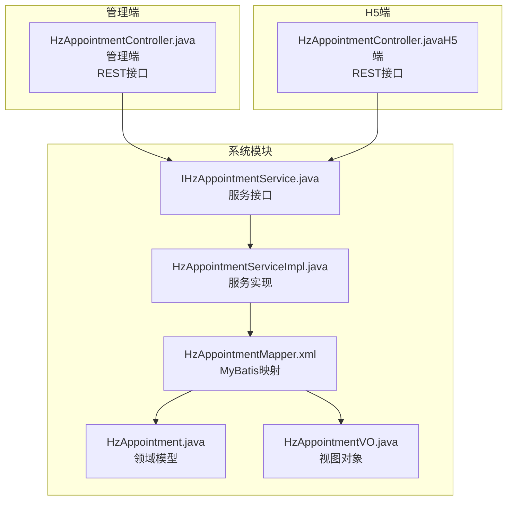
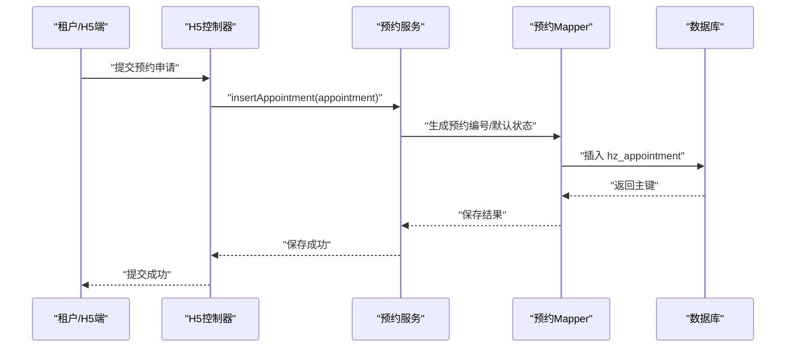
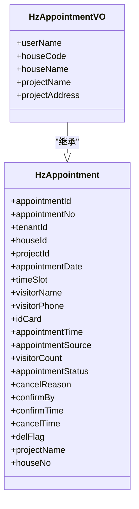
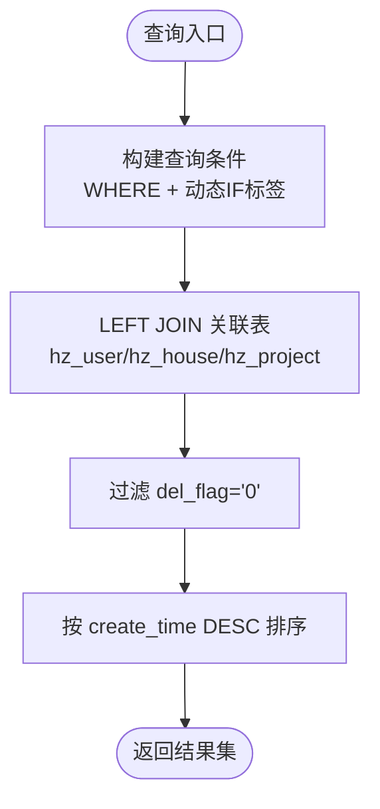
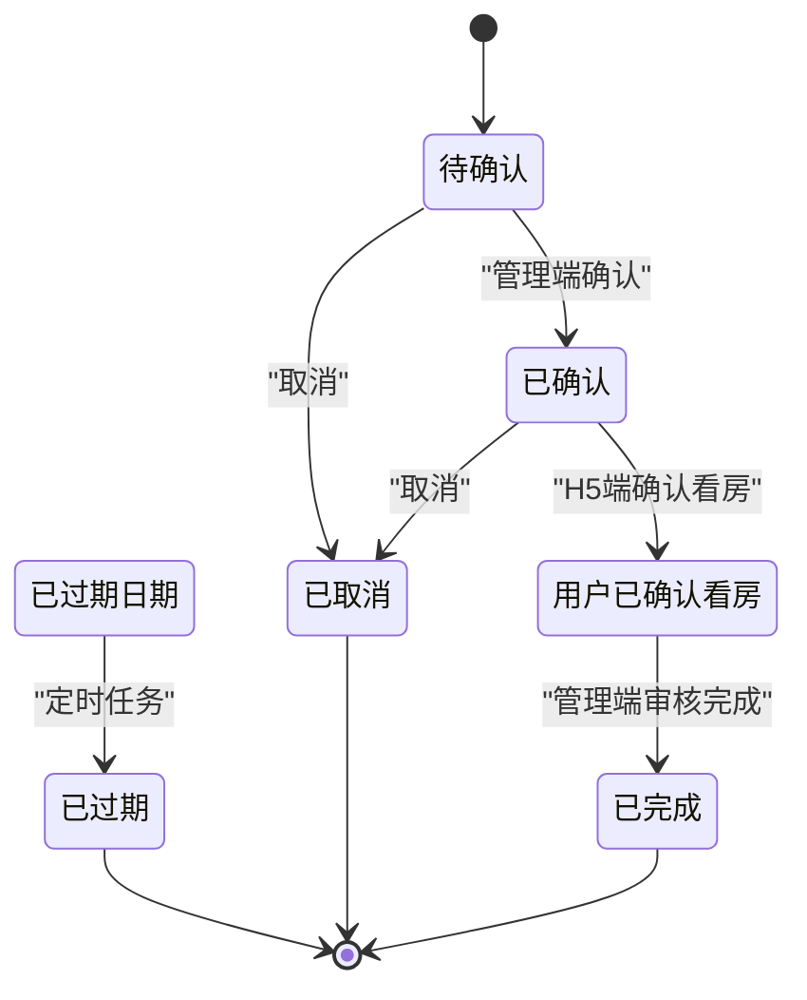
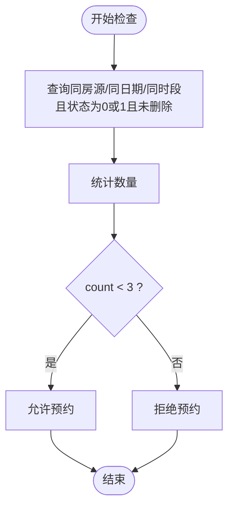
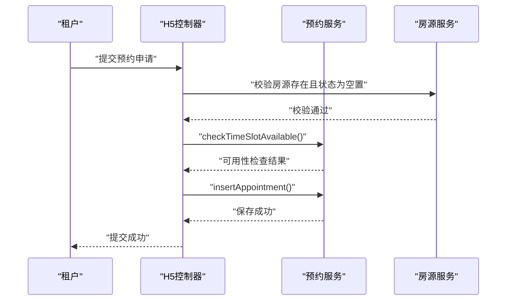
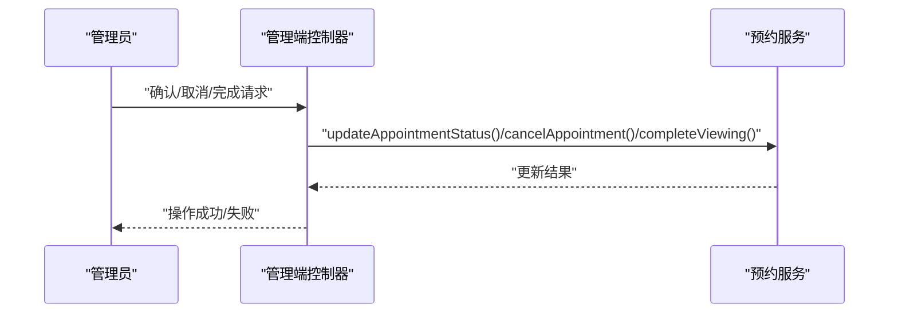
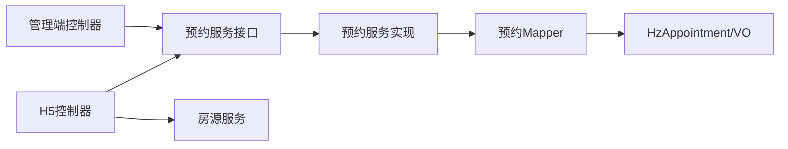

# 预约看房表

<cite>
**本文档引用的文件**
- [HzAppointment.java](file://ruoyi-system/src/main/java/com/ruoyi/system/domain/HzAppointment.java)
- [HzAppointmentVO.java](file://ruoyi-system/src/main/java/com/ruoyi/system/domain/HzAppointmentVO.java)
- [HzAppointmentMapper.xml](file://ruoyi-system/src/main/resources/mapper/system/HzAppointmentMapper.xml)
- [IHzAppointmentService.java](file://ruoyi-system/src/main/java/com/ruoyi/system/service/IHzAppointmentService.java)
- [HzAppointmentServiceImpl.java](file://ruoyi-system/src/main/java/com/ruoyi/system/service/impl/HzAppointmentServiceImpl.java)
- [HzAppointmentController.java（管理端）](file://ruoyi-admin/src/main/java/com/ruoyi/web/controller/system/HzAppointmentController.java)
- [HzAppointmentController.java（H5端）](file://ruoyi-admin/src/main/java/com/ruoyi/web/controller/h5/HzAppointmentController.java)
- [07-预约看房.md](file://docs/数据字典/07-预约看房.md)
</cite>

## 目录
1. [简介](#简介)
2. [项目结构](#项目结构)
3. [核心组件](#核心组件)
4. [架构总览](#架构总览)
5. [详细组件分析](#详细组件分析)
6. [依赖关系分析](#依赖关系分析)
7. [性能考虑](#性能考虑)
8. [故障排查指南](#故障排查指南)
9. [结论](#结论)
10. [附录](#附录)

## 简介
本文件聚焦“预约看房”模块的数据表与业务模型，围绕预约表 hz_appointment 与其视图对象 HzAppointmentVO 的设计与用途进行系统化说明，并结合服务层与控制器层实现，梳理房源预约流程、看房时间管理、预约状态跟踪以及冲突处理等关键业务逻辑。同时提供预约申请、确认、取消、完成等环节的表结构设计与业务规则，帮助开发者与产品人员快速理解与落地。

## 项目结构
预约看房模块在代码库中的组织方式如下：
- 数据模型：领域对象与视图对象位于系统模块的 domain 包中
- 映射层：MyBatis XML 映射文件位于系统模块的 resources/mapper 下
- 服务层：接口与实现位于系统模块的 service 包中
- 控制器层：管理端与 H5 端分别位于 admin 模块的不同包下
- 数据字典：模块的表结构与字段说明位于 docs/数据字典 中

图表来源
- [HzAppointment.java:1-302](file://ruoyi-system/src/main/java/com/ruoyi/system/domain/HzAppointment.java#L1-L302)
- [HzAppointmentVO.java:1-73](file://ruoyi-system/src/main/java/com/ruoyi/system/domain/HzAppointmentVO.java#L1-L73)
- [HzAppointmentMapper.xml:1-123](file://ruoyi-system/src/main/resources/mapper/system/HzAppointmentMapper.xml#L1-L123)
- [IHzAppointmentService.java:1-176](file://ruoyi-system/src/main/java/com/ruoyi/system/service/IHzAppointmentService.java#L1-L176)
- [HzAppointmentServiceImpl.java:1-215](file://ruoyi-system/src/main/java/com/ruoyi/system/service/impl/HzAppointmentServiceImpl.java#L1-L215)
- [HzAppointmentController.java（管理端）:1-148](file://ruoyi-admin/src/main/java/com/ruoyi/web/controller/system/HzAppointmentController.java#L1-L148)
- [HzAppointmentController.java（H5端）:1-164](file://ruoyi-admin/src/main/java/com/ruoyi/web/controller/h5/HzAppointmentController.java#L1-L164)

章节来源
- [HzAppointment.java:1-302](file://ruoyi-system/src/main/java/com/ruoyi/system/domain/HzAppointment.java#L1-L302)
- [HzAppointmentVO.java:1-73](file://ruoyi-system/src/main/java/com/ruoyi/system/domain/HzAppointmentVO.java#L1-L73)
- [HzAppointmentMapper.xml:1-123](file://ruoyi-system/src/main/resources/mapper/system/HzAppointmentMapper.xml#L1-L123)
- [IHzAppointmentService.java:1-176](file://ruoyi-system/src/main/java/com/ruoyi/system/service/IHzAppointmentService.java#L1-L176)
- [HzAppointmentServiceImpl.java:1-215](file://ruoyi-system/src/main/java/com/ruoyi/system/service/impl/HzAppointmentServiceImpl.java#L1-L215)
- [HzAppointmentController.java（管理端）:1-148](file://ruoyi-admin/src/main/java/com/ruoyi/web/controller/system/HzAppointmentController.java#L1-L148)
- [HzAppointmentController.java（H5端）:1-164](file://ruoyi-admin/src/main/java/com/ruoyi/web/controller/h5/HzAppointmentController.java#L1-L164)

## 核心组件
- 预约表 hz_appointment：承载预约申请、状态流转、时间与联系信息等核心数据
- 视图对象 HzAppointmentVO：扩展用户昵称、房源编码/名称、项目名称/地址等关联展示字段
- 服务接口 IHzAppointmentService：定义预约查询、分页、新增、状态变更、冲突检查、自动过期等能力
- 服务实现 HzAppointmentServiceImpl：具体业务逻辑实现，含状态校验、编号生成、冲突控制、定时过期
- 管理端控制器 HzAppointmentController：提供预约列表、导出、详情、确认、取消、完成等管理操作
- H5 端控制器 HzAppointmentController：面向租户的预约申请、修改、取消、确认看房、时间片可用性检查

章节来源
- [HzAppointment.java:11-302](file://ruoyi-system/src/main/java/com/ruoyi/system/domain/HzAppointment.java#L11-L302)
- [HzAppointmentVO.java:5-73](file://ruoyi-system/src/main/java/com/ruoyi/system/domain/HzAppointmentVO.java#L5-L73)
- [IHzAppointmentService.java:9-176](file://ruoyi-system/src/main/java/com/ruoyi/system/service/IHzAppointmentService.java#L9-L176)
- [HzAppointmentServiceImpl.java:19-215](file://ruoyi-system/src/main/java/com/ruoyi/system/service/impl/HzAppointmentServiceImpl.java#L19-L215)
- [HzAppointmentController.java（管理端）:23-148](file://ruoyi-admin/src/main/java/com/ruoyi/web/controller/system/HzAppointmentController.java#L23-L148)
- [HzAppointmentController.java（H5端）:14-164](file://ruoyi-admin/src/main/java/com/ruoyi/web/controller/h5/HzAppointmentController.java#L14-L164)

## 架构总览
预约看房模块采用经典的分层架构：
- 表现层：管理端与 H5 端控制器分别暴露 REST 接口
- 领域层：HzAppointment/VO 描述数据与展示字段
- 服务层：统一业务编排与规则校验
- 数据访问层：MyBatis XML 实现复杂查询与关联

图表来源
- [HzAppointmentController.java（H5端）:48-77](file://ruoyi-admin/src/main/java/com/ruoyi/web/controller/h5/HzAppointmentController.java#L48-L77)
- [IHzAppointmentService.java:85-114](file://ruoyi-system/src/main/java/com/ruoyi/system/service/IHzAppointmentService.java#L85-L114)
- [HzAppointmentServiceImpl.java:108-116](file://ruoyi-system/src/main/java/com/ruoyi/system/service/impl/HzAppointmentServiceImpl.java#L108-L116)
- [HzAppointmentMapper.xml:104-120](file://ruoyi-system/src/main/resources/mapper/system/HzAppointmentMapper.xml#L104-L120)

## 详细组件分析

### 数据模型：hz_appointment 与 HzAppointmentVO

- hz_appointment 字段概览（摘自数据字典与实体定义）
  - 主键与编号：appointment_id、appointment_no
  - 关联标识：tenant_id（租户）、house_id（房源）、project_id（项目）
  - 预约信息：appointment_date、time_slot、visitor_name、visitor_phone、id_card、visitor_count
  - 来源与状态：appointment_source、appointment_status（0待确认、1已确认、2用户已确认看房、3已完成、4已取消、5已过期）
  - 时间与操作：appointment_time、confirm_by、confirm_time、cancel_reason、cancel_time
  - 通用字段：del_flag、create_by、create_time、update_by、update_time、remark
  - 关联展示字段（非表字段）：projectName、houseNo（HzAppointment）

- HzAppointmentVO 在 HzAppointment 基础上扩展：
  - 用户昵称：userName（用于展示租户信息）
  - 房源信息：houseCode、houseName
  - 项目信息：projectName、projectAddress

图表来源
- [HzAppointment.java:11-270](file://ruoyi-system/src/main/java/com/ruoyi/system/domain/HzAppointment.java#L11-L270)
- [HzAppointmentVO.java:5-72](file://ruoyi-system/src/main/java/com/ruoyi/system/domain/HzAppointmentVO.java#L5-L72)

章节来源
- [HzAppointment.java:11-270](file://ruoyi-system/src/main/java/com/ruoyi/system/domain/HzAppointment.java#L11-L270)
- [HzAppointmentVO.java:5-72](file://ruoyi-system/src/main/java/com/ruoyi/system/domain/HzAppointmentVO.java#L5-L72)
- [07-预约看房.md:3-32](file://docs/数据字典/07-预约看房.md#L3-L32)

### 查询与映射：HzAppointmentMapper.xml
- VO 结果映射：将 hz_appointment 与 hz_user、hz_house、hz_project 进行左连接，映射到 HzAppointmentVO
- 列表查询：支持按预约编号、租户ID、房源ID、项目ID、访客姓名/电话、状态、来源及日期范围过滤
- 详情查询：按预约ID查询并返回 VO
- H5 端用户列表：按 tenant_id 查询并返回基础预约字段

图表来源
- [HzAppointmentMapper.xml:41-96](file://ruoyi-system/src/main/resources/mapper/system/HzAppointmentMapper.xml#L41-L96)

章节来源
- [HzAppointmentMapper.xml:7-39](file://ruoyi-system/src/main/resources/mapper/system/HzAppointmentMapper.xml#L7-L39)
- [HzAppointmentMapper.xml:41-96](file://ruoyi-system/src/main/resources/mapper/system/HzAppointmentMapper.xml#L41-L96)
- [HzAppointmentMapper.xml:98-120](file://ruoyi-system/src/main/resources/mapper/system/HzAppointmentMapper.xml#L98-L120)

### 业务规则与状态机

- 预约状态流转（管理端与 H5 端协同）
  - 申请：默认状态为“待确认(0)”，由 H5 端提交
  - 确认：管理端将状态更新为“已确认(1)”
  - 用户确认看房：H5 端将状态更新为“用户已确认看房(2)”
  - 完成：管理端将状态更新为“已完成(3)”
  - 取消：管理端或 H5 端在特定状态下将状态更新为“已取消(4)”
  - 自动过期：定时任务将“已过期日期且状态为0/1/2”的记录更新为“已过期(5)”

图表来源
- [HzAppointmentServiceImpl.java:158-203](file://ruoyi-system/src/main/java/com/ruoyi/system/service/impl/HzAppointmentServiceImpl.java#L158-L203)
- [HzAppointmentController.java（管理端）:112-146](file://ruoyi-admin/src/main/java/com/ruoyi/web/controller/system/HzAppointmentController.java#L112-L146)
- [HzAppointmentController.java（H5端）:133-150](file://ruoyi-admin/src/main/java/com/ruoyi/web/controller/h5/HzAppointmentController.java#L133-L150)

章节来源
- [IHzAppointmentService.java:116-175](file://ruoyi-system/src/main/java/com/ruoyi/system/service/IHzAppointmentService.java#L116-L175)
- [HzAppointmentServiceImpl.java:137-203](file://ruoyi-system/src/main/java/com/ruoyi/system/service/impl/HzAppointmentServiceImpl.java#L137-L203)
- [HzAppointmentController.java（管理端）:112-146](file://ruoyi-admin/src/main/java/com/ruoyi/web/controller/system/HzAppointmentController.java#L112-L146)
- [HzAppointmentController.java（H5端）:133-150](file://ruoyi-admin/src/main/java/com/ruoyi/web/controller/h5/HzAppointmentController.java#L133-L150)

### 冲突处理：时间段可用性检查
- 同一房源、同一天、同一时间段内，最多允许3个“待确认(0)”或“已确认(1)”的预约
- H5 端提交/修改预约前，先调用可用性检查接口
- 服务层实现基于 Lambda 查询包装器统计符合条件的预约数量并判断阈值

图表来源
- [HzAppointmentServiceImpl.java:68-79](file://ruoyi-system/src/main/java/com/ruoyi/system/service/impl/HzAppointmentServiceImpl.java#L68-L79)
- [HzAppointmentController.java（H5端）:64-71](file://ruoyi-admin/src/main/java/com/ruoyi/web/controller/h5/HzAppointmentController.java#L64-L71)

章节来源
- [IHzAppointmentService.java:57-65](file://ruoyi-system/src/main/java/com/ruoyi/system/service/IHzAppointmentService.java#L57-L65)
- [HzAppointmentServiceImpl.java:68-79](file://ruoyi-system/src/main/java/com/ruoyi/system/service/impl/HzAppointmentServiceImpl.java#L68-L79)
- [HzAppointmentController.java（H5端）:64-71](file://ruoyi-admin/src/main/java/com/ruoyi/web/controller/h5/HzAppointmentController.java#L64-L71)

### H5 端预约流程
- 申请：校验房源存在且状态为空置，检查时间段可用，设置项目ID，提交后默认状态为“待确认”
- 修改：仅“待确认”状态可修改；若修改时间则重新检查可用性
- 取消：仅“待确认/已确认”状态可取消
- 确认看房：将状态从“已确认(1)”更新为“用户已确认看房(2)”

图表来源
- [HzAppointmentController.java（H5端）:48-77](file://ruoyi-admin/src/main/java/com/ruoyi/web/controller/h5/HzAppointmentController.java#L48-L77)
- [HzAppointmentServiceImpl.java:108-116](file://ruoyi-system/src/main/java/com/ruoyi/system/service/impl/HzAppointmentServiceImpl.java#L108-L116)

章节来源
- [HzAppointmentController.java（H5端）:48-108](file://ruoyi-admin/src/main/java/com/ruoyi/web/controller/h5/HzAppointmentController.java#L48-L108)

### 管理端操作流程
- 列表与导出：分页查询、条件过滤、Excel 导出
- 详情：返回包含关联信息的 VO
- 确认/取消/完成：根据状态前置校验，调用服务层更新状态

图表来源
- [HzAppointmentController.java（管理端）:112-146](file://ruoyi-admin/src/main/java/com/ruoyi/web/controller/system/HzAppointmentController.java#L112-L146)
- [IHzAppointmentService.java:116-166](file://ruoyi-system/src/main/java/com/ruoyi/system/service/IHzAppointmentService.java#L116-L166)

章节来源
- [HzAppointmentController.java（管理端）:35-146](file://ruoyi-admin/src/main/java/com/ruoyi/web/controller/system/HzAppointmentController.java#L35-L146)
- [IHzAppointmentService.java:116-166](file://ruoyi-system/src/main/java/com/ruoyi/system/service/IHzAppointmentService.java#L116-L166)

## 依赖关系分析
- 控制器依赖服务接口，服务实现依赖 Mapper 与工具类
- Mapper 依赖 HzAppointment/VO 类型进行结果映射
- H5 端额外依赖房源服务进行状态校验

图表来源
- [HzAppointmentController.java（H5端）:23-27](file://ruoyi-admin/src/main/java/com/ruoyi/web/controller/h5/HzAppointmentController.java#L23-L27)
- [HzAppointmentController.java（管理端）:32-33](file://ruoyi-admin/src/main/java/com/ruoyi/web/controller/system/HzAppointmentController.java#L32-L33)
- [IHzAppointmentService.java:14-14](file://ruoyi-system/src/main/java/com/ruoyi/system/service/IHzAppointmentService.java#L14-L14)
- [HzAppointmentServiceImpl.java:24-28](file://ruoyi-system/src/main/java/com/ruoyi/system/service/impl/HzAppointmentServiceImpl.java#L24-L28)
- [HzAppointmentMapper.xml:5-5](file://ruoyi-system/src/main/resources/mapper/system/HzAppointmentMapper.xml#L5-L5)

章节来源
- [HzAppointmentController.java（H5端）:23-27](file://ruoyi-admin/src/main/java/com/ruoyi/web/controller/h5/HzAppointmentController.java#L23-L27)
- [HzAppointmentController.java（管理端）:32-33](file://ruoyi-admin/src/main/java/com/ruoyi/web/controller/system/HzAppointmentController.java#L32-L33)
- [HzAppointmentServiceImpl.java:24-28](file://ruoyi-system/src/main/java/com/ruoyi/system/service/impl/HzAppointmentServiceImpl.java#L24-L28)
- [HzAppointmentMapper.xml:5-5](file://ruoyi-system/src/main/resources/mapper/system/HzAppointmentMapper.xml#L5-L5)

## 性能考虑
- 查询优化：列表查询通过 MyBatis 动态 WHERE 条件减少无效筛选；排序按创建时间倒序，利于新数据优先展示
- 关联查询：Mapper 中使用 LEFT JOIN，注意在高并发下对 hz_house/hz_project 的索引与过滤条件进行评估
- 冲突检查：服务层对同时间段的预约数量进行统计，建议在数据库层面增加唯一性约束或复合索引以降低锁竞争
- 分页策略：管理端使用分页组件，避免一次性加载大量数据

## 故障排查指南
- 预约不可用
  - 现象：提示“该时间段预约已满，请选择其他时间”
  - 排查：确认同房源/同日期/同时段下“待确认/已确认”数量是否达到上限
  - 参考：服务层可用性检查逻辑与 H5 端调用链

- 状态异常
  - 现象：无法确认/取消/完成
  - 排查：确认当前状态是否符合前置条件；查看服务层状态校验抛出的异常信息
  - 参考：H5 端与管理端的状态校验与服务层状态更新方法

- 数据不一致
  - 现象：VO 展示字段缺失
  - 排查：确认 Mapper 中的关联查询与结果映射是否正确；检查 del_flag 过滤条件

章节来源
- [HzAppointmentServiceImpl.java:68-79](file://ruoyi-system/src/main/java/com/ruoyi/system/service/impl/HzAppointmentServiceImpl.java#L68-L79)
- [HzAppointmentController.java（H5端）:84-108](file://ruoyi-admin/src/main/java/com/ruoyi/web/controller/h5/HzAppointmentController.java#L84-L108)
- [HzAppointmentController.java（管理端）:112-146](file://ruoyi-admin/src/main/java/com/ruoyi/web/controller/system/HzAppointmentController.java#L112-L146)
- [HzAppointmentMapper.xml:41-96](file://ruoyi-system/src/main/resources/mapper/system/HzAppointmentMapper.xml#L41-L96)

## 结论
预约看房模块通过清晰的领域模型、完善的业务服务与严格的前后端状态校验，实现了从“申请—确认—用户确认看房—完成/取消—自动过期”的闭环流程。时间片冲突控制与 VO 展示增强提升了用户体验与管理效率。建议在生产环境中进一步完善数据库索引与并发控制策略，确保高并发场景下的稳定性与一致性。

## 附录

### 表结构与字段说明（摘自数据字典）
- hz_appointment
  - appointment_id：主键
  - appointment_no：预约编号
  - tenant_id：租户ID
  - house_id：房源ID
  - project_id：项目ID
  - appointment_date：预约日期
  - time_slot：预约时间段
  - visitor_name：访客姓名
  - visitor_phone：访客电话
  - id_card：身份证号
  - appointment_time：预约时间
  - appointment_source：预约来源（H5/小程序/电话）
  - visitor_count：访客人数
  - appointment_status：预约状态（0待确认、1已确认、2用户已确认看房、3已完成、4已取消、5已过期）
  - confirm_by：确认人
  - confirm_time：确认时间
  - cancel_reason：取消原因
  - cancel_time：取消时间
  - del_flag：删除标志
  - 其他通用字段：create_by、create_time、update_by、update_time、remark

- hz_viewing_record（看房记录表，用于补充）
  - record_id：记录ID
  - appointment_id：预约ID
  - tenant_id：租户ID
  - visitor_name：看房人姓名
  - project_id：项目ID
  - house_id：房源ID
  - viewing_date：看房日期
  - viewing_time：看房时间
  - guide_person：带看人
  - viewing_duration：看房时长（分钟）
  - satisfaction_score：满意度评分（1-5）
  - is_interested：是否有意向（0否、1是）
  - feedback：反馈意见
  - 其他通用字段：create_by、create_time、update_by、update_time、remark

章节来源
- [07-预约看房.md:3-60](file://docs/数据字典/07-预约看房.md#L3-L60)