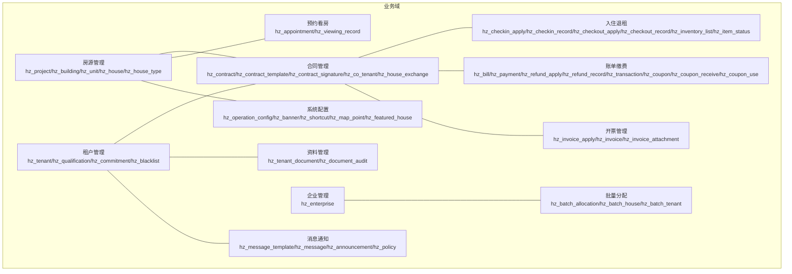
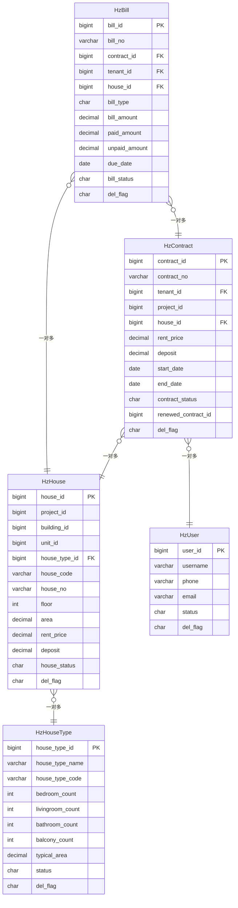
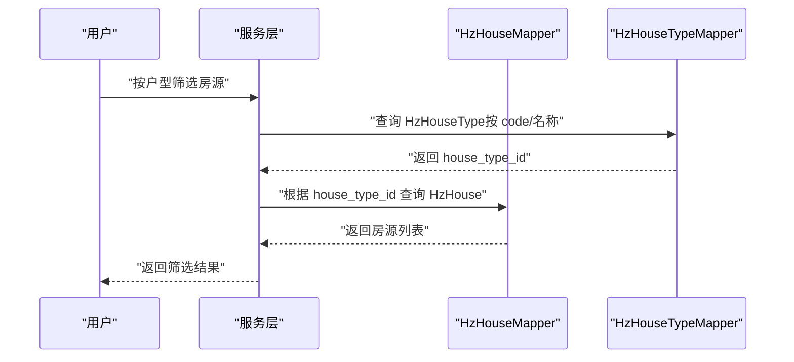
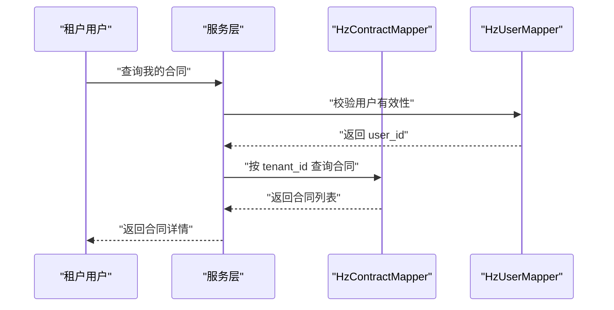
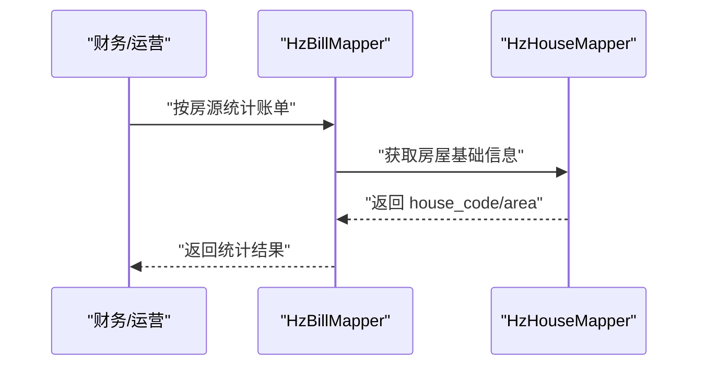
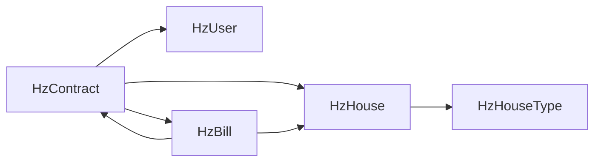

# 数据库关系设计

<cite>
**本文引用的文件**
- [01-房源管理.md](file://docs/数据字典/01-房源管理.md)
- [02-租户管理.md](file://docs/数据字典/02-租户管理.md)
- [03-合同管理.md](file://docs/数据字典/03-合同管理.md)
- [04-入住退租.md](file://docs/数据字典/04-入住退租.md)
- [05-账单缴费.md](file://docs/数据字典/05-账单缴费.md)
- [06-开票管理.md](file://docs/数据字典/06-开票管理.md)
- [07-预约看房.md](file://docs/数据字典/07-预约看房.md)
- [08-资料管理.md](file://docs/数据字典/08-资料管理.md)
- [09-消息通知.md](file://docs/数据字典/09-消息通知.md)
- [10-批量分配.md](file://docs/数据字典/10-批量分配.md)
- [11-企业管理.md](file://docs/数据字典/11-企业管理.md)
- [12-系统配置.md](file://docs/数据字典/12-系统配置.md)
- [HzHouse.java](file://ruoyi-system/src/main/java/com/ruoyi/system/domain/HzHouse.java)
- [HzHouseType.java](file://ruoyi-system/src/main/java/com/ruoyi/system/domain/HzHouseType.java)
- [HzContract.java](file://ruoyi-system/src/main/java/com/ruoyi/system/domain/HzContract.java)
- [HzUser.java](file://ruoyi-system/src/main/java/com/ruoyi/system/domain/HzUser.java)
- [HzBill.java](file://ruoyi-system/src/main/java/com/ruoyi/system/domain/HzBill.java)
</cite>

## 目录
1. [简介](#简介)
2. [项目结构](#项目结构)
3. [核心组件](#核心组件)
4. [架构总览](#架构总览)
5. [详细组件分析](#详细组件分析)
6. [依赖分析](#依赖分析)
7. [性能考虑](#性能考虑)
8. [故障排查指南](#故障排查指南)
9. [结论](#结论)
10. [附录](#附录)

## 简介
本文件面向港好住信息系统，系统化梳理数据库关系设计，重点覆盖以下方面：
- 核心业务表之间的关联关系（一对多、多对多）及实现
- 外键约束设计原则、级联策略与数据一致性保障
- 关键关联映射：HzHouse 与 HzHouseType、HzContract 与 HzUser、HzBill 与 HzHouse 的关系建模
- 索引设计策略、查询优化与性能考量
- ER 关系图、表关联示意图与典型查询场景的 SQL 优化建议
- 数据完整性约束、触发器与存储过程等高级特性应用思路

## 项目结构
本系统采用前后端分离与多模块划分，数据库层面以“业务域”为单位组织数据字典与实体模型。核心业务域包括：房源管理、租户管理、合同管理、入住退租、账单缴费、开票管理、预约看房、资料管理、消息通知、批量分配、企业管理和系统配置。

## 核心组件
本节聚焦于 HzHouse、HzHouseType、HzContract、HzUser、HzBill 等关键实体及其在数据字典中的表结构与关系映射。

- HzHouse（房源）
  - 字段要点：house_id、project_id、building_id、unit_id、house_type_id、house_code、house_no、area、rent_price、deposit、house_status、del_flag 等
  - 关联：与 HzHouseType 通过 house_type_id 建立一对多；与 hz_house_image、hz_house_vr 等建立一对多；与 hz_contract、hz_bill 等建立一对多
- HzHouseType（户型）
  - 字段要点：house_type_id、house_type_name、house_type_code、bedroom_count、livingroom_count、bathroom_count、balcony_count、typical_area、status、del_flag 等
  - 关联：与 hz_house 为一对多
- HzContract（合同）
  - 字段要点：contract_id、contract_no、tenant_id、project_id、house_id、rent_price、deposit、start_date、end_date、payment_cycle、contract_status、renewed_contract_id、del_flag 等
  - 关联：与 HzUser（租户）通过 tenant_id 建立一对多；与 HzHouse 通过 house_id 建立一对多；与 hz_bill、hz_checkin_record、hz_checkout_record 等建立一对多
- HzUser（用户）
  - 字段要点：user_id、username、phone、email、status、del_flag 等
  - 关联：与 HzContract（租户侧）建立一对多；与 hz_tenant（租户扩展信息）建立一对一
- HzBill（账单）
  - 字段要点：bill_id、bill_no、contract_id、tenant_id、house_id、bill_type、bill_amount、paid_amount、unpaid_amount、due_date、bill_status、del_flag 等
  - 关联：与 HzContract 通过 contract_id 建立一对多；与 HzHouse 通过 house_id 建立一对多；与 hz_payment、hz_transaction 等建立一对多

**章节来源**
- [01-房源管理.md:82-112](file://docs/数据字典/01-房源管理.md#L82-L112)
- [01-房源管理.md:157-180](file://docs/数据字典/01-房源管理.md#L157-L180)
- [03-合同管理.md:3-41](file://docs/数据字典/03-合同管理.md#L3-L41)
- [05-账单缴费.md:3-33](file://docs/数据字典/05-账单缴费.md#L3-L33)
- [HzHouse.java](file://ruoyi-system/src/main/java/com/ruoyi/system/domain/HzHouse.java)
- [HzHouseType.java](file://ruoyi-system/src/main/java/com/ruoyi/system/domain/HzHouseType.java)
- [HzContract.java](file://ruoyi-system/src/main/java/com/ruoyi/system/domain/HzContract.java)
- [HzUser.java](file://ruoyi-system/src/main/java/com/ruoyi/system/domain/HzUser.java)
- [HzBill.java](file://ruoyi-system/src/main/java/com/ruoyi/system/domain/HzBill.java)

## 架构总览
系统采用“领域驱动”的数据库设计，围绕核心实体构建主从关系与业务流程链路。下图展示关键实体与主要表之间的关系映射。

**图表来源**
- [01-房源管理.md:82-112](file://docs/数据字典/01-房源管理.md#L82-L112)
- [01-房源管理.md:157-180](file://docs/数据字典/01-房源管理.md#L157-L180)
- [03-合同管理.md:3-41](file://docs/数据字典/03-合同管理.md#L3-L41)
- [05-账单缴费.md:3-33](file://docs/数据字典/05-账单缴费.md#L3-L33)
- [HzHouse.java](file://ruoyi-system/src/main/java/com/ruoyi/system/domain/HzHouse.java)
- [HzHouseType.java](file://ruoyi-system/src/main/java/com/ruoyi/system/domain/HzHouseType.java)
- [HzContract.java](file://ruoyi-system/src/main/java/com/ruoyi/system/domain/HzContract.java)
- [HzUser.java](file://ruoyi-system/src/main/java/com/ruoyi/system/domain/HzUser.java)
- [HzBill.java](file://ruoyi-system/src/main/java/com/ruoyi/system/domain/HzBill.java)

## 详细组件分析

### HzHouse 与 HzHouseType：一对多关系
- 设计要点
  - HzHouse.house_type_id 引用 HzHouseType.house_type_id，形成典型的“一个户型对应多个房源”的一对多
  - HzHouseType.typical_area、bedroom_count 等字段用于统一管理户型特征，便于筛选与统计
- 外键与级联
  - 建议：删除 HzHouseType 时禁止级联删除，避免误删导致 HzHouse 数据丢失；更新时可设置 NO ACTION 或 SET NULL（视业务允许性）
- 查询优化
  - 在 HzHouse.house_type_id 上建立索引，支持按户型快速过滤
  - HzHouseType.house_type_code/名称常用于前端筛选，可在 HzHouseType 上建立唯一索引或组合索引

**章节来源**
- [01-房源管理.md:82-112](file://docs/数据字典/01-房源管理.md#L82-L112)
- [01-房源管理.md:157-180](file://docs/数据字典/01-房源管理.md#L157-L180)

### HzContract 与 HzUser：一对多关系
- 设计要点
  - HzContract.tenant_id 引用 HzUser.user_id，表示合同由用户发起
  - 由于租户信息可能独立扩展，实际业务中通常存在 Hz_tenant 表与 HzUser 的映射关系
- 外键与级联
  - 建议：删除用户时禁止级联删除合同，保留历史合同完整性；可通过软删除标记 del_flag 控制可见性
- 查询优化
  - 在 HzContract.tenant_id 建立索引，支持按租户快速检索合同
  - 若需同时查询用户与租户扩展信息，建议在查询层进行 JOIN，避免过度 denormalization

**章节来源**
- [03-合同管理.md:3-41](file://docs/数据字典/03-合同管理.md#L3-L41)
- [HzContract.java](file://ruoyi-system/src/main/java/com/ruoyi/system/domain/HzContract.java)
- [HzUser.java](file://ruoyi-system/src/main/java/com/ruoyi/system/domain/HzUser.java)

### HzBill 与 HzHouse：一对多关系
- 设计要点
  - HzBill.house_id 引用 HzHouse.house_id，账单与房源绑定，便于按房源维度统计与对账
- 外键与级联
  - 建议：删除房源时禁止级联删除账单，确保历史账单可追溯
- 查询优化
  - 在 HzBill.house_id 建立索引，支持按房源维度聚合统计
  - HzBill.bill_type、bill_status、due_date 等字段常用于报表与催缴，建议建立复合索引

**章节来源**
- [05-账单缴费.md:3-33](file://docs/数据字典/05-账单缴费.md#L3-L33)
- [HzBill.java](file://ruoyi-system/src/main/java/com/ruoyi/system/domain/HzBill.java)

### HzContract 与 HzHouse：一对多关系
- 设计要点
  - HzContract.house_id 引用 HzHouse.house_id，合同与房源绑定，支撑入住、退租、换房等流程
- 外键与级联
  - 建议：删除房源不影响合同，保留历史履约记录
- 查询优化
  - 在 HzContract.house_id 建立索引，支持按房源检索合同生命周期

**章节来源**
- [03-合同管理.md:3-41](file://docs/数据字典/03-合同管理.md#L3-L41)
- [HzContract.java](file://ruoyi-system/src/main/java/com/ruoyi/system/domain/HzContract.java)

### HzContract 与 HzBill：一对多关系
- 设计要点
  - HzBill.contract_id 引用 HzContract.contract_id，账单与合同绑定，支撑按合同维度生成与核对账单
- 外键与级联
  - 建议：删除合同前需清理或迁移账单，防止孤儿账单
- 查询优化
  - 在 HzBill.contract_id 建立索引，支持按合同维度查询账单明细与状态

**章节来源**
- [03-合同管理.md:3-41](file://docs/数据字典/03-合同管理.md#L3-L41)
- [05-账单缴费.md:3-33](file://docs/数据字典/05-账单缴费.md#L3-L33)

### 多对多关系与中间表
- 典型场景
  - 房源与设施：hz_house <-> hz_facility_item 通过 hz_house_facility 中间表建立多对多
  - 户型与设施：hz_house_type <-> hz_facility_item 通过 hz_house_type_facility 中间表建立多对多
- 设计要点
  - 中间表仅保存关联键，避免重复数据与更新异常
  - 建议在中间表上建立联合唯一索引，保证同一房源/户型仅能绑定同一设施一次
- 查询优化
  - 在中间表的两列上建立复合索引，提升 JOIN 与去重效率

**章节来源**
- [01-房源管理.md:116-153](file://docs/数据字典/01-房源管理.md#L116-L153)

## 依赖分析
- 内聚与耦合
  - HzHouse 与 HzHouseType：内聚于“房屋属性定义”，耦合度低
  - HzContract 与 HzUser/HzHouse/HzBill：内聚于“合同生命周期”，耦合度较高但职责清晰
- 外部依赖
  - 与系统配置表（如 hz_operation_config）交互，用于动态控制业务行为
  - 与消息通知表（hz_message/hz_announcement）交互，用于业务事件通知

**图表来源**
- [01-房源管理.md:82-112](file://docs/数据字典/01-房源管理.md#L82-L112)
- [01-房源管理.md:157-180](file://docs/数据字典/01-房源管理.md#L157-L180)
- [03-合同管理.md:3-41](file://docs/数据字典/03-合同管理.md#L3-L41)
- [05-账单缴费.md:3-33](file://docs/数据字典/05-账单缴费.md#L3-L33)

## 性能考虑
- 索引策略
  - 唯一索引：hz_house_type(house_type_code)、hz_house(house_code)、hz_contract(contract_no)
  - 单列索引：hz_house(house_type_id)、hz_contract(tenant_id)、hz_bill(house_id, contract_id)
  - 复合索引：hz_bill(bill_type, bill_status, due_date)、hz_contract(start_date, end_date)
- 查询优化
  - 分页查询：对高频分页查询（如合同列表、账单列表）使用基于索引的排序与 LIMIT
  - 聚合查询：对按项目/楼栋/单元的统计，预先物化统计表或使用分区表
- 缓存与异步
  - 对热点数据（如运营配置、轮播图）引入缓存
  - 对耗时操作（如批量导入、报表生成）采用异步队列

## 故障排查指南
- 外键约束错误
  - 现象：插入/更新失败，提示违反外键约束
  - 排查：确认被引用键是否存在且未被逻辑删除；检查 del_flag 与业务状态
- 级联删除风险
  - 现象：删除父表记录导致子表数据丢失
  - 排查：确认是否启用级联删除；必要时改为软删除并配合审计
- 查询性能差
  - 现象：复杂 JOIN 或大表扫描导致慢查询
  - 排查：检查 EXPLAIN 输出，确认索引命中；必要时添加复合索引或改写 SQL
- 数据一致性问题
  - 现象：账单与合同状态不一致
  - 排查：检查 HzBill.paid_amount/unpaid_amount 与 HzTransaction 的对账逻辑；补充触发器或存储过程保障原子性

## 结论
本设计以“核心实体+主从关系”为核心，结合业务流程链路（合同 -> 入住/退租 -> 账单/开票），形成清晰的数据模型。通过合理的外键约束、索引策略与查询优化，能够有效保障数据一致性与系统性能。建议在后续迭代中持续完善中间表与统计表，强化审计与监控能力。

## 附录
- 典型查询场景与优化建议
  - 按户型筛选房源：在 HzHouse.house_type_id 建索引；避免 SELECT *，仅取必要字段
  - 按租户查询合同：在 HzContract.tenant_id 建索引；分页查询时使用覆盖索引
  - 按房源统计账单：在 HzBill.house_id 建索引；对 bill_type/bill_status/due_date 建复合索引
  - 合同生命周期查询：在 HzContract.house_id、start_date/end_date 建复合索引
- 高级特性应用思路
  - 触发器：在合同状态变更时自动同步 HzHouse.house_status
  - 存储过程：封装批量生成账单、对账与报表导出流程
  - 分区表：按时间分区 HzBill、HzTransaction，提升归档与查询效率