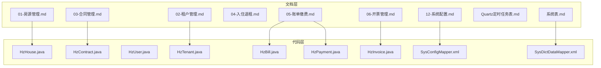
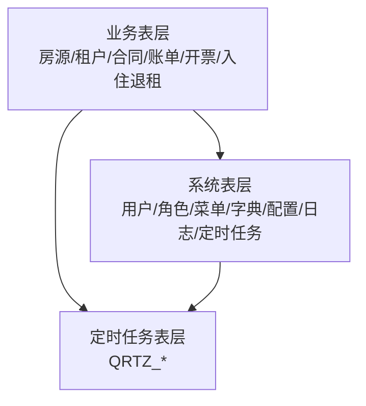
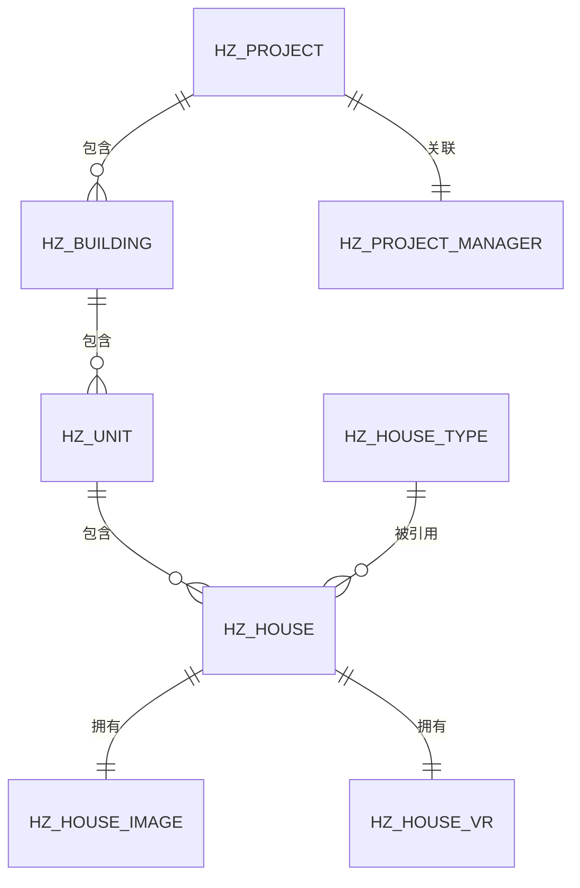
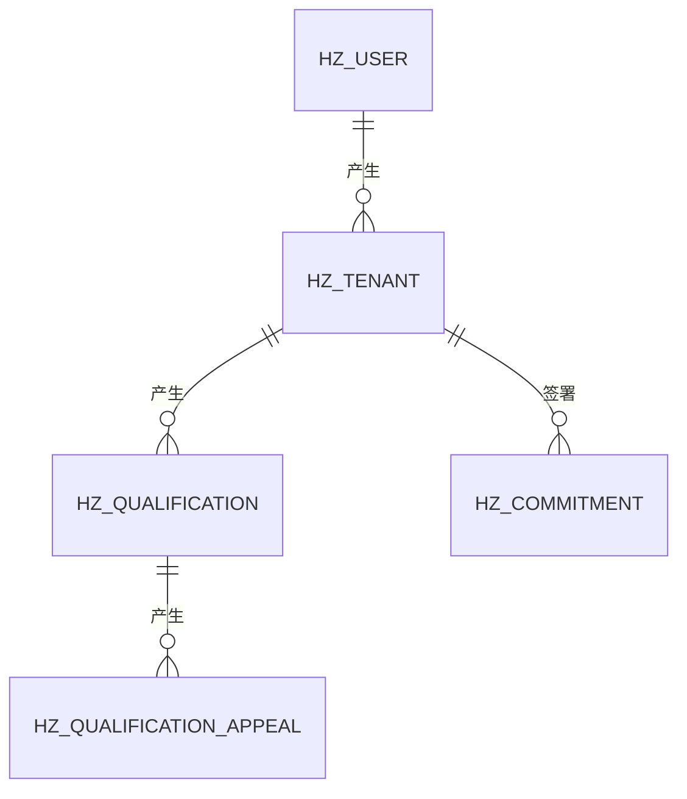
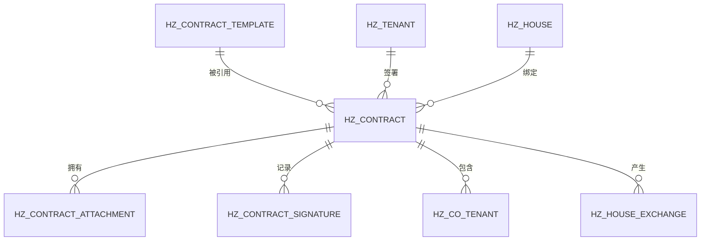
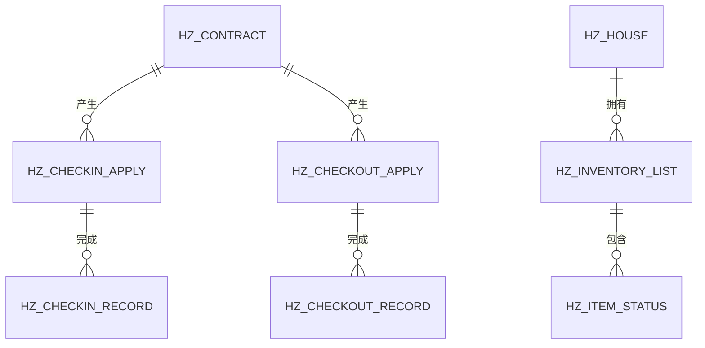
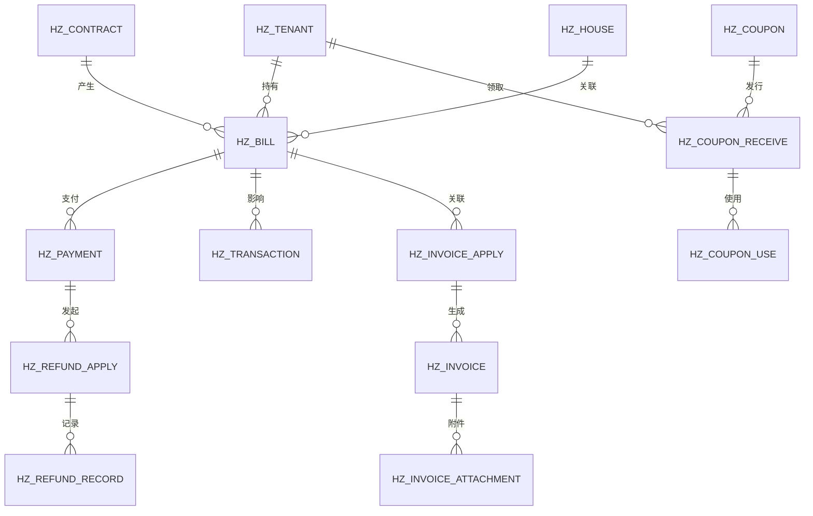
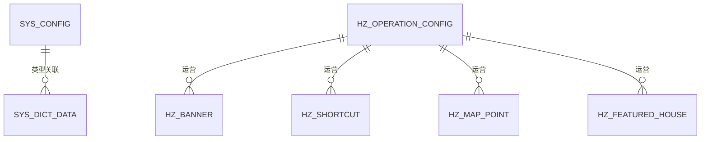
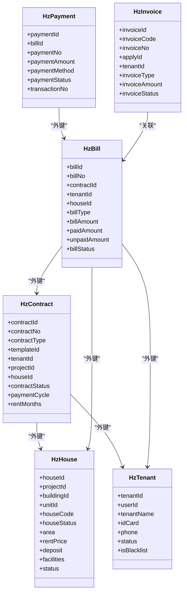

# 数据库设计

<cite>
**本文引用的文件**
- [01-房源管理.md](file://docs/数据字典/01-房源管理.md)
- [02-租户管理.md](file://docs/数据字典/02-租户管理.md)
- [03-合同管理.md](file://docs/数据字典/03-合同管理.md)
- [04-入住退租.md](file://docs/数据字典/04-入住退租.md)
- [05-账单缴费.md](file://docs/数据字典/05-账单缴费.md)
- [06-开票管理.md](file://docs/数据字典/06-开票管理.md)
- [12-系统配置.md](file://docs/数据字典/12-系统配置.md)
- [Quartz定时任务表.md](file://docs/数据字典/Quartz定时任务表.md)
- [系统表.md](file://docs/数据字典/系统表.md)
- [HzHouse.java](file://ruoyi-system/src/main/java/com/ruoyi/system/domain/HzHouse.java)
- [HzContract.java](file://ruoyi-system/src/main/java/com/ruoyi/system/domain/HzContract.java)
- [HzUser.java](file://ruoyi-system/src/main/java/com/ruoyi/system/domain/HzUser.java)
- [HzTenant.java](file://ruoyi-system/src/main/java/com/ruoyi/system/domain/HzTenant.java)
- [HzBill.java](file://ruoyi-system/src/main/java/com/ruoyi/system/domain/HzBill.java)
- [HzPayment.java](file://ruoyi-system/src/main/java/com/ruoyi/system/domain/HzPayment.java)
- [HzInvoice.java](file://ruoyi-system/src/main/java/com/ruoyi/system/domain/HzInvoice.java)
- [SysConfigMapper.xml](file://ruoyi-system/src/main/resources/mapper/system/SysConfigMapper.xml)
- [SysDictDataMapper.xml](file://ruoyi-system/src/main/resources/mapper/system/SysDictDataMapper.xml)
</cite>

## 目录
1. [简介](#简介)
2. [项目结构](#项目结构)
3. [核心组件](#核心组件)
4. [架构总览](#架构总览)
5. [详细组件分析](#详细组件分析)
6. [依赖分析](#依赖分析)
7. [性能考虑](#性能考虑)
8. [故障排查指南](#故障排查指南)
9. [结论](#结论)
10. [附录](#附录)

## 简介
本文件面向港好住信息系统，系统以“房源—租户—合同—账单缴费—开票”为主线，辅以“租户资格审核、入住退租、系统配置、定时任务”等支撑模块，形成完整的租住生命周期管理体系。本文从数据库设计角度，系统梳理核心数据模型、表间关系、外键约束、索引设计与数据完整性约束，并给出运维层面的数据迁移、备份恢复、性能优化与安全保护建议。

## 项目结构
- 文档层：数据字典按功能域拆分，覆盖房源、租户、合同、入住退租、账单缴费、开票、系统配置、定时任务等。
- 代码层：MyBatis-Plus 实体类映射各业务表，Mapper XML 定义查询与分页逻辑；系统表（RuoYi）用于权限、配置、字典、定时任务等基础设施。

**图表来源**
- [01-房源管理.md:1-203](file://docs/数据字典/01-房源管理.md#L1-L203)
- [02-租户管理.md:1-144](file://docs/数据字典/02-租户管理.md#L1-L144)
- [03-合同管理.md:1-165](file://docs/数据字典/03-合同管理.md#L1-L165)
- [05-账单缴费.md:1-220](file://docs/数据字典/05-账单缴费.md#L1-L220)
- [06-开票管理.md:1-89](file://docs/数据字典/06-开票管理.md#L1-L89)
- [12-系统配置.md:1-112](file://docs/数据字典/12-系统配置.md#L1-L112)
- [Quartz定时任务表.md:1-178](file://docs/数据字典/Quartz定时任务表.md#L1-L178)
- [系统表.md:1-390](file://docs/数据字典/系统表.md#L1-L390)
- [HzHouse.java:1-441](file://ruoyi-system/src/main/java/com/ruoyi/system/domain/HzHouse.java#L1-L441)
- [HzContract.java:1-606](file://ruoyi-system/src/main/java/com/ruoyi/system/domain/HzContract.java#L1-L606)
- [HzUser.java:1-375](file://ruoyi-system/src/main/java/com/ruoyi/system/domain/HzUser.java#L1-L375)
- [HzTenant.java:1-316](file://ruoyi-system/src/main/java/com/ruoyi/system/domain/HzTenant.java#L1-L316)
- [HzBill.java:1-354](file://ruoyi-system/src/main/java/com/ruoyi/system/domain/HzBill.java#L1-L354)
- [HzPayment.java:1-202](file://ruoyi-system/src/main/java/com/ruoyi/system/domain/HzPayment.java#L1-L202)
- [HzInvoice.java:1-223](file://ruoyi-system/src/main/java/com/ruoyi/system/domain/HzInvoice.java#L1-L223)
- [SysConfigMapper.xml:1-138](file://ruoyi-system/src/main/resources/mapper/system/SysConfigMapper.xml#L1-L138)
- [SysDictDataMapper.xml:1-140](file://ruoyi-system/src/main/resources/mapper/system/SysDictDataMapper.xml#L1-L140)

**章节来源**
- [01-房源管理.md:1-203](file://docs/数据字典/01-房源管理.md#L1-L203)
- [02-租户管理.md:1-144](file://docs/数据字典/02-租户管理.md#L1-L144)
- [03-合同管理.md:1-165](file://docs/数据字典/03-合同管理.md#L1-L165)
- [04-入住退租.md:1-175](file://docs/数据字典/04-入住退租.md#L1-L175)
- [05-账单缴费.md:1-220](file://docs/数据字典/05-账单缴费.md#L1-L220)
- [06-开票管理.md:1-89](file://docs/数据字典/06-开票管理.md#L1-L89)
- [12-系统配置.md:1-112](file://docs/数据字典/12-系统配置.md#L1-L112)
- [Quartz定时任务表.md:1-178](file://docs/数据字典/Quartz定时任务表.md#L1-L178)
- [系统表.md:1-390](file://docs/数据字典/系统表.md#L1-L390)

## 核心组件
本节聚焦系统关键业务表及其字段设计要点，结合实体类映射关系，明确主键、外键、索引与约束策略。

- 房源相关表
  - hz_house：房源主表，包含项目/楼栋/单元层级、户型、面积、租金、押金、设施、状态、精选标记等。
  - hz_house_type：户型表，典型面积、布局图、状态。
  - hz_house_image/hz_house_vr：房源图片与VR全景资源。
  - hz_project/hz_building/hz_unit：地理与建筑层级组织。
  - hz_project_manager：项目负责人关联用户。

- 租户相关表
  - hz_tenant：租户档案，含身份、联系、信用、黑名单、状态等。
  - hz_user：统一用户主体，支持多来源（微信小程序、郑好办），含实名认证、登录信息。
  - hz_qualification/hz_qualification_appeal：资格审核与申诉。
  - hz_commitment：承诺书与电子签名。

- 合同相关表
  - hz_contract：合同主表，含合同类型、模板、租期、支付周期、状态、续租关联等。
  - hz_contract_template：合同模板。
  - hz_contract_attachment/hz_contract_signature：合同附件与签署记录。
  - hz_co_tenant：共同承租人。
  - hz_house_exchange：换房记录。

- 入住退租表
  - hz_checkin_apply/hz_checkin_record：入住申请与记录。
  - hz_checkout_apply/hz_checkout_record：退租申请与记录。
  - hz_inventory_list/hz_item_status：物品清单与状态。

- 财务相关表
  - hz_bill：账单，含周期、金额、已付、未付、滞纳金、状态、支付信息。
  - hz_payment：支付记录，含第三方流水、状态、退款信息。
  - hz_refund_apply/hz_refund_record：退款申请与记录。
  - hz_transaction：交易流水。
  - hz_coupon/hz_coupon_receive/hz_coupon_use：优惠券全链路。
  - hz_invoice_apply/hz_invoice/hz_invoice_attachment：开票申请、发票与附件。

- 系统配置与支撑表
  - hz_operation_config/hz_banner/hz_shortcut/hz_map_point/hz_featured_house：运营配置与展示。
  - sys_config/sys_dict_type/sys_dict_data：系统配置与字典。
  - QRTZ_*：Quartz定时任务调度表族。

**章节来源**
- [01-房源管理.md:1-203](file://docs/数据字典/01-房源管理.md#L1-L203)
- [02-租户管理.md:1-144](file://docs/数据字典/02-租户管理.md#L1-L144)
- [03-合同管理.md:1-165](file://docs/数据字典/03-合同管理.md#L1-L165)
- [04-入住退租.md:1-175](file://docs/数据字典/04-入住退租.md#L1-L175)
- [05-账单缴费.md:1-220](file://docs/数据字典/05-账单缴费.md#L1-L220)
- [06-开票管理.md:1-89](file://docs/数据字典/06-开票管理.md#L1-L89)
- [12-系统配置.md:1-112](file://docs/数据字典/12-系统配置.md#L1-L112)
- [Quartz定时任务表.md:1-178](file://docs/数据字典/Quartz定时任务表.md#L1-L178)
- [系统表.md:1-390](file://docs/数据字典/系统表.md#L1-L390)
- [HzHouse.java:1-441](file://ruoyi-system/src/main/java/com/ruoyi/system/domain/HzHouse.java#L1-L441)
- [HzContract.java:1-606](file://ruoyi-system/src/main/java/com/ruoyi/system/domain/HzContract.java#L1-L606)
- [HzUser.java:1-375](file://ruoyi-system/src/main/java/com/ruoyi/system/domain/HzUser.java#L1-L375)
- [HzTenant.java:1-316](file://ruoyi-system/src/main/java/com/ruoyi/system/domain/HzTenant.java#L1-L316)
- [HzBill.java:1-354](file://ruoyi-system/src/main/java/com/ruoyi/system/domain/HzBill.java#L1-L354)
- [HzPayment.java:1-202](file://ruoyi-system/src/main/java/com/ruoyi/system/domain/HzPayment.java#L1-L202)
- [HzInvoice.java:1-223](file://ruoyi-system/src/main/java/com/ruoyi/system/domain/HzInvoice.java#L1-L223)

## 架构总览
系统采用“业务表+系统表+定时任务表”的三层架构：
- 业务表：围绕租住生命周期构建，强调主外键关系与一致性。
- 系统表：RuoYi框架提供的通用能力（用户、角色、菜单、字典、配置、日志、定时任务等）。
- 定时任务表：Quartz集群化调度，保障到期提醒、合同到期、账单生成等自动化流程。

**图表来源**
- [系统表.md:1-390](file://docs/数据字典/系统表.md#L1-L390)
- [Quartz定时任务表.md:1-178](file://docs/数据字典/Quartz定时任务表.md#L1-L178)

## 详细组件分析

### 房源相关表设计
- hz_house
  - 主键：house_id
  - 外键：project_id → hz_project, building_id → hz_building, unit_id → hz_unit, house_type_id → hz_house_type
  - 设计要点：字段覆盖项目/楼栋/单元/户型维度，支持面积、租金、押金、设施、状态、精选标记等；提供导入导出Excel列映射。
- hz_house_type
  - 主键：house_type_id；典型面积、布局图、状态。
- hz_house_image/hz_house_vr
  - 资源表，按house_id关联；支持封面标记、排序、状态。
- hz_project/hz_building/hz_unit
  - 层级组织表，含状态、排序、经纬度、设施等。
- hz_project_manager
  - 项目负责人与用户关联，便于权限与联系。

**图表来源**
- [01-房源管理.md:1-203](file://docs/数据字典/01-房源管理.md#L1-L203)
- [HzHouse.java:1-441](file://ruoyi-system/src/main/java/com/ruoyi/system/domain/HzHouse.java#L1-L441)

**章节来源**
- [01-房源管理.md:1-203](file://docs/数据字典/01-房源管理.md#L1-L203)
- [HzHouse.java:1-441](file://ruoyi-system/src/main/java/com/ruoyi/system/domain/HzHouse.java#L1-L441)

### 租户相关表设计
- hz_tenant
  - 主键：tenant_id；外键：user_id → hz_user；字段覆盖身份、联系、信用、黑名单、状态。
- hz_user
  - 主键：user_id；支持来源类型（微信/郑好办）、实名认证、登录信息、删除标志。
- hz_qualification/hz_qualification_appeal
  - 资格审核与申诉，含自动/人工审核结果、状态流转。
- hz_commitment
  - 承诺书与电子签名，含签署时间/IP/状态。

**图表来源**
- [02-租户管理.md:1-144](file://docs/数据字典/02-租户管理.md#L1-L144)
- [HzTenant.java:1-316](file://ruoyi-system/src/main/java/com/ruoyi/system/domain/HzTenant.java#L1-L316)
- [HzUser.java:1-375](file://ruoyi-system/src/main/java/com/ruoyi/system/domain/HzUser.java#L1-L375)

**章节来源**
- [02-租户管理.md:1-144](file://docs/数据字典/02-租户管理.md#L1-L144)
- [HzTenant.java:1-316](file://ruoyi-system/src/main/java/com/ruoyi/system/domain/HzTenant.java#L1-L316)
- [HzUser.java:1-375](file://ruoyi-system/src/main/java/com/ruoyi/system/domain/HzUser.java#L1-L375)

### 合同相关表设计
- hz_contract
  - 主键：contract_id；外键：template_id → hz_contract_template, tenant_id → hz_tenant, house_id → hz_house
  - 字段覆盖合同类型、租期、支付周期、状态、续租关联、电子签流程ID等。
- hz_contract_template
  - 模板表，含默认模板标记、版本、状态。
- hz_contract_attachment/hz_contract_signature
  - 附件与签署记录，含签署人类型、签名数据、IP/位置、状态。
- hz_co_tenant/hz_house_exchange
  - 共同承租人与换房记录，含审批流程与状态。

**图表来源**
- [03-合同管理.md:1-165](file://docs/数据字典/03-合同管理.md#L1-L165)
- [HzContract.java:1-606](file://ruoyi-system/src/main/java/com/ruoyi/system/domain/HzContract.java#L1-L606)

**章节来源**
- [03-合同管理.md:1-165](file://docs/数据字典/03-合同管理.md#L1-L165)
- [HzContract.java:1-606](file://ruoyi-system/src/main/java/com/ruoyi/system/domain/HzContract.java#L1-L606)

### 入住退租表设计
- hz_checkin_apply/hz_checkin_record
  - 入住申请与记录，含电/水/燃气读数、钥匙数量、物品清单、照片、双方签名、经办人。
- hz_checkout_apply/hz_checkout_record
  - 退租申请与记录，含违约金、欠费、押金、退款状态与时间、物品损坏赔偿。
- hz_inventory_list/hz_item_status
  - 清单与物品状态，含分类、数量、状态、照片、排序。

**图表来源**
- [04-入住退租.md:1-175](file://docs/数据字典/04-入住退租.md#L1-L175)

**章节来源**
- [04-入住退租.md:1-175](file://docs/数据字典/04-入住退租.md#L1-L175)

### 财务相关表设计
- hz_bill
  - 主键：bill_id；外键：contract_id → hz_contract, tenant_id → hz_tenant, house_id → hz_house
  - 字段覆盖账单类型（押金/租金/水/电/燃气/物业/其他）、周期、金额、已付、未付、滞纳金、状态、支付信息。
- hz_payment
  - 主键：payment_id；外键：bill_id → hz_bill；字段覆盖支付方式、状态、第三方流水、退款信息、凭证。
- hz_refund_apply/hz_refund_record
  - 退款申请与记录，含审批、账户、退款状态与失败原因。
- hz_transaction
  - 交易流水，记录收支、余额变化、业务类型与状态。
- hz_coupon/hz_coupon_receive/hz_coupon_use
  - 优惠券全链路，含发行、领取、使用、适用类型与有效期。
- hz_invoice_apply/hz_invoice/hz_invoice_attachment
  - 开票申请、发票与附件，含发票类型、抬头、税号、金额、PDF、状态。

**图表来源**
- [05-账单缴费.md:1-220](file://docs/数据字典/05-账单缴费.md#L1-L220)
- [06-开票管理.md:1-89](file://docs/数据字典/06-开票管理.md#L1-L89)
- [HzBill.java:1-354](file://ruoyi-system/src/main/java/com/ruoyi/system/domain/HzBill.java#L1-L354)
- [HzPayment.java:1-202](file://ruoyi-system/src/main/java/com/ruoyi/system/domain/HzPayment.java#L1-L202)
- [HzInvoice.java:1-223](file://ruoyi-system/src/main/java/com/ruoyi/system/domain/HzInvoice.java#L1-L223)

**章节来源**
- [05-账单缴费.md:1-220](file://docs/数据字典/05-账单缴费.md#L1-L220)
- [06-开票管理.md:1-89](file://docs/数据字典/06-开票管理.md#L1-L89)
- [HzBill.java:1-354](file://ruoyi-system/src/main/java/com/ruoyi/system/domain/HzBill.java#L1-L354)
- [HzPayment.java:1-202](file://ruoyi-system/src/main/java/com/ruoyi/system/domain/HzPayment.java#L1-L202)
- [HzInvoice.java:1-223](file://ruoyi-system/src/main/java/com/ruoyi/system/domain/HzInvoice.java#L1-L223)

### 系统配置与定时任务表设计
- hz_operation_config/hz_banner/hz_shortcut/hz_map_point/hz_featured_house
  - 运营配置与展示，含轮播图、快捷入口、地图点位、精选房源等。
- sys_config/sys_dict_type/sys_dict_data
  - 系统配置键值对与字典类型/数据，支持分页查询与字典标签转换。
- QRTZ_*（Quartz）
  - 任务详情、触发器、简单/Cron触发器、Blob触发器、日历、暂停组、已触发、调度器状态、悲观锁、同步属性触发器等。

**图表来源**
- [12-系统配置.md:1-112](file://docs/数据字典/12-系统配置.md#L1-L112)
- [系统表.md:1-390](file://docs/数据字典/系统表.md#L1-L390)
- [Quartz定时任务表.md:1-178](file://docs/数据字典/Quartz定时任务表.md#L1-L178)

**章节来源**
- [12-系统配置.md:1-112](file://docs/数据字典/12-系统配置.md#L1-L112)
- [系统表.md:1-390](file://docs/数据字典/系统表.md#L1-L390)
- [Quartz定时任务表.md:1-178](file://docs/数据字典/Quartz定时任务表.md#L1-L178)

## 依赖分析
- 实体类与表映射
  - HzHouse.java → hz_house
  - HzContract.java → hz_contract
  - HzUser.java → hz_user
  - HzTenant.java → hz_tenant
  - HzBill.java → hz_bill
  - HzPayment.java → hz_payment
  - HzInvoice.java → hz_invoice
- Mapper与查询
  - SysConfigMapper.xml：sys_config 的查询、分页、唯一键校验、CRUD。
  - SysDictDataMapper.xml：sys_dict_data 的查询、分页、字典标签查询、类型变更、CRUD。

**图表来源**
- [HzHouse.java:1-441](file://ruoyi-system/src/main/java/com/ruoyi/system/domain/HzHouse.java#L1-L441)
- [HzContract.java:1-606](file://ruoyi-system/src/main/java/com/ruoyi/system/domain/HzContract.java#L1-L606)
- [HzTenant.java:1-316](file://ruoyi-system/src/main/java/com/ruoyi/system/domain/HzTenant.java#L1-L316)
- [HzBill.java:1-354](file://ruoyi-system/src/main/java/com/ruoyi/system/domain/HzBill.java#L1-L354)
- [HzPayment.java:1-202](file://ruoyi-system/src/main/java/com/ruoyi/system/domain/HzPayment.java#L1-L202)
- [HzInvoice.java:1-223](file://ruoyi-system/src/main/java/com/ruoyi/system/domain/HzInvoice.java#L1-L223)

**章节来源**
- [SysConfigMapper.xml:1-138](file://ruoyi-system/src/main/resources/mapper/system/SysConfigMapper.xml#L1-L138)
- [SysDictDataMapper.xml:1-140](file://ruoyi-system/src/main/resources/mapper/system/SysDictDataMapper.xml#L1-L140)

## 性能考虑
- 索引与查询
  - 建议在高频过滤字段上建立索引：如 hz_house(project_id, building_id, unit_id, house_status)，hz_contract(tenant_id, contract_status)，hz_bill(contract_id, tenant_id, bill_status)，hz_payment(bill_id, payment_status)，hz_invoice(apply_id, tenant_id)。
  - 对时间字段（bill_date、due_date、pay_time、sign_time、checkout_date）建立复合索引，支持范围查询。
- 分页与排序
  - 分页查询使用主键或唯一索引作为游标，避免大偏移分页。
- 写入优化
  - 批量导入/导出使用事务包裹，减少锁竞争；对图片/附件URL字段采用异步落盘策略。
- 缓存策略
  - 字典数据（sys_dict_data）可缓存热点键值，降低频繁查询成本。
- 定时任务
  - Quartz任务按需拆分，避免单任务超时；利用暂停组与悲观锁保证集群一致性。

[本节为通用指导，无需特定文件引用]

## 故障排查指南
- 配置与字典
  - 若系统配置或字典异常，优先检查 sys_config 与 sys_dict_data 的键唯一性与状态字段。
  - 使用 SysConfigMapper.xml 的唯一键校验方法快速定位重复键。
- 账单与支付
  - 若账单状态异常，检查 hz_bill 与 hz_payment 的状态机一致性与回调时间字段。
  - 若退款失败，核查 hz_refund_record 的失败原因与账户信息。
- 合同与签署
  - 若合同状态不一致，检查 hz_contract 与 hz_contract_signature 的签署时间/IP/状态。
- 开票异常
  - 若发票状态异常，核查 hz_invoice 的状态与作废/红冲标记。
- 定时任务
  - 若任务未触发或重复执行，检查 QRTZ_TRIGGERS、QRTZ_FIRED_TRIGGERS、QRTZ_SCHEDULER_STATE 等表状态。

**章节来源**
- [SysConfigMapper.xml:88-91](file://ruoyi-system/src/main/resources/mapper/system/SysConfigMapper.xml#L88-L91)
- [SysDictDataMapper.xml:60-68](file://ruoyi-system/src/main/resources/mapper/system/SysDictDataMapper.xml#L60-L68)
- [05-账单缴费.md:1-220](file://docs/数据字典/05-账单缴费.md#L1-L220)
- [06-开票管理.md:1-89](file://docs/数据字典/06-开票管理.md#L1-L89)
- [Quartz定时任务表.md:1-178](file://docs/数据字典/Quartz定时任务表.md#L1-L178)

## 结论
港好住信息系统数据库设计以租住生命周期为核心，围绕“房源—租户—合同—账单缴费—开票”构建了清晰的主外键关系与状态机。通过系统表与定时任务表支撑权限、配置、字典与自动化流程。建议在生产环境中强化索引策略、事务批处理与缓存机制，确保高并发下的稳定性与一致性。

[本节为总结性内容，无需特定文件引用]

## 附录
- 数据迁移策略
  - 采用“结构先行、数据分批、校验回滚”的策略；先创建新表并建立索引，再进行数据迁移，最后切换与验证。
- 备份恢复方案
  - 建议采用增量备份与全量备份结合，定期验证恢复流程；对关键表（合同、账单、支付、发票）增加备份频率。
- 数据安全保护
  - 对敏感字段（身份证、银行卡、签名数据）进行脱敏与加密；限制系统配置与字典的写权限；启用审计日志与操作日志。

[本节为通用指导，无需特定文件引用]