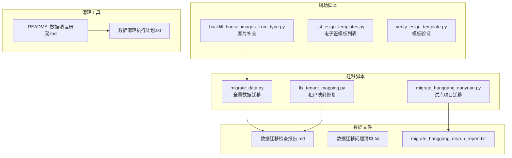
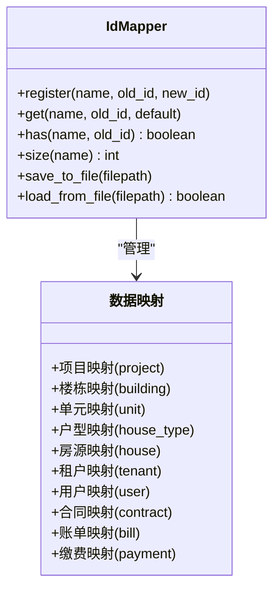
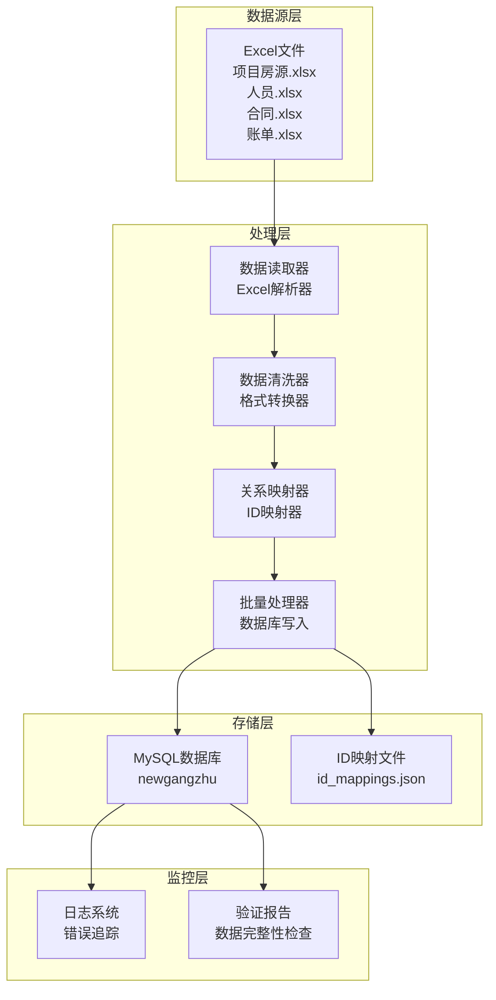
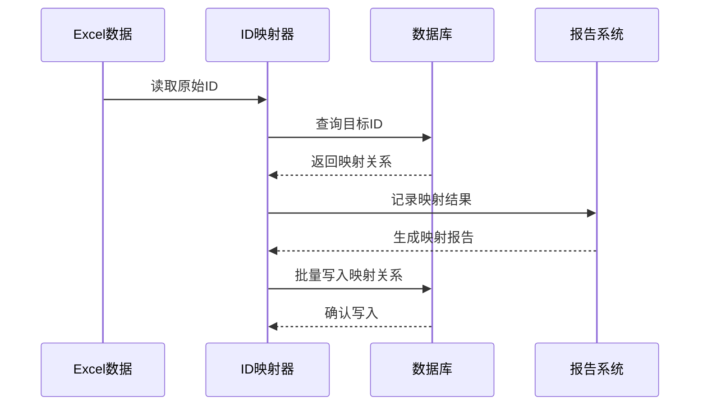
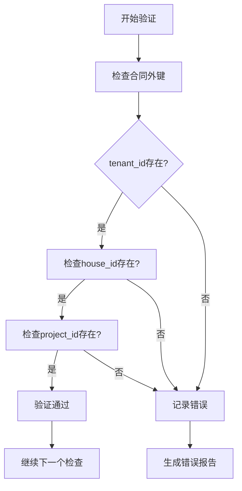
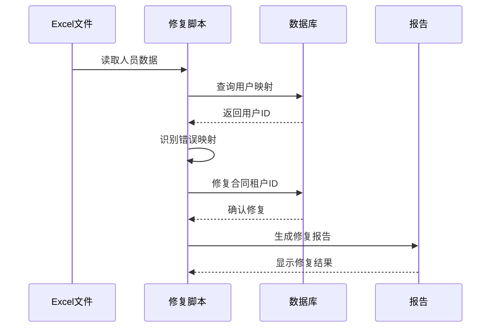
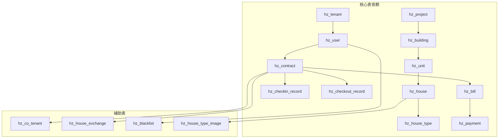
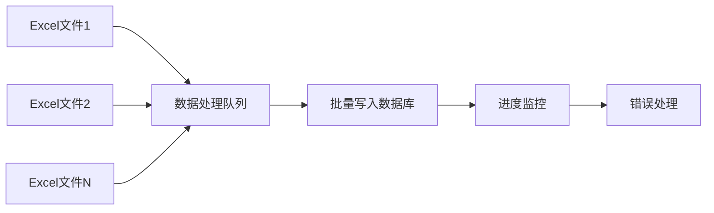
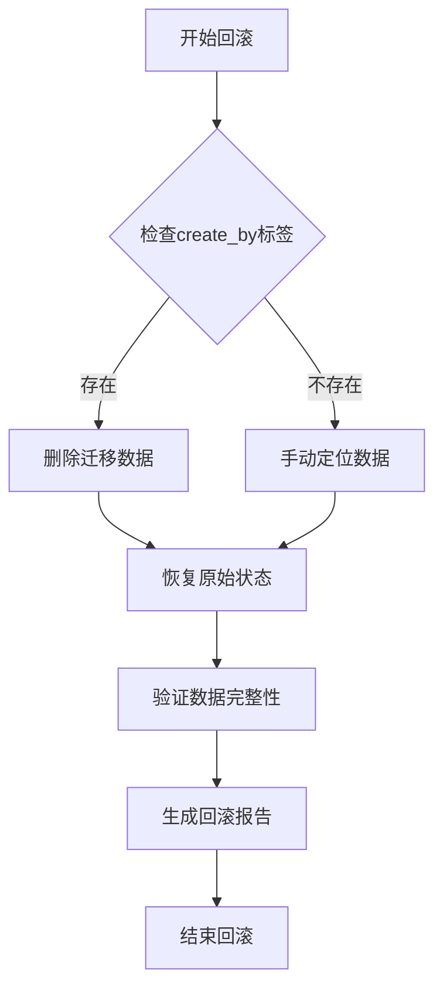

# 数据迁移策略

<cite>
**本文档引用的文件**
- [migrate_data.py](file://migrate_data.py)
- [fix_tenant_mapping.py](file://fix_tenant_mapping.py)
- [migrate_hanggang_nanyuan.py](file://scripts/migrate_hanggang_nanyuan.py)
- [migrate_hanggang_dryrun_report.txt](file://scripts/migrate_hanggang_dryrun_report.txt)
- [数据迁移检查报告.md](file://数据迁移检查报告.md)
- [数据迁移问题清单.txt](file://数据迁移问题清单.txt)
- [README_数据清理研究.md](file://README_数据清理研究.md)
- [数据清理执行计划.txt](file://数据清理执行计划.txt)
- [backfill_house_images_from_type.py](file://scripts/backfill_house_images_from_type.py)
- [list_esign_templates.py](file://scripts/list_esign_templates.py)
- [verify_esign_template.py](file://scripts/verify_esign_template.py)
- [alter_hz_house_type_add_vr_url.sql](file://sql/alter_hz_house_type_add_vr_url.sql)
- [ghz_2026-04-15.sql](file://sql/ghz_2026-04-15.sql)
</cite>

## 目录
1. [引言](#引言)
2. [项目结构](#项目结构)
3. [核心组件](#核心组件)
4. [架构概览](#架构概览)
5. [详细组件分析](#详细组件分析)
6. [依赖分析](#依赖分析)
7. [性能考虑](#性能考虑)
8. [故障排除指南](#故障排除指南)
9. [结论](#结论)
10. [附录](#附录)

## 引言

港好住信息系统数据迁移策略旨在将历史数据从老系统平滑迁移到新系统，确保业务连续性和数据完整性。本策略涵盖了数据清洗、格式转换、关系映射、冲突处理等关键步骤，并提供了完整的迁移脚本使用方法、数据验证机制、回滚策略和风险控制措施。

## 项目结构

项目采用模块化设计，包含多个迁移脚本和辅助工具：

**图表来源**
- [migrate_data.py](file://migrate_data.py)
- [fix_tenant_mapping.py](file://fix_tenant_mapping.py)
- [migrate_hanggang_nanyuan.py](file://scripts/migrate_hanggang_nanyuan.py)

**章节来源**
- [migrate_data.py](file://migrate_data.py)
- [fix_tenant_mapping.py](file://fix_tenant_mapping.py)
- [migrate_hanggang_nanyuan.py](file://scripts/migrate_hanggang_nanyuan.py)

## 核心组件

### 数据迁移引擎

迁移引擎采用分步执行策略，每个步骤负责特定的数据表迁移：

| 步骤 | 组件 | 功能 | 数据量 |
|------|------|------|--------|
| 1 | 项目导入 | 导入项目基本信息 | 12条 |
| 2 | 楼栋导入 | 导入建筑信息 | 21条 |
| 3 | 单元导入 | 导入单元信息 | 23条 |
| 4 | 户型导入 | 导入房屋类型 | 72条 |
| 5 | 房源导入 | 导入房屋信息 | 1,772条 |
| 6 | 租户导入 | 导入租户信息 | 128,032条 |
| 6.5 | 用户创建 | 从租户创建用户 | 127,986条 |
| 7 | 合同导入 | 导入租赁合同 | 3,653条 |
| 8 | 账单导入 | 导入账单信息 | 118,831条 |
| 9 | 缴费导入 | 导入缴费记录 | 30,900条 |

### 数据映射系统

**图表来源**
- [migrate_data.py](file://migrate_data.py)

**章节来源**
- [migrate_data.py](file://migrate_data.py)

## 架构概览

系统采用分层架构设计，确保数据迁移的可控性和可追溯性：

**图表来源**
- [migrate_data.py](file://migrate_data.py)
- [数据迁移检查报告.md](file://数据迁移检查报告.md)

## 详细组件分析

### 数据清洗组件

数据清洗是迁移过程中的关键环节，确保数据质量和一致性：

#### 字符串处理
- **安全字符串转换**: 处理空值、None值和超长字符串
- **格式标准化**: 统一日期格式、时间格式
- **编码处理**: UTF-8编码转换和特殊字符处理

#### 数值处理
- **整数转换**: 安全的整数转换，处理小数和字符串
- **浮点数转换**: 精确的浮点数处理
- **范围验证**: 数值范围检查和默认值设置

#### 日期时间处理
- **多格式支持**: 支持多种日期时间格式
- **时区处理**: 统一时间格式
- **格式化输出**: 标准化的日期时间输出

**章节来源**
- [migrate_data.py](file://migrate_data.py)

### 关系映射组件

**图表来源**
- [migrate_data.py](file://migrate_data.py)

#### 枚举值映射
系统实现了完整的枚举值映射机制：

| 枚举类型 | 映射规则 | 示例 |
|----------|----------|------|
| 性别 | 男/女 ↔ 0/1 | 保持原有映射 |
| 婚姻状况 | 未婚/已婚/离婚/丧偶 | 直接映射 |
| 学历 | 教育层次映射 | 小学→1, 初中→2等 |
| 房屋状态 | 空置/已租/维修等 | 数字编码映射 |
| 合同状态 | 草稿/待签署/履行中等 | 0-5数字编码 |

**章节来源**
- [migrate_data.py](file://migrate_data.py)

### 数据验证组件

#### 外键完整性检查
系统实现了全面的外键完整性验证：

**图表来源**
- [数据迁移检查报告.md](file://数据迁移检查报告.md)

#### 数据质量检查
- **重复数据检测**: 检测重复的合同编号、账单编号
- **NULL值检查**: 关键字段的NULL值验证
- **范围检查**: 数值范围和枚举值范围验证

**章节来源**
- [数据迁移检查报告.md](file://数据迁移检查报告.md)

### 冲突处理组件

#### 租户映射冲突修复
针对2人家庭合同租户映射错误的问题，系统提供了专门的修复脚本：

**图表来源**
- [fix_tenant_mapping.py](file://fix_tenant_mapping.py)

**章节来源**
- [fix_tenant_mapping.py](file://fix_tenant_mapping.py)

## 依赖分析

### 数据库依赖关系

**图表来源**
- [ghz_2026-04-15.sql](file://sql/ghz_2026-04-15.sql)

### 脚本依赖关系

| 脚本文件 | 依赖脚本 | 功能 |
|----------|----------|------|
| migrate_data.py | - | 主迁移脚本 |
| fix_tenant_mapping.py | migrate_data.py | 租户映射修复 |
| migrate_hanggang_nanyuan.py | - | 试点项目迁移 |
| backfill_house_images_from_type.py | - | 图片补全 |
| list_esign_templates.py | - | 模板列表 |
| verify_esign_template.py | - | 模板验证 |

**章节来源**
- [migrate_data.py](file://migrate_data.py)
- [fix_tenant_mapping.py](file://fix_tenant_mapping.py)
- [migrate_hanggang_nanyuan.py](file://scripts/migrate_hanggang_nanyuan.py)

## 性能考虑

### 批量处理优化

系统采用了多种性能优化策略：

#### 批量插入优化
- **批量大小**: 默认500条记录一批
- **批量执行**: 使用executemany提升插入效率
- **逐条回退**: 批量失败时逐条插入定位问题

#### 内存管理
- **流式读取**: Excel文件采用流式读取避免内存溢出
- **分步执行**: 每个步骤完成后释放内存
- **增量处理**: 支持断点续传功能

#### 数据库优化
- **自增ID预估**: 预先计算自增ID起始值
- **索引优化**: 在关键字段上建立索引
- **事务管理**: 合理使用事务保证数据一致性

**章节来源**
- [migrate_data.py](file://migrate_data.py)

### 并发处理

系统支持并发处理多个数据源：

## 故障排除指南

### 常见问题及解决方案

#### 数据导入失败
**问题**: 某些记录导入失败
**解决方案**:
1. 检查数据格式是否正确
2. 验证枚举值映射是否完整
3. 确认数据库连接状态
4. 查看错误日志获取详细信息

#### ID映射错误
**问题**: 租户ID映射不正确
**解决方案**:
1. 运行fix_tenant_mapping.py修复脚本
2. 检查资格证号映射关系
3. 验证主申请人和配偶的区分

#### 数据重复问题
**问题**: 导入后出现重复记录
**解决方案**:
1. 检查去重逻辑
2. 验证唯一性约束
3. 清理重复数据

**章节来源**
- [数据迁移问题清单.txt](file://数据迁移问题清单.txt)
- [fix_tenant_mapping.py](file://fix_tenant_mapping.py)

### 回滚策略

#### 完整回滚流程

#### 部分回滚策略
- **按项目回滚**: 支持按项目ID回滚特定数据
- **按时间回滚**: 支持按时间范围回滚数据
- **按表回滚**: 支持单独回滚特定数据表

**章节来源**
- [数据清理执行计划.txt](file://数据清理执行计划.txt)

## 结论

港好住信息系统数据迁移策略通过模块化设计、完善的验证机制和灵活的回滚策略，确保了数据迁移的安全性和可靠性。系统支持多种业务场景的迁移需求，包括租户信息迁移、合同数据迁移、财务数据迁移等。

### 主要优势
1. **模块化设计**: 每个步骤独立可控
2. **完整验证**: 多层次数据验证机制
3. **灵活回滚**: 支持多种回滚策略
4. **性能优化**: 批量处理和内存管理
5. **错误处理**: 完善的错误捕获和处理

### 建议改进
1. **增强监控**: 添加实时监控和告警机制
2. **扩展支持**: 支持更多数据源格式
3. **自动化**: 提高自动化程度减少人工干预
4. **文档完善**: 完善操作文档和最佳实践

## 附录

### 迁移前准备工作清单

#### 环境准备
- [ ] MySQL数据库配置完成
- [ ] Python环境准备
- [ ] Excel数据文件准备
- [ ] 备份数据库准备

#### 数据准备
- [ ] 源数据完整性检查
- [ ] 目标数据库空间检查
- [ ] 权限配置验证
- [ ] 网络连接测试

#### 风险评估
- [ ] 业务影响评估
- [ ] 数据备份验证
- [ ] 回滚方案准备
- [ ] 应急预案制定

### 迁移过程监控方案

#### 实时监控指标
- [ ] 数据导入进度
- [ ] 错误率统计
- [ ] 性能指标监控
- [ ] 系统资源使用

#### 日志记录
- [ ] 详细操作日志
- [ ] 错误日志记录
- [ ] 性能日志分析
- [ ] 用户行为跟踪

### 迁移后验证方法

#### 数据完整性验证
- [ ] 记录数量核对
- [ ] 外键关系检查
- [ ] 业务逻辑验证
- [ ] 性能基准测试

#### 系统功能验证
- [ ] 用户界面测试
- [ ] 业务流程验证
- [ ] 报表功能检查
- [ ] 集成接口测试