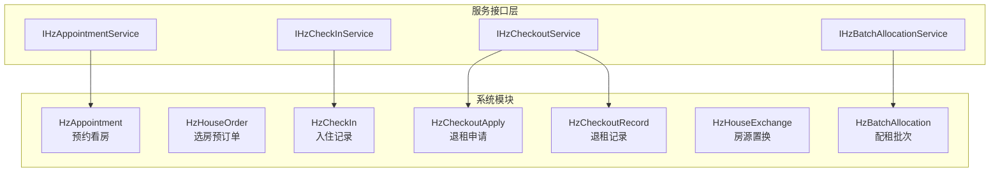
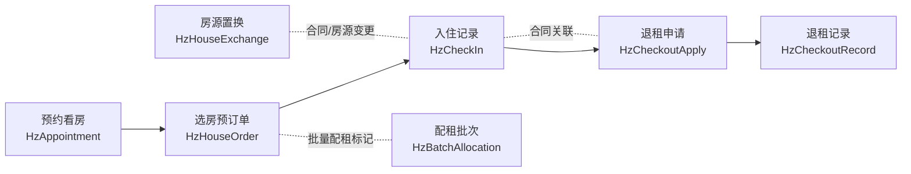
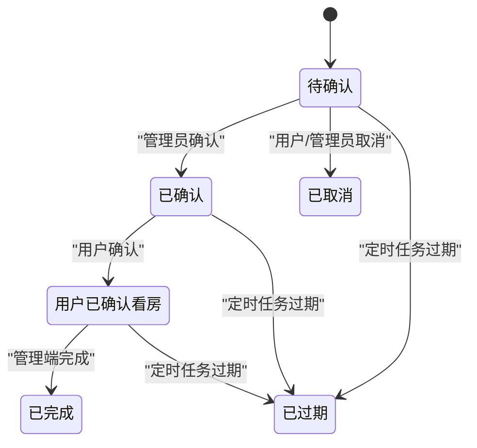
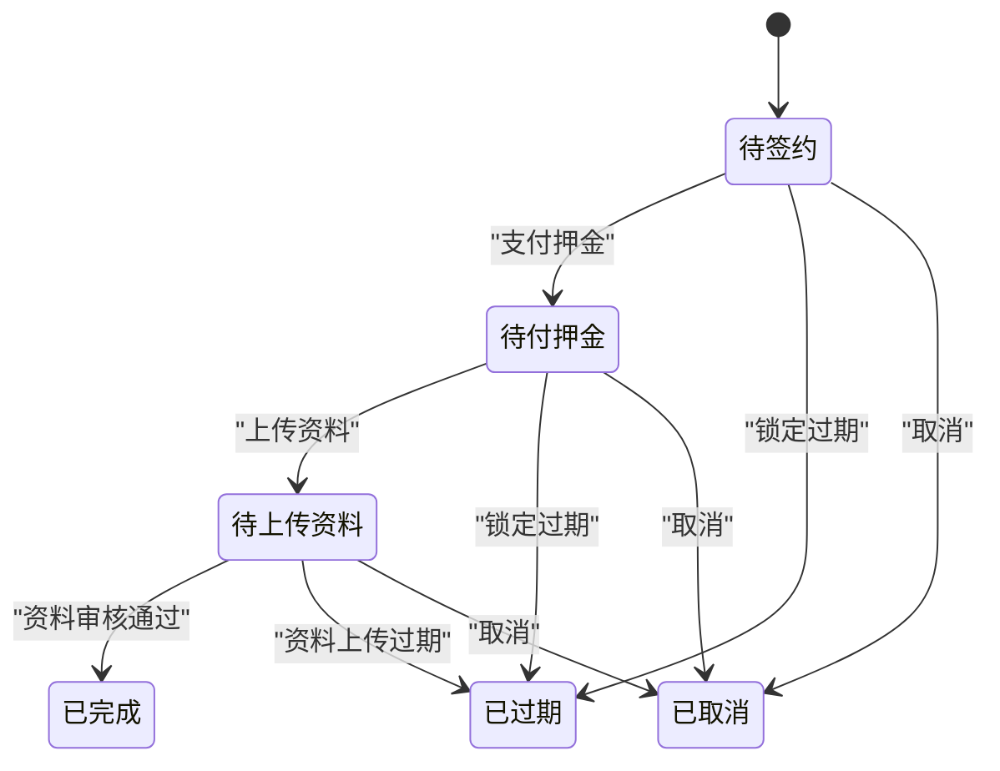
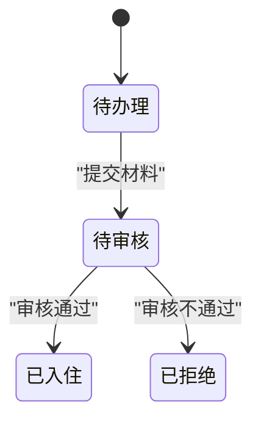
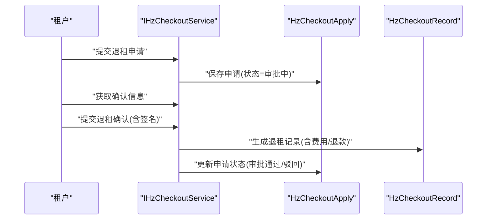
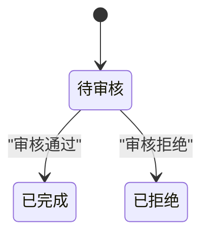
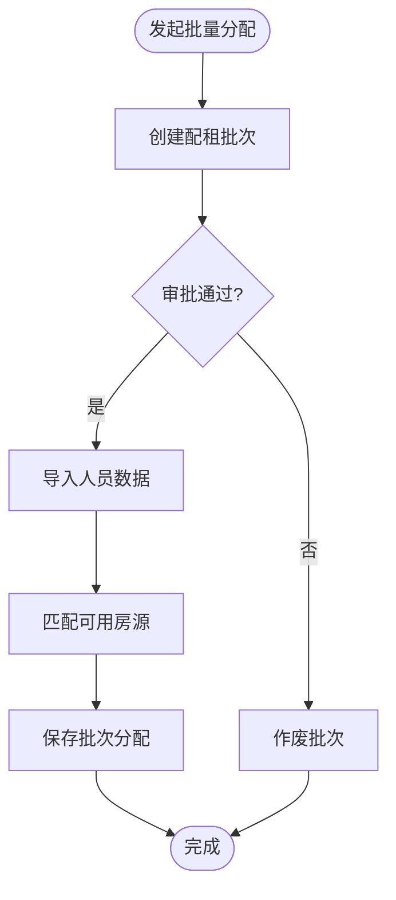
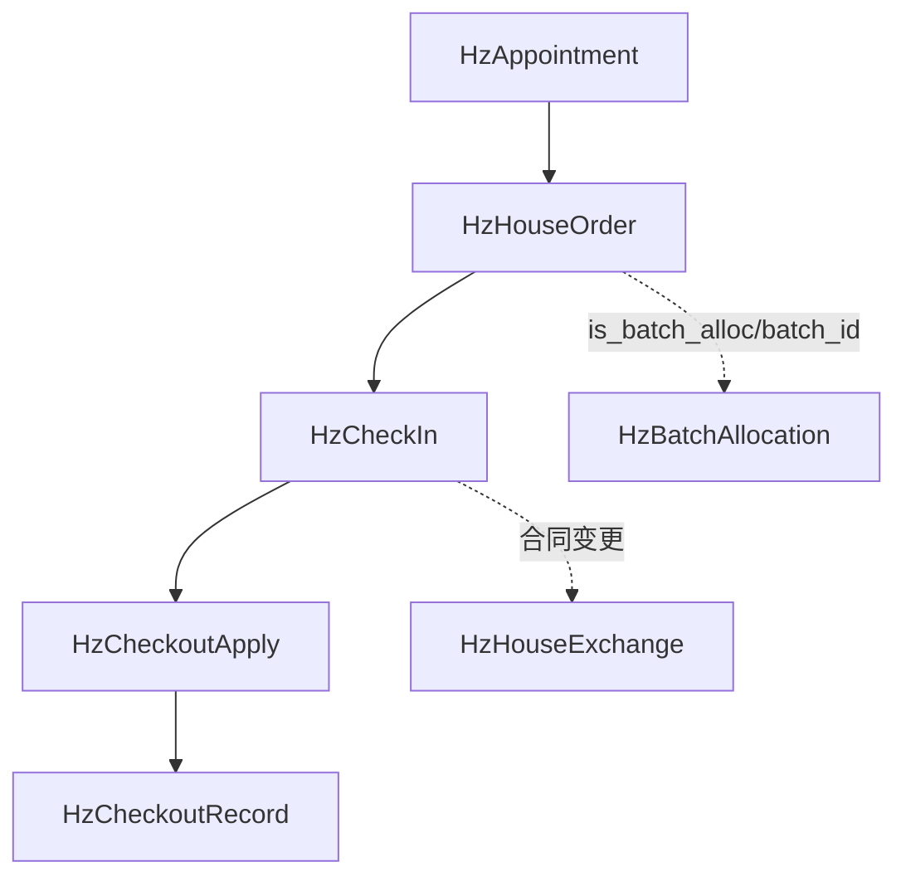

# 业务流程模型

<cite>
**本文引用的文件**
- [HzAppointment.java](file://ruoyi-system/src/main/java/com/ruoyi/system/domain/HzAppointment.java)
- [HzHouseOrder.java](file://ruoyi-system/src/main/java/com/ruoyi/system/domain/HzHouseOrder.java)
- [HzCheckIn.java](file://ruoyi-system/src/main/java/com/ruoyi/system/domain/HzCheckIn.java)
- [HzCheckoutApply.java](file://ruoyi-system/src/main/java/com/ruoyi/system/domain/HzCheckoutApply.java)
- [HzCheckoutRecord.java](file://ruoyi-system/src/main/java/com/ruoyi/system/domain/HzCheckoutRecord.java)
- [HzHouseExchange.java](file://ruoyi-system/src/main/java/com/ruoyi/system/domain/HzHouseExchange.java)
- [HzBatchAllocation.java](file://ruoyi-system/src/main/java/com/ruoyi/system/domain/HzBatchAllocation.java)
- [IHzAppointmentService.java](file://ruoyi-system/src/main/java/com/ruoyi/system/service/IHzAppointmentService.java)
- [IHzCheckInService.java](file://ruoyi-system/src/main/java/com/ruoyi/system/service/IHzCheckInService.java)
- [IHzCheckoutService.java](file://ruoyi-system/src/main/java/com/ruoyi/system/service/IHzCheckoutService.java)
- [IHzBatchAllocationService.java](file://ruoyi-system/src/main/java/com/ruoyi/system/service/IHzBatchAllocationService.java)
</cite>

## 更新摘要
**变更内容**
- 更新了退租管理模型文档，增加了HzCheckoutRecord中paymentMethod和paymentRemark字段的详细说明
- 补充了支付信息透明度和审计能力的相关内容
- 澄清了HzCheckoutRecord实体中不存在transactionNo字段的事实
- 增强了退租流程中支付信息追踪的说明

## 目录
1. [引言](#引言)
2. [项目结构](#项目结构)
3. [核心组件](#核心组件)
4. [架构总览](#架构总览)
5. [详细组件分析](#详细组件分析)
6. [依赖分析](#依赖分析)
7. [性能考虑](#性能考虑)
8. [故障排查指南](#故障排查指南)
9. [结论](#结论)
10. [附录](#附录)

## 引言
本文件面向港好住信息系统，围绕预约管理、入住退租、房源置换与批量分配四大业务域，系统化梳理实体模型、状态机设计、数据一致性保障与审计异常相关的设计要点。文档旨在帮助产品、研发与运维人员快速理解并高效落地业务流程。

## 项目结构
- 业务实体集中在系统模块的领域对象层，采用MyBatis-Plus注解映射数据库表，统一继承基础实体基类以复用通用字段与审计信息。
- 服务接口位于系统模块的服务层，定义了各业务域的对外能力边界，便于上层控制器与定时任务调用。

**图表来源**
- [HzAppointment.java:11-302](file://ruoyi-system/src/main/java/com/ruoyi/system/domain/HzAppointment.java#L11-L302)
- [HzHouseOrder.java:8-144](file://ruoyi-system/src/main/java/com/ruoyi/system/domain/HzHouseOrder.java#L8-L144)
- [HzCheckIn.java:13-602](file://ruoyi-system/src/main/java/com/ruoyi/system/domain/HzCheckIn.java#L13-L602)
- [HzCheckoutApply.java:16-242](file://ruoyi-system/src/main/java/com/ruoyi/system/domain/HzCheckoutApply.java#L16-L242)
- [HzCheckoutRecord.java:12-364](file://ruoyi-system/src/main/java/com/ruoyi/system/domain/HzCheckoutRecord.java#L12-L364)
- [HzHouseExchange.java:13-564](file://ruoyi-system/src/main/java/com/ruoyi/system/domain/HzHouseExchange.java#L13-L564)
- [HzBatchAllocation.java:14-333](file://ruoyi-system/src/main/java/com/ruoyi/system/domain/HzBatchAllocation.java#L14-L333)
- [IHzAppointmentService.java:9-176](file://ruoyi-system/src/main/java/com/ruoyi/system/service/IHzAppointmentService.java#L9-L176)
- [IHzCheckInService.java:8-105](file://ruoyi-system/src/main/java/com/ruoyi/system/service/IHzCheckInService.java#L8-L105)
- [IHzCheckoutService.java:12-184](file://ruoyi-system/src/main/java/com/ruoyi/system/service/IHzCheckoutService.java#L12-L184)
- [IHzBatchAllocationService.java:13-139](file://ruoyi-system/src/main/java/com/ruoyi/system/service/IHzBatchAllocationService.java#L13-L139)

**章节来源**
- [HzAppointment.java:11-302](file://ruoyi-system/src/main/java/com/ruoyi/system/domain/HzAppointment.java#L11-L302)
- [HzHouseOrder.java:8-144](file://ruoyi-system/src/main/java/com/ruoyi/system/domain/HzHouseOrder.java#L8-L144)
- [HzCheckIn.java:13-602](file://ruoyi-system/src/main/java/com/ruoyi/system/domain/HzCheckIn.java#L13-L602)
- [HzCheckoutApply.java:16-242](file://ruoyi-system/src/main/java/com/ruoyi/system/domain/HzCheckoutApply.java#L16-L242)
- [HzCheckoutRecord.java:12-364](file://ruoyi-system/src/main/java/com/ruoyi/system/domain/HzCheckoutRecord.java#L12-L364)
- [HzHouseExchange.java:13-564](file://ruoyi-system/src/main/java/com/ruoyi/system/domain/HzHouseExchange.java#L13-L564)
- [HzBatchAllocation.java:14-333](file://ruoyi-system/src/main/java/com/ruoyi/system/domain/HzBatchAllocation.java#L14-L333)
- [IHzAppointmentService.java:9-176](file://ruoyi-system/src/main/java/com/ruoyi/system/service/IHzAppointmentService.java#L9-L176)
- [IHzCheckInService.java:8-105](file://ruoyi-system/src/main/java/com/ruoyi/system/service/IHzCheckInService.java#L8-L105)
- [IHzCheckoutService.java:12-184](file://ruoyi-system/src/main/java/com/ruoyi/system/service/IHzCheckoutService.java#L12-L184)
- [IHzBatchAllocationService.java:13-139](file://ruoyi-system/src/main/java/com/ruoyi/system/service/IHzBatchAllocationService.java#L13-L139)

## 核心组件
- 预约管理实体：HzAppointment，覆盖预约编号、访客信息、预约时段、来源、人数、状态与取消原因等字段，并提供扩展的关联查询字段（项目名、房间号）。
- 订单管理实体：HzHouseOrder，覆盖锁定过期、资料上传过期、订单状态、合同ID、e签宝流程ID、押金账单ID、是否批量配租及批次ID等字段。
- 入住管理实体：HzCheckIn，覆盖入住单号、申请ID、合同ID、租户ID、房源ID、入住日期与实际入住日期、合租人信息、紧急联系人、计量表读数、钥匙数量、物品清单ID、入住照片、租户/管理员签名、状态与审核信息等。
- 退租管理实体：HzCheckoutApply（申请）与HzCheckoutRecord（记录），前者覆盖申请时间、计划退租日期、原因、违约金、未付账单、押金退款、申请状态、审批信息、各类费用与扣款、设施损坏描述、库存清单ID、表读数、钥匙归还数量、退租照片与租户签名；后者覆盖退租日期/时间、表读数、钥匙数量、库存清单ID、照片、损坏描述与扣款、水电/未付租金/违约金/押金退款、退款状态/时间、**付款方式/凭证/备注**、租户/管理员签名与管理员信息。
- 房源置换实体：HzHouseExchange，覆盖调换房ID、租户ID、原/新合同与房源ID/编号、调换原因、申请时间、审核结果/意见/人/时间、调换时间、新合同ID、状态与删除标志，以及丰富的关联查询字段（合同编号、申请人信息、地址、原/新租金、原/新房源详细信息）。
- 批量分配实体：HzBatchAllocation，覆盖批次ID/编号/名称、企业ID/名称、联系人/电话、项目ID/列表、人才类型、入驻起止日期、项目名称、房源数量/已分配数量、申请时间、审批状态/人/时间、批次状态、删除标志、优惠类型/免租期数等。

**章节来源**
- [HzAppointment.java:11-302](file://ruoyi-system/src/main/java/com/ruoyi/system/domain/HzAppointment.java#L11-L302)
- [HzHouseOrder.java:8-144](file://ruoyi-system/src/main/java/com/ruoyi/system/domain/HzHouseOrder.java#L8-L144)
- [HzCheckIn.java:13-602](file://ruoyi-system/src/main/java/com/ruoyi/system/domain/HzCheckIn.java#L13-L602)
- [HzCheckoutApply.java:16-242](file://ruoyi-system/src/main/java/com/ruoyi/system/domain/HzCheckoutApply.java#L16-L242)
- [HzCheckoutRecord.java:12-364](file://ruoyi-system/src/main/java/com/ruoyi/system/domain/HzCheckoutRecord.java#L12-L364)
- [HzHouseExchange.java:13-564](file://ruoyi-system/src/main/java/com/ruoyi/system/domain/HzHouseExchange.java#L13-L564)
- [HzBatchAllocation.java:14-333](file://ruoyi-system/src/main/java/com/ruoyi/system/domain/HzBatchAllocation.java#L14-L333)

## 架构总览
下图展示预约、订单、入住、退租、置换与批量分配六大实体在业务流程中的位置与交互关系。

**图表来源**
- [HzAppointment.java:11-302](file://ruoyi-system/src/main/java/com/ruoyi/system/domain/HzAppointment.java#L11-L302)
- [HzHouseOrder.java:8-144](file://ruoyi-system/src/main/java/com/ruoyi/system/domain/HzHouseOrder.java#L8-L144)
- [HzCheckIn.java:13-602](file://ruoyi-system/src/main/java/com/ruoyi/system/domain/HzCheckIn.java#L13-L602)
- [HzCheckoutApply.java:16-242](file://ruoyi-system/src/main/java/com/ruoyi/system/domain/HzCheckoutApply.java#L16-L242)
- [HzCheckoutRecord.java:12-364](file://ruoyi-system/src/main/java/com/ruoyi/system/domain/HzCheckoutRecord.java#L12-L364)
- [HzHouseExchange.java:13-564](file://ruoyi-system/src/main/java/com/ruoyi/system/domain/HzHouseExchange.java#L13-L564)
- [HzBatchAllocation.java:14-333](file://ruoyi-system/src/main/java/com/ruoyi/system/domain/HzBatchAllocation.java#L14-L333)

## 详细组件分析

### 预约管理实体（HzAppointment）与流程
- 设计要点
  - 核心字段：预约ID/编号、租户ID、房源ID、项目ID、预约日期/时段、访客姓名/电话/身份证、预约时间/来源/人数、预约状态、取消原因、确认人/时间、取消时间、删除标志。
  - 扩展字段：项目名、房间号（用于关联查询展示）。
- 流程与状态
  - 预约状态枚举：待确认、已确认、已取消、已完成、已过期。
  - 服务接口提供生成编号、检查时段可用性、按用户/房源查询、状态更新、取消、用户确认看房、管理员完成看房、自动过期处理等能力。
- 数据一致性
  - 通过服务层校验时段可用性与状态流转，避免并发导致的重复预约或状态不一致。
- 审计与异常
  - 基类提供创建/更新人与时间，服务接口提供取消与过期等操作的审计痕迹。

**图表来源**
- [HzAppointment.java:72-74](file://ruoyi-system/src/main/java/com/ruoyi/system/domain/HzAppointment.java#L72-L74)
- [IHzAppointmentService.java:117-174](file://ruoyi-system/src/main/java/com/ruoyi/system/service/IHzAppointmentService.java#L117-L174)

**章节来源**
- [HzAppointment.java:11-302](file://ruoyi-system/src/main/java/com/ruoyi/system/domain/HzAppointment.java#L11-L302)
- [IHzAppointmentService.java:9-176](file://ruoyi-system/src/main/java/com/ruoyi/system/service/IHzAppointmentService.java#L9-L176)

### 订单管理实体（HzHouseOrder）与流程
- 设计要点
  - 核心字段：订单ID/编号、租户ID、房源ID、项目ID、押金金额、月租金、锁定/资料上传过期时间、订单状态、合同ID、e签宝流程ID、押金账单ID、是否批量配租、批次ID、删除标志。
  - 扩展字段：剩余锁定/资料上传秒数（用于前端倒计时展示）。
- 流程与状态
  - 订单状态枚举：待签约、待付押金、待上传资料、已完成、已过期、已取消。
  - 与预约/入住/退租的衔接：订单完成后通常进入入住阶段；若资料过期或锁定过期，订单状态转为"已过期"。
- 数据一致性
  - 过期时间字段用于驱动定时任务自动推进状态，避免人工干预延迟。
- 审计与异常
  - e签宝流程ID便于追踪电子签约进度；合同ID与账单ID确保财务与法务链路闭环。

**图表来源**
- [HzHouseOrder.java:53-55](file://ruoyi-system/src/main/java/com/ruoyi/system/domain/HzHouseOrder.java#L53-L55)

**章节来源**
- [HzHouseOrder.java:8-144](file://ruoyi-system/src/main/java/com/ruoyi/system/domain/HzHouseOrder.java#L8-L144)

### 入住管理模型（HzCheckIn）
- 设计要点
  - 核心字段：入住记录ID/单号、申请ID、合同ID、租户ID、房源ID、入住日期/实际入住日期、合租人信息、紧急联系人、计量表读数、钥匙数量、物品清单ID、入住照片、租户/管理员签名、状态与审核信息。
  - 扩展字段：合同编号、租户昵称、房源名称、真实姓名/身份证/电话、项目/楼栋/单元/楼层/朝向/面积、合同起止日期、剩余天数、是否续租等（用于展示与统计）。
- 流程与状态
  - 状态枚举：待办理、待审核、已入住、已拒绝。
  - 服务接口提供按租户/合同查询、分页查询、新增/修改、状态更新、生成入住单号等能力。
- 数据一致性
  - 通过状态机约束审批流程，确保只有在完成必要材料与审核后才允许"已入住"。

**图表来源**
- [HzCheckIn.java:118-120](file://ruoyi-system/src/main/java/com/ruoyi/system/domain/HzCheckIn.java#L118-L120)
- [IHzCheckInService.java:90-96](file://ruoyi-system/src/main/java/com/ruoyi/system/service/IHzCheckInService.java#L90-L96)

**章节来源**
- [HzCheckIn.java:13-602](file://ruoyi-system/src/main/java/com/ruoyi/system/domain/HzCheckIn.java#L13-L602)
- [IHzCheckInService.java:8-105](file://ruoyi-system/src/main/java/com/ruoyi/system/service/IHzCheckInService.java#L8-L105)

### 退租管理模型（HzCheckoutApply 与 HzCheckoutRecord）
- 设计要点
  - 申请表（HzCheckoutApply）：申请时间、计划退租日期、原因、是否提前退租、违约金、未付账单、押金退款、申请状态、审批信息、各类费用与扣款、设施损坏描述、库存清单ID、表读数、钥匙归还数量、退租照片与租户签名。
  - 记录表（HzCheckoutRecord）：退租日期/时间、表读数、钥匙数量、库存清单ID、照片、损坏描述与扣款、水电/未付租金/违约金/押金退款、退款状态/时间、**付款方式/凭证/备注**、租户/管理员签名与管理员信息。
- 流程与状态
  - 申请状态：审批中、审批通过、审批驳回、已取消、待确认。
  - 服务接口提供申请查询/分页、审批、取消、费用保存、记录查询、确认提交、确认信息获取、合同账单查询等能力。
- 数据一致性
  - 申请与记录分离，确保审批前后的数据可追溯；记录表承载最终结算与退款闭环。
- **更新** 支付信息增强
  - **付款方式（paymentMethod）**：支持现金、支付宝、微信、银行转账四种方式，便于审计追踪。
  - **付款凭证（paymentVoucher）**：存储支付凭证图片路径，确保支付证据可追溯。
  - **付款备注（paymentRemark）**：记录支付相关的备注信息，便于后续审计和问题排查。
  - **重要说明**：HzCheckoutRecord实体中**不存在**transactionNo字段，与HzPayment实体中的transactionNo不同。

**图表来源**
- [IHzCheckoutService.java:92-182](file://ruoyi-system/src/main/java/com/ruoyi/system/service/IHzCheckoutService.java#L92-L182)
- [HzCheckoutApply.java:71-86](file://ruoyi-system/src/main/java/com/ruoyi/system/domain/HzCheckoutApply.java#L71-L86)
- [HzCheckoutRecord.java:69-93](file://ruoyi-system/src/main/java/com/ruoyi/system/domain/HzCheckoutRecord.java#L69-L93)

**章节来源**
- [HzCheckoutApply.java:16-242](file://ruoyi-system/src/main/java/com/ruoyi/system/domain/HzCheckoutApply.java#L16-L242)
- [HzCheckoutRecord.java:12-364](file://ruoyi-system/src/main/java/com/ruoyi/system/domain/HzCheckoutRecord.java#L12-L364)
- [IHzCheckoutService.java:12-184](file://ruoyi-system/src/main/java/com/ruoyi/system/service/IHzCheckoutService.java#L12-L184)

### 房源置换模型（HzHouseExchange）
- 设计要点
  - 核心字段：调换房ID、租户ID、原/新合同与房源ID/编号、调换原因、申请时间、审核结果/意见/人/时间、调换时间、新合同ID、状态与删除标志。
  - 扩展字段：合同编号、申请人姓名/身份证/电话、房间地址、原/新租金、原/新房源详细信息（项目/楼栋/单元/房间号/完整地址）。
- 流程与状态
  - 状态：待审核、已完成、已拒绝；审核结果：待审核、通过、拒绝。
- 数据一致性
  - 通过原/新合同与房源ID确保置换前后合同与房源的正确关联，避免错配。

**图表来源**
- [HzHouseExchange.java:82-84](file://ruoyi-system/src/main/java/com/ruoyi/system/domain/HzHouseExchange.java#L82-L84)
- [HzHouseExchange.java:58-60](file://ruoyi-system/src/main/java/com/ruoyi/system/domain/HzHouseExchange.java#L58-L60)

**章节来源**
- [HzHouseExchange.java:13-564](file://ruoyi-system/src/main/java/com/ruoyi/system/domain/HzHouseExchange.java#L13-L564)

### 批量分配模型（HzBatchAllocation）
- 设计要点
  - 核心字段：批次ID/编号/名称、企业ID/名称、联系人/电话、项目ID/列表、人才类型、入驻起止日期、项目名称、房源数量/已分配数量、申请时间、审批状态/人/时间、批次状态、删除标志、优惠类型/免租期数。
- 流程与状态
  - 批次状态：进行中、已完成、已作废；审批状态：待审批、已通过、已拒绝。
  - 服务接口提供查询/分页、新增/修改/删除、审批/作废、下载模板、导入人员、保存批次分配、获取批次房源/人员列表等能力。
- 数据一致性
  - 通过项目ID列表与可用房源查询，结合导入模板与参数校验，确保分配过程可控与可审计。

**图表来源**
- [IHzBatchAllocationService.java:68-116](file://ruoyi-system/src/main/java/com/ruoyi/system/service/IHzBatchAllocationService.java#L68-L116)
- [HzBatchAllocation.java:104-106](file://ruoyi-system/src/main/java/com/ruoyi/system/domain/HzBatchAllocation.java#L104-L106)

**章节来源**
- [HzBatchAllocation.java:14-333](file://ruoyi-system/src/main/java/com/ruoyi/system/domain/HzBatchAllocation.java#L14-L333)
- [IHzBatchAllocationService.java:13-139](file://ruoyi-system/src/main/java/com/ruoyi/system/service/IHzBatchAllocationService.java#L13-L139)

## 依赖分析
- 组件耦合
  - 预约与订单：预约成功后通常生成订单，订单状态推进到"待上传资料"后进入入住准备。
  - 订单与入住：订单完成后触发入住申请，入住状态推进至"已入住"。
  - 入住与退租：入住期间产生退租申请，经审批后形成退租记录并完成退款。
  - 批量分配与订单：批量分配会打上"是否批量配租"标记，影响订单状态流转。
  - 置换与入住：置换可能涉及合同与房源变更，需与入住记录保持一致。
- 外部依赖
  - e签宝流程ID用于电子签约追踪。
  - 定时任务用于自动过期与状态推进（如预约过期、订单过期）。

**图表来源**
- [HzHouseOrder.java:69-75](file://ruoyi-system/src/main/java/com/ruoyi/system/domain/HzHouseOrder.java#L69-L75)
- [HzBatchAllocation.java:104-106](file://ruoyi-system/src/main/java/com/ruoyi/system/domain/HzBatchAllocation.java#L104-L106)
- [HzHouseExchange.java:30-80](file://ruoyi-system/src/main/java/com/ruoyi/system/domain/HzHouseExchange.java#L30-L80)

**章节来源**
- [HzHouseOrder.java:69-75](file://ruoyi-system/src/main/java/com/ruoyi/system/domain/HzHouseOrder.java#L69-L75)
- [HzBatchAllocation.java:104-106](file://ruoyi-system/src/main/java/com/ruoyi/system/domain/HzBatchAllocation.java#L104-L106)
- [HzHouseExchange.java:30-80](file://ruoyi-system/src/main/java/com/ruoyi/system/domain/HzHouseExchange.java#L30-L80)

## 性能考虑
- 状态机驱动的定时任务
  - 预约与订单的过期处理建议通过定时任务批量扫描与更新，避免高频写入带来的锁竞争。
- 分页与查询优化
  - 对预约、入住、退租等高频查询场景，建议基于常用过滤字段建立索引（如租户ID、合同ID、项目ID、状态、时间范围）。
- 批量导入与分配
  - 批量分配的导入模板与参数校验应在服务层集中处理，减少重复IO与事务开销。

## 故障排查指南
- 预约相关
  - 症状：时段重复预约或状态异常。
  - 排查：检查服务层时段可用性校验与状态机转换逻辑；核对定时任务是否执行过期处理。
- 订单相关
  - 症状：订单长时间停留在"待上传资料"。
  - 排查：检查锁定/资料上传过期时间与定时任务；确认e签宝流程ID与合同ID是否正确。
- 入住相关
  - 症状：入住状态卡在"待审核"。
  - 排查：检查材料完整性与审核流程；核对合同与房源信息一致性。
- 退租相关
  - 症状：退租费用计算不准确或退款未到账。
  - 排查：核对HzCheckoutApply与HzCheckoutRecord的费用字段与状态；检查付款方式/凭证与退款状态。
  - **更新** 支付信息相关
    - 检查HzCheckoutRecord的paymentMethod字段是否正确设置。
    - 验证paymentVoucher图片路径的有效性。
    - 确认paymentRemark字段是否包含必要的支付说明。
    - 注意HzCheckoutRecord实体中**不存在**transactionNo字段。
- 批量分配相关
  - 症状：导入失败或分配不匹配。
  - 排查：检查模板格式与导入参数；核对项目ID列表与可用房源查询结果。

**章节来源**
- [IHzAppointmentService.java:58-65](file://ruoyi-system/src/main/java/com/ruoyi/system/service/IHzAppointmentService.java#L58-L65)
- [IHzCheckoutService.java:111-116](file://ruoyi-system/src/main/java/com/ruoyi/system/service/IHzCheckoutService.java#L111-L116)
- [IHzBatchAllocationService.java:87-108](file://ruoyi-system/src/main/java/com/ruoyi/system/service/IHzBatchAllocationService.java#L87-L108)

## 结论
本业务流程模型以状态机为核心，围绕预约、订单、入住、退租、置换与批量分配构建了清晰的数据流与控制流。通过服务接口与实体模型的协同，实现了业务闭环与数据一致性保障。建议在生产环境中配合完善的定时任务、索引策略与审计日志，持续优化性能与稳定性。

## 附录
- 审计日志与异常
  - 建议在服务层的关键操作点记录操作人、操作时间、操作类型与影响范围，便于问题定位与合规审计。
  - 对于异常情况（如导入失败、状态冲突、超时等），应返回明确的错误码与提示信息，避免静默失败。
- **更新** 支付信息审计增强
  - HzCheckoutRecord实体的paymentMethod、paymentVoucher、paymentRemark字段提供了完整的支付信息追踪能力。
  - 通过这些字段可以实现支付方式、支付凭证和支付备注的完整审计轨迹。
  - 注意与HzPayment实体中的transactionNo字段的区别，HzCheckoutRecord实体中不包含此字段。