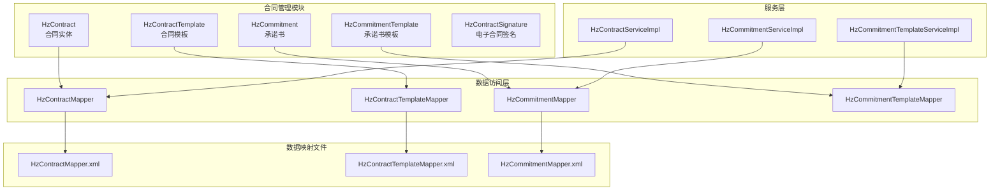
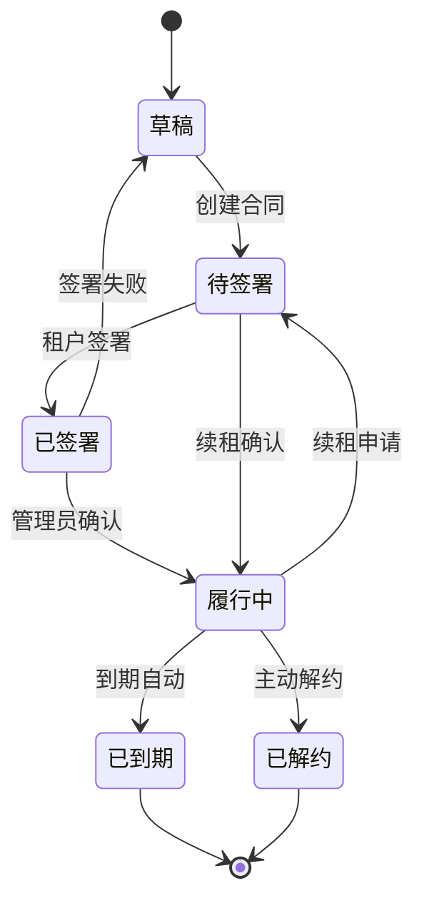
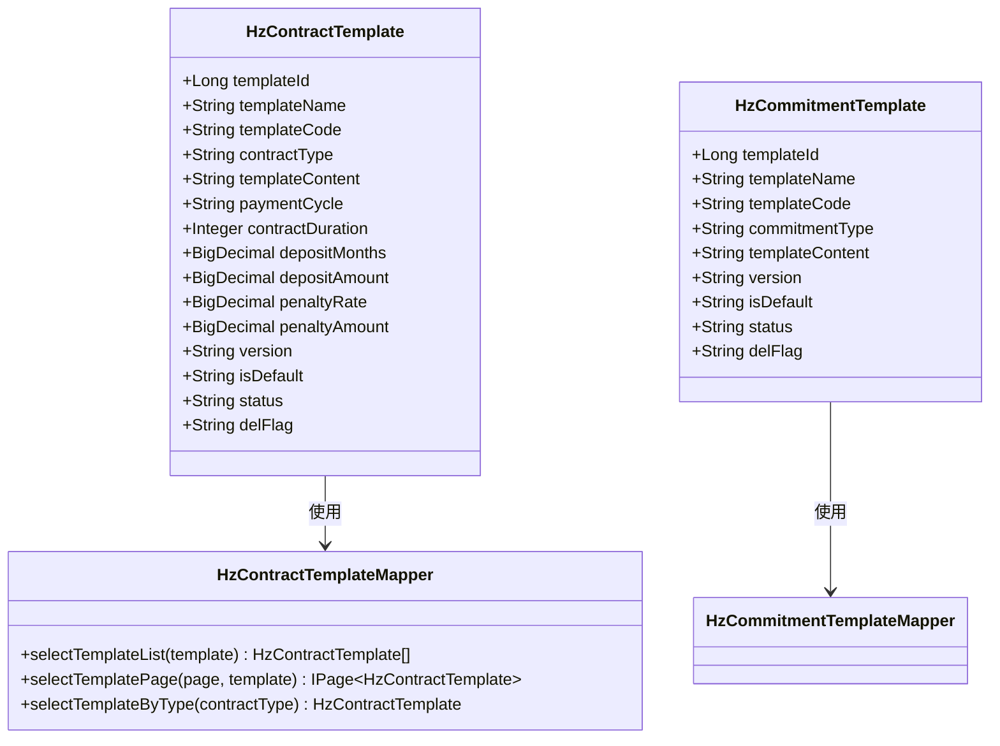
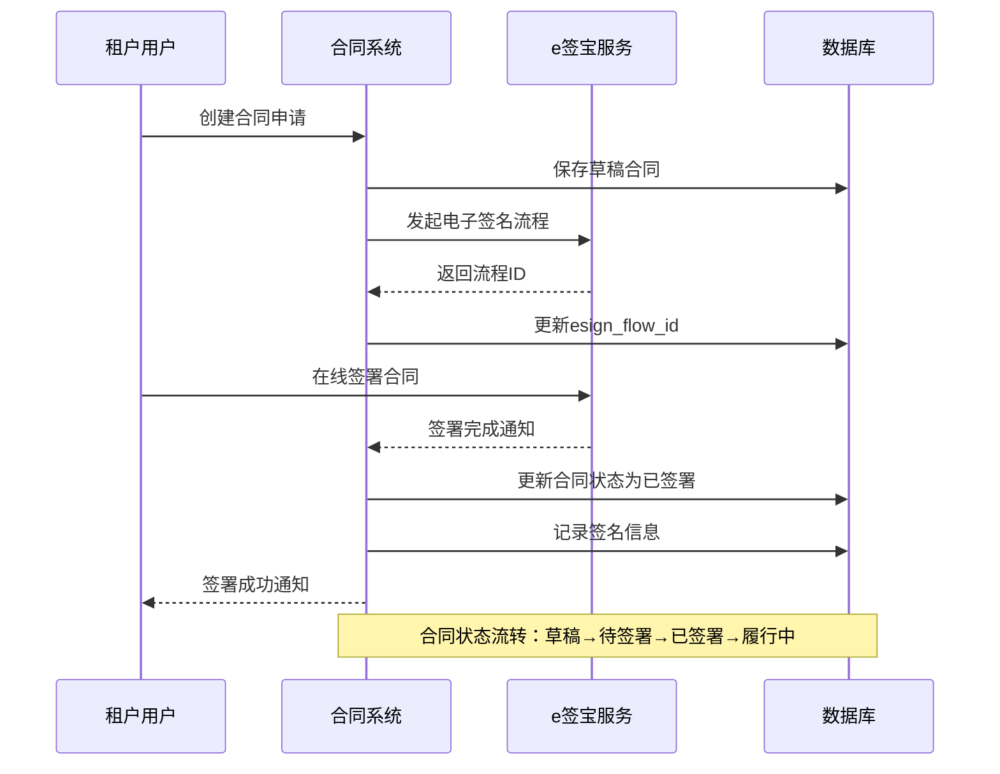
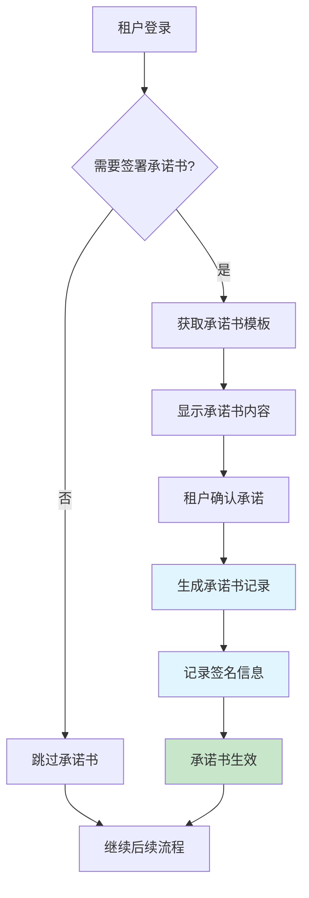
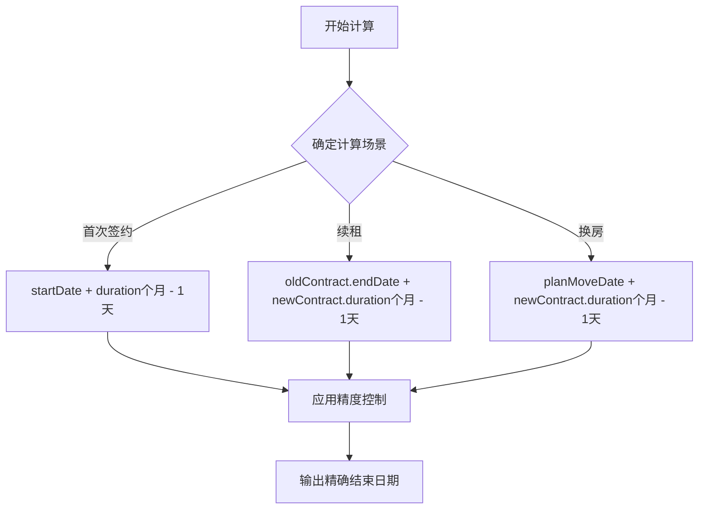
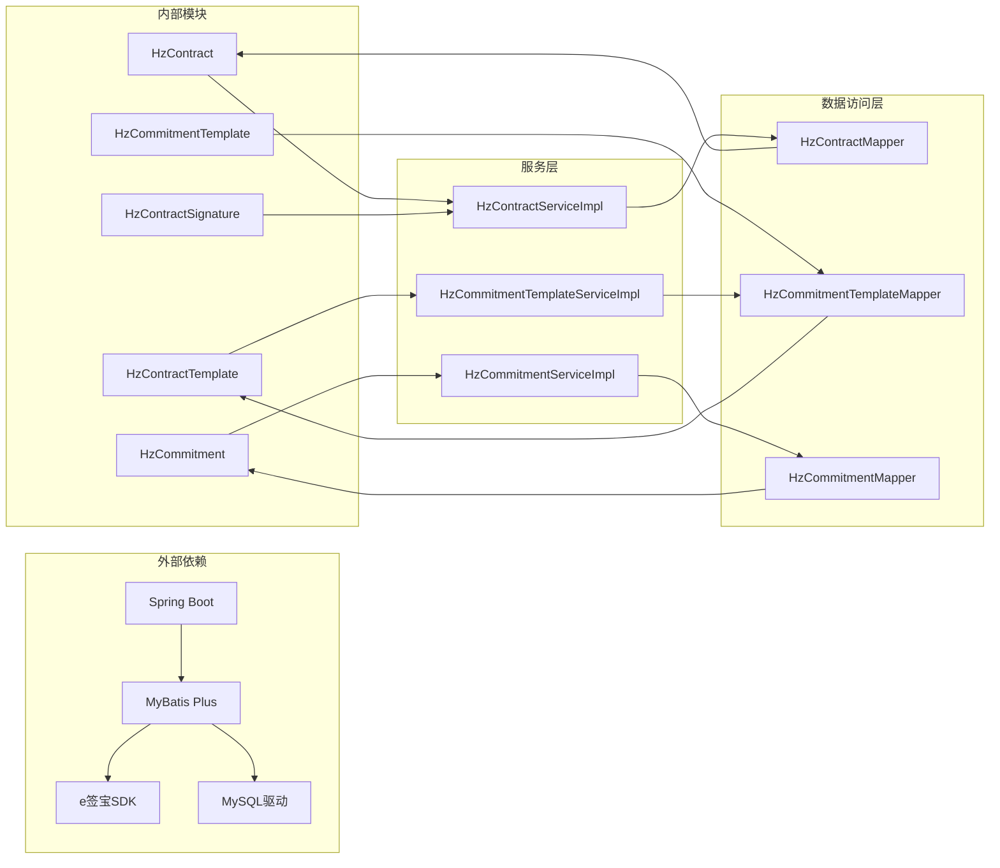

# 合同管理模型

<cite>
**本文档引用的文件**
- [HzContract.java](file://ruoyi-system/src/main/java/com/ruoyi/system/domain/HzContract.java)
- [HzContractTemplate.java](file://ruoyi-system/src/main/java/com/ruoyi/system/domain/HzContractTemplate.java)
- [HzCommitment.java](file://ruoyi-system/src/main/java/com/ruoyi/system/domain/HzCommitment.java)
- [HzCommitmentTemplate.java](file://ruoyi-system/src/main/java/com/ruoyi/system/domain/HzCommitmentTemplate.java)
- [HzContractSignature.java](file://ruoyi-system/src/main/java/com/ruoyi/system/domain/HzContractSignature.java)
- [HzContractMapper.xml](file://ruoyi-system/src/main/resources/mapper/system/HzContractMapper.xml)
- [HzContractTemplateMapper.xml](file://ruoyi-system/src/main/resources/mapper/system/HzContractTemplateMapper.xml)
- [HzCommitmentMapper.xml](file://ruoyi-system/src/main/resources/mapper/system/HzCommitmentMapper.xml)
- [HzContractServiceImpl.java](file://ruoyi-system/src/main/java/com/ruoyi/system/service/impl/HzContractServiceImpl.java)
- [HzCommitmentTemplateMapper.java](file://ruoyi-system/src/main/java/com/ruoyi/system/mapper/HzCommitmentTemplateMapper.java)
- [HzCommitmentTemplateServiceImpl.java](file://ruoyi-system/src/main/java/com/ruoyi/system/service/impl/HzCommitmentTemplateServiceImpl.java)
- [HzCommitmentServiceImpl.java](file://ruoyi-system/src/main/java/com/ruoyi/system/service/impl/HzCommitmentServiceImpl.java)
- [EsignServiceImpl.java](file://ruoyi-system/src/main/java/com/ruoyi/system/service/impl/EsignServiceImpl.java)
- [HzCheckoutServiceImpl.java](file://ruoyi-system/src/main/java/com/ruoyi/system/service/impl/HzCheckoutServiceImpl.java)
</cite>

## 更新摘要
**所做更改**
- 更新了合同租期管理部分，增加了日期计算精度改进的说明
- 新增了电子合同签署流程中日期计算逻辑的详细说明
- 补充了退租租金计算中的精度控制机制
- 更新了相关代码示例和业务规则说明

## 目录
1. [简介](#简介)
2. [项目结构](#项目结构)
3. [核心组件](#核心组件)
4. [架构概览](#架构概览)
5. [详细组件分析](#详细组件分析)
6. [依赖分析](#依赖分析)
7. [性能考虑](#性能考虑)
8. [故障排除指南](#故障排除指南)
9. [结论](#结论)

## 简介

港好住信息系统合同管理模型是整个租赁管理系统的核心组成部分，负责管理租户与房东之间的法律关系和权利义务。该模型涵盖了从合同创建、签署到履行、到期、解约的全生命周期管理。

本系统采用现代化的Spring Boot架构，基于MyBatis Plus进行数据持久化，实现了完整的合同管理功能。合同管理模型主要包括四个核心实体：HzContract（合同实体）、HzContractTemplate（合同模板）、HzCommitment（承诺书）和HzCommitmentTemplate（承诺书模板），以及HzContractSignature（电子合同签名）。

**更新** 本版本重点改进了日期计算逻辑的精度控制，确保租期结束日期计算更加准确可靠。

## 项目结构

合同管理模块在系统中的组织结构如下：



**图表来源**
- [HzContract.java:1-606](file://ruoyi-system/src/main/java/com/ruoyi/system/domain/HzContract.java#L1-L606)
- [HzContractTemplate.java:1-228](file://ruoyi-system/src/main/java/com/ruoyi/system/domain/HzContractTemplate.java#L1-L228)
- [HzCommitment.java:1-174](file://ruoyi-system/src/main/java/com/ruoyi/system/domain/HzCommitment.java#L1-L174)
- [HzCommitmentTemplate.java:1-148](file://ruoyi-system/src/main/java/com/ruoyi/system/domain/HzCommitmentTemplate.java#L1-L148)
- [HzContractSignature.java:1-174](file://ruoyi-system/src/main/java/com/ruoyi/system/domain/HzContractSignature.java#L1-L174)

## 核心组件

### 合同实体（HzContract）

HzContract是合同管理的核心实体，包含了合同的完整信息和状态管理。该实体设计遵循了领域驱动设计原则，将合同相关的所有属性都封装在一个统一的对象中。

**主要特性：**
- 完整的合同基本信息：合同编号、类型、租期、租金等
- 租户和房源关联信息
- 合同状态的完整生命周期管理
- 电子合同签署相关信息
- 虚拟字段支持跨表查询

**关键字段说明：**
- 合同ID：唯一标识符，自增主键
- 合同编号：系统自动生成的唯一合同标识
- 合同类型：首次签约、续租、换房三种类型
- 合同状态：草稿、待签署、已签署、履行中、已到期、已解约
- 租金和押金：支持BigDecimal精度计算
- 租期管理：月份数、缴费周期、免租期等

**更新** 租期结束日期计算采用精确的日期算法，确保租期边界计算的准确性。

### 合同模板（HzContractTemplate）

HzContractTemplate提供了标准化的合同模板管理功能，支持不同类型的租赁合同模板配置。

**设计特点：**
- 支持多种合同类型：人才公寓、保租房、市场租赁
- 模板版本管理：通过版本号控制模板更新
- 配置化参数：付款周期、合同期限、押金设置等
- 默认模板机制：确保系统始终有可用的默认模板

**模板参数：**
- 合同类型标识
- 模板内容（HTML格式）
- 付款周期配置
- 合同期限设置
- 押金计算规则
- 违约金条款

### 承诺书模型

承诺书模型包括HzCommitment和HzCommitmentTemplate两个实体，用于管理租户的各种承诺声明。

**HzCommitment实体：**
- 承诺书类型：资格申请承诺、入住承诺、其他类型
- 签署信息：时间、IP地址、设备信息
- 数字签名：支持手写签名图片
- 状态管理：有效/失效状态控制

**HzCommitmentTemplate实体：**
- 模板类型：与合同类型对应
- 模板内容：HTML格式的承诺书模板
- 版本控制：模板更新和回滚
- 默认模板：系统默认使用的承诺书模板

### 电子合同签名（HzContractSignature）

HzContractSignature专门用于管理电子合同的数字签名信息，支持多签名人参与的合同签署流程。

**签名管理：**
- 多签名人支持：租户、房东、管理员
- 签名状态跟踪：未签署、已签署状态
- 签名证据保全：IP地址、设备信息记录
- 签名图片存储：完整的数字签名证据链

## 架构概览

合同管理系统的整体架构采用了经典的分层架构模式，确保了系统的可维护性和扩展性。

```mermaid
graph TB
subgraph "表现层"
UI[前端界面]
API[REST API接口]
end
subgraph "业务逻辑层"
SVC[服务实现类]
VALID[业务验证]
end
subgraph "数据访问层"
MAP[Mapper接口]
SQL[XML映射文件]
end
subgraph "数据模型层"
ENT[实体类]
DTO[数据传输对象]
end
subgraph "数据库层"
DB[(MySQL数据库)]
ESIGN[e签宝电子签名)
end
UI --> API
API --> SVC
SVC --> VALID
SVC --> MAP
MAP --> SQL
MAP --> ENT
ENT --> DB
SVC --> ESIGN
VALID -.-> SVC
DTO -.-> SVC
```

**图表来源**
- [HzContractServiceImpl.java:35-334](file://ruoyi-system/src/main/java/com/ruoyi/system/service/impl/HzContractServiceImpl.java#L35-L334)
- [HzContractMapper.xml:1-66](file://ruoyi-system/src/main/resources/mapper/system/HzContractMapper.xml#L1-L66)
- [HzContractTemplateMapper.xml:1-84](file://ruoyi-system/src/main/resources/mapper/system/HzContractTemplateMapper.xml#L1-L84)
- [HzCommitmentMapper.xml:1-158](file://ruoyi-system/src/main/resources/mapper/system/HzCommitmentMapper.xml#L1-L158)

系统架构的关键特点：

1. **清晰的分层结构**：表现层、业务逻辑层、数据访问层职责明确
2. **依赖注入**：通过Spring框架实现松耦合的组件依赖
3. **事务管理**：关键业务操作采用事务保证数据一致性
4. **缓存策略**：合理使用缓存提高系统性能
5. **异常处理**：完善的异常处理和错误恢复机制

## 详细组件分析

### 合同生命周期管理

合同生命周期管理是系统的核心功能之一，涵盖了从创建到终止的完整过程。



**图表来源**
- [HzContract.java:139-142](file://ruoyi-system/src/main/java/com/ruoyi/system/domain/HzContract.java#L139-L142)
- [HzContractServiceImpl.java:304-334](file://ruoyi-system/src/main/java/com/ruoyi/system/service/impl/HzContractServiceImpl.java#L304-L334)

**生命周期状态说明：**

1. **草稿状态（0）**：合同刚创建时的状态，可以修改和完善
2. **待签署状态（1）**：等待租户进行电子签名
3. **已签署状态（2）**：租户完成电子签名，等待管理员确认
4. **履行中状态（3）**：管理员确认后正式生效，进入合同履行期
5. **已到期状态（4）**：合同期满自动转为到期状态
6. **已解约状态（5）**：提前解除合同

### 合同模板系统

合同模板系统提供了灵活的模板管理机制，支持不同类型的租赁合同模板配置。



**图表来源**
- [HzContractTemplate.java:13-228](file://ruoyi-system/src/main/java/com/ruoyi/system/domain/HzContractTemplate.java#L13-L228)
- [HzContractTemplateMapper.xml:7-84](file://ruoyi-system/src/main/resources/mapper/system/HzContractTemplateMapper.xml#L7-L84)
- [HzCommitmentTemplate.java:11-148](file://ruoyi-system/src/main/java/com/ruoyi/system/domain/HzCommitmentTemplate.java#L11-L148)

**模板设计原则：**

1. **类型化管理**：支持不同类型租赁合同的模板分离
2. **版本控制**：通过版本号管理模板变更历史
3. **默认机制**：确保系统始终有可用的默认模板
4. **配置化参数**：通过参数化配置实现模板的灵活性

### 电子合同签署流程

电子合同签署流程集成了e签宝电子签名服务，提供了完整的数字签名解决方案。



**图表来源**
- [HzContract.java:156-158](file://ruoyi-system/src/main/java/com/ruoyi/system/domain/HzContract.java#L156-L158)
- [HzContractSignature.java:24-62](file://ruoyi-system/src/main/java/com/ruoyi/system/domain/HzContractSignature.java#L24-L62)
- [HzContractServiceImpl.java:246-272](file://ruoyi-system/src/main/java/com/ruoyi/system/service/impl/HzContractServiceImpl.java#L246-L272)

**签署流程特点：**

1. **异步处理**：电子签名流程采用异步处理，提升用户体验
2. **状态跟踪**：完整的签署状态跟踪和回执机制
3. **证据保全**：记录签署时间、IP地址、设备信息等证据
4. **多签名人**：支持租户、房东、管理员等多签名人参与

**更新** 电子合同签署流程中的日期计算采用精确的日期算法，确保租期结束日期的准确性。

### 承诺书管理

承诺书管理功能提供了租户各类承诺声明的标准化管理。



**图表来源**
- [HzCommitment.java:24-62](file://ruoyi-system/src/main/java/com/ruoyi/system/domain/HzCommitment.java#L24-L62)
- [HzCommitmentTemplateServiceImpl.java:43-66](file://ruoyi-system/src/main/java/com/ruoyi/system/service/impl/HzCommitmentTemplateServiceImpl.java#L43-L66)
- [HzCommitmentServiceImpl.java:38-55](file://ruoyi-system/src/main/java/com/ruoyi/system/service/impl/HzCommitmentServiceImpl.java#L38-L55)

**承诺书类型：**
- 资格申请承诺：租户申请租赁资格时的承诺声明
- 入住承诺：租户入住时的合规承诺
- 其他承诺：根据业务需要定制的承诺类型

### 日期计算精度改进

**更新** 系统在多个关键业务场景中实施了日期计算精度改进，确保租期结束日期计算更加准确。

#### 租期结束日期计算

在合同签署和续租过程中，系统采用精确的日期计算算法：



**图表来源**
- [EsignServiceImpl.java:1150-1266](file://ruoyi-system/src/main/java/com/ruoyi/system/service/impl/EsignServiceImpl.java#L1150-L1266)

#### 退租租金按日精算

系统实现了精确的按日租金计算机制：

1. **日租金计算精度**：日租金 = 月租金 ÷ 当期天数，保留2位小数（HALF_UP）
2. **入住天数计算**：含两端计算，即 end - start + 1
3. **当期应付金额**：日租金 × 入住天数，最终保留2位小数

**章节来源**
- [HzContractServiceImpl.java:35-334](file://ruoyi-system/src/main/java/com/ruoyi/system/service/impl/HzContractServiceImpl.java#L35-L334)
- [HzContractMapper.xml:7-66](file://ruoyi-system/src/main/resources/mapper/system/HzContractMapper.xml#L7-L66)
- [HzContractTemplateMapper.xml:7-84](file://ruoyi-system/src/main/resources/mapper/system/HzContractTemplateMapper.xml#L7-L84)
- [HzCommitmentMapper.xml:7-158](file://ruoyi-system/src/main/resources/mapper/system/HzCommitmentMapper.xml#L7-L158)
- [EsignServiceImpl.java:1045-1266](file://ruoyi-system/src/main/java/com/ruoyi/system/service/impl/EsignServiceImpl.java#L1045-L1266)
- [HzCheckoutServiceImpl.java:924-1046](file://ruoyi-system/src/main/java/com/ruoyi/system/service/impl/HzCheckoutServiceImpl.java#L924-L1046)

## 依赖分析

合同管理模块的依赖关系体现了清晰的分层架构和模块化设计。



**图表来源**
- [HzContractServiceImpl.java:35-36](file://ruoyi-system/src/main/java/com/ruoyi/system/service/impl/HzContractServiceImpl.java#L35-L36)
- [HzCommitmentTemplateServiceImpl.java:23-26](file://ruoyi-system/src/main/java/com/ruoyi/system/service/impl/HzCommitmentTemplateServiceImpl.java#L23-L26)
- [HzCommitmentServiceImpl.java:38-48](file://ruoyi-system/src/main/java/com/ruoyi/system/service/impl/HzCommitmentServiceImpl.java#L38-L48)

**依赖关系特点：**

1. **低耦合高内聚**：各模块职责明确，依赖关系清晰
2. **接口隔离**：通过接口定义规范模块间的交互
3. **依赖倒置**：上层模块不直接依赖下层具体实现
4. **可测试性**：良好的依赖关系便于单元测试和集成测试

## 性能考虑

合同管理系统的性能优化主要体现在以下几个方面：

### 数据库优化

1. **索引策略**：为常用查询字段建立合适的索引
2. **查询优化**：使用MyBatis的延迟加载和批量查询
3. **连接池配置**：合理配置数据库连接池参数
4. **分页查询**：大量数据采用分页查询避免内存溢出

### 缓存策略

1. **模板缓存**：合同模板和承诺书模板的缓存
2. **状态缓存**：常用状态查询结果的缓存
3. **用户信息缓存**：租户和房东信息的缓存

### 异步处理

1. **电子签名异步**：e签宝签名流程的异步处理
2. **文件上传异步**：合同文件上传的异步处理
3. **通知发送异步**：各种业务通知的异步发送

**更新** 日期计算精度改进提升了系统的计算性能，减少了因精度问题导致的重复计算和错误重试。

## 故障排除指南

### 常见问题及解决方案

**合同状态异常**
- 问题描述：合同状态无法正常流转
- 解决方案：检查状态转换条件和业务逻辑
- 相关代码：[HzContractServiceImpl.java:304-334](file://ruoyi-system/src/main/java/com/ruoyi/system/service/impl/HzContractServiceImpl.java#L304-L334)

**电子签名失败**
- 问题描述：电子签名流程异常中断
- 解决方案：检查e签宝服务配置和网络连接
- 相关代码：[HzContract.java:156-158](file://ruoyi-system/src/main/java/com/ruoyi/system/domain/HzContract.java#L156-L158)

**模板加载失败**
- 问题描述：合同模板无法正确加载
- 解决方案：检查模板状态和默认标记
- 相关代码：[HzContractTemplateMapper.xml:77-81](file://ruoyi-system/src/main/resources/mapper/system/HzContractTemplateMapper.xml#L77-L81)

**日期计算错误**
- 问题描述：租期结束日期计算不准确
- 解决方案：检查日期计算逻辑和精度控制
- 相关代码：[EsignServiceImpl.java:1150-1266](file://ruoyi-system/src/main/java/com/ruoyi/system/service/impl/EsignServiceImpl.java#L1150-L1266)

**章节来源**
- [HzContractServiceImpl.java:304-334](file://ruoyi-system/src/main/java/com/ruoyi/system/service/impl/HzContractServiceImpl.java#L304-L334)
- [HzContract.java:156-158](file://ruoyi-system/src/main/java/com/ruoyi/system/domain/HzContract.java#L156-L158)
- [HzContractTemplateMapper.xml:77-81](file://ruoyi-system/src/main/resources/mapper/system/HzContractTemplateMapper.xml#L77-L81)
- [EsignServiceImpl.java:1150-1266](file://ruoyi-system/src/main/java/com/ruoyi/system/service/impl/EsignServiceImpl.java#L1150-L1266)

## 结论

港好住信息系统的合同管理模型设计合理，功能完善，具有以下特点：

1. **完整性**：涵盖了合同管理的全生命周期，从创建到终止
2. **灵活性**：支持多种合同类型和模板配置
3. **安全性**：完善的电子签名和证据保全机制
4. **可扩展性**：模块化设计便于功能扩展和维护
5. **易用性**：清晰的业务流程和用户界面
6. **准确性**：最新的日期计算精度改进确保了数据计算的准确性

**更新** 本次更新重点加强了日期计算逻辑的精度控制，通过精确的日期算法和严格的精度管理，确保租期结束日期计算更加准确可靠，为合同管理提供了更坚实的数据基础。

该模型为港好住信息系统的租赁管理提供了坚实的技术基础，能够满足复杂的业务需求，并为未来的功能扩展预留了充足的空间。