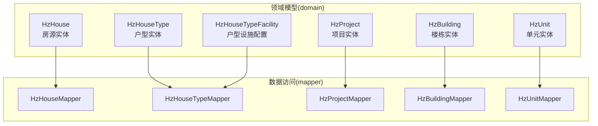
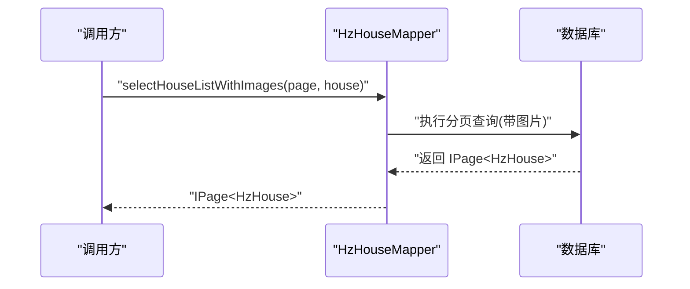
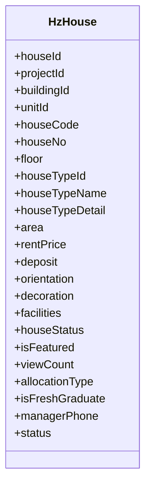
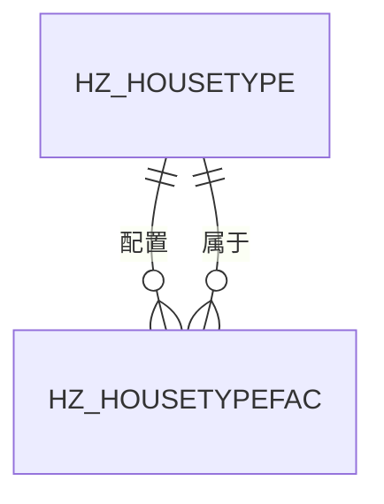
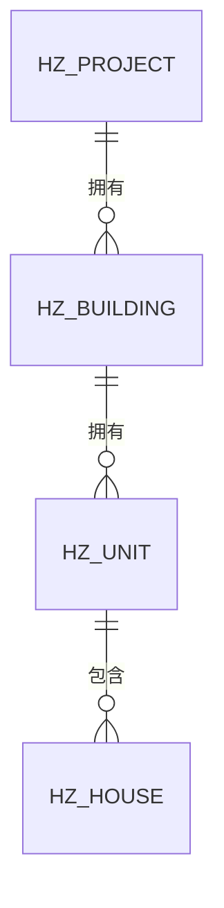
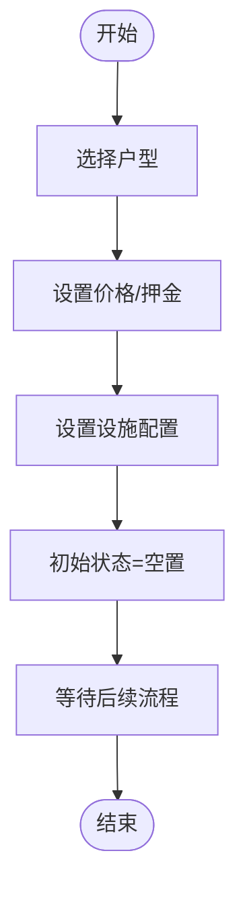
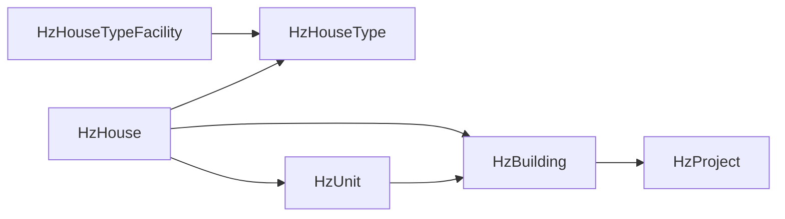

# 房源管理模型

<cite>
**本文引用的文件**
- [HzHouse.java](file://ruoyi-system/src/main/java/com/ruoyi/system/domain/HzHouse.java)
- [HzHouseType.java](file://ruoyi-system/src/main/java/com/ruoyi/system/domain/HzHouseType.java)
- [HzHouseTypeFacility.java](file://ruoyi-system/src/main/java/com/ruoyi/system/domain/HzHouseTypeFacility.java)
- [HzProject.java](file://ruoyi-system/src/main/java/com/ruoyi/system/domain/HzProject.java)
- [HzBuilding.java](file://ruoyi-system/src/main/java/com/ruoyi/system/domain/HzBuilding.java)
- [HzUnit.java](file://ruoyi-system/src/main/java/com/ruoyi/system/domain/HzUnit.java)
- [HzHouseMapper.java](file://ruoyi-system/src/main/java/com/ruoyi/system/mapper/HzHouseMapper.java)
- [HzHouseTypeMapper.java](file://ruoyi-system/src/main/java/com/ruoyi/system/mapper/HzHouseTypeMapper.java)
- [HzProjectMapper.java](file://ruoyi-system/src/main/java/com/ruoyi/system/mapper/HzProjectMapper.java)
- [HzBuildingMapper.java](file://ruoyi-system/src/main/java/com/ruoyi/system/mapper/HzBuildingMapper.java)
- [HzUnitMapper.java](file://ruoyi-system/src/main/java/com/ruoyi/system/mapper/HzUnitMapper.java)
</cite>

## 目录
1. [简介](#简介)
2. [项目结构](#项目结构)
3. [核心组件](#核心组件)
4. [架构概览](#架构概览)
5. [详细组件分析](#详细组件分析)
6. [依赖分析](#依赖分析)
7. [性能考虑](#性能考虑)
8. [故障排查指南](#故障排查指南)
9. [结论](#结论)
10. [附录](#附录)

## 简介
本文件面向港好住信息系统“房源管理模型”的设计与实现，围绕以下目标展开：
- 深入解析房源实体（HzHouse）的设计，覆盖基本信息、状态管理、设施配置、价格体系等核心字段及其业务含义。
- 详解户型管理模型（HzHouseType、HzHouseTypeFacility）的设计思路，阐明户型与设施的关联关系及冗余字段策略。
- 阐述项目（HzProject）、楼栋（HzBuilding）、单元（HzUnit）层级结构的实体设计与职责边界。
- 提供字段定义说明、业务规则解释、数据约束条件以及典型业务场景下的数据流转示例。
- 给出实体关系图与数据完整性保障机制。

## 项目结构
本模型位于后端系统模块 ruoyi-system 中，采用“领域模型 + Mapper 接口”的分层设计：
- 领域模型：位于 domain 包，定义持久化实体与业务属性。
- 数据访问：位于 mapper 包，提供分页查询、统计聚合等接口方法。
- 控制器与服务：位于 controller 与 service 包，负责对外接口与业务编排（本文件聚焦模型与映射器）。

图表来源
- [HzHouse.java:1-441](file://ruoyi-system/src/main/java/com/ruoyi/system/domain/HzHouse.java#L1-L441)
- [HzHouseType.java:1-257](file://ruoyi-system/src/main/java/com/ruoyi/system/domain/HzHouseType.java#L1-L257)
- [HzHouseTypeFacility.java:1-166](file://ruoyi-system/src/main/java/com/ruoyi/system/domain/HzHouseTypeFacility.java#L1-L166)
- [HzProject.java:1-544](file://ruoyi-system/src/main/java/com/ruoyi/system/domain/HzProject.java#L1-L544)
- [HzBuilding.java:1-173](file://ruoyi-system/src/main/java/com/ruoyi/system/domain/HzBuilding.java#L1-L173)
- [HzUnit.java:1-171](file://ruoyi-system/src/main/java/com/ruoyi/system/domain/HzUnit.java#L1-L171)
- [HzHouseMapper.java:1-29](file://ruoyi-system/src/main/java/com/ruoyi/system/mapper/HzHouseMapper.java#L1-L29)
- [HzHouseTypeMapper.java:1-38](file://ruoyi-system/src/main/java/com/ruoyi/system/mapper/HzHouseTypeMapper.java#L1-L38)
- [HzProjectMapper.java:1-46](file://ruoyi-system/src/main/java/com/ruoyi/system/mapper/HzProjectMapper.java#L1-L46)
- [HzBuildingMapper.java:1-26](file://ruoyi-system/src/main/java/com/ruoyi/system/mapper/HzBuildingMapper.java#L1-L26)
- [HzUnitMapper.java:1-39](file://ruoyi-system/src/main/java/com/ruoyi/system/mapper/HzUnitMapper.java#L1-L39)

章节来源
- [HzHouse.java:1-441](file://ruoyi-system/src/main/java/com/ruoyi/system/domain/HzHouse.java#L1-L441)
- [HzHouseType.java:1-257](file://ruoyi-system/src/main/java/com/ruoyi/system/domain/HzHouseType.java#L1-L257)
- [HzHouseTypeFacility.java:1-166](file://ruoyi-system/src/main/java/com/ruoyi/system/domain/HzHouseTypeFacility.java#L1-L166)
- [HzProject.java:1-544](file://ruoyi-system/src/main/java/com/ruoyi/system/domain/HzProject.java#L1-L544)
- [HzBuilding.java:1-173](file://ruoyi-system/src/main/java/com/ruoyi/system/domain/HzBuilding.java#L1-L173)
- [HzUnit.java:1-171](file://ruoyi-system/src/main/java/com/ruoyi/system/domain/HzUnit.java#L1-L171)
- [HzHouseMapper.java:1-29](file://ruoyi-system/src/main/java/com/ruoyi/system/mapper/HzHouseMapper.java#L1-L29)
- [HzHouseTypeMapper.java:1-38](file://ruoyi-system/src/main/java/com/ruoyi/system/mapper/HzHouseTypeMapper.java#L1-L38)
- [HzProjectMapper.java:1-46](file://ruoyi-system/src/main/java/com/ruoyi/system/mapper/HzProjectMapper.java#L1-L46)
- [HzBuildingMapper.java:1-26](file://ruoyi-system/src/main/java/com/ruoyi/system/mapper/HzBuildingMapper.java#L1-L26)
- [HzUnitMapper.java:1-39](file://ruoyi-system/src/main/java/com/ruoyi/system/mapper/HzUnitMapper.java#L1-L39)

## 核心组件
本节对关键实体进行字段级梳理与业务解读，并给出数据约束与典型规则。

- HzHouse（房源）
  - 关键字段与业务要点
    - 基本信息：houseId、houseCode、houseNo、floor、area、orientation、decoration
    - 户型关联：houseTypeId、houseTypeName、houseTypeDetail
    - 价格体系：rentPrice（元/月）、deposit（元）
    - 状态管理：houseStatus（空置/已预订/已出租/维修中/下架）、status（启用/停用）、isFeatured、isFreshGraduate、allocationType
    - 设施配置：facilities（逗号分隔字符串）
    - 导入辅助：projectName、buildingName、unitName（仅导入使用）
    - 运营指标：viewCount、managerPhone
  - 数据约束与规则
    - 唯一性：houseCode 在项目维度唯一（由业务或索引约束保证）
    - 数值范围：floor、bedroomCount/livingroomCount/bathroomCount/kitchenCount/balconyCount 为非负整数；面积与价格为正数
    - 状态枚举：houseStatus、status、isFeatured、isFreshGraduate、allocationType 均为受控枚举值
    - 导入校验：Excel 注解提供导入提示与转换说明
  - 典型业务规则
    - 房源状态流转需遵循业务流程（空置→预订→出租；维修中/下架期间不可被预订）
    - 价格体系与优惠政策联动（由上层服务编排）

- HzHouseType（户型）
  - 关键字段与业务要点
    - 基本信息：houseTypeId、houseTypeCode、houseTypeName
    - 空间构成：bedroomCount、livingroomCount、bathroomCount、kitchenCount、balconyCount、typicalArea
    - 展示与配置：layoutImage、vrUrl、sortOrder、status
    - 逻辑删除：delFlag（软删）
  - 数据约束与规则
    - 项目维度唯一性：houseTypeCode 在项目内唯一
    - 结构计数：各空间数量为非负整数
    - 展示顺序：sortOrder 用于前端排序
  - 典型业务规则
    - 新增房源时可选择户型并继承典型面积与VR链接
    - 户型停用后不应再用于新建房源

- HzHouseTypeFacility（户型设施配置）
  - 关键字段与业务要点
    - 关联键：house_type_id、facility_item_id
    - 冗余字段：facility_name、facility_category（便于展示与筛选）
    - 实体属性：quantity、item_status、remark
    - 逻辑删除：delFlag
  - 数据约束与规则
    - 复合唯一性：同一户型下 facility_item_id 唯一
    - 数量与状态：quantity 为非负整数；item_status 为受控枚举
  - 典型业务规则
    - 户型变更时同步更新设施配置
    - 设施名称与分类来源于设施字典，保持一致性

- HzProject（项目）
  - 关键字段与业务要点
    - 基本信息：projectName、projectCode、projectType（人才公寓/保租房/市场租赁）、address、经纬度
    - 统计指标：totalBuildings、totalHouses、availableHouses、maintainHouses、offlineHouses
    - 展示与运营：coverImage、price、facilities、transportation、manager_*、servicePhone、propertyPhone
    - 配置：distribution、houseType、area、rentDetail、propertyCompany、propertyFee、electricFee、waterFee、gasFee
  - 数据约束与规则
    - 类型枚举：projectType 为受控枚举
    - 统计字段：基于子层级聚合计算，需在服务层维护一致性
  - 典型业务规则
    - 项目停用后不再参与分配与展示

- HzBuilding（楼栋）
  - 关键字段与业务要点
    - 基本信息：buildingName、buildingCode、totalFloors、totalUnits、totalHouses
    - 关系：projectId
    - 展示与控制：status、sortOrder、delFlag
    - 关联字段：projectName（用于查询展示）
  - 数据约束与规则
    - 楼层数与单元数为正整数
  - 典型业务规则
    - 楼栋停用后不再产生新房源

- HzUnit（单元）
  - 关键字段与业务要点
    - 基本信息：unitName、unitCode、totalHouses
    - 关系：buildingId
    - 展示与控制：status、sortOrder、delFlag
    - 关联字段：buildingName、projectId、projectName（用于查询展示）
  - 数据约束与规则
    - 总房源数为非负整数
  - 典型业务规则
    - 单元停用后不再产生新房源

章节来源
- [HzHouse.java:20-441](file://ruoyi-system/src/main/java/com/ruoyi/system/domain/HzHouse.java#L20-L441)
- [HzHouseType.java:18-257](file://ruoyi-system/src/main/java/com/ruoyi/system/domain/HzHouseType.java#L18-L257)
- [HzHouseTypeFacility.java:16-166](file://ruoyi-system/src/main/java/com/ruoyi/system/domain/HzHouseTypeFacility.java#L16-L166)
- [HzProject.java:19-544](file://ruoyi-system/src/main/java/com/ruoyi/system/domain/HzProject.java#L19-L544)
- [HzBuilding.java:16-173](file://ruoyi-system/src/main/java/com/ruoyi/system/domain/HzBuilding.java#L16-L173)
- [HzUnit.java:16-171](file://ruoyi-system/src/main/java/com/ruoyi/system/domain/HzUnit.java#L16-L171)

## 架构概览
从实体到映射器的调用链路如下：

图表来源
- [HzHouseMapper.java:18-28](file://ruoyi-system/src/main/java/com/ruoyi/system/mapper/HzHouseMapper.java#L18-L28)

章节来源
- [HzHouseMapper.java:18-28](file://ruoyi-system/src/main/java/com/ruoyi/system/mapper/HzHouseMapper.java#L18-L28)

## 详细组件分析

### 房源实体（HzHouse）分析
- 设计要点
  - 使用 MyBatis-Plus 注解映射表名与字段，支持自动填充与导入注解。
  - 通过 houseTypeId 引用户型，同时保留 houseTypeName 与 houseTypeDetail 用于展示。
  - 价格体系独立于户型，允许不同房源在同一户型下差异化定价。
  - 状态字段集中管理，便于统一控制与审计。
- 字段复杂度与性能
  - 字符串型 facilities 采用逗号分隔，查询与匹配需注意索引与函数式索引策略。
  - 数值型字段（面积、价格）建议建立数值范围索引以优化筛选。
- 错误处理与边界
  - 导入时 Excel 注解提供提示与转换，避免脏数据进入主表。
  - 状态枚举需在服务层统一校验，防止非法状态写入。

图表来源
- [HzHouse.java:20-441](file://ruoyi-system/src/main/java/com/ruoyi/system/domain/HzHouse.java#L20-L441)

章节来源
- [HzHouse.java:20-441](file://ruoyi-system/src/main/java/com/ruoyi/system/domain/HzHouse.java#L20-L441)

### 户型实体（HzHouseType）与户型设施（HzHouseTypeFacility）分析
- 设计思路
  - HzHouseType 描述户型的空间构成与展示信息，支持典型面积与VR链接继承。
  - HzHouseTypeFacility 作为“户型-设施”多对多的中间表，引入冗余字段（设施名称、分类）提升查询效率与展示便捷性。
- 关联关系
  - 一个户型可配置多项设施；一项设施可在多个户型中复用。
  - 通过 facility_item_id 与设施字典解耦，通过 facility_name/facility_category 冗余字段加速展示。
- 数据一致性
  - 逻辑删除（delFlag）确保历史配置可追溯。
  - 服务层需保证“同一户型下设施项唯一”。

图表来源
- [HzHouseType.java:18-257](file://ruoyi-system/src/main/java/com/ruoyi/system/domain/HzHouseType.java#L18-L257)
- [HzHouseTypeFacility.java:16-166](file://ruoyi-system/src/main/java/com/ruoyi/system/domain/HzHouseTypeFacility.java#L16-L166)

章节来源
- [HzHouseType.java:18-257](file://ruoyi-system/src/main/java/com/ruoyi/system/domain/HzHouseType.java#L18-L257)
- [HzHouseTypeFacility.java:16-166](file://ruoyi-system/src/main/java/com/ruoyi/system/domain/HzHouseTypeFacility.java#L16-L166)

### 项目-楼栋-单元层级结构分析
- 设计要点
  - 项目（HzProject）为最高层级，承载基础信息与统计指标。
  - 楼栋（HzBuilding）与项目强关联，承载楼层与单元统计。
  - 单元（HzUnit）与楼栋强关联，承载房源统计。
- 查询与统计
  - Mapper 提供带统计字段的查询接口，便于前端展示与筛选。
  - 关联字段（projectName、buildingName 等）用于无 JOIN 的展示查询。

图表来源
- [HzProject.java:19-544](file://ruoyi-system/src/main/java/com/ruoyi/system/domain/HzProject.java#L19-L544)
- [HzBuilding.java:16-173](file://ruoyi-system/src/main/java/com/ruoyi/system/domain/HzBuilding.java#L16-L173)
- [HzUnit.java:16-171](file://ruoyi-system/src/main/java/com/ruoyi/system/domain/HzUnit.java#L16-L171)
- [HzHouse.java:20-441](file://ruoyi-system/src/main/java/com/ruoyi/system/domain/HzHouse.java#L20-L441)

章节来源
- [HzProject.java:19-544](file://ruoyi-system/src/main/java/com/ruoyi/system/domain/HzProject.java#L19-L544)
- [HzBuilding.java:16-173](file://ruoyi-system/src/main/java/com/ruoyi/system/domain/HzBuilding.java#L16-L173)
- [HzUnit.java:16-171](file://ruoyi-system/src/main/java/com/ruoyi/system/domain/HzUnit.java#L16-L171)
- [HzHouse.java:20-441](file://ruoyi-system/src/main/java/com/ruoyi/system/domain/HzHouse.java#L20-L441)

### 典型业务场景与数据流转
- 场景一：新增房源并绑定户型
  - 步骤
    1) 选择项目/楼栋/单元，生成房源编码与房间号。
    2) 选择户型，继承典型面积与VR链接。
    3) 设置价格与押金，保存设施配置字符串。
    4) 初始状态设为空置，等待后续流程。
  - 关键点
    - 户型变更时同步更新设施配置。
    - 价格与面积需满足项目/政策限制。

- 场景二：修改房源状态
  - 步骤
    1) 校验当前状态与目标状态的合法性。
    2) 更新 houseStatus 并记录操作日志。
    3) 若涉及订单或合同，触发相关流程（如到期处理）。

- 场景三：项目/楼栋/单元停用
  - 步骤
    1) 停用项目后，项目下所有楼栋、单元、房源均不再参与分配。
    2) 楼栋/单元停用后，其下房源不再参与分配。
  - 关键点
    - 服务层在停用时需检查是否存在未完结流程。

图表来源
- [HzHouse.java:20-441](file://ruoyi-system/src/main/java/com/ruoyi/system/domain/HzHouse.java#L20-L441)
- [HzHouseType.java:18-257](file://ruoyi-system/src/main/java/com/ruoyi/system/domain/HzHouseType.java#L18-L257)

章节来源
- [HzHouse.java:20-441](file://ruoyi-system/src/main/java/com/ruoyi/system/domain/HzHouse.java#L20-L441)
- [HzHouseType.java:18-257](file://ruoyi-system/src/main/java/com/ruoyi/system/domain/HzHouseType.java#L18-L257)

## 依赖分析
- 实体间依赖
  - HzHouse 依赖 HzHouseType（houseTypeId），并间接依赖项目/楼栋/单元（通过外键字段）。
  - HzHouseTypeFacility 依赖 HzHouseType（house_type_id）与设施字典（facility_item_id）。
  - 项目/楼栋/单元之间为父子层级依赖。
- 映射器依赖
  - HzHouseMapper 提供带图片的分页查询。
  - HzHouseTypeMapper 提供不分页列表与带项目名称的分页列表。
  - 项目/楼栋/单元 Mapper 提供带统计字段的查询接口。

图表来源
- [HzHouse.java:20-441](file://ruoyi-system/src/main/java/com/ruoyi/system/domain/HzHouse.java#L20-L441)
- [HzHouseType.java:18-257](file://ruoyi-system/src/main/java/com/ruoyi/system/domain/HzHouseType.java#L18-L257)
- [HzHouseTypeFacility.java:16-166](file://ruoyi-system/src/main/java/com/ruoyi/system/domain/HzHouseTypeFacility.java#L16-L166)
- [HzBuilding.java:16-173](file://ruoyi-system/src/main/java/com/ruoyi/system/domain/HzBuilding.java#L16-L173)
- [HzUnit.java:16-171](file://ruoyi-system/src/main/java/com/ruoyi/system/domain/HzUnit.java#L16-L171)
- [HzProject.java:19-544](file://ruoyi-system/src/main/java/com/ruoyi/system/domain/HzProject.java#L19-L544)

章节来源
- [HzHouse.java:20-441](file://ruoyi-system/src/main/java/com/ruoyi/system/domain/HzHouse.java#L20-L441)
- [HzHouseType.java:18-257](file://ruoyi-system/src/main/java/com/ruoyi/system/domain/HzHouseType.java#L18-L257)
- [HzHouseTypeFacility.java:16-166](file://ruoyi-system/src/main/java/com/ruoyi/system/domain/HzHouseTypeFacility.java#L16-L166)
- [HzBuilding.java:16-173](file://ruoyi-system/src/main/java/com/ruoyi/system/domain/HzBuilding.java#L16-L173)
- [HzUnit.java:16-171](file://ruoyi-system/src/main/java/com/ruoyi/system/domain/HzUnit.java#L16-L171)
- [HzProject.java:19-544](file://ruoyi-system/src/main/java/com/ruoyi/system/domain/HzProject.java#L19-L544)

## 性能考虑
- 索引策略
  - 对高频查询字段（houseCode、houseStatus、projectId、buildingId、unitId、houseTypeId）建立合适索引。
  - 对数值型字段（area、rentPrice、deposit）建立范围查询索引。
- 查询优化
  - 使用 Mapper 的分页接口减少一次性加载。
  - 展示场景优先使用冗余字段（如 houseTypeName、projectName、buildingName、unitName）避免 JOIN。
- 缓存与统计
  - 项目/楼栋/单元的统计字段（如 totalHouses、availableHouses）建议缓存并在变更时异步刷新。

## 故障排查指南
- 常见问题
  - 房源状态异常：核对 houseStatus 的枚举值与业务流程，检查是否有并发更新导致的状态冲突。
  - 户型设施缺失：确认 HzHouseTypeFacility 中是否正确写入 facility_item_id 且未被逻辑删除。
  - 导入失败：检查 Excel 注解提示与转换规则，确保必填字段与格式符合要求。
- 排查步骤
  - 核对实体字段与注解，定位数据类型与约束。
  - 查看 Mapper 接口的分页与统计查询是否正确传参。
  - 检查服务层状态机与业务规则是否一致。

章节来源
- [HzHouse.java:20-441](file://ruoyi-system/src/main/java/com/ruoyi/system/domain/HzHouse.java#L20-L441)
- [HzHouseTypeFacility.java:16-166](file://ruoyi-system/src/main/java/com/ruoyi/system/domain/HzHouseTypeFacility.java#L16-L166)
- [HzHouseMapper.java:18-28](file://ruoyi-system/src/main/java/com/ruoyi/system/mapper/HzHouseMapper.java#L18-L28)

## 结论
本模型以清晰的层级结构与明确的职责划分支撑了从项目到房源的全链路管理。HzHouse 将价格与状态与户型解耦，提升了灵活性；HzHouseType 与 HzHouseTypeFacility 的组合既保证了配置的可追溯性，又通过冗余字段提升了查询效率。项目-楼栋-单元的层级设计便于按区域与层级进行精细化运营与统计。建议在实际落地中完善索引策略、缓存与统计刷新机制，并在服务层严格校验状态机与业务规则，确保数据一致性与可维护性。

## 附录
- 字段与枚举对照（示例）
  - 房源状态（houseStatus）：空置、已预订、已出租、维修中、下架
  - 房源状态（status）：正常、停用
  - 是否精选（isFeatured）：是、否
  - 是否应届生（isFreshGraduate）：是、否
  - 分配类型（allocationType）：常规分配、集中分配
  - 项目类型（projectType）：人才公寓、保租房、市场租赁
  - 楼栋/单元/项目状态：正常、停用
  - 逻辑删除（delFlag）：正常、删除