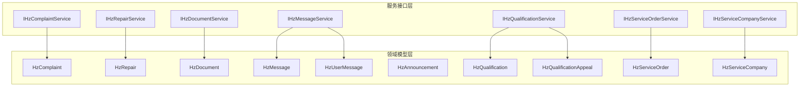
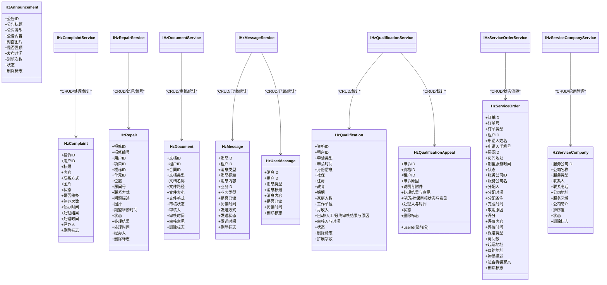
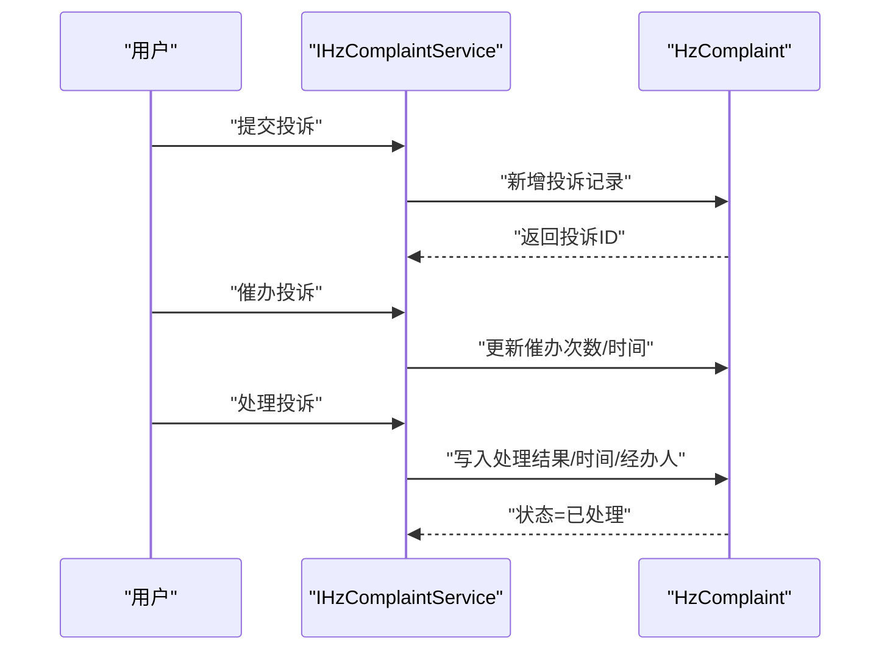
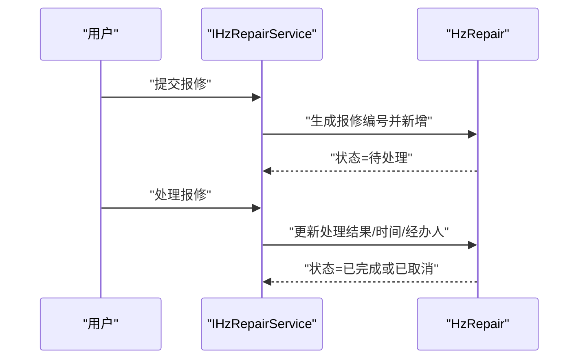
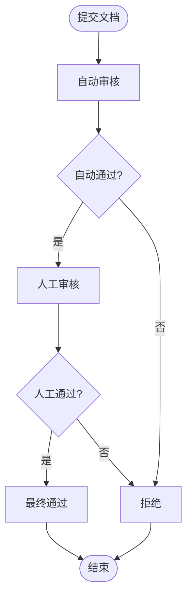
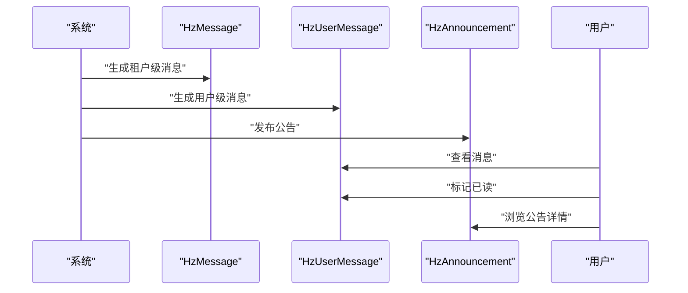
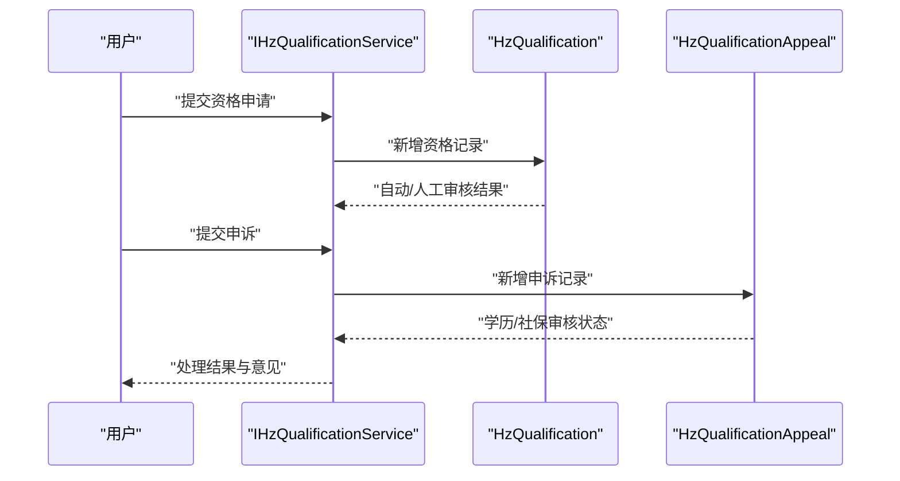
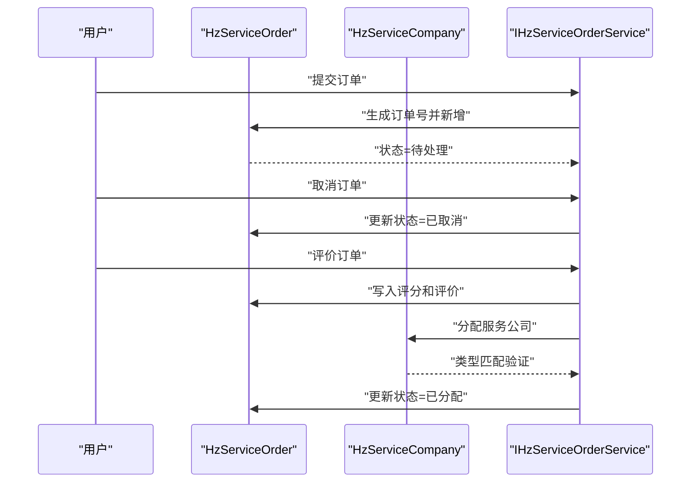
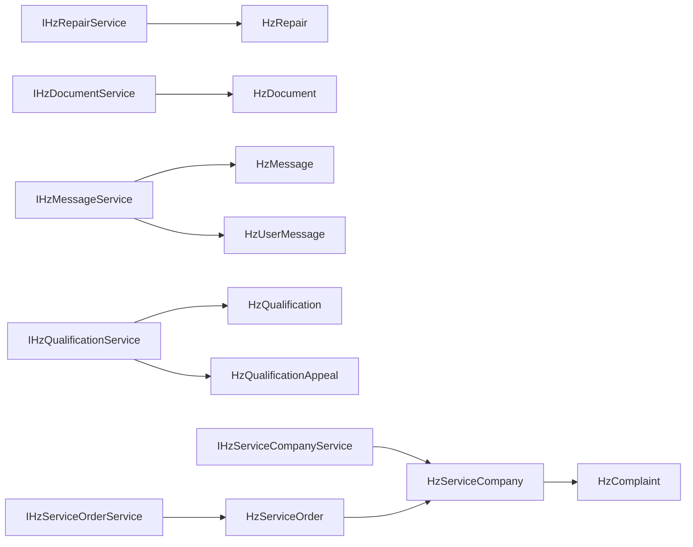

# 服务支撑模型

<cite>
**本文引用的文件**
- [HzComplaint.java](file://ruoyi-system/src/main/java/com/ruoyi/system/domain/HzComplaint.java)
- [IHzComplaintService.java](file://ruoyi-system/src/main/java/com/ruoyi/system/service/IHzComplaintService.java)
- [HzRepair.java](file://ruoyi-system/src/main/java/com/ruoyi/system/domain/HzRepair.java)
- [IHzRepairService.java](file://ruoyi-system/src/main/java/com/ruoyi/system/service/IHzRepairService.java)
- [HzDocument.java](file://ruoyi-system/src/main/java/com/ruoyi/system/domain/HzDocument.java)
- [IHzDocumentService.java](file://ruoyi-system/src/main/java/com/ruoyi/system/service/IHzDocumentService.java)
- [HzMessage.java](file://ruoyi-system/src/main/java/com/ruoyi/system/domain/HzMessage.java)
- [IHzMessageService.java](file://ruoyi-system/src/main/java/com/ruoyi/system/service/IHzMessageService.java)
- [HzUserMessage.java](file://ruoyi-system/src/main/java/com/ruoyi/system/domain/HzUserMessage.java)
- [HzAnnouncement.java](file://ruoyi-system/src/main/java/com/ruoyi/system/domain/HzAnnouncement.java)
- [HzQualification.java](file://ruoyi-system/src/main/java/com/ruoyi/system/domain/HzQualification.java)
- [HzQualificationAppeal.java](file://ruoyi-system/src/main/java/com/ruoyi/system/domain/HzQualificationAppeal.java)
- [IHzQualificationService.java](file://ruoyi-system/src/main/java/com/ruoyi/system/service/IHzQualificationService.java)
- [HzServiceOrder.java](file://ruoyi-system/src/main/java/com/ruoyi/system/domain/HzServiceOrder.java)
- [IHzServiceOrderService.java](file://ruoyi-system/src/main/java/com/ruoyi/system/service/IHzServiceOrderService.java)
- [HzServiceCompany.java](file://ruoyi-system/src/main/java/com/ruoyi/system/domain/HzServiceCompany.java)
- [IHzServiceCompanyService.java](file://ruoyi-system/src/main/java/com/ruoyi/system/service/IHzServiceCompanyService.java)
- [HzServiceOrderAppController.java](file://ruoyi-admin/src/main/java/com/ruoyi/web/controller/h5/HzServiceOrderAppController.java)
- [HzServiceCompanyController.java](file://ruoyi-admin/src/main/java/com/ruoyi/web/controller/system/HzServiceCompanyController.java)
</cite>

## 目录
1. [引言](#引言)
2. [项目结构](#项目结构)
3. [核心组件](#核心组件)
4. [架构总览](#架构总览)
5. [详细组件分析](#详细组件分析)
6. [依赖分析](#依赖分析)
7. [性能考虑](#性能考虑)
8. [故障排查指南](#故障排查指南)
9. [结论](#结论)
10. [附录](#附录)

## 引言
本文件聚焦港好住信息系统中的"服务支撑模型"，围绕以下核心实体展开：投诉管理（HzComplaint）、维修管理（HzRepair）、文档管理（HzDocument）、消息通知（HzMessage、HzUserMessage、HzAnnouncement）、资格管理（HzQualification、HzQualificationAppeal）、以及新增的服务订单支撑模型（HzServiceOrder、HzServiceCompany）。文档从数据模型设计、字段语义、业务流程与状态流转、以及服务层接口能力等方面进行系统化梳理，并辅以可视化图示帮助读者快速理解各模块之间的关系与交互。

## 项目结构
服务支撑模型位于后端系统模块中，采用标准的分层架构：
- 领域模型层：对应数据库表的实体类，定义字段与基本行为
- 服务接口层：定义面向业务的操作契约，如分页查询、新增、更新、处理、统计等
- 控制器层：对外暴露REST接口，调用服务层完成业务编排（本文件不展示控制器代码）

**更新** 新增了服务订单支撑模型，包括HzServiceOrder和HzServiceCompany两个核心实体，支持清洁和搬家服务的统一管理。

图表来源
- [HzComplaint.java:11-233](file://ruoyi-system/src/main/java/com/ruoyi/system/domain/HzComplaint.java#L11-L233)
- [HzRepair.java:11-278](file://ruoyi-system/src/main/java/com/ruoyi/system/domain/HzRepair.java#L11-L278)
- [HzDocument.java:16-199](file://ruoyi-system/src/main/java/com/ruoyi/system/domain/HzDocument.java#L16-L199)
- [HzMessage.java:14-221](file://ruoyi-system/src/main/java/com/ruoyi/system/domain/HzMessage.java#L14-L221)
- [HzUserMessage.java:11-143](file://ruoyi-system/src/main/java/com/ruoyi/system/domain/HzUserMessage.java#L11-L143)
- [HzAnnouncement.java:14-176](file://ruoyi-system/src/main/java/com/ruoyi/system/domain/HzAnnouncement.java#L14-L176)
- [HzQualification.java:18-377](file://ruoyi-system/src/main/java/com/ruoyi/system/domain/HzQualification.java#L18-L377)
- [HzQualificationAppeal.java:16-286](file://ruoyi-system/src/main/java/com/ruoyi/system/domain/HzQualificationAppeal.java#L16-L286)
- [HzServiceOrder.java:10-231](file://ruoyi-system/src/main/java/com/ruoyi/system/domain/HzServiceOrder.java#L10-L231)
- [HzServiceCompany.java:7-102](file://ruoyi-system/src/main/java/com/ruoyi/system/domain/HzServiceCompany.java#L7-L102)
- [IHzComplaintService.java:13-98](file://ruoyi-system/src/main/java/com/ruoyi/system/service/IHzComplaintService.java#L13-L98)
- [IHzRepairService.java:14-98](file://ruoyi-system/src/main/java/com/ruoyi/system/service/IHzRepairService.java#L14-L98)
- [IHzDocumentService.java:14-93](file://ruoyi-system/src/main/java/com/ruoyi/system/service/IHzDocumentService.java#L14-L93)
- [IHzMessageService.java:13-97](file://ruoyi-system/src/main/java/com/ruoyi/system/service/IHzMessageService.java#L13-L97)
- [IHzQualificationService.java:13-81](file://ruoyi-system/src/main/java/com/ruoyi/system/service/IHzQualificationService.java#L13-L81)
- [IHzServiceOrderService.java:1-54](file://ruoyi-system/src/main/java/com/ruoyi/system/service/IHzServiceOrderService.java#L1-L54)
- [IHzServiceCompanyService.java:1-52](file://ruoyi-system/src/main/java/com/ruoyi/system/service/IHzServiceCompanyService.java#L1-L52)

章节来源
- [HzComplaint.java:11-233](file://ruoyi-system/src/main/java/com/ruoyi/system/domain/HzComplaint.java#L11-L233)
- [HzRepair.java:11-278](file://ruoyi-system/src/main/java/com/ruoyi/system/domain/HzRepair.java#L11-L278)
- [HzDocument.java:16-199](file://ruoyi-system/src/main/java/com/ruoyi/system/domain/HzDocument.java#L16-L199)
- [HzMessage.java:14-221](file://ruoyi-system/src/main/java/com/ruoyi/system/domain/HzMessage.java#L14-L221)
- [HzUserMessage.java:11-143](file://ruoyi-system/src/main/java/com/ruoyi/system/domain/HzUserMessage.java#L11-L143)
- [HzAnnouncement.java:14-176](file://ruoyi-system/src/main/java/com/ruoyi/system/domain/HzAnnouncement.java#L14-L176)
- [HzQualification.java:18-377](file://ruoyi-system/src/main/java/com/ruoyi/system/domain/HzQualification.java#L18-L377)
- [HzQualificationAppeal.java:16-286](file://ruoyi-system/src/main/java/com/ruoyi/system/domain/HzQualificationAppeal.java#L16-L286)
- [HzServiceOrder.java:10-231](file://ruoyi-system/src/main/java/com/ruoyi/system/domain/HzServiceOrder.java#L10-L231)
- [HzServiceCompany.java:7-102](file://ruoyi-system/src/main/java/com/ruoyi/system/domain/HzServiceCompany.java#L7-L102)
- [IHzComplaintService.java:13-98](file://ruoyi-system/src/main/java/com/ruoyi/system/service/IHzComplaintService.java#L13-L98)
- [IHzRepairService.java:14-98](file://ruoyi-system/src/main/java/com/ruoyi/system/service/IHzRepairService.java#L14-L98)
- [IHzDocumentService.java:14-93](file://ruoyi-system/src/main/java/com/ruoyi/system/service/IHzDocumentService.java#L14-L93)
- [IHzMessageService.java:13-97](file://ruoyi-system/src/main/java/com/ruoyi/system/service/IHzMessageService.java#L13-L97)
- [IHzQualificationService.java:13-81](file://ruoyi-system/src/main/java/com/ruoyi/system/service/IHzQualificationService.java#L13-L81)
- [IHzServiceOrderService.java:1-54](file://ruoyi-system/src/main/java/com/ruoyi/system/service/IHzServiceOrderService.java#L1-L54)
- [IHzServiceCompanyService.java:1-52](file://ruoyi-system/src/main/java/com/ruoyi/system/service/IHzServiceCompanyService.java#L1-L52)

## 核心组件
本节对六大类服务支撑实体进行要点归纳，突出关键字段、状态与流程含义。

- 投诉管理（HzComplaint）
  - 关键字段：用户标识、标题、内容、联系方式、图片、状态、催办次数与时间、处理结果与时间、经办人、删除标志
  - 状态：待处理、已处理
  - 催办：是否催办、催办次数、最后催办时间
  - 处理：支持处理结果与时间记录，便于闭环追踪

- 维修管理（HzRepair）
  - 关键字段：报修编号、用户、项目/楼栋/单元/房间、位置、联系方式、问题描述、图片、期望维修时间、状态、处理结果与时间、经办人、删除标志
  - 状态：待处理、已完成、已取消
  - 编号：提供统一编号生成策略（格式：BX + 日期 + 4位序号）

- 文档管理（HzDocument）
  - 关键字段：租户、合同关联、文档类型（身份证、学历、工作、收入、人才证书、其他）、文档名称、文件路径、大小、格式、审核状态、审核人、审核时间、审核意见、删除标志
  - 审核：三段式（自动审核、人工审核、最终结果），支持管理端多维筛选与分页

- 消息通知（HzMessage、HzUserMessage、HzAnnouncement）
  - HzMessage：租户级消息、消息类型、业务关联、发送方式、发送状态、已读状态、删除标志
  - HzUserMessage：用户级消息、消息类型、标题、内容、已读状态、阅读时间、删除标志
  - HzAnnouncement：公告标题、类型（通知/公告/活动）、内容、封面、置顶、发布时间、浏览量、状态（草稿/已发布/已下架）、删除标志

- 资格管理（HzQualification、HzQualificationAppeal）
  - HzQualification：租户信息、申请类型、身份信息、社保、住房、教育、婚姻、家庭人数、工作单位、月收入、自动/人工/最终审核结果与原因、审核人与时间、状态、删除标志；含政务校验扩展字段
  - HzQualificationAppeal：申诉原因、说明、附件、处理结果与意见、学历/社保审核状态与意见、处理人与时间、状态、删除标志；包含一个仅用于前端传递的userId字段（不落库）

- **服务订单支撑模型（HzServiceOrder、HzServiceCompany）**
  - HzServiceOrder：订单ID、订单号、订单类型（1=保洁、2=搬家）、申请人信息、房源地址、期望服务时间、状态（0=待处理、1=已分配、2=服务中、3=已完成、4=已取消）、服务公司信息、评分与评价、保洁/搬家专属字段（房间数、起运/目的地址、物品描述、是否拆装家具）
  - HzServiceCompany：服务公司ID、公司名称、服务类型（1=保洁、2=搬家、3=综合）、联系人、联系电话、公司地址、服务区域、公司简介、排序值、状态（0=启用、1=停用）、删除标志

**更新** 新增了服务订单支撑模型，通过HzServiceOrder和HzServiceCompany两个实体实现清洁和搬家服务的统一管理，支持订单生命周期管理和服务公司调度。

章节来源
- [HzComplaint.java:16-70](file://ruoyi-system/src/main/java/com/ruoyi/system/domain/HzComplaint.java#L16-L70)
- [HzRepair.java:16-82](file://ruoyi-system/src/main/java/com/ruoyi/system/domain/HzRepair.java#L16-L82)
- [HzDocument.java:20-70](file://ruoyi-system/src/main/java/com/ruoyi/system/domain/HzDocument.java#L20-L70)
- [HzMessage.java:19-69](file://ruoyi-system/src/main/java/com/ruoyi/system/domain/HzMessage.java#L19-L69)
- [HzUserMessage.java:16-46](file://ruoyi-system/src/main/java/com/ruoyi/system/domain/HzUserMessage.java#L16-L46)
- [HzAnnouncement.java:19-57](file://ruoyi-system/src/main/java/com/ruoyi/system/domain/HzAnnouncement.java#L19-L57)
- [HzQualification.java:22-112](file://ruoyi-system/src/main/java/com/ruoyi/system/domain/HzQualification.java#L22-L112)
- [HzQualificationAppeal.java:20-94](file://ruoyi-system/src/main/java/com/ruoyi/system/domain/HzQualificationAppeal.java#L20-L94)
- [HzServiceOrder.java:21-145](file://ruoyi-system/src/main/java/com/ruoyi/system/domain/HzServiceOrder.java#L21-L145)
- [HzServiceCompany.java:17-67](file://ruoyi-system/src/main/java/com/ruoyi/system/domain/HzServiceCompany.java#L17-L67)

## 架构总览
服务支撑模型遵循"领域模型 + 服务接口"的分层设计，控制器通过调用服务接口完成业务操作。下图展示了主要实体与服务接口的关系：

**更新** 在架构图中新增了HzServiceOrder和HzServiceCompany实体及其服务接口，体现了服务订单支撑模型的完整架构。

图表来源
- [HzComplaint.java:11-233](file://ruoyi-system/src/main/java/com/ruoyi/system/domain/HzComplaint.java#L11-L233)
- [HzRepair.java:11-278](file://ruoyi-system/src/main/java/com/ruoyi/system/domain/HzRepair.java#L11-L278)
- [HzDocument.java:16-199](file://ruoyi-system/src/main/java/com/ruoyi/system/domain/HzDocument.java#L16-L199)
- [HzMessage.java:14-221](file://ruoyi-system/src/main/java/com/ruoyi/system/domain/HzMessage.java#L14-L221)
- [HzUserMessage.java:11-143](file://ruoyi-system/src/main/java/com/ruoyi/system/domain/HzUserMessage.java#L11-L143)
- [HzAnnouncement.java:14-176](file://ruoyi-system/src/main/java/com/ruoyi/system/domain/HzAnnouncement.java#L14-L176)
- [HzQualification.java:18-377](file://ruoyi-system/src/main/java/com/ruoyi/system/domain/HzQualification.java#L18-L377)
- [HzQualificationAppeal.java:16-286](file://ruoyi-system/src/main/java/com/ruoyi/system/domain/HzQualificationAppeal.java#L16-L286)
- [HzServiceOrder.java:10-231](file://ruoyi-system/src/main/java/com/ruoyi/system/domain/HzServiceOrder.java#L10-L231)
- [HzServiceCompany.java:7-102](file://ruoyi-system/src/main/java/com/ruoyi/system/domain/HzServiceCompany.java#L7-L102)
- [IHzComplaintService.java:13-98](file://ruoyi-system/src/main/java/com/ruoyi/system/service/IHzComplaintService.java#L13-L98)
- [IHzRepairService.java:14-98](file://ruoyi-system/src/main/java/com/ruoyi/system/service/IHzRepairService.java#L14-L98)
- [IHzDocumentService.java:14-93](file://ruoyi-system/src/main/java/com/ruoyi/system/service/IHzDocumentService.java#L14-L93)
- [IHzMessageService.java:13-97](file://ruoyi-system/src/main/java/com/ruoyi/system/service/IHzMessageService.java#L13-L97)
- [IHzQualificationService.java:13-81](file://ruoyi-system/src/main/java/com/ruoyi/system/service/IHzQualificationService.java#L13-L81)
- [IHzServiceOrderService.java:1-54](file://ruoyi-system/src/main/java/com/ruoyi/system/service/IHzServiceOrderService.java#L1-L54)
- [IHzServiceCompanyService.java:1-52](file://ruoyi-system/src/main/java/com/ruoyi/system/service/IHzServiceCompanyService.java#L1-L52)

## 详细组件分析

### 投诉管理（HzComplaint）设计与流程
- 设计要点
  - 字段覆盖：基础信息（标题、内容、联系方式）、证据（图片）、状态与催办（状态、是否催办、催办次数、最后催办时间）、处理闭环（处理结果、处理时间、经办人）
  - 状态驱动：通过状态字段实现"待处理—已处理"的闭环管理
  - 催办机制：支持多次催办与记录，便于监督与回溯
- 处理流程（概念序列）

图表来源
- [IHzComplaintService.java:13-98](file://ruoyi-system/src/main/java/com/ruoyi/system/service/IHzComplaintService.java#L13-L98)
- [HzComplaint.java:16-70](file://ruoyi-system/src/main/java/com/ruoyi/system/domain/HzComplaint.java#L16-L70)

章节来源
- [HzComplaint.java:16-70](file://ruoyi-system/src/main/java/com/ruoyi/system/domain/HzComplaint.java#L16-L70)
- [IHzComplaintService.java:13-98](file://ruoyi-system/src/main/java/com/ruoyi/system/service/IHzComplaintService.java#L13-L98)

### 维修管理（HzRepair）设计与流程
- 设计要点
  - 地址定位：项目/楼栋/单元/房间/位置组合，便于精准派工
  - 时间约束：期望维修时间字段，便于资源调度
  - 状态管理：待处理、已完成、已取消，覆盖维修全生命周期
  - 编号规范：统一生成规则（BX + 日期 + 4位序号），便于检索与追踪
- 报修流程（概念序列）

图表来源
- [IHzRepairService.java:14-98](file://ruoyi-system/src/main/java/com/ruoyi/system/service/IHzRepairService.java#L14-L98)
- [HzRepair.java:16-82](file://ruoyi-system/src/main/java/com/ruoyi/system/domain/HzRepair.java#L16-L82)

章节来源
- [HzRepair.java:16-82](file://ruoyi-system/src/main/java/com/ruoyi/system/domain/HzRepair.java#L16-L82)
- [IHzRepairService.java:14-98](file://ruoyi-system/src/main/java/com/ruoyi/system/service/IHzRepairService.java#L14-L98)

### 文档管理（HzDocument）设计与流程
- 设计要点
  - 关联关系：租户ID、合同ID，便于按租户或合同维度管理
  - 类型枚举：身份证、学历、工作、收入、人才证书、其他，便于分类检索
  - 审核流程：三段式（自动/人工/最终），支持管理端多维筛选与分页
  - 存储元数据：文件路径、大小、格式、审核意见、审核人与时间
- 文档审核流程（概念流程）

图表来源
- [HzDocument.java:20-70](file://ruoyi-system/src/main/java/com/ruoyi/system/domain/HzDocument.java#L20-L70)
- [IHzDocumentService.java:14-93](file://ruoyi-system/src/main/java/com/ruoyi/system/service/IHzDocumentService.java#L14-L93)

章节来源
- [HzDocument.java:20-70](file://ruoyi-system/src/main/java/com/ruoyi/system/domain/HzDocument.java#L20-L70)
- [IHzDocumentService.java:14-93](file://ruoyi-system/src/main/java/com/ruoyi/system/service/IHzDocumentService.java#L14-L93)

### 消息通知（HzMessage、HzUserMessage、HzAnnouncement）设计与流程
- 设计要点
  - HzMessage：租户级消息，支持业务类型与业务ID关联，发送方式与状态分离，便于多通道推送与追踪
  - HzUserMessage：用户级消息，支持已读状态与阅读时间，便于个人中心的消息管理
  - HzAnnouncement：公告类型（通知/公告/活动），支持置顶、封面、浏览量、状态（草稿/已发布/已下架）
- 消息推送与阅读流程（概念序列）

图表来源
- [HzMessage.java:19-69](file://ruoyi-system/src/main/java/com/ruoyi/system/domain/HzMessage.java#L19-L69)
- [HzUserMessage.java:16-46](file://ruoyi-system/src/main/java/com/ruoyi/system/domain/HzUserMessage.java#L16-L46)
- [HzAnnouncement.java:19-57](file://ruoyi-system/src/main/java/com/ruoyi/system/domain/HzAnnouncement.java#L19-L57)
- [IHzMessageService.java:13-97](file://ruoyi-system/src/main/java/com/ruoyi/system/service/IHzMessageService.java#L13-L97)

章节来源
- [HzMessage.java:19-69](file://ruoyi-system/src/main/java/com/ruoyi/system/domain/HzMessage.java#L19-L69)
- [HzUserMessage.java:16-46](file://ruoyi-system/src/main/java/com/ruoyi/system/domain/HzUserMessage.java#L16-L46)
- [HzAnnouncement.java:19-57](file://ruoyi-system/src/main/java/com/ruoyi/system/domain/HzAnnouncement.java#L19-L57)
- [IHzMessageService.java:13-97](file://ruoyi-system/src/main/java/com/ruoyi/system/service/IHzMessageService.java#L13-L97)

### 资格管理（HzQualification、HzQualificationAppeal）设计与流程
- 设计要点
  - HzQualification：涵盖基本信息、社保、住房、教育、婚姻、家庭人数、工作单位、月收入、自动/人工/最终审核结果与原因、审核人与时间、状态、删除标志；并包含政务校验扩展字段（配偶信息、是否享受公租房、不动产等）
  - HzQualificationAppeal：申诉原因、说明与附件、学历/社保审核状态与意见、处理结果与意见、处理人与时间、状态、删除标志；包含一个仅用于前端传递的userId字段（不存储到数据库）
- 资格审核与申诉流程（概念序列）

图表来源
- [HzQualification.java:22-112](file://ruoyi-system/src/main/java/com/ruoyi/system/domain/HzQualification.java#L22-L112)
- [HzQualificationAppeal.java:20-94](file://ruoyi-system/src/main/java/com/ruoyi/system/domain/HzQualificationAppeal.java#L20-L94)
- [IHzQualificationService.java:13-81](file://ruoyi-system/src/main/java/com/ruoyi/system/service/IHzQualificationService.java#L13-L81)

章节来源
- [HzQualification.java:22-112](file://ruoyi-system/src/main/java/com/ruoyi/system/domain/HzQualification.java#L22-L112)
- [HzQualificationAppeal.java:20-94](file://ruoyi-system/src/main/java/com/ruoyi/system/domain/HzQualificationAppeal.java#L20-L94)
- [IHzQualificationService.java:13-81](file://ruoyi-system/src/main/java/com/ruoyi/system/service/IHzQualificationService.java#L13-L81)

### 服务订单支撑模型（HzServiceOrder、HzServiceCompany）设计与流程
- 设计要点
  - HzServiceOrder：采用合表设计，通过order_type字段区分保洁（1）和搬家（2）两类服务，支持统一的订单生命周期管理
  - HzServiceCompany：支持三种服务类型（保洁、搬家、综合），通过company_type字段实现服务类型匹配
  - 状态管理：订单状态从待处理到已完成的完整生命周期，支持分配、服务中、完成、取消等状态转换
  - 专属字段：保洁订单包含房间数、保洁类型等字段，搬家订单包含起运/目的地址、物品描述、是否拆装家具等字段
- 订单流程（概念序列）

**更新** 新增了服务订单支撑模型的详细设计与流程，体现了清洁和搬家服务的统一管理能力。

图表来源
- [HzServiceOrder.java:21-145](file://ruoyi-system/src/main/java/com/ruoyi/system/domain/HzServiceOrder.java#L21-L145)
- [HzServiceCompany.java:17-67](file://ruoyi-system/src/main/java/com/ruoyi/system/domain/HzServiceCompany.java#L17-L67)
- [IHzServiceOrderService.java:1-54](file://ruoyi-system/src/main/java/com/ruoyi/system/service/IHzServiceOrderService.java#L1-L54)
- [IHzServiceCompanyService.java:1-52](file://ruoyi-system/src/main/java/com/ruoyi/system/service/IHzServiceCompanyService.java#L1-L52)

章节来源
- [HzServiceOrder.java:21-145](file://ruoyi-system/src/main/java/com/ruoyi/system/domain/HzServiceOrder.java#L21-L145)
- [HzServiceCompany.java:17-67](file://ruoyi-system/src/main/java/com/ruoyi/system/domain/HzServiceCompany.java#L17-L67)
- [IHzServiceOrderService.java:1-54](file://ruoyi-system/src/main/java/com/ruoyi/system/service/IHzServiceOrderService.java#L1-L54)
- [IHzServiceCompanyService.java:1-52](file://ruoyi-system/src/main/java/com/ruoyi/system/service/IHzServiceCompanyService.java#L1-L52)

## 依赖分析
- 内聚性
  - 各实体均围绕单一职责构建，字段命名清晰，状态与流程字段集中，便于维护
  - 新增的服务订单模型通过统一的状态管理实现订单生命周期的完整控制
- 耦合度
  - 实体之间通过业务ID或外键关联（如HzMessage与业务ID、HzDocument与租户/合同、HzQualification与HzQualificationAppeal）
  - 服务订单模型中HzServiceOrder与HzServiceCompany通过companyId建立关联，实现服务公司调度
- 外部依赖
  - 使用MyBatis-Plus注解映射数据库表，统一继承BaseEntity，具备通用的创建/更新时间与操作人字段
- 循环依赖
  - 当前模型未发现循环依赖迹象，服务接口与实体解耦良好

**更新** 在依赖关系图中新增了服务订单支撑模型的依赖关系，体现了HzServiceOrder与HzServiceCompany之间的关联。

图表来源
- [IHzComplaintService.java:13-98](file://ruoyi-system/src/main/java/com/ruoyi/system/service/IHzComplaintService.java#L13-L98)
- [IHzRepairService.java:14-98](file://ruoyi-system/src/main/java/com/ruoyi/system/service/IHzRepairService.java#L14-L98)
- [IHzDocumentService.java:14-93](file://ruoyi-system/src/main/java/com/ruoyi/system/service/IHzDocumentService.java#L14-L93)
- [IHzMessageService.java:13-97](file://ruoyi-system/src/main/java/com/ruoyi/system/service/IHzMessageService.java#L13-L97)
- [IHzQualificationService.java:13-81](file://ruoyi-system/src/main/java/com/ruoyi/system/service/IHzQualificationService.java#L13-L81)
- [IHzServiceOrderService.java:1-54](file://ruoyi-system/src/main/java/com/ruoyi/system/service/IHzServiceOrderService.java#L1-L54)
- [IHzServiceCompanyService.java:1-52](file://ruoyi-system/src/main/java/com/ruoyi/system/service/IHzServiceCompanyService.java#L1-L52)
- [HzComplaint.java:11-233](file://ruoyi-system/src/main/java/com/ruoyi/system/domain/HzComplaint.java#L11-L233)
- [HzRepair.java:11-278](file://ruoyi-system/src/main/java/com/ruoyi/system/domain/HzRepair.java#L11-L278)
- [HzDocument.java:16-199](file://ruoyi-system/src/main/java/com/ruoyi/system/domain/HzDocument.java#L16-L199)
- [HzMessage.java:14-221](file://ruoyi-system/src/main/java/com/ruoyi/system/domain/HzMessage.java#L14-L221)
- [HzUserMessage.java:11-143](file://ruoyi-system/src/main/java/com/ruoyi/system/domain/HzUserMessage.java#L11-L143)
- [HzQualification.java:18-377](file://ruoyi-system/src/main/java/com/ruoyi/system/domain/HzQualification.java#L18-L377)
- [HzQualificationAppeal.java:16-286](file://ruoyi-system/src/main/java/com/ruoyi/system/domain/HzQualificationAppeal.java#L16-L286)
- [HzServiceOrder.java:10-231](file://ruoyi-system/src/main/java/com/ruoyi/system/domain/HzServiceOrder.java#L10-L231)
- [HzServiceCompany.java:7-102](file://ruoyi-system/src/main/java/com/ruoyi/system/domain/HzServiceCompany.java#L7-L102)

章节来源
- [IHzComplaintService.java:13-98](file://ruoyi-system/src/main/java/com/ruoyi/system/service/IHzComplaintService.java#L13-L98)
- [IHzRepairService.java:14-98](file://ruoyi-system/src/main/java/com/ruoyi/system/service/IHzRepairService.java#L14-L98)
- [IHzDocumentService.java:14-93](file://ruoyi-system/src/main/java/com/ruoyi/system/service/IHzDocumentService.java#L14-L93)
- [IHzMessageService.java:13-97](file://ruoyi-system/src/main/java/com/ruoyi/system/service/IHzMessageService.java#L13-L97)
- [IHzQualificationService.java:13-81](file://ruoyi-system/src/main/java/com/ruoyi/system/service/IHzQualificationService.java#L13-L81)
- [IHzServiceOrderService.java:1-54](file://ruoyi-system/src/main/java/com/ruoyi/system/service/IHzServiceOrderService.java#L1-L54)
- [IHzServiceCompanyService.java:1-52](file://ruoyi-system/src/main/java/com/ruoyi/system/service/IHzServiceCompanyService.java#L1-L52)

## 性能考虑
- 索引与查询优化
  - 建议在高频过滤字段上建立索引：用户ID、租户ID、合同ID、状态、业务ID、创建时间、审核状态、订单类型、服务公司ID等
  - 新增服务订单模型的索引建议：order_type、order_no、applicant_phone、house_address、company_id等字段
- 分页与缓存
  - 列表与分页查询应结合分页参数与排序字段，避免一次性加载大量数据；对公告列表、消息统计、服务公司列表等可引入缓存
- 图片与文件
  - 图片/附件字段采用逗号分隔存储，建议配合独立文件存储与CDN，数据库仅存路径与元信息
- 并发控制
  - 审核与处理流程需注意并发更新，建议使用乐观锁或业务幂等设计
- **服务订单性能优化**
  - 订单状态变更频繁，建议对状态字段建立索引
  - 服务公司查询按启用状态和类型过滤，建议建立复合索引
  - 评价功能需要防止重复评价，建议在订单号和评价字段上建立唯一约束

**更新** 新增了服务订单支撑模型的性能考虑，包括索引优化、并发控制等方面的建议。

## 故障排查指南
- 常见问题定位
  - 状态异常：检查状态字段更新逻辑（如投诉催办、维修处理、公告发布/下架、订单状态流转）
  - 审核不一致：核对自动/人工/最终审核结果与原因字段是否正确联动
  - 消息未读：确认HzMessage与HzUserMessage的已读字段与阅读时间是否同步更新
  - 申诉缺失：确认HzQualificationAppeal与HzQualification的关联字段是否正确
  - **服务订单异常**：检查订单状态转换逻辑、服务公司类型匹配、订单取消权限控制、评价重复提交等问题
- 接口能力对照
  - 通过服务接口方法名快速定位功能：新增、修改、删除、分页、统计、处理、编号生成、状态流转等
  - **服务订单接口**：提交订单、取消订单、分配服务公司、标记完成、评价订单等功能的接口调用

**更新** 新增了服务订单支撑模型的故障排查指南，涵盖了订单状态管理、服务公司匹配、权限控制等方面的问题定位。

章节来源
- [IHzComplaintService.java:13-98](file://ruoyi-system/src/main/java/com/ruoyi/system/service/IHzComplaintService.java#L13-L98)
- [IHzRepairService.java:14-98](file://ruoyi-system/src/main/java/com/ruoyi/system/service/IHzRepairService.java#L14-L98)
- [IHzDocumentService.java:14-93](file://ruoyi-system/src/main/java/com/ruoyi/system/service/IHzDocumentService.java#L14-L93)
- [IHzMessageService.java:13-97](file://ruoyi-system/src/main/java/com/ruoyi/system/service/IHzMessageService.java#L13-L97)
- [IHzQualificationService.java:13-81](file://ruoyi-system/src/main/java/com/ruoyi/system/service/IHzQualificationService.java#L13-L81)
- [IHzServiceOrderService.java:1-54](file://ruoyi-system/src/main/java/com/ruoyi/system/service/IHzServiceOrderService.java#L1-L54)
- [IHzServiceCompanyService.java:1-52](file://ruoyi-system/src/main/java/com/ruoyi/system/service/IHzServiceCompanyService.java#L1-L52)

## 结论
服务支撑模型以清晰的实体设计与完备的服务接口为核心，覆盖投诉、维修、文档、消息、资格以及新增的服务订单等关键业务场景。通过状态与流程字段的标准化设计，实现了业务闭环与可追溯性；通过编号与关联字段的规范化，提升了系统的可维护性与扩展性。

**更新** 新增的服务订单支撑模型通过HzServiceOrder和HzServiceCompany两个核心实体，实现了清洁和搬家服务的统一管理，支持订单生命周期管理和服务公司调度，进一步丰富了港好住信息系统的服务支撑能力。

建议在生产环境中进一步完善索引、缓存与并发控制策略，确保高并发下的稳定性与性能。

## 附录
- 数据模型概览（ER）

```mermaid
erDiagram
HzComplaint {
bigint complaint_id PK
bigint user_id
string title
string content
string contact_phone
string images
string status
string is_urged
int urge_count
string urge_time
string handle_result
string handle_time
string handle_by
string del_flag
}
HzRepair {
bigint repair_id PK
string repair_no
bigint user_id
bigint project_id
bigint building_id
bigint unit_id
string location
string room_no
string phone
string description
string images
string repair_date
string status
string handle_result
string handle_time
string handle_by
string del_flag
}
HzDocument {
bigint document_id PK
bigint tenant_id
bigint contract_id
string document_type
string document_name
string file_path
bigint file_size
string file_format
string audit_status
string auditor
string audit_time
string audit_opinion
string del_flag
}
HzMessage {
bigint message_id PK
bigint tenant_id
string message_type
string message_title
string message_content
bigint business_id
string business_type
string is_read
string read_time
string send_method
string send_status
string send_time
string del_flag
}
HzUserMessage {
bigint message_id PK
bigint user_id
string message_type
string message_title
string message_content
string is_read
string read_time
string del_flag
}
HzAnnouncement {
bigint announcement_id PK
string announcement_title
string announcement_type
string announcement_content
string cover_image
string is_top
string publish_time
bigint view_count
string status
string del_flag
}
HzQualification {
bigint qualification_id PK
bigint tenant_id
string apply_type
string apply_time
string id_card
string name
string phone
int social_security_months
string has_local_house
string education_level
string marriage_status
int household_count
string work_unit
decimal monthly_income
string auto_check_result
string auto_check_reason
string manual_check_result
string manual_check_reason
string final_result
string check_by
string check_time
string status
string del_flag
}
HzQualificationAppeal {
bigint appeal_id PK
bigint qualification_id
bigint tenant_id
string appeal_reason
string education_desc
string appeal_attachments
string social_attachments
string social_desc
string appeal_time
string handle_result
string handle_opinion
string education_audit_status
string education_audit_opinion
string social_audit_status
string social_audit_opinion
string handle_by
string handle_time
string status
string del_flag
bigint user_id
}
HzServiceOrder {
bigint order_id PK
string order_no
string order_type
bigint tenant_id
string applicant_name
string applicant_phone
bigint house_id
string house_address
datetime expect_time
string status
bigint company_id
string company_name
string assigned_by
datetime assigned_time
string assign_remark
datetime finish_time
string cancel_reason
int rate_score
string rate_content
datetime rate_time
string clean_type
int room_count
string from_address
string to_address
string move_item_desc
string need_disassembly
string del_flag
}
HzServiceCompany {
bigint company_id PK
string company_name
string company_type
string contact_person
string contact_phone
string address
string service_area
string intro
int sort_order
string status
string del_flag
}
```

**更新** 在ER图中新增了HzServiceOrder和HzServiceCompany实体，体现了服务订单支撑模型的完整数据结构。

图表来源
- [HzComplaint.java:16-70](file://ruoyi-system/src/main/java/com/ruoyi/system/domain/HzComplaint.java#L16-L70)
- [HzRepair.java:16-82](file://ruoyi-system/src/main/java/com/ruoyi/system/domain/HzRepair.java#L16-L82)
- [HzDocument.java:20-70](file://ruoyi-system/src/main/java/com/ruoyi/system/domain/HzDocument.java#L20-L70)
- [HzMessage.java:19-69](file://ruoyi-system/src/main/java/com/ruoyi/system/domain/HzMessage.java#L19-L69)
- [HzUserMessage.java:16-46](file://ruoyi-system/src/main/java/com/ruoyi/system/domain/HzUserMessage.java#L16-L46)
- [HzAnnouncement.java:19-57](file://ruoyi-system/src/main/java/com/ruoyi/system/domain/HzAnnouncement.java#L19-L57)
- [HzQualification.java:22-112](file://ruoyi-system/src/main/java/com/ruoyi/system/domain/HzQualification.java#L22-L112)
- [HzQualificationAppeal.java:20-94](file://ruoyi-system/src/main/java/com/ruoyi/system/domain/HzQualificationAppeal.java#L20-L94)
- [HzServiceOrder.java:21-145](file://ruoyi-system/src/main/java/com/ruoyi/system/domain/HzServiceOrder.java#L21-L145)
- [HzServiceCompany.java:17-67](file://ruoyi-system/src/main/java/com/ruoyi/system/domain/HzServiceCompany.java#L17-L67)