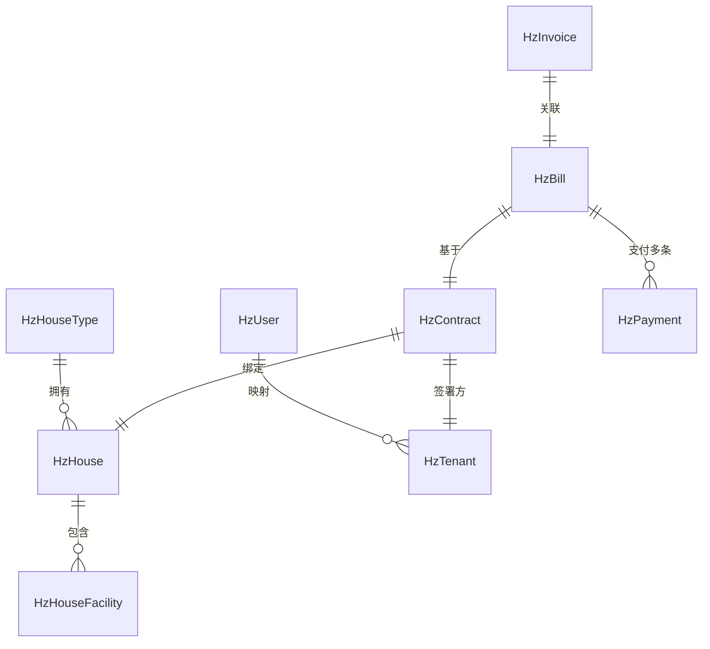
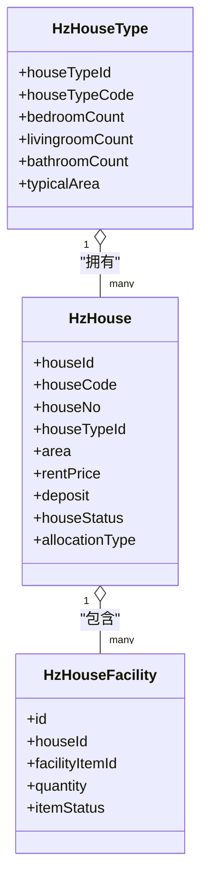
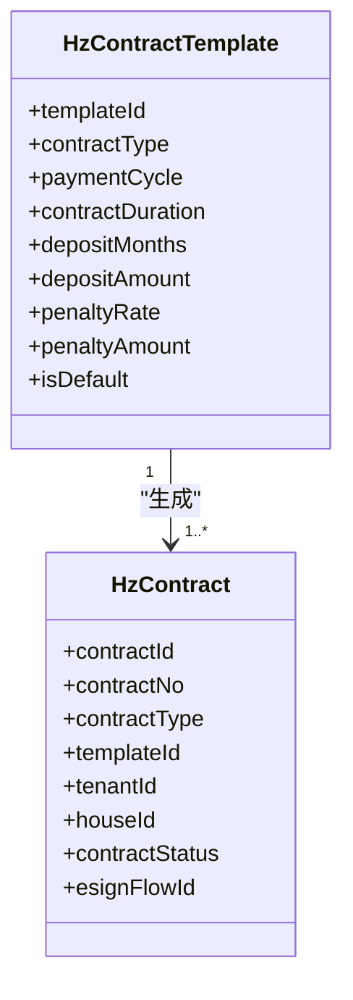
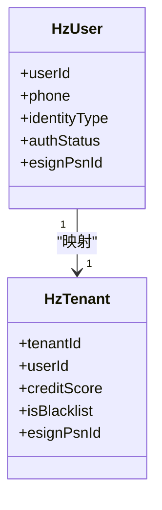
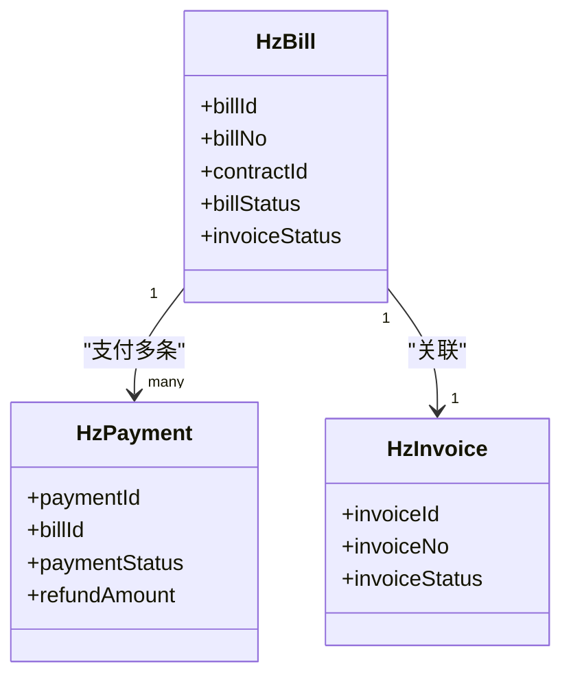
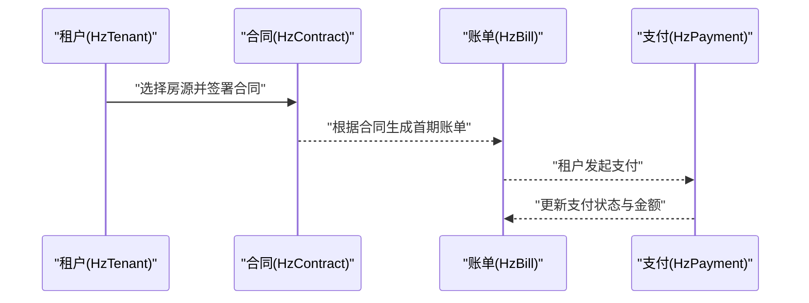
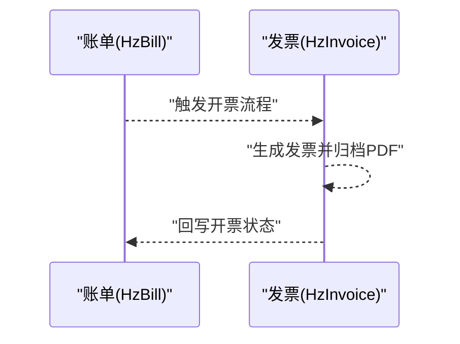

# 核心数据模型

<cite>
**本文引用的文件**
- [HzHouse.java](file://ruoyi-system/src/main/java/com/ruoyi/system/domain/HzHouse.java)
- [HzHouseType.java](file://ruoyi-system/src/main/java/com/ruoyi/system/domain/HzHouseType.java)
- [HzHouseFacility.java](file://ruoyi-system/src/main/java/com/ruoyi/system/domain/HzHouseFacility.java)
- [HzContract.java](file://ruoyi-system/src/main/java/com/ruoyi/system/domain/HzContract.java)
- [HzContractTemplate.java](file://ruoyi-system/src/main/java/com/ruoyi/system/domain/HzContractTemplate.java)
- [HzUser.java](file://ruoyi-system/src/main/java/com/ruoyi/system/domain/HzUser.java)
- [HzTenant.java](file://ruoyi-system/src/main/java/com/ruoyi/system/domain/HzTenant.java)
- [HzBill.java](file://ruoyi-system/src/main/java/com/ruoyi/system/domain/HzBill.java)
- [HzPayment.java](file://ruoyi-system/src/main/java/com/ruoyi/system/domain/HzPayment.java)
- [HzInvoice.java](file://ruoyi-system/src/main/java/com/ruoyi/system/domain/HzInvoice.java)
</cite>

## 目录
1. [简介](#简介)
2. [项目结构与范围](#项目结构与范围)
3. [核心组件总览](#核心组件总览)
4. [架构概览](#架构概览)
5. [详细组件分析](#详细组件分析)
6. [依赖关系分析](#依赖关系分析)
7. [性能与索引策略](#性能与索引策略)
8. [故障排查指南](#故障排查指南)
9. [结论](#结论)
10. [附录：字段说明表](#附录字段说明表)

## 简介
本文件聚焦港好住信息系统的核心业务数据模型，覆盖房源管理、合同管理、用户与租户管理、财务与票据管理等关键领域。通过对各实体的字段定义、数据类型、约束条件、业务规则与相互关系进行系统梳理，帮助开发者与产品人员快速理解数据设计思路与使用边界，并为后续扩展与优化提供依据。

## 项目结构与范围
本次文档围绕 ruoyi-system 模块中的核心领域模型展开，涉及以下实体：
- 房源管理：HzHouse、HzHouseType、HzHouseFacility
- 合同管理：HzContract、HzContractTemplate
- 用户与租户：HzUser、HzTenant
- 财务与票据：HzBill、HzPayment、HzInvoice

这些实体通过外键与业务字段建立紧密关联，支撑从“房源发布—租户申请—合同签署—账单生成—支付与开票”的完整闭环。

## 核心组件总览
- 房源管理：以 HzHouse 为核心，承载房源基础信息与状态；HzHouseType 描述户型维度；HzHouseFacility 关联设施明细。
- 合同管理：HzContract 记录合同生命周期与关键条款；HzContractTemplate 提供模板化配置。
- 用户与租户：HzUser 管理用户账户与认证；HzTenant 管理租户档案与信用。
- 财务与票据：HzBill 生成账单；HzPayment 记录支付流水；HzInvoice 管理发票归档。

## 架构概览
下图展示核心实体之间的关系与典型交互路径：

图表来源
- [HzHouse.java:20-441](file://ruoyi-system/src/main/java/com/ruoyi/system/domain/HzHouse.java#L20-L441)
- [HzHouseType.java:18-257](file://ruoyi-system/src/main/java/com/ruoyi/system/domain/HzHouseType.java#L18-L257)
- [HzHouseFacility.java:16-166](file://ruoyi-system/src/main/java/com/ruoyi/system/domain/HzHouseFacility.java#L16-L166)
- [HzContract.java:19-606](file://ruoyi-system/src/main/java/com/ruoyi/system/domain/HzContract.java#L19-L606)
- [HzContractTemplate.java:18-228](file://ruoyi-system/src/main/java/com/ruoyi/system/domain/HzContractTemplate.java#L18-L228)
- [HzUser.java:19-375](file://ruoyi-system/src/main/java/com/ruoyi/system/domain/HzUser.java#L19-L375)
- [HzTenant.java:16-316](file://ruoyi-system/src/main/java/com/ruoyi/system/domain/HzTenant.java#L16-L316)
- [HzBill.java:19-354](file://ruoyi-system/src/main/java/com/ruoyi/system/domain/HzBill.java#L19-L354)
- [HzPayment.java:18-202](file://ruoyi-system/src/main/java/com/ruoyi/system/domain/HzPayment.java#L18-L202)
- [HzInvoice.java:16-223](file://ruoyi-system/src/main/java/com/ruoyi/system/domain/HzInvoice.java#L16-L223)

## 详细组件分析

### 房源管理模型
- HzHouse（房源）
  - 关键字段：houseId、projectId、buildingId、unitId、houseCode、houseNo、floor、houseTypeId、houseTypeName、area、rentPrice、deposit、orientation、decoration、facilities、houseStatus、isFeatured、viewCount、allocationType、isFreshGraduate、managerPhone、status。
  - 约束与规则：houseCode 唯一性用于导入与展示；houseStatus 表征房源状态流转；allocationType 决定分配策略；isFreshGraduate 用于政策倾斜；managerPhone 便于租户沟通。
  - 业务背景：统一管理房源基础属性与状态，支撑选房、预约、分配与入住流程。
  - 字段来源参考
    - [HzHouse.java:25-146](file://ruoyi-system/src/main/java/com/ruoyi/system/domain/HzHouse.java#L25-L146)

- HzHouseType（户型）
  - 关键字段：houseTypeId、projectId、projectName、houseTypeName、houseTypeCode、bedroomCount、livingroomCount、bathroomCount、kitchenCount、balconyCount、typicalArea、layoutImage、vrUrl、status、sortOrder、delFlag。
  - 约束与规则：delFlag 支持逻辑删除；typicalArea 作为面积参考；layoutImage/vrUrl 用于营销与展示。
  - 业务背景：标准化户型维度，支撑房源与营销配置。
  - 字段来源参考
    - [HzHouseType.java:23-74](file://ruoyi-system/src/main/java/com/ruoyi/system/domain/HzHouseType.java#L23-L74)

- HzHouseFacility（房源设施）
  - 关键字段：id、houseId、facilityItemId、facilityName、facilityCategory、quantity、itemStatus、remark、delFlag。
  - 约束与规则：facilityName/facilityCategory 冗余存储提升查询效率；quantity 控制设施数量；itemStatus 管控设施状态。
  - 业务背景：精细化管理房源设施清单，支持设施盘点与维护。
  - 字段来源参考
    - [HzHouseFacility.java:21-56](file://ruoyi-system/src/main/java/com/ruoyi/system/domain/HzHouseFacility.java#L21-L56)

图表来源
- [HzHouse.java:20-441](file://ruoyi-system/src/main/java/com/ruoyi/system/domain/HzHouse.java#L20-L441)
- [HzHouseType.java:18-257](file://ruoyi-system/src/main/java/com/ruoyi/system/domain/HzHouseType.java#L18-L257)
- [HzHouseFacility.java:16-166](file://ruoyi-system/src/main/java/com/ruoyi/system/domain/HzHouseFacility.java#L16-L166)

章节来源
- [HzHouse.java:20-441](file://ruoyi-system/src/main/java/com/ruoyi/system/domain/HzHouse.java#L20-L441)
- [HzHouseType.java:18-257](file://ruoyi-system/src/main/java/com/ruoyi/system/domain/HzHouseType.java#L18-L257)
- [HzHouseFacility.java:16-166](file://ruoyi-system/src/main/java/com/ruoyi/system/domain/HzHouseFacility.java#L16-L166)

### 合同管理模型
- HzContract（合同）
  - 关键字段：contractId、contractNo、contractType、templateId、batchId、tenantId、tenantName、tenantIdCard、tenantPhone、projectId、houseId、houseCode、houseAddress、rentPrice、deposit、startDate、endDate、rentMonths、paymentCycle、paymentDay、freeRentPeriods、contractContent、contractFile、tenantSignature、landlordSignature、signTime、contractStatus、isRenewed、renewedContractId、esignFlowId、delFlag。
  - 约束与规则：contractStatus 覆盖草稿到解约全生命周期；paymentCycle 与 paymentDay 决定计费节奏；esignFlowId 支持电子签集成。
  - 业务背景：统一合同生命周期管理，支撑签约、履约与续租。
  - 字段来源参考
    - [HzContract.java:23-154](file://ruoyi-system/src/main/java/com/ruoyi/system/domain/HzContract.java#L23-L154)

- HzContractTemplate（合同模板）
  - 关键字段：templateId、templateName、templateCode、contractType、templateContent、paymentCycle、contractDuration、depositMonths、depositAmount、penaltyRate、penaltyAmount、version、isDefault、status、delFlag。
  - 约束与规则：isDefault 控制默认模板；contractType 区分政策类型；penaltyAmount/penaltyRate 支持违约金计算。
  - 业务背景：模板化配置合同条款，提高生成效率与一致性。
  - 字段来源参考
    - [HzContractTemplate.java:22-80](file://ruoyi-system/src/main/java/com/ruoyi/system/domain/HzContractTemplate.java#L22-L80)

图表来源
- [HzContract.java:19-606](file://ruoyi-system/src/main/java/com/ruoyi/system/domain/HzContract.java#L19-L606)
- [HzContractTemplate.java:18-228](file://ruoyi-system/src/main/java/com/ruoyi/system/domain/HzContractTemplate.java#L18-L228)

章节来源
- [HzContract.java:19-606](file://ruoyi-system/src/main/java/com/ruoyi/system/domain/HzContract.java#L19-L606)
- [HzContractTemplate.java:18-228](file://ruoyi-system/src/main/java/com/ruoyi/system/domain/HzContractTemplate.java#L18-L228)

### 用户与租户模型
- HzUser（用户）
  - 关键字段：userId、phone、contactPhone、sourceType、wechatOpenid、wechatUnionid、zhaohaoUserId、nickname、avatar、realName、gender、idCard、education、identityType、workUnit、unitContact、unitNature、spouseName、workProofAttachment、status、lastLoginTime、lastLoginIp、delFlag、loginType、isInfoCompleted、esignPsnId、authStatus、authTime。
  - 约束与规则：identityType 与 unitNature 支持身份与单位性质分类；authStatus 支持实名认证状态追踪。
  - 业务背景：统一用户账户与认证信息，支撑登录、认证与电子签对接。
  - 字段来源参考
    - [HzUser.java:23-123](file://ruoyi-system/src/main/java/com/ruoyi/system/domain/HzUser.java#L23-L123)

- HzTenant（租户）
  - 关键字段：tenantId、userId、tenantName、idCard、phone、gender、birthDate、education、marriageStatus、householdRegister、currentAddress、workUnit、emergencyContact、emergencyPhone、email、wechat、avatar、creditScore、isBlacklist、status、delFlag、esignPsnId。
  - 约束与规则：creditScore 用于信用评估；isBlacklist 用于风险控制；esignPsnId 支持电子签对接。
  - 业务背景：管理租户档案与信用，支撑签约与履约评估。
  - 字段来源参考
    - [HzTenant.java:20-106](file://ruoyi-system/src/main/java/com/ruoyi/system/domain/HzTenant.java#L20-L106)

图表来源
- [HzUser.java:19-375](file://ruoyi-system/src/main/java/com/ruoyi/system/domain/HzUser.java#L19-L375)
- [HzTenant.java:16-316](file://ruoyi-system/src/main/java/com/ruoyi/system/domain/HzTenant.java#L16-L316)

章节来源
- [HzUser.java:19-375](file://ruoyi-system/src/main/java/com/ruoyi/system/domain/HzUser.java#L19-L375)
- [HzTenant.java:16-316](file://ruoyi-system/src/main/java/com/ruoyi/system/domain/HzTenant.java#L16-L316)

### 财务与票据模型
- HzBill（账单）
  - 关键字段：billId、billNo、orderNo、contractId、tenantId、tenantName、houseId、houseCode、billType、billPeriod、billAmount、paidAmount、unpaidAmount、billDate、dueDate、lateFee、billStatus、invoiceStatus、payTime、payMethod、transactionNo、delFlag、isOverdue、overdueDays。
  - 约束与规则：billStatus 覆盖待支付到关闭；unpaidAmount 与 lateFee 支持逾期管理；invoiceStatus 与 orderNo 支持支付回调与开票联动。
  - 业务背景：生成与跟踪账单，支撑收费与对账。
  - 字段来源参考
    - [HzBill.java:23-125](file://ruoyi-system/src/main/java/com/ruoyi/system/domain/HzBill.java#L23-L125)

- HzPayment（支付记录）
  - 关键字段：paymentId、billId、paymentNo、paymentAmount、paymentMethod、paymentStatus、transactionNo、payTime、refundAmount、refundTime、refundReason、paymentVoucher、delFlag。
  - 约束与规则：paymentStatus 覆盖待支付到已退款；refundReason 与 refundTime 支持退款审计。
  - 业务背景：记录支付流水，支撑资金核对与风控。
  - 字段来源参考
    - [HzPayment.java:22-72](file://ruoyi-system/src/main/java/com/ruoyi/system/domain/HzPayment.java#L22-L72)

- HzInvoice（发票）
  - 关键字段：invoiceId、invoiceCode、invoiceNo、applyId、tenantId、invoiceType、invoiceTitle、taxNo、invoiceAmount、invoiceDate、invoiceFile、invoiceStatus、delFlag。
  - 约束与规则：invoiceStatus 覆盖已开具到作废/红冲；invoiceFile 存储 PDF 文件路径。
  - 业务背景：管理发票生命周期，支撑财务入账与合规。
  - 字段来源参考
    - [HzInvoice.java:21-71](file://ruoyi-system/src/main/java/com/ruoyi/system/domain/HzInvoice.java#L21-L71)

图表来源
- [HzBill.java:19-354](file://ruoyi-system/src/main/java/com/ruoyi/system/domain/HzBill.java#L19-L354)
- [HzPayment.java:18-202](file://ruoyi-system/src/main/java/com/ruoyi/system/domain/HzPayment.java#L18-L202)
- [HzInvoice.java:16-223](file://ruoyi-system/src/main/java/com/ruoyi/system/domain/HzInvoice.java#L16-L223)

章节来源
- [HzBill.java:19-354](file://ruoyi-system/src/main/java/com/ruoyi/system/domain/HzBill.java#L19-L354)
- [HzPayment.java:18-202](file://ruoyi-system/src/main/java/com/ruoyi/system/domain/HzPayment.java#L18-L202)
- [HzInvoice.java:16-223](file://ruoyi-system/src/main/java/com/ruoyi/system/domain/HzInvoice.java#L16-L223)

### 典型业务场景与数据流示意

#### 场景一：合同生成与支付

图表来源
- [HzContract.java:19-606](file://ruoyi-system/src/main/java/com/ruoyi/system/domain/HzContract.java#L19-L606)
- [HzBill.java:19-354](file://ruoyi-system/src/main/java/com/ruoyi/system/domain/HzBill.java#L19-L354)
- [HzPayment.java:18-202](file://ruoyi-system/src/main/java/com/ruoyi/system/domain/HzPayment.java#L18-L202)

#### 场景二：发票开具与归档

图表来源
- [HzBill.java:19-354](file://ruoyi-system/src/main/java/com/ruoyi/system/domain/HzBill.java#L19-L354)
- [HzInvoice.java:16-223](file://ruoyi-system/src/main/java/com/ruoyi/system/domain/HzInvoice.java#L16-L223)

## 依赖关系分析
- 外键与业务关联
  - HzContract.houseId → HzHouse.houseId
  - HzContract.tenantId → HzTenant.tenantId
  - HzBill.contractId → HzContract.contractId
  - HzPayment.billId → HzBill.billId
  - HzInvoice.applyId 通常与 HzBill 关联（视业务实现）
- 冗余字段与一致性
  - HzContract 冗余存储房源与租户相关信息，便于报表与展示，需通过服务层保证一致性。
- 逻辑删除
  - HzHouseType.delFlag、HzHouseFacility.delFlag、HzContractTemplate.delFlag、HzInvoice.delFlag 使用逻辑删除，避免物理删除带来的数据链路断裂。

章节来源
- [HzContract.java:19-606](file://ruoyi-system/src/main/java/com/ruoyi/system/domain/HzContract.java#L19-L606)
- [HzBill.java:19-354](file://ruoyi-system/src/main/java/com/ruoyi/system/domain/HzBill.java#L19-L354)
- [HzPayment.java:18-202](file://ruoyi-system/src/main/java/com/ruoyi/system/domain/HzPayment.java#L18-L202)
- [HzHouseType.java:72-74](file://ruoyi-system/src/main/java/com/ruoyi/system/domain/HzHouseType.java#L72-L74)
- [HzHouseFacility.java:53-56](file://ruoyi-system/src/main/java/com/ruoyi/system/domain/HzHouseFacility.java#L53-L56)
- [HzContractTemplate.java:78-80](file://ruoyi-system/src/main/java/com/ruoyi/system/domain/HzContractTemplate.java#L78-L80)
- [HzInvoice.java:69-71](file://ruoyi-system/src/main/java/com/ruoyi/system/domain/HzInvoice.java#L69-L71)

## 性能与索引策略
- 建议索引
  - HzHouse.houseCode（唯一索引）：保障房源唯一性与导入效率
  - HzContract.contractNo（唯一索引）：合同编号唯一性
  - HzBill.billNo（唯一索引）：账单编号唯一性
  - HzBill.contractId、HzPayment.billId：加速账单与支付关联查询
  - HzContract.tenantId、HzTenant.userId：加速租户与合同关联
  - HzHouseType.projectId、HzHouse.projectId：加速项目级查询
- 数据类型与精度
  - 金额类字段采用高精度类型，避免浮点误差
  - 日期/时间字段采用字符串或日期类型，结合应用层格式化
- 逻辑删除与分页
  - 逻辑删除字段需纳入查询过滤条件，避免误读历史数据
  - 对高频查询字段（如 houseStatus、billStatus、contractStatus）建议建立二级索引

## 故障排查指南
- 常见问题定位
  - 合同状态异常：检查 HzContract.contractStatus 的流转规则与外部系统回调（如电子签）状态同步
  - 账单未生成：确认 HzContract 是否完成签署、HzBill 是否按周期正确生成
  - 支付未到账：核对 HzPayment.paymentStatus 与第三方交易号，检查回调处理
  - 发票异常：核对 HzInvoice.invoiceStatus 与 HzBill.invoiceStatus 的一致性
- 数据一致性
  - 冗余字段（如 HzContract 中的房源与租户信息）需在变更时同步更新
  - 逻辑删除字段需在查询时显式过滤

章节来源
- [HzContract.java:19-606](file://ruoyi-system/src/main/java/com/ruoyi/system/domain/HzContract.java#L19-L606)
- [HzBill.java:19-354](file://ruoyi-system/src/main/java/com/ruoyi/system/domain/HzBill.java#L19-L354)
- [HzPayment.java:18-202](file://ruoyi-system/src/main/java/com/ruoyi/system/domain/HzPayment.java#L18-L202)
- [HzInvoice.java:16-223](file://ruoyi-system/src/main/java/com/ruoyi/system/domain/HzInvoice.java#L16-L223)

## 结论
港好住信息系统的核心数据模型围绕“房源—合同—租户—账单—支付—发票”主线构建，通过清晰的实体边界、合理的冗余字段与逻辑删除策略，实现了业务可追溯、数据可治理与性能可优化。建议在后续迭代中持续完善索引策略、强化状态机校验与异步回调处理，确保系统在高并发场景下的稳定性与一致性。

## 附录：字段说明表

- HzHouse（房源）
  - houseId：主键
  - houseCode：房源编码（唯一）
  - houseNo：房间号
  - houseTypeId：户型ID
  - area：建筑面积
  - rentPrice：月租金
  - deposit：押金
  - houseStatus：房源状态
  - allocationType：分配类型
  - isFreshGraduate：是否应届生房源
  - managerPhone：管家电话
  - status：状态

- HzHouseType（户型）
  - houseTypeId：主键
  - houseTypeCode：户型编码
  - bedroomCount/livingroomCount/bathroomCount/kitchenCount/balconyCount：房间构成
  - typicalArea：典型面积
  - layoutImage/vrUrl：营销资源
  - status/sortOrder/delFlag：状态与逻辑删除

- HzHouseFacility（房源设施）
  - id：主键
  - houseId：所属房源
  - facilityItemId/facilityName/facilityCategory：设施项与分类
  - quantity：数量
  - itemStatus：设施状态
  - remark/delFlag：备注与逻辑删除

- HzContract（合同）
  - contractId：主键
  - contractNo：合同编号（唯一）
  - contractType/templateId：合同类型与模板
  - tenantId/houseId：租户与房源
  - startDate/endDate/rentMonths/paymentCycle/paymentDay：租期与缴费
  - contractStatus/esignFlowId：状态与电子签流程
  - delFlag：逻辑删除

- HzContractTemplate（合同模板）
  - templateId：主键
  - templateCode：模板编码
  - contractType：合同类型
  - paymentCycle/contractDuration/depositMonths/depositAmount：计费与押金
  - penaltyRate/penaltyAmount：违约金
  - isDefault/status/delFlag：默认与状态

- HzUser（用户）
  - userId：主键
  - phone/sourceType：登录账号与来源
  - identityType/workUnit/unitNature：身份与单位
  - authStatus/esignPsnId：认证与电子签

- HzTenant（租户）
  - tenantId：主键
  - userId：用户映射
  - creditScore/isBlacklist：信用与风控
  - esignPsnId：电子签

- HzBill（账单）
  - billId：主键
  - billNo/orderNo：账单编号与订单号
  - contractId/tenantId/houseId：关联关系
  - billType/billPeriod/billAmount/paidAmount/unpaidAmount：账单要素
  - dueDate/l latterFee：到期与滞纳金
  - billStatus/invoiceStatus：状态与开票状态
  - transactionNo/payMethod/payTime：支付信息

- HzPayment（支付记录）
  - paymentId：主键
  - billId：所属账单
  - paymentNo/paymentAmount：支付流水与金额
  - paymentMethod/paymentStatus：支付方式与状态
  - transactionNo/payTime/refundAmount/refundTime/refundReason：第三方与退款
  - paymentVoucher/delFlag：凭证与逻辑删除

- HzInvoice（发票）
  - invoiceId：主键
  - invoiceCode/invoiceNo：发票代码与号码
  - applyId/tenantId：申请与租户
  - invoiceType/invoiceTitle/taxNo：发票类型与抬头
  - invoiceAmount/invoiceDate：金额与开票日期
  - invoiceFile/invoiceStatus/delFlag：文件与状态

章节来源
- [HzHouse.java:20-441](file://ruoyi-system/src/main/java/com/ruoyi/system/domain/HzHouse.java#L20-L441)
- [HzHouseType.java:18-257](file://ruoyi-system/src/main/java/com/ruoyi/system/domain/HzHouseType.java#L18-L257)
- [HzHouseFacility.java:16-166](file://ruoyi-system/src/main/java/com/ruoyi/system/domain/HzHouseFacility.java#L16-L166)
- [HzContract.java:19-606](file://ruoyi-system/src/main/java/com/ruoyi/system/domain/HzContract.java#L19-L606)
- [HzContractTemplate.java:18-228](file://ruoyi-system/src/main/java/com/ruoyi/system/domain/HzContractTemplate.java#L18-L228)
- [HzUser.java:19-375](file://ruoyi-system/src/main/java/com/ruoyi/system/domain/HzUser.java#L19-L375)
- [HzTenant.java:16-316](file://ruoyi-system/src/main/java/com/ruoyi/system/domain/HzTenant.java#L16-L316)
- [HzBill.java:19-354](file://ruoyi-system/src/main/java/com/ruoyi/system/domain/HzBill.java#L19-L354)
- [HzPayment.java:18-202](file://ruoyi-system/src/main/java/com/ruoyi/system/domain/HzPayment.java#L18-L202)
- [HzInvoice.java:16-223](file://ruoyi-system/src/main/java/com/ruoyi/system/domain/HzInvoice.java#L16-L223)