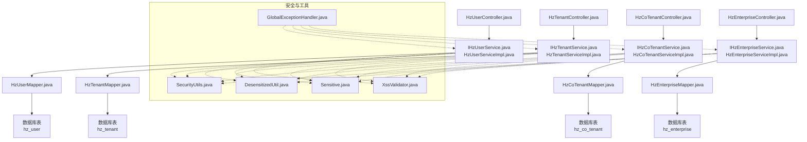
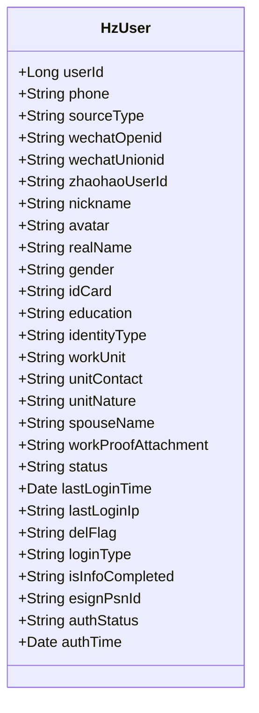
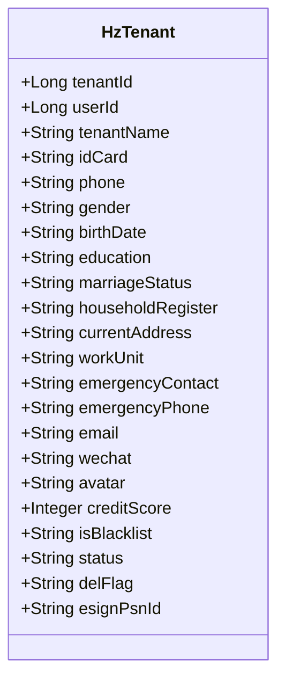
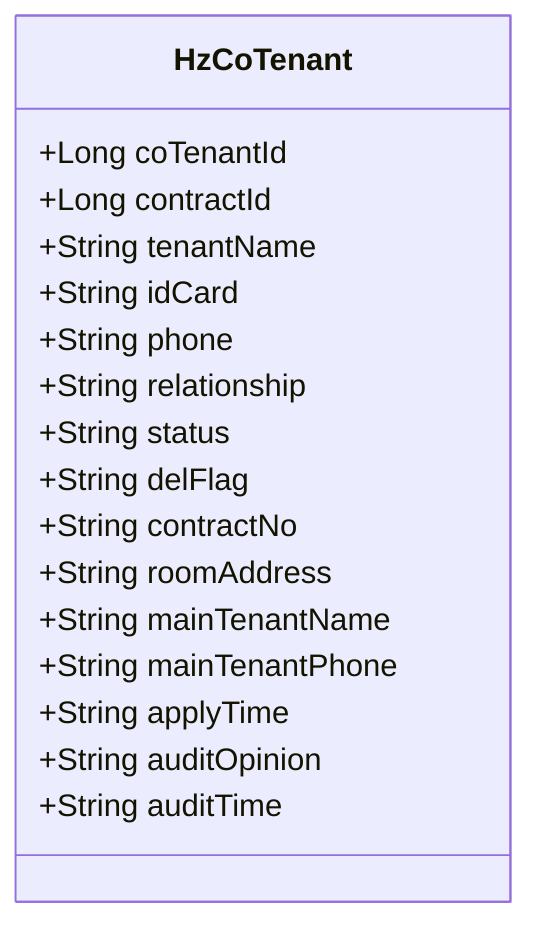
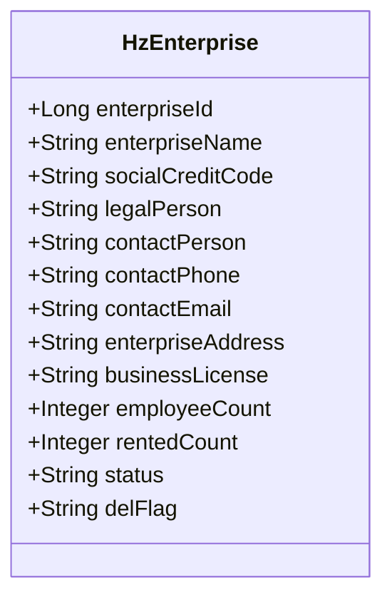
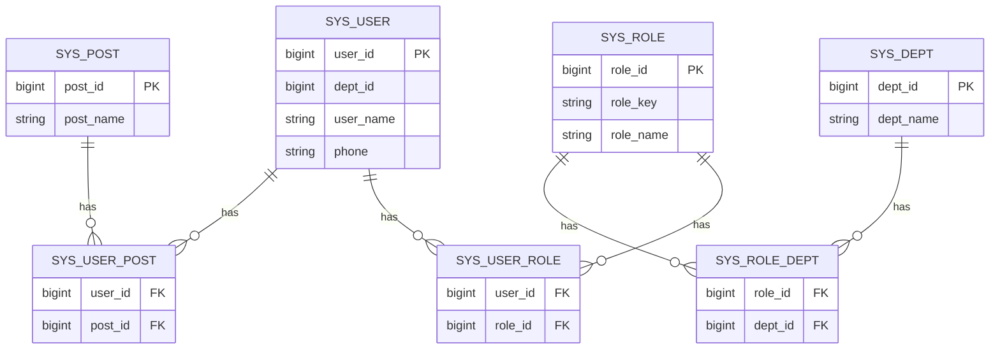
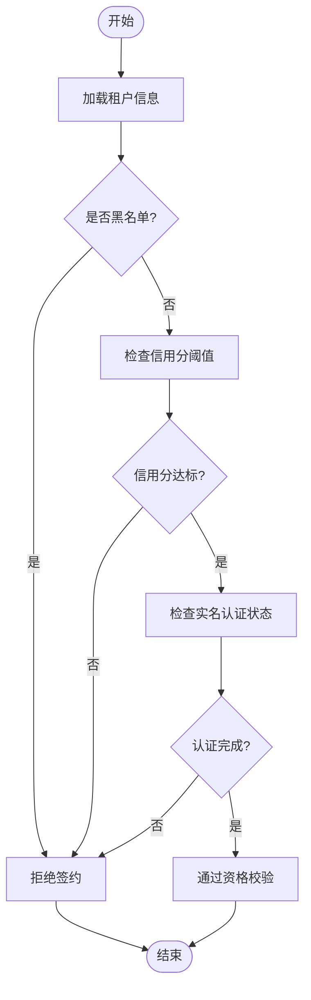
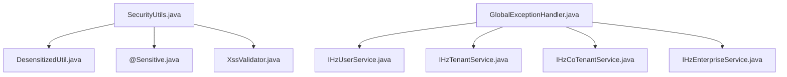
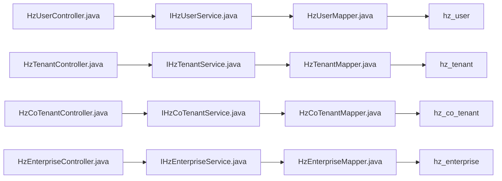

# 用户与租户模型

<cite>
**本文引用的文件**
- [HzUser.java](file://ruoyi-system/src/main/java/com/ruoyi/system/domain/HzUser.java)
- [HzTenant.java](file://ruoyi-system/src/main/java/com/ruoyi/system/domain/HzTenant.java)
- [HzCoTenant.java](file://ruoyi-system/src/main/java/com/ruoyi/system/domain/HzCoTenant.java)
- [HzEnterprise.java](file://ruoyi-system/src/main/java/com/ruoyi/system/domain/HzEnterprise.java)
- [HzUserMapper.java](file://ruoyi-system/src/main/java/com/ruoyi/system/mapper/HzUserMapper.java)
- [HzTenantMapper.java](file://ruoyi-system/src/main/java/com/ruoyi/system/mapper/HzTenantMapper.java)
- [HzCoTenantMapper.java](file://ruoyi-system/src/main/java/com/ruoyi/system/mapper/HzCoTenantMapper.java)
- [HzEnterpriseMapper.java](file://ruoyi-system/src/main/java/com/ruoyi/system/mapper/HzEnterpriseMapper.java)
- [IHzUserService.java](file://ruoyi-system/src/main/java/com/ruoyi/system/service/IHzUserService.java)
- [IHzTenantService.java](file://ruoyi-system/src/main/java/com/ruoyi/system/service/IHzTenantService.java)
- [IHzCoTenantService.java](file://ruoyi-system/src/main/java/com/ruoyi/system/service/IHzCoTenantService.java)
- [IHzEnterpriseService.java](file://ruoyi-system/src/main/java/com/ruoyi/system/service/IHzEnterpriseService.java)
- [HzUserServiceImpl.java](file://ruoyi-system/src/main/java/com/ruoyi/system/service/impl/HzUserServiceImpl.java)
- [HzTenantServiceImpl.java](file://ruoyi-system/src/main/java/com/ruoyi/system/service/impl/HzTenantServiceImpl.java)
- [HzCoTenantServiceImpl.java](file://ruoyi-system/src/main/java/com/ruoyi/system/service/impl/HzCoTenantServiceImpl.java)
- [HzEnterpriseServiceImpl.java](file://ruoyi-system/src/main/java/com/ruoyi/system/service/impl/HzEnterpriseServiceImpl.java)
- [HzUserController.java](file://ruoyi-admin/src/main/java/com/ruoyi/web/controller/system/HzUserController.java)
- [HzTenantController.java](file://ruoyi-admin/src/main/java/com/ruoyi/web/controller/system/HzTenantController.java)
- [HzCoTenantController.java](file://ruoyi-admin/src/main/java/com/ruoyi/web/controller/system/HzCoTenantController.java)
- [HzEnterpriseController.java](file://ruoyi-admin/src/main/java/com/ruoyi/web/controller/system/HzEnterpriseController.java)
- [HzUserAppController.java](file://ruoyi-admin/src/main/java/com/ruoyi/web/controller/h5/HzUserAppController.java)
- [HzTenantController.java](file://ruoyi-admin/src/main/java/com/ruoyi/web/controller/h5/HzTenantController.java)
- [SysUserMapper.java](file://ruoyi-system/src/main/java/com/ruoyi/system/mapper/SysUserMapper.java)
- [SysRoleMapper.java](file://ruoyi-system/src/main/java/com/ruoyi/system/mapper/SysRoleMapper.java)
- [SysDeptMapper.java](file://ruoyi-system/src/main/java/com/ruoyi/system/mapper/SysDeptMapper.java)
- [SysUserRoleMapper.java](file://ruoyi-system/src/main/java/com/ruoyi/system/mapper/SysUserRoleMapper.java)
- [SysRoleDeptMapper.java](file://ruoyi-system/src/main/java/com/ruoyi/system/mapper/SysRoleDeptMapper.java)
- [SysUserPostMapper.java](file://ruoyi-system/src/main/java/com/ruoyi/system/mapper/SysUserPostMapper.java)
- [SysPostMapper.java](file://ruoyi-system/src/main/java/com/ruoyi/system/mapper/SysPostMapper.java)
- [DesensitizedUtil.java](file://ruoyi-common/src/main/java/com/ruoyi/common/utils/DesensitizedUtil.java)
- [SecurityUtils.java](file://ruoyi-common/src/main/java/com/ruoyi/common/utils/SecurityUtils.java)
- [UserConstants.java](file://ruoyi-common/src/main/java/com/ruoyi/common/constant/UserConstants.java)
- [UserStatus.java](file://ruoyi-common/src/main/java/com/ruoyi/common/enums/UserStatus.java)
- [DesensitizedType.java](file://ruoyi-common/src/main/java/com/ruoyi/common/enums/DesensitizedType.java)
- [Sensitive.java](file://ruoyi-common/src/main/java/com/ruoyi/common/annotation/Sensitive.java)
- [XssValidator.java](file://ruoyi-common/src/main/java/com/ruoyi/common/xss/XssValidator.java)
- [Xss.java](file://ruoyi-common/src/main/java/com/ruoyi/common/xss/Xss.java)
- [GlobalExceptionHandler.java](file://ruoyi-framework/src/main/java/com/ruoyi/framework/web/exception/GlobalExceptionHandler.java)
</cite>

## 目录
1. [简介](#简介)
2. [项目结构](#项目结构)
3. [核心组件](#核心组件)
4. [架构总览](#架构总览)
5. [详细组件分析](#详细组件分析)
6. [依赖分析](#依赖分析)
7. [性能考虑](#性能考虑)
8. [故障排查指南](#故障排查指南)
9. [结论](#结论)
10. [附录](#附录)

## 简介
本文件聚焦港好住信息系统中的“用户与租户模型”，系统性梳理以下实体与模型：
- 用户实体（HzUser）：涵盖用户基本信息、身份认证、权限状态等核心字段
- 租户实体（HzTenant）：描述房屋承租人的基础档案与资格校验相关字段
- 共同承租人模型（HzCoTenant）：支持多人承租的申请与审核流程
- 企业用户模型（HzEnterprise）：面向企业客户的批量业务数据结构
- 角色权限体系：用户与角色、部门、岗位的关联关系
- 数据安全与隐私保护：脱敏策略、输入校验与异常处理机制

通过对实体定义、服务层、控制器层及安全工具的综合分析，帮助读者快速理解模型设计、业务流程与实现要点。

## 项目结构
围绕用户与租户模型的相关文件主要分布在 ruoyi-system（领域模型与服务）、ruoyi-admin（Web 控制器）与 ruoyi-common/ruoyi-framework（通用工具与安全框架）中。下图展示关键文件在系统中的位置与职责分工：

```mermaid
graph TB
subgraph "系统层"
SYS["ruoyi-system<br/>领域模型/服务/映射"]
ADMIN["ruoyi-admin<br/>Web控制器"]
COMMON["ruoyi-common<br/>通用工具/注解/常量"]
FRAMEWORK["ruoyi-framework<br/>安全/拦截/异常处理"]
end
subgraph "用户与租户模型"
U["HzUser.java"]
T["HzTenant.java"]
CT["HzCoTenant.java"]
E["HzEnterprise.java"]
UM["HzUserMapper.java"]
TM["HzTenantMapper.java"]
Ctm["HzCoTenantMapper.java"]
EM["HzEnterpriseMapper.java"]
UIS["IHzUserService.java"]
TIS["IHzTenantService.java"]
CTIS["IHzCoTenantService.java"]
EIS["IHzEnterpriseService.java"]
UISI["HzUserServiceImpl.java"]
TISI["HzTenantServiceImpl.java"]
CTISI["HzCoTenantServiceImpl.java"]
EISI["HzEnterpriseServiceImpl.java"]
UC["HzUserController.java"]
TC["HzTenantController.java"]
CTC["HzCoTenantController.java"]
EC["HzEnterpriseController.java"]
end
SYS --> U
SYS --> T
SYS --> CT
SYS --> E
SYS --> UM
SYS --> TM
SYS --> Ctm
SYS --> EM
SYS --> UIS
SYS --> TIS
SYS --> CTIS
SYS --> EIS
SYS --> UISI
SYS --> TISI
SYS --> CTISI
SYS --> EISI
ADMIN --> UC
ADMIN --> TC
ADMIN --> CTC
ADMIN --> EC
COMMON --> DES["DesensitizedUtil.java"]
COMMON --> SEC["SecurityUtils.java"]
COMMON --> UCN["UserConstants.java"]
COMMON --> UST["UserStatus.java"]
COMMON --> DST["DesensitizedType.java"]
COMMON --> SEN["Sensitive.java"]
FRAMEWORK --> XSS["XssValidator.java"]
FRAMEWORK --> X["Xss.java"]
FRAMEWORK --> GEX["GlobalExceptionHandler.java"]
```

图表来源
- [HzUser.java:1-375](file://ruoyi-system/src/main/java/com/ruoyi/system/domain/HzUser.java#L1-L375)
- [HzTenant.java:1-316](file://ruoyi-system/src/main/java/com/ruoyi/system/domain/HzTenant.java#L1-L316)
- [HzCoTenant.java:1-221](file://ruoyi-system/src/main/java/com/ruoyi/system/domain/HzCoTenant.java#L1-L221)
- [HzEnterprise.java:1-201](file://ruoyi-system/src/main/java/com/ruoyi/system/domain/HzEnterprise.java#L1-L201)
- [HzUserMapper.java](file://ruoyi-system/src/main/java/com/ruoyi/system/mapper/HzUserMapper.java)
- [HzTenantMapper.java](file://ruoyi-system/src/main/java/com/ruoyi/system/mapper/HzTenantMapper.java)
- [HzCoTenantMapper.java](file://ruoyi-system/src/main/java/com/ruoyi/system/mapper/HzCoTenantMapper.java)
- [HzEnterpriseMapper.java](file://ruoyi-system/src/main/java/com/ruoyi/system/mapper/HzEnterpriseMapper.java)
- [IHzUserService.java](file://ruoyi-system/src/main/java/com/ruoyi/system/service/IHzUserService.java)
- [IHzTenantService.java](file://ruoyi-system/src/main/java/com/ruoyi/system/service/IHzTenantService.java)
- [IHzCoTenantService.java](file://ruoyi-system/src/main/java/com/ruoyi/system/service/IHzCoTenantService.java)
- [IHzEnterpriseService.java](file://ruoyi-system/src/main/java/com/ruoyi/system/service/IHzEnterpriseService.java)
- [HzUserServiceImpl.java](file://ruoyi-system/src/main/java/com/ruoyi/system/service/impl/HzUserServiceImpl.java)
- [HzTenantServiceImpl.java](file://ruoyi-system/src/main/java/com/ruoyi/system/service/impl/HzTenantServiceImpl.java)
- [HzCoTenantServiceImpl.java](file://ruoyi-system/src/main/java/com/ruoyi/system/service/impl/HzCoTenantServiceImpl.java)
- [HzEnterpriseServiceImpl.java](file://ruoyi-system/src/main/java/com/ruoyi/system/service/impl/HzEnterpriseServiceImpl.java)
- [HzUserController.java](file://ruoyi-admin/src/main/java/com/ruoyi/web/controller/system/HzUserController.java)
- [HzTenantController.java](file://ruoyi-admin/src/main/java/com/ruoyi/web/controller/system/HzTenantController.java)
- [HzCoTenantController.java](file://ruoyi-admin/src/main/java/com/ruoyi/web/controller/system/HzCoTenantController.java)
- [HzEnterpriseController.java](file://ruoyi-admin/src/main/java/com/ruoyi/web/controller/system/HzEnterpriseController.java)
- [DesensitizedUtil.java](file://ruoyi-common/src/main/java/com/ruoyi/common/utils/DesensitizedUtil.java)
- [SecurityUtils.java](file://ruoyi-common/src/main/java/com/ruoyi/common/utils/SecurityUtils.java)
- [UserConstants.java](file://ruoyi-common/src/main/java/com/ruoyi/common/constant/UserConstants.java)
- [UserStatus.java](file://ruoyi-common/src/main/java/com/ruoyi/common/enums/UserStatus.java)
- [DesensitizedType.java](file://ruoyi-common/src/main/java/com/ruoyi/common/enums/DesensitizedType.java)
- [Sensitive.java](file://ruoyi-common/src/main/java/com/ruoyi/common/annotation/Sensitive.java)
- [XssValidator.java](file://ruoyi-common/src/main/java/com/ruoyi/common/xss/XssValidator.java)
- [Xss.java](file://ruoyi-common/src/main/java/com/ruoyi/common/xss/Xss.java)
- [GlobalExceptionHandler.java](file://ruoyi-framework/src/main/java/com/ruoyi/framework/web/exception/GlobalExceptionHandler.java)

章节来源
- [HzUser.java:1-375](file://ruoyi-system/src/main/java/com/ruoyi/system/domain/HzUser.java#L1-L375)
- [HzTenant.java:1-316](file://ruoyi-system/src/main/java/com/ruoyi/system/domain/HzTenant.java#L1-L316)
- [HzCoTenant.java:1-221](file://ruoyi-system/src/main/java/com/ruoyi/system/domain/HzCoTenant.java#L1-L221)
- [HzEnterprise.java:1-201](file://ruoyi-system/src/main/java/com/ruoyi/system/domain/HzEnterprise.java#L1-L201)

## 核心组件
本节对四个核心实体进行深入解析，覆盖字段含义、业务语义与典型用途。

- 用户实体（HzUser）
  - 职责：承载港好住平台用户的完整画像，包括登录凭证、身份认证、个人资料、认证状态、e签宝账户等
  - 关键字段示例：用户标识、手机号（登录账号）、来源类型、微信OpenID/UnionID、实名认证状态与时间、最后登录时间与IP、状态与删除标记等
  - 适用场景：用户注册/登录、实名认证、个人信息完善、登录审计与风控

- 租户实体（HzTenant）
  - 职责：记录房屋承租人的基础档案，支撑资格校验、信用评估与黑名单管理
  - 关键字段示例：租户标识、关联用户ID、姓名、身份证、手机号、性别、出生日期、学历、婚姻状况、户籍与现住址、工作单位、紧急联系人与电话、邮箱、微信、头像、信用分、是否黑名单、状态与删除标记、e签宝个人认证ID
  - 适用场景：合同签署前的承租人信息核验、信用评估、黑名单筛查

- 共同承租人模型（HzCoTenant）
  - 职责：管理合租申请的申请信息与审核流程，支持与合同关联并提供扩展查询字段
  - 关键字段示例：合租户标识、合同ID、姓名、身份证、联系电话、与主承租人关系、审核状态、删除标记；以及用于前端展示的合同编号、房间地址、主承租人姓名/电话、申请与审核时间/意见等
  - 适用场景：合租申请提交、审批流、信息回显与统计

- 企业用户模型（HzEnterprise）
  - 职责：面向企业客户的统一建模，支撑批量业务（如批量分配、批量合同、批量账单等）
  - 关键字段示例：企业ID、企业名称、统一社会信用代码、法人代表、联系人、联系电话/邮箱、企业地址、营业执照、员工人数、已租数量、状态与删除标记
  - 适用场景：企业客户建档、批量业务入口、企业维度的统计与报表

章节来源
- [HzUser.java:14-375](file://ruoyi-system/src/main/java/com/ruoyi/system/domain/HzUser.java#L14-L375)
- [HzTenant.java:11-316](file://ruoyi-system/src/main/java/com/ruoyi/system/domain/HzTenant.java#L11-L316)
- [HzCoTenant.java:11-221](file://ruoyi-system/src/main/java/com/ruoyi/system/domain/HzCoTenant.java#L11-L221)
- [HzEnterprise.java:11-201](file://ruoyi-system/src/main/java/com/ruoyi/system/domain/HzEnterprise.java#L11-L201)

## 架构总览
下图从代码层面展示用户与租户模型在系统中的交互关系：控制器接收请求，调用服务层，服务层操作映射器访问数据库，同时结合通用安全与工具组件保障数据安全与输入校验。

图表来源
- [HzUserController.java](file://ruoyi-admin/src/main/java/com/ruoyi/web/controller/system/HzUserController.java)
- [HzTenantController.java](file://ruoyi-admin/src/main/java/com/ruoyi/web/controller/system/HzTenantController.java)
- [HzCoTenantController.java](file://ruoyi-admin/src/main/java/com/ruoyi/web/controller/system/HzCoTenantController.java)
- [HzEnterpriseController.java](file://ruoyi-admin/src/main/java/com/ruoyi/web/controller/system/HzEnterpriseController.java)
- [IHzUserService.java](file://ruoyi-system/src/main/java/com/ruoyi/system/service/IHzUserService.java)
- [IHzTenantService.java](file://ruoyi-system/src/main/java/com/ruoyi/system/service/IHzTenantService.java)
- [IHzCoTenantService.java](file://ruoyi-system/src/main/java/com/ruoyi/system/service/IHzCoTenantService.java)
- [IHzEnterpriseService.java](file://ruoyi-system/src/main/java/com/ruoyi/system/service/IHzEnterpriseService.java)
- [HzUserServiceImpl.java](file://ruoyi-system/src/main/java/com/ruoyi/system/service/impl/HzUserServiceImpl.java)
- [HzTenantServiceImpl.java](file://ruoyi-system/src/main/java/com/ruoyi/system/service/impl/HzTenantServiceImpl.java)
- [HzCoTenantServiceImpl.java](file://ruoyi-system/src/main/java/com/ruoyi/system/service/impl/HzCoTenantServiceImpl.java)
- [HzEnterpriseServiceImpl.java](file://ruoyi-system/src/main/java/com/ruoyi/system/service/impl/HzEnterpriseServiceImpl.java)
- [HzUserMapper.java](file://ruoyi-system/src/main/java/com/ruoyi/system/mapper/HzUserMapper.java)
- [HzTenantMapper.java](file://ruoyi-system/src/main/java/com/ruoyi/system/mapper/HzTenantMapper.java)
- [HzCoTenantMapper.java](file://ruoyi-system/src/main/java/com/ruoyi/system/mapper/HzCoTenantMapper.java)
- [HzEnterpriseMapper.java](file://ruoyi-system/src/main/java/com/ruoyi/system/mapper/HzEnterpriseMapper.java)
- [SecurityUtils.java](file://ruoyi-common/src/main/java/com/ruoyi/common/utils/SecurityUtils.java)
- [DesensitizedUtil.java](file://ruoyi-common/src/main/java/com/ruoyi/common/utils/DesensitizedUtil.java)
- [Sensitive.java](file://ruoyi-common/src/main/java/com/ruoyi/common/annotation/Sensitive.java)
- [XssValidator.java](file://ruoyi-common/src/main/java/com/ruoyi/common/xss/XssValidator.java)
- [GlobalExceptionHandler.java](file://ruoyi-framework/src/main/java/com/ruoyi/framework/web/exception/GlobalExceptionHandler.java)

## 详细组件分析

### 用户实体（HzUser）设计
- 设计要点
  - 继承基础实体，具备创建/更新信息与删除标记
  - 字段覆盖登录凭证（手机号、来源类型、微信OpenID/UnionID、登录类型）、个人资料（昵称、头像、真实姓名、性别、身份证、学历、身份类型、工作单位、单位联系方式、单位性质、配偶姓名）、认证与状态（e签宝个人账号ID、认证状态、认证时间、状态、最后登录时间与IP、信息完善状态）
- 业务价值
  - 支撑多渠道登录与实名认证闭环
  - 提供认证状态与登录行为审计
- 数据模型复杂度
  - 字段数量较多但逻辑清晰，便于按需扩展
  - 时间与状态字段利于审计与风控

图表来源
- [HzUser.java:14-375](file://ruoyi-system/src/main/java/com/ruoyi/system/domain/HzUser.java#L14-L375)

章节来源
- [HzUser.java:14-375](file://ruoyi-system/src/main/java/com/ruoyi/system/domain/HzUser.java#L14-L375)

### 租户实体（HzTenant）设计
- 设计要点
  - 关联用户ID，承载承租人完整档案
  - 包含基础信息（姓名、身份证、手机号、性别、出生日期、学历、婚姻状况、户籍与现住址、工作单位）、联系信息（紧急联系人与电话、邮箱、微信、头像）、信用与合规（信用分、是否黑名单、状态、删除标记、e签宝个人认证ID）
- 业务价值
  - 为合同签署与资格校验提供可信数据
  - 支持黑名单与信用评估联动
- 数据模型复杂度
  - 字段丰富，适合精细化运营与风控

图表来源
- [HzTenant.java:11-316](file://ruoyi-system/src/main/java/com/ruoyi/system/domain/HzTenant.java#L11-L316)

章节来源
- [HzTenant.java:11-316](file://ruoyi-system/src/main/java/com/ruoyi/system/domain/HzTenant.java#L11-L316)

### 共同承租人模型（HzCoTenant）设计
- 设计要点
  - 关联合同ID，记录合租申请的核心信息
  - 审核状态字段支持流程化管理
  - 扩展查询字段用于前端展示（合同编号、房间地址、主承租人信息、申请与审核时间/意见）
- 业务价值
  - 将合租申请与合同绑定，便于流程追踪与统计
  - 通过扩展字段提升前端展示能力
- 数据模型复杂度
  - 结构简洁，扩展字段不参与持久化，降低耦合

图表来源
- [HzCoTenant.java:11-221](file://ruoyi-system/src/main/java/com/ruoyi/system/domain/HzCoTenant.java#L11-L221)

章节来源
- [HzCoTenant.java:11-221](file://ruoyi-system/src/main/java/com/ruoyi/system/domain/HzCoTenant.java#L11-L221)

### 企业用户模型（HzEnterprise）设计
- 设计要点
  - 企业级客户建模，包含统一社会信用代码、法人代表、联系人与联系方式、企业地址、营业执照、员工人数与已租数量、状态与删除标记
- 业务价值
  - 支撑企业批量业务的入口与统计
  - 为企业维度的运营与风控提供数据基础
- 数据模型复杂度
  - 字段适中，便于扩展与维护

图表来源
- [HzEnterprise.java:11-201](file://ruoyi-system/src/main/java/com/ruoyi/system/domain/HzEnterprise.java#L11-L201)

章节来源
- [HzEnterprise.java:11-201](file://ruoyi-system/src/main/java/com/ruoyi/system/domain/HzEnterprise.java#L11-L201)

### 角色权限体系数据模型
- 用户与角色、部门、岗位的关联关系
  - 用户-角色：SysUserRoleMapper
  - 角色-部门：SysRoleDeptMapper
  - 用户-岗位：SysUserPostMapper
  - 角色-菜单：SysRoleMapper（通过菜单关联）
  - 用户-部门：SysUserMapper（部门字段）
- 设计要点
  - 采用中间表实现多对多关系，支持灵活的角色与权限组合
  - 结合部门与岗位实现更细粒度的数据范围控制
- 适用场景
  - 系统内用户权限管理、数据范围控制（如部门可见性）

图表来源
- [SysUserMapper.java](file://ruoyi-system/src/main/java/com/ruoyi/system/mapper/SysUserMapper.java)
- [SysRoleMapper.java](file://ruoyi-system/src/main/java/com/ruoyi/system/mapper/SysRoleMapper.java)
- [SysDeptMapper.java](file://ruoyi-system/src/main/java/com/ruoyi/system/mapper/SysDeptMapper.java)
- [SysUserRoleMapper.java](file://ruoyi-system/src/main/java/com/ruoyi/system/mapper/SysUserRoleMapper.java)
- [SysRoleDeptMapper.java](file://ruoyi-system/src/main/java/com/ruoyi/system/mapper/SysRoleDeptMapper.java)
- [SysUserPostMapper.java](file://ruoyi-system/src/main/java/com/ruoyi/system/mapper/SysUserPostMapper.java)
- [SysPostMapper.java](file://ruoyi-system/src/main/java/com/ruoyi/system/mapper/SysPostMapper.java)

章节来源
- [SysUserMapper.java](file://ruoyi-system/src/main/java/com/ruoyi/system/mapper/SysUserMapper.java)
- [SysRoleMapper.java](file://ruoyi-system/src/main/java/com/ruoyi/system/mapper/SysRoleMapper.java)
- [SysDeptMapper.java](file://ruoyi-system/src/main/java/com/ruoyi/system/mapper/SysDeptMapper.java)
- [SysUserRoleMapper.java](file://ruoyi-system/src/main/java/com/ruoyi/system/mapper/SysUserRoleMapper.java)
- [SysRoleDeptMapper.java](file://ruoyi-system/src/main/java/com/ruoyi/system/mapper/SysRoleDeptMapper.java)
- [SysUserPostMapper.java](file://ruoyi-system/src/main/java/com/ruoyi/system/mapper/SysUserPostMapper.java)
- [SysPostMapper.java](file://ruoyi-system/src/main/java/com/ruoyi/system/mapper/SysPostMapper.java)

### 租户资格校验的数据模型
- 关键点
  - 租户实体包含信用分、是否黑名单、状态等字段，可作为资格校验的基础
  - 可结合用户实名认证状态与e签宝认证ID，形成“身份+信用+合规”的三要素校验
- 流程示意

图表来源
- [HzTenant.java:88-106](file://ruoyi-system/src/main/java/com/ruoyi/system/domain/HzTenant.java#L88-L106)
- [HzUser.java:118-122](file://ruoyi-system/src/main/java/com/ruoyi/system/domain/HzUser.java#L118-L122)

章节来源
- [HzTenant.java:88-106](file://ruoyi-system/src/main/java/com/ruoyi/system/domain/HzTenant.java#L88-L106)
- [HzUser.java:118-122](file://ruoyi-system/src/main/java/com/ruoyi/system/domain/HzUser.java#L118-L122)

### 用户数据安全与隐私保护机制
- 脱敏策略
  - 使用脱敏工具对敏感字段（如身份证、手机号、银行卡号等）进行脱敏处理，避免明文泄露
  - 支持多种脱敏类型（如中文姓名、身份证号、手机号、邮箱等），可按需扩展
- 输入校验
  - 通过XSS过滤与校验器防止恶意输入
  - 提供敏感字段注解（@Sensitive）在需要时对特定字段进行额外处理
- 异常处理
  - 全局异常处理器统一捕获与处理服务层与控制器层抛出的异常，保证错误信息不外泄
- 安全工具链

图表来源
- [SecurityUtils.java](file://ruoyi-common/src/main/java/com/ruoyi/common/utils/SecurityUtils.java)
- [DesensitizedUtil.java](file://ruoyi-common/src/main/java/com/ruoyi/common/utils/DesensitizedUtil.java)
- [Sensitive.java](file://ruoyi-common/src/main/java/com/ruoyi/common/annotation/Sensitive.java)
- [XssValidator.java](file://ruoyi-common/src/main/java/com/ruoyi/common/xss/XssValidator.java)
- [GlobalExceptionHandler.java](file://ruoyi-framework/src/main/java/com/ruoyi/framework/web/exception/GlobalExceptionHandler.java)

章节来源
- [DesensitizedUtil.java](file://ruoyi-common/src/main/java/com/ruoyi/common/utils/DesensitizedUtil.java)
- [Sensitive.java](file://ruoyi-common/src/main/java/com/ruoyi/common/annotation/Sensitive.java)
- [XssValidator.java](file://ruoyi-common/src/main/java/com/ruoyi/common/xss/XssValidator.java)
- [GlobalExceptionHandler.java](file://ruoyi-framework/src/main/java/com/ruoyi/framework/web/exception/GlobalExceptionHandler.java)

## 依赖分析
- 组件耦合
  - 控制器依赖服务接口，服务实现依赖映射器，映射器访问数据库表
  - 用户与租户模型之间通过用户ID建立弱耦合（租户关联用户ID），便于扩展与独立演进
- 外部依赖
  - MyBatis-Plus注解驱动实体映射
  - Spring安全与拦截器链（由框架层提供）
- 潜在风险
  - 扩展字段（如HzCoTenant的非持久化字段）需注意序列化与前端展示一致性
  - 脱敏与校验策略需统一落地，避免个别模块绕过

图表来源
- [HzUserController.java](file://ruoyi-admin/src/main/java/com/ruoyi/web/controller/system/HzUserController.java)
- [IHzUserService.java](file://ruoyi-system/src/main/java/com/ruoyi/system/service/IHzUserService.java)
- [HzUserMapper.java](file://ruoyi-system/src/main/java/com/ruoyi/system/mapper/HzUserMapper.java)
- [HzTenantController.java](file://ruoyi-admin/src/main/java/com/ruoyi/web/controller/system/HzTenantController.java)
- [IHzTenantService.java](file://ruoyi-system/src/main/java/com/ruoyi/system/service/IHzTenantService.java)
- [HzTenantMapper.java](file://ruoyi-system/src/main/java/com/ruoyi/system/mapper/HzTenantMapper.java)
- [HzCoTenantController.java](file://ruoyi-admin/src/main/java/com/ruoyi/web/controller/system/HzCoTenantController.java)
- [IHzCoTenantService.java](file://ruoyi-system/src/main/java/com/ruoyi/system/service/IHzCoTenantService.java)
- [HzCoTenantMapper.java](file://ruoyi-system/src/main/java/com/ruoyi/system/mapper/HzCoTenantMapper.java)
- [HzEnterpriseController.java](file://ruoyi-admin/src/main/java/com/ruoyi/web/controller/system/HzEnterpriseController.java)
- [IHzEnterpriseService.java](file://ruoyi-system/src/main/java/com/ruoyi/system/service/IHzEnterpriseService.java)
- [HzEnterpriseMapper.java](file://ruoyi-system/src/main/java/com/ruoyi/system/mapper/HzEnterpriseMapper.java)

章节来源
- [HzUserController.java](file://ruoyi-admin/src/main/java/com/ruoyi/web/controller/system/HzUserController.java)
- [HzTenantController.java](file://ruoyi-admin/src/main/java/com/ruoyi/web/controller/system/HzTenantController.java)
- [HzCoTenantController.java](file://ruoyi-admin/src/main/java/com/ruoyi/web/controller/system/HzCoTenantController.java)
- [HzEnterpriseController.java](file://ruoyi-admin/src/main/java/com/ruoyi/web/controller/system/HzEnterpriseController.java)

## 性能考虑
- 查询优化
  - 对高频查询字段（如手机号、身份证、用户ID、合同ID）建立索引，减少扫描成本
  - 分页查询与条件过滤相结合，避免一次性加载大结果集
- 写入优化
  - 批量插入/更新时使用批处理，减少事务开销
  - 合理拆分写入热点，避免单表写压力过大
- 缓存策略
  - 对只读或低频变更的枚举/字典（如教育、单位性质、婚姻状况）进行缓存
- 安全与性能平衡
  - 脱敏与校验在服务层集中处理，避免重复计算
  - 异常处理统一收敛，减少异常传播带来的性能损耗

## 故障排查指南
- 常见问题定位
  - 字段缺失或类型不匹配：检查实体与数据库表字段映射（MyBatis-Plus注解）
  - 脱敏显示异常：确认脱敏工具与前端展示策略一致
  - XSS注入风险：检查XSS过滤器与校验器是否生效
  - 权限越权：核查用户-角色-部门-岗位的关联关系与数据范围控制
- 排查步骤
  - 通过全局异常处理器查看服务层抛出的具体异常
  - 核对控制器参数与服务层入参，确保字段命名与类型一致
  - 检查租户资格校验逻辑（黑名单、信用分、认证状态）是否触发
- 相关文件
  - 异常处理：[GlobalExceptionHandler.java](file://ruoyi-framework/src/main/java/com/ruoyi/framework/web/exception/GlobalExceptionHandler.java)
  - 脱敏工具：[DesensitizedUtil.java](file://ruoyi-common/src/main/java/com/ruoyi/common/utils/DesensitizedUtil.java)
  - XSS校验：[XssValidator.java](file://ruoyi-common/src/main/java/com/ruoyi/common/xss/XssValidator.java)
  - 角色权限映射：[SysUserRoleMapper.java](file://ruoyi-system/src/main/java/com/ruoyi/system/mapper/SysUserRoleMapper.java)、[SysRoleDeptMapper.java](file://ruoyi-system/src/main/java/com/ruoyi/system/mapper/SysRoleDeptMapper.java)

章节来源
- [GlobalExceptionHandler.java](file://ruoyi-framework/src/main/java/com/ruoyi/framework/web/exception/GlobalExceptionHandler.java)
- [DesensitizedUtil.java](file://ruoyi-common/src/main/java/com/ruoyi/common/utils/DesensitizedUtil.java)
- [XssValidator.java](file://ruoyi-common/src/main/java/com/ruoyi/common/xss/XssValidator.java)
- [SysUserRoleMapper.java](file://ruoyi-system/src/main/java/com/ruoyi/system/mapper/SysUserRoleMapper.java)
- [SysRoleDeptMapper.java](file://ruoyi-system/src/main/java/com/ruoyi/system/mapper/SysRoleDeptMapper.java)

## 结论
港好住信息系统中的用户与租户模型以清晰的实体边界与强健的扩展能力为基础，结合角色权限体系与安全工具链，实现了从用户画像到租户资格校验再到企业批量业务的完整闭环。通过统一的脱敏、校验与异常处理机制，系统在功能完备的同时兼顾了数据安全与用户体验。

## 附录
- 术语说明
  - 用户：平台注册并具备登录能力的自然人主体
  - 租户：与房屋租赁合同直接关联的承租人
  - 共同承租人：与主承租人共同签署合同的其他承租人
  - 企业用户：以组织名义开展批量业务的企业客户
- 参考文件
  - 用户实体：[HzUser.java:14-375](file://ruoyi-system/src/main/java/com/ruoyi/system/domain/HzUser.java#L14-L375)
  - 租户实体：[HzTenant.java:11-316](file://ruoyi-system/src/main/java/com/ruoyi/system/domain/HzTenant.java#L11-L316)
  - 共同承租人：[HzCoTenant.java:11-221](file://ruoyi-system/src/main/java/com/ruoyi/system/domain/HzCoTenant.java#L11-L221)
  - 企业用户：[HzEnterprise.java:11-201](file://ruoyi-system/src/main/java/com/ruoyi/system/domain/HzEnterprise.java#L11-L201)
  - 角色权限映射：[SysUserRoleMapper.java](file://ruoyi-system/src/main/java/com/ruoyi/system/mapper/SysUserRoleMapper.java)、[SysRoleDeptMapper.java](file://ruoyi-system/src/main/java/com/ruoyi/system/mapper/SysRoleDeptMapper.java)
  - 数据安全工具：[DesensitizedUtil.java](file://ruoyi-common/src/main/java/com/ruoyi/common/utils/DesensitizedUtil.java)、[XssValidator.java](file://ruoyi-common/src/main/java/com/ruoyi/common/xss/XssValidator.java)、[GlobalExceptionHandler.java](file://ruoyi-framework/src/main/java/com/ruoyi/framework/web/exception/GlobalExceptionHandler.java)