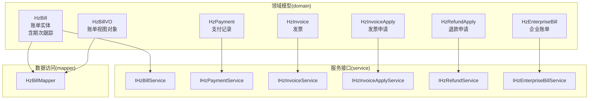
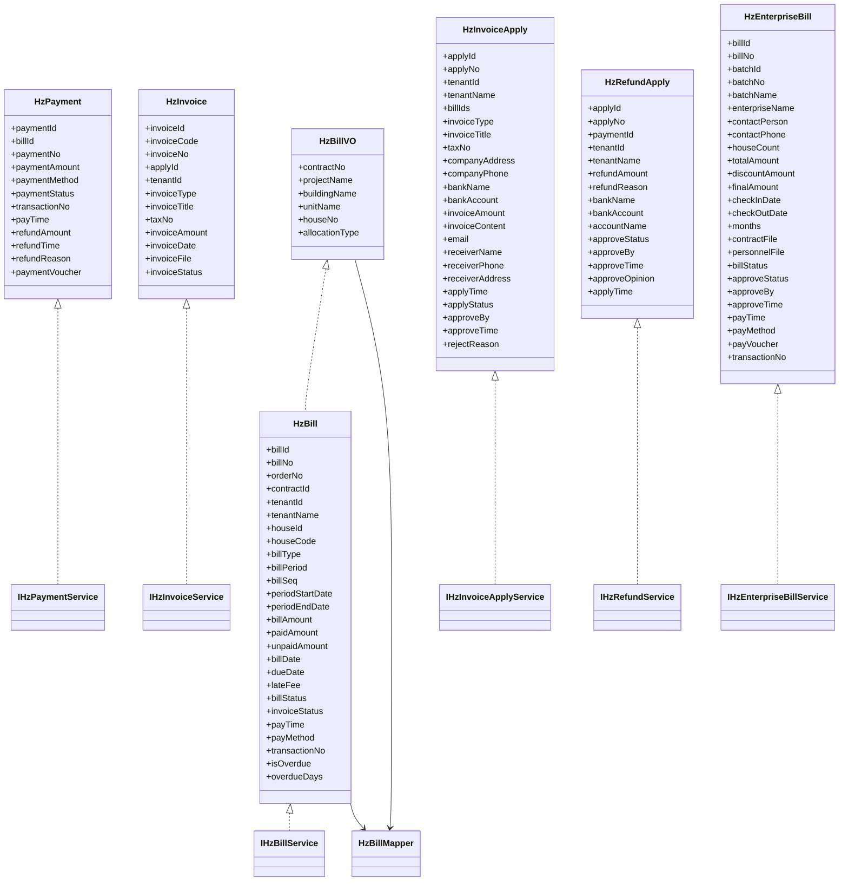
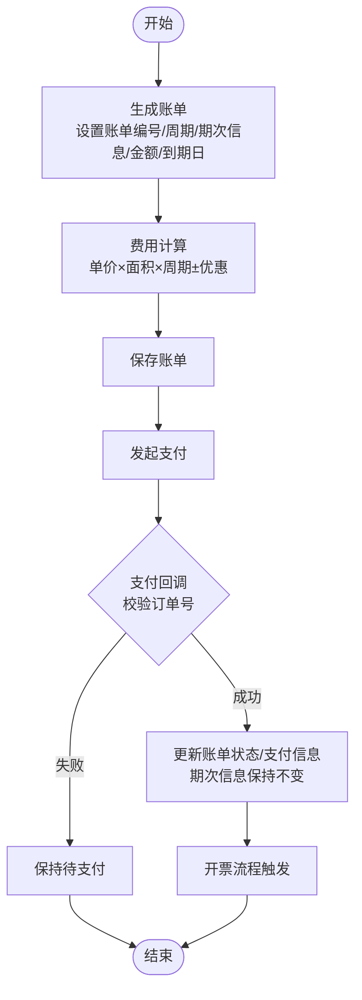
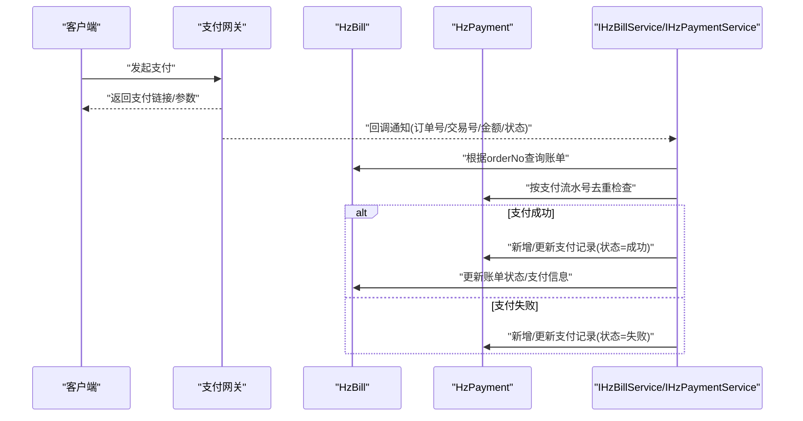
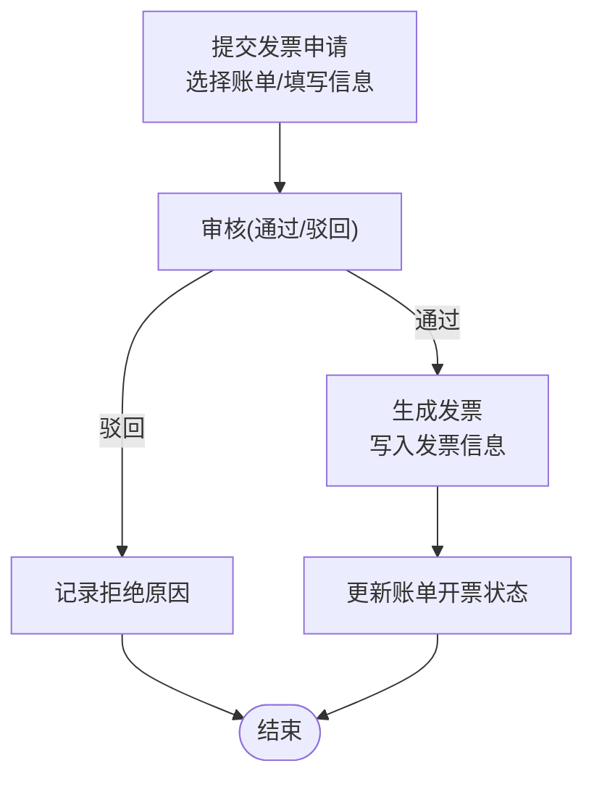
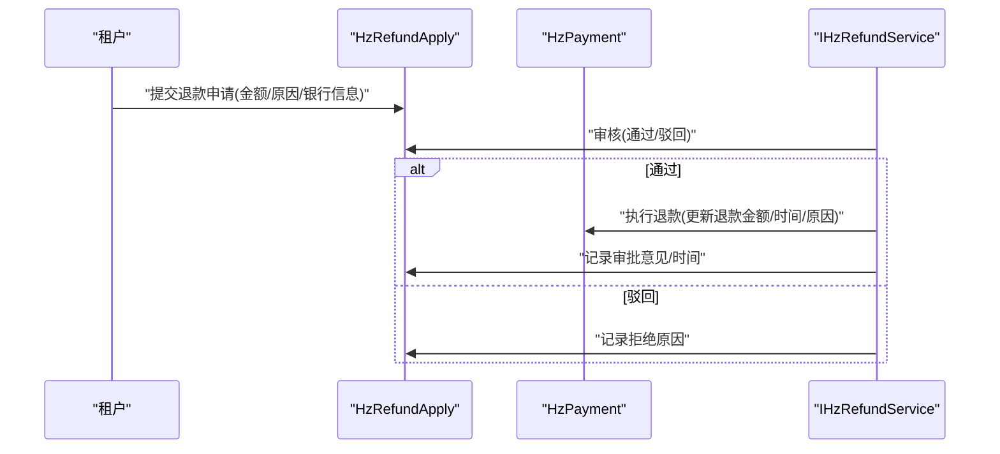
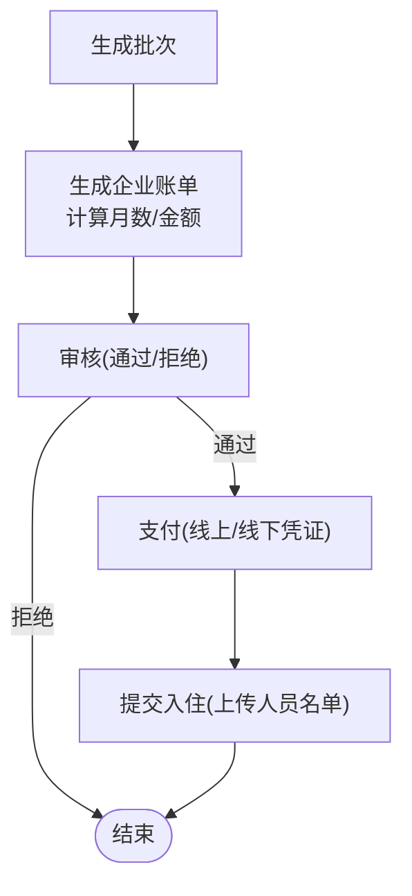
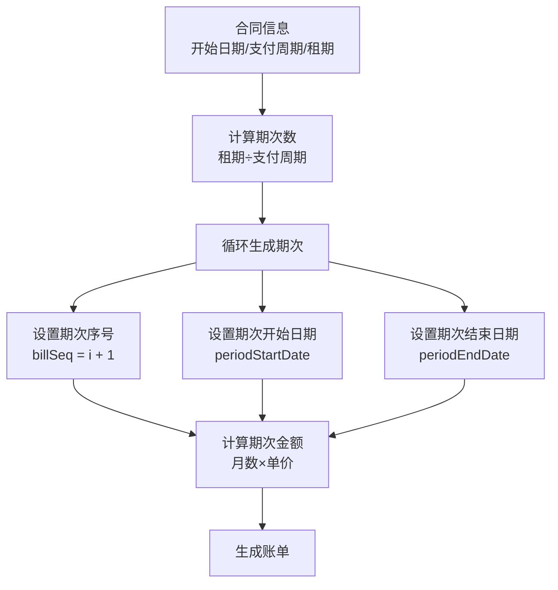
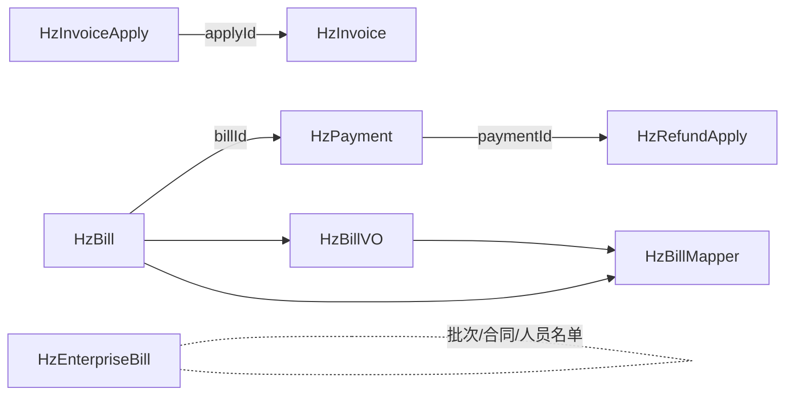

# 财务管理模型

<cite>
**本文引用的文件**
- [HzBill.java](file://ruoyi-system/src/main/java/com/ruoyi/system/domain/HzBill.java)
- [IHzBillService.java](file://ruoyi-system/src/main/java/com/ruoyi/system/service/IHzBillService.java)
- [HzPayment.java](file://ruoyi-system/src/main/java/com/ruoyi/system/domain/HzPayment.java)
- [IHzPaymentService.java](file://ruoyi-system/src/main/java/com/ruoyi/system/service/IHzPaymentService.java)
- [HzInvoice.java](file://ruoyi-system/src/main/java/com/ruoyi/system/domain/HzInvoice.java)
- [HzInvoiceApply.java](file://ruoyi-system/src/main/java/com/ruoyi/system/domain/HzInvoiceApply.java)
- [IHzInvoiceService.java](file://ruoyi-system/src/main/java/com/ruoyi/system/service/IHzInvoiceService.java)
- [IHzInvoiceApplyService.java](file://ruoyi-system/src/main/java/com/ruoyi/system/service/IHzInvoiceApplyService.java)
- [HzRefundApply.java](file://ruoyi-system/src/main/java/com/ruoyi/system/domain/HzRefundApply.java)
- [IHzRefundService.java](file://ruoyi-system/src/main/java/com/ruoyi/system/service/IHzRefundService.java)
- [HzEnterpriseBill.java](file://ruoyi-system/src/main/java/com/ruoyi/system/domain/HzEnterpriseBill.java)
- [IHzEnterpriseBillService.java](file://ruoyi-system/src/main/java/com/ruoyi/system/service/IHzEnterpriseBillService.java)
- [HzBillVO.java](file://ruoyi-system/src/main/java/com/ruoyi/system/domain/HzBillVO.java)
- [HzBillMapper.java](file://ruoyi-system/src/main/java/com/ruoyi/system/mapper/HzBillMapper.java)
- [HzBillMapper.xml](file://ruoyi-system/src/main/resources/mapper/system/HzBillMapper.xml)
- [HzBillServiceImpl.java](file://ruoyi-system/src/main/java/com/ruoyi/system/service/impl/HzBillServiceImpl.java)
- [EsignServiceImpl.java](file://ruoyi-system/src/main/java/com/ruoyi/system/service/impl/EsignServiceImpl.java)
- [HzContractAppController.java](file://ruoyi-admin/src/main/java/com/ruoyi/web/controller/h5/HzContractAppController.java)
</cite>

## 更新摘要
**变更内容**
- 新增期次跟踪功能：在HzBill实体中添加billSeq、periodStartDate、periodEndDate三个字段
- 更新账单生成逻辑：实现期次序号和期次日期的自动生成
- 增强账单查询功能：在HzBillVO中包含期次相关信息
- 优化账单映射：在MyBatis映射文件中添加期次字段映射

## 目录
1. [简介](#简介)
2. [项目结构](#项目结构)
3. [核心组件](#核心组件)
4. [架构总览](#架构总览)
5. [详细组件分析](#详细组件分析)
6. [依赖关系分析](#依赖关系分析)
7. [性能考量](#性能考量)
8. [故障排查指南](#故障排查指南)
9. [结论](#结论)
10. [附录](#附录)

## 简介
本文件系统化梳理港好住信息系统中的财务管理模型，覆盖以下关键领域：
- 账单实体（HzBill）：账单生成、费用计算、账单状态与逾期管理，**新增期次跟踪功能**
- 支付实体（HzPayment）：支付方式、支付状态、回调处理与退款追踪
- 发票管理模型（HzInvoice、HzInvoiceApply）：发票申请、开具、状态跟踪与审批流
- 退款申请模型（HzRefundApply）：退款流程的数据处理与审批控制
- 企业账单模型（HzEnterpriseBill）：批量缴费场景下的账单设计
- 审计追踪与资金流水：基于实体字段与服务方法的可追溯性设计

## 项目结构
财务管理相关的核心代码位于 ruoyi-system 模块，采用"领域模型 + 服务接口 + 控制器"的分层组织：
- domain 层：定义财务实体（账单、支付、发票、退款、企业账单）
- service 层：定义财务业务接口（查询、分页、状态变更、编号生成等）
- controller 层：对外暴露 REST 接口（此处为概念性说明）

**图表来源**
- [HzBill.java:1-390](file://ruoyi-system/src/main/java/com/ruoyi/system/domain/HzBill.java#L1-L390)
- [HzBillVO.java:1-85](file://ruoyi-system/src/main/java/com/ruoyi/system/domain/HzBillVO.java#L1-L85)
- [IHzBillService.java:1-151](file://ruoyi-system/src/main/java/com/ruoyi/system/service/IHzBillService.java#L1-L151)
- [HzBillMapper.java:1-59](file://ruoyi-system/src/main/java/com/ruoyi/system/mapper/HzBillMapper.java#L1-L59)

## 核心组件
本节对各财务实体进行字段级解读，并结合服务接口说明其典型用法。

- 账单实体（HzBill）
  - 关键字段：账单ID、账单编号、预订单号、合同ID、租户ID/姓名、房源ID/编号、账单类型、账单周期、**期次序号（billSeq）、期次开始日期（periodStartDate）、期次结束日期（periodEndDate）**、金额（总额/已付/未付）、账单日期/到期日、滞纳金、账单状态、开票状态、支付时间/方式、交易流水号、是否逾期、逾期天数等
  - 业务要点：支持按租户/合同/账单编号查询；提供生成账单编号、更新账单状态、检查并更新逾期账单的服务能力；**新增期次跟踪功能，支持按期次维度管理账单**
  - 复杂度：查询/分页基于 MyBatis Plus，时间复杂度与数据量线性相关

- 支付实体（HzPayment）
  - 关键字段：支付ID、账单ID、支付流水号、支付金额、支付方式、支付状态、第三方交易号、支付时间、退款金额/时间/原因、支付凭证、删除标志
  - 业务要点：支持按支付流水号、账单ID查询；提供生成支付流水号、更新支付状态的服务能力
  - 复杂度：单表查询，索引优化下查询高效

- 发票实体（HzInvoice）与发票申请（HzInvoiceApply）
  - 发票（HzInvoice）：发票ID、发票代码/号码、申请ID、租户ID、发票类型、发票抬头、纳税人识别号、开票金额、开票日期、发票PDF文件、发票状态、删除标志
  - 发票申请（HzInvoiceApply）：申请ID、申请编号、租户ID/姓名、账单ID列表、发票类型、发票抬头、税号、企业信息（地址/电话/银行/账号）、开票金额、开票内容、收件信息（邮箱/收件人/电话/地址）、申请时间、申请状态、审批人/时间、拒绝原因、删除标志
  - 业务要点：申请与开票解耦，申请状态驱动开票状态；支持按租户/申请ID查询；提供生成申请编号的服务能力

- 退款申请（HzRefundApply）
  - 关键字段：退款申请ID、退款编号、支付ID、租户ID/姓名、退款金额、退款原因、银行信息、审批状态（待审/通过/驳回）、审批人/时间/意见、申请时间、删除标志
  - 业务要点：与支付记录强关联；提供审核退款、删除退款的服务能力

- 企业账单（HzEnterpriseBill）
  - 关键字段：账单ID/编号、批次ID/编号/名称、企业名称、联系人/方式、房源数量、计算总价/优惠金额/最终金额、入驻/截止日期、计算月数、合同/人员名单文件、账单状态、审批状态、审批人/时间、支付时间/方式/凭证/流水号、删除标志
  - 业务要点：面向企业批量缴费场景；提供生成账单编号、审核账单、支付账单（含线下凭证）、提交入住（上传人员名单）等能力

**章节来源**
- [HzBill.java:68-78](file://ruoyi-system/src/main/java/com/ruoyi/system/domain/HzBill.java#L68-L78)
- [HzBillVO.java:10-85](file://ruoyi-system/src/main/java/com/ruoyi/system/domain/HzBillVO.java#L10-L85)
- [IHzBillService.java:14-150](file://ruoyi-system/src/main/java/com/ruoyi/system/service/IHzBillService.java#L14-L150)

## 架构总览
财务管理模块遵循"模型-服务-接口"分层，实体通过服务接口暴露能力，便于在控制器层组合调用实现业务闭环。**新增期次跟踪功能增强了账单的精细化管理能力**。

**图表来源**
- [HzBill.java:1-390](file://ruoyi-system/src/main/java/com/ruoyi/system/domain/HzBill.java#L1-L390)
- [HzBillVO.java:1-85](file://ruoyi-system/src/main/java/com/ruoyi/system/domain/HzBillVO.java#L1-L85)
- [HzBillMapper.java:1-59](file://ruoyi-system/src/main/java/com/ruoyi/system/mapper/HzBillMapper.java#L1-L59)

## 详细组件分析

### 账单实体（HzBill）设计与流程
- 字段设计要点
  - 主键与编号：自增主键与账单编号，便于检索与展示
  - 关联标识：合同ID、租户ID/姓名、房源ID/编号、预订单号（用于支付回调反查）
  - 费用与周期：账单类型、账单周期、**期次序号（billSeq）、期次开始日期（periodStartDate）、期次结束日期（periodEndDate）**、金额三元组（总额/已付/未付）、滞纳金
  - 时间与状态：账单日期/到期日、账单状态（待支付/已支付/部分支付/已逾期/已关闭）、开票状态、是否逾期/逾期天数
  - 支付信息：支付时间、支付方式、交易流水号
- 业务流程
  - 账单生成：由业务规则或定时任务生成，生成时设置账单编号、周期、**期次信息**、金额、到期日等
  - 费用计算：通常由上层逻辑根据房源单价、面积、周期、优惠政策计算后写入
  - 状态流转：支付成功后更新支付时间/方式/流水号，并联动更新账单状态与开票状态
  - 逾期管理：服务层提供检查并更新逾期账单的能力，自动标记逾期与累计逾期天数
  - **期次跟踪：支持按期次维度管理账单，实现精细化的租金周期管理**
- 复杂度与性能
  - 查询以租户/合同/账单编号为主键或条件，建议在对应字段建立索引
  - 分页查询通过 IPage 接口实现，避免全表扫描

**图表来源**
- [HzBill.java:68-78](file://ruoyi-system/src/main/java/com/ruoyi/system/domain/HzBill.java#L68-L78)
- [EsignServiceImpl.java:989-998](file://ruoyi-system/src/main/java/com/ruoyi/system/service/impl/EsignServiceImpl.java#L989-L998)

**章节来源**
- [HzBill.java:68-78](file://ruoyi-system/src/main/java/com/ruoyi/system/domain/HzBill.java#L68-L78)
- [IHzBillService.java:14-150](file://ruoyi-system/src/main/java/com/ruoyi/system/service/IHzBillService.java#L14-L150)

### 支付实体（HzPayment）设计与流程
- 字段设计要点
  - 关联与幂等：账单ID、支付流水号；支付流水号用于去重与对账
  - 支付状态机：待支付/支付中/支付成功/支付失败/已退款
  - 退款追踪：退款金额/时间/原因，便于对账与审计
  - 凭证与渠道：支付凭证、第三方交易号、支付方式
- 回调处理
  - 支付回调需根据预订单号（HzBill.orderNo）反查账单，再根据支付流水号幂等写入支付记录
  - 成功后更新支付状态与账单状态，失败则保留待支付
- 退款集成
  - 退款申请与支付记录强关联（paymentId），退款成功后应同步更新支付记录的退款字段

**图表来源**
- [HzPayment.java:18-202](file://ruoyi-system/src/main/java/com/ruoyi/system/domain/HzPayment.java#L18-L202)
- [IHzPaymentService.java:21-87](file://ruoyi-system/src/main/java/com/ruoyi/system/service/IHzPaymentService.java#L21-L87)

**章节来源**
- [HzPayment.java:18-202](file://ruoyi-system/src/main/java/com/ruoyi/system/domain/HzPayment.java#L18-L202)
- [IHzPaymentService.java:13-88](file://ruoyi-system/src/main/java/com/ruoyi/system/service/IHzPaymentService.java#L13-L88)

### 发票管理模型（HzInvoice、HzInvoiceApply）设计与流程
- 发票申请（HzInvoiceApply）
  - 申请维度：租户信息、发票类型、发票抬头、税号、企业信息、收件信息、开票金额/内容、申请时间/状态
  - 关联维度：账单ID列表（多账单合并开票）、申请编号、审批人/时间/意见、拒绝原因
- 发票（HzInvoice）
  - 开具维度：发票代码/号码、申请ID、租户ID、发票类型/抬头/税号、开票金额/日期、发票PDF文件、发票状态（已开具/已作废/已红冲）
- 流程要点
  - 申请提交后进入"待审核/开票中"，审核通过后生成发票并落库
  - 支持按租户/申请ID查询，便于对账与导出
  - 发票状态变化需与账单的开票状态保持一致

**图表来源**
- [HzInvoiceApply.java:16-374](file://ruoyi-system/src/main/java/com/ruoyi/system/domain/HzInvoiceApply.java#L16-L374)
- [HzInvoice.java:16-223](file://ruoyi-system/src/main/java/com/ruoyi/system/domain/HzInvoice.java#L16-L223)

**章节来源**
- [HzInvoiceApply.java:16-374](file://ruoyi-system/src/main/java/com/ruoyi/system/domain/HzInvoiceApply.java#L16-L374)
- [HzInvoice.java:16-223](file://ruoyi-system/src/main/java/com/ruoyi/system/domain/HzInvoice.java#L16-L223)

### 退款申请模型（HzRefundApply）设计与流程
- 关键点
  - 与支付记录强关联（paymentId），退款金额、原因、银行账户信息完整
  - 审批状态（待审/通过/驳回）与审批人/时间/意见形成审计链
  - 退款成功后需同步更新支付记录的退款字段，确保账实一致
- 流程
  - 提交退款申请 → 审核（通过/驳回）→ 执行退款 → 更新支付与账单状态

**图表来源**
- [HzRefundApply.java:17-225](file://ruoyi-system/src/main/java/com/ruoyi/system/domain/HzRefundApply.java#L17-L225)
- [IHzRefundService.java:15-47](file://ruoyi-system/src/main/java/com/ruoyi/system/service/IHzRefundService.java#L15-L47)

**章节来源**
- [HzRefundApply.java:17-225](file://ruoyi-system/src/main/java/com/ruoyi/system/domain/HzRefundApply.java#L17-L225)
- [IHzRefundService.java:15-47](file://ruoyi-system/src/main/java/com/ruoyi/system/service/IHzRefundService.java#L15-L47)

### 企业账单模型（HzEnterpriseBill）设计与流程
- 场景定位
  - 面向企业批量入住/缴费场景，支持按批次聚合多个房源的统一结算
- 关键字段
  - 批次信息（ID/编号/名称）、企业信息（名称/联系人/电话）、房源数量、金额三元组（总价/优惠/最终）、入驻/截止日期、月份数、合同/人员名单文件、账单/审批/支付状态、交易流水号
- 业务流程
  - 生成账单编号 → 审核账单（通过/拒绝）→ 支付（线上/线下凭证）→ 提交入住（上传人员名单）
  - 月份数计算按入驻/截止日期计算，不满一月按一月计

**图表来源**
- [HzEnterpriseBill.java:20-378](file://ruoyi-system/src/main/java/com/ruoyi/system/domain/HzEnterpriseBill.java#L20-L378)

**章节来源**
- [HzEnterpriseBill.java:20-378](file://ruoyi-system/src/main/java/com/ruoyi/system/domain/HzEnterpriseBill.java#L20-L378)

### 期次跟踪功能详解
**新增功能**：为账单实体新增期次跟踪功能，支持精细化的账单管理

- 期次字段设计
  - billSeq：期次序号，用于标识账单在租期内的顺序位置（如第1期、第2期等）
  - periodStartDate：期次开始日期，标识该期次的起始日期
  - periodEndDate：期次结束日期，标识该期次的结束日期
- 期次生成逻辑
  - 基于合同的支付周期（paymentCycle）和开始日期（startDate）计算
  - 期次序号 = i + 1（其中i为循环索引）
  - 期次开始日期 = 合同开始日期 + i × 支付周期
  - 期次结束日期 = 合同开始日期 + (i+1) × 支付周期 - 1天
  - 末期对齐：最后一期的结束日期直接对齐到合同结束日期
- 期次应用场景
  - 租金账单按月/季度/年等周期生成
  - 支持免租期的期次计算
  - 便于账单的分期管理和财务对账

**图表来源**
- [EsignServiceImpl.java:989-998](file://ruoyi-system/src/main/java/com/ruoyi/system/service/impl/EsignServiceImpl.java#L989-L998)
- [HzBill.java:68-78](file://ruoyi-system/src/main/java/com/ruoyi/system/domain/HzBill.java#L68-L78)

**章节来源**
- [HzBill.java:68-78](file://ruoyi-system/src/main/java/com/ruoyi/system/domain/HzBill.java#L68-L78)
- [EsignServiceImpl.java:989-998](file://ruoyi-system/src/main/java/com/ruoyi/system/service/impl/EsignServiceImpl.java#L989-L998)

## 依赖关系分析
- 组件内聚与耦合
  - HzBill 与 HzPayment：强关联（账单ID），支付成功后影响账单状态
  - HzInvoiceApply 与 HzInvoice：申请到开票的单向依赖
  - HzRefundApply 与 HzPayment：退款申请依赖支付记录
  - HzEnterpriseBill 与批次/合同/人员名单：面向企业批量场景的聚合
  - **HzBill 与 HzBillVO：期次信息的视图映射关系**
- 外部依赖
  - MyBatis Plus：提供分页、条件构造器、批量操作等能力
  - 基础类 BaseEntity：统一创建/更新时间与备注字段

**图表来源**
- [HzBill.java:1-390](file://ruoyi-system/src/main/java/com/ruoyi/system/domain/HzBill.java#L1-L390)
- [HzBillVO.java:1-85](file://ruoyi-system/src/main/java/com/ruoyi/system/domain/HzBillVO.java#L1-L85)
- [HzBillMapper.java:1-59](file://ruoyi-system/src/main/java/com/ruoyi/system/mapper/HzBillMapper.java#L1-L59)

## 性能考量
- 索引策略
  - HzBill：orderNo、tenantId、contractId、billNo、dueDate、**billSeq、periodStartDate、periodEndDate**
  - HzPayment：paymentNo、billId、transactionNo
  - HzInvoiceApply：applyNo、tenantId、billIds
  - HzInvoice：invoiceNo、applyId、tenantId
  - HzRefundApply：paymentId、applyNo
  - HzEnterpriseBill：batchNo、contactPhone、billNo
- 分页与排序
  - 使用 IPage 接口进行分页查询，避免一次性加载大结果集
  - **期次查询可通过billSeq、periodStartDate、periodEndDate进行高效过滤**
- 缓存与异步
  - 对高频查询（如账单详情、支付状态）可引入缓存
  - 对耗时操作（如发票生成、退款处理）可异步化

## 故障排查指南
- 支付回调未生效
  - 检查回调中的订单号是否匹配 HzBill.orderNo
  - 核对支付流水号是否重复（幂等）
  - 确认支付状态与账单状态更新是否一致
- 发票申请无法开具
  - 核对申请状态是否为"开票中/已开票"
  - 检查发票PDF文件是否生成且可访问
- 退款异常
  - 确认退款金额不超过支付金额
  - 核对银行信息与支付记录一致性
- 企业账单审核/支付失败
  - 检查批次信息与合同/人员名单文件是否齐全
  - 确认月份数计算逻辑与入驻/截止日期一致
- **期次跟踪异常**
  - 检查billSeq、periodStartDate、periodEndDate字段是否正确生成
  - 核对期次开始/结束日期计算逻辑
  - 确认末期对齐到合同结束日期的处理

**章节来源**
- [IHzPaymentService.java:21-87](file://ruoyi-system/src/main/java/com/ruoyi/system/service/IHzPaymentService.java#L21-L87)
- [IHzInvoiceApplyService.java:13-79](file://ruoyi-system/src/main/java/com/ruoyi/system/service/IHzInvoiceApplyService.java#L13-L79)
- [IHzRefundService.java:15-47](file://ruoyi-system/src/main/java/com/ruoyi/system/service/IHzRefundService.java#L15-L47)
- [EsignServiceImpl.java:989-998](file://ruoyi-system/src/main/java/com/ruoyi/system/service/impl/EsignServiceImpl.java#L989-L998)

## 结论
本财务管理模型围绕"账单—支付—发票—退款—企业账单"构建了完整的闭环，具备清晰的状态机与强关联关系。**新增的期次跟踪功能进一步增强了账单的精细化管理能力，支持按期次维度进行账单管理和财务对账**。通过服务接口抽象，实现了查询、分页、状态变更与编号生成等通用能力，满足日常运营与对账需求。建议在生产环境中完善索引、缓存与异步处理，持续优化性能与稳定性。

## 附录
- 审计追踪建议
  - 在各实体中保留 createBy/createTime/updateBy/updateTime/remark 字段，确保操作可追溯
  - 对关键状态变更（如账单状态、支付状态、发票状态、退款审批）增加审计日志
  - **期次信息变更（billSeq、periodStartDate、periodEndDate）应纳入审计追踪**
- 资金流水建议
  - 可扩展 HzPayment 作为资金流水的统一载体，记录每笔资金流入/流出的明细与余额变动
  - 与 HzBill 的 unpaidAmount/paidAmount 形成对账口径，定期生成对账报表
  - **期次维度的资金流水可按billSeq进行分组统计**