# 系统支撑表

<cite>
**本文引用的文件**
- [SysUser.java](file://ruoyi-common/src/main/java/com/ruoyi/common/core/domain/entity/SysUser.java)
- [SysDept.java](file://ruoyi-common/src/main/java/com/ruoyi/common/core/domain/entity/SysDept.java)
- [SysPost.java](file://ruoyi-system/src/main/java/com/ruoyi/system/domain/SysPost.java)
- [SysRole.java](file://ruoyi-common/src/main/java/com/ruoyi/common/core/domain/entity/SysRole.java)
- [SysMenu.java](file://ruoyi-common/src/main/java/com/ruoyi/common/core/domain/entity/SysMenu.java)
- [SysUserRole.java](file://ruoyi-system/src/main/java/com/ruoyi/system/domain/SysUserRole.java)
- [SysRoleMenu.java](file://ruoyi-system/src/main/java/com/ruoyi/system/domain/SysRoleMenu.java)
- [SysRoleDept.java](file://ruoyi-system/src/main/java/com/ruoyi/system/domain/SysRoleDept.java)
- [SysUserPost.java](file://ruoyi-system/src/main/java/com/ruoyi/system/domain/SysUserPost.java)
- [SysDictType.java](file://ruoyi-common/src/main/java/com/ruoyi/common/core/domain/entity/SysDictType.java)
- [SysDictData.java](file://ruoyi-common/src/main/java/com/ruoyi/common/core/domain/entity/SysDictData.java)
- [SysConfig.java](file://ruoyi-system/src/main/java/com/ruoyi/system/domain/SysConfig.java)
- [SysJob.java](file://ruoyi-quartz/src/main/java/com/ruoyi/quartz/domain/SysJob.java)
- [SysJobLog.java](file://ruoyi-quartz/src/main/java/com/ruoyi/quartz/domain/SysJobLog.java)
- [SysOperLog.java](file://ruoyi-system/src/main/java/com/ruoyi/system/domain/SysOperLog.java)
- [SysLogininfor.java](file://ruoyi-system/src/main/java/com/ruoyi/system/domain/SysLogininfor.java)
- [SysNotice.java](file://ruoyi-system/src/main/java/com/ruoyi/system/domain/SysNotice.java)
- [GenTable.java](file://ruoyi-generator/src/main/java/com/ruoyi/generator/domain/GenTable.java)
- [GenTableColumn.java](file://ruoyi-generator/src/main/java/com/ruoyi/generator/domain/GenTableColumn.java)
</cite>

## 目录
1. [简介](#简介)
2. [项目结构](#项目结构)
3. [核心组件](#核心组件)
4. [架构总览](#架构总览)
5. [详细组件分析](#详细组件分析)
6. [依赖分析](#依赖分析)
7. [性能考虑](#性能考虑)
8. [故障排查指南](#故障排查指南)
9. [结论](#结论)
10. [附录](#附录)

## 简介
本文件聚焦于港好住信息系统基于 RuoYi 框架构建的“系统支撑表”设计与应用，系统性梳理用户管理、权限控制、字典与配置、定时任务、日志与访问记录、通知公告以及代码生成等核心数据表的结构、关系与业务价值。通过对实体类与业务域模型的分析，帮助开发者与运维人员快速理解各表在系统中的职责边界、关联关系与扩展点，为二次开发与维护提供可靠依据。

## 项目结构
围绕系统支撑表，RuoYi 框架在多模块中提供了统一的领域模型与持久化映射：
- 用户与组织：用户、部门、岗位、用户-岗位等
- 权限与菜单：角色、菜单、角色-菜单、角色-部门、用户-角色等
- 字典与配置：字典类型、字典数据、系统参数配置
- 定时任务：任务定义与执行日志
- 日志与访问：操作日志、登录日志
- 通知公告：站内通知
- 代码生成：代码生成的元数据表与列定义

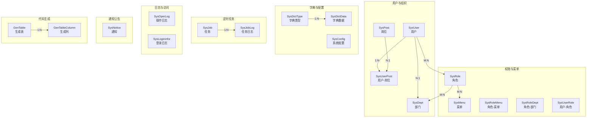

图表来源
- [SysUser.java](file://ruoyi-common/src/main/java/com/ruoyi/common/core/domain/entity/SysUser.java)
- [SysDept.java](file://ruoyi-common/src/main/java/com/ruoyi/common/core/domain/entity/SysDept.java)
- [SysPost.java](file://ruoyi-system/src/main/java/com/ruoyi/system/domain/SysPost.java)
- [SysUserRole.java](file://ruoyi-system/src/main/java/com/ruoyi/system/domain/SysUserRole.java)
- [SysRoleMenu.java](file://ruoyi-system/src/main/java/com/ruoyi/system/domain/SysRoleMenu.java)
- [SysRoleDept.java](file://ruoyi-system/src/main/java/com/ruoyi/system/domain/SysRoleDept.java)
- [SysUserPost.java](file://ruoyi-system/src/main/java/com/ruoyi/system/domain/SysUserPost.java)
- [SysDictType.java](file://ruoyi-common/src/main/java/com/ruoyi/common/core/domain/entity/SysDictType.java)
- [SysDictData.java](file://ruoyi-common/src/main/java/com/ruoyi/common/core/domain/entity/SysDictData.java)
- [SysConfig.java](file://ruoyi-system/src/main/java/com/ruoyi/system/domain/SysConfig.java)
- [SysJob.java](file://ruoyi-quartz/src/main/java/com/ruoyi/quartz/domain/SysJob.java)
- [SysJobLog.java](file://ruoyi-quartz/src/main/java/com/ruoyi/quartz/domain/SysJobLog.java)
- [SysOperLog.java](file://ruoyi-system/src/main/java/com/ruoyi/system/domain/SysOperLog.java)
- [SysLogininfor.java](file://ruoyi-system/src/main/java/com/ruoyi/system/domain/SysLogininfor.java)
- [SysNotice.java](file://ruoyi-system/src/main/java/com/ruoyi/system/domain/SysNotice.java)
- [GenTable.java](file://ruoyi-generator/src/main/java/com/ruoyi/generator/domain/GenTable.java)
- [GenTableColumn.java](file://ruoyi-generator/src/main/java/com/ruoyi/generator/domain/GenTableColumn.java)

章节来源
- [SysUser.java](file://ruoyi-common/src/main/java/com/ruoyi/common/core/domain/entity/SysUser.java)
- [SysDept.java](file://ruoyi-common/src/main/java/com/ruoyi/common/core/domain/entity/SysDept.java)
- [SysPost.java](file://ruoyi-system/src/main/java/com/ruoyi/system/domain/SysPost.java)
- [SysRole.java](file://ruoyi-common/src/main/java/com/ruoyi/common/core/domain/entity/SysRole.java)
- [SysMenu.java](file://ruoyi-common/src/main/java/com/ruoyi/common/core/domain/entity/SysMenu.java)
- [SysUserRole.java](file://ruoyi-system/src/main/java/com/ruoyi/system/domain/SysUserRole.java)
- [SysRoleMenu.java](file://ruoyi-system/src/main/java/com/ruoyi/system/domain/SysRoleMenu.java)
- [SysRoleDept.java](file://ruoyi-system/src/main/java/com/ruoyi/system/domain/SysRoleDept.java)
- [SysUserPost.java](file://ruoyi-system/src/main/java/com/ruoyi/system/domain/SysUserPost.java)
- [SysDictType.java](file://ruoyi-common/src/main/java/com/ruoyi/common/core/domain/entity/SysDictType.java)
- [SysDictData.java](file://ruoyi-common/src/main/java/com/ruoyi/common/core/domain/entity/SysDictData.java)
- [SysConfig.java](file://ruoyi-system/src/main/java/com/ruoyi/system/domain/SysConfig.java)
- [SysJob.java](file://ruoyi-quartz/src/main/java/com/ruoyi/quartz/domain/SysJob.java)
- [SysJobLog.java](file://ruoyi-quartz/src/main/java/com/ruoyi/quartz/domain/SysJobLog.java)
- [SysOperLog.java](file://ruoyi-system/src/main/java/com/ruoyi/system/domain/SysOperLog.java)
- [SysLogininfor.java](file://ruoyi-system/src/main/java/com/ruoyi/system/domain/SysLogininfor.java)
- [SysNotice.java](file://ruoyi-system/src/main/java/com/ruoyi/system/domain/SysNotice.java)
- [GenTable.java](file://ruoyi-generator/src/main/java/com/ruoyi/generator/domain/GenTable.java)
- [GenTableColumn.java](file://ruoyi-generator/src/main/java/com/ruoyi/generator/domain/GenTableColumn.java)

## 核心组件
本节对关键系统支撑表进行分组说明，强调其在系统中的支撑作用与典型使用场景。

- 用户管理表
  - sys_user：存储用户基本信息、状态、归属部门与岗位等，是权限体系与业务主体的基础。
  - sys_dept：组织架构树形结构，支持多级部门与层级计算。
  - sys_post：岗位维度，用于细化用户职责与薪酬、绩效等关联。
  - sys_user_post：用户与岗位的多对多关联，支持多岗位并行。

- 权限控制表
  - sys_role：角色定义，承载权限集合与业务角色划分。
  - sys_menu：菜单与按钮级权限资源，支撑前端路由与按钮级鉴权。
  - sys_role_menu：角色与菜单的多对多关联，形成细粒度权限矩阵。
  - sys_role_dept：角色与部门的关联，用于数据范围控制（如仅可见本部门数据）。
  - sys_user_role：用户与角色的多对多关联，决定用户的权限叠加。

- 字典管理表
  - sys_dict_type：字典分类，定义字典键空间与业务域。
  - sys_dict_data：具体字典项，提供可复用的枚举值与显示标签。

- 配置管理表
  - sys_config：系统参数配置，支持动态开关与运行期参数调整。

- 定时任务表
  - sys_job：任务定义，包含任务名称、Bean参考、方法、表达式、并发策略与状态。
  - sys_job_log：任务执行日志，记录每次调度的开始、结束、耗时与异常。

- 操作日志表
  - sys_oper_log：记录用户操作轨迹，便于审计与问题追溯。

- 系统访问记录表
  - sys_logininfor：记录登录行为，包含IP、时间、结果与设备信息。

- 通知公告表
  - sys_notice：站内通知，支持发布、范围与状态管理。

- 代码生成表
  - gen_table：代码生成的表级元数据，定义生成策略与模板选择。
  - gen_table_column：代码生成的列级元数据，定义字段属性与生成选项。

章节来源
- [SysUser.java](file://ruoyi-common/src/main/java/com/ruoyi/common/core/domain/entity/SysUser.java)
- [SysDept.java](file://ruoyi-common/src/main/java/com/ruoyi/common/core/domain/entity/SysDept.java)
- [SysPost.java](file://ruoyi-system/src/main/java/com/ruoyi/system/domain/SysPost.java)
- [SysUserRole.java](file://ruoyi-system/src/main/java/com/ruoyi/system/domain/SysUserRole.java)
- [SysRoleMenu.java](file://ruoyi-system/src/main/java/com/ruoyi/system/domain/SysRoleMenu.java)
- [SysRoleDept.java](file://ruoyi-system/src/main/java/com/ruoyi/system/domain/SysRoleDept.java)
- [SysUserPost.java](file://ruoyi-system/src/main/java/com/ruoyi/system/domain/SysUserPost.java)
- [SysDictType.java](file://ruoyi-common/src/main/java/com/ruoyi/common/core/domain/entity/SysDictType.java)
- [SysDictData.java](file://ruoyi-common/src/main/java/com/ruoyi/common/core/domain/entity/SysDictData.java)
- [SysConfig.java](file://ruoyi-system/src/main/java/com/ruoyi/system/domain/SysConfig.java)
- [SysJob.java](file://ruoyi-quartz/src/main/java/com/ruoyi/quartz/domain/SysJob.java)
- [SysJobLog.java](file://ruoyi-quartz/src/main/java/com/ruoyi/quartz/domain/SysJobLog.java)
- [SysOperLog.java](file://ruoyi-system/src/main/java/com/ruoyi/system/domain/SysOperLog.java)
- [SysLogininfor.java](file://ruoyi-system/src/main/java/com/ruoyi/system/domain/SysLogininfor.java)
- [SysNotice.java](file://ruoyi-system/src/main/java/com/ruoyi/system/domain/SysNotice.java)
- [GenTable.java](file://ruoyi-generator/src/main/java/com/ruoyi/generator/domain/GenTable.java)
- [GenTableColumn.java](file://ruoyi-generator/src/main/java/com/ruoyi/generator/domain/GenTableColumn.java)

## 架构总览
下图展示系统支撑表之间的高层关系与交互方向，体现“用户—角色—菜单/部门”的权限主链路，以及“字典—配置—任务—日志—通知—生成”的支撑闭环。

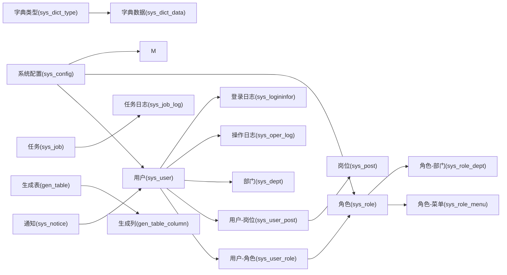

图表来源
- [SysUser.java](file://ruoyi-common/src/main/java/com/ruoyi/common/core/domain/entity/SysUser.java)
- [SysUserRole.java](file://ruoyi-system/src/main/java/com/ruoyi/system/domain/SysUserRole.java)
- [SysRole.java](file://ruoyi-common/src/main/java/com/ruoyi/common/core/domain/entity/SysRole.java)
- [SysRoleMenu.java](file://ruoyi-system/src/main/java/com/ruoyi/system/domain/SysRoleMenu.java)
- [SysRoleDept.java](file://ruoyi-system/src/main/java/com/ruoyi/system/domain/SysRoleDept.java)
- [SysUserPost.java](file://ruoyi-system/src/main/java/com/ruoyi/system/domain/SysUserPost.java)
- [SysPost.java](file://ruoyi-system/src/main/java/com/ruoyi/system/domain/SysPost.java)
- [SysDept.java](file://ruoyi-common/src/main/java/com/ruoyi/common/core/domain/entity/SysDept.java)
- [SysDictType.java](file://ruoyi-common/src/main/java/com/ruoyi/common/core/domain/entity/SysDictType.java)
- [SysDictData.java](file://ruoyi-common/src/main/java/com/ruoyi/common/core/domain/entity/SysDictData.java)
- [SysConfig.java](file://ruoyi-system/src/main/java/com/ruoyi/system/domain/SysConfig.java)
- [SysJob.java](file://ruoyi-quartz/src/main/java/com/ruoyi/quartz/domain/SysJob.java)
- [SysJobLog.java](file://ruoyi-quartz/src/main/java/com/ruoyi/quartz/domain/SysJobLog.java)
- [SysOperLog.java](file://ruoyi-system/src/main/java/com/ruoyi/system/domain/SysOperLog.java)
- [SysLogininfor.java](file://ruoyi-system/src/main/java/com/ruoyi/system/domain/SysLogininfor.java)
- [SysNotice.java](file://ruoyi-system/src/main/java/com/ruoyi/system/domain/SysNotice.java)
- [GenTable.java](file://ruoyi-generator/src/main/java/com/ruoyi/generator/domain/GenTable.java)
- [GenTableColumn.java](file://ruoyi-generator/src/main/java/com/ruoyi/generator/domain/GenTableColumn.java)

## 详细组件分析

### 用户管理表族
- sys_user：用户身份与基础属性，绑定部门与默认角色；常用于登录认证、会话上下文与权限初始化。
- sys_dept：组织架构树，支持层级查询与数据范围过滤；常用于按部门隔离数据。
- sys_post：岗位维度，便于与薪酬、绩效、排班等业务关联。
- sys_user_post：用户多岗位绑定，支持跨岗位工作流。

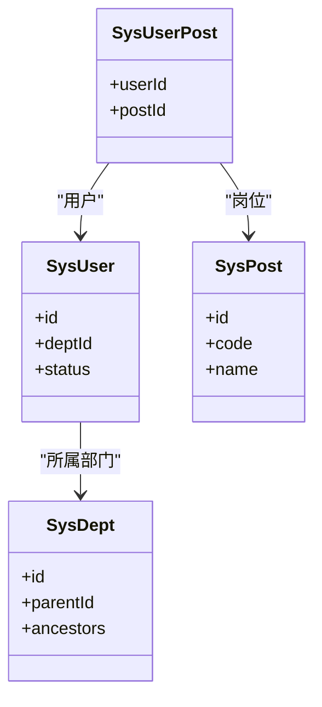

图表来源
- [SysUser.java](file://ruoyi-common/src/main/java/com/ruoyi/common/core/domain/entity/SysUser.java)
- [SysDept.java](file://ruoyi-common/src/main/java/com/ruoyi/common/core/domain/entity/SysDept.java)
- [SysPost.java](file://ruoyi-system/src/main/java/com/ruoyi/system/domain/SysPost.java)
- [SysUserPost.java](file://ruoyi-system/src/main/java/com/ruoyi/system/domain/SysUserPost.java)

章节来源
- [SysUser.java](file://ruoyi-common/src/main/java/com/ruoyi/common/core/domain/entity/SysUser.java)
- [SysDept.java](file://ruoyi-common/src/main/java/com/ruoyi/common/core/domain/entity/SysDept.java)
- [SysPost.java](file://ruoyi-system/src/main/java/com/ruoyi/system/domain/SysPost.java)
- [SysUserPost.java](file://ruoyi-system/src/main/java/com/ruoyi/system/domain/SysUserPost.java)

### 权限控制表族
- sys_role：角色标识与描述，作为权限聚合单元。
- sys_menu：菜单与按钮级资源，支撑前端路由与按钮级权限。
- sys_role_menu：角色-菜单关联，形成权限矩阵。
- sys_role_dept：角色-部门关联，实现数据范围控制。
- sys_user_role：用户-角色关联，决定最终权限集合。

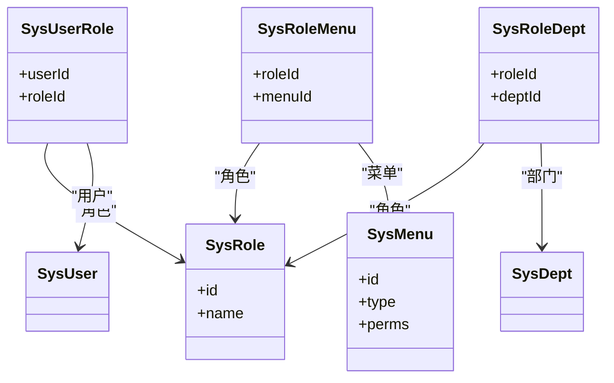

图表来源
- [SysRole.java](file://ruoyi-common/src/main/java/com/ruoyi/common/core/domain/entity/SysRole.java)
- [SysMenu.java](file://ruoyi-common/src/main/java/com/ruoyi/common/core/domain/entity/SysMenu.java)
- [SysUserRole.java](file://ruoyi-system/src/main/java/com/ruoyi/system/domain/SysUserRole.java)
- [SysRoleMenu.java](file://ruoyi-system/src/main/java/com/ruoyi/system/domain/SysRoleMenu.java)
- [SysRoleDept.java](file://ruoyi-system/src/main/java/com/ruoyi/system/domain/SysRoleDept.java)

章节来源
- [SysRole.java](file://ruoyi-common/src/main/java/com/ruoyi/common/core/domain/entity/SysRole.java)
- [SysMenu.java](file://ruoyi-common/src/main/java/com/ruoyi/common/core/domain/entity/SysMenu.java)
- [SysUserRole.java](file://ruoyi-system/src/main/java/com/ruoyi/system/domain/SysUserRole.java)
- [SysRoleMenu.java](file://ruoyi-system/src/main/java/com/ruoyi/system/domain/SysRoleMenu.java)
- [SysRoleDept.java](file://ruoyi-system/src/main/java/com/ruoyi/system/domain/SysRoleDept.java)

### 字典管理表族
- sys_dict_type：字典分类，定义键空间与业务域。
- sys_dict_data：字典项，提供可复用的枚举值与显示标签，支持多字典类型。

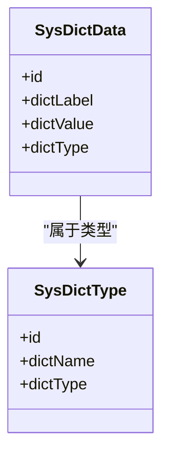

图表来源
- [SysDictType.java](file://ruoyi-common/src/main/java/com/ruoyi/common/core/domain/entity/SysDictType.java)
- [SysDictData.java](file://ruoyi-common/src/main/java/com/ruoyi/common/core/domain/entity/SysDictData.java)

章节来源
- [SysDictType.java](file://ruoyi-common/src/main/java/com/ruoyi/common/core/domain/entity/SysDictType.java)
- [SysDictData.java](file://ruoyi-common/src/main/java/com/ruoyi/common/core/domain/entity/SysDictData.java)

### 配置管理表
- sys_config：系统参数配置，支持动态开关与运行期参数调整，常用于灰度、功能开关与第三方集成参数。

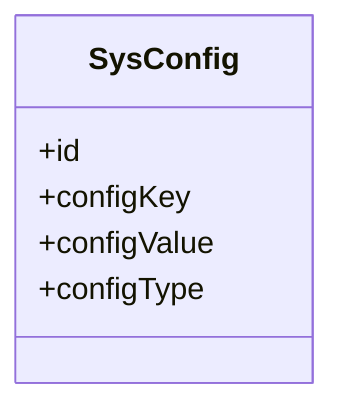

图表来源
- [SysConfig.java](file://ruoyi-system/src/main/java/com/ruoyi/system/domain/SysConfig.java)

章节来源
- [SysConfig.java](file://ruoyi-system/src/main/java/com/ruoyi/system/domain/SysConfig.java)

### 定时任务表族
- sys_job：任务定义，包含Bean引用、方法名、Cron表达式、并发策略与状态。
- sys_job_log：任务执行日志，记录每次调度的开始、结束、耗时与异常。

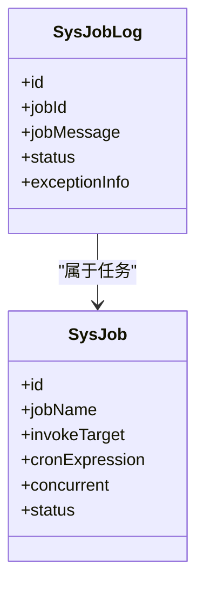

图表来源
- [SysJob.java](file://ruoyi-quartz/src/main/java/com/ruoyi/quartz/domain/SysJob.java)
- [SysJobLog.java](file://ruoyi-quartz/src/main/java/com/ruoyi/quartz/domain/SysJobLog.java)

章节来源
- [SysJob.java](file://ruoyi-quartz/src/main/java/com/ruoyi/quartz/domain/SysJob.java)
- [SysJobLog.java](file://ruoyi-quartz/src/main/java/com/ruoyi/quartz/domain/SysJobLog.java)

### 日志与访问记录表
- sys_oper_log：操作日志，记录请求路径、方法、参数、结果与耗时，支撑审计与问题定位。
- sys_logininfor：登录日志，记录登录时间、IP、终端、结果与失败原因。

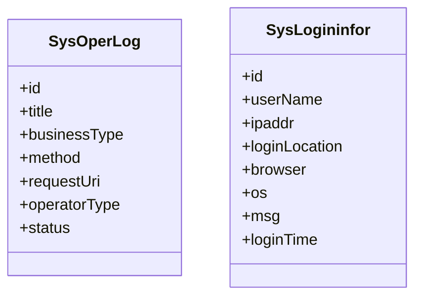

图表来源
- [SysOperLog.java](file://ruoyi-system/src/main/java/com/ruoyi/system/domain/SysOperLog.java)
- [SysLogininfor.java](file://ruoyi-system/src/main/java/com/ruoyi/system/domain/SysLogininfor.java)

章节来源
- [SysOperLog.java](file://ruoyi-system/src/main/java/com/ruoyi/system/domain/SysOperLog.java)
- [SysLogininfor.java](file://ruoyi-system/src/main/java/com/ruoyi/system/domain/SysLogininfor.java)

### 通知公告表
- sys_notice：站内通知，支持标题、内容、类型、发布范围与状态。

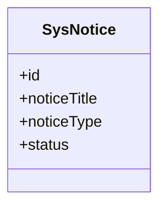

图表来源
- [SysNotice.java](file://ruoyi-system/src/main/java/com/ruoyi/system/domain/SysNotice.java)

章节来源
- [SysNotice.java](file://ruoyi-system/src/main/java/com/ruoyi/system/domain/SysNotice.java)

### 代码生成表族
- gen_table：代码生成的表级元数据，定义生成策略与模板选择。
- gen_table_column：代码生成的列级元数据，定义字段属性与生成选项。

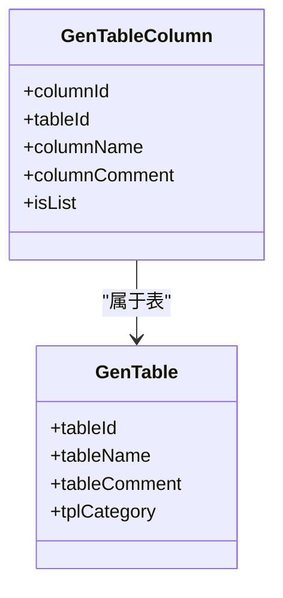

图表来源
- [GenTable.java](file://ruoyi-generator/src/main/java/com/ruoyi/generator/domain/GenTable.java)
- [GenTableColumn.java](file://ruoyi-generator/src/main/java/com/ruoyi/generator/domain/GenTableColumn.java)

章节来源
- [GenTable.java](file://ruoyi-generator/src/main/java/com/ruoyi/generator/domain/GenTable.java)
- [GenTableColumn.java](file://ruoyi-generator/src/main/java/com/ruoyi/generator/domain/GenTableColumn.java)

## 依赖分析
- 权限依赖链：用户通过用户-角色关联到角色，角色再通过角色-菜单与角色-部门形成权限与数据范围控制，菜单与按钮级权限由 sys_menu 统一承载。
- 配置依赖链：sys_config 为全局配置中心，影响用户、角色、菜单等模块的行为与展示。
- 日志与审计：sys_oper_log 与 sys_logininfor 提供审计与安全追踪能力，贯穿用户全生命周期。
- 任务与监控：sys_job 与 sys_job_log 形成任务编排与可观测性闭环。
- 生成与扩展：gen_table 与 gen_table_column 为二次开发提供自动生成能力，降低重复劳动。

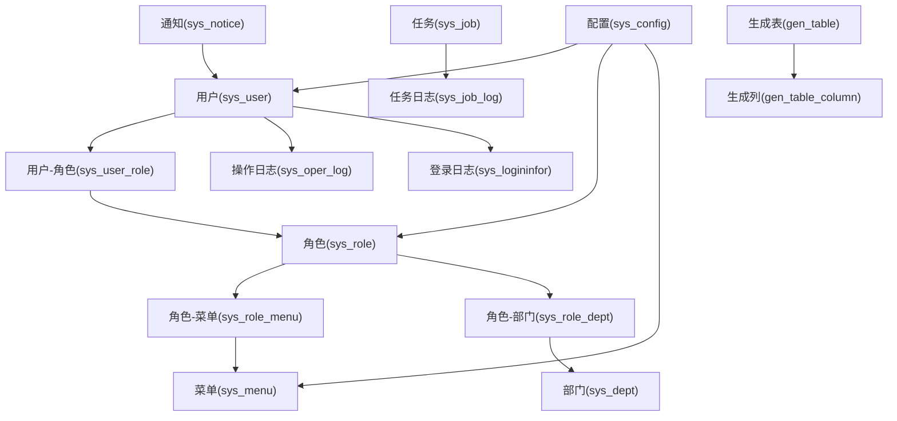

图表来源
- [SysUser.java](file://ruoyi-common/src/main/java/com/ruoyi/common/core/domain/entity/SysUser.java)
- [SysUserRole.java](file://ruoyi-system/src/main/java/com/ruoyi/system/domain/SysUserRole.java)
- [SysRole.java](file://ruoyi-common/src/main/java/com/ruoyi/common/core/domain/entity/SysRole.java)
- [SysRoleMenu.java](file://ruoyi-system/src/main/java/com/ruoyi/system/domain/SysRoleMenu.java)
- [SysRoleDept.java](file://ruoyi-system/src/main/java/com/ruoyi/system/domain/SysRoleDept.java)
- [SysMenu.java](file://ruoyi-common/src/main/java/com/ruoyi/common/core/domain/entity/SysMenu.java)
- [SysDept.java](file://ruoyi-common/src/main/java/com/ruoyi/common/core/domain/entity/SysDept.java)
- [SysConfig.java](file://ruoyi-system/src/main/java/com/ruoyi/system/domain/SysConfig.java)
- [SysJob.java](file://ruoyi-quartz/src/main/java/com/ruoyi/quartz/domain/SysJob.java)
- [SysJobLog.java](file://ruoyi-quartz/src/main/java/com/ruoyi/quartz/domain/SysJobLog.java)
- [SysOperLog.java](file://ruoyi-system/src/main/java/com/ruoyi/system/domain/SysOperLog.java)
- [SysLogininfor.java](file://ruoyi-system/src/main/java/com/ruoyi/system/domain/SysLogininfor.java)
- [SysNotice.java](file://ruoyi-system/src/main/java/com/ruoyi/system/domain/SysNotice.java)
- [GenTable.java](file://ruoyi-generator/src/main/java/com/ruoyi/generator/domain/GenTable.java)
- [GenTableColumn.java](file://ruoyi-generator/src/main/java/com/ruoyi/generator/domain/GenTableColumn.java)

章节来源
- [SysUser.java](file://ruoyi-common/src/main/java/com/ruoyi/common/core/domain/entity/SysUser.java)
- [SysUserRole.java](file://ruoyi-system/src/main/java/com/ruoyi/system/domain/SysUserRole.java)
- [SysRole.java](file://ruoyi-common/src/main/java/com/ruoyi/common/core/domain/entity/SysRole.java)
- [SysRoleMenu.java](file://ruoyi-system/src/main/java/com/ruoyi/system/domain/SysRoleMenu.java)
- [SysRoleDept.java](file://ruoyi-system/src/main/java/com/ruoyi/system/domain/SysRoleDept.java)
- [SysMenu.java](file://ruoyi-common/src/main/java/com/ruoyi/common/core/domain/entity/SysMenu.java)
- [SysDept.java](file://ruoyi-common/src/main/java/com/ruoyi/common/core/domain/entity/SysDept.java)
- [SysConfig.java](file://ruoyi-system/src/main/java/com/ruoyi/system/domain/SysConfig.java)
- [SysJob.java](file://ruoyi-quartz/src/main/java/com/ruoyi/quartz/domain/SysJob.java)
- [SysJobLog.java](file://ruoyi-quartz/src/main/java/com/ruoyi/quartz/domain/SysJobLog.java)
- [SysOperLog.java](file://ruoyi-system/src/main/java/com/ruoyi/system/domain/SysOperLog.java)
- [SysLogininfor.java](file://ruoyi-system/src/main/java/com/ruoyi/system/domain/SysLogininfor.java)
- [SysNotice.java](file://ruoyi-system/src/main/java/com/ruoyi/system/domain/SysNotice.java)
- [GenTable.java](file://ruoyi-generator/src/main/java/com/ruoyi/generator/domain/GenTable.java)
- [GenTableColumn.java](file://ruoyi-generator/src/main/java/com/ruoyi/generator/domain/GenTableColumn.java)

## 性能考虑
- 索引与分区
  - 在高频查询字段（如用户登录名、部门ID、角色ID、字典类型键、任务状态、日志时间）上建立索引，避免全表扫描。
  - 对日志与任务日志表按时间分区，定期归档历史数据，保持热数据高效。
- 缓存策略
  - 将常用配置与字典数据放入缓存，减少数据库压力；结合失效策略与一致性保障。
- 并发与锁
  - 任务并发策略需谨慎设置，避免热点资源争用；对高并发写入的日志表采用异步落库或批量提交。
- 查询优化
  - 权限校验涉及多表关联时，尽量通过中间表（如用户-角色、角色-菜单）减少笛卡尔积。
  - 使用分页查询与投影字段，避免 SELECT *。

## 故障排查指南
- 登录与会话
  - 若出现登录失败或验证码错误，优先检查登录日志与验证码配置；核对浏览器UA与IP白名单。
- 权限与数据范围
  - 若用户看不到数据或越权访问，检查角色-部门与数据范围配置；确认用户-角色与角色-菜单是否正确。
- 定时任务
  - 任务未执行或频繁报错，检查任务状态、Cron 表达式与并发策略；查看任务日志定位异常堆栈。
- 日志审计
  - 审计与问题定位依赖操作日志与登录日志，建议开启详细日志级别并定期巡检。
- 代码生成
  - 生成失败或字段缺失，检查生成表与生成列的元数据一致性，确认模板选择与覆盖策略。

章节来源
- [SysLogininfor.java](file://ruoyi-system/src/main/java/com/ruoyi/system/domain/SysLogininfor.java)
- [SysOperLog.java](file://ruoyi-system/src/main/java/com/ruoyi/system/domain/SysOperLog.java)
- [SysJob.java](file://ruoyi-quartz/src/main/java/com/ruoyi/quartz/domain/SysJob.java)
- [SysJobLog.java](file://ruoyi-quartz/src/main/java/com/ruoyi/quartz/domain/SysJobLog.java)
- [SysUserRole.java](file://ruoyi-system/src/main/java/com/ruoyi/system/domain/SysUserRole.java)
- [SysRoleMenu.java](file://ruoyi-system/src/main/java/com/ruoyi/system/domain/SysRoleMenu.java)
- [SysRoleDept.java](file://ruoyi-system/src/main/java/com/ruoyi/system/domain/SysRoleDept.java)

## 结论
港好住信息系统以 RuoYi 框架为核心，围绕“用户—权限—字典—配置—任务—日志—通知—生成”构建了完整的系统支撑表体系。这些表不仅满足当前业务需求，还为未来的扩展与治理（如数据范围、审计、自动化与可观测性）提供了坚实的数据基础。遵循本文的结构化理解与最佳实践，可有效提升开发效率与系统稳定性。

## 附录
- 关键字段建议
  - 用户与组织：用户名、部门ID、岗位ID、状态、创建/更新时间。
  - 权限与菜单：资源标识、权限字符串、类型（目录/菜单/按钮）、排序。
  - 字典与配置：键名、键值、类型、启用标志、备注。
  - 任务与日志：任务名、Bean引用、方法名、表达式、状态、异常信息。
  - 日志与访问：请求URI、方法、参数、结果、耗时、IP、浏览器、操作系统。
  - 通知公告：标题、类型、内容、发布范围、状态。
  - 代码生成：表名、注释、模板类别、生成策略、列定义。