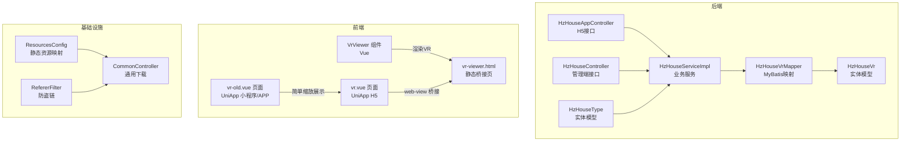
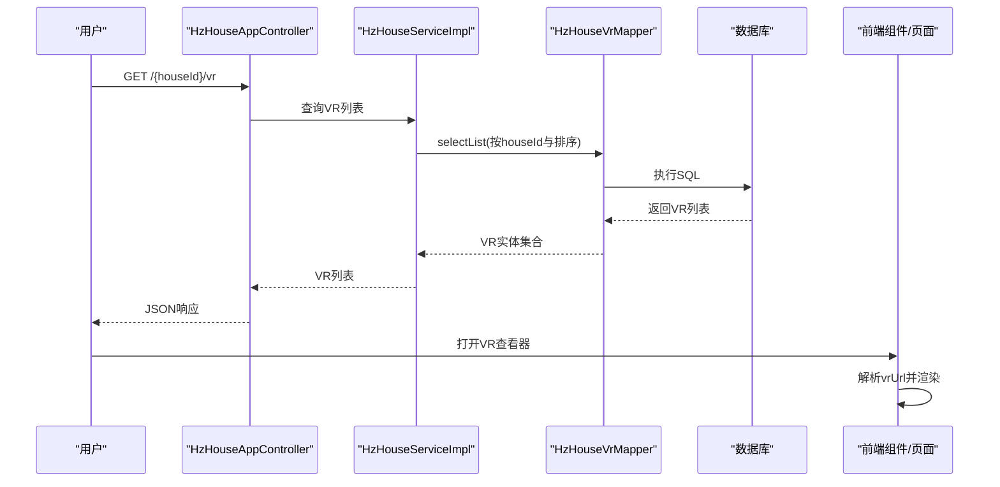
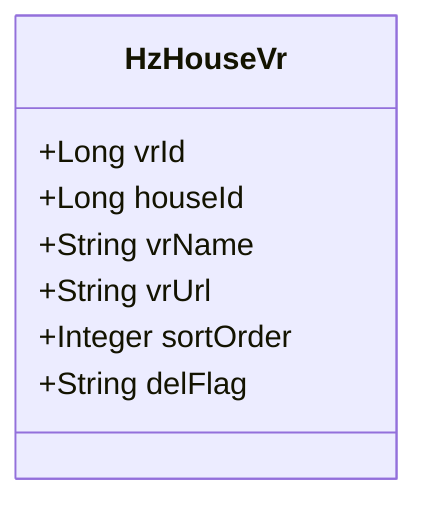
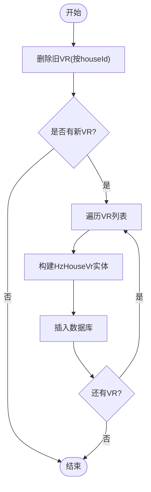
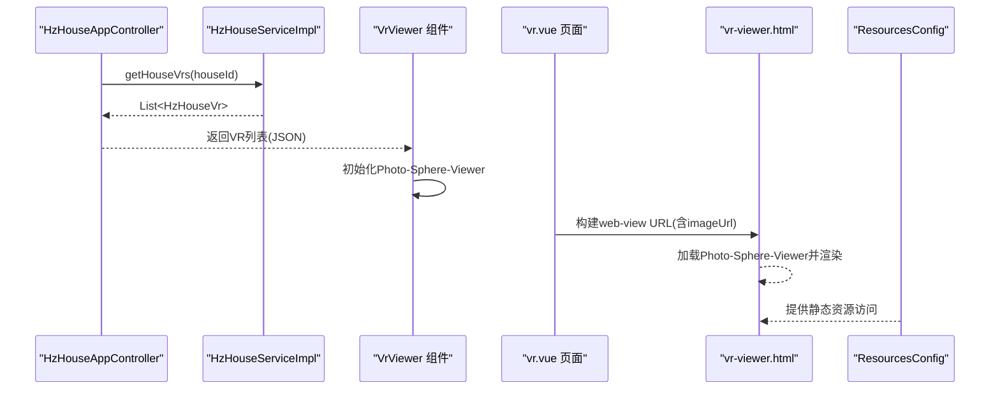
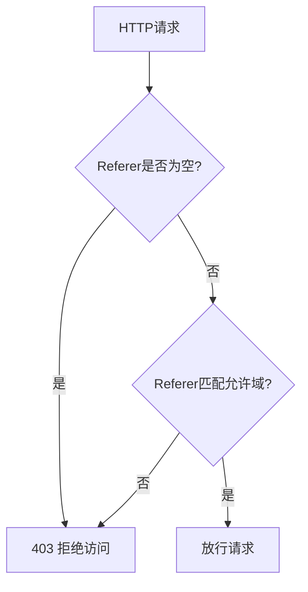
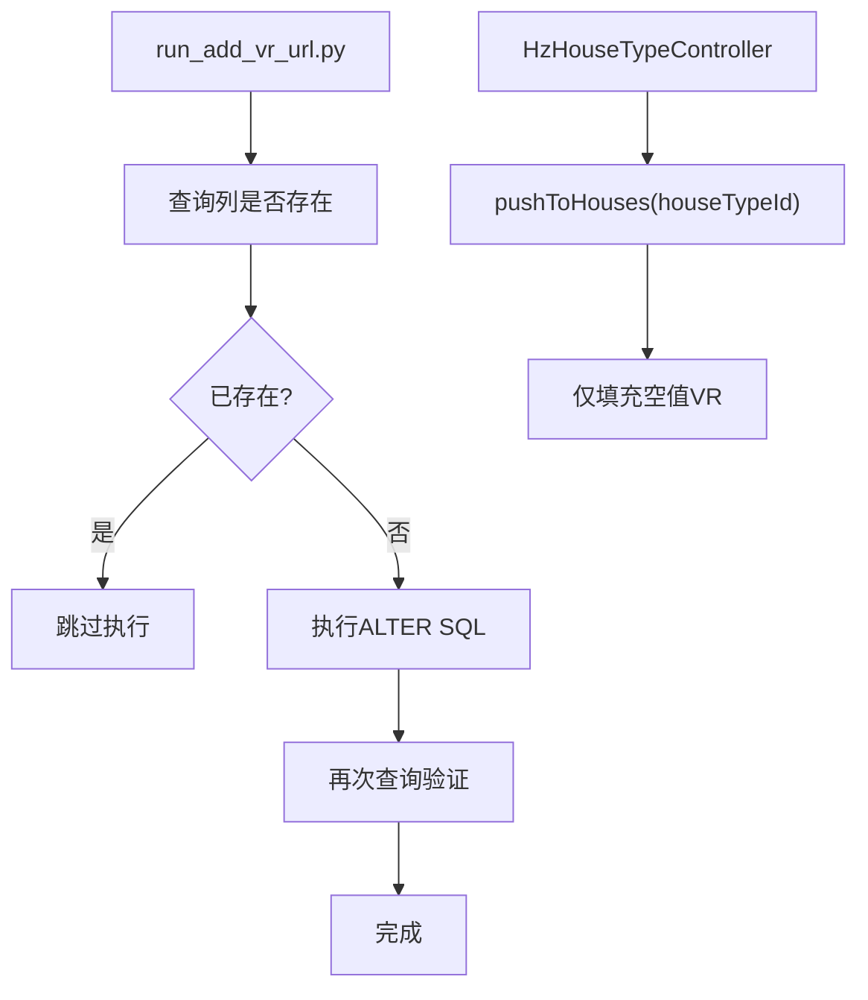
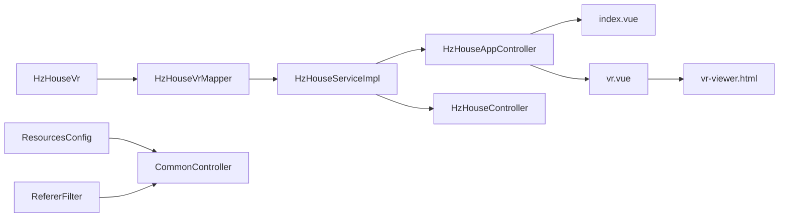

# VR全景图处理

<cite>
**本文引用的文件**
- [HzHouseVr.java](file://ruoyi-system/src/main/java/com/ruoyi/system/domain/HzHouseVr.java)
- [HzHouseVrMapper.java](file://ruoyi-system/src/main/java/com/ruoyi/system/mapper/HzHouseVrMapper.java)
- [HzHouseServiceImpl.java](file://ruoyi-system/src/main/java/com/ruoyi/system/service/impl/HzHouseServiceImpl.java)
- [HzHouseAppController.java](file://ruoyi-admin/src/main/java/com/ruoyi/web/controller/h5/HzHouseAppController.java)
- [HzHouseController.java](file://ruoyi-admin/src/main/java/com/ruoyi/web/controller/system/HzHouseController.java)
- [HzHouseTypeController.java](file://ruoyi-system/src/main/java/com/ruoyi/system/controller/HzHouseTypeController.java)
- [HzHouseType.java](file://ruoyi-system/src/main/java/com/ruoyi/system/domain/HzHouseType.java)
- [index.vue](file://ruoyi-ui/src/components/VrViewer/index.vue)
- [vr.vue](file://uniapp-h5/pages/room/vr.vue)
- [vr-old.vue](file://uniapp-h5/pages/room/vr-old.vue)
- [vr-viewer.html](file://uniapp-h5/static/vr-viewer.html)
- [ResourcesConfig.java](file://ruoyi-framework/src/main/java/com/ruoyi/framework/config/ResourcesConfig.java)
- [CommonController.java](file://ruoyi-admin/src/main/java/com/ruoyi/web/controller/common/CommonController.java)
- [RefererFilter.java](file://ruoyi-common/src/main/java/com/ruoyi/common/filter/RefererFilter.java)
- [run_add_vr_url.py](file://scripts/run_add_vr_url.py)
</cite>

## 目录
1. [简介](#简介)
2. [项目结构](#项目结构)
3. [核心组件](#核心组件)
4. [架构总览](#架构总览)
5. [详细组件分析](#详细组件分析)
6. [依赖分析](#依赖分析)
7. [性能考虑](#性能考虑)
8. [故障排查指南](#故障排查指南)
9. [结论](#结论)
10. [附录](#附录)

## 简介
本文件面向VR全景图处理系统，围绕HzHouseVr实体模型进行深入解析，涵盖VR文件信息存储、元数据管理、状态控制、文件访问与安全、渲染优化及自动化脚本等内容。系统采用前后端分离架构，后端基于RuoYi框架提供VR列表管理与存储，前端通过Vue组件与UniApp页面集成Photo-Sphere-Viewer实现VR全景浏览。

## 项目结构
系统主要由以下模块构成：
- 后端领域层：HzHouseVr实体、HzHouseVrMapper映射、HzHouseServiceImpl服务实现
- 后端控制器层：HzHouseAppController（H5接口）、HzHouseController（管理端接口）
- 前端组件层：Vue VR查看器组件、UniApp页面与静态HTML桥接
- 基础设施层：资源映射、通用下载、防盗链过滤

图表来源
- [HzHouseAppController.java:431-453](file://ruoyi-admin/src/main/java/com/ruoyi/web/controller/h5/HzHouseAppController.java#L431-L453)
- [HzHouseController.java:178-198](file://ruoyi-admin/src/main/java/com/ruoyi/web/controller/system/HzHouseController.java#L178-L198)
- [HzHouseServiceImpl.java:440-477](file://ruoyi-system/src/main/java/com/ruoyi/system/service/impl/HzHouseServiceImpl.java#L440-L477)
- [HzHouseVrMapper.java:8-17](file://ruoyi-system/src/main/java/com/ruoyi/system/mapper/HzHouseVrMapper.java#L8-L17)
- [HzHouseVr.java:11-122](file://ruoyi-system/src/main/java/com/ruoyi/system/domain/HzHouseVr.java#L11-L122)
- [HzHouseType.java:62-63](file://ruoyi-system/src/main/java/com/ruoyi/system/domain/HzHouseType.java#L62-L63)
- [index.vue:36-116](file://ruoyi-ui/src/components/VrViewer/index.vue#L36-L116)
- [vr.vue:35-55](file://uniapp-h5/pages/room/vr.vue#L35-L55)
- [vr-old.vue:44-103](file://uniapp-h5/pages/room/vr-old.vue#L44-L103)
- [vr-viewer.html:75-115](file://uniapp-h5/static/vr-viewer.html#L75-L115)
- [ResourcesConfig.java:29-34](file://ruoyi-framework/src/main/java/com/ruoyi/framework/config/ResourcesConfig.java#L29-L34)
- [CommonController.java:45-69](file://ruoyi-admin/src/main/java/com/ruoyi/web/controller/common/CommonController.java#L45-L69)
- [RefererFilter.java:34-70](file://ruoyi-common/src/main/java/com/ruoyi/common/filter/RefererFilter.java#L34-L70)

章节来源
- [HzHouseAppController.java:431-453](file://ruoyi-admin/src/main/java/com/ruoyi/web/controller/h5/HzHouseAppController.java#L431-L453)
- [HzHouseController.java:178-198](file://ruoyi-admin/src/main/java/com/ruoyi/web/controller/system/HzHouseController.java#L178-L198)
- [HzHouseServiceImpl.java:440-477](file://ruoyi-system/src/main/java/com/ruoyi/system/service/impl/HzHouseServiceImpl.java#L440-L477)
- [HzHouseVrMapper.java:8-17](file://ruoyi-system/src/main/java/com/ruoyi/system/mapper/HzHouseVrMapper.java#L8-L17)
- [HzHouseVr.java:11-122](file://ruoyi-system/src/main/java/com/ruoyi/system/domain/HzHouseVr.java#L11-L122)
- [HzHouseType.java:62-63](file://ruoyi-system/src/main/java/com/ruoyi/system/domain/HzHouseType.java#L62-L63)
- [index.vue:36-116](file://ruoyi-ui/src/components/VrViewer/index.vue#L36-L116)
- [vr.vue:35-55](file://uniapp-h5/pages/room/vr.vue#L35-L55)
- [vr-old.vue:44-103](file://uniapp-h5/pages/room/vr-old.vue#L44-L103)
- [vr-viewer.html:75-115](file://uniapp-h5/static/vr-viewer.html#L75-L115)
- [ResourcesConfig.java:29-34](file://ruoyi-framework/src/main/java/com/ruoyi/framework/config/ResourcesConfig.java#L29-L34)
- [CommonController.java:45-69](file://ruoyi-admin/src/main/java/com/ruoyi/web/controller/common/CommonController.java#L45-L69)
- [RefererFilter.java:34-70](file://ruoyi-common/src/main/java/com/ruoyi/common/filter/RefererFilter.java#L34-L70)

## 核心组件
- HzHouseVr 实体模型：承载VR记录的标识、所属房源、名称、URL、排序与删除标记等字段，用于持久化存储与查询。
- HzHouseVrMapper 映射接口：基于MyBatis-Plus的BaseMapper，提供CRUD能力。
- HzHouseServiceImpl 服务实现：提供VR列表查询与批量保存逻辑，支持按房源ID删除旧VR并插入新VR集合。
- 控制器层：H5接口返回VR列表；管理端接口支持VR列表与批量保存。
- 前端组件：Vue组件与UniApp页面分别适配不同运行环境，统一通过Photo-Sphere-Viewer渲染全景图。
- 基础设施：静态资源映射、通用下载、防盗链过滤保障文件访问安全与性能。

章节来源
- [HzHouseVr.java:11-122](file://ruoyi-system/src/main/java/com/ruoyi/system/domain/HzHouseVr.java#L11-L122)
- [HzHouseVrMapper.java:8-17](file://ruoyi-system/src/main/java/com/ruoyi/system/mapper/HzHouseVrMapper.java#L8-L17)
- [HzHouseServiceImpl.java:440-477](file://ruoyi-system/src/main/java/com/ruoyi/system/service/impl/HzHouseServiceImpl.java#L440-L477)
- [HzHouseAppController.java:431-453](file://ruoyi-admin/src/main/java/com/ruoyi/web/controller/h5/HzHouseAppController.java#L431-L453)
- [HzHouseController.java:178-198](file://ruoyi-admin/src/main/java/com/ruoyi/web/controller/system/HzHouseController.java#L178-L198)

## 架构总览
系统采用“后端API + 前端渲染”的典型架构。后端提供VR列表与保存接口，前端通过组件或页面加载VR资源并渲染。资源访问通过静态资源映射与通用下载控制器处理，同时启用防盗链过滤以限制来源域。

图表来源
- [HzHouseAppController.java:431-453](file://ruoyi-admin/src/main/java/com/ruoyi/web/controller/h5/HzHouseAppController.java#L431-L453)
- [HzHouseServiceImpl.java:440-448](file://ruoyi-system/src/main/java/com/ruoyi/system/service/impl/HzHouseServiceImpl.java#L440-L448)
- [HzHouseVrMapper.java:8-17](file://ruoyi-system/src/main/java/com/ruoyi/system/mapper/HzHouseVrMapper.java#L8-L17)

## 详细组件分析

### HzHouseVr 实体模型设计
- 字段设计：包含主键、所属房源ID、VR名称、VR URL、排序与删除标记，满足基础CRUD与排序展示需求。
- 继承基类：继承BaseEntity，具备通用的创建/更新时间与操作人字段。
- 逻辑删除：del_flag 字段配合注解支持软删除策略。

图表来源
- [HzHouseVr.java:11-122](file://ruoyi-system/src/main/java/com/ruoyi/system/domain/HzHouseVr.java#L11-L122)

章节来源
- [HzHouseVr.java:11-122](file://ruoyi-system/src/main/java/com/ruoyi/system/domain/HzHouseVr.java#L11-L122)

### VR文件存储与状态控制
- 存储策略：VR URL直接存储于vr_url字段，便于快速渲染与跨域访问。
- 状态控制：通过del_flag实现软删除；排序通过sort_order保证展示顺序。
- 保存流程：先删除旧VR，再批量插入新VR，确保数据一致性与幂等性。

图表来源
- [HzHouseServiceImpl.java:456-477](file://ruoyi-system/src/main/java/com/ruoyi/system/service/impl/HzHouseServiceImpl.java#L456-L477)

章节来源
- [HzHouseServiceImpl.java:456-477](file://ruoyi-system/src/main/java/com/ruoyi/system/service/impl/HzHouseServiceImpl.java#L456-L477)

### VR文件访问与渲染流程
- H5接口：提供VR列表查询，返回vrId、vrName、vrUrl，供前端渲染。
- Vue组件：通过Photo-Sphere-Viewer加载全景图，支持自动旋转、缩放、移动与全屏。
- UniApp页面：
  - H5场景：使用web-view加载静态桥接页vr-viewer.html，传入完整URL参数。
  - 小程序/APP场景：提供简化版本vr-old.vue，实现基本缩放与拖拽。
- 静态资源映射：通过ResourcesConfig将静态资源路径映射到本地文件系统。
- 通用下载：CommonController提供下载能力，结合防盗链过滤限制来源域。

图表来源
- [HzHouseAppController.java:431-453](file://ruoyi-admin/src/main/java/com/ruoyi/web/controller/h5/HzHouseAppController.java#L431-L453)
- [HzHouseServiceImpl.java:440-448](file://ruoyi-system/src/main/java/com/ruoyi/system/service/impl/HzHouseServiceImpl.java#L440-L448)
- [index.vue:36-116](file://ruoyi-ui/src/components/VrViewer/index.vue#L36-L116)
- [vr.vue:35-55](file://uniapp-h5/pages/room/vr.vue#L35-L55)
- [vr-viewer.html:75-115](file://uniapp-h5/static/vr-viewer.html#L75-L115)
- [ResourcesConfig.java:29-34](file://ruoyi-framework/src/main/java/com/ruoyi/framework/config/ResourcesConfig.java#L29-L34)

章节来源
- [HzHouseAppController.java:431-453](file://ruoyi-admin/src/main/java/com/ruoyi/web/controller/h5/HzHouseAppController.java#L431-L453)
- [index.vue:36-116](file://ruoyi-ui/src/components/VrViewer/index.vue#L36-L116)
- [vr.vue:35-55](file://uniapp-h5/pages/room/vr.vue#L35-L55)
- [vr-viewer.html:75-115](file://uniapp-h5/static/vr-viewer.html#L75-L115)
- [ResourcesConfig.java:29-34](file://ruoyi-framework/src/main/java/com/ruoyi/framework/config/ResourcesConfig.java#L29-L34)

### 访问控制与安全措施
- 防盗链保护：RefererFilter根据配置的允许域名列表校验请求来源，拒绝未授权访问。
- 通用下载：CommonController负责文件下载响应头设置与内容输出，结合安全策略避免非法下载。
- 域名白名单：UniApp在小程序/APP场景要求完整HTTPS URL且域名需在白名单内。

图表来源
- [RefererFilter.java:34-70](file://ruoyi-common/src/main/java/com/ruoyi/common/filter/RefererFilter.java#L34-L70)
- [CommonController.java:45-69](file://ruoyi-admin/src/main/java/com/ruoyi/web/controller/common/CommonController.java#L45-L69)
- [vr.vue:45-54](file://uniapp-h5/pages/room/vr.vue#L45-L54)

章节来源
- [RefererFilter.java:34-70](file://ruoyi-common/src/main/java/com/ruoyi/common/filter/RefererFilter.java#L34-L70)
- [CommonController.java:45-69](file://ruoyi-admin/src/main/java/com/ruoyi/web/controller/common/CommonController.java#L45-L69)
- [vr.vue:45-54](file://uniapp-h5/pages/room/vr.vue#L45-L54)

### 自动化脚本与批量处理
- 数据库列添加：run_add_vr_url.py用于幂等地为hz_house_type表添加vr_url列，支持检查与验证。
- 户型VR下发：HzHouseTypeController提供将户型图片与VR一键下发至该户型所有房源的功能，仅填充空值，不覆盖已有数据。

图表来源
- [run_add_vr_url.py:29-44](file://scripts/run_add_vr_url.py#L29-L44)
- [HzHouseTypeController.java:201-207](file://ruoyi-system/src/main/java/com/ruoyi/system/controller/HzHouseTypeController.java#L201-L207)

章节来源
- [run_add_vr_url.py:29-44](file://scripts/run_add_vr_url.py#L29-L44)
- [HzHouseTypeController.java:201-207](file://ruoyi-system/src/main/java/com/ruoyi/system/controller/HzHouseTypeController.java#L201-L207)

## 依赖分析
- 实体与映射：HzHouseVr与HzHouseVrMapper通过MyBatis-Plus关联，服务层依赖映射接口进行数据访问。
- 控制器与服务：H5与管理端控制器均依赖服务层，服务层负责业务规则与事务控制。
- 前端与后端：前端通过HTTP接口获取VR列表，Vue组件与UniApp页面分别适配不同运行环境。
- 基础设施：静态资源映射与通用下载控制器为文件访问提供基础能力，防盗链过滤保障安全。

图表来源
- [HzHouseVr.java:11-122](file://ruoyi-system/src/main/java/com/ruoyi/system/domain/HzHouseVr.java#L11-L122)
- [HzHouseVrMapper.java:8-17](file://ruoyi-system/src/main/java/com/ruoyi/system/mapper/HzHouseVrMapper.java#L8-L17)
- [HzHouseServiceImpl.java:440-477](file://ruoyi-system/src/main/java/com/ruoyi/system/service/impl/HzHouseServiceImpl.java#L440-L477)
- [HzHouseAppController.java:431-453](file://ruoyi-admin/src/main/java/com/ruoyi/web/controller/h5/HzHouseAppController.java#L431-L453)
- [HzHouseController.java:178-198](file://ruoyi-admin/src/main/java/com/ruoyi/web/controller/system/HzHouseController.java#L178-L198)
- [index.vue:36-116](file://ruoyi-ui/src/components/VrViewer/index.vue#L36-L116)
- [vr.vue:35-55](file://uniapp-h5/pages/room/vr.vue#L35-L55)
- [vr-viewer.html:75-115](file://uniapp-h5/static/vr-viewer.html#L75-L115)
- [ResourcesConfig.java:29-34](file://ruoyi-framework/src/main/java/com/ruoyi/framework/config/ResourcesConfig.java#L29-L34)
- [CommonController.java:45-69](file://ruoyi-admin/src/main/java/com/ruoyi/web/controller/common/CommonController.java#L45-L69)
- [RefererFilter.java:34-70](file://ruoyi-common/src/main/java/com/ruoyi/common/filter/RefererFilter.java#L34-L70)

章节来源
- [HzHouseVr.java:11-122](file://ruoyi-system/src/main/java/com/ruoyi/system/domain/HzHouseVr.java#L11-L122)
- [HzHouseVrMapper.java:8-17](file://ruoyi-system/src/main/java/com/ruoyi/system/mapper/HzHouseVrMapper.java#L8-L17)
- [HzHouseServiceImpl.java:440-477](file://ruoyi-system/src/main/java/com/ruoyi/system/service/impl/HzHouseServiceImpl.java#L440-L477)
- [HzHouseAppController.java:431-453](file://ruoyi-admin/src/main/java/com/ruoyi/web/controller/h5/HzHouseAppController.java#L431-L453)
- [HzHouseController.java:178-198](file://ruoyi-admin/src/main/java/com/ruoyi/web/controller/system/HzHouseController.java#L178-L198)
- [index.vue:36-116](file://ruoyi-ui/src/components/VrViewer/index.vue#L36-L116)
- [vr.vue:35-55](file://uniapp-h5/pages/room/vr.vue#L35-L55)
- [vr-viewer.html:75-115](file://uniapp-h5/static/vr-viewer.html#L75-L115)
- [ResourcesConfig.java:29-34](file://ruoyi-framework/src/main/java/com/ruoyi/framework/config/ResourcesConfig.java#L29-L34)
- [CommonController.java:45-69](file://ruoyi-admin/src/main/java/com/ruoyi/web/controller/common/CommonController.java#L45-L69)
- [RefererFilter.java:34-70](file://ruoyi-common/src/main/java/com/ruoyi/common/filter/RefererFilter.java#L34-L70)

## 性能考虑
- 渲染优化：前端使用Photo-Sphere-Viewer，支持默认缩放范围与FOV限制，减少过度渲染开销。
- 资源映射：通过静态资源映射减少IO延迟，结合浏览器缓存提升加载速度。
- 下载安全：通用下载控制器设置合适的响应头，避免大文件阻塞与滥用。
- 建议：对VR资源进行CDN分发与Gzip压缩；在前端实现渐进式加载与错误重试机制。

## 故障排查指南
- VR无法加载
  - 检查vrUrl是否为完整URL或可拼接的相对路径。
  - 确认静态资源映射配置正确，文件存在于指定目录。
  - 查看前端控制台错误日志，确认Photo-Sphere-Viewer初始化是否成功。
- 防盗链拦截
  - 核对RefererFilter允许域名配置，确保请求来源在白名单内。
  - 小程序/APP场景需使用完整HTTPS URL并配置业务域名白名单。
- 下载失败
  - 检查CommonController的下载路径与文件权限。
  - 确认文件名合法性与下载开关参数。

章节来源
- [vr-viewer.html:75-115](file://uniapp-h5/static/vr-viewer.html#L75-L115)
- [ResourcesConfig.java:29-34](file://ruoyi-framework/src/main/java/com/ruoyi/framework/config/ResourcesConfig.java#L29-L34)
- [RefererFilter.java:34-70](file://ruoyi-common/src/main/java/com/ruoyi/common/filter/RefererFilter.java#L34-L70)
- [CommonController.java:45-69](file://ruoyi-admin/src/main/java/com/ruoyi/web/controller/common/CommonController.java#L45-L69)

## 结论
本系统通过HzHouseVr实体模型与配套的服务与控制器，实现了VR全景图的存储、查询与渲染。前端通过Vue组件与UniApp页面适配多端环境，结合静态资源映射与防盗链过滤，保障了访问的安全与性能。建议后续引入CDN加速、Gzip压缩与渐进式加载策略，进一步提升用户体验与系统吞吐量。

## 附录
- 数据库列扩展：run_add_vr_url.py用于为户型表添加vr_url列，支持幂等执行与验证。
- 户型VR下发：HzHouseTypeController提供一键下发功能，仅填充空值，不覆盖已有数据。

章节来源
- [run_add_vr_url.py:29-44](file://scripts/run_add_vr_url.py#L29-L44)
- [HzHouseTypeController.java:201-207](file://ruoyi-system/src/main/java/com/ruoyi/system/controller/HzHouseTypeController.java#L201-L207)