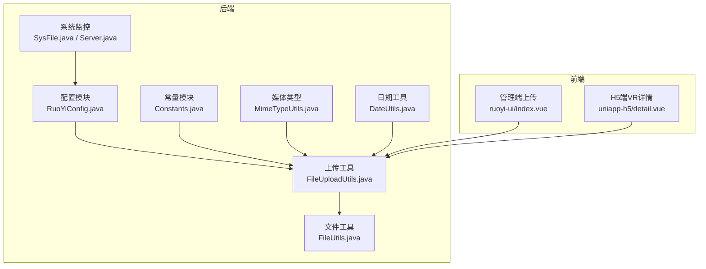
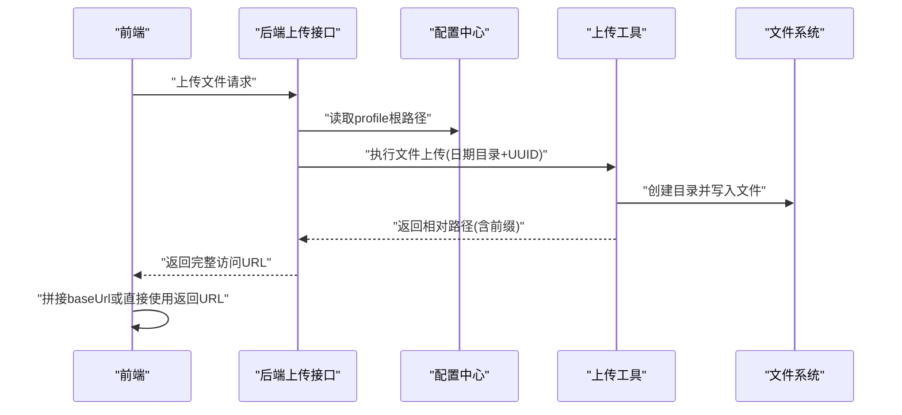
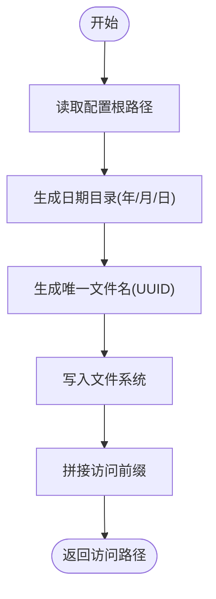
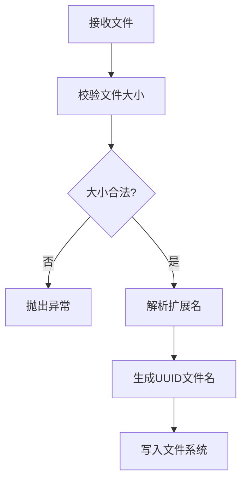
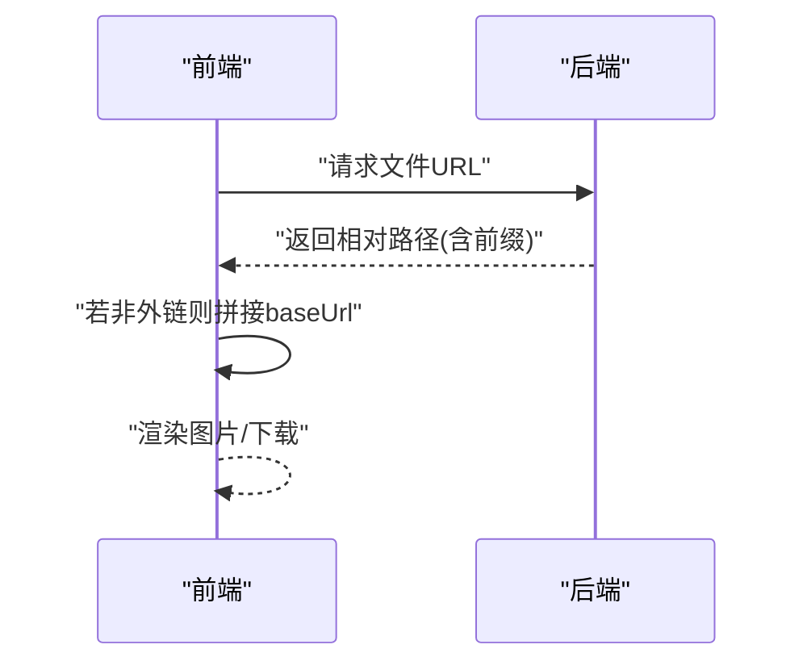
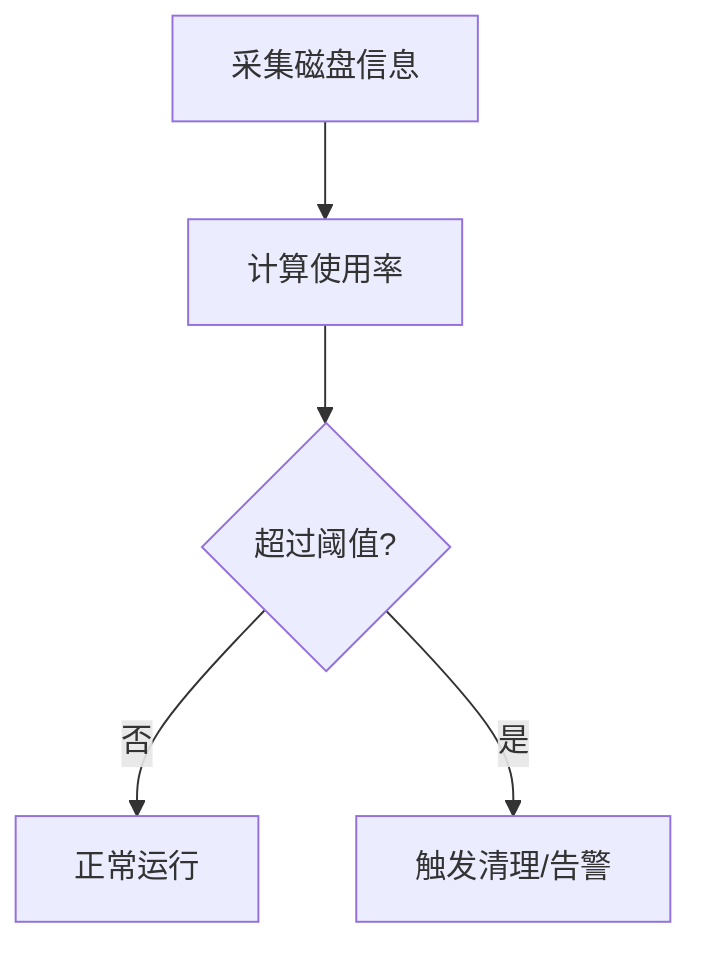
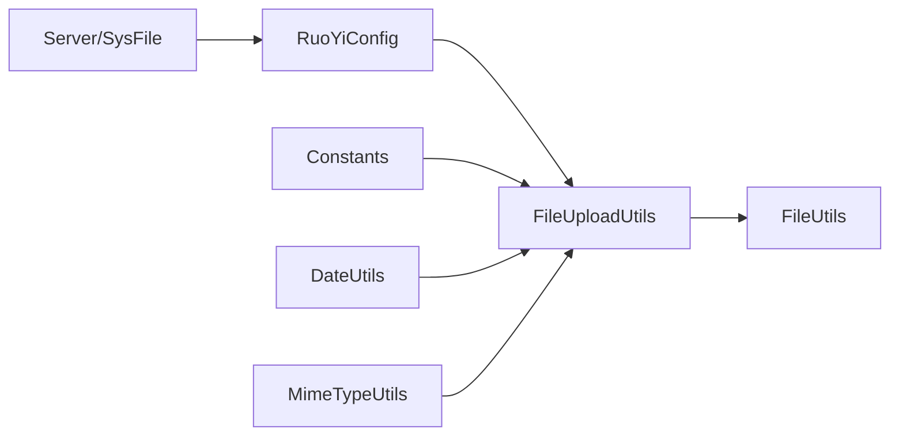

# 存储策略管理

<cite>
**本文档引用的文件**
- [Constants.java](file://ruoyi-common/src/main/java/com/ruoyi/common/constant/Constants.java)
- [RuoYiConfig.java](file://ruoyi-common/src/main/java/com/ruoyi/common/config/RuoYiConfig.java)
- [FileUploadUtils.java](file://ruoyi-common/src/main/java/com/ruoyi/common/utils/file/FileUploadUtils.java)
- [FileUtils.java](file://ruoyi-common/src/main/java/com/ruoyi/common/utils/file/FileUtils.java)
- [MimeTypeUtils.java](file://ruoyi-common/src/main/java/com/ruoyi/common/utils/file/MimeTypeUtils.java)
- [application.yml](file://ruoyi-admin/src/main/resources/application.yml)
- [DateUtils.java](file://ruoyi-common/src/main/java/com/ruoyi/common/utils/DateUtils.java)
- [SysFile.java](file://ruoyi-framework/src/main/java/com/ruoyi/framework/web/domain/server/SysFile.java)
- [Server.java](file://ruoyi-framework/src/main/java/com/ruoyi/framework/web/domain/Server.java)
- [index.vue](file://ruoyi-ui/src/views/gangzhu/house/enterprise/index.vue)
- [detail.vue](file://uniapp-h5/pages/room/detail.vue)
</cite>

## 目录
1. [简介](#简介)
2. [项目结构](#项目结构)
3. [核心组件](#核心组件)
4. [架构总览](#架构总览)
5. [详细组件分析](#详细组件分析)
6. [依赖关系分析](#依赖关系分析)
7. [性能考虑](#性能考虑)
8. [故障排查指南](#故障排查指南)
9. [结论](#结论)
10. [附录](#附录)

## 简介
本文件存储策略管理文档系统性阐述了港好住项目的文件存储策略，涵盖存储路径规划、目录层级结构设计、文件名唯一性保证、权限控制、磁盘空间监控、存储配额与自动清理机制、访问路径生成规则以及配置管理与动态调整方案。文档基于实际代码实现，结合前端与后端交互流程，提供可视化图表与实践建议，帮助开发者与运维人员高效落地与维护文件存储体系。

## 项目结构
后端采用RuoYi框架，文件存储相关的核心代码集中在通用工具模块与配置模块中，前端通过统一的上传组件与URL拼接规则进行文件访问。整体结构如下：

**图表来源**
- [RuoYiConfig.java:118-121](file://ruoyi-common/src/main/java/com/ruoyi/common/config/RuoYiConfig.java#L118-L121)
- [Constants.java:139-141](file://ruoyi-common/src/main/java/com/ruoyi/common/constant/Constants.java#L139-L141)
- [FileUploadUtils.java:102-139](file://ruoyi-common/src/main/java/com/ruoyi/common/utils/file/FileUploadUtils.java#L102-L139)
- [FileUtils.java:88-105](file://ruoyi-common/src/main/java/com/ruoyi/common/utils/file/FileUtils.java#L88-L105)
- [MimeTypeUtils.java:29-39](file://ruoyi-common/src/main/java/com/ruoyi/common/utils/file/MimeTypeUtils.java#L29-L39)
- [DateUtils.java:97-101](file://ruoyi-common/src/main/java/com/ruoyi/common/utils/DateUtils.java#L97-L101)
- [SysFile.java:1-114](file://ruoyi-framework/src/main/java/com/ruoyi/framework/web/domain/server/SysFile.java#L1-L114)
- [Server.java:186-240](file://ruoyi-framework/src/main/java/com/ruoyi/framework/web/domain/Server.java#L186-L240)
- [index.vue:254-278](file://ruoyi-ui/src/views/gangzhu/house/enterprise/index.vue#L254-L278)
- [detail.vue:254-289](file://uniapp-h5/pages/room/detail.vue#L254-L289)

**章节来源**
- [application.yml:9-12](file://ruoyi-admin/src/main/resources/application.yml#L9-L12)
- [RuoYiConfig.java:94-121](file://ruoyi-common/src/main/java/com/ruoyi/common/config/RuoYiConfig.java#L94-L121)

## 核心组件
- 配置中心：集中管理上传根路径、头像路径、上传路径等，支持动态读取与扩展。
- 上传工具：负责文件名校验、扩展名提取、目录创建、路径生成与访问URL拼接。
- 文件工具：提供文件读写、删除、下载头编码、扩展名识别等辅助能力。
- 媒体类型：定义默认允许的文件扩展名集合，用于上传校验。
- 日期工具：生成按年/月/日的目录结构，确保按日期分层存储。
- 系统监控：采集磁盘使用情况，为存储配额与清理策略提供数据支撑。

**章节来源**
- [RuoYiConfig.java:24-121](file://ruoyi-common/src/main/java/com/ruoyi/common/config/RuoYiConfig.java#L24-L121)
- [FileUploadUtils.java:102-176](file://ruoyi-common/src/main/java/com/ruoyi/common/utils/file/FileUploadUtils.java#L102-L176)
- [FileUtils.java:88-105](file://ruoyi-common/src/main/java/com/ruoyi/common/utils/file/FileUtils.java#L88-L105)
- [MimeTypeUtils.java:29-39](file://ruoyi-common/src/main/java/com/ruoyi/common/utils/file/MimeTypeUtils.java#L29-L39)
- [DateUtils.java:97-101](file://ruoyi-common/src/main/java/com/ruoyi/common/utils/DateUtils.java#L97-L101)
- [SysFile.java:1-114](file://ruoyi-framework/src/main/java/com/ruoyi/framework/web/domain/server/SysFile.java#L1-L114)

## 架构总览
后端通过统一的上传入口接收文件，依据配置确定存储根目录，并按日期生成子目录，使用UUID保证文件名唯一性，最终返回带有固定前缀的访问路径。前端根据环境变量或后端返回值拼接完整URL进行访问。

**图表来源**
- [application.yml](file://ruoyi-admin/src/main/resources/application.yml#L11)
- [RuoYiConfig.java:63-71](file://ruoyi-common/src/main/java/com/ruoyi/common/config/RuoYiConfig.java#L63-L71)
- [FileUploadUtils.java:102-139](file://ruoyi-common/src/main/java/com/ruoyi/common/utils/file/FileUploadUtils.java#L102-L139)
- [Constants.java:139-141](file://ruoyi-common/src/main/java/com/ruoyi/common/constant/Constants.java#L139-L141)

## 详细组件分析

### 存储路径规划与目录层级
- 统一根路径：由配置项决定，通常指向服务器上的独立挂载点，便于横向扩展与迁移。
- 日期分层：按“年/月/日”自动创建目录，降低单目录文件数量，提升IO性能与管理效率。
- 类目区分：不同业务场景可通过子目录进一步细分（如头像、房源图片、VR、合同、发票等），但当前实现以日期分层为主。
- 访问前缀：统一使用固定前缀作为静态资源映射入口，前端通过该前缀与后端约定的映射规则进行访问。

**图表来源**
- [application.yml](file://ruoyi-admin/src/main/resources/application.yml#L11)
- [DateUtils.java:97-101](file://ruoyi-common/src/main/java/com/ruoyi/common/utils/DateUtils.java#L97-L101)
- [FileUploadUtils.java:152-176](file://ruoyi-common/src/main/java/com/ruoyi/common/utils/file/FileUploadUtils.java#L152-L176)
- [Constants.java:139-141](file://ruoyi-common/src/main/java/com/ruoyi/common/constant/Constants.java#L139-L141)

**章节来源**
- [RuoYiConfig.java:94-121](file://ruoyi-common/src/main/java/com/ruoyi/common/config/RuoYiConfig.java#L94-L121)
- [FileUploadUtils.java:144-155](file://ruoyi-common/src/main/java/com/ruoyi/common/utils/file/FileUploadUtils.java#L144-L155)
- [Constants.java:139-141](file://ruoyi-common/src/main/java/com/ruoyi/common/constant/Constants.java#L139-L141)

### 文件名唯一性与扩展名处理
- 唯一性：使用UUID生成器确保文件名全局唯一，避免冲突与覆盖。
- 扩展名：优先从文件名解析，若为空则从MIME类型推断，保证扩展名一致性。
- 校验：对文件大小与允许扩展名进行双重校验，防止恶意或不合规文件进入系统。

**图表来源**
- [FileUploadUtils.java:186-224](file://ruoyi-common/src/main/java/com/ruoyi/common/utils/file/FileUploadUtils.java#L186-L224)
- [FileUploadUtils.java:251-259](file://ruoyi-common/src/main/java/com/ruoyi/common/utils/file/FileUploadUtils.java#L251-L259)
- [MimeTypeUtils.java:29-39](file://ruoyi-common/src/main/java/com/ruoyi/common/utils/file/MimeTypeUtils.java#L29-L39)

**章节来源**
- [FileUploadUtils.java:186-259](file://ruoyi-common/src/main/java/com/ruoyi/common/utils/file/FileUploadUtils.java#L186-L259)
- [MimeTypeUtils.java:29-39](file://ruoyi-common/src/main/java/com/ruoyi/common/utils/file/MimeTypeUtils.java#L29-L39)

### 访问路径生成规则
- 前缀固定：统一使用固定前缀作为静态资源映射入口，前端通过该前缀与后端约定的映射规则进行访问。
- 相对路径：后端返回相对路径，前端根据环境变量或后端返回值拼接完整URL。
- 外链兼容：对于外部URL（http/https）直接透传，无需拼接。

**图表来源**
- [Constants.java:139-141](file://ruoyi-common/src/main/java/com/ruoyi/common/constant/Constants.java#L139-L141)
- [FileUploadUtils.java:171-176](file://ruoyi-common/src/main/java/com/ruoyi/common/utils/file/FileUploadUtils.java#L171-L176)
- [index.vue:254-278](file://ruoyi-ui/src/views/gangzhu/house/enterprise/index.vue#L254-L278)
- [detail.vue:254-289](file://uniapp-h5/pages/room/detail.vue#L254-L289)

**章节来源**
- [Constants.java:139-141](file://ruoyi-common/src/main/java/com/ruoyi/common/constant/Constants.java#L139-L141)
- [FileUploadUtils.java:171-176](file://ruoyi-common/src/main/java/com/ruoyi/common/utils/file/FileUploadUtils.java#L171-L176)
- [index.vue:254-278](file://ruoyi-ui/src/views/gangzhu/house/enterprise/index.vue#L254-L278)
- [detail.vue:254-289](file://uniapp-h5/pages/room/detail.vue#L254-L289)

### 存储空间管理策略
- 磁盘监控：通过系统监控模块采集磁盘使用率，为容量预警与清理策略提供数据基础。
- 配额限制：可在配置层面设定上传大小上限与请求总量上限，避免资源滥用。
- 自动清理：建议结合业务生命周期与归档策略，定期清理过期或冗余文件，保持磁盘健康。

**图表来源**
- [Server.java:186-240](file://ruoyi-framework/src/main/java/com/ruoyi/framework/web/domain/Server.java#L186-L240)
- [SysFile.java:1-114](file://ruoyi-framework/src/main/java/com/ruoyi/framework/web/domain/server/SysFile.java#L1-L114)

**章节来源**
- [application.yml:60-65](file://ruoyi-admin/src/main/resources/application.yml#L60-L65)
- [Server.java:186-240](file://ruoyi-framework/src/main/java/com/ruoyi/framework/web/domain/Server.java#L186-L240)
- [SysFile.java:1-114](file://ruoyi-framework/src/main/java/com/ruoyi/framework/web/domain/server/SysFile.java#L1-L114)

### 配置管理与动态调整
- 配置项：根路径、IP获取开关、验证码类型等集中管理，便于环境差异化部署。
- 上传参数：单文件与总上传大小可根据业务需要调整（如VR全景图较大）。
- 动态生效：通过配置文件热更新或重启服务生效，建议在变更前做好备份与验证。

**章节来源**
- [application.yml:9-12](file://ruoyi-admin/src/main/resources/application.yml#L9-L12)
- [application.yml:60-65](file://ruoyi-admin/src/main/resources/application.yml#L60-L65)

## 依赖关系分析
- 上传工具依赖配置中心与常量模块，确保路径与前缀的一致性。
- 文件工具依赖上传工具与日期工具，提供扩展名识别与路径剥离能力。
- 媒体类型工具为上传校验提供扩展名白名单。
- 系统监控模块为存储策略提供容量与使用率数据。

**图表来源**
- [RuoYiConfig.java:24-121](file://ruoyi-common/src/main/java/com/ruoyi/common/config/RuoYiConfig.java#L24-L121)
- [Constants.java:139-141](file://ruoyi-common/src/main/java/com/ruoyi/common/constant/Constants.java#L139-L141)
- [FileUploadUtils.java:102-176](file://ruoyi-common/src/main/java/com/ruoyi/common/utils/file/FileUploadUtils.java#L102-L176)
- [FileUtils.java:88-105](file://ruoyi-common/src/main/java/com/ruoyi/common/utils/file/FileUtils.java#L88-L105)
- [MimeTypeUtils.java:29-39](file://ruoyi-common/src/main/java/com/ruoyi/common/utils/file/MimeTypeUtils.java#L29-L39)
- [DateUtils.java:97-101](file://ruoyi-common/src/main/java/com/ruoyi/common/utils/DateUtils.java#L97-L101)
- [Server.java:186-240](file://ruoyi-framework/src/main/java/com/ruoyi/framework/web/domain/Server.java#L186-L240)

**章节来源**
- [FileUploadUtils.java:102-176](file://ruoyi-common/src/main/java/com/ruoyi/common/utils/file/FileUploadUtils.java#L102-L176)
- [FileUtils.java:88-105](file://ruoyi-common/src/main/java/com/ruoyi/common/utils/file/FileUtils.java#L88-L105)

## 性能考虑
- 目录分层：按日期分层可显著降低单目录文件数量，提升文件系统性能。
- 扩展名校验：在上传阶段快速过滤不合规文件，减少后续处理成本。
- 大文件支持：适当提高单文件与总上传大小，满足VR等大文件场景。
- CDN配合：建议对静态资源启用CDN，减轻服务器压力并提升访问速度。

## 故障排查指南
- 上传失败：检查文件大小与扩展名是否在允许范围内，确认磁盘空间充足。
- 访问异常：确认返回路径包含固定前缀，前端拼接逻辑正确，外链场景直接透传。
- 权限问题：检查文件系统权限与目录创建逻辑，确保具备写入权限。
- 清理策略：结合系统监控数据，制定定期清理计划，避免磁盘占满。

**章节来源**
- [FileUploadUtils.java:186-224](file://ruoyi-common/src/main/java/com/ruoyi/common/utils/file/FileUploadUtils.java#L186-L224)
- [FileUtils.java:113-116](file://ruoyi-common/src/main/java/com/ruoyi/common/utils/file/FileUtils.java#L113-L116)
- [Server.java:186-240](file://ruoyi-framework/src/main/java/com/ruoyi/framework/web/domain/Server.java#L186-L240)

## 结论
本存储策略以统一配置为核心，通过日期分层与UUID命名确保可扩展性与稳定性，结合固定前缀与前端拼接规则实现简洁一致的访问路径。配合磁盘监控与合理的配额限制，可构建健壮的文件存储体系。建议在生产环境中持续监控容量与性能，按需调整配置与清理策略，确保系统长期稳定运行。

## 附录
- 常用配置项
  - 根路径：ruoyi.profile
  - 单文件大小：spring.servlet.multipart.max-file-size
  - 总上传大小：spring.servlet.multipart.max-request-size
- 常见扩展名白名单：图片、文档、压缩包、视频、PDF等
- 访问前缀：固定前缀 + 相对路径