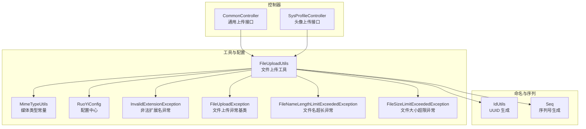
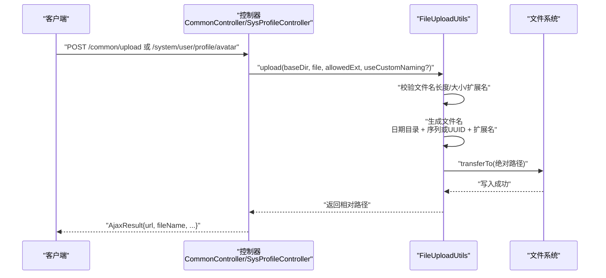
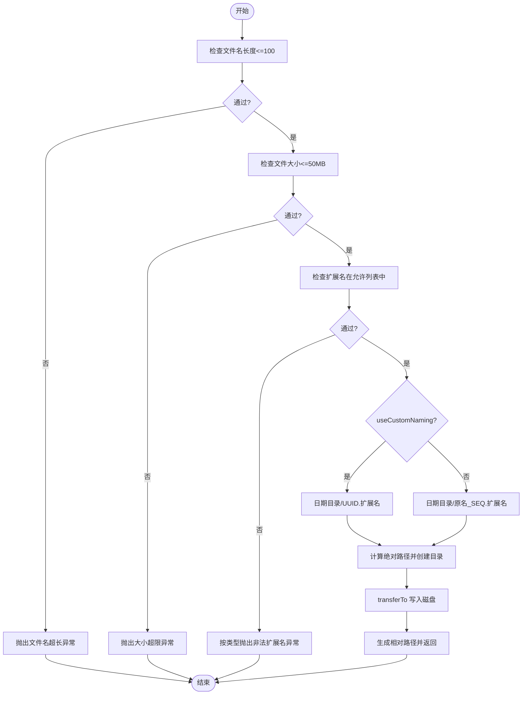
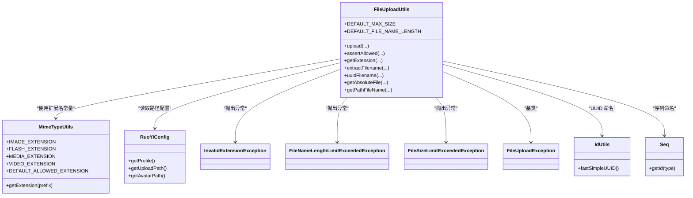

# 文件上传机制

<cite>
**本文引用的文件**
- [FileUploadUtils.java](file://ruoyi-common/src/main/java/com/ruoyi/common/utils/file/FileUploadUtils.java)
- [MimeTypeUtils.java](file://ruoyi-common/src/main/java/com/ruoyi/common/utils/file/MimeTypeUtils.java)
- [RuoYiConfig.java](file://ruoyi-common/src/main/java/com/ruoyi/common/config/RuoYiConfig.java)
- [InvalidExtensionException.java](file://ruoyi-common/src/main/java/com/ruoyi/common/exception/file/InvalidExtensionException.java)
- [FileUploadException.java](file://ruoyi-common/src/main/java/com/ruoyi/common/exception/file/FileUploadException.java)
- [FileNameLengthLimitExceededException.java](file://ruoyi-common/src/main/java/com/ruoyi/common/exception/file/FileNameLengthLimitExceededException.java)
- [FileSizeLimitExceededException.java](file://ruoyi-common/src/main/java/com/ruoyi/common/exception/file/FileSizeLimitExceededException.java)
- [CommonController.java](file://ruoyi-admin/src/main/java/com/ruoyi/web/controller/common/CommonController.java)
- [SysProfileController.java](file://ruoyi-admin/src/main/java/com/ruoyi/web/controller/system/SysProfileController.java)
- [IdUtils.java](file://ruoyi-common/src/main/java/com/ruoyi/common/utils/uuid/IdUtils.java)
- [Seq.java](file://ruoyi-common/src/main/java/com/ruoyi/common/utils/uuid/Seq.java)
</cite>

## 目录
1. [简介](#简介)
2. [项目结构](#项目结构)
3. [核心组件](#核心组件)
4. [架构总览](#架构总览)
5. [详细组件分析](#详细组件分析)
6. [依赖分析](#依赖分析)
7. [性能考虑](#性能考虑)
8. [故障排查指南](#故障排查指南)
9. [结论](#结论)
10. [附录](#附录)

## 简介
本文件围绕文件上传机制展开，重点解析 FileUploadUtils 的核心实现，涵盖文件类型验证、大小限制检查、安全扩展名过滤、文件命名规则（日期目录结构、UUID 重命名、序列号生成）、存储路径组织与最终落盘流程，并结合控制器层的调用示例说明端到端上传链路。同时提供针对图片、视频、文档等不同类型文件的处理策略建议、异常处理策略与安全最佳实践及性能优化建议。

## 项目结构
文件上传相关能力主要集中在以下模块：
- 工具与配置层：FileUploadUtils、MimeTypeUtils、RuoYiConfig、异常类
- 控制器层：CommonController（通用上传）、SysProfileController（头像上传）
- 命名与序列：IdUtils（UUID 生成）、Seq（序列号生成）

图表来源
- [FileUploadUtils.java:1-261](file://ruoyi-common/src/main/java/com/ruoyi/common/utils/file/FileUploadUtils.java#L1-L261)
- [MimeTypeUtils.java:1-59](file://ruoyi-common/src/main/java/com/ruoyi/common/utils/file/MimeTypeUtils.java#L1-L59)
- [RuoYiConfig.java:1-123](file://ruoyi-common/src/main/java/com/ruoyi/common/config/RuoYiConfig.java#L1-L123)
- [CommonController.java:1-163](file://ruoyi-admin/src/main/java/com/ruoyi/web/controller/common/CommonController.java#L1-L163)
- [SysProfileController.java:1-149](file://ruoyi-admin/src/main/java/com/ruoyi/web/controller/system/SysProfileController.java#L1-L149)
- [IdUtils.java:1-50](file://ruoyi-common/src/main/java/com/ruoyi/common/utils/uuid/IdUtils.java#L1-L50)
- [Seq.java:1-87](file://ruoyi-common/src/main/java/com/ruoyi/common/utils/uuid/Seq.java#L1-L87)

章节来源
- [FileUploadUtils.java:1-261](file://ruoyi-common/src/main/java/com/ruoyi/common/utils/file/FileUploadUtils.java#L1-L261)
- [MimeTypeUtils.java:1-59](file://ruoyi-common/src/main/java/com/ruoyi/common/utils/file/MimeTypeUtils.java#L1-L59)
- [RuoYiConfig.java:1-123](file://ruoyi-common/src/main/java/com/ruoyi/common/config/RuoYiConfig.java#L1-L123)
- [CommonController.java:1-163](file://ruoyi-admin/src/main/java/com/ruoyi/web/controller/common/CommonController.java#L1-L163)
- [SysProfileController.java:1-149](file://ruoyi-admin/src/main/java/com/ruoyi/web/controller/system/SysProfileController.java#L1-L149)
- [IdUtils.java:1-50](file://ruoyi-common/src/main/java/com/ruoyi/common/utils/uuid/IdUtils.java#L1-L50)
- [Seq.java:1-87](file://ruoyi-common/src/main/java/com/ruoyi/common/utils/uuid/Seq.java#L1-L87)

## 核心组件
- FileUploadUtils：统一的文件上传入口，负责大小限制、扩展名校验、文件命名、路径组织与落盘。
- MimeTypeUtils：定义图片、Flash、音视频、默认允许扩展名等常量集合。
- RuoYiConfig：提供 profile、upload、avatar 等路径配置。
- 异常体系：InvalidExtensionException（扩展名非法）、FileSizeLimitExceededException（大小超限）、FileNameLengthLimitExceededException（文件名超长）等。
- 命名与序列：IdUtils.fastSimpleUUID（UUID 重命名）、Seq（序列号生成）。

章节来源
- [FileUploadUtils.java:24-261](file://ruoyi-common/src/main/java/com/ruoyi/common/utils/file/FileUploadUtils.java#L24-L261)
- [MimeTypeUtils.java:8-59](file://ruoyi-common/src/main/java/com/ruoyi/common/utils/file/MimeTypeUtils.java#L8-L59)
- [RuoYiConfig.java:24-121](file://ruoyi-common/src/main/java/com/ruoyi/common/config/RuoYiConfig.java#L24-L121)
- [InvalidExtensionException.java:10-80](file://ruoyi-common/src/main/java/com/ruoyi/common/exception/file/InvalidExtensionException.java#L10-L80)
- [FileNameLengthLimitExceededException.java:8-16](file://ruoyi-common/src/main/java/com/ruoyi/common/exception/file/FileNameLengthLimitExceededException.java#L8-L16)
- [FileSizeLimitExceededException.java:8-16](file://ruoyi-common/src/main/java/com/ruoyi/common/exception/file/FileSizeLimitExceededException.java#L8-L16)
- [IdUtils.java:8-48](file://ruoyi-common/src/main/java/com/ruoyi/common/utils/uuid/IdUtils.java#L8-L48)
- [Seq.java:10-85](file://ruoyi-common/src/main/java/com/ruoyi/common/utils/uuid/Seq.java#L10-L85)

## 架构总览
文件上传从 HTTP 请求进入控制器，经由 FileUploadUtils 完成安全检查与命名，最终写入磁盘并返回可访问的相对路径。

图表来源
- [CommonController.java:74-95](file://ruoyi-admin/src/main/java/com/ruoyi/web/controller/common/CommonController.java#L74-L95)
- [SysProfileController.java:124-147](file://ruoyi-admin/src/main/java/com/ruoyi/web/controller/system/SysProfileController.java#L124-L147)
- [FileUploadUtils.java:102-139](file://ruoyi-common/src/main/java/com/ruoyi/common/utils/file/FileUploadUtils.java#L102-L139)

## 详细组件分析

### FileUploadUtils 核心流程
- 输入参数：baseDir（相对应用的基目录）、MultipartFile、allowedExtension（允许的扩展名数组）、useCustomNaming（是否使用 UUID 命名）。
- 关键步骤：
  1) 文件名长度校验（默认最大 100 字符）。
  2) 文件大小校验（默认最大 50MB）。
  3) 扩展名白名单校验，按类型抛出具体异常（图片/Flash/音视频/通用）。
  4) 命名策略：
     - 使用自定义命名：日期目录 + UUID + 扩展名。
     - 使用序列命名：日期目录 + 原文件名 + Seq 序列 + 扩展名。
  5) 绝对路径创建与文件写入。
  6) 返回相对路径（前缀 + 当前目录 + 文件名）。

图表来源
- [FileUploadUtils.java:102-139](file://ruoyi-common/src/main/java/com/ruoyi/common/utils/file/FileUploadUtils.java#L102-L139)
- [FileUploadUtils.java:144-155](file://ruoyi-common/src/main/java/com/ruoyi/common/utils/file/FileUploadUtils.java#L144-L155)
- [FileUploadUtils.java:171-176](file://ruoyi-common/src/main/java/com/ruoyi/common/utils/file/FileUploadUtils.java#L171-L176)
- [FileUploadUtils.java:186-224](file://ruoyi-common/src/main/java/com/ruoyi/common/utils/file/FileUploadUtils.java#L186-L224)

章节来源
- [FileUploadUtils.java:26-49](file://ruoyi-common/src/main/java/com/ruoyi/common/utils/file/FileUploadUtils.java#L26-L49)
- [FileUploadUtils.java:102-139](file://ruoyi-common/src/main/java/com/ruoyi/common/utils/file/FileUploadUtils.java#L102-L139)
- [FileUploadUtils.java:144-155](file://ruoyi-common/src/main/java/com/ruoyi/common/utils/file/FileUploadUtils.java#L144-L155)
- [FileUploadUtils.java:171-176](file://ruoyi-common/src/main/java/com/ruoyi/common/utils/file/FileUploadUtils.java#L171-L176)
- [FileUploadUtils.java:186-224](file://ruoyi-common/src/main/java/com/ruoyi/common/utils/file/FileUploadUtils.java#L186-L224)

### 文件类型与扩展名校验
- 默认允许扩展名集合覆盖图片、文档、压缩包、视频、PDF 等。
- 按类型细分：
  - 图片：bmp、gif、jpg、jpeg、png
  - Flash：swf、flv
  - 音视频：多种常见格式
  - 视频：mp4、avi、rmvb
- 若扩展名不在允许列表中，根据 allowedExtension 参数抛出对应类型异常。

章节来源
- [MimeTypeUtils.java:20-39](file://ruoyi-common/src/main/java/com/ruoyi/common/utils/file/MimeTypeUtils.java#L20-L39)
- [FileUploadUtils.java:186-224](file://ruoyi-common/src/main/java/com/ruoyi/common/utils/file/FileUploadUtils.java#L186-L224)
- [InvalidExtensionException.java:10-80](file://ruoyi-common/src/main/java/com/ruoyi/common/exception/file/InvalidExtensionException.java#L10-L80)

### 文件命名规则
- 日期目录结构：基于当前日期生成目录（年/月/日），用于分层存储。
- 序列命名：保留原文件名 + Seq 序列号，适合需要保留语义的场景。
- UUID 命名：使用 IdUtils.fastSimpleUUID 生成唯一文件名，适合头像等强去重场景。
- 扩展名提取：优先从原始文件名获取，若为空则回退到 MIME 类型映射。

章节来源
- [FileUploadUtils.java:144-155](file://ruoyi-common/src/main/java/com/ruoyi/common/utils/file/FileUploadUtils.java#L144-L155)
- [FileUploadUtils.java:251-259](file://ruoyi-common/src/main/java/com/ruoyi/common/utils/file/FileUploadUtils.java#L251-L259)
- [IdUtils.java:45-48](file://ruoyi-common/src/main/java/com/ruoyi/common/utils/uuid/IdUtils.java#L45-L48)
- [Seq.java:32-65](file://ruoyi-common/src/main/java/com/ruoyi/common/utils/uuid/Seq.java#L32-L65)

### 存储路径组织与返回
- 绝对路径：baseDir + 日期目录 + 文件名；若父目录不存在则自动创建。
- 相对路径：Constants.RESOURCE_PREFIX + 当前目录 + 文件名，便于前端拼接访问 URL。

章节来源
- [FileUploadUtils.java:157-169](file://ruoyi-common/src/main/java/com/ruoyi/common/utils/file/FileUploadUtils.java#L157-L169)
- [FileUploadUtils.java:171-176](file://ruoyi-common/src/main/java/com/ruoyi/common/utils/file/FileUploadUtils.java#L171-L176)

### 控制器调用示例
- 通用上传：CommonController 提供单文件与多文件上传接口，统一调用 FileUploadUtils 并返回可访问 URL。
- 头像上传：SysProfileController 对头像使用 UUID 命名策略，确保唯一性并替换旧头像文件。

章节来源
- [CommonController.java:74-132](file://ruoyi-admin/src/main/java/com/ruoyi/web/controller/common/CommonController.java#L74-L132)
- [SysProfileController.java:124-147](file://ruoyi-admin/src/main/java/com/ruoyi/web/controller/system/SysProfileController.java#L124-L147)

### 不同文件类型的处理策略（建议）
- 图片文件：建议在上传后进行压缩与格式优化（如转为 WebP/JPEG），并生成多尺寸缩略图；对 EXIF 进行清洗。
- 视频文件：建议在上传后进行转码（如 H.264/H.265），并生成封面图与进度索引；对分辨率与码率进行限制。
- 文档文件：建议进行格式校验与病毒扫描；对 Office 文档可生成预览页或 PDF 化；对大文件采用分块上传与断点续传。

（本节为概念性建议，不直接分析具体源码）

## 依赖分析
FileUploadUtils 的直接依赖关系如下：

图表来源
- [FileUploadUtils.java:24-261](file://ruoyi-common/src/main/java/com/ruoyi/common/utils/file/FileUploadUtils.java#L24-L261)
- [MimeTypeUtils.java:8-59](file://ruoyi-common/src/main/java/com/ruoyi/common/utils/file/MimeTypeUtils.java#L8-L59)
- [RuoYiConfig.java:63-121](file://ruoyi-common/src/main/java/com/ruoyi/common/config/RuoYiConfig.java#L63-L121)
- [InvalidExtensionException.java:10-80](file://ruoyi-common/src/main/java/com/ruoyi/common/exception/file/InvalidExtensionException.java#L10-L80)
- [FileUploadException.java:11-61](file://ruoyi-common/src/main/java/com/ruoyi/common/exception/file/FileUploadException.java#L11-L61)
- [FileNameLengthLimitExceededException.java:8-16](file://ruoyi-common/src/main/java/com/ruoyi/common/exception/file/FileNameLengthLimitExceededException.java#L8-L16)
- [FileSizeLimitExceededException.java:8-16](file://ruoyi-common/src/main/java/com/ruoyi/common/exception/file/FileSizeLimitExceededException.java#L8-L16)
- [IdUtils.java:8-48](file://ruoyi-common/src/main/java/com/ruoyi/common/utils/uuid/IdUtils.java#L8-L48)
- [Seq.java:10-85](file://ruoyi-common/src/main/java/com/ruoyi/common/utils/uuid/Seq.java#L10-L85)

章节来源
- [FileUploadUtils.java:1-261](file://ruoyi-common/src/main/java/com/ruoyi/common/utils/file/FileUploadUtils.java#L1-L261)
- [MimeTypeUtils.java:1-59](file://ruoyi-common/src/main/java/com/ruoyi/common/utils/file/MimeTypeUtils.java#L1-L59)
- [RuoYiConfig.java:1-123](file://ruoyi-common/src/main/java/com/ruoyi/common/config/RuoYiConfig.java#L1-L123)
- [InvalidExtensionException.java:1-81](file://ruoyi-common/src/main/java/com/ruoyi/common/exception/file/InvalidExtensionException.java#L1-L81)
- [FileUploadException.java:1-62](file://ruoyi-common/src/main/java/com/ruoyi/common/exception/file/FileUploadException.java#L1-L62)
- [FileNameLengthLimitExceededException.java:1-17](file://ruoyi-common/src/main/java/com/ruoyi/common/exception/file/FileNameLengthLimitExceededException.java#L1-L17)
- [FileSizeLimitExceededException.java:1-17](file://ruoyi-common/src/main/java/com/ruoyi/common/exception/file/FileSizeLimitExceededException.java#L1-L17)
- [IdUtils.java:1-50](file://ruoyi-common/src/main/java/com/ruoyi/common/utils/uuid/IdUtils.java#L1-L50)
- [Seq.java:1-87](file://ruoyi-common/src/main/java/com/ruoyi/common/utils/uuid/Seq.java#L1-L87)

## 性能考虑
- IO 写入：transferTo 为直接文件拷贝，避免内存驻留，适合大文件；建议配合磁盘吞吐与并发控制。
- 目录分层：按日期分层（年/月/日）降低单目录文件数量，提升文件系统性能。
- 命名策略：UUID 命名避免重名冲突，序列命名保留原文件名利于检索，按场景选择。
- 扩展名与大小限制：在入口快速拒绝，减少无效 IO。
- 并发与限流：结合全局限流与队列缓冲，避免磁盘抖动。

（本节为通用性能建议，不直接分析具体源码）

## 故障排查指南
- 文件大小超限
  - 现象：抛出文件大小超限异常。
  - 排查：确认 DEFAULT_MAX_SIZE 与业务阈值；检查客户端是否超过服务端限制。
  - 参考
    - [FileSizeLimitExceededException.java:8-16](file://ruoyi-common/src/main/java/com/ruoyi/common/exception/file/FileSizeLimitExceededException.java#L8-L16)
    - [FileUploadUtils.java:189-193](file://ruoyi-common/src/main/java/com/ruoyi/common/utils/file/FileUploadUtils.java#L189-L193)
- 非法扩展名
  - 现象：按类型抛出非法扩展名异常（图片/Flash/音视频/通用）。
  - 排查：核对 allowedExtension 与实际扩展名；确认 MIME 回退逻辑是否生效。
  - 参考
    - [InvalidExtensionException.java:10-80](file://ruoyi-common/src/main/java/com/ruoyi/common/exception/file/InvalidExtensionException.java#L10-L80)
    - [FileUploadUtils.java:197-223](file://ruoyi-common/src/main/java/com/ruoyi/common/utils/file/FileUploadUtils.java#L197-L223)
- 文件名过长
  - 现象：抛出文件名超长异常。
  - 排查：确认 DEFAULT_FILE_NAME_LENGTH；检查客户端提交的原始文件名。
  - 参考
    - [FileNameLengthLimitExceededException.java:8-16](file://ruoyi-common/src/main/java/com/ruoyi/common/exception/file/FileNameLengthLimitExceededException.java#L8-L16)
    - [FileUploadUtils.java:126-130](file://ruoyi-common/src/main/java/com/ruoyi/common/utils/file/FileUploadUtils.java#L126-L130)
- 路径创建失败
  - 现象：目录不存在导致写入失败。
  - 排查：确认 baseDir 权限与磁盘空间；检查 getAbsoluteFile 是否正确创建父目录。
  - 参考
    - [FileUploadUtils.java:157-169](file://ruoyi-common/src/main/java/com/ruoyi/common/utils/file/FileUploadUtils.java#L157-L169)
- 返回路径异常
  - 现象：前端无法访问文件。
  - 排查：确认 Constants.RESOURCE_PREFIX 与 RuoYiConfig.getProfile() 配置一致；核对服务器静态资源映射。
  - 参考
    - [FileUploadUtils.java:171-176](file://ruoyi-common/src/main/java/com/ruoyi/common/utils/file/FileUploadUtils.java#L171-L176)
    - [RuoYiConfig.java:63-121](file://ruoyi-common/src/main/java/com/ruoyi/common/config/RuoYiConfig.java#L63-L121)

章节来源
- [FileSizeLimitExceededException.java:8-16](file://ruoyi-common/src/main/java/com/ruoyi/common/exception/file/FileSizeLimitExceededException.java#L8-L16)
- [InvalidExtensionException.java:10-80](file://ruoyi-common/src/main/java/com/ruoyi/common/exception/file/InvalidExtensionException.java#L10-L80)
- [FileNameLengthLimitExceededException.java:8-16](file://ruoyi-common/src/main/java/com/ruoyi/common/exception/file/FileNameLengthLimitExceededException.java#L8-L16)
- [FileUploadUtils.java:126-130](file://ruoyi-common/src/main/java/com/ruoyi/common/utils/file/FileUploadUtils.java#L126-L130)
- [FileUploadUtils.java:157-169](file://ruoyi-common/src/main/java/com/ruoyi/common/utils/file/FileUploadUtils.java#L157-L169)
- [FileUploadUtils.java:171-176](file://ruoyi-common/src/main/java/com/ruoyi/common/utils/file/FileUploadUtils.java#L171-L176)
- [RuoYiConfig.java:63-121](file://ruoyi-common/src/main/java/com/ruoyi/common/config/RuoYiConfig.java#L63-L121)

## 结论
FileUploadUtils 将文件上传的关键环节（大小、扩展名、命名、路径、落盘）集中在一个工具类中，配合控制器层实现统一接入。通过合理的命名策略与目录分层，既保证了安全性也兼顾了可维护性。建议在生产环境中结合业务类型对图片、视频、文档分别制定更严格的处理策略，并完善监控与告警，持续优化性能与稳定性。

## 附录
- 配置项参考
  - 上传根路径：RuoYiConfig.getProfile() + "/upload"
  - 头像路径：RuoYiConfig.getAvatarPath()
  - 默认大小：50MB
  - 默认文件名长度：100 字符
- 常见扩展名集合
  - 图片：bmp、gif、jpg、jpeg、png
  - 文档：doc、docx、xls、xlsx、ppt、pptx、html、htm、txt、pdf
  - 压缩包：rar、zip、gz、bz2
  - 视频：mp4、avi、rmvb

章节来源
- [RuoYiConfig.java:94-121](file://ruoyi-common/src/main/java/com/ruoyi/common/config/RuoYiConfig.java#L94-L121)
- [MimeTypeUtils.java:20-39](file://ruoyi-common/src/main/java/com/ruoyi/common/utils/file/MimeTypeUtils.java#L20-L39)
- [FileUploadUtils.java:26-49](file://ruoyi-common/src/main/java/com/ruoyi/common/utils/file/FileUploadUtils.java#L26-L49)