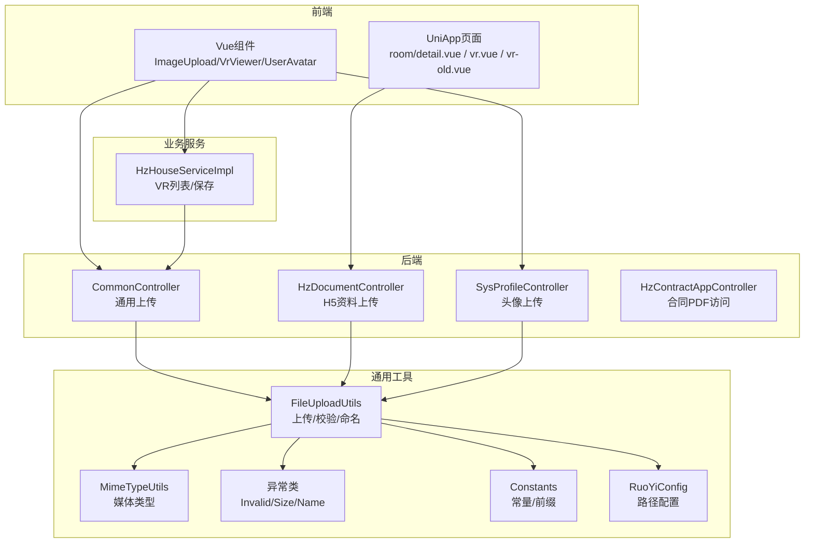
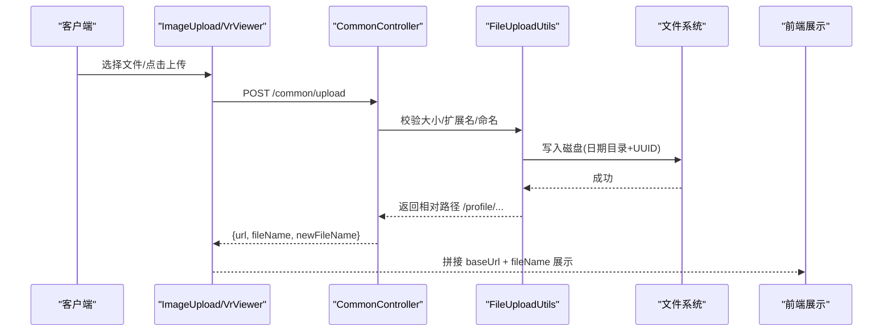
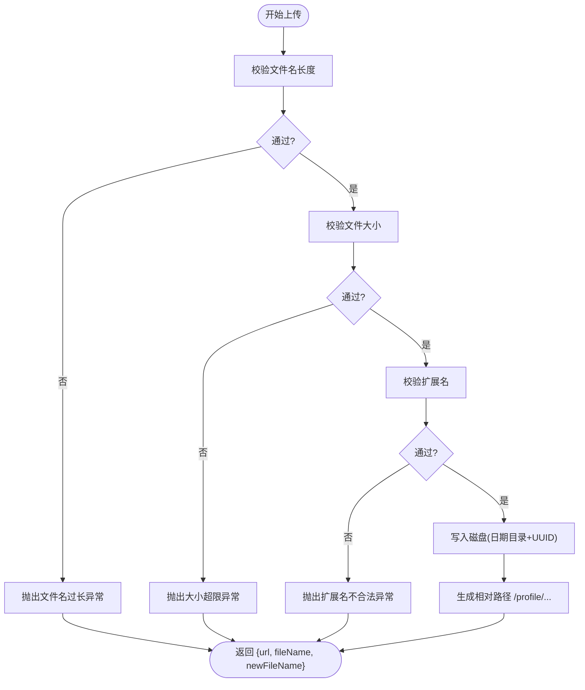
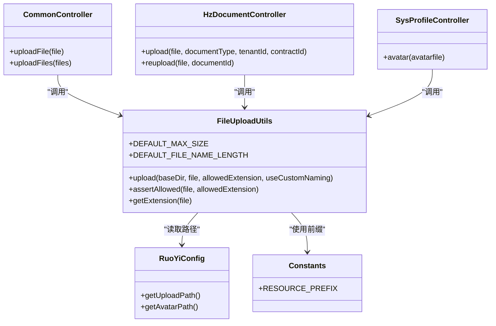

# 文件存储系统

<cite>
**本文引用的文件**
- [ruoyi-common/src/main/java/com/ruoyi/common/utils/file/FileUploadUtils.java](file://ruoyi-common/src/main/java/com/ruoyi/common/utils/file/FileUploadUtils.java)
- [ruoyi-common/src/main/java/com/ruoyi/common/utils/file/MimeTypeUtils.java](file://ruoyi-common/src/main/java/com/ruoyi/common/utils/file/MimeTypeUtils.java)
- [ruoyi-common/src/main/java/com/ruoyi/common/exception/file/InvalidExtensionException.java](file://ruoyi-common/src/main/java/com/ruoyi/common/exception/file/InvalidExtensionException.java)
- [ruoyi-common/src/main/java/com/ruoyi/common/exception/file/FileSizeLimitExceededException.java](file://ruoyi-common/src/main/java/com/ruoyi/common/exception/file/FileSizeLimitExceededException.java)
- [ruoyi-common/src/main/java/com/ruoyi/common/exception/file/FileNameLengthLimitExceededException.java](file://ruoyi-common/src/main/java/com/ruoyi/common/exception/file/FileNameLengthLimitExceededException.java)
- [ruoyi-common/src/main/java/com/ruoyi/common/constant/Constants.java](file://ruoyi-common/src/main/java/com/ruoyi/common/constant/Constants.java)
- [ruoyi-common/src/main/java/com/ruoyi/common/config/RuoYiConfig.java](file://ruoyi-common/src/main/java/com/ruoyi/common/config/RuoYiConfig.java)
- [ruoyi-admin/src/main/java/com/ruoyi/web/controller/common/CommonController.java](file://ruoyi-admin/src/main/java/com/ruoyi/web/controller/common/CommonController.java)
- [ruoyi-admin/src/main/java/com/ruoyi/web/controller/h5/HzDocumentController.java](file://ruoyi-admin/src/main/java/com/ruoyi/web/controller/h5/HzDocumentController.java)
- [ruoyi-admin/src/main/java/com/ruoyi/web/controller/system/SysProfileController.java](file://ruoyi-admin/src/main/java/com/ruoyi/web/controller/system/SysProfileController.java)
- [ruoyi-system/src/main/java/com/ruoyi/system/service/impl/HzHouseServiceImpl.java](file://ruoyi-system/src/main/java/com/ruoyi/system/service/impl/HzHouseServiceImpl.java)
- [ruoyi-ui/src/views/gangzhu/house/index.vue](file://ruoyi-ui/src/views/gangzhu/house/index.vue)
- [ruoyi-ui/src/views/gangzhu/houseType/index.vue](file://ruoyi-ui/src/views/gangzhu/houseType/index.vue)
- [ruoyi-ui/src/views/system/user/profile/userAvatar.vue](file://ruoyi-ui/src/views/system/user/profile/userAvatar.vue)
- [ruoyi-ui/src/components/VrViewer/index.vue](file://ruoyi-ui/src/components/VrViewer/index.vue)
- [uniapp-h5/pages/room/detail.vue](file://uniapp-h5/pages/room/detail.vue)
- [uniapp-h5/pages/room/vr.vue.bak](file://uniapp-h5/pages/room/vr.vue.bak)
- [uniapp-h5/pages/room/vr-old.vue](file://uniapp-h5/pages/room/vr-old.vue)
- [uniapp-h5/static/vr-viewer.html](file://uniapp-h5/static/vr-viewer.html)
- [ruoyi-common/src/main/java/com/ruoyi/common/filter/RefererFilter.java](file://ruoyi-common/src/main/java/com/ruoyi/common/filter/RefererFilter.java)
- [ruoyi-admin/src/main/java/com/ruoyi/web/controller/h5/HzContractAppController.java](file://ruoyi-admin/src/main/java/com/ruoyi/web/controller/h5/HzContractAppController.java)
- [.claude/ruoyi-image-knowledge.md](file://.claude/ruoyi-image-knowledge.md)
- [README_数据清理研究.md](file://README_数据清理研究.md)
- [数据清理执行计划.txt](file://数据清理执行计划.txt)
</cite>

## 目录
1. [简介](#简介)
2. [项目结构](#项目结构)
3. [核心组件](#核心组件)
4. [架构总览](#架构总览)
5. [详细组件分析](#详细组件分析)
6. [依赖分析](#依赖分析)
7. [性能考虑](#性能考虑)
8. [故障排查指南](#故障排查指南)
9. [结论](#结论)
10. [附录](#附录)

## 简介
本文件存储系统围绕港好住信息系统，提供统一的文件上传、验证、存储、访问与安全控制能力。系统覆盖用户头像、房源图片、VR全景图、合同文档、发票文件等多种文件类型，同时提供防盗链、SSRF防护、CDN加速接入、存储路径管理、清理与备份恢复等运维能力。本文档面向开发者与运维人员，既提供代码级实现细节，也给出架构与流程图示，便于快速理解与落地。

## 项目结构
文件存储相关能力主要分布在以下模块：
- 通用工具与常量：文件上传工具、媒体类型、异常、常量、配置
- 控制器层：通用上传、H5资料上传、头像上传、合同PDF访问
- 前端组件：图片上传组件、VR查看器、用户头像裁剪上传
- VR全景图：H5页面与组件两种渲染方式
- 安全与防护：Referer防盗链、SSRF防护
- 运维与清理：清理研究与执行计划

图表来源
- [ruoyi-admin/src/main/java/com/ruoyi/web/controller/common/CommonController.java:74-95](file://ruoyi-admin/src/main/java/com/ruoyi/web/controller/common/CommonController.java#L74-L95)
- [ruoyi-admin/src/main/java/com/ruoyi/web/controller/h5/HzDocumentController.java:97-138](file://ruoyi-admin/src/main/java/com/ruoyi/web/controller/h5/HzDocumentController.java#L97-L138)
- [ruoyi-admin/src/main/java/com/ruoyi/web/controller/system/SysProfileController.java:123-147](file://ruoyi-admin/src/main/java/com/ruoyi/web/controller/system/SysProfileController.java#L123-L147)
- [ruoyi-system/src/main/java/com/ruoyi/system/service/impl/HzHouseServiceImpl.java:440-477](file://ruoyi-system/src/main/java/com/ruoyi/system/service/impl/HzHouseServiceImpl.java#L440-L477)
- [ruoyi-common/src/main/java/com/ruoyi/common/utils/file/FileUploadUtils.java:102-139](file://ruoyi-common/src/main/java/com/ruoyi/common/utils/file/FileUploadUtils.java#L102-L139)
- [ruoyi-common/src/main/java/com/ruoyi/common/utils/file/MimeTypeUtils.java:29-39](file://ruoyi-common/src/main/java/com/ruoyi/common/utils/file/MimeTypeUtils.java#L29-L39)
- [ruoyi-common/src/main/java/com/ruoyi/common/exception/file/InvalidExtensionException.java:18-24](file://ruoyi-common/src/main/java/com/ruoyi/common/exception/file/InvalidExtensionException.java#L18-L24)
- [ruoyi-common/src/main/java/com/ruoyi/common/constant/Constants.java:139-141](file://ruoyi-common/src/main/java/com/ruoyi/common/constant/Constants.java#L139-L141)
- [ruoyi-common/src/main/java/com/ruoyi/common/config/RuoYiConfig.java:100-121](file://ruoyi-common/src/main/java/com/ruoyi/common/config/RuoYiConfig.java#L100-L121)

章节来源
- [ruoyi-common/src/main/java/com/ruoyi/common/utils/file/FileUploadUtils.java:1-261](file://ruoyi-common/src/main/java/com/ruoyi/common/utils/file/FileUploadUtils.java#L1-L261)
- [ruoyi-common/src/main/java/com/ruoyi/common/utils/file/MimeTypeUtils.java:1-60](file://ruoyi-common/src/main/java/com/ruoyi/common/utils/file/MimeTypeUtils.java#L1-L60)
- [ruoyi-common/src/main/java/com/ruoyi/common/exception/file/InvalidExtensionException.java:1-81](file://ruoyi-common/src/main/java/com/ruoyi/common/exception/file/InvalidExtensionException.java#L1-L81)
- [ruoyi-common/src/main/java/com/ruoyi/common/exception/file/FileSizeLimitExceededException.java:1-17](file://ruoyi-common/src/main/java/com/ruoyi/common/exception/file/FileSizeLimitExceededException.java#L1-L17)
- [ruoyi-common/src/main/java/com/ruoyi/common/exception/file/FileNameLengthLimitExceededException.java:1-17](file://ruoyi-common/src/main/java/com/ruoyi/common/exception/file/FileNameLengthLimitExceededException.java#L1-L17)
- [ruoyi-common/src/main/java/com/ruoyi/common/constant/Constants.java:1-174](file://ruoyi-common/src/main/java/com/ruoyi/common/constant/Constants.java#L1-L174)
- [ruoyi-common/src/main/java/com/ruoyi/common/config/RuoYiConfig.java:1-123](file://ruoyi-common/src/main/java/com/ruoyi/common/config/RuoYiConfig.java#L1-L123)

## 核心组件
- 文件上传工具：负责文件名校验、大小限制、扩展名校验、路径生成、命名策略（日期目录+UUID或序列号）、绝对路径与对外URL拼接。
- 媒体类型工具：定义默认允许的扩展名集合（图片、文档、压缩包、视频、PDF等）。
- 异常体系：文件大小超限、文件名过长、扩展名不合法等。
- 常量与配置：资源前缀“/profile”、上传/头像/下载路径、服务端URL拼接。
- 控制器：通用上传、H5资料上传、头像上传、合同PDF访问。
- 前端组件：图片上传、VR查看器、用户头像裁剪上传。
- VR全景图：H5页面与组件两种渲染方式，支持错误处理与重试。
- 安全与防护：Referer防盗链、合同PDF访问的SSRF防护。

章节来源
- [ruoyi-common/src/main/java/com/ruoyi/common/utils/file/FileUploadUtils.java:102-139](file://ruoyi-common/src/main/java/com/ruoyi/common/utils/file/FileUploadUtils.java#L102-L139)
- [ruoyi-common/src/main/java/com/ruoyi/common/utils/file/MimeTypeUtils.java:29-39](file://ruoyi-common/src/main/java/com/ruoyi/common/utils/file/MimeTypeUtils.java#L29-L39)
- [ruoyi-common/src/main/java/com/ruoyi/common/exception/file/InvalidExtensionException.java:18-24](file://ruoyi-common/src/main/java/com/ruoyi/common/exception/file/InvalidExtensionException.java#L18-L24)
- [ruoyi-common/src/main/java/com/ruoyi/common/constant/Constants.java:139-141](file://ruoyi-common/src/main/java/com/ruoyi/common/constant/Constants.java#L139-L141)
- [ruoyi-common/src/main/java/com/ruoyi/common/config/RuoYiConfig.java:100-121](file://ruoyi-common/src/main/java/com/ruoyi/common/config/RuoYiConfig.java#L100-L121)

## 架构总览
文件上传从客户端发起，经后端控制器进入上传工具，完成校验与落盘，返回相对路径；前端通过基础URL拼接展示。VR全景图采用组件化与H5页面两种渲染方式，支持错误提示与重试。合同PDF访问通过SSRF防护确保来源可信。

图表来源
- [ruoyi-admin/src/main/java/com/ruoyi/web/controller/common/CommonController.java:74-95](file://ruoyi-admin/src/main/java/com/ruoyi/web/controller/common/CommonController.java#L74-L95)
- [ruoyi-common/src/main/java/com/ruoyi/common/utils/file/FileUploadUtils.java:102-139](file://ruoyi-common/src/main/java/com/ruoyi/common/utils/file/FileUploadUtils.java#L102-L139)
- [.claude/ruoyi-image-knowledge.md:21-34](file://.claude/ruoyi-image-knowledge.md#L21-L34)

## 详细组件分析

### 文件上传机制设计与实现
- 输入校验：文件名长度限制、文件大小限制、扩展名白名单。
- 命名策略：日期目录组织（年/月/日）、UUID或序列号命名，避免冲突与暴露原始文件名。
- 路径管理：统一前缀“/profile”，结合服务端URL拼接对外访问路径。
- 返回格式：仅返回相对路径，避免硬编码完整URL，前端统一拼接。

图表来源
- [ruoyi-common/src/main/java/com/ruoyi/common/utils/file/FileUploadUtils.java:122-139](file://ruoyi-common/src/main/java/com/ruoyi/common/utils/file/FileUploadUtils.java#L122-L139)
- [ruoyi-common/src/main/java/com/ruoyi/common/utils/file/FileUploadUtils.java:186-224](file://ruoyi-common/src/main/java/com/ruoyi/common/utils/file/FileUploadUtils.java#L186-L224)
- [ruoyi-common/src/main/java/com/ruoyi/common/exception/file/FileSizeLimitExceededException.java:12-15](file://ruoyi-common/src/main/java/com/ruoyi/common/exception/file/FileSizeLimitExceededException.java#L12-L15)
- [ruoyi-common/src/main/java/com/ruoyi/common/exception/file/FileNameLengthLimitExceededException.java:12-15](file://ruoyi-common/src/main/java/com/ruoyi/common/exception/file/FileNameLengthLimitExceededException.java#L12-L15)
- [ruoyi-common/src/main/java/com/ruoyi/common/exception/file/InvalidExtensionException.java:18-24](file://ruoyi-common/src/main/java/com/ruoyi/common/exception/file/InvalidExtensionException.java#L18-L24)

章节来源
- [ruoyi-common/src/main/java/com/ruoyi/common/utils/file/FileUploadUtils.java:102-139](file://ruoyi-common/src/main/java/com/ruoyi/common/utils/file/FileUploadUtils.java#L102-L139)
- [ruoyi-common/src/main/java/com/ruoyi/common/utils/file/MimeTypeUtils.java:29-39](file://ruoyi-common/src/main/java/com/ruoyi/common/utils/file/MimeTypeUtils.java#L29-L39)
- [ruoyi-common/src/main/java/com/ruoyi/common/exception/file/InvalidExtensionException.java:18-24](file://ruoyi-common/src/main/java/com/ruoyi/common/exception/file/InvalidExtensionException.java#L18-L24)
- [ruoyi-common/src/main/java/com/ruoyi/common/exception/file/FileSizeLimitExceededException.java:12-15](file://ruoyi-common/src/main/java/com/ruoyi/common/exception/file/FileSizeLimitExceededException.java#L12-L15)
- [ruoyi-common/src/main/java/com/ruoyi/common/exception/file/FileNameLengthLimitExceededException.java:12-15](file://ruoyi-common/src/main/java/com/ruoyi/common/exception/file/FileNameLengthLimitExceededException.java#L12-L15)

### 不同类型文件处理策略
- 用户头像上传
  - 专用头像路径与图片类型限制，启用自定义命名（UUID）。
  - 上传成功后替换旧头像并更新缓存。
- 房源图片存储
  - 通用上传接口，支持多图批量上传，按分类回显与持久化。
- VR全景图管理
  - 支持组件化与H5页面两种渲染；后端保存VR列表并排序。
- 合同文档归档
  - H5资料上传接口，支持重新上传被驳回资料；默认通过并异步复核。
- 发票文件处理
  - 通过通用上传接口归档，结合业务状态与审计流程。

章节来源
- [ruoyi-admin/src/main/java/com/ruoyi/web/controller/system/SysProfileController.java:123-147](file://ruoyi-admin/src/main/java/com/ruoyi/web/controller/system/SysProfileController.java#L123-L147)
- [ruoyi-ui/src/views/gangzhu/house/index.vue:1417-1452](file://ruoyi-ui/src/views/gangzhu/house/index.vue#L1417-L1452)
- [ruoyi-ui/src/views/gangzhu/houseType/index.vue:186-211](file://ruoyi-ui/src/views/gangzhu/houseType/index.vue#L186-L211)
- [ruoyi-system/src/main/java/com/ruoyi/system/service/impl/HzHouseServiceImpl.java:440-477](file://ruoyi-system/src/main/java/com/ruoyi/system/service/impl/HzHouseServiceImpl.java#L440-L477)
- [ruoyi-admin/src/main/java/com/ruoyi/web/controller/h5/HzDocumentController.java:97-138](file://ruoyi-admin/src/main/java/com/ruoyi/web/controller/h5/HzDocumentController.java#L97-L138)
- [ruoyi-admin/src/main/java/com/ruoyi/web/controller/h5/HzDocumentController.java:275-297](file://ruoyi-admin/src/main/java/com/ruoyi/web/controller/h5/HzDocumentController.java#L275-L297)

### 文件访问控制、权限验证、防盗链与CDN
- 访问控制与权限
  - 头像上传与合同PDF访问均受权限控制，确保仅登录用户可用。
- 防盗链保护
  - 通过RefererFilter基于白名单域名校验来源，拒绝非法来源访问。
- SSRF防护
  - 合同PDF访问仅允许特定域名（如e签宝CDN），防止内部SSRF风险。
- CDN加速
  - 前端统一拼接baseUrl + fileName，静态资源映射至本地或CDN，提升加载性能。

章节来源
- [ruoyi-common/src/main/java/com/ruoyi/common/filter/RefererFilter.java:34-70](file://ruoyi-common/src/main/java/com/ruoyi/common/filter/RefererFilter.java#L34-L70)
- [ruoyi-admin/src/main/java/com/ruoyi/web/controller/h5/HzContractAppController.java:1334-1348](file://ruoyi-admin/src/main/java/com/ruoyi/web/controller/h5/HzContractAppController.java#L1334-L1348)
- [.claude/ruoyi-image-knowledge.md:14-34](file://.claude/ruoyi-image-knowledge.md#L14-L34)

### VR全景图特殊处理
- 渲染方式
  - 组件化：Photo-Sphere-Viewer，支持自动旋转、缩放、全屏。
  - H5页面：独立HTML页面，加载Photo Sphere Viewer库，错误提示与重试。
  - UniApp旧版：简单缩放与拖拽实现，兼容低版本环境。
- 预览优化
  - 统一错误监听与重试机制，提升失败场景用户体验。
- 加载性能
  - 前端按需加载库，减少首屏负担；CDN部署可进一步优化加载速度。

章节来源
- [ruoyi-ui/src/components/VrViewer/index.vue:83-138](file://ruoyi-ui/src/components/VrViewer/index.vue#L83-L138)
- [uniapp-h5/static/vr-viewer.html:76-132](file://uniapp-h5/static/vr-viewer.html#L76-L132)
- [uniapp-h5/pages/room/vr-old.vue:52-160](file://uniapp-h5/pages/room/vr-old.vue#L52-L160)

### 文件清理策略、存储监控与备份恢复
- 清理策略
  - 基于业务生命周期与合规要求，制定测试数据清理与归档策略。
- 存储监控
  - 结合系统日志与存储目录统计，定期评估容量与增长趋势。
- 备份恢复
  - 执行前进行数据库与文件系统备份，提供回滚方案与验证清单。

章节来源
- [README_数据清理研究.md:233-305](file://README_数据清理研究.md#L233-L305)
- [数据清理执行计划.txt:1-31](file://数据清理执行计划.txt#L1-L31)

## 依赖分析
文件上传工具与控制器之间的依赖关系如下：

图表来源
- [ruoyi-admin/src/main/java/com/ruoyi/web/controller/common/CommonController.java:74-132](file://ruoyi-admin/src/main/java/com/ruoyi/web/controller/common/CommonController.java#L74-L132)
- [ruoyi-admin/src/main/java/com/ruoyi/web/controller/h5/HzDocumentController.java:97-138](file://ruoyi-admin/src/main/java/com/ruoyi/web/controller/h5/HzDocumentController.java#L97-L138)
- [ruoyi-admin/src/main/java/com/ruoyi/web/controller/system/SysProfileController.java:123-147](file://ruoyi-admin/src/main/java/com/ruoyi/web/controller/system/SysProfileController.java#L123-L147)
- [ruoyi-common/src/main/java/com/ruoyi/common/utils/file/FileUploadUtils.java:102-139](file://ruoyi-common/src/main/java/com/ruoyi/common/utils/file/FileUploadUtils.java#L102-L139)
- [ruoyi-common/src/main/java/com/ruoyi/common/config/RuoYiConfig.java:100-121](file://ruoyi-common/src/main/java/com/ruoyi/common/config/RuoYiConfig.java#L100-L121)
- [ruoyi-common/src/main/java/com/ruoyi/common/constant/Constants.java:139-141](file://ruoyi-common/src/main/java/com/ruoyi/common/constant/Constants.java#L139-L141)

## 性能考虑
- 传输优化
  - 前端按需加载VR库，避免不必要的资源消耗。
  - 统一通过baseUrl拼接，利于CDN缓存命中。
- 存储优化
  - 日期目录分层，避免单目录文件过多导致IO压力。
  - UUID命名降低冲突概率，便于并发上传。
- 访问优化
  - 静态资源映射与CDN结合，缩短热点文件访问延迟。
  - VR全景图错误重试与加载提示，改善弱网体验。

## 故障排查指南
- 文件上传失败
  - 检查文件大小与扩展名是否符合限制。
  - 确认上传路径可写，磁盘空间充足。
- 头像上传异常
  - 确认使用图片类型且启用自定义命名。
  - 旧头像清理与缓存更新是否成功。
- VR加载失败
  - 检查URL参数与资源可达性，查看错误提示与重试按钮。
  - 确认CDN或本地静态资源映射正确。
- 合同PDF访问受限
  - 确认来源域名在允许列表，避免SSRF风险。
- 数据清理与回滚
  - 执行前进行备份，遵循回滚方案与验证清单。

章节来源
- [ruoyi-common/src/main/java/com/ruoyi/common/utils/file/FileUploadUtils.java:186-224](file://ruoyi-common/src/main/java/com/ruoyi/common/utils/file/FileUploadUtils.java#L186-L224)
- [ruoyi-common/src/main/java/com/ruoyi/common/filter/RefererFilter.java:34-70](file://ruoyi-common/src/main/java/com/ruoyi/common/filter/RefererFilter.java#L34-L70)
- [ruoyi-admin/src/main/java/com/ruoyi/web/controller/h5/HzContractAppController.java:1334-1348](file://ruoyi-admin/src/main/java/com/ruoyi/web/controller/h5/HzContractAppController.java#L1334-L1348)
- [README_数据清理研究.md:233-305](file://README_数据清理研究.md#L233-L305)
- [数据清理执行计划.txt:1-31](file://数据清理执行计划.txt#L1-L31)

## 结论
港好住信息系统文件存储系统以统一的上传工具为核心，配合严格的校验与命名策略、清晰的路径管理与前端拼接机制，实现了用户头像、房源图片、VR全景图、合同文档与发票文件的全栈支持。通过Referer防盗链与SSRF防护强化安全，结合CDN与错误重试优化性能与体验。配套的清理与备份方案保障了运维的可控与可追溯。

## 附录
- 最佳实践
  - 仅存储相对路径，前端统一拼接baseUrl。
  - 严格限制文件大小与扩展名，避免恶意文件。
  - 使用日期目录与UUID命名，提升并发与可维护性。
  - VR资源尽量采用CDN，提供错误提示与重试。
- 故障处理
  - 上传失败优先检查异常类型与日志。
  - 头像上传失败检查旧头像清理与缓存更新。
  - 合同PDF访问失败检查域名白名单与SSRF防护。
  - 数据清理前务必备份并验证回滚方案。