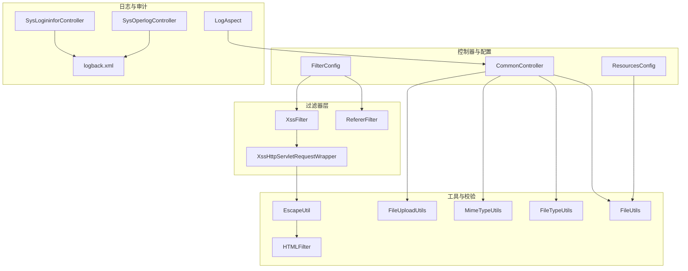
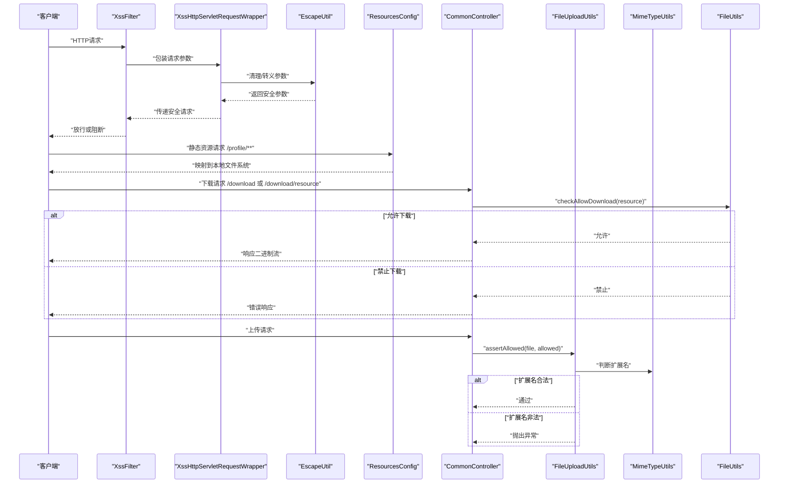
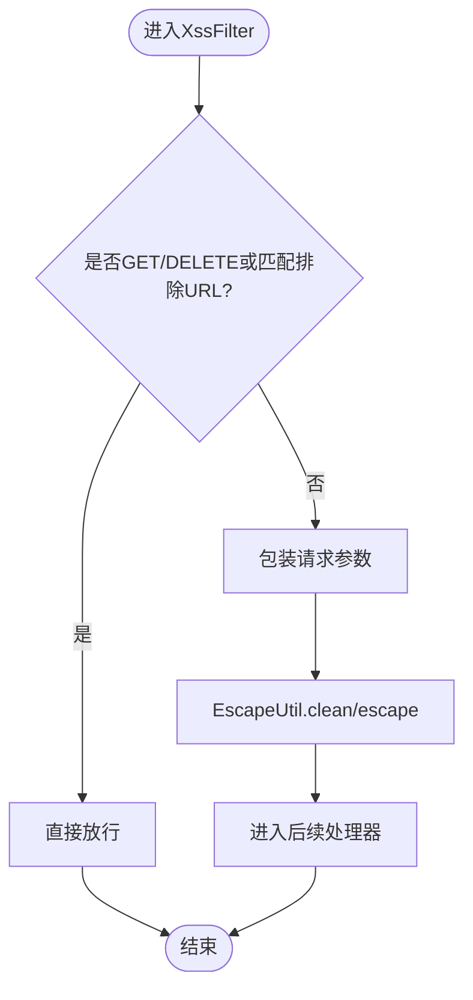
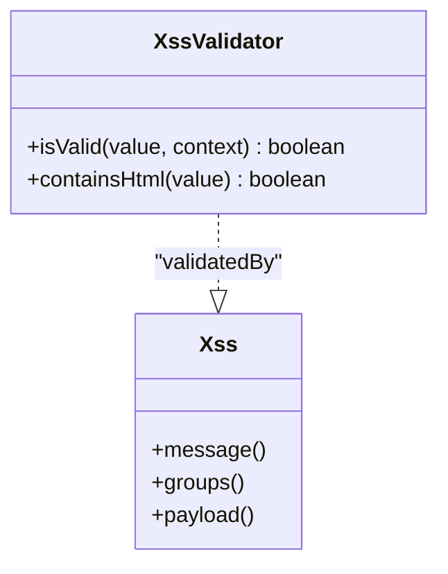
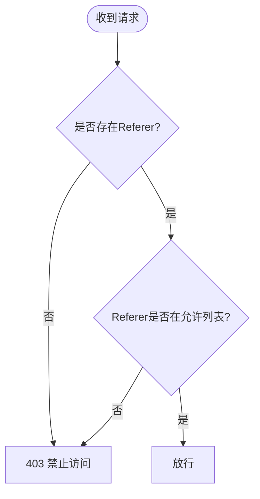
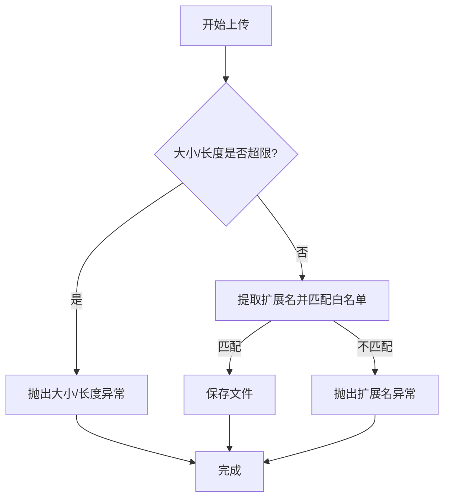
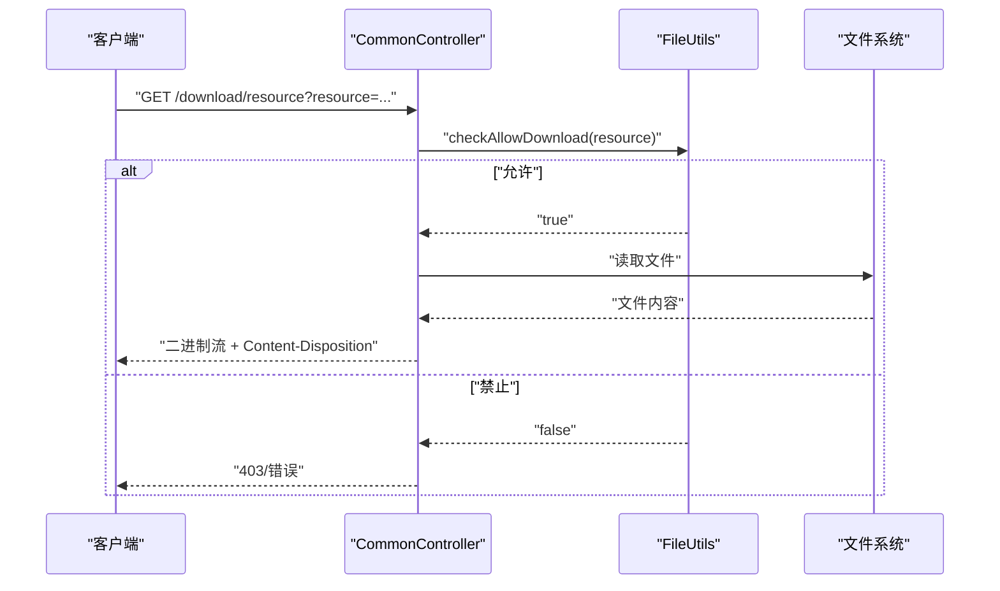
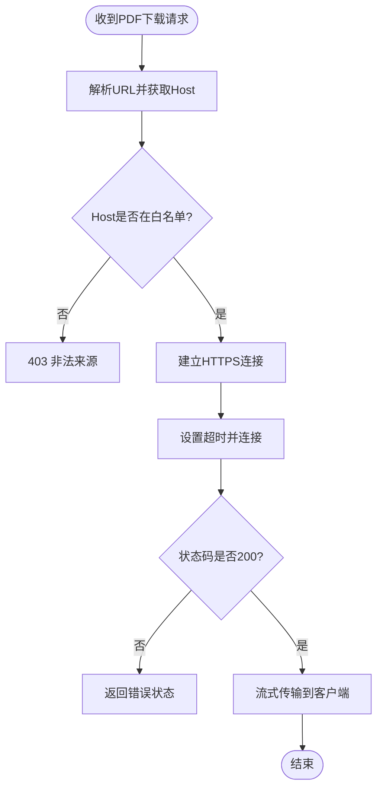
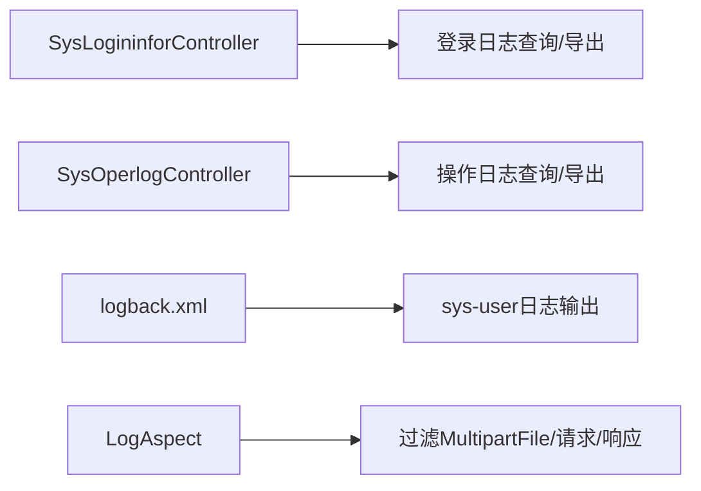
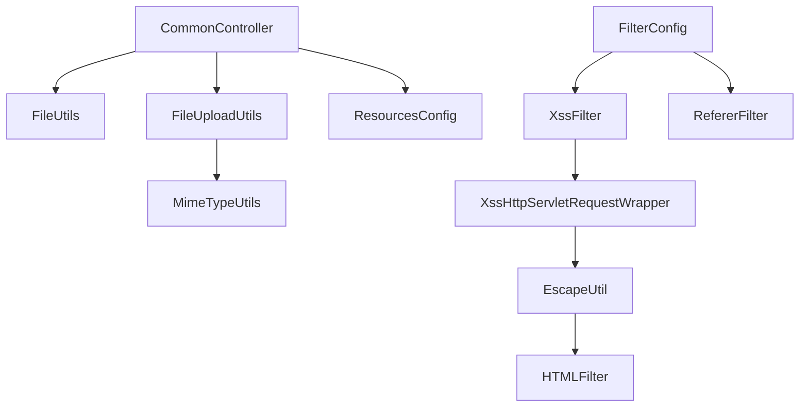

# 文件安全控制

<cite>
**本文引用的文件**
- [ruoyi-common/src/main/java/com/ruoyi/common/filter/XssFilter.java](file://ruoyi-common/src/main/java/com/ruoyi/common/filter/XssFilter.java)
- [ruoyi-common/src/main/java/com/ruoyi/common/filter/XssHttpServletRequestWrapper.java](file://ruoyi-common/src/main/java/com/ruoyi/common/filter/XssHttpServletRequestWrapper.java)
- [ruoyi-common/src/main/java/com/ruoyi/common/xss/Xss.java](file://ruoyi-common/src/main/java/com/ruoyi/common/xss/Xss.java)
- [ruoyi-common/src/main/java/com/ruoyi/common/xss/XssValidator.java](file://ruoyi-common/src/main/java/com/ruoyi/common/xss/XssValidator.java)
- [ruoyi-common/src/main/java/com/ruoyi/common/utils/html/EscapeUtil.java](file://ruoyi-common/src/main/java/com/ruoyi/common/utils/html/EscapeUtil.java)
- [ruoyi-common/src/main/java/com/ruoyi/common/utils/html/HTMLFilter.java](file://ruoyi-common/src/main/java/com/ruoyi/common/utils/html/HTMLFilter.java)
- [ruoyi-common/src/main/java/com/ruoyi/common/filter/RefererFilter.java](file://ruoyi-common/src/main/java/com/ruoyi/common/filter/RefererFilter.java)
- [ruoyi-framework/src/main/java/com/ruoyi/framework/config/FilterConfig.java](file://ruoyi-framework/src/main/java/com/ruoyi/framework/config/FilterConfig.java)
- [ruoyi-common/src/main/java/com/ruoyi/common/utils/file/FileUploadUtils.java](file://ruoyi-common/src/main/java/com/ruoyi/common/utils/file/FileUploadUtils.java)
- [ruoyi-common/src/main/java/com/ruoyi/common/utils/file/MimeTypeUtils.java](file://ruoyi-common/src/main/java/com/ruoyi/common/utils/file/MimeTypeUtils.java)
- [ruoyi-common/src/main/java/com/ruoyi/common/utils/file/FileUtils.java](file://ruoyi-common/src/main/java/com/ruoyi/common/utils/file/FileUtils.java)
- [ruoyi-common/src/main/java/com/ruoyi/common/utils/file/FileTypeUtils.java](file://ruoyi-common/src/main/java/com/ruoyi/common/utils/file/FileTypeUtils.java)
- [ruoyi-common/src/main/java/com/ruoyi/common/exception/file/InvalidExtensionException.java](file://ruoyi-common/src/main/java/com/ruoyi/common/exception/file/InvalidExtensionException.java)
- [ruoyi-common/src/main/java/com/ruoyi/common/constant/Constants.java](file://ruoyi-common/src/main/java/com/ruoyi/common/constant/Constants.java)
- [ruoyi-framework/src/main/java/com/ruoyi/framework/config/ResourcesConfig.java](file://ruoyi-framework/src/main/java/com/ruoyi/framework/config/ResourcesConfig.java)
- [ruoyi-admin/src/main/java/com/ruoyi/web/controller/common/CommonController.java](file://ruoyi-admin/src/main/java/com/ruoyi/web/controller/common/CommonController.java)
- [ruoyi-admin/src/main/resources/application.yml](file://ruoyi-admin/src/main/resources/application.yml)
- [ruoyi-admin/src/main/resources/logback.xml](file://ruoyi-admin/src/main/resources/logback.xml)
- [ruoyi-admin/src/main/java/com/ruoyi/web/controller/monitor/SysLogininforController.java](file://ruoyi-admin/src/main/java/com/ruoyi/web/controller/monitor/SysLogininforController.java)
- [ruoyi-admin/src/main/java/com/ruoyi/web/controller/monitor/SysOperlogController.java](file://ruoyi-admin/src/main/java/com/ruoyi/web/controller/monitor/SysOperlogController.java)
- [ruoyi-framework/src/main/java/com/ruoyi/framework/aspectj/LogAspect.java](file://ruoyi-framework/src/main/java/com/ruoyi/framework/aspectj/LogAspect.java)
- [ruoyi-admin/src/main/java/com/ruoyi/web/controller/h5/HzContractAppController.java](file://ruoyi-admin/src/main/java/com/ruoyi/web/controller/h5/HzContractAppController.java)
</cite>

## 更新摘要
**所做更改**
- 更新了 Referer 防盗链配置注释的详细说明，反映了配置文档的持续改进
- 新增了配置注释从 `# 允许的域名` 到 `# 允许的域名liebiao` 的改进说明
- 强化了配置文档质量管理和持续改进的重要性

## 目录
1. [简介](#简介)
2. [项目结构](#项目结构)
3. [核心组件](#核心组件)
4. [架构总览](#架构总览)
5. [详细组件分析](#详细组件分析)
6. [依赖关系分析](#依赖关系分析)
7. [性能考量](#性能考量)
8. [故障排查指南](#故障排查指南)
9. [结论](#结论)
10. [附录](#附录)

## 简介
本文件聚焦于文件安全控制的综合防护体系，覆盖文件上传与访问两大场景，系统性阐述以下安全主题：
- XSS攻击防护：输入验证、输出编码、HTML过滤
- 文件类型与扩展名校验：限制危险扩展、大小与长度限制
- 访问控制与防盗链：来源校验、请求头检查、跨域与下载控制
- 文件内容安全：类型识别与下载白名单
- 安全审计与日志：访问日志、操作日志、异常监控
- 最佳实践与常见漏洞防范

## 项目结构
围绕文件安全的关键模块分布如下：
- 过滤器层：XSS过滤器与请求包装、Referer防盗链过滤器
- 工具与校验：HTML转义与过滤、文件上传工具、媒体类型与扩展名、文件类型识别
- 控制器与配置：通用下载控制器、静态资源映射、过滤器注册
- 日志与审计：系统访问日志、操作日志、切面过滤排除

**图表来源**
- [ruoyi-common/src/main/java/com/ruoyi/common/filter/XssFilter.java:1-75](file://ruoyi-common/src/main/java/com/ruoyi/common/filter/XssFilter.java#L1-L75)
- [ruoyi-common/src/main/java/com/ruoyi/common/filter/XssHttpServletRequestWrapper.java:1-46](file://ruoyi-common/src/main/java/com/ruoyi/common/filter/XssHttpServletRequestWrapper.java#L1-L46)
- [ruoyi-common/src/main/java/com/ruoyi/common/utils/html/EscapeUtil.java:1-168](file://ruoyi-common/src/main/java/com/ruoyi/common/utils/html/EscapeUtil.java#L1-L168)
- [ruoyi-common/src/main/java/com/ruoyi/common/utils/html/HTMLFilter.java:1-224](file://ruoyi-common/src/main/java/com/ruoyi/common/utils/html/HTMLFilter.java#L1-L224)
- [ruoyi-common/src/main/java/com/ruoyi/common/utils/file/FileUploadUtils.java:1-261](file://ruoyi-common/src/main/java/com/ruoyi/common/utils/file/FileUploadUtils.java#L1-L261)
- [ruoyi-common/src/main/java/com/ruoyi/common/utils/file/MimeTypeUtils.java:1-59](file://ruoyi-common/src/main/java/com/ruoyi/common/utils/file/MimeTypeUtils.java#L1-L59)
- [ruoyi-common/src/main/java/com/ruoyi/common/utils/file/FileUtils.java:1-304](file://ruoyi-common/src/main/java/com/ruoyi/common/utils/file/FileUtils.java#L1-L304)
- [ruoyi-common/src/main/java/com/ruoyi/common/utils/file/FileTypeUtils.java:1-46](file://ruoyi-common/src/main/java/com/ruoyi/common/utils/file/FileTypeUtils.java#L1-L46)
- [ruoyi-admin/src/main/java/com/ruoyi/web/controller/common/CommonController.java:34-162](file://ruoyi-admin/src/main/java/com/ruoyi/web/controller/common/CommonController.java#L34-L162)
- [ruoyi-framework/src/main/java/com/ruoyi/framework/config/ResourcesConfig.java:1-34](file://ruoyi-framework/src/main/java/com/ruoyi/framework/config/ResourcesConfig.java#L1-L34)
- [ruoyi-framework/src/main/java/com/ruoyi/framework/config/FilterConfig.java:28-80](file://ruoyi-framework/src/main/java/com/ruoyi/framework/config/FilterConfig.java#L28-L80)
- [ruoyi-admin/src/main/resources/logback.xml:40-93](file://ruoyi-admin/src/main/resources/logback.xml#L40-L93)
- [ruoyi-admin/src/main/java/com/ruoyi/web/controller/monitor/SysLogininforController.java:1-60](file://ruoyi-admin/src/main/java/com/ruoyi/web/controller/monitor/SysLogininforController.java#L1-L60)
- [ruoyi-admin/src/main/java/com/ruoyi/web/controller/monitor/SysOperlogController.java:1-32](file://ruoyi-admin/src/main/java/com/ruoyi/web/controller/monitor/SysOperlogController.java#L1-L32)
- [ruoyi-framework/src/main/java/com/ruoyi/framework/aspectj/LogAspect.java:222-256](file://ruoyi-framework/src/main/java/com/ruoyi/framework/aspectj/LogAspect.java#L222-L256)

**章节来源**
- [ruoyi-framework/src/main/java/com/ruoyi/framework/config/FilterConfig.java:28-80](file://ruoyi-framework/src/main/java/com/ruoyi/framework/config/FilterConfig.java#L28-L80)
- [ruoyi-framework/src/main/java/com/ruoyi/framework/config/ResourcesConfig.java:29-34](file://ruoyi-framework/src/main/java/com/ruoyi/framework/config/ResourcesConfig.java#L29-L34)

## 核心组件
- XSS防护链路：XssFilter → XssHttpServletRequestWrapper → EscapeUtil.clean/escape → HTMLFilter
- 文件上传校验：FileUploadUtils.assertAllowed + MimeTypeUtils扩展白名单
- 下载与访问控制：CommonController.resourceDownload + FileUtils.checkAllowDownload
- 防盗链：RefererFilter + FilterConfig注册
- 审计与日志：SysLogininforController/SysOperlogController + logback.xml + LogAspect

**章节来源**
- [ruoyi-common/src/main/java/com/ruoyi/common/filter/XssFilter.java:22-75](file://ruoyi-common/src/main/java/com/ruoyi/common/filter/XssFilter.java#L22-L75)
- [ruoyi-common/src/main/java/com/ruoyi/common/filter/XssHttpServletRequestWrapper.java:20-46](file://ruoyi-common/src/main/java/com/ruoyi/common/filter/XssHttpServletRequestWrapper.java#L20-L46)
- [ruoyi-common/src/main/java/com/ruoyi/common/utils/html/EscapeUtil.java:10-62](file://ruoyi-common/src/main/java/com/ruoyi/common/utils/html/EscapeUtil.java#L10-L62)
- [ruoyi-common/src/main/java/com/ruoyi/common/utils/html/HTMLFilter.java:18-224](file://ruoyi-common/src/main/java/com/ruoyi/common/utils/html/HTMLFilter.java#L18-L224)
- [ruoyi-common/src/main/java/com/ruoyi/common/utils/file/FileUploadUtils.java:186-243](file://ruoyi-common/src/main/java/com/ruoyi/common/utils/file/FileUploadUtils.java#L186-L243)
- [ruoyi-common/src/main/java/com/ruoyi/common/utils/file/MimeTypeUtils.java:8-59](file://ruoyi-common/src/main/java/com/ruoyi/common/utils/file/MimeTypeUtils.java#L8-L59)
- [ruoyi-admin/src/main/java/com/ruoyi/web/controller/common/CommonController.java:137-162](file://ruoyi-admin/src/main/java/com/ruoyi/web/controller/common/CommonController.java#L137-L162)
- [ruoyi-common/src/main/java/com/ruoyi/common/filter/RefererFilter.java:20-77](file://ruoyi-common/src/main/java/com/ruoyi/common/filter/RefererFilter.java#L20-L77)
- [ruoyi-framework/src/main/java/com/ruoyi/framework/config/FilterConfig.java:52-66](file://ruoyi-framework/src/main/java/com/ruoyi/framework/config/FilterConfig.java#L52-L66)

## 架构总览
下图展示从请求进入至文件下载的完整安全链路，涵盖XSS过滤、文件上传校验、防盗链与下载白名单控制。

**图表来源**
- [ruoyi-common/src/main/java/com/ruoyi/common/filter/XssFilter.java:44-68](file://ruoyi-common/src/main/java/com/ruoyi/common/filter/XssFilter.java#L44-L68)
- [ruoyi-common/src/main/java/com/ruoyi/common/filter/XssHttpServletRequestWrapper.java:30-46](file://ruoyi-common/src/main/java/com/ruoyi/common/filter/XssHttpServletRequestWrapper.java#L30-L46)
- [ruoyi-common/src/main/java/com/ruoyi/common/utils/html/EscapeUtil.java:59-62](file://ruoyi-common/src/main/java/com/ruoyi/common/utils/html/EscapeUtil.java#L59-L62)
- [ruoyi-framework/src/main/java/com/ruoyi/framework/config/ResourcesConfig.java:30-34](file://ruoyi-framework/src/main/java/com/ruoyi/framework/config/ResourcesConfig.java#L30-L34)
- [ruoyi-admin/src/main/java/com/ruoyi/web/controller/common/CommonController.java:137-162](file://ruoyi-admin/src/main/java/com/ruoyi/web/controller/common/CommonController.java#L137-L162)
- [ruoyi-common/src/main/java/com/ruoyi/common/utils/file/FileUploadUtils.java:186-243](file://ruoyi-common/src/main/java/com/ruoyi/common/utils/file/FileUploadUtils.java#L186-L243)
- [ruoyi-common/src/main/java/com/ruoyi/common/utils/file/MimeTypeUtils.java:29-39](file://ruoyi-common/src/main/java/com/ruoyi/common/utils/file/MimeTypeUtils.java#L29-L39)
- [ruoyi-common/src/main/java/com/ruoyi/common/utils/file/FileUtils.java:153-169](file://ruoyi-common/src/main/java/com/ruoyi/common/utils/file/FileUtils.java#L153-L169)

## 详细组件分析

### XSS攻击防护
- 输入验证与排除策略
  - XssFilter在初始化时读取排除URL列表，并根据请求方法与路径决定是否绕过过滤
  - GET/DELETE请求默认不进行XSS过滤，减少误伤
- 请求参数清洗
  - XssHttpServletRequestWrapper对参数值进行清理与去空白，再交由后续处理器
- 输出编码与HTML过滤
  - EscapeUtil提供escape/unescape与clean能力，clean内部使用HTMLFilter进行严格过滤
  - HTMLFilter内置白名单标签、协议、实体等规则，平衡安全性与可用性

**图表来源**
- [ruoyi-common/src/main/java/com/ruoyi/common/filter/XssFilter.java:58-68](file://ruoyi-common/src/main/java/com/ruoyi/common/filter/XssFilter.java#L58-L68)
- [ruoyi-common/src/main/java/com/ruoyi/common/filter/XssHttpServletRequestWrapper.java:30-46](file://ruoyi-common/src/main/java/com/ruoyi/common/filter/XssHttpServletRequestWrapper.java#L30-L46)
- [ruoyi-common/src/main/java/com/ruoyi/common/utils/html/EscapeUtil.java:59-62](file://ruoyi-common/src/main/java/com/ruoyi/common/utils/html/EscapeUtil.java#L59-L62)
- [ruoyi-common/src/main/java/com/ruoyi/common/utils/html/HTMLFilter.java:198-214](file://ruoyi-common/src/main/java/com/ruoyi/common/utils/html/HTMLFilter.java#L198-L214)

**章节来源**
- [ruoyi-common/src/main/java/com/ruoyi/common/filter/XssFilter.java:22-75](file://ruoyi-common/src/main/java/com/ruoyi/common/filter/XssFilter.java#L22-L75)
- [ruoyi-common/src/main/java/com/ruoyi/common/filter/XssHttpServletRequestWrapper.java:20-46](file://ruoyi-common/src/main/java/com/ruoyi/common/filter/XssHttpServletRequestWrapper.java#L20-L46)
- [ruoyi-common/src/main/java/com/ruoyi/common/utils/html/EscapeUtil.java:10-62](file://ruoyi-common/src/main/java/com/ruoyi/common/utils/html/EscapeUtil.java#L10-L62)
- [ruoyi-common/src/main/java/com/ruoyi/common/utils/html/HTMLFilter.java:18-224](file://ruoyi-common/src/main/java/com/ruoyi/common/utils/html/HTMLFilter.java#L18-L224)

### XSS注解与校验
- 自定义Xss注解与校验器
  - Xss注解用于字段/参数级校验，XssValidator基于正则检测是否包含HTML标签
  - 当值为空时跳过校验，非空时若包含HTML则判定为不合法

**图表来源**
- [ruoyi-common/src/main/java/com/ruoyi/common/xss/Xss.java:15-27](file://ruoyi-common/src/main/java/com/ruoyi/common/xss/Xss.java#L15-L27)
- [ruoyi-common/src/main/java/com/ruoyi/common/xss/XssValidator.java:14-39](file://ruoyi-common/src/main/java/com/ruoyi/common/xss/XssValidator.java#L14-L39)

**章节来源**
- [ruoyi-common/src/main/java/com/ruoyi/common/xss/Xss.java:1-28](file://ruoyi-common/src/main/java/com/ruoyi/common/xss/Xss.java#L1-L28)
- [ruoyi-common/src/main/java/com/ruoyi/common/xss/XssValidator.java:1-39](file://ruoyi-common/src/main/java/com/ruoyi/common/xss/XssValidator.java#L1-L39)

### Referer防盗链
- 来源验证与请求头检查
  - RefererFilter在初始化时读取允许域名列表
  - 若请求未携带Referer或不在允许列表内，则返回禁止访问
- 过滤器注册
  - FilterConfig按配置启用并注册RefererFilter，作用于资源前缀路径
- **更新** 配置注释改进
  - application.yml中的配置注释已从 `# 允许的域名` 更新为 `# 允许的域名liebiao`
  - 这一改进体现了配置文档的持续优化和质量提升
  - 更清晰的注释有助于开发者理解配置项的含义和用途

**图表来源**
- [ruoyi-common/src/main/java/com/ruoyi/common/filter/RefererFilter.java:34-70](file://ruoyi-common/src/main/java/com/ruoyi/common/filter/RefererFilter.java#L34-L70)
- [ruoyi-framework/src/main/java/com/ruoyi/framework/config/FilterConfig.java:52-66](file://ruoyi-framework/src/main/java/com/ruoyi/framework/config/FilterConfig.java#L52-L66)

**章节来源**
- [ruoyi-common/src/main/java/com/ruoyi/common/filter/RefererFilter.java:20-77](file://ruoyi-common/src/main/java/com/ruoyi/common/filter/RefererFilter.java#L20-L77)
- [ruoyi-framework/src/main/java/com/ruoyi/framework/config/FilterConfig.java:31-66](file://ruoyi-framework/src/main/java/com/ruoyi/framework/config/FilterConfig.java#L31-L66)
- [ruoyi-admin/src/main/resources/application.yml:149-155](file://ruoyi-admin/src/main/resources/application.yml#L149-L155)

### 文件类型与扩展名校验
- 上传大小与长度限制
  - 默认最大大小与文件名长度限制，超限抛出对应异常
- 扩展名白名单
  - MimeTypeUtils定义图片、Flash、音视频、常用办公文档等扩展白名单
  - FileUploadUtils.assertAllowed依据白名单校验扩展名，不匹配则抛出InvalidExtensionException
- 异常细分
  - 针对不同扩展类别提供专门异常类型，便于前端友好提示

**图表来源**
- [ruoyi-common/src/main/java/com/ruoyi/common/utils/file/FileUploadUtils.java:126-139](file://ruoyi-common/src/main/java/com/ruoyi/common/utils/file/FileUploadUtils.java#L126-L139)
- [ruoyi-common/src/main/java/com/ruoyi/common/utils/file/FileUploadUtils.java:186-243](file://ruoyi-common/src/main/java/com/ruoyi/common/utils/file/FileUploadUtils.java#L186-L243)
- [ruoyi-common/src/main/java/com/ruoyi/common/utils/file/MimeTypeUtils.java:29-39](file://ruoyi-common/src/main/java/com/ruoyi/common/utils/file/MimeTypeUtils.java#L29-L39)
- [ruoyi-common/src/main/java/com/ruoyi/common/exception/file/InvalidExtensionException.java:55-80](file://ruoyi-common/src/main/java/com/ruoyi/common/exception/file/InvalidExtensionException.java#L55-L80)

**章节来源**
- [ruoyi-common/src/main/java/com/ruoyi/common/utils/file/FileUploadUtils.java:186-243](file://ruoyi-common/src/main/java/com/ruoyi/common/utils/file/FileUploadUtils.java#L186-L243)
- [ruoyi-common/src/main/java/com/ruoyi/common/utils/file/MimeTypeUtils.java:8-59](file://ruoyi-common/src/main/java/com/ruoyi/common/utils/file/MimeTypeUtils.java#L8-L59)
- [ruoyi-common/src/main/java/com/ruoyi/common/exception/file/InvalidExtensionException.java:55-80](file://ruoyi-common/src/main/java/com/ruoyi/common/exception/file/InvalidExtensionException.java#L55-L80)

### 文件内容安全检查与下载白名单
- 下载白名单控制
  - FileUtils.checkAllowDownload禁止路径穿越与非白名单扩展名
  - 仅允许DEFAULT_ALLOWED_EXTENSION中的扩展名下载
- 通用下载控制器
  - CommonController对下载请求进行白名单校验，设置合适的响应头并输出二进制流
- 资源映射与前缀
  - ResourcesConfig将/ profile 前缀映射到本地文件系统，配合白名单与防盗链共同保障

**图表来源**
- [ruoyi-admin/src/main/java/com/ruoyi/web/controller/common/CommonController.java:137-162](file://ruoyi-admin/src/main/java/com/ruoyi/web/controller/common/CommonController.java#L137-L162)
- [ruoyi-common/src/main/java/com/ruoyi/common/utils/file/FileUtils.java:153-169](file://ruoyi-common/src/main/java/com/ruoyi/common/utils/file/FileUtils.java#L153-L169)
- [ruoyi-framework/src/main/java/com/ruoyi/framework/config/ResourcesConfig.java:30-34](file://ruoyi-framework/src/main/java/com/ruoyi/framework/config/ResourcesConfig.java#L30-L34)
- [ruoyi-common/src/main/java/com/ruoyi/common/constant/Constants.java](file://ruoyi-common/src/main/java/com/ruoyi/common/constant/Constants.java#L141)

**章节来源**
- [ruoyi-admin/src/main/java/com/ruoyi/web/controller/common/CommonController.java:137-162](file://ruoyi-admin/src/main/java/com/ruoyi/web/controller/common/CommonController.java#L137-L162)
- [ruoyi-common/src/main/java/com/ruoyi/common/utils/file/FileUtils.java:153-169](file://ruoyi-common/src/main/java/com/ruoyi/common/utils/file/FileUtils.java#L153-L169)
- [ruoyi-framework/src/main/java/com/ruoyi/framework/config/ResourcesConfig.java:29-34](file://ruoyi-framework/src/main/java/com/ruoyi/framework/config/ResourcesConfig.java#L29-L34)
- [ruoyi-common/src/main/java/com/ruoyi/common/constant/Constants.java](file://ruoyi-common/src/main/java/com/ruoyi/common/constant/Constants.java#L141)

### SSRF防护示例（合同PDF代理下载）
- 场景说明
  - 在合同应用控制器中，代理下载外部PDF时，对目标主机进行域名白名单校验，防止SSRF
- 关键点
  - 仅允许特定CDN域名后缀
  - 设置合理的连接与读取超时
  - 透传Content-Length等必要头部

**图表来源**
- [ruoyi-admin/src/main/java/com/ruoyi/web/controller/h5/HzContractAppController.java:1334-1384](file://ruoyi-admin/src/main/java/com/ruoyi/web/controller/h5/HzContractAppController.java#L1334-L1384)

**章节来源**
- [ruoyi-admin/src/main/java/com/ruoyi/web/controller/h5/HzContractAppController.java:1334-1384](file://ruoyi-admin/src/main/java/com/ruoyi/web/controller/h5/HzContractAppController.java#L1334-L1384)

### 文件访问安全控制与审计
- 权限验证
  - 下载接口使用权限注解进行访问控制（如hasPermi），确保只有授权用户可下载
- 访问日志与操作日志
  - SysLogininforController与SysOperlogController提供登录与操作日志查询与导出
  - logback.xml配置系统用户操作日志输出
- 切面过滤
  - LogAspect对包含MultipartFile/请求/响应等对象的参数进行过滤，避免日志泄露

**图表来源**
- [ruoyi-admin/src/main/java/com/ruoyi/web/controller/monitor/SysLogininforController.java:38-60](file://ruoyi-admin/src/main/java/com/ruoyi/web/controller/monitor/SysLogininforController.java#L38-L60)
- [ruoyi-admin/src/main/java/com/ruoyi/web/controller/monitor/SysOperlogController.java:28-32](file://ruoyi-admin/src/main/java/com/ruoyi/web/controller/monitor/SysOperlogController.java#L28-L32)
- [ruoyi-admin/src/main/resources/logback.xml:60-93](file://ruoyi-admin/src/main/resources/logback.xml#L60-L93)
- [ruoyi-framework/src/main/java/com/ruoyi/framework/aspectj/LogAspect.java:222-256](file://ruoyi-framework/src/main/java/com/ruoyi/framework/aspectj/LogAspect.java#L222-L256)

**章节来源**
- [ruoyi-admin/src/main/java/com/ruoyi/web/controller/monitor/SysLogininforController.java:1-60](file://ruoyi-admin/src/main/java/com/ruoyi/web/controller/monitor/SysLogininforController.java#L1-L60)
- [ruoyi-admin/src/main/java/com/ruoyi/web/controller/monitor/SysOperlogController.java:1-32](file://ruoyi-admin/src/main/java/com/ruoyi/web/controller/monitor/SysOperlogController.java#L1-L32)
- [ruoyi-admin/src/main/resources/logback.xml:60-93](file://ruoyi-admin/src/main/resources/logback.xml#L60-L93)
- [ruoyi-framework/src/main/java/com/ruoyi/framework/aspectj/LogAspect.java:222-256](file://ruoyi-framework/src/main/java/com/ruoyi/framework/aspectj/LogAspect.java#L222-L256)

## 依赖关系分析
- 组件耦合
  - XSS链路高度内聚：XssFilter依赖XssHttpServletRequestWrapper，后者依赖EscapeUtil与HTMLFilter
  - 下载链路：CommonController依赖FileUtils与FileUploadUtils（上传）、MimeTypeUtils（扩展名）
  - 配置层：FilterConfig集中注册XSS与Referer过滤器，ResourcesConfig统一资源映射
- 外部依赖
  - Apache Commons IO/FilenameUtils用于文件处理
  - Spring MVC用于Web层与拦截器/过滤器集成

**图表来源**
- [ruoyi-common/src/main/java/com/ruoyi/common/filter/XssFilter.java:44-55](file://ruoyi-common/src/main/java/com/ruoyi/common/filter/XssFilter.java#L44-L55)
- [ruoyi-common/src/main/java/com/ruoyi/common/filter/XssHttpServletRequestWrapper.java:25-46](file://ruoyi-common/src/main/java/com/ruoyi/common/filter/XssHttpServletRequestWrapper.java#L25-L46)
- [ruoyi-common/src/main/java/com/ruoyi/common/utils/html/EscapeUtil.java:59-62](file://ruoyi-common/src/main/java/com/ruoyi/common/utils/html/EscapeUtil.java#L59-L62)
- [ruoyi-admin/src/main/java/com/ruoyi/web/controller/common/CommonController.java:137-162](file://ruoyi-admin/src/main/java/com/ruoyi/web/controller/common/CommonController.java#L137-L162)
- [ruoyi-common/src/main/java/com/ruoyi/common/utils/file/FileUploadUtils.java:186-243](file://ruoyi-common/src/main/java/com/ruoyi/common/utils/file/FileUploadUtils.java#L186-L243)
- [ruoyi-common/src/main/java/com/ruoyi/common/utils/file/MimeTypeUtils.java:29-39](file://ruoyi-common/src/main/java/com/ruoyi/common/utils/file/MimeTypeUtils.java#L29-L39)
- [ruoyi-framework/src/main/java/com/ruoyi/framework/config/FilterConfig.java:34-66](file://ruoyi-framework/src/main/java/com/ruoyi/framework/config/FilterConfig.java#L34-L66)
- [ruoyi-framework/src/main/java/com/ruoyi/framework/config/ResourcesConfig.java:30-34](file://ruoyi-framework/src/main/java/com/ruoyi/framework/config/ResourcesConfig.java#L30-L34)

**章节来源**
- [ruoyi-framework/src/main/java/com/ruoyi/framework/config/FilterConfig.java:34-66](file://ruoyi-framework/src/main/java/com/ruoyi/framework/config/FilterConfig.java#L34-L66)
- [ruoyi-framework/src/main/java/com/ruoyi/framework/config/ResourcesConfig.java:29-34](file://ruoyi-framework/src/main/java/com/ruoyi/framework/config/ResourcesConfig.java#L29-L34)

## 性能考量
- XSS过滤
  - 仅对POST/PUT等修改类请求与非排除URL进行过滤，降低GET/DELETE请求的处理开销
  - 参数清洗与HTML过滤为轻量级操作，建议结合缓存与合理日志级别
- 文件上传
  - 使用transferTo进行磁盘落盘，避免内存溢出；建议结合异步与队列处理大文件
  - 扩展名校验与大小限制前置，尽早失败减少IO浪费
- 下载
  - 流式输出二进制，避免一次性读入内存
  - 合理设置Content-Length与浏览器缓存策略

## 故障排查指南
- 上传失败
  - 检查扩展名是否在白名单内，确认MimeTypeUtils配置
  - 查看InvalidExtensionException具体类型定位问题
  - 确认文件大小与文件名长度限制
- 下载失败
  - 确认资源路径未包含".."等路径穿越
  - 检查扩展名是否在DEFAULT_ALLOWED_EXTENSION中
  - 核对/ profile 前缀与ResourcesConfig映射
- XSS相关
  - 检查XssFilter排除URL配置，确认GET/DELETE请求是否被正确放行
  - 核对Xss注解使用位置与参数值
- 防盗链
  - 确认RefererFilter初始化参数allowedDomains配置
  - 检查请求Referer头是否正确传递
  - **更新** 注意application.yml中的配置注释已更新为更清晰的表述
- 审计与日志
  - 检查logback.xml中sys-user日志配置
  - 确认SysLogininforController/SysOperlogController权限注解

**章节来源**
- [ruoyi-common/src/main/java/com/ruoyi/common/utils/file/FileUploadUtils.java:186-243](file://ruoyi-common/src/main/java/com/ruoyi/common/utils/file/FileUploadUtils.java#L186-L243)
- [ruoyi-common/src/main/java/com/ruoyi/common/exception/file/InvalidExtensionException.java:55-80](file://ruoyi-common/src/main/java/com/ruoyi/common/exception/file/InvalidExtensionException.java#L55-L80)
- [ruoyi-common/src/main/java/com/ruoyi/common/utils/file/FileUtils.java:153-169](file://ruoyi-common/src/main/java/com/ruoyi/common/utils/file/FileUtils.java#L153-L169)
- [ruoyi-framework/src/main/java/com/ruoyi/framework/config/FilterConfig.java:52-66](file://ruoyi-framework/src/main/java/com/ruoyi/framework/config/FilterConfig.java#L52-L66)
- [ruoyi-admin/src/main/resources/application.yml:149-155](file://ruoyi-admin/src/main/resources/application.yml#L149-L155)
- [ruoyi-admin/src/main/resources/logback.xml:60-93](file://ruoyi-admin/src/main/resources/logback.xml#L60-L93)

## 结论
本项目通过"过滤器层 + 工具层 + 控制器层 + 审计层"的多维安全设计，实现了对文件上传与访问的全面防护。XSS过滤、扩展名校验、下载白名单、Referer防盗链与日志审计共同构成闭环，既满足业务可用性，又有效降低安全风险。建议在生产环境中持续优化异常处理、引入病毒扫描与敏感信息检测，并完善自动化监控与告警。

**更新** 配置文档的质量持续改进体现在application.yml中注释的优化，从简单的"允许的域名"更新为更清晰的"允许的域名liebiao"，这反映了项目对配置文档可读性和维护性的重视。

## 附录
- 最佳实践
  - 上传：严格白名单 + 大小/长度限制 + 磁盘落盘 + 异步处理
  - 下载：白名单 + 路径穿越防护 + 合理响应头 + 会话与权限控制
  - XSS：参数清洗 + HTML过滤 + 输出编码 + 仅对必要URL启用
  - 防盗链：明确允许域名 + Referer校验 + 资源前缀映射
  - 审计：登录与操作日志 + 切面过滤敏感对象 + 日志轮转与保留策略
- 常见漏洞与防范
  - XSS：输入清洗 + 输出编码 + HTML过滤
  - 文件上传：扩展名校验 + MIME推断 + 内容探测
  - SSRF：域名白名单 + 超时控制 + 仅允许受信CDN
  - 路径穿越：禁止".." + 白名单扩展名 + 绝对路径映射
- **更新** 配置文档改进
  - 注释质量提升：从"允许的域名"到"允许的域名liebiao"的改进
  - 持续改进理念：体现了对配置文档可读性和维护性的重视
  - 开发者体验优化：更清晰的注释有助于理解和使用配置项