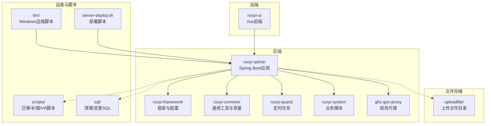
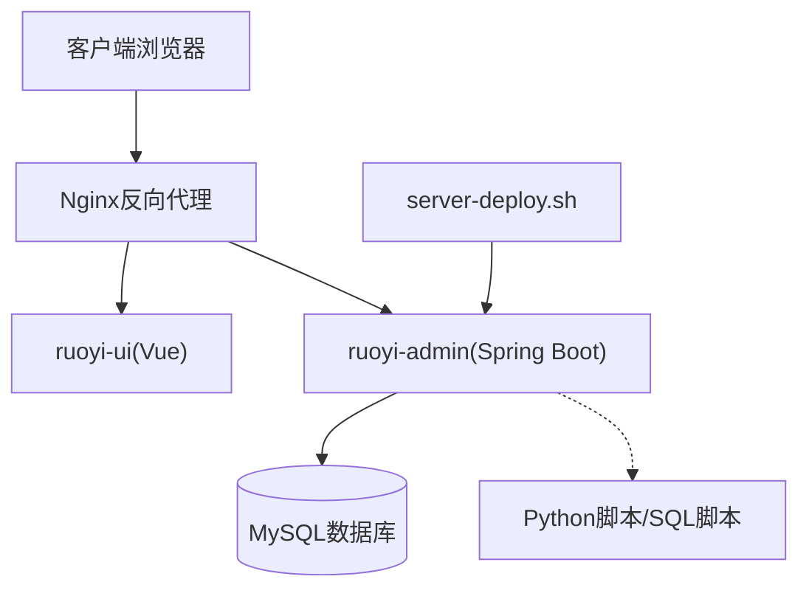
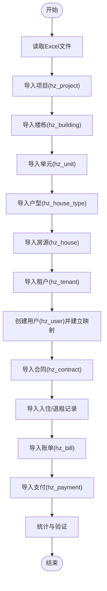
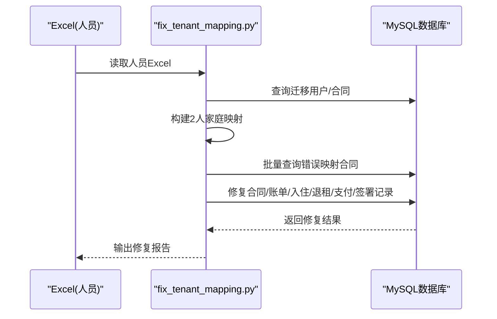
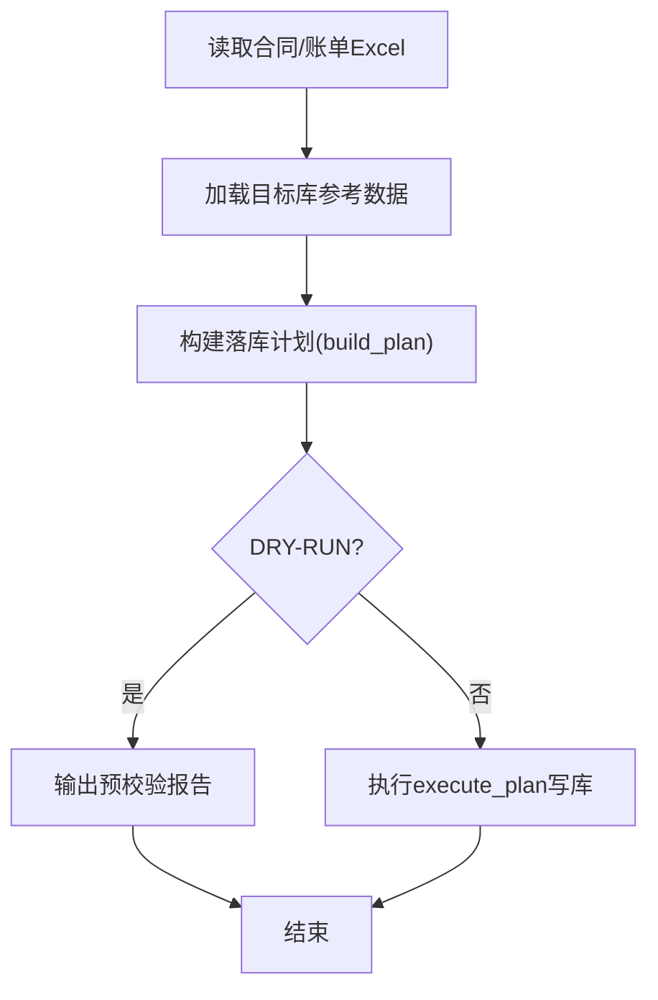
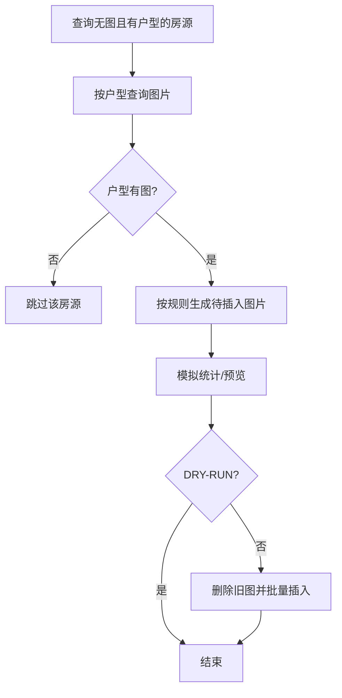
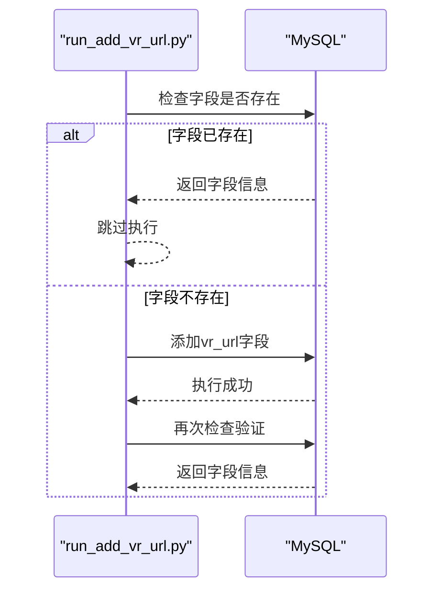
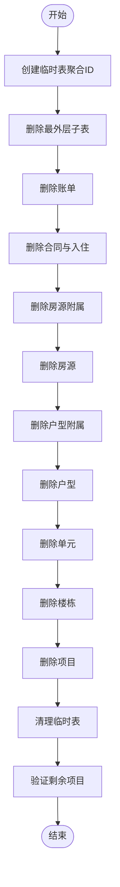
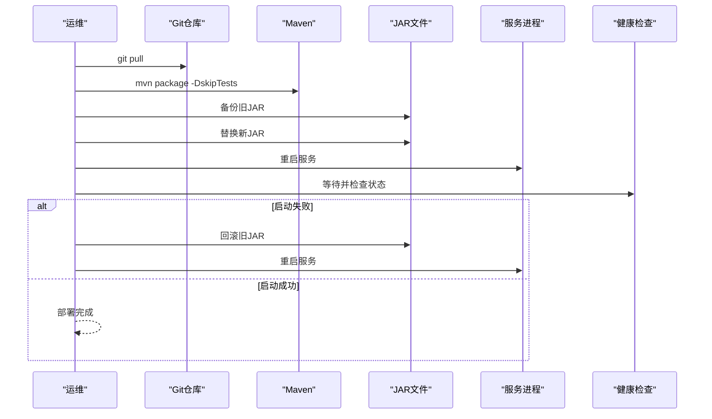
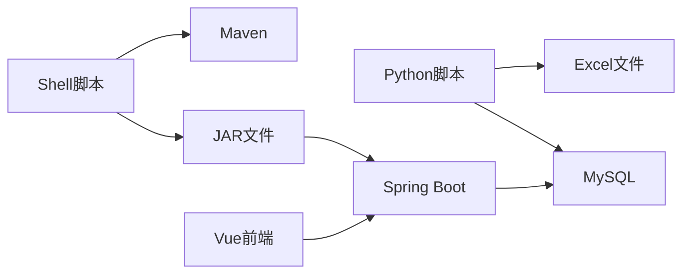

# 文件清理与维护

<cite>
**本文档引用的文件**
- [README_数据清理研究.md](file://README_数据清理研究.md)
- [数据清理执行计划.txt](file://数据清理执行计划.txt)
- [migrate_data.py](file://migrate_data.py)
- [fix_tenant_mapping.py](file://fix_tenant_mapping.py)
- [scripts/migrate_hanggang_nanyuan.py](file://scripts/migrate_hanggang_nanyuan.py)
- [scripts/backfill_house_images_from_type.py](file://scripts/backfill_house_images_from_type.py)
- [scripts/run_add_vr_url.py](file://scripts/run_add_vr_url.py)
- [server-deploy.sh](file://server-deploy.sh)
- [bin/clean.bat](file://bin/clean.bat)
- [bin/run.bat](file://bin/run.bat)
- [sql/clean_test_projects.sql](file://sql/clean_test_projects.sql)
- [sql/clean_test_user.sql](file://sql/clean_test_user.sql)
- [sql/alter_hz_house_type_add_vr_url.sql](file://sql/alter_hz_house_type_add_vr_url.sql)
</cite>

## 目录
1. [简介](#简介)
2. [项目结构](#项目结构)
3. [核心组件](#核心组件)
4. [架构总览](#架构总览)
5. [详细组件分析](#详细组件分析)
6. [依赖分析](#依赖分析)
7. [性能考虑](#性能考虑)
8. [故障排除指南](#故障排除指南)
9. [结论](#结论)
10. [附录](#附录)

## 简介
本文件面向港好住系统的文件清理与维护运维管理，围绕以下目标展开：
- 文件清理策略：临时文件清理、过期文件删除、重复文件处理、无效链接修复
- 数据迁移脚本实现：数据格式转换、文件路径更新、关联关系维护、迁移验证
- 文件存储监控机制：存储空间统计、文件数量监控、访问频率分析、性能指标跟踪
- 文件维护自动化方案：定时清理任务、批量处理脚本、数据同步机制、备份恢复策略
- 文件质量检查：文件完整性验证、损坏文件检测、格式标准化、元数据修复
- 操作指南与故障处理流程

## 项目结构
本仓库包含后端Java工程、前端Vue工程、运维脚本、SQL清理脚本与Python迁移脚本，形成“前端-后端-数据库-运维脚本”的完整体系。

图表来源
- [server-deploy.sh](file://server-deploy.sh)
- [bin/clean.bat](file://bin/clean.bat)
- [bin/run.bat](file://bin/run.bat)

章节来源
- [server-deploy.sh](file://server-deploy.sh)
- [bin/clean.bat](file://bin/clean.bat)
- [bin/run.bat](file://bin/run.bat)

## 核心组件
- 数据迁移与补数据脚本：负责从Excel导入老系统数据、修复映射错误、批量补齐图片、添加VR字段等
- 数据清理SQL脚本：提供测试项目与测试用户数据的清理方案
- 运维部署脚本：自动化部署、备份与回滚
- 前端Vue工程：用户界面与交互
- 定时任务：Quartz定时任务模块，可用于自动化维护任务调度

章节来源
- [migrate_data.py](file://migrate_data.py)
- [fix_tenant_mapping.py](file://fix_tenant_mapping.py)
- [scripts/migrate_hanggang_nanyuan.py](file://scripts/migrate_hanggang_nanyuan.py)
- [scripts/backfill_house_images_from_type.py](file://scripts/backfill_house_images_from_type.py)
- [scripts/run_add_vr_url.py](file://scripts/run_add_vr_url.py)
- [sql/clean_test_projects.sql](file://sql/clean_test_projects.sql)
- [sql/clean_test_user.sql](file://sql/clean_test_user.sql)
- [sql/alter_hz_house_type_add_vr_url.sql](file://sql/alter_hz_house_type_add_vr_url.sql)

## 架构总览
系统采用前后端分离架构，后端通过Spring Boot提供REST服务，前端Vue负责展示与交互。运维侧通过Shell脚本与Python脚本实现自动化部署、数据迁移与清理。

图表来源
- [server-deploy.sh](file://server-deploy.sh)

## 详细组件分析

### 数据迁移脚本（migrate_data.py）
该脚本负责从Excel导入老系统数据，完成项目、楼栋、单元、户型、房源、租户、合同、入住/退租、账单、支付等数据的清洗与导入，并维护ID映射关系，支持断点续传与过滤活跃数据。

图表来源
- [migrate_data.py](file://migrate_data.py)

章节来源
- [migrate_data.py](file://migrate_data.py)

### 租户映射修复脚本（fix_tenant_mapping.py）
针对2人家庭合同tenant_id映射错误的问题，通过Excel构建家庭映射，批量查询并修复合同、账单、入住/退租、支付、签署记录中的租户ID，确保主申请人与配偶的正确关联。

图表来源
- [fix_tenant_mapping.py](file://fix_tenant_mapping.py)

章节来源
- [fix_tenant_mapping.py](file://fix_tenant_mapping.py)

### 航港南苑试点迁移脚本（scripts/migrate_hanggang_nanyuan.py）
该脚本用于航港南苑试点数据导入，支持DRY-RUN预校验、合同/账单/用户映射与去重、入住/退租记录生成、账单状态映射与对账，并输出详细报告。

图表来源
- [scripts/migrate_hanggang_nanyuan.py](file://scripts/migrate_hanggang_nanyuan.py)

章节来源
- [scripts/migrate_hanggang_nanyuan.py](file://scripts/migrate_hanggang_nanyuan.py)

### 户型图片批量补齐脚本（scripts/backfill_house_images_from_type.py）
根据户型图片为无图房源批量补齐图片，严格遵循前端规则：按类型与排序生成图片记录，覆盖策略为物理删除后批量插入。

图表来源
- [scripts/backfill_house_images_from_type.py](file://scripts/backfill_house_images_from_type.py)

章节来源
- [scripts/backfill_house_images_from_type.py](file://scripts/backfill_house_images_from_type.py)

### 户型VR链接字段脚本（scripts/run_add_vr_url.py）
幂等地为户型表添加VR链接字段，并进行存在性检查与验证。

图表来源
- [scripts/run_add_vr_url.py](file://scripts/run_add_vr_url.py)

章节来源
- [scripts/run_add_vr_url.py](file://scripts/run_add_vr_url.py)

### 数据清理SQL脚本
- 测试项目清理：按外键依赖顺序删除项目及其关联表数据，支持临时表聚合与验证
- 测试用户清理：按子表→主表顺序删除用户相关数据，支持释放房源状态与最终验证

图表来源
- [sql/clean_test_projects.sql](file://sql/clean_test_projects.sql)

章节来源
- [sql/clean_test_projects.sql](file://sql/clean_test_projects.sql)
- [sql/clean_test_user.sql](file://sql/clean_test_user.sql)

### 运维部署脚本（server-deploy.sh）
自动化拉取代码、编译打包、备份旧JAR、替换新JAR、重启服务并进行健康检查，失败时自动回滚。

图表来源
- [server-deploy.sh](file://server-deploy.sh)

章节来源
- [server-deploy.sh](file://server-deploy.sh)

## 依赖分析
- Python迁移脚本依赖openpyxl/xlrd/pymysql，负责Excel读取与MySQL写入
- 运维脚本依赖Shell与Maven，负责自动化部署与回滚
- 数据清理SQL依赖数据库外键关系，按依赖顺序删除，避免约束冲突
- 前端Vue工程与后端Spring Boot通过HTTP通信，后端依赖MySQL存储

图表来源
- [migrate_data.py](file://migrate_data.py)
- [server-deploy.sh](file://server-deploy.sh)

章节来源
- [migrate_data.py](file://migrate_data.py)
- [server-deploy.sh](file://server-deploy.sh)

## 性能考虑
- 批量插入：Python脚本使用executemany与分批处理，减少网络往返与锁竞争
- 临时表聚合：SQL清理脚本使用临时表聚合ID，降低多次子查询成本
- DRY-RUN预校验：迁移脚本先生成计划与报告，避免大规模写库风险
- 事务控制：Python脚本在修复与写库时使用事务，失败回滚保障一致性
- 部署回滚：部署脚本自动备份与回滚，降低发布风险

## 故障排除指南
- 数据迁移失败
  - 检查Excel列名与数据格式，确保映射字典完整
  - 使用DRY-RUN模式先生成报告，定位致命异常
  - 分批执行，避免长时间锁表
- 数据清理失败
  - 严格按依赖顺序执行，避免外键约束
  - 备份数据库，必要时回滚
- 部署失败
  - 检查健康检查状态，若非RUNNING则自动回滚
  - 确认JAR文件替换与服务重启
- 图片补全失败
  - 确认户型图片存在，否则跳过该房源
  - DRY-RUN模式先统计再执行

章节来源
- [scripts/migrate_hanggang_nanyuan.py](file://scripts/migrate_hanggang_nanyuan.py)
- [sql/clean_test_projects.sql](file://sql/clean_test_projects.sql)
- [server-deploy.sh](file://server-deploy.sh)
- [scripts/backfill_house_images_from_type.py](file://scripts/backfill_house_images_from_type.py)

## 结论
本项目提供了完善的文件清理与维护方案：通过Python脚本实现数据迁移与修复，通过SQL脚本实现结构化清理，通过Shell脚本实现自动化部署与回滚。建议在生产环境中严格执行“备份优先、DRY-RUN预演、分步验证、回滚保障”的原则，确保数据与服务的稳定性。

## 附录
- 操作指南
  - 数据迁移：先运行DRY-RUN生成报告，确认无致命异常后再执行
  - 数据清理：先在测试库预演，确认顺序与结果，再在生产库执行
  - 部署发布：使用server-deploy.sh，失败自动回滚
- 常用命令
  - Windows：clean.bat清理工程，run.bat运行JAR
  - Linux：server-deploy.sh一键部署

章节来源
- [bin/clean.bat](file://bin/clean.bat)
- [bin/run.bat](file://bin/run.bat)
- [server-deploy.sh](file://server-deploy.sh)