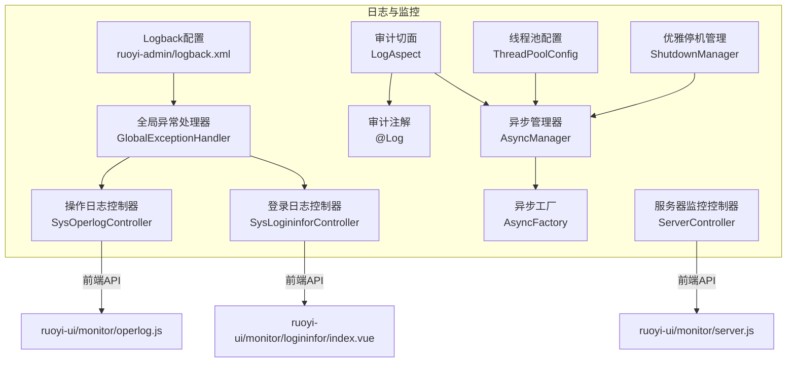
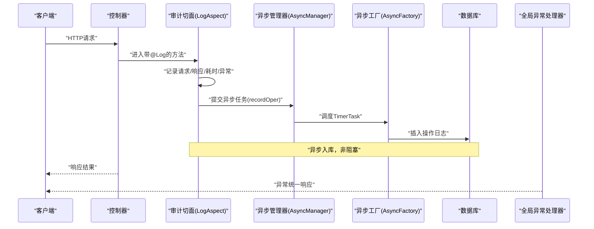
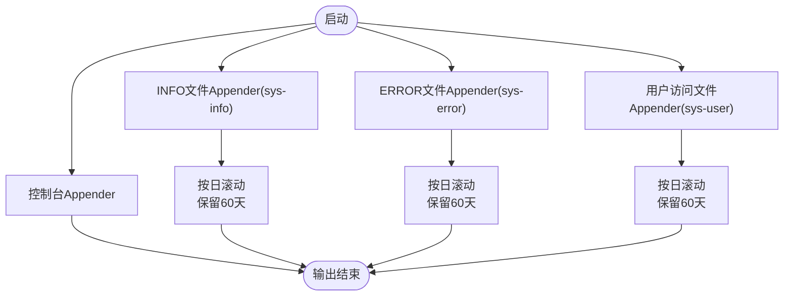
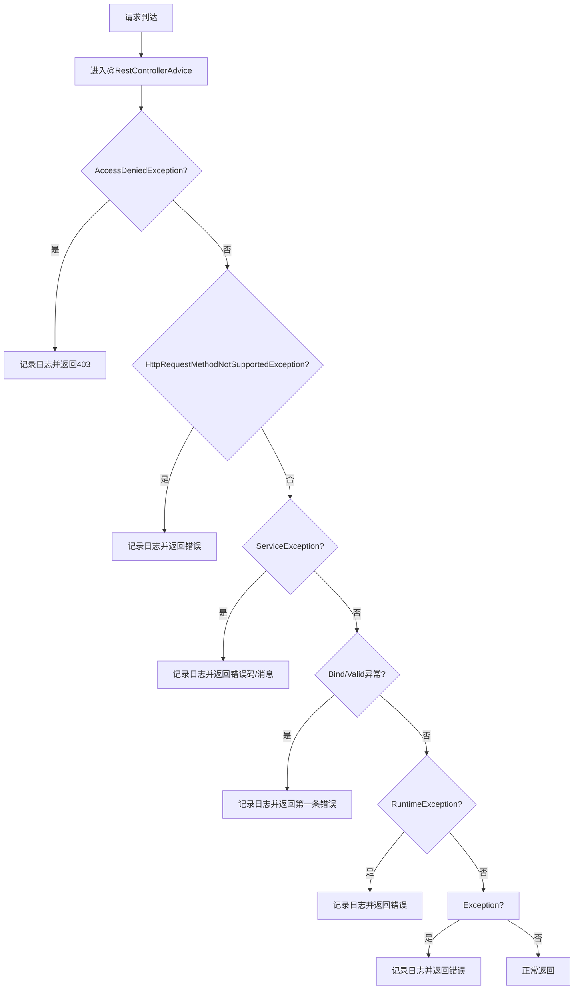
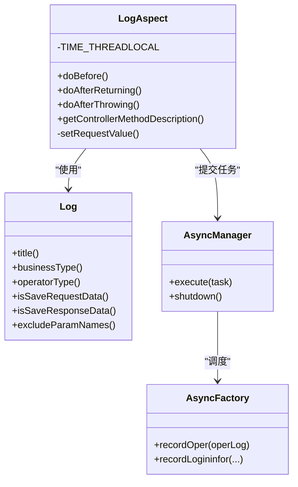
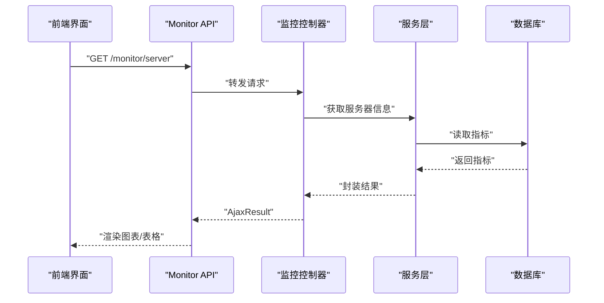
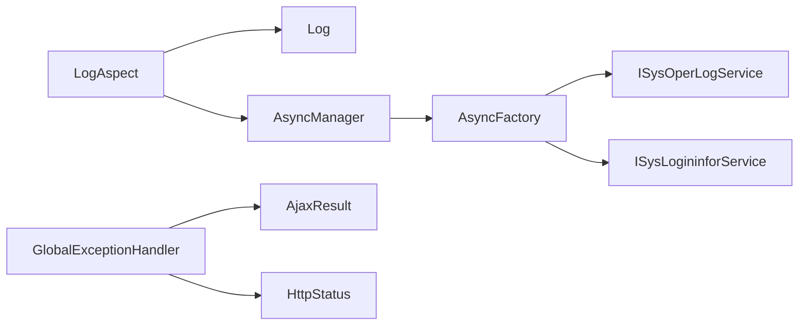

# 日志与监控

<cite>
**本文引用的文件**
- [ruoyi-admin/src/main/resources/logback.xml](file://ruoyi-admin/src/main/resources/logback.xml)
- [ruoyi-framework/src/main/java/com/ruoyi/framework/web/exception/GlobalExceptionHandler.java](file://ruoyi-framework/src/main/java/com/ruoyi/framework/web/exception/GlobalExceptionHandler.java)
- [ruoyi-common/src/main/java/com/ruoyi/common/exception/GlobalException.java](file://ruoyi-common/src/main/java/com/ruoyi/common/exception/GlobalException.java)
- [ruoyi-framework/src/main/java/com/ruoyi/framework/aspectj/LogAspect.java](file://ruoyi-framework/src/main/java/com/ruoyi/framework/aspectj/LogAspect.java)
- [ruoyi-common/src/main/java/com/ruoyi/common/annotation/Log.java](file://ruoyi-common/src/main/java/com/ruoyi/common/annotation/Log.java)
- [ruoyi-framework/src/main/java/com/ruoyi/framework/manager/AsyncManager.java](file://ruoyi-framework/src/main/java/com/ruoyi/framework/manager/AsyncManager.java)
- [ruoyi-framework/src/main/java/com/ruoyi/framework/manager/factory/AsyncFactory.java](file://ruoyi-framework/src/main/java/com/ruoyi/framework/manager/factory/AsyncFactory.java)
- [ruoyi-framework/src/main/java/com/ruoyi/framework/config/ThreadPoolConfig.java](file://ruoyi-framework/src/main/java/com/ruoyi/framework/config/ThreadPoolConfig.java)
- [ruoyi-framework/src/main/java/com/ruoyi/framework/manager/ShutdownManager.java](file://ruoyi-framework/src/main/java/com/ruoyi/framework/manager/ShutdownManager.java)
- [ruoyi-admin/src/main/java/com/ruoyi/web/controller/monitor/SysOperlogController.java](file://ruoyi-admin/src/main/java/com/ruoyi/web/controller/monitor/SysOperlogController.java)
- [ruoyi-ui/src/api/monitor/operlog.js](file://ruoyi-ui/src/api/monitor/operlog.js)
- [ruoyi-ui/src/views/monitor/operlog/index.vue](file://ruoyi-ui/src/views/monitor/operlog/index.vue)
- [ruoyi-admin/src/main/java/com/ruoyi/web/controller/monitor/SysLogininforController.java](file://ruoyi-admin/src/main/java/com/ruoyi/web/controller/monitor/SysLogininforController.java)
- [ruoyi-ui/src/views/monitor/logininfor/index.vue](file://ruoyi-ui/src/views/monitor/logininfor/index.vue)
- [ruoyi-admin/src/main/java/com/ruoyi/web/controller/monitor/ServerController.java](file://ruoyi-admin/src/main/java/com/ruoyi/web/controller/monitor/ServerController.java)
- [ruoyi-ui/src/api/monitor/server.js](file://ruoyi-ui/src/api/monitor/server.js)
- [ruoyi-common/src/main/java/com/ruoyi/common/utils/Threads.java](file://ruoyi-common/src/main/java/com/ruoyi/common/utils/Threads.java)
</cite>

## 目录
1. [简介](#简介)
2. [项目结构](#项目结构)
3. [核心组件](#核心组件)
4. [架构总览](#架构总览)
5. [详细组件分析](#详细组件分析)
6. [依赖分析](#依赖分析)
7. [性能考量](#性能考量)
8. [故障排查指南](#故障排查指南)
9. [结论](#结论)
10. [附录](#附录)

## 简介
本文件面向港好住信息系统，系统性梳理日志与监控体系，覆盖以下主题：
- Logback日志框架配置与使用：日志级别、输出格式、文件滚动策略、异步日志与性能优化
- 全局异常处理机制：异常分类、错误码、统一响应格式、日志记录策略
- 审计功能：操作日志、登录日志、业务日志分析
- 监控指标设计与采集：性能指标、业务指标、健康检查
- 告警与可视化：监控仪表板、日志分析工具、运维实践
- 日志查询与故障诊断：日志定位、性能分析、排障流程

## 项目结构
围绕日志与监控的关键模块分布如下：
- 日志配置：ruoyi-admin/src/main/resources/logback.xml
- 全局异常处理：ruoyi-framework/web/exception/GlobalExceptionHandler.java
- 注解式审计：ruoyi-framework/aspectj/LogAspect.java + ruoyi-common/annotation/Log.java
- 异步日志与任务：ruoyi-framework/manager/* 与 ruoyi-framework/manager/factory/AsyncFactory.java
- 监控接口与前端：ruoyi-admin/monitor/* 与 ruoyi-ui/views/monitor/*

图表来源
- [ruoyi-admin/src/main/resources/logback.xml:1-93](file://ruoyi-admin/src/main/resources/logback.xml#L1-L93)
- [ruoyi-framework/src/main/java/com/ruoyi/framework/web/exception/GlobalExceptionHandler.java:1-146](file://ruoyi-framework/src/main/java/com/ruoyi/framework/web/exception/GlobalExceptionHandler.java#L1-L146)
- [ruoyi-framework/src/main/java/com/ruoyi/framework/aspectj/LogAspect.java:1-257](file://ruoyi-framework/src/main/java/com/ruoyi/framework/aspectj/LogAspect.java#L1-L257)
- [ruoyi-common/src/main/java/com/ruoyi/common/annotation/Log.java:1-52](file://ruoyi-common/src/main/java/com/ruoyi/common/annotation/Log.java#L1-L52)
- [ruoyi-framework/src/main/java/com/ruoyi/framework/manager/AsyncManager.java:1-56](file://ruoyi-framework/src/main/java/com/ruoyi/framework/manager/AsyncManager.java#L1-L56)
- [ruoyi-framework/src/main/java/com/ruoyi/framework/manager/factory/AsyncFactory.java:1-103](file://ruoyi-framework/src/main/java/com/ruoyi/framework/manager/factory/AsyncFactory.java#L1-L103)
- [ruoyi-framework/src/main/java/com/ruoyi/framework/config/ThreadPoolConfig.java:1-43](file://ruoyi-framework/src/main/java/com/ruoyi/framework/config/ThreadPoolConfig.java#L1-L43)
- [ruoyi-framework/src/main/java/com/ruoyi/framework/manager/ShutdownManager.java:1-39](file://ruoyi-framework/src/main/java/com/ruoyi/framework/manager/ShutdownManager.java#L1-L39)
- [ruoyi-admin/src/main/java/com/ruoyi/web/controller/monitor/SysOperlogController.java:1-74](file://ruoyi-admin/src/main/java/com/ruoyi/web/controller/monitor/SysOperlogController.java#L1-L74)
- [ruoyi-admin/src/main/java/com/ruoyi/web/controller/monitor/SysLogininforController.java:1-87](file://ruoyi-admin/src/main/java/com/ruoyi/web/controller/monitor/SysLogininforController.java#L1-L87)
- [ruoyi-admin/src/main/java/com/ruoyi/web/controller/monitor/ServerController.java:1-27](file://ruoyi-admin/src/main/java/com/ruoyi/web/controller/monitor/ServerController.java#L1-L27)
- [ruoyi-ui/src/api/monitor/operlog.js:1-26](file://ruoyi-ui/src/api/monitor/operlog.js#L1-L26)
- [ruoyi-ui/src/views/monitor/operlog/index.vue:188-322](file://ruoyi-ui/src/views/monitor/operlog/index.vue#L188-L322)
- [ruoyi-ui/src/views/monitor/logininfor/index.vue:122-193](file://ruoyi-ui/src/views/monitor/logininfor/index.vue#L122-L193)
- [ruoyi-ui/src/api/monitor/server.js:1-9](file://ruoyi-ui/src/api/monitor/server.js#L1-L9)

章节来源
- [ruoyi-admin/src/main/resources/logback.xml:1-93](file://ruoyi-admin/src/main/resources/logback.xml#L1-L93)
- [ruoyi-framework/src/main/java/com/ruoyi/framework/web/exception/GlobalExceptionHandler.java:1-146](file://ruoyi-framework/src/main/java/com/ruoyi/framework/web/exception/GlobalExceptionHandler.java#L1-L146)
- [ruoyi-framework/src/main/java/com/ruoyi/framework/aspectj/LogAspect.java:1-257](file://ruoyi-framework/src/main/java/com/ruoyi/framework/aspectj/LogAspect.java#L1-L257)
- [ruoyi-common/src/main/java/com/ruoyi/common/annotation/Log.java:1-52](file://ruoyi-common/src/main/java/com/ruoyi/common/annotation/Log.java#L1-L52)
- [ruoyi-framework/src/main/java/com/ruoyi/framework/manager/AsyncManager.java:1-56](file://ruoyi-framework/src/main/java/com/ruoyi/framework/manager/AsyncManager.java#L1-L56)
- [ruoyi-framework/src/main/java/com/ruoyi/framework/manager/factory/AsyncFactory.java:1-103](file://ruoyi-framework/src/main/java/com/ruoyi/framework/manager/factory/AsyncFactory.java#L1-L103)
- [ruoyi-framework/src/main/java/com/ruoyi/framework/config/ThreadPoolConfig.java:1-43](file://ruoyi-framework/src/main/java/com/ruoyi/framework/config/ThreadPoolConfig.java#L1-L43)
- [ruoyi-framework/src/main/java/com/ruoyi/framework/manager/ShutdownManager.java:1-39](file://ruoyi-framework/src/main/java/com/ruoyi/framework/manager/ShutdownManager.java#L1-L39)
- [ruoyi-admin/src/main/java/com/ruoyi/web/controller/monitor/SysOperlogController.java:1-74](file://ruoyi-admin/src/main/java/com/ruoyi/web/controller/monitor/SysOperlogController.java#L1-L74)
- [ruoyi-admin/src/main/java/com/ruoyi/web/controller/monitor/SysLogininforController.java:1-87](file://ruoyi-admin/src/main/java/com/ruoyi/web/controller/monitor/SysLogininforController.java#L1-L87)
- [ruoyi-admin/src/main/java/com/ruoyi/web/controller/monitor/ServerController.java:1-27](file://ruoyi-admin/src/main/java/com/ruoyi/web/controller/monitor/ServerController.java#L1-L27)
- [ruoyi-ui/src/api/monitor/operlog.js:1-26](file://ruoyi-ui/src/api/monitor/operlog.js#L1-L26)
- [ruoyi-ui/src/views/monitor/operlog/index.vue:188-322](file://ruoyi-ui/src/views/monitor/operlog/index.vue#L188-L322)
- [ruoyi-ui/src/views/monitor/logininfor/index.vue:122-193](file://ruoyi-ui/src/views/monitor/logininfor/index.vue#L122-L193)
- [ruoyi-ui/src/api/monitor/server.js:1-9](file://ruoyi-ui/src/api/monitor/server.js#L1-L9)

## 核心组件
- 日志配置与输出
  - 控制台输出与文件输出分离，INFO/ERROR 分离落盘，按日滚动，保留60天
  - 用户访问日志独立文件，便于审计与合规
- 全局异常处理
  - RestControllerAdvice 统一捕获各类异常，记录日志并返回标准化响应
  - 支持业务异常、参数校验异常、权限不足、请求方式不支持等
- 审计与异步
  - 基于注解的切面记录操作日志，异步入库，降低同步开销
  - 登录日志通过异步工厂写入sys-user日志通道与数据库
- 监控与可视化
  - 提供服务器监控接口，前端展示系统资源信息
  - 操作日志与登录日志提供查询、导出、清理能力

章节来源
- [ruoyi-admin/src/main/resources/logback.xml:15-93](file://ruoyi-admin/src/main/resources/logback.xml#L15-L93)
- [ruoyi-framework/src/main/java/com/ruoyi/framework/web/exception/GlobalExceptionHandler.java:35-144](file://ruoyi-framework/src/main/java/com/ruoyi/framework/web/exception/GlobalExceptionHandler.java#L35-L144)
- [ruoyi-framework/src/main/java/com/ruoyi/framework/aspectj/LogAspect.java:85-137](file://ruoyi-framework/src/main/java/com/ruoyi/framework/aspectj/LogAspect.java#L85-L137)
- [ruoyi-framework/src/main/java/com/ruoyi/framework/manager/factory/AsyncFactory.java:37-101](file://ruoyi-framework/src/main/java/com/ruoyi/framework/manager/factory/AsyncFactory.java#L37-L101)
- [ruoyi-admin/src/main/java/com/ruoyi/web/controller/monitor/ServerController.java:19-26](file://ruoyi-admin/src/main/java/com/ruoyi/web/controller/monitor/ServerController.java#L19-L26)

## 架构总览
下图展示日志与监控在系统中的交互关系：请求经由控制器到达切面，切面异步记录操作日志；异常由全局处理器统一拦截并记录；登录行为由异步工厂写入用户日志通道；监控接口提供服务器信息。

图表来源
- [ruoyi-framework/src/main/java/com/ruoyi/framework/aspectj/LogAspect.java:85-137](file://ruoyi-framework/src/main/java/com/ruoyi/framework/aspectj/LogAspect.java#L85-L137)
- [ruoyi-framework/src/main/java/com/ruoyi/framework/manager/AsyncManager.java:43-46](file://ruoyi-framework/src/main/java/com/ruoyi/framework/manager/AsyncManager.java#L43-L46)
- [ruoyi-framework/src/main/java/com/ruoyi/framework/manager/factory/AsyncFactory.java:89-101](file://ruoyi-framework/src/main/java/com/ruoyi/framework/manager/factory/AsyncFactory.java#L89-L101)
- [ruoyi-framework/src/main/java/com/ruoyi/framework/web/exception/GlobalExceptionHandler.java:96-113](file://ruoyi-framework/src/main/java/com/ruoyi/framework/web/exception/GlobalExceptionHandler.java#L96-L113)

## 详细组件分析

### 日志配置与输出（Logback）
- 输出目标
  - 控制台：用于开发调试
  - 文件：sys-info.log（INFO及以上）、sys-error.log（ERROR及以上）、sys-user.log（用户访问）
- 滚动策略
  - 基于时间的滚动，按日切割，保留60天
- 日志格式
  - 时间、线程、级别、Logger、方法行号、消息
- 日志级别
  - com.ruoyi 包：info
  - org.springframework：warn
  - root：info（仅控制台）

图表来源
- [ruoyi-admin/src/main/resources/logback.xml:8-93](file://ruoyi-admin/src/main/resources/logback.xml#L8-L93)

章节来源
- [ruoyi-admin/src/main/resources/logback.xml:1-93](file://ruoyi-admin/src/main/resources/logback.xml#L1-L93)

### 全局异常处理机制
- 异常分类与处理
  - 权限不足、请求方式不支持、业务异常、参数类型不匹配、绑定异常、运行时异常、未知异常
  - 统一记录日志并返回AjaxResult，业务异常可携带自定义错误码
- 错误码与响应
  - 使用HttpStatus与AjaxResult，确保前后端一致的错误格式
- 全局异常类
  - GlobalException 提供message与detailMessage，便于统一管理

图表来源
- [ruoyi-framework/src/main/java/com/ruoyi/framework/web/exception/GlobalExceptionHandler.java:35-144](file://ruoyi-framework/src/main/java/com/ruoyi/framework/web/exception/GlobalExceptionHandler.java#L35-L144)
- [ruoyi-common/src/main/java/com/ruoyi/common/exception/GlobalException.java:1-58](file://ruoyi-common/src/main/java/com/ruoyi/common/exception/GlobalException.java#L1-L58)

章节来源
- [ruoyi-framework/src/main/java/com/ruoyi/framework/web/exception/GlobalExceptionHandler.java:1-146](file://ruoyi-framework/src/main/java/com/ruoyi/framework/web/exception/GlobalExceptionHandler.java#L1-L146)
- [ruoyi-common/src/main/java/com/ruoyi/common/exception/GlobalException.java:1-58](file://ruoyi-common/src/main/java/com/ruoyi/common/exception/GlobalException.java#L1-L58)

### 审计与异步日志
- 审计注解
  - @Log：模块、功能、操作人类别、是否保存请求/响应、排除参数名
- 审计切面
  - Before/AfterReturning/AfterThrowing三段式记录
  - 记录IP、URL、方法、请求方式、耗时、异常信息、请求/响应参数（脱敏）
  - 通过AsyncManager异步提交任务
- 异步工厂
  - 登录日志：写入sys-user通道并入库
  - 操作日志：远程解析操作地点并入库
- 优雅停机
  - ShutdownManager在销毁前关闭异步线程池，保证日志落盘

图表来源
- [ruoyi-common/src/main/java/com/ruoyi/common/annotation/Log.java:20-51](file://ruoyi-common/src/main/java/com/ruoyi/common/annotation/Log.java#L20-L51)
- [ruoyi-framework/src/main/java/com/ruoyi/framework/aspectj/LogAspect.java:56-137](file://ruoyi-framework/src/main/java/com/ruoyi/framework/aspectj/LogAspect.java#L56-L137)
- [ruoyi-framework/src/main/java/com/ruoyi/framework/manager/AsyncManager.java:43-54](file://ruoyi-framework/src/main/java/com/ruoyi/framework/manager/AsyncManager.java#L43-L54)
- [ruoyi-framework/src/main/java/com/ruoyi/framework/manager/factory/AsyncFactory.java:89-101](file://ruoyi-framework/src/main/java/com/ruoyi/framework/manager/factory/AsyncFactory.java#L89-L101)

章节来源
- [ruoyi-common/src/main/java/com/ruoyi/common/annotation/Log.java:1-52](file://ruoyi-common/src/main/java/com/ruoyi/common/annotation/Log.java#L1-L52)
- [ruoyi-framework/src/main/java/com/ruoyi/framework/aspectj/LogAspect.java:1-257](file://ruoyi-framework/src/main/java/com/ruoyi/framework/aspectj/LogAspect.java#L1-L257)
- [ruoyi-framework/src/main/java/com/ruoyi/framework/manager/factory/AsyncFactory.java:1-103](file://ruoyi-framework/src/main/java/com/ruoyi/framework/manager/factory/AsyncFactory.java#L1-L103)
- [ruoyi-framework/src/main/java/com/ruoyi/framework/manager/ShutdownManager.java:16-38](file://ruoyi-framework/src/main/java/com/ruoyi/framework/manager/ShutdownManager.java#L16-L38)

### 监控与可视化
- 服务器监控
  - ServerController 提供系统资源信息，前端通过API获取
- 操作日志
  - SysOperlogController 提供列表、导出、删除、清空
  - 前端index.vue支持筛选、排序、导出、清空
- 登录日志
  - SysLogininforController 提供列表、导出、删除、清空、账户解锁
  - 前端index.vue支持筛选、排序、删除、清空

图表来源
- [ruoyi-admin/src/main/java/com/ruoyi/web/controller/monitor/ServerController.java:19-26](file://ruoyi-admin/src/main/java/com/ruoyi/web/controller/monitor/ServerController.java#L19-L26)
- [ruoyi-ui/src/api/monitor/server.js:1-9](file://ruoyi-ui/src/api/monitor/server.js#L1-L9)

章节来源
- [ruoyi-admin/src/main/java/com/ruoyi/web/controller/monitor/SysOperlogController.java:1-74](file://ruoyi-admin/src/main/java/com/ruoyi/web/controller/monitor/SysOperlogController.java#L1-L74)
- [ruoyi-ui/src/api/monitor/operlog.js:1-26](file://ruoyi-ui/src/api/monitor/operlog.js#L1-L26)
- [ruoyi-ui/src/views/monitor/operlog/index.vue:254-320](file://ruoyi-ui/src/views/monitor/operlog/index.vue#L254-L320)
- [ruoyi-admin/src/main/java/com/ruoyi/web/controller/monitor/SysLogininforController.java:1-87](file://ruoyi-admin/src/main/java/com/ruoyi/web/controller/monitor/SysLogininforController.java#L1-L87)
- [ruoyi-ui/src/views/monitor/logininfor/index.vue:174-193](file://ruoyi-ui/src/views/monitor/logininfor/index.vue#L174-L193)
- [ruoyi-admin/src/main/java/com/ruoyi/web/controller/monitor/ServerController.java:1-27](file://ruoyi-admin/src/main/java/com/ruoyi/web/controller/monitor/ServerController.java#L1-L27)
- [ruoyi-ui/src/api/monitor/server.js:1-9](file://ruoyi-ui/src/api/monitor/server.js#L1-L9)

## 依赖分析
- 组件耦合
  - LogAspect 依赖 @Log 注解、SecurityUtils、AsyncManager、AsyncFactory
  - AsyncManager 依赖 ScheduledExecutorService 与 SpringUtils
  - AsyncFactory 依赖 ISysOperLogService/ISysLogininforService
  - GlobalExceptionHandler 依赖 AjaxResult、HttpStatus、异常类型
- 外部依赖
  - Logback（日志输出）
  - Spring MVC（异常处理、AOP）
  - MyBatis/Plus（数据库访问）

图表来源
- [ruoyi-framework/src/main/java/com/ruoyi/framework/aspectj/LogAspect.java:19-34](file://ruoyi-framework/src/main/java/com/ruoyi/framework/aspectj/LogAspect.java#L19-L34)
- [ruoyi-framework/src/main/java/com/ruoyi/framework/manager/AsyncManager.java:24-24](file://ruoyi-framework/src/main/java/com/ruoyi/framework/manager/AsyncManager.java#L24-L24)
- [ruoyi-framework/src/main/java/com/ruoyi/framework/manager/factory/AsyncFactory.java:13-16](file://ruoyi-framework/src/main/java/com/ruoyi/framework/manager/factory/AsyncFactory.java#L13-L16)
- [ruoyi-framework/src/main/java/com/ruoyi/framework/web/exception/GlobalExceptionHandler.java:14-20](file://ruoyi-framework/src/main/java/com/ruoyi/framework/web/exception/GlobalExceptionHandler.java#L14-L20)

章节来源
- [ruoyi-framework/src/main/java/com/ruoyi/framework/aspectj/LogAspect.java:1-257](file://ruoyi-framework/src/main/java/com/ruoyi/framework/aspectj/LogAspect.java#L1-L257)
- [ruoyi-framework/src/main/java/com/ruoyi/framework/manager/AsyncManager.java:1-56](file://ruoyi-framework/src/main/java/com/ruoyi/framework/manager/AsyncManager.java#L1-L56)
- [ruoyi-framework/src/main/java/com/ruoyi/framework/manager/factory/AsyncFactory.java:1-103](file://ruoyi-framework/src/main/java/com/ruoyi/framework/manager/factory/AsyncFactory.java#L1-L103)
- [ruoyi-framework/src/main/java/com/ruoyi/framework/web/exception/GlobalExceptionHandler.java:1-146](file://ruoyi-framework/src/main/java/com/ruoyi/framework/web/exception/GlobalExceptionHandler.java#L1-L146)

## 性能考量
- 异步日志与审计
  - 操作日志与登录日志通过 AsyncManager 异步入库，减少请求链路阻塞
  - 采用 ScheduledExecutorService 延迟10ms提交任务，平衡吞吐与实时性
- 线程池配置
  - ThreadPoolTaskExecutor 核心池、最大池、队列容量、拒绝策略均显式配置，保障高并发下的稳定性
- 优雅停机
  - ShutdownManager 在应用销毁前关闭异步线程池，避免日志丢失
- 日志滚动与保留
  - 按日滚动与60天保留策略，兼顾磁盘占用与历史追溯

章节来源
- [ruoyi-framework/src/main/java/com/ruoyi/framework/manager/AsyncManager.java:16-46](file://ruoyi-framework/src/main/java/com/ruoyi/framework/manager/AsyncManager.java#L16-L46)
- [ruoyi-framework/src/main/java/com/ruoyi/framework/config/ThreadPoolConfig.java:20-42](file://ruoyi-framework/src/main/java/com/ruoyi/framework/config/ThreadPoolConfig.java#L20-L42)
- [ruoyi-framework/src/main/java/com/ruoyi/framework/manager/ShutdownManager.java:16-38](file://ruoyi-framework/src/main/java/com/ruoyi/framework/manager/ShutdownManager.java#L16-L38)
- [ruoyi-admin/src/main/resources/logback.xml:19-23](file://ruoyi-admin/src/main/resources/logback.xml#L19-L23)

## 故障排查指南
- 常见问题定位
  - 异常统一响应：查看全局异常处理器返回的错误码与消息
  - 操作日志：通过 SysOperlogController 查询失败记录与异常信息
  - 登录日志：通过 SysLogininforController 查询登录失败与锁定状态
- 日志查询
  - INFO/ERROR：sys-info.log、sys-error.log
  - 用户访问：sys-user.log
  - 审计详情：数据库 sys_oper_log
- 性能分析
  - 观察操作耗时字段，定位慢接口
  - 检查线程池饱和与拒绝情况
- 优雅停机
  - 确认 ShutdownManager 是否在销毁阶段关闭异步线程池

章节来源
- [ruoyi-framework/src/main/java/com/ruoyi/framework/web/exception/GlobalExceptionHandler.java:96-113](file://ruoyi-framework/src/main/java/com/ruoyi/framework/web/exception/GlobalExceptionHandler.java#L96-L113)
- [ruoyi-admin/src/main/java/com/ruoyi/web/controller/monitor/SysOperlogController.java:36-73](file://ruoyi-admin/src/main/java/com/ruoyi/web/controller/monitor/SysOperlogController.java#L36-L73)
- [ruoyi-admin/src/main/java/com/ruoyi/web/controller/monitor/SysLogininforController.java:39-87](file://ruoyi-admin/src/main/java/com/ruoyi/web/controller/monitor/SysLogininforController.java#L39-L87)
- [ruoyi-framework/src/main/java/com/ruoyi/framework/manager/ShutdownManager.java:16-38](file://ruoyi-framework/src/main/java/com/ruoyi/framework/manager/ShutdownManager.java#L16-L38)

## 结论
港好住信息系统通过 Logback、AOP审计、全局异常处理与异步日志相结合，构建了完善的日志与监控体系。该体系在保证性能的同时，提供了全面的审计能力与可观测性，满足生产环境的运维与合规需求。建议持续完善监控仪表板与告警策略，并结合日志分析工具进行深度洞察。

## 附录
- 前端监控页面
  - 操作日志：/src/views/monitor/operlog/index.vue
  - 登录日志：/src/views/monitor/logininfor/index.vue
- API接口
  - 操作日志：/src/api/monitor/operlog.js
  - 服务器监控：/src/api/monitor/server.js