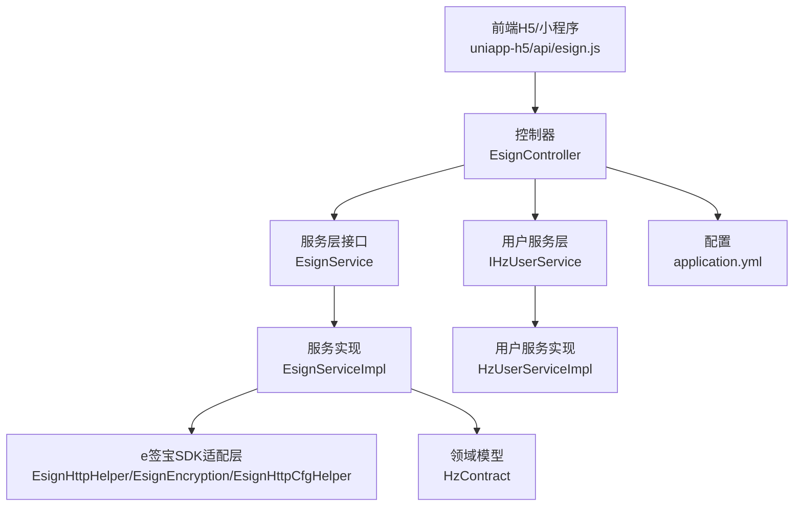
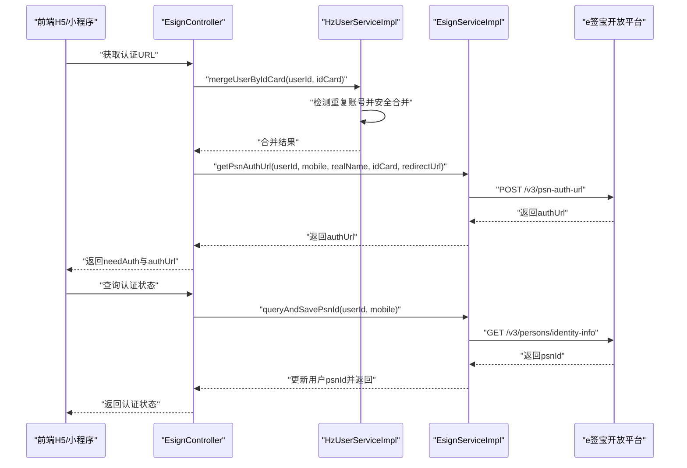
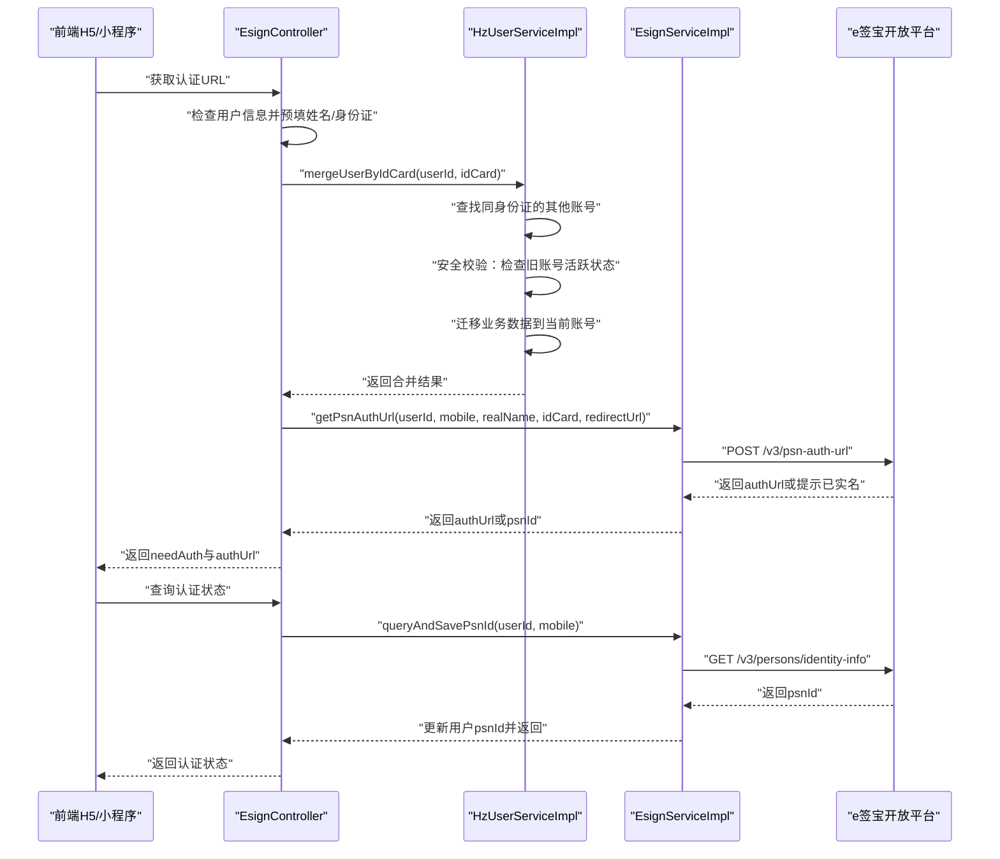
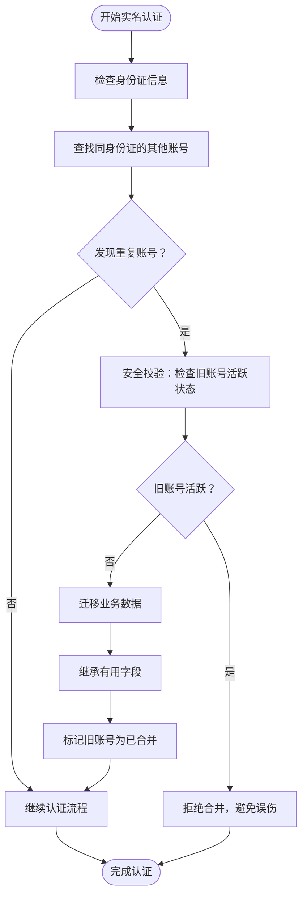
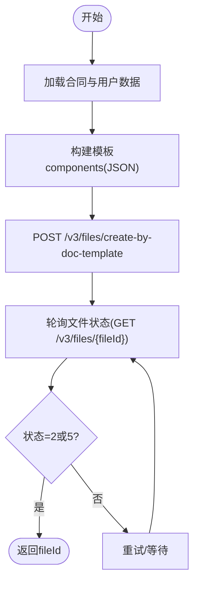
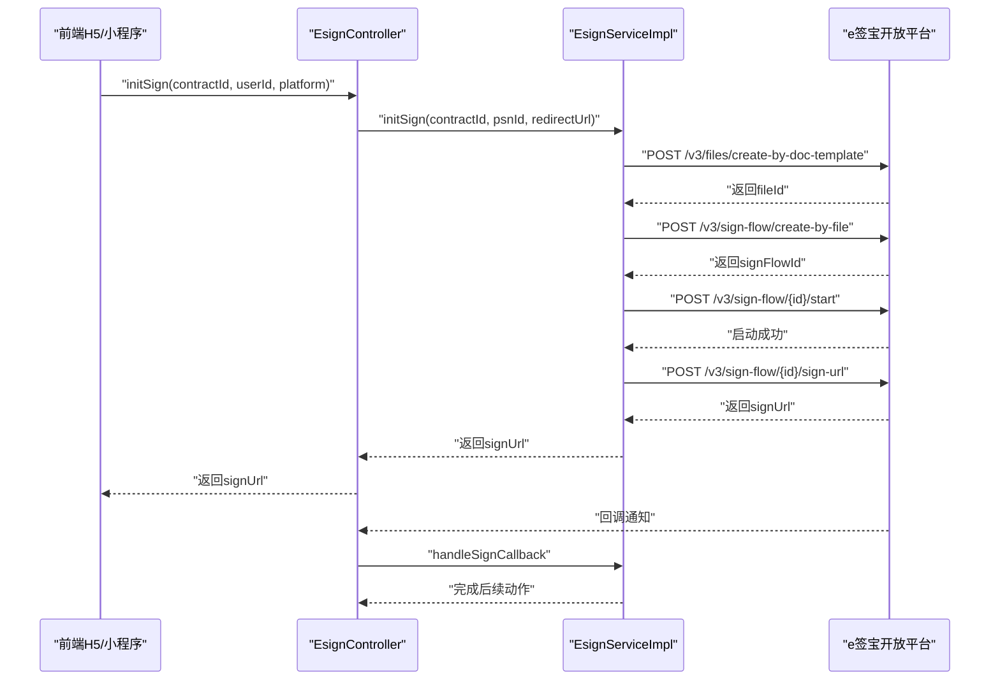
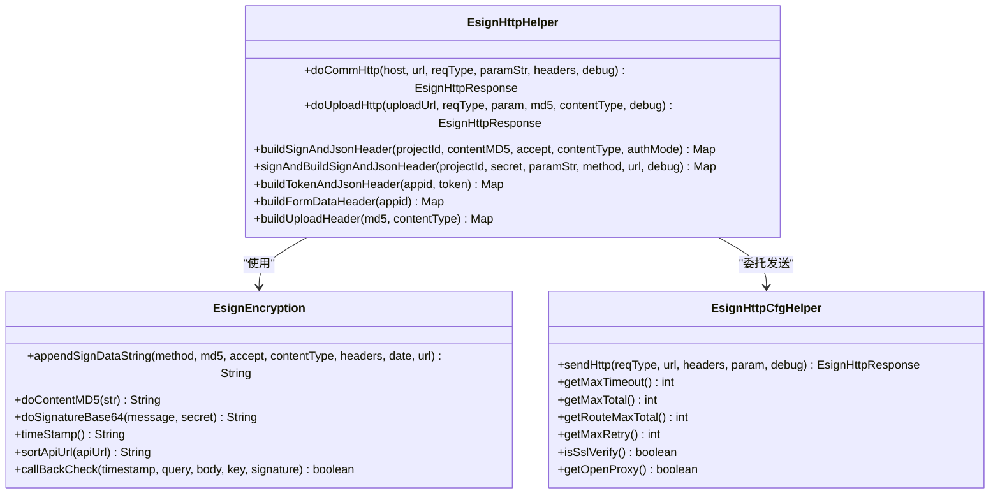
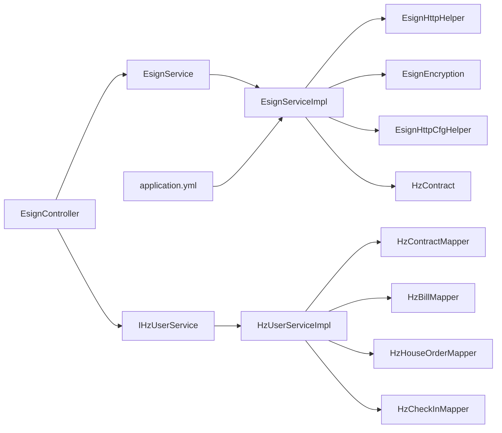

# e签宝集成

<cite>
**本文引用的文件**
- [ruoyi-admin/src/main/java/com/ruoyi/web/controller/h5/EsignController.java](file://ruoyi-admin/src/main/java/com/ruoyi/web/controller/h5/EsignController.java)
- [ruoyi-system/src/main/java/com/ruoyi/system/service/EsignService.java](file://ruoyi-system/src/main/java/com/ruoyi/system/service/EsignService.java)
- [ruoyi-system/src/main/java/com/ruoyi/system/service/impl/EsignServiceImpl.java](file://ruoyi-system/src/main/java/com/ruoyi/system/service/impl/EsignServiceImpl.java)
- [ruoyi-system/src/main/java/com/ruoyi/system/domain/HzContract.java](file://ruoyi-system/src/main/java/com/ruoyi/system/domain/HzContract.java)
- [ruoyi-system/src/main/java/com/ruoyi/system/esign/EsignHttpHelper.java](file://ruoyi-system/src/main/java/com/ruoyi/system/esign/EsignHttpHelper.java)
- [ruoyi-system/src/main/java/com/ruoyi/system/esign/EsignEncryption.java](file://ruoyi-system/src/main/java/com/ruoyi/system/esign/EsignEncryption.java)
- [ruoyi-system/src/main/java/com/ruoyi/system/esign/EsignHttpCfgHelper.java](file://ruoyi-system/src/main/java/com/ruoyi/system/esign/EsignHttpCfgHelper.java)
- [ruoyi-system/src/main/java/com/ruoyi/system/esign/EsignHttpResponse.java](file://ruoyi-system/src/main/java/com/ruoyi/system/esign/EsignHttpResponse.java)
- [ruoyi-system/src/main/java/com/ruoyi/system/esign/EsignHeaderConstant.java](file://ruoyi-system/src/main/java/com/ruoyi/system/esign/EsignHeaderConstant.java)
- [ruoyi-system/src/main/java/com/ruoyi/system/esign/EsignRequestType.java](file://ruoyi-system/src/main/java/com/ruoyi/system/esign/EsignRequestType.java)
- [ruoyi-system/src/main/java/com/ruoyi/system/esign/EsignCoreSdkInfo.java](file://ruoyi-system/src/main/java/com/ruoyi/system/esign/EsignCoreSdkInfo.java)
- [ruoyi-admin/src/main/resources/application.yml](file://ruoyi-admin/src/main/resources/application.yml)
- [uniapp-h5/api/esign.js](file://uniapp-h5/api/esign.js)
- [ruoyi-system/src/main/java/com/ruoyi/system/service/IHzUserService.java](file://ruoyi-system/src/main/java/com/ruoyi/system/service/IHzUserService.java)
- [ruoyi-system/src/main/java/com/ruoyi/system/service/impl/HzUserServiceImpl.java](file://ruoyi-system/src/main/java/com/ruoyi/system/service/impl/HzUserServiceImpl.java)
</cite>

## 更新摘要
**变更内容**
- 新增自动账户合并功能：在用户实名认证时自动检测并合并重复的身份证账号
- 增强实名认证流程：集成智能账号合并机制，提升用户体验
- 完善用户数据保护：通过安全策略避免误合并活跃用户数据

## 目录
1. [简介](#简介)
2. [项目结构](#项目结构)
3. [核心组件](#核心组件)
4. [架构总览](#架构总览)
5. [详细组件分析](#详细组件分析)
6. [依赖分析](#依赖分析)
7. [性能考虑](#性能考虑)
8. [故障排查指南](#故障排查指南)
9. [结论](#结论)
10. [附录](#附录)

## 简介
本文件面向需要在港好住系统中集成e签宝电子合同能力的开发者与运维人员，系统性阐述EsignService接口设计、实名认证流程、模板管理机制、签署流程控制、SDK集成要点（API封装、加密解密、HTTP请求、回调处理）、平台认证与签名算法、文件管理机制，并提供完整的集成配置、API调用示例、错误处理策略与性能优化建议。文档同时覆盖实名认证状态查询、模板填充、文件创建、签署流程初始化等关键业务场景的最佳实践。

**更新** 本版本新增了自动账户合并功能，该功能在用户实名认证时智能检测重复的身份证账号并进行安全的数据迁移，显著提升了认证流程的智能化水平和用户体验。

## 项目结构
围绕e签宝集成的关键模块分布如下：
- 控制层：对外暴露H5端API，负责接收前端请求、转发至服务层、处理回调与轮询查询
- 服务层：EsignService接口与实现EsignServiceImpl，封装e签宝调用、模板填充、签署流创建与状态查询
- 用户服务层：IHzUserService接口与HzUserServiceImpl实现，提供用户管理与自动账户合并功能
- e签宝SDK适配层：EsignHttpHelper、EsignEncryption、EsignHttpCfgHelper等，统一HTTP请求、签名与加密
- 领域模型：HzContract等实体，承载合同状态、e签宝流程ID等字段
- 前端SDK：uniapp-h5端的API封装，简化前端调用

**图表来源**
- [ruoyi-admin/src/main/java/com/ruoyi/web/controller/h5/EsignController.java:18-236](file://ruoyi-admin/src/main/java/com/ruoyi/web/controller/h5/EsignController.java#L18-L236)
- [ruoyi-system/src/main/java/com/ruoyi/system/service/EsignService.java:1-50](file://ruoyi-system/src/main/java/com/ruoyi/system/service/EsignService.java#L1-L50)
- [ruoyi-system/src/main/java/com/ruoyi/system/service/impl/EsignServiceImpl.java:28-74](file://ruoyi-system/src/main/java/com/ruoyi/system/service/impl/EsignServiceImpl.java#L28-L74)
- [ruoyi-system/src/main/java/com/ruoyi/system/service/IHzUserService.java:14-118](file://ruoyi-system/src/main/java/com/ruoyi/system/service/IHzUserService.java#L14-L118)
- [ruoyi-system/src/main/java/com/ruoyi/system/service/impl/HzUserServiceImpl.java:27-447](file://ruoyi-system/src/main/java/com/ruoyi/system/service/impl/HzUserServiceImpl.java#L27-L447)

**章节来源**
- [ruoyi-admin/src/main/java/com/ruoyi/web/controller/h5/EsignController.java:18-236](file://ruoyi-admin/src/main/java/com/ruoyi/web/controller/h5/EsignController.java#L18-L236)
- [ruoyi-system/src/main/java/com/ruoyi/system/service/impl/EsignServiceImpl.java:28-74](file://ruoyi-system/src/main/java/com/ruoyi/system/service/impl/EsignServiceImpl.java#L28-L74)
- [ruoyi-system/src/main/java/com/ruoyi/system/service/IHzUserService.java:14-118](file://ruoyi-system/src/main/java/com/ruoyi/system/service/IHzUserService.java#L14-L118)
- [ruoyi-system/src/main/java/com/ruoyi/system/service/impl/HzUserServiceImpl.java:27-447](file://ruoyi-system/src/main/java/com/ruoyi/system/service/impl/HzUserServiceImpl.java#L27-L447)
- [ruoyi-admin/src/main/resources/application.yml:199-218](file://ruoyi-admin/src/main/resources/application.yml#L199-L218)

## 核心组件
- EsignController：对外提供实名认证、签署流程、回调、轮询查询等REST接口，集成自动账户合并功能
- EsignService：定义e签宝集成的核心契约，包括认证、模板、签署、回调处理
- EsignServiceImpl：具体实现，封装模板填充、文件创建、签署流创建、状态轮询、回调处理
- IHzUserService：用户服务接口，提供用户管理与自动账户合并功能
- HzUserServiceImpl：用户服务实现，包含智能账号合并逻辑，确保数据安全迁移
- EsignHttpHelper/EsignEncryption/EsignHttpCfgHelper：HTTP请求、签名与加密、连接池与重试策略
- HzContract：合同实体，包含e签宝流程ID与状态字段
- application.yml：e签宝接入配置（AppId/AppSecret/Host/回调/跳转地址/OrgId/模板ID）

**章节来源**
- [ruoyi-system/src/main/java/com/ruoyi/system/service/EsignService.java:1-50](file://ruoyi-system/src/main/java/com/ruoyi/system/service/EsignService.java#L1-L50)
- [ruoyi-system/src/main/java/com/ruoyi/system/service/impl/EsignServiceImpl.java:28-74](file://ruoyi-system/src/main/java/com/ruoyi/system/service/impl/EsignServiceImpl.java#L28-L74)
- [ruoyi-system/src/main/java/com/ruoyi/system/service/IHzUserService.java:14-118](file://ruoyi-system/src/main/java/com/ruoyi/system/service/IHzUserService.java#L14-L118)
- [ruoyi-system/src/main/java/com/ruoyi/system/service/impl/HzUserServiceImpl.java:27-447](file://ruoyi-system/src/main/java/com/ruoyi/system/service/impl/HzUserServiceImpl.java#L27-L447)
- [ruoyi-system/src/main/java/com/ruoyi/system/esign/EsignHttpHelper.java:12-103](file://ruoyi-system/src/main/java/com/ruoyi/system/esign/EsignHttpHelper.java#L12-L103)
- [ruoyi-system/src/main/java/com/ruoyi/system/esign/EsignEncryption.java:19-232](file://ruoyi-system/src/main/java/com/ruoyi/system/esign/EsignEncryption.java#L19-L232)
- [ruoyi-system/src/main/java/com/ruoyi/system/esign/EsignHttpCfgHelper.java:49-259](file://ruoyi-system/src/main/java/com/ruoyi/system/esign/EsignHttpCfgHelper.java#L49-L259)
- [ruoyi-system/src/main/java/com/ruoyi/system/domain/HzContract.java:19-461](file://ruoyi-system/src/main/java/com/ruoyi/system/domain/HzContract.java#L19-L461)
- [ruoyi-admin/src/main/resources/application.yml:199-218](file://ruoyi-admin/src/main/resources/application.yml#L199-L218)

## 架构总览
e签宝集成采用"控制器-服务-SDK适配层"三层架构，结合模板填充与签署流创建，实现从实名认证到合同签署的闭环。新增的自动账户合并功能在实名认证阶段智能检测重复账号并进行安全迁移。

**图表来源**
- [ruoyi-admin/src/main/java/com/ruoyi/web/controller/h5/EsignController.java:29-82](file://ruoyi-admin/src/main/java/com/ruoyi/web/controller/h5/EsignController.java#L29-L82)
- [ruoyi-system/src/main/java/com/ruoyi/system/service/impl/HzUserServiceImpl.java:364-447](file://ruoyi-system/src/main/java/com/ruoyi/system/service/impl/HzUserServiceImpl.java#L364-L447)
- [ruoyi-system/src/main/java/com/ruoyi/system/service/impl/EsignServiceImpl.java:76-164](file://ruoyi-system/src/main/java/com/ruoyi/system/service/impl/EsignServiceImpl.java#L76-L164)
- [ruoyi-system/src/main/java/com/ruoyi/system/esign/EsignHttpHelper.java:17-20](file://ruoyi-system/src/main/java/com/ruoyi/system/esign/EsignHttpHelper.java#L17-L20)

## 详细组件分析

### 实名认证流程
- 获取认证URL：根据用户手机号与可选预填姓名/身份证，调用实名认证URL接口，支持预填与只允许修改手机号
- **自动账户合并**：在保存身份证信息前，系统会检测是否存在相同身份证的其他账号，如发现重复则自动进行安全合并
- 查询并保存psnId：当用户已实名但未保存psnId时，查询并落库
- 前端引导：H5/小程序根据needAuth决定是否展示认证链接

**图表来源**
- [ruoyi-admin/src/main/java/com/ruoyi/web/controller/h5/EsignController.java:37-66](file://ruoyi-admin/src/main/java/com/ruoyi/web/controller/h5/EsignController.java#L37-L66)
- [ruoyi-system/src/main/java/com/ruoyi/system/service/impl/HzUserServiceImpl.java:364-447](file://ruoyi-system/src/main/java/com/ruoyi/system/service/impl/HzUserServiceImpl.java#L364-L447)
- [ruoyi-system/src/main/java/com/ruoyi/system/service/impl/EsignServiceImpl.java:76-164](file://ruoyi-system/src/main/java/com/ruoyi/system/service/impl/EsignServiceImpl.java#L76-L164)

**章节来源**
- [ruoyi-admin/src/main/java/com/ruoyi/web/controller/h5/EsignController.java:37-66](file://ruoyi-admin/src/main/java/com/ruoyi/web/controller/h5/EsignController.java#L37-L66)
- [ruoyi-system/src/main/java/com/ruoyi/system/service/impl/HzUserServiceImpl.java:364-447](file://ruoyi-system/src/main/java/com/ruoyi/system/service/impl/HzUserServiceImpl.java#L364-L447)
- [ruoyi-system/src/main/java/com/ruoyi/system/service/impl/EsignServiceImpl.java:76-164](file://ruoyi-system/src/main/java/com/ruoyi/system/service/impl/EsignServiceImpl.java#L76-L164)

### 自动账户合并功能
**新增功能** 系统在用户实名认证时自动检测并合并重复的身份证账号，确保用户数据的完整性和一致性。

#### 核心特性
- **智能检测**：自动查找具有相同身份证号的其他账号
- **安全校验**：仅合并"从未活跃登录"的旧账号，避免误伤活跃用户
- **数据迁移**：安全地将旧账号的业务数据迁移到当前账号
- **字段继承**：从旧账号继承有用的空字段信息
- **标记处理**：将已合并的旧账号标记为"已合并"状态

#### 安全校验机制
- 检查旧账号是否具有活跃的微信OpenID
- 验证旧账号是否有最近的登录记录
- 确保不会合并有活跃用户的账号

#### 数据迁移范围
- 合同数据：HzContract表中的租户ID更新
- 账单数据：HzBill表中的租户ID更新  
- 预订单数据：HzHouseOrder表中的租户ID更新
- 入住记录：HzCheckIn表中的租户ID更新

**图表来源**
- [ruoyi-system/src/main/java/com/ruoyi/system/service/impl/HzUserServiceImpl.java:364-447](file://ruoyi-system/src/main/java/com/ruoyi/system/service/impl/HzUserServiceImpl.java#L364-L447)

**章节来源**
- [ruoyi-system/src/main/java/com/ruoyi/system/service/IHzUserService.java:108-116](file://ruoyi-system/src/main/java/com/ruoyi/system/service/IHzUserService.java#L108-L116)
- [ruoyi-system/src/main/java/com/ruoyi/system/service/impl/HzUserServiceImpl.java:364-447](file://ruoyi-system/src/main/java/com/ruoyi/system/service/impl/HzUserServiceImpl.java#L364-L447)

### 模板管理机制
- 查询模板详情：用于确认模板控件ID与默认值
- 模板填充：将HzContract与HzUser等数据映射到模板控件，构建components JSON
- 文件创建：调用"按模板创建文件"，等待文件就绪（状态2或5）

**图表来源**
- [ruoyi-system/src/main/java/com/ruoyi/system/service/impl/EsignServiceImpl.java:168-221](file://ruoyi-system/src/main/java/com/ruoyi/system/service/impl/EsignServiceImpl.java#L168-L221)

**章节来源**
- [ruoyi-system/src/main/java/com/ruoyi/system/service/impl/EsignServiceImpl.java:168-221](file://ruoyi-system/src/main/java/com/ruoyi/system/service/impl/EsignServiceImpl.java#L168-L221)

### 签署流程控制
- 初始化签署：模板填充→创建签署流→启动签署流→获取签署URL
- 获取签署URL：针对已有签署流或新建签署流分别处理
- 主动查询：直接调用e签宝查询签署流状态，完成后触发账单/入住生成
- 回调处理：接收并验签回调，完成后执行与轮询一致的后续动作

**图表来源**
- [ruoyi-admin/src/main/java/com/ruoyi/web/controller/h5/EsignController.java:86-163](file://ruoyi-admin/src/main/java/com/ruoyi/web/controller/h5/EsignController.java#L86-L163)
- [ruoyi-system/src/main/java/com/ruoyi/system/service/impl/EsignServiceImpl.java:223-288](file://ruoyi-system/src/main/java/com/ruoyi/system/service/impl/EsignServiceImpl.java#L223-L288)

**章节来源**
- [ruoyi-admin/src/main/java/com/ruoyi/web/controller/h5/EsignController.java:86-163](file://ruoyi-admin/src/main/java/com/ruoyi/web/controller/h5/EsignController.java#L86-L163)
- [ruoyi-system/src/main/java/com/ruoyi/system/service/impl/EsignServiceImpl.java:223-288](file://ruoyi-system/src/main/java/com/ruoyi/system/service/impl/EsignServiceImpl.java#L223-L288)

### SDK集成要点
- API调用封装：统一通过EsignHttpHelper封装HTTP请求，支持GET/POST/PUT/DELETE
- 加密解密机制：基于HMAC-SHA256进行签名，Content-MD5用于请求体完整性校验
- HTTP请求处理：基于Apache HttpClient，配置连接池、超时、代理、重试策略
- 回调事件处理：对回调header进行兼容处理（TIMESTAMP/SIGNATURE大小写差异），并进行验签

**图表来源**
- [ruoyi-system/src/main/java/com/ruoyi/system/esign/EsignHttpHelper.java:12-103](file://ruoyi-system/src/main/java/com/ruoyi/system/esign/EsignHttpHelper.java#L12-L103)
- [ruoyi-system/src/main/java/com/ruoyi/system/esign/EsignEncryption.java:19-232](file://ruoyi-system/src/main/java/com/ruoyi/system/esign/EsignEncryption.java#L19-L232)
- [ruoyi-system/src/main/java/com/ruoyi/system/esign/EsignHttpCfgHelper.java:49-259](file://ruoyi-system/src/main/java/com/ruoyi/system/esign/EsignHttpCfgHelper.java#L49-L259)

**章节来源**
- [ruoyi-system/src/main/java/com/ruoyi/system/esign/EsignHttpHelper.java:12-103](file://ruoyi-system/src/main/java/com/ruoyi/system/esign/EsignHttpHelper.java#L12-L103)
- [ruoyi-system/src/main/java/com/ruoyi/system/esign/EsignEncryption.java:19-232](file://ruoyi-system/src/main/java/com/ruoyi/system/esign/EsignEncryption.java#L19-L232)
- [ruoyi-system/src/main/java/com/ruoyi/system/esign/EsignHttpCfgHelper.java:49-259](file://ruoyi-system/src/main/java/com/ruoyi/system/esign/EsignHttpCfgHelper.java#L49-L259)

### 前端集成与调用示例
- 前端通过uniapp-h5/api/esign.js封装的函数调用后端接口
- 示例路径参考：
  - 获取认证URL：[uniapp-h5/api/esign.js:11-18](file://uniapp-h5/api/esign.js#L11-L18)
  - 查询认证状态：[uniapp-h5/api/esign.js:24-26](file://uniapp-h5/api/esign.js#L24-L26)
  - 一体化签署：[uniapp-h5/api/esign.js:34-36](file://uniapp-h5/api/esign.js#L34-L36)
  - 主动查询签署状态：[uniapp-h5/api/esign.js:42-44](file://uniapp-h5/api/esign.js#L42-L44)

**章节来源**
- [uniapp-h5/api/esign.js:1-45](file://uniapp-h5/api/esign.js#L1-L45)

## 依赖分析
- 控制器依赖服务层接口，服务实现依赖SDK适配层与领域模型
- **新增** 用户服务层提供自动账户合并功能，与控制器和业务服务协同工作
- SDK适配层内部协作：EsignHttpHelper依赖EsignEncryption与EsignHttpCfgHelper
- 配置文件提供e签宝接入参数，供服务层注入使用

**图表来源**
- [ruoyi-admin/src/main/java/com/ruoyi/web/controller/h5/EsignController.java:18-236](file://ruoyi-admin/src/main/java/com/ruoyi/web/controller/h5/EsignController.java#L18-L236)
- [ruoyi-system/src/main/java/com/ruoyi/system/service/impl/EsignServiceImpl.java:28-74](file://ruoyi-system/src/main/java/com/ruoyi/system/service/impl/EsignServiceImpl.java#L28-L74)
- [ruoyi-system/src/main/java/com/ruoyi/system/service/IHzUserService.java:14-118](file://ruoyi-system/src/main/java/com/ruoyi/system/service/IHzUserService.java#L14-L118)
- [ruoyi-system/src/main/java/com/ruoyi/system/service/impl/HzUserServiceImpl.java:27-447](file://ruoyi-system/src/main/java/com/ruoyi/system/service/impl/HzUserServiceImpl.java#L27-L447)
- [ruoyi-system/src/main/java/com/ruoyi/system/esign/EsignHttpHelper.java:12-103](file://ruoyi-system/src/main/java/com/ruoyi/system/esign/EsignHttpHelper.java#L12-L103)
- [ruoyi-system/src/main/java/com/ruoyi/system/esign/EsignEncryption.java:19-232](file://ruoyi-system/src/main/java/com/ruoyi/system/esign/EsignEncryption.java#L19-L232)
- [ruoyi-system/src/main/java/com/ruoyi/system/esign/EsignHttpCfgHelper.java:49-259](file://ruoyi-system/src/main/java/com/ruoyi/system/esign/EsignHttpCfgHelper.java#L49-L259)
- [ruoyi-system/src/main/java/com/ruoyi/system/domain/HzContract.java:19-461](file://ruoyi-system/src/main/java/com/ruoyi/system/domain/HzContract.java#L19-L461)
- [ruoyi-admin/src/main/resources/application.yml:199-218](file://ruoyi-admin/src/main/resources/application.yml#L199-L218)

**章节来源**
- [ruoyi-admin/src/main/java/com/ruoyi/web/controller/h5/EsignController.java:18-236](file://ruoyi-admin/src/main/java/com/ruoyi/web/controller/h5/EsignController.java#L18-L236)
- [ruoyi-system/src/main/java/com/ruoyi/system/service/impl/EsignServiceImpl.java:28-74](file://ruoyi-system/src/main/java/com/ruoyi/system/service/impl/EsignServiceImpl.java#L28-L74)
- [ruoyi-system/src/main/java/com/ruoyi/system/service/IHzUserService.java:14-118](file://ruoyi-system/src/main/java/com/ruoyi/system/service/IHzUserService.java#L14-L118)
- [ruoyi-system/src/main/java/com/ruoyi/system/service/impl/HzUserServiceImpl.java:27-447](file://ruoyi-system/src/main/java/com/ruoyi/system/service/impl/HzUserServiceImpl.java#L27-L447)
- [ruoyi-system/src/main/java/com/ruoyi/system/esign/EsignHttpHelper.java:12-103](file://ruoyi-system/src/main/java/com/ruoyi/system/esign/EsignHttpHelper.java#L12-L103)
- [ruoyi-system/src/main/java/com/ruoyi/system/esign/EsignEncryption.java:19-232](file://ruoyi-system/src/main/java/com/ruoyi/system/esign/EsignEncryption.java#L19-L232)
- [ruoyi-system/src/main/java/com/ruoyi/system/esign/EsignHttpCfgHelper.java:49-259](file://ruoyi-system/src/main/java/com/ruoyi/system/esign/EsignHttpCfgHelper.java#L49-L259)
- [ruoyi-system/src/main/java/com/ruoyi/system/domain/HzContract.java:19-461](file://ruoyi-system/src/main/java/com/ruoyi/system/domain/HzContract.java#L19-L461)
- [ruoyi-admin/src/main/resources/application.yml:199-218](file://ruoyi-admin/src/main/resources/application.yml#L199-L218)

## 性能考虑
- 连接池与超时：通过EsignHttpCfgHelper配置连接池大小、路由并发、连接与套接字超时，减少连接建立开销
- 重试策略：对特定异常进行幂等安全的重试，提升弱网环境下的成功率
- 文件就绪轮询：模板填充后适度轮询文件状态，避免立即查询导致的失败
- 模板控件截断：对单行文本控件进行长度截断与告警，避免e签宝拒绝
- **新增** 自动账户合并：采用事务性操作确保数据一致性，避免重复合并操作
- 建议：生产环境开启SSL校验，合理设置MAX_RETRY与超时阈值，监控回调验签耗时

## 故障排查指南
- 回调验签失败：检查回调header名称兼容（TIMESTAMP/SIGNATURE大小写差异），确保签名串拼接顺序正确
- 文件长时间未就绪：检查模板控件映射与必填项，适当延长轮询次数与间隔
- 签署流状态异常：使用主动查询接口直接问e签宝，核对signFlowId与合同状态一致性
- 认证状态不一致：优先查询并保存psnId，避免重复认证与状态漂移
- **新增** 账号合并失败：检查旧账号是否为活跃用户（有微信OpenID），确认合并条件是否满足
- **新增** 数据迁移异常：查看事务日志，确认所有关联表的数据更新是否成功
- 前端无法跳转：核对redirectUrl与auth-redirect-url配置，确保公网可达

**章节来源**
- [ruoyi-admin/src/main/java/com/ruoyi/web/controller/h5/EsignController.java:167-202](file://ruoyi-admin/src/main/java/com/ruoyi/web/controller/h5/EsignController.java#L167-L202)
- [ruoyi-system/src/main/java/com/ruoyi/system/esign/EsignEncryption.java:203-230](file://ruoyi-system/src/main/java/com/ruoyi/system/esign/EsignEncryption.java#L203-L230)
- [ruoyi-system/src/main/java/com/ruoyi/system/service/impl/EsignServiceImpl.java:206-221](file://ruoyi-system/src/main/java/com/ruoyi/system/service/impl/EsignServiceImpl.java#L206-L221)
- [ruoyi-system/src/main/java/com/ruoyi/system/service/impl/HzUserServiceImpl.java:364-447](file://ruoyi-system/src/main/java/com/ruoyi/system/service/impl/HzUserServiceImpl.java#L364-L447)

## 结论
本集成方案以清晰的分层设计与完善的SDK适配层，实现了从实名认证到合同签署的全链路自动化。**新增的自动账户合并功能**进一步提升了系统的智能化水平，能够在用户实名认证时智能检测并安全合并重复的身份证账号，确保用户数据的完整性和一致性。

通过模板填充、签署流创建与回调/轮询双通道状态同步，以及智能的账号合并机制，确保业务流程稳定可靠。建议在生产环境中严格配置证书校验、监控与告警，并持续优化模板控件映射与前端跳转体验。

## 附录

### 集成配置指南
- 在配置文件中设置e签宝接入参数，包括AppId、AppSecret、Host、回调地址、跳转地址、OrgId、模板ID等
- 配置示例路径参考：[ruoyi-admin/src/main/resources/application.yml:199-218](file://ruoyi-admin/src/main/resources/application.yml#L199-L218)

**章节来源**
- [ruoyi-admin/src/main/resources/application.yml:199-218](file://ruoyi-admin/src/main/resources/application.yml#L199-L218)

### 关键业务场景最佳实践
- 实名认证状态查询：优先使用queryAndSavePsnId，避免重复认证
- **新增** 身份证账号合并：在保存身份证信息前自动检测并安全合并重复账号
- 模板填充：严格对照模板控件ID，注意单行文本长度限制与必填项
- 文件创建：等待文件状态就绪后再创建签署流
- 签署流程初始化：一体化流程（模板填充→创建签署流→启动→获取签署URL）
- 回调处理：严格验签与幂等处理，完成后执行与轮询一致的后续动作

**章节来源**
- [ruoyi-system/src/main/java/com/ruoyi/system/service/impl/EsignServiceImpl.java:168-288](file://ruoyi-system/src/main/java/com/ruoyi/system/service/impl/EsignServiceImpl.java#L168-L288)
- [ruoyi-admin/src/main/java/com/ruoyi/web/controller/h5/EsignController.java:86-163](file://ruoyi-admin/src/main/java/com/ruoyi/web/controller/h5/EsignController.java#L86-L163)
- [ruoyi-system/src/main/java/com/ruoyi/system/service/impl/HzUserServiceImpl.java:364-447](file://ruoyi-system/src/main/java/com/ruoyi/system/service/impl/HzUserServiceImpl.java#L364-L447)

### 自动账户合并安全策略
- **活跃用户保护**：仅合并从未活跃登录的旧账号（无微信OpenID、无最近登录记录）
- **数据完整性**：确保所有关联表的数据迁移完整，包括合同、账单、预订单、入住记录
- **字段继承规则**：仅继承当前账号为空的有用字段，避免覆盖现有信息
- **标记机制**：将已合并的旧账号标记为"已合并"状态，防止重复处理
- **事务保证**：采用数据库事务确保合并操作的原子性，失败时自动回滚

**章节来源**
- [ruoyi-system/src/main/java/com/ruoyi/system/service/impl/HzUserServiceImpl.java:364-447](file://ruoyi-system/src/main/java/com/ruoyi/system/service/impl/HzUserServiceImpl.java#L364-L447)