# 合同业务流程

<cite>
**本文引用的文件**
- [HzContract.java](file://ruoyi-system/src/main/java/com/ruoyi/system/domain/HzContract.java)
- [HzContractTemplate.java](file://ruoyi-system/src/main/java/com/ruoyi/system/domain/HzContractTemplate.java)
- [HzContractSignature.java](file://ruoyi-system/src/main/java/com/ruoyi/system/domain/HzContractSignature.java)
- [HzContractServiceImpl.java](file://ruoyi-system/src/main/java/com/ruoyi/system/service/impl/HzContractServiceImpl.java)
- [HzContractTemplateServiceImpl.java](file://ruoyi-system/src/main/java/com/ruoyi/system/service/impl/HzContractTemplateServiceImpl.java)
- [EsignServiceImpl.java](file://ruoyi-system/src/main/java/com/ruoyi/system/service/impl/EsignServiceImpl.java)
- [HzContractController.java](file://ruoyi-admin/src/main/java/com/ruoyi/web/controller/system/HzContractController.java)
- [HzContractAppController.java](file://ruoyi-admin/src/main/java/com/ruoyi/web/controller/h5/HzContractAppController.java)
- [sign.vue](file://uniapp-h5/pages/contract/sign.vue)
- [HzContractMapper.java](file://ruoyi-system/src/main/java/com/ruoyi/system/mapper/HzContractMapper.java)
- [HzContractTemplateMapper.java](file://ruoyi-system/src/main/java/com/ruoyi/system/mapper/HzContractTemplateMapper.java)
- [03-合同管理.md](file://docs/数据字典/03-合同管理.md)
- [ContractExpireTask.java](file://ruoyi-quartz/src/main/java/com/ruoyi/quartz/task/ContractExpireTask.java)
- [HzHouseOrderServiceImpl.java](file://ruoyi-system/src/main/java/com/ruoyi/system/service/impl/HzHouseOrderServiceImpl.java)
- [HzCheckoutServiceImpl.java](file://ruoyi-system/src/main/java/com/ruoyi/system/service/impl/HzCheckoutServiceImpl.java)
- [HzCheckoutApply.java](file://ruoyi-system/src/main/java/com/ruoyi/system/domain/HzCheckoutApply.java)
- [HzCheckoutRecord.java](file://ruoyi-system/src/main/java/com/ruoyi/system/domain/HzCheckoutRecord.java)
- [04-入住退租.md](file://docs/数据字典/04-入住退租.md)
- [HzBatchAllocation.java](file://ruoyi-system/src/main/java/com/ruoyi/system/domain/HzBatchAllocation.java)
- [HzBatchHouse.java](file://ruoyi-system/src/main/java/com/ruoyi/system/domain/HzBatchHouse.java)
- [HzBatchTenant.java](file://ruoyi-system/src/main/java/com/ruoyi/system/domain/HzBatchTenant.java)
- [BatchPreferenceVo.java](file://ruoyi-system/src/main/java/com/ruoyi/system/domain/vo/BatchPreferenceVo.java)
- [HzBatchHouseMapper.java](file://ruoyi-system/src/main/java/com/ruoyi/system/mapper/HzBatchHouseMapper.java)
- [HzBatchHouseMapper.xml](file://ruoyi-system/src/main/resources/mapper/system/HzBatchHouseMapper.xml)
- [HzBatchAllocationServiceImpl.java](file://ruoyi-system/src/main/java/com/ruoyi/system/service/impl/HzBatchAllocationServiceImpl.java)
- [HzHouse.java](file://ruoyi-system/src/main/java/com/ruoyi/system/domain/HzHouse.java)
- [HzBill.java](file://ruoyi-system/src/main/java/com/ruoyi/system/domain/HzBill.java)
- [HzEnterpriseBill.java](file://ruoyi-system/src/main/java/com/ruoyi/system/domain/HzEnterpriseBill.java)
- [HzPayment.java](file://ruoyi-system/src/main/java/com/ruoyi/system/domain/HzPayment.java)
- [bill.vue](file://uniapp-h5/subpkg/affairs/bill.vue)
- [enterprise.vue](file://uniapp-h5/subpkg/service/enterprise.vue)
- [HzQualificationController.java](file://ruoyi-admin/src/main/java/com/ruoyi/web/controller/h5/HzQualificationController.java)
- [HzCheckOutController.java](file://ruoyi-admin/src/main/java/com/ruoyi/web/controller/system/HzCheckOutController.java)
- [IHzCheckoutService.java](file://ruoyi-system/src/main/java/com/ruoyi/system/service/IHzCheckoutService.java)
- [checkout.js](file://ruoyi-ui/src/api/gangzhu/checkout.js)
- [HzHouseOrder.java](file://ruoyi-system/src/main/java/com/ruoyi/system/domain/HzHouseOrder.java)
- [HzHouseOrderMapper.java](file://ruoyi-system/src/main/java/com/ruoyi/system/mapper/HzHouseOrderMapper.java)
- [HzHouseOrderMapper.xml](file://ruoyi-system/src/main/resources/mapper/system/HzHouseOrderMapper.xml)
- [HouseOrderExpireTask.java](file://ruoyi-quartz/src/main/java/com/ruoyi/quartz/task/HouseOrderExpireTask.java)
- [contract.vue](file://uniapp-h5/subpkg/affairs/contract.vue)
</cite>

## 更新摘要
**变更内容**
- 合同到期处理增强：ContractExpireTask定时任务现在覆盖所有账单类型（押金、租金、水电费、物业费），而非仅限押金类型，增强了合同到期处理的完整性
- 批量配租用户豁免取消：批量配租用户在合同超时处理中不再享有特殊豁免，与普通用户遵循相同的时效规则
- 微信支付回调兜底：recoverLostWechatNotify方法扫描范围扩大到所有账单类型，包括租金、水电燃、物业费等
- 合同状态机统一化：所有用户类型的合同到期处理都遵循统一的状态转换规则

## 目录
1. [简介](#简介)
2. [项目结构](#项目结构)
3. [核心组件](#核心组件)
4. [架构总览](#架构总览)
5. [详细组件分析](#详细组件分析)
6. [依赖关系分析](#依赖关系分析)
7. [性能考虑](#性能考虑)
8. [故障排查指南](#故障排查指南)
9. [结论](#结论)
10. [附录](#附录)

## 简介
本文件面向港好住信息系统中的合同业务流程，系统性梳理从候选人信息收集到合同签署完成的完整生命周期，重点覆盖合同模板选择、候选人信息填写、电子签名生成、合同状态跟踪等关键环节。文档深入分析 HzContract、HzContractTemplate、HzContractSignature 三大核心实体的数据模型与业务逻辑，解释合同状态机设计与推进规则，阐述合同模板版本管理机制、批量签署流程、撤销与重新签署机制，并提供用户体验设计、法律合规性保障与安全措施的实现要点，以及合同生成、发送、签署、归档的全生命周期管理与异常处理策略。

**更新** 本次更新重点关注合同到期处理的完整性增强，包括ContractExpireTask定时任务覆盖所有账单类型的变更，以及批量配租用户豁免政策的调整。这些变更确保了系统在处理不同用户群体和账单类型时的公平性和一致性。

## 项目结构
合同业务涉及后端领域模型、服务层、电子签章服务、管理端控制器与前端 H5 页面协同工作：
- 领域模型：HzContract、HzContractTemplate、HzContractSignature、HzBatchAllocation、HzBatchHouse、HzBatchTenant、HzBill、HzEnterpriseBill、HzPayment、HzCheckoutApply、HzCheckoutRecord、HzHouseOrder
- 服务层：HzContractServiceImpl、HzContractTemplateServiceImpl、EsignServiceImpl、HzCheckoutServiceImpl、HzBatchAllocationServiceImpl、HzHouseOrderServiceImpl
- 控制器：HzContractController（管理端）、HzContractAppController（H5端）、HzCheckOutController（管理端退租控制器）
- 前端：uniapp-h5 的合同签署页面 sign.vue、账单页面 bill.vue、企业服务页面 enterprise.vue、退租管理API、合同列表页面 contract.vue
- 数据访问：HzContractMapper、HzContractTemplateMapper、HzBatchHouseMapper、HzCheckoutApplyMapper、HzCheckoutRecordMapper、HzBillMapper、HzEnterpriseBillMapper、HzHouseOrderMapper
- 定时任务：ContractExpireTask（合同到期处理）、HouseOrderExpireTask（预订单过期处理）
- 退租相关：HzCheckoutApply、HzCheckoutRecord（退租申请与记录）
- 房源状态管理：HzHouse（包含"修缮中"状态）
- 订单状态管理：HzHouseOrder（包含"已过期"状态）

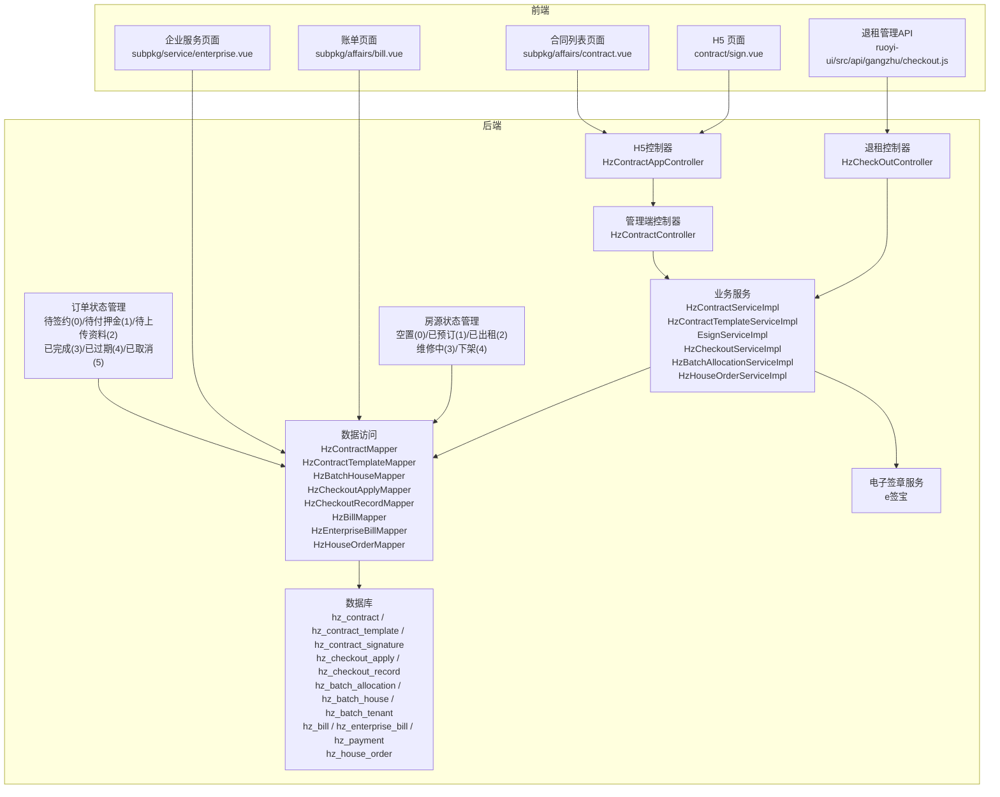

**图表来源**
- [HzContractController.java:36-300](file://ruoyi-admin/src/main/java/com/ruoyi/web/controller/system/HzContractController.java#L36-L300)
- [HzContractAppController.java:360-759](file://ruoyi-admin/src/main/java/com/ruoyi/web/controller/h5/HzContractAppController.java#L360-L759)
- [HzCheckOutController.java:181-193](file://ruoyi-admin/src/main/java/com/ruoyi/web/controller/system/HzCheckOutController.java#L181-L193)
- [checkout.js:80-87](file://ruoyi-ui/src/api/gangzhu/checkout.js#L80-L87)
- [HzContractServiceImpl.java:35-334](file://ruoyi-system/src/main/java/com/ruoyi/system/service/impl/HzContractServiceImpl.java#L35-L334)
- [HzContractTemplateServiceImpl.java:20-119](file://ruoyi-system/src/main/java/com/ruoyi/system/service/impl/HzContractTemplateServiceImpl.java#L20-L119)
- [EsignServiceImpl.java:28-800](file://ruoyi-system/src/main/java/com/ruoyi/system/service/impl/EsignServiceImpl.java#L28-L800)
- [HzContractMapper.java:17-36](file://ruoyi-system/src/main/java/com/ruoyi/system/mapper/HzContractMapper.java#L17-L36)
- [HzContractTemplateMapper.java:17-41](file://ruoyi-system/src/main/java/com/ruoyi/system/mapper/HzContractTemplateMapper.java#L17-L41)
- [HzBatchHouseMapper.java:1-26](file://ruoyi-system/src/main/java/com/ruoyi/system/mapper/HzBatchHouseMapper.java#L1-L26)
- [HzBatchAllocationServiceImpl.java:46-759](file://ruoyi-system/src/main/java/com/ruoyi/system/service/impl/HzBatchAllocationServiceImpl.java#L46-L759)
- [HzCheckoutServiceImpl.java:1103-1165](file://ruoyi-system/src/main/java/com/ruoyi/system/service/impl/HzCheckoutServiceImpl.java#L1103-L1165)
- [HzHouse.java:114-117](file://ruoyi-system/src/main/java/com/ruoyi/system/domain/HzHouse.java#L114-L117)
- [HzBill.java:124](file://ruoyi-system/src/main/java/com/ruoyi/system/domain/HzBill.java#L124)
- [HzEnterpriseBill.java:118](file://ruoyi-system/src/main/java/com/ruoyi/system/domain/HzEnterpriseBill.java#L118)
- [HzPayment.java:38](file://ruoyi-system/src/main/java/com/ruoyi/system/domain/HzPayment.java#L38)
- [HzHouseOrder.java:52-55](file://ruoyi-system/src/main/java/com/ruoyi/system/domain/HzHouseOrder.java#L52-L55)
- [HouseOrderExpireTask.java:1-40](file://ruoyi-quartz/src/main/java/com/ruoyi/quartz/task/HouseOrderExpireTask.java#L1-L40)

## 核心组件
- HzContract：合同主数据，包含合同编号、类型、模板ID、租户信息、房源信息、金额与期限、合同内容/文件、电子签流程ID、签署状态等字段，支撑合同全生命周期管理。
- HzContractTemplate：合同模板，包含模板名称、编码、类型、内容、付款周期、合同期限、押金与违约金规则、版本号、默认状态与状态等，支撑模板版本管理与选择。
- HzContractSignature：合同签名记录，包含合同ID、签名人、签名图片、IP与设备信息、签名状态等，支撑电子签名审计与追踪。
- HzBatchAllocation：批量配租批次，包含批次ID、批次编号、批次名称、企业信息、项目信息、入驻日期、优惠信息、审批状态、批次状态等，支撑批量配租业务管理。
- HzBatchHouse：批次房源关联，包含批次ID、房源ID、分配状态、租户ID等，支撑批量配租房源分配管理。
- HzBatchTenant：批次租户信息，包含批次ID、租户姓名、身份证号、手机号、工号、部门信息等，支撑批量配租人员管理。
- HzCheckoutApply：退租申请，包含合同ID、租户ID、房源ID、申请时间、计划退租日期、退租原因、申请状态等，支撑退租业务流程。
- HzCheckoutRecord：退租记录，包含退租申请ID、合同ID、租户ID、房源ID、退租日期、费用结算、退款状态等，支撑退租确认与房屋释放。
- HzHouse：房源实体，包含房源状态字段，支持"空置(0)、已预订(1)、已出租(2)、维修中(3)、下架(4)"五种状态，支撑批量配租模式下的状态流转管理。
- HzBill：账单实体，包含账单编号、企业ID、合同ID、账单类型、账单周期、应付金额、已付金额、账单状态、支付方式等字段，支撑账单周期管理和支付方式可视化。
- HzEnterpriseBill：企业账单实体，包含企业账单编号、企业ID、批次ID、账单类型、账单周期、应付金额、已付金额、账单状态、支付方式等字段，支撑企业级账单管理。
- HzPayment：支付实体，包含支付方式、支付渠道、支付状态等字段，支撑多种支付方式的配置和管理。
- HzHouseOrder：房屋订单实体，包含订单ID、订单号、租户ID、房源ID、订单状态、合同ID、锁定过期时间、资料上传过期时间等字段，支撑房屋预订与订单管理，包含"已过期(4)"状态用于合同到期后的订单处理。

**章节来源**
- [HzContract.java:19-606](file://ruoyi-system/src/main/java/com/ruoyi/system/domain/HzContract.java#L19-L606)
- [HzContractTemplate.java:18-228](file://ruoyi-system/src/main/java/com/ruoyi/system/domain/HzContractTemplate.java#L18-L228)
- [HzContractSignature.java:16-174](file://ruoyi-system/src/main/java/com/ruoyi/system/domain/HzContractSignature.java#L16-L174)
- [HzBatchAllocation.java:14-333](file://ruoyi-system/src/main/java/com/ruoyi/system/domain/HzBatchAllocation.java#L14-L333)
- [HzBatchHouse.java:8-122](file://ruoyi-system/src/main/java/com/ruoyi/system/domain/HzBatchHouse.java#L8-L122)
- [HzBatchTenant.java:8-158](file://ruoyi-system/src/main/java/com/ruoyi/system/domain/HzBatchTenant.java#L8-L158)
- [HzCheckoutApply.java:16-242](file://ruoyi-system/src/main/java/com/ruoyi/system/domain/HzCheckoutApply.java#L16-L242)
- [HzCheckoutRecord.java:17-364](file://ruoyi-system/src/main/java/com/ruoyi/system/domain/HzCheckoutRecord.java#L17-L364)
- [HzHouse.java:114-117](file://ruoyi-system/src/main/java/com/ruoyi/system/domain/HzHouse.java#L114-L117)
- [HzBill.java:124](file://ruoyi-system/src/main/java/com/ruoyi/system/domain/HzBill.java#L124)
- [HzEnterpriseBill.java:118](file://ruoyi-system/src/main/java/com/ruoyi/system/domain/HzEnterpriseBill.java#L118)
- [HzPayment.java:38](file://ruoyi-system/src/main/java/com/ruoyi/system/domain/HzPayment.java#L38)
- [HzHouseOrder.java:52-55](file://ruoyi-system/src/main/java/com/ruoyi/system/domain/HzHouseOrder.java#L52-L55)

## 架构总览
合同业务采用"前端 H5 页面 + 管理端控制器 + 业务服务 + 电子签章服务 + 数据库"的分层架构。前端负责用户交互与引导，控制器负责管理端操作入口，业务服务封装合同生成、模板选择、电子签流程、状态推进与账单生成等核心逻辑，电子签章服务对接 e签宝完成模板填充、签署流创建与状态同步，数据库持久化合同、模板与签名记录。

**更新** 本次更新新增了合同到期处理的完整性增强，包括ContractExpireTask定时任务覆盖所有账单类型的变更，以及批量配租用户豁免政策的调整。这些变更确保了系统在处理不同用户群体和账单类型时的公平性和一致性。

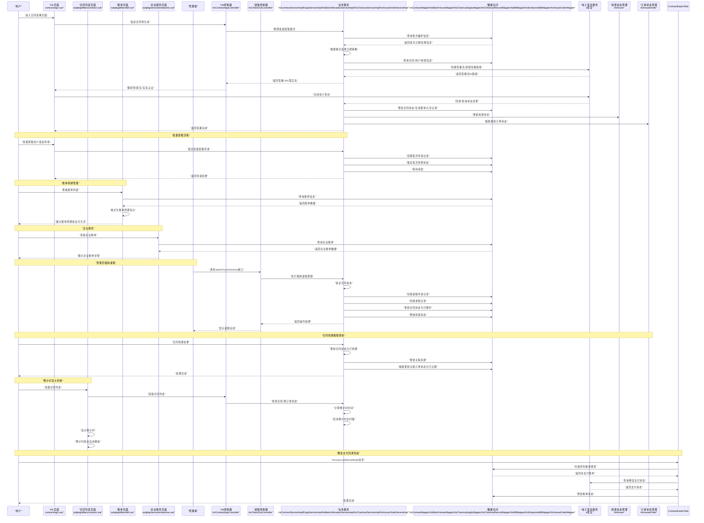

**图表来源**
- [HzContractAppController.java:366-482](file://ruoyi-admin/src/main/java/com/ruoyi/web/controller/h5/HzContractAppController.java#L366-L482)
- [HzContractAppController.java:562-759](file://ruoyi-admin/src/main/java/com/ruoyi/web/controller/h5/HzContractAppController.java#L562-L759)
- [HzCheckOutController.java:181-193](file://ruoyi-admin/src/main/java/com/ruoyi/web/controller/system/HzCheckOutController.java#L181-L193)
- [HzCheckoutServiceImpl.java:1103-1165](file://ruoyi-system/src/main/java/com/ruoyi/system/service/impl/HzCheckoutServiceImpl.java#L1103-L1165)
- [checkout.js:80-87](file://ruoyi-ui/src/api/gangzhu/checkout.js#L80-L87)
- [EsignServiceImpl.java:224-288](file://ruoyi-system/src/main/java/com/ruoyi/system/service/impl/EsignServiceImpl.java#L224-L288)
- [HzContractServiceImpl.java:304-332](file://ruoyi-system/src/main/java/com/ruoyi/system/service/impl/HzContractServiceImpl.java#L304-L332)
- [HzBatchAllocationServiceImpl.java:168-196](file://ruoyi-system/src/main/java/com/ruoyi/system/service/impl/HzBatchAllocationServiceImpl.java#L168-196)
- [bill.vue:296-333](file://uniapp-h5/subpkg/affairs/bill.vue#L296-L333)
- [enterprise.vue:27-61](file://uniapp-h5/subpkg/service/enterprise.vue#L27-L61)
- [HzContractServiceImpl.java:370-375](file://ruoyi-system/src/main/java/com/ruoyi/system/service/impl/HzContractServiceImpl.java#L370-L375)
- [contract.vue:539-590](file://uniapp-h5/subpkg/affairs/contract.vue#L539-L590)
- [ContractExpireTask.java:407-477](file://ruoyi-quartz/src/main/java/com/ruoyi/quartz/task/ContractExpireTask.java#L407-L477)

## 详细组件分析

### 合同状态机与生命周期
合同状态包括：草稿(0)、待签署(1)、已签署(2)、履行中(3)、已到期(4)、已解约(5)、超时失效(6)。状态推进遵循严格的前置条件与业务规则：
- 草稿 → 待签署：通过电子签流程创建并启动签署流，状态从"草稿"变为"待签署"。
- 待签署 → 已签署：电子签完成后，根据合同类型区分处理，续租合同直接进入"履行中"，新签合同进入"已签署"。
- 已签署 → 履行中：当满足双条件（如订单锁定与合同状态）时推进到"履行中"。
- 履行中 → 已解约：通过退租确认流程或管理员强制退租，合同状态更新为"已解约"，同时释放关联房源。
- 履行中 → 已到期：合同到期后，系统自动将合同状态更新为"已到期"，并释放关联房源。
- 已到期：由系统或人工操作维护。
- 超时失效(6)：由定时任务或订单过期触发，将合同状态置为"超时失效"。

**更新** 新增合同到期级联更新房屋订单状态功能对合同状态机的影响：当合同状态变为"已到期(4)"时，系统会自动将关联的房屋订单状态更新为"已过期(4)"，确保合同状态变化与订单状态的同步一致性，避免阻塞重新选房。

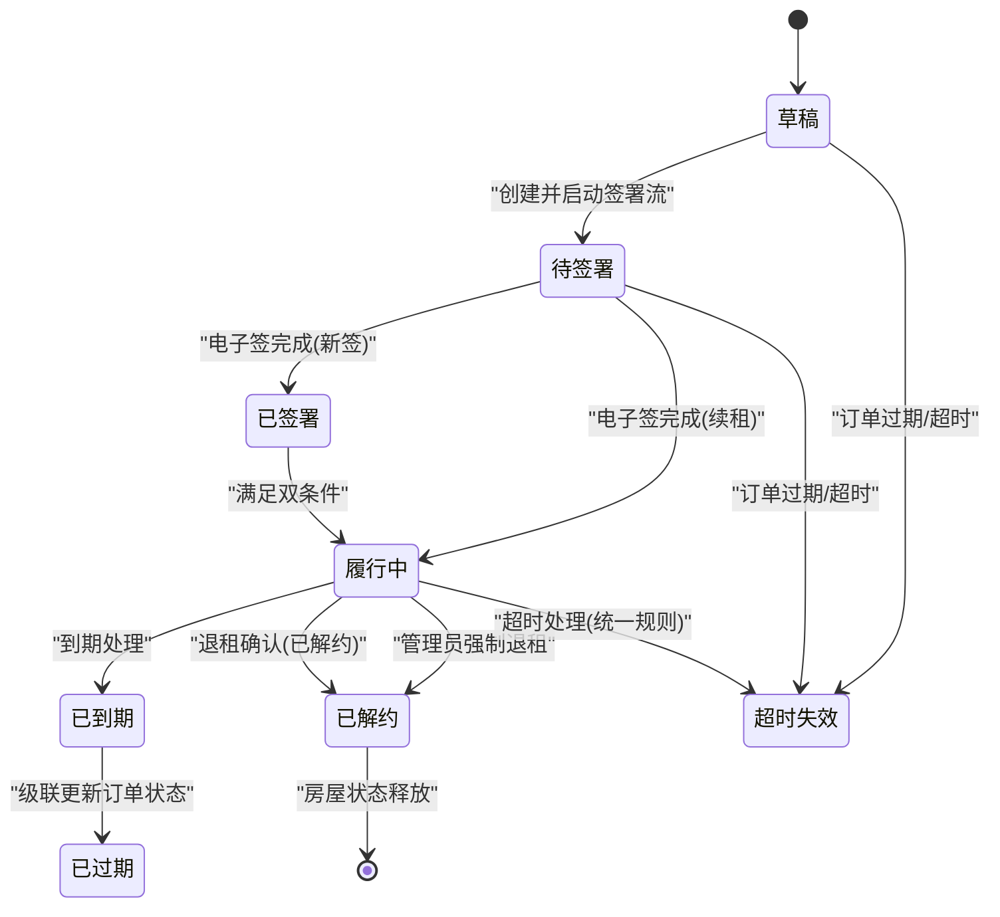

**图表来源**
- [HzContract.java:139-142](file://ruoyi-system/src/main/java/com/ruoyi/system/domain/HzContract.java#L139-L142)
- [EsignServiceImpl.java:718-796](file://ruoyi-system/src/main/java/com/ruoyi/system/service/impl/EsignServiceImpl.java#L718-L796)
- [HzHouseOrderServiceImpl.java:290-309](file://ruoyi-system/src/main/java/com/ruoyi/system/service/impl/HzHouseOrderServiceImpl.java#L290-L309)
- [HzCheckoutServiceImpl.java:648-664](file://ruoyi-system/src/main/java/com/ruoyi/system/service/impl/HzCheckoutServiceImpl.java#L648-L664)
- [HzCheckoutServiceImpl.java:1103-1165](file://ruoyi-system/src/main/java/com/ruoyi/system/service/impl/HzCheckoutServiceImpl.java#L1103-L1165)
- [HzContractServiceImpl.java:370-375](file://ruoyi-system/src/main/java/com/ruoyi/system/service/impl/HzContractServiceImpl.java#L370-L375)

**章节来源**
- [HzContract.java:139-142](file://ruoyi-system/src/main/java/com/ruoyi/system/domain/HzContract.java#L139-L142)
- [EsignServiceImpl.java:718-796](file://ruoyi-system/src/main/java/com/ruoyi/system/service/impl/EsignServiceImpl.java#L718-L796)
- [HzHouseOrderServiceImpl.java:290-309](file://ruoyi-system/src/main/java/com/ruoyi/system/service/impl/HzHouseOrderServiceImpl.java#L290-L309)
- [HzCheckoutServiceImpl.java:648-664](file://ruoyi-system/src/main/java/com/ruoyi/system/service/impl/HzCheckoutServiceImpl.java#L648-L664)
- [HzCheckoutServiceImpl.java:1103-1165](file://ruoyi-system/src/main/java/com/ruoyi/system/service/impl/HzCheckoutServiceImpl.java#L1103-L1165)
- [HzContractServiceImpl.java:370-375](file://ruoyi-system/src/main/java/com/ruoyi/system/service/impl/HzContractServiceImpl.java#L370-L375)

### 合同到期处理增强：覆盖所有账单类型
**更新** ContractExpireTask定时任务的重大变更：现在覆盖所有账单类型（押金、租金、水电费、物业费），而非仅限押金类型：

- **账单类型覆盖范围扩大**：recoverLostWechatNotify方法现在扫描所有账单类型，包括押金(bill_type=1)、租金(bill_type=2)、水费(bill_type=3)、电费(bill_type=4)、燃气费(bill_type=5)、物业费(bill_type=6)等。
- **扫描逻辑优化**：扫描范围限定在bill_status='0'（未支付）、last_out_trade_no非空（表明曾下单到微信）、update_time在24小时内等条件。
- **状态推进机制**：对于发现的未支付账单，通过微信支付查询确认后，自动更新账单状态为已支付，并触发相应的状态推进逻辑。
- **订单状态推进**：押金账单补回后触发onDepositPaid，租金账单补回后触发tryAdvanceContractToFulfilling。
- **异常处理增强**：单个账单查单失败不影响整体扫描，确保系统的稳定性。

**更新** 合同到期处理的完整性增强确保了系统在处理各种账单类型时的全面性和准确性，通过微信支付回调兜底机制，有效解决了回调丢失导致的账单状态不一致问题。

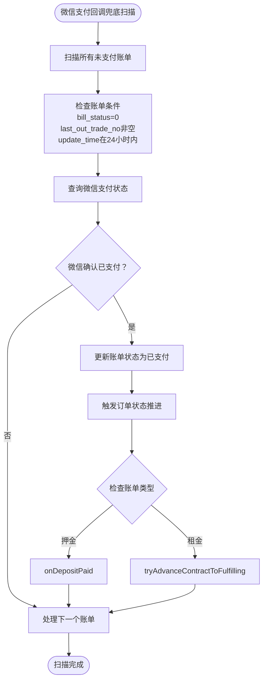

**图表来源**
- [ContractExpireTask.java:407-477](file://ruoyi-quartz/src/main/java/com/ruoyi/quartz/task/ContractExpireTask.java#L407-L477)
- [HzHouseOrderServiceImpl.java:288-316](file://ruoyi-system/src/main/java/com/ruoyi/system/service/impl/HzHouseOrderServiceImpl.java#L288-L316)
- [HzHouseOrderServiceImpl.java:360-408](file://ruoyi-system/src/main/java/com/ruoyi/system/service/impl/HzHouseOrderServiceImpl.java#L360-L408)

**章节来源**
- [ContractExpireTask.java:407-477](file://ruoyi-quartz/src/main/java/com/ruoyi/quartz/task/ContractExpireTask.java#L407-L477)
- [HzHouseOrderServiceImpl.java:288-316](file://ruoyi-system/src/main/java/com/ruoyi/system/service/impl/HzHouseOrderServiceImpl.java#L288-L316)
- [HzHouseOrderServiceImpl.java:360-408](file://ruoyi-system/src/main/java/com/ruoyi/system/service/impl/HzHouseOrderServiceImpl.java#L360-L408)

### 批量配租用户豁免政策调整
**更新** 批量配租用户豁免政策的重大调整，取消了在合同到期处理中的特殊豁免地位：

- **豁免政策取消**：批量配租用户在合同超时处理中不再享有特殊豁免，包括押金缴纳时效豁免、未签署合同超时豁免、押金已缴后3日未上传资料豁免等。
- **统一处理逻辑**：批量配租用户与普通用户在合同到期处理上遵循相同的逻辑和规则。
- **定时任务更新**：ContractExpireTask 中的批量配租用户判断逻辑已更新，取消了对批量配租用户的豁免处理。
- **状态机一致性**：所有用户类型的合同状态转换都遵循统一的规则，确保系统行为的一致性。
- **批量配租用户识别**：通过isBatchTenant方法识别批量配租用户，基于用户身份证与HzBatchTenant表的匹配记录。

**更新** 这项调整确保了系统在处理不同用户群体时的公平性，避免了批量配租用户在合同管理上的特权地位。

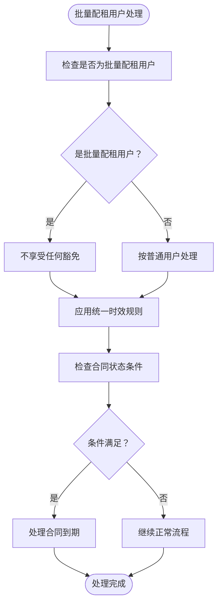

**图表来源**
- [ContractExpireTask.java:231-234](file://ruoyi-quartz/src/main/java/com/ruoyi/quartz/task/ContractExpireTask.java#L231-L234)
- [ContractExpireTask.java:269-272](file://ruoyi-quartz/src/main/java/com/ruoyi/quartz/task/ContractExpireTask.java#L269-L272)
- [ContractExpireTask.java:427-430](file://ruoyi-quartz/src/main/java/com/ruoyi/quartz/task/ContractExpireTask.java#L427-L430)
- [ContractExpireTask.java:782-796](file://ruoyi-quartz/src/main/java/com/ruoyi/quartz/task/ContractExpireTask.java#L782-L796)

**章节来源**
- [ContractExpireTask.java:231-234](file://ruoyi-quartz/src/main/java/com/ruoyi/quartz/task/ContractExpireTask.java#L231-L234)
- [ContractExpireTask.java:269-272](file://ruoyi-quartz/src/main/java/com/ruoyi/quartz/task/ContractExpireTask.java#L269-L272)
- [ContractExpireTask.java:427-430](file://ruoyi-quartz/src/main/java/com/ruoyi/quartz/task/ContractExpireTask.java#L427-L430)
- [ContractExpireTask.java:782-796](file://ruoyi-quartz/src/main/java/com/ruoyi/quartz/task/ContractExpireTask.java#L782-L796)

### 合同到期级联更新房屋订单状态
**新增** 合同到期级联更新房屋订单状态功能是本次更新的核心内容，确保合同状态变化与订单状态的同步一致性：

- **功能概述**：当合同状态变为"已到期(4)"时，系统自动将关联的房屋订单状态更新为"已过期(4)"，避免阻塞重新选房。
- **实现机制**：通过 HzContractServiceImpl 中的 expireContractAndReleaseHouse 方法实现，该方法在更新合同状态的同时，级联更新关联订单状态。
- **更新范围**：仅更新状态为"待签约(0)"、"待付押金(1)"、"待上传资料(2)"的订单，确保不会影响已完成或已取消的订单。
- **数据一致性**：通过事务保证合同状态更新与订单状态更新的原子性，避免数据不一致问题。
- **业务价值**：确保合同到期后，相关的房屋预订订单能够及时更新状态，释放房源资源，避免重复预订和状态混乱。

**更新** 合同到期级联更新房屋订单状态功能的引入，通过 HzContractServiceImpl 中的 expireContractAndReleaseHouse 方法实现，确保合同状态变化与订单状态的同步一致性，避免阻塞重新选房。

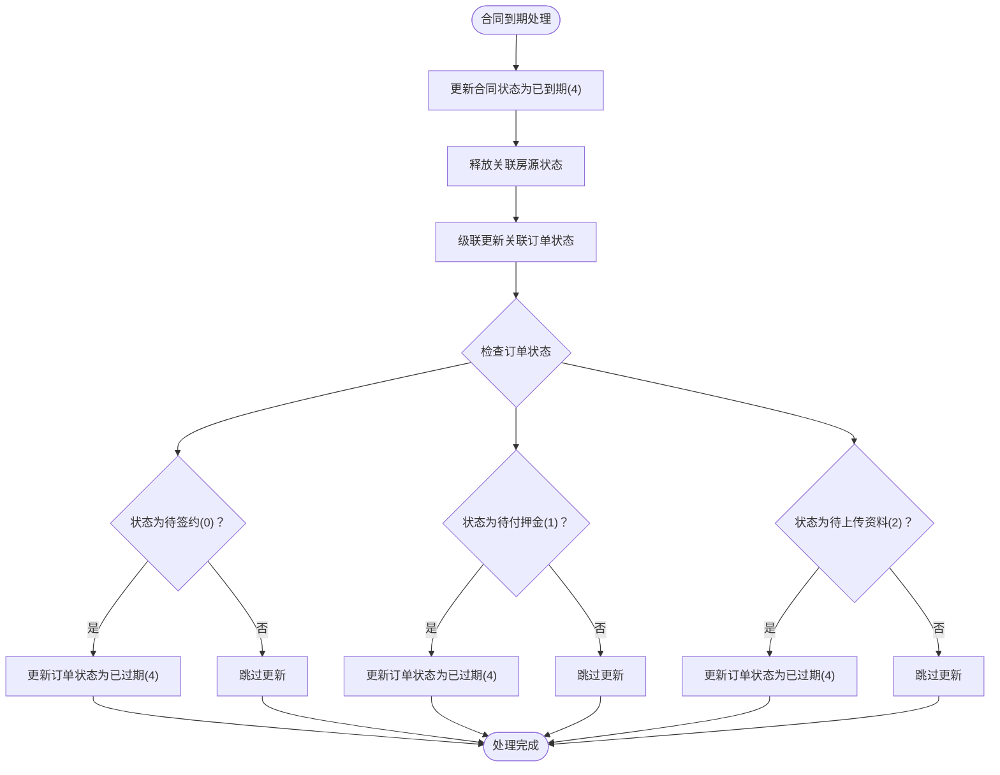

**图表来源**
- [HzContractServiceImpl.java:351-376](file://ruoyi-system/src/main/java/com/ruoyi/system/service/impl/HzContractServiceImpl.java#L351-L376)
- [HzContractServiceImpl.java:370-375](file://ruoyi-system/src/main/java/com/ruoyi/system/service/impl/HzContractServiceImpl.java#L370-L375)

**章节来源**
- [HzContractServiceImpl.java:351-376](file://ruoyi-system/src/main/java/com/ruoyi/system/service/impl/HzContractServiceImpl.java#L351-L376)
- [HzContractServiceImpl.java:370-375](file://ruoyi-system/src/main/java/com/ruoyi/system/service/impl/HzContractServiceImpl.java#L370-L375)

### 管理员强制退租功能
**新增** 管理员强制退租功能是本次更新的核心新增内容，为特殊情况下的合同管理提供了快速处理机制：

- **功能概述**：管理员强制退租允许管理员在无需租户确认的情况下直接终止合同并释放房源，适用于紧急情况或违规处理。
- **权限控制**：需要具有 "gangzhu:checkout:forceCheckout" 权限才能执行该操作。
- **状态验证**：仅允许对状态为"已签署(2)"或"履行中(3)"的合同执行强制退租。
- **业务流程**：
  1. 验证合同存在且状态符合要求
  2. 创建退租申请记录（直接标记为已完成）
  3. 创建退租记录
  4. 更新合同状态为"已解约(5)"
  5. 释放关联房源状态（从"已预订(1)"或"已出租(2)"释放为"空置(0)"）
- **审计记录**：完整的操作记录，包括操作员、时间、原因等信息。
- **前端支持**：提供 adminForceCheckout API 调用接口，支持参数传递。

**更新** 管理员强制退租功能的引入，为合同管理提供了更灵活的处理方式，特别是在紧急情况或违规处理时能够快速终止合同并释放房源。

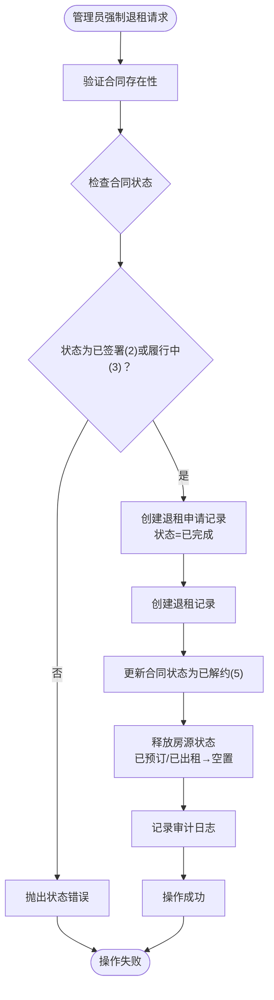

**图表来源**
- [HzCheckOutController.java:181-193](file://ruoyi-admin/src/main/java/com/ruoyi/web/controller/system/HzCheckOutController.java#L181-L193)
- [HzCheckoutServiceImpl.java:1103-1165](file://ruoyi-system/src/main/java/com/ruoyi/system/service/impl/HzCheckoutServiceImpl.java#L1103-L1165)
- [checkout.js:80-87](file://ruoyi-ui/src/api/gangzhu/checkout.js#L80-L87)

**章节来源**
- [HzCheckOutController.java:181-193](file://ruoyi-admin/src/main/java/com/ruoyi/web/controller/system/HzCheckOutController.java#L181-L193)
- [IHzCheckoutService.java:207-215](file://ruoyi-system/src/main/java/com/ruoyi/system/service/IHzCheckoutService.java#L207-L215)
- [HzCheckoutServiceImpl.java:1103-1165](file://ruoyi-system/src/main/java/com/ruoyi/system/service/impl/HzCheckoutServiceImpl.java#L1103-L1165)
- [checkout.js:80-87](file://ruoyi-ui/src/api/gangzhu/checkout.js#L80-L87)

### 合同到期处理统一化
**更新** 合同到期处理的重大变更：批量配租用户不再享有押金缴纳时效豁免，合同到期逻辑统一适用于所有用户类别：

- **批量配租用户豁免取消**：批量配租用户在合同超时处理中不再享有特殊豁免地位，与普通用户遵循相同的时效规则。
- **统一时效标准**：签署后30分钟未缴押金、未签署合同60分钟超时、押金已缴后3日未上传资料等规则统一适用于所有用户类型。
- **定时任务规则调整**：ContractExpireTask 中的批量配租用户判断逻辑已更新，取消了对批量配租用户的豁免处理。
- **状态机一致性**：所有用户类型的合同到期处理都遵循统一的状态转换规则，从"履行中"到"超时失效"的转换逻辑保持一致。

**更新** 合同到期处理的统一化确保了系统在处理不同用户群体时的公平性和一致性，避免了批量配租用户与普通用户在合同管理上的差异化待遇。

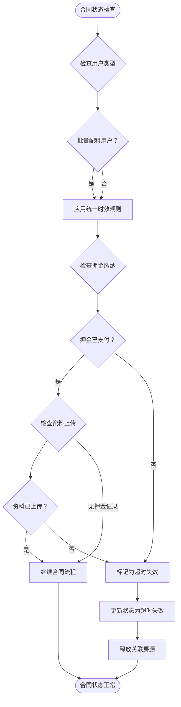

**图表来源**
- [ContractExpireTask.java:179-213](file://ruoyi-quartz/src/main/java/com/ruoyi/quartz/task/ContractExpireTask.java#L179-L213)
- [ContractExpireTask.java:220-251](file://ruoyi-quartz/src/main/java/com/ruoyi/quartz/task/ContractExpireTask.java#L220-L251)
- [ContractExpireTask.java:258-315](file://ruoyi-quartz/src/main/java/com/ruoyi/quartz/task/ContractExpireTask.java#L258-L315)

**章节来源**
- [ContractExpireTask.java:179-213](file://ruoyi-quartz/src/main/java/com/ruoyi/quartz/task/ContractExpireTask.java#L179-L213)
- [ContractExpireTask.java:220-251](file://ruoyi-quartz/src/main/java/com/ruoyi/quartz/task/ContractExpireTask.java#L220-L251)
- [ContractExpireTask.java:258-315](file://ruoyi-quartz/src/main/java/com/ruoyi/quartz/task/ContractExpireTask.java#L258-L315)

### 账单周期管理功能
**新增** 账单周期管理功能是本次更新的核心内容，通过 HzContract 实体的 payment_cycle 字段支持多种支付周期配置：

- 支付周期字段：HzContract 实体新增 payment_cycle 字段，支持月付(1)、季付(3)、半年付(6)、年付(12)等支付周期配置。
- 合同模板集成：HzContractTemplate 实体同样支持 payment_cycle 字段，确保模板层面的支付周期配置。
- 支付周期转换：HzContractAppController 提供 convertPaymentCycleToCode 方法，将英文支付周期字符串转换为对应的数字代码。
- 账单生成：在合同签署完成后，系统根据支付周期自动生成相应的账单周期，支持月度、季度、半年度、年度的账单生成。
- 周期格式化：前端账单页面支持将账单周期格式化为 MM.DD-MM.DD 或 YYYY年MM月 等用户友好的显示格式。

**更新** 账单周期管理功能的引入，通过 HzContract 和 HzContractTemplate 实体的 payment_cycle 字段支持，以及 HzContractAppController 的支付周期转换逻辑，为后续的账单生成和支付管理奠定了基础。

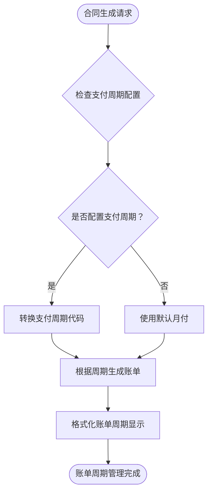

**图表来源**
- [HzContract.java:107](file://ruoyi-system/src/main/java/com/ruoyi/system/domain/HzContract.java#L107)
- [HzContractTemplate.java:42](file://ruoyi-system/src/main/java/com/ruoyi/system/domain/HzContractTemplate.java#L42)
- [HzContractAppController.java:1023-1040](file://ruoyi-admin/src/main/java/com/ruoyi/web/controller/h5/HzContractAppController.java#L1023-L1040)
- [bill.vue:296-333](file://uniapp-h5/subpkg/affairs/bill.vue#L296-L333)

**章节来源**
- [HzContract.java:107](file://ruoyi-system/src/main/java/com/ruoyi/system/domain/HzContract.java#L107)
- [HzContractTemplate.java:42](file://ruoyi-system/src/main/java/com/ruoyi/system/domain/HzContractTemplate.java#L42)
- [HzContractAppController.java:1023-1040](file://ruoyi-admin/src/main/java/com/ruoyi/web/controller/h5/HzContractAppController.java#L1023-L1040)
- [bill.vue:296-333](file://uniapp-h5/subpkg/affairs/bill.vue#L296-L333)

### 支付方式可视化功能
**新增** 支付方式可视化功能显著提升了用户界面的易用性和信息透明度：

- 支付方式字段：HzBill 和 HzEnterpriseBill 实体均包含 payMethod 字段，支持多种支付方式的配置和展示。
- 账单类型映射：前端 bill.vue 页面根据账单类型动态映射账单周期显示，如押金、房租、水费、电费、燃气费、物业费等。
- 周期格式化：支持将账单周期格式化为 MM.DD-MM.DD 或 YYYY年MM月 等用户友好的显示格式。
- 企业账单展示：enterprise.vue 页面展示企业账单的详细信息，包括企业名称、联系人、入驻日期、截止日期、房源数量、计算月数等。
- 状态可视化：账单状态通过不同的样式和颜色进行可视化展示，如待支付、已支付、待审核等状态标识。

**更新** 支付方式可视化功能的引入，通过 HzBill 和 HzEnterpriseBill 实体的 payMethod 字段支持，以及前端页面的周期格式化和状态展示，显著提升了用户界面的易用性和信息透明度。

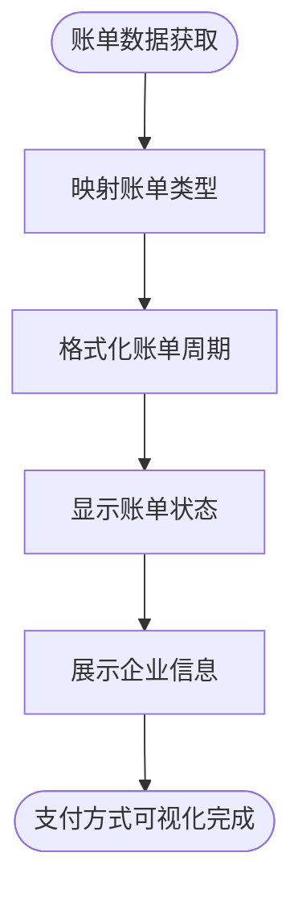

**图表来源**
- [HzBill.java:124](file://ruoyi-system/src/main/java/com/ruoyi/system/domain/HzBill.java#L124)
- [HzEnterpriseBill.java:118](file://ruoyi-system/src/main/java/com/ruoyi/system/domain/HzEnterpriseBill.java#L118)
- [bill.vue:296-333](file://uniapp-h5/subpkg/affairs/bill.vue#L296-L333)
- [enterprise.vue:27-61](file://uniapp-h5/subpkg/service/enterprise.vue#L27-L61)

**章节来源**
- [HzBill.java:124](file://ruoyi-system/src/main/java/com/ruoyi/system/domain/HzBill.java#L124)
- [HzEnterpriseBill.java:118](file://ruoyi-system/src/main/java/com/ruoyi/system/domain/HzEnterpriseBill.java#L118)
- [bill.vue:296-333](file://uniapp-h5/subpkg/affairs/bill.vue#L296-L333)
- [enterprise.vue:27-61](file://uniapp-h5/subpkg/service/enterprise.vue#L27-L61)

### 日期计算逻辑与数学精度
**新增** 日期计算逻辑的数学精度改进是本次更新的核心内容，确保租期结束日期计算的准确性：

- **后端日期计算修正**：将租期结束日期计算从"加一个月"改为"加一个月后减一天"，使用 `plusMonths(rentMonths).minusDays(1)` 的计算方式，确保日期边界的一致性。
- **数学精度保证**：通过减一天的操作，避免了不同月份天数差异导致的日期计算误差，例如1月31日加1个月应该得到2月28日（或2月29日闰年），而不是错误的3月1日。
- **前后端逻辑一致性**：前端固定显示12个月租期，后端采用统一的日期计算逻辑，确保前后端在租期结束日期计算上的完全一致。
- **续租模式日期处理**：续租模式下，生效日期为原合同到期日，结束日期同样采用统一的日期计算逻辑，确保续租合同的日期连续性。

**更新** 日期计算逻辑的数学精度改进确保了系统在处理不同月份天数差异时的准确性，避免了因月份天数不等导致的日期边界问题。

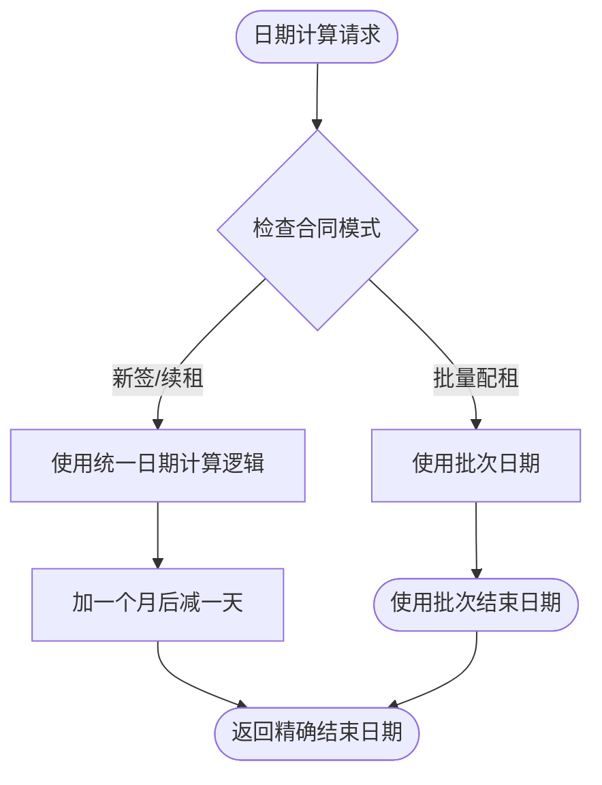

**图表来源**
- [HzContractAppController.java:443-446](file://ruoyi-admin/src/main/java/com/ruoyi/web/controller/h5/HzContractAppController.java#L443-L446)
- [HzContractAppController.java:851-853](file://ruoyi-admin/src/main/java/com/ruoyi/web/controller/h5/HzContractAppController.java#L851-L853)

**章节来源**
- [HzContractAppController.java:443-446](file://ruoyi-admin/src/main/java/com/ruoyi/web/controller/h5/HzContractAppController.java#L443-L446)
- [HzContractAppController.java:851-853](file://ruoyi-admin/src/main/java/com/ruoyi/web/controller/h5/HzContractAppController.java#L851-L853)

### 前端倒计时显示机制
**新增** 前端倒计时显示机制显著提升了用户体验，通过 contract.vue 页面实现完整的倒计时管理：

- **倒计时定时器管理**：实现通用定时器启动方法 `_startTimer`，支持不同类型倒计时的处理和状态更新
- **预订倒计时**：待签署(pending)且有 bookingExpireTime 的合同显示预订倒计时
- **押金支付倒计时**：已签署未付押金且有 lockExpireTime 的合同显示押金支付倒计时
- **倒计时结束处理**：倒计时结束后自动标记为失效状态并刷新页面获取最新状态
- **乐观更新机制**：倒计时结束时前端乐观更新状态，3秒后再次刷新确保后端定时任务已执行

**更新** 前端倒计时显示机制的引入，通过 contract.vue 页面的定时器管理，显著提升了用户界面的实时性和用户体验。

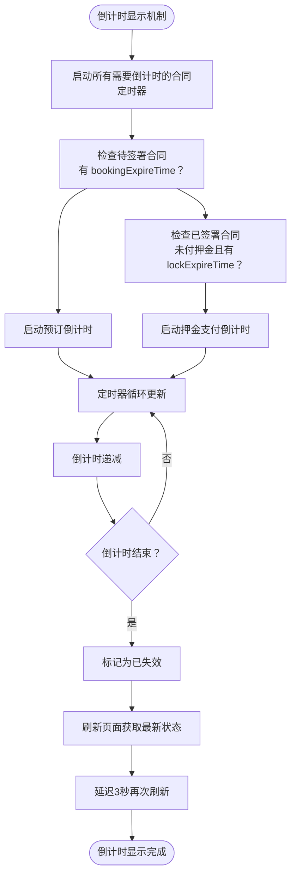

**图表来源**
- [contract.vue:539-590](file://uniapp-h5/subpkg/affairs/contract.vue#L539-L590)

**章节来源**
- [contract.vue:539-590](file://uniapp-h5/subpkg/affairs/contract.vue#L539-L590)

### 前端租期选择界面简化
**新增** 前端合同签署界面的简化优化提升了用户体验和系统一致性：

- **固定12个月租期**：前端固定显示12个月租期，移除了原有的租期选择picker组件，简化了用户操作流程。
- **租期选择组件移除**：原有的租期下拉选择组件（包含1-12个月选项）已被移除，避免了用户选择不同租期导致的日期计算不一致问题。
- **用户体验优化**：固定12个月租期的设计减少了用户的选择负担，特别是在批量配租模式下，确保所有用户采用相同的租期长度。
- **前后端逻辑一致性**：前端固定12个月租期与后端统一的日期计算逻辑保持一致，避免了前后端在租期计算上的分歧。

**更新** 前端租期选择界面的简化优化提升了用户体验，移除了可能引起日期计算不一致的租期选择组件，确保系统在租期处理上的统一性。

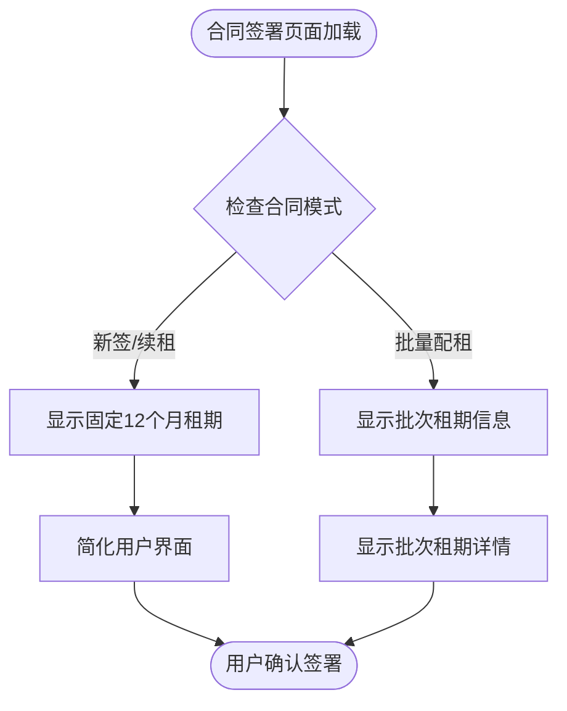

**图表来源**
- [sign.vue:87-90](file://uniapp-h5/pages/contract/sign.vue#L87-L90)
- [sign.vue:202-204](file://uniapp-h5/pages/contract/sign.vue#L202-L204)

**章节来源**
- [sign.vue:87-90](file://uniapp-h5/pages/contract/sign.vue#L87-L90)
- [sign.vue:202-204](file://uniapp-h5/pages/contract/sign.vue#L202-L204)

### 批量配租模式与批次日期检测
批量配租模式是港好住信息系统的重要创新功能，通过智能检测房源所属批次并自动应用批次配置：

- 批次日期检测：通过 HzBatchHouseMapper 查询房源所属批次的入驻开始日期和结束日期，优先使用批次配置而非默认逻辑。
- 批次优惠识别：自动检测房源是否属于有优惠的配租批次，支持免租期数等优惠政策。
- 合同日期处理：在批量配租模式下，合同生效日期使用批次入驻开始日期，结束日期使用批次入驻结束日期。
- 房源状态管理：批量配租批次的房源在审批通过后状态从"空置"变为"已预订"，支持批量释放机制。
- 房源占用冲突检测：通过 checkHouseOccupation 方法检测房源是否被其他活跃批次占用，避免重复分配。

**更新** 新增批量配租模式的核心功能，包括批次日期检测、优惠识别和自动合同条款配置。特别增强了房屋状态管理机制，包括对"修缮中"状态的适配和对房源占用冲突的检测处理。

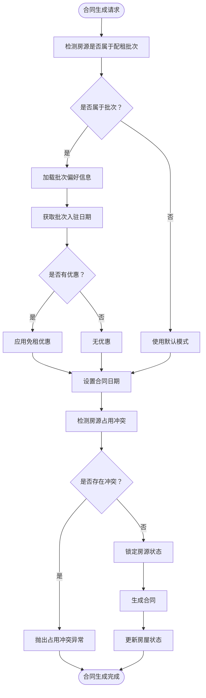

**图表来源**
- [HzContractAppController.java:366-482](file://ruoyi-admin/src/main/java/com/ruoyi/web/controller/h5/HzContractAppController.java#L366-L482)
- [HzContractAppController.java:562-759](file://ruoyi-admin/src/main/java/com/ruoyi/web/controller/h5/HzContractAppController.java#L562-L759)
- [HzBatchHouseMapper.xml:7-22](file://ruoyi-system/src/main/resources/mapper/system/HzBatchHouseMapper.xml#L7-L22)
- [HzBatchAllocationServiceImpl.java:664-718](file://ruoyi-system/src/main/java/com/ruoyi/system/service/impl/HzBatchAllocationServiceImpl.java#L664-718)

**章节来源**
- [HzContractAppController.java:366-482](file://ruoyi-admin/src/main/java/com/ruoyi/web/controller/h5/HzContractAppController.java#L366-L482)
- [HzContractAppController.java:562-759](file://ruoyi-admin/src/main/java/com/ruoyi/web/controller/h5/HzContractAppController.java#L562-L759)
- [HzBatchHouseMapper.java:17-23](file://ruoyi-system/src/main/java/com/ruoyi/system/mapper/HzBatchHouseMapper.java#L17-L23)
- [HzBatchHouseMapper.xml:7-22](file://ruoyi-system/src/main/resources/mapper/system/HzBatchHouseMapper.xml#L7-L22)
- [HzBatchAllocationServiceImpl.java:664-718](file://ruoyi-system/src/main/java/com/ruoyi/system/service/impl/HzBatchAllocationServiceImpl.java#L664-718)

### HzContract 实体与业务逻辑
- 关键字段：合同编号、类型、模板ID、租户与房源信息、金额与期限、合同内容/文件、电子签流程ID、签署状态、是否续租、续签合同ID、批次ID、免租期数、支付周期等。
- 业务能力：
  - 合同生成与编号：默认草稿状态，自动生成合同编号。
  - 查询与分页：支持按租户、房源、项目、合同号、类型、状态等条件查询与分页。
  - 锁定房源与插入合同：原子性地将房源状态从"可选"置为"锁定"，再插入合同。
  - 到期与释放：到期后将合同置为"超时失效"，并释放关联房源。
  - 有效合同查询：按状态过滤，支持"已签署/履行中"。
  - 退租释放：退租确认后，合同状态更新为"已解约"，并释放关联房源。
  - 批量配租支持：支持批次ID和免租期数字段，记录批量配租相关信息。
  - 支付周期支持：支持月付、季付、半年付、年付等多种支付周期配置。
  - **级联订单更新**：到期后自动更新关联订单状态为"已过期"，避免阻塞重新选房。
  - **倒计时计算优化**：已签署待付押金倒计时使用"签署时间 + 30分钟"计算逻辑。

**更新** 新增批量配租相关字段支持，包括批次ID、免租期数等，完善批量配租模式下的合同记录能力。批量配租模式下的合同状态管理更加复杂，需要与房屋状态管理紧密配合。新增支付周期字段支持，为后续的账单生成和支付管理奠定基础。新增合同到期级联更新订单状态功能，确保合同状态变化与订单状态的同步一致性。优化倒计时计算逻辑，提升用户体验。

**章节来源**
- [HzContract.java:19-606](file://ruoyi-system/src/main/java/com/ruoyi/system/domain/HzContract.java#L19-L606)
- [HzContractServiceImpl.java:245-332](file://ruoyi-system/src/main/java/com/ruoyi/system/service/impl/HzContractServiceImpl.java#L245-L332)
- [HzContractMapper.java:17-36](file://ruoyi-system/src/main/java/com/ruoyi/system/mapper/HzContractMapper.java#L17-L36)
- [HzCheckoutServiceImpl.java:648-664](file://ruoyi-system/src/main/java/com/ruoyi/system/service/impl/HzCheckoutServiceImpl.java#L648-L664)
- [HzContractServiceImpl.java:370-375](file://ruoyi-system/src/main/java/com/ruoyi/system/service/impl/HzContractServiceImpl.java#L370-L375)

### HzBatchAllocation 实体与批量配租管理
- 关键字段：批次ID、批次编号、批次名称、企业ID/名称、联系人、联系电话、项目ID、房源数量、已分配数量、申请时间、审批状态、审批人、审批时间、批次状态、优惠类型、免租期数、入驻开始/结束日期等。
- 业务能力：
  - 批次创建与管理：支持批次申请、审批、状态管理。
  - 批次审批：支持审批通过时自动锁定房源状态，审批驳回时释放房源状态。
  - 批次状态控制：支持进行中、已完成、已作废等状态管理。
  - 优惠配置：支持免租期数等优惠政策配置。
  - 批次删除：支持逻辑删除并释放关联房源状态。

**更新** 新增了对"修缮中"状态的适配，当批次被驳回时，已锁定的"已预订"状态会回退到"维修中"状态，确保状态的一致性。

**章节来源**
- [HzBatchAllocation.java:14-333](file://ruoyi-system/src/main/java/com/ruoyi/system/domain/HzBatchAllocation.java#L14-L333)
- [HzBatchAllocationServiceImpl.java:79-196](file://ruoyi-system/src/main/java/com/ruoyi/system/service/impl/HzBatchAllocationServiceImpl.java#L79-L196)

### HzBatchHouse 实体与房源分配管理
- 关键字段：主键ID、批次ID、房源ID、房源编号、分配状态、租户ID、分配时间、删除标志等。
- 业务能力：
  - 批次房源关联：建立批次与房源的多对多关系。
  - 分配状态管理：支持未分配、已分配状态跟踪。
  - 租户关联：记录分配给具体租户的信息。
  - 逻辑删除：支持软删除机制。

**章节来源**
- [HzBatchHouse.java:8-122](file://ruoyi-system/src/main/java/com/ruoyi/system/domain/HzBatchHouse.java#L8-L122)
- [HzBatchAllocationServiceImpl.java:512-572](file://ruoyi-system/src/main/java/com/ruoyi/system/service/impl/HzBatchAllocationServiceImpl.java#L512-L572)

### HzBatchTenant 实体与人员管理
- 关键字段：主键ID、批次ID、租户姓名、身份证号、手机号、工号、部门名称、房源ID、分配状态、分配时间、删除标志等。
- 业务能力：
  - 批次人员管理：记录参与批量配租的人员信息。
  - 人员与房源关联：支持人员分配到具体房源。
  - 分配状态跟踪：支持未分配、已分配状态管理。
  - 逻辑删除：支持软删除机制。

**章节来源**
- [HzBatchTenant.java:8-158](file://ruoyi-system/src/main/java/com/ruoyi/system/domain/HzBatchTenant.java#L8-L158)
- [HzBatchAllocationServiceImpl.java:574-607](file://ruoyi-system/src/main/java/com/ruoyi/system/service/impl/HzBatchAllocationServiceImpl.java#L574-L607)

### HzContractTemplate 实体与模板管理
- 关键字段：模板名称、编码、类型、内容、付款周期、合同期限、押金与违约金规则、版本号、默认状态、状态与删除标志。
- 业务能力：
  - 模板查询与分页：按类型、状态等条件查询与分页。
  - 模板新增/更新/删除：支持逻辑删除与版本控制。
  - 默认模板与版本：通过版本号与默认标记实现模板演进与选择。
  - 支付周期配置：支持月付、季付、半年付、年付等支付周期模板。

**章节来源**
- [HzContractTemplate.java:18-228](file://ruoyi-system/src/main/java/com/ruoyi/system/domain/HzContractTemplate.java#L18-L228)
- [HzContractTemplateServiceImpl.java:20-119](file://ruoyi-system/src/main/java/com/ruoyi/system/service/impl/HzContractTemplateServiceImpl.java#L20-L119)
- [HzContractTemplateMapper.java:17-41](file://ruoyi-system/src/main/java/com/ruoyi/system/mapper/HzContractTemplateMapper.java#L17-L41)
- [03-合同管理.md:42-89](file://docs/数据字典/03-合同管理.md#L42-L89)

### HzContractSignature 实体与电子签名
- 关键字段：合同ID、签名人ID/姓名、签名人类型（租户/房东/管理员）、签名图片、签名时间、IP与设备信息、签名状态与删除标志。
- 业务能力：
  - 记录每次签名的主体、时间、设备与IP，支撑审计与合规。
  - 与电子签流程联动，记录电子签生成的签名图片与状态。

**章节来源**
- [HzContractSignature.java:16-174](file://ruoyi-system/src/main/java/com/ruoyi/system/domain/HzContractSignature.java#L16-L174)

### 电子签章服务与模板填充
- 模板填充：根据合同与用户信息，将18个单行/数字控件与设施控件映射到 e签宝 模板，确保金额、日期、地址、设施数量等字段准确填充。
- 签署流创建：生成 PDF 文件后创建签署流，配置甲方（平台企业）自动盖章与乙方手动签名位置，设置自动完成与回调通知。
- 状态同步：支持回调与主动查询两种方式，完成电子签后更新合同状态、生成账单与入住记录，并记录签署时间与下载链接。

**章节来源**
- [EsignServiceImpl.java:180-288](file://ruoyi-system/src/main/java/com/ruoyi/system/service/impl/EsignServiceImpl.java#L180-L288)
- [EsignServiceImpl.java:718-796](file://ruoyi-system/src/main/java/com/ruoyi/system/service/impl/EsignServiceImpl.java#L718-L796)

### 前端用户体验与流程引导
- 步骤化引导：预览 → 实名认证 → e签宝签署 → 等待完成 → 成功。
- 实名认证：若用户未完成实名，引导跳转至认证页面，认证完成后继续签署。
- 倒计时与过期处理：针对房源预订倒计时，提供视觉警示与过期处理。
- 轮询与手动刷新：H5 端轮询或手动刷新检查签署状态，确保状态一致性。
- 体验优化：按钮禁用、加载提示、错误提示与返回路径。
- 账单周期展示：前端账单页面支持账单周期的可视化展示，提升用户界面的易用性和信息透明度。
- **倒计时显示优化**：contract.vue 页面实现完整的倒计时显示机制，提升用户体验。

**更新** 前端租期选择界面的简化优化提升了用户体验，固定12个月租期的设计减少了用户的选择负担，特别是在批量配租模式下，确保所有用户采用相同的租期长度。新增账单周期可视化功能，通过前端页面的周期格式化展示，显著提升了用户界面的易用性和信息透明度。新增倒计时显示机制，通过 contract.vue 页面的定时器管理，显著提升了用户界面的实时性和用户体验。

**章节来源**
- [sign.vue:428-617](file://uniapp-h5/pages/contract/sign.vue#L428-L617)
- [contract.vue:539-590](file://uniapp-h5/subpkg/affairs/contract.vue#L539-L590)

### 管理端控制与扩展能力
- 列表与导出：支持分页查询、导出、按条件筛选。
- 审核：仅允许对草稿状态合同进行审核，更新为已签署并可附加合同文件。
- 模板调试：提供查询 e签宝 合同模板控件定义的能力，便于核对传参。
- 合同详情：提供账单与文档列表查询，支持获取电子 PDF 查看链接。
- 批量配租管理：支持批量配租批次的创建、审批、状态管理等功能。
- 支付方式管理：支持多种支付方式的配置和管理，为账单支付提供支持。
- **管理员强制退租**：提供 adminForceCheckout 接口，支持管理员直接终止合同并释放房源。
- **合同到期级联更新**：合同到期后自动更新关联订单状态为"已过期"，避免阻塞重新选房。
- **倒计时显示管理**：HzContractAppController 中实现倒计时计算逻辑，支持预订倒计时和押金支付倒计时。

**章节来源**
- [HzContractController.java:52-300](file://ruoyi-admin/src/main/java/com/ruoyi/web/controller/system/HzContractController.java#L52-L300)
- [HzCheckOutController.java:181-193](file://ruoyi-admin/src/main/java/com/ruoyi/web/controller/system/HzCheckOutController.java#L181-L193)

### 定时任务与到期处理
- ContractExpireTask：定期扫描合同状态，推进到期合同并释放房源，保证系统状态与实际业务一致。
- **批量配租用户处理**：批量配租用户不再享有特殊豁免，统一适用所有用户的到期处理规则。
- **合同到期级联更新**：通过 HzContractServiceImpl 中的 expireContractAndReleaseHouse 方法实现，确保合同状态变化与订单状态的同步一致性。
- **预订单过期处理**：HouseOrderExpireTask 定时任务每分钟检查过期的选房预订单，释放被锁定的房源。
- **微信支付回调兜底**：recoverLostWechatNotify方法扫描所有账单类型，包括押金、租金、水电燃、物业费等。

**章节来源**
- [ContractExpireTask.java](file://ruoyi-quartz/src/main/java/com/ruoyi/quartz/task/ContractExpireTask.java)
- [HzContractServiceImpl.java:370-375](file://ruoyi-system/src/main/java/com/ruoyi/system/service/impl/HzContractServiceImpl.java#L370-L375)
- [HouseOrderExpireTask.java:1-40](file://ruoyi-quartz/src/main/java/com/ruoyi/quartz/task/HouseOrderExpireTask.java#L1-L40)

### 退租业务流程与房屋状态释放
**新增** 退租业务流程作为合同生命周期的重要组成部分，确保房屋库存管理的准确性：

- 退租申请：租户发起退租申请，填写计划退租日期、退租原因等信息。
- 审批流程：管理员审核退租申请，计算相关费用（水电费、物业费、违约金等）。
- 退租确认：租户确认退租信息，完成房屋验收与设施检查。
- 状态更新：退租确认后，合同状态更新为"已解约"。
- 房屋释放：系统自动将关联房源状态从"已预订/已出租"释放为"空置"。
- 退款处理：生成退款申请，管理员审核后完成押金退还。

**更新** 新增管理员强制退租功能对退租流程的影响：管理员强制退租可以直接绕过租户申请和审批流程，直接创建已完成的退租申请记录并释放房源，为紧急情况提供了快速处理机制。

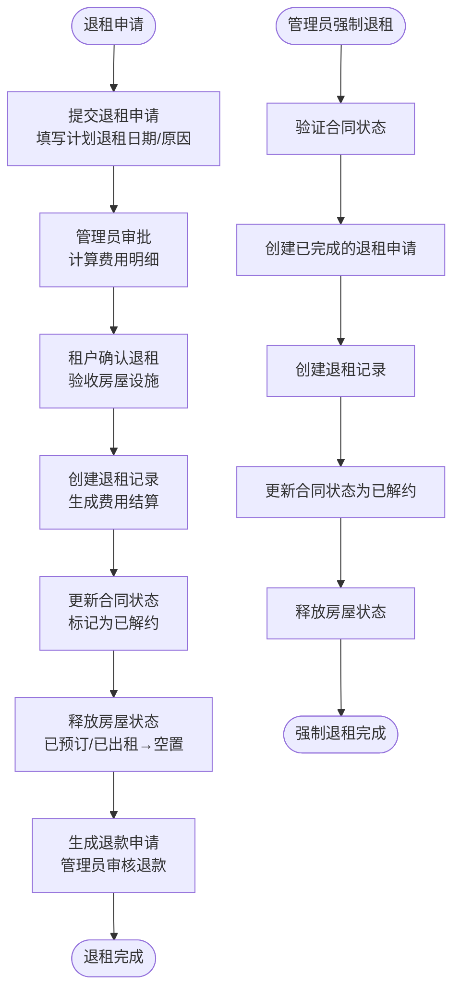

**图表来源**
- [HzCheckoutServiceImpl.java:560-664](file://ruoyi-system/src/main/java/com/ruoyi/system/service/impl/HzCheckoutServiceImpl.java#L560-L664)
- [HzCheckoutApply.java:71-73](file://ruoyi-system/src/main/java/com/ruoyi/system/domain/HzCheckoutApply.java#L71-L73)
- [HzCheckoutRecord.java:69-70](file://ruoyi-system/src/main/java/com/ruoyi/system/domain/HzCheckoutRecord.java#L69-L70)
- [HzCheckoutServiceImpl.java:1103-1165](file://ruoyi-system/src/main/java/com/ruoyi/system/service/impl/HzCheckoutServiceImpl.java#L1103-L1165)

**章节来源**
- [HzCheckoutServiceImpl.java:54-879](file://ruoyi-system/src/main/java/com/ruoyi/system/service/impl/HzCheckoutServiceImpl.java#L54-L879)
- [HzCheckoutApply.java:16-242](file://ruoyi-system/src/main/java/com/ruoyi/system/domain/HzCheckoutApply.java#L16-L242)
- [HzCheckoutRecord.java:17-364](file://ruoyi-system/src/main/java/com/ruoyi/system/domain/HzCheckoutRecord.java#L17-L364)
- [04-入住退租.md:64-93](file://docs/数据字典/04-入住退租.md#L64-L93)
- [HzCheckoutServiceImpl.java:1103-1165](file://ruoyi-system/src/main/java/com/ruoyi/system/service/impl/HzCheckoutServiceImpl.java#L1103-L1165)

### 批量配租模式下的房屋状态管理
**新增** 批量配租模式下的房屋状态管理是系统的重要组成部分，确保房源状态的准确流转：

- 房源状态定义：支持"空置(0)、已预订(1)、已出租(2)、维修中(3)、下架(4)"五种状态。
- 批次审批状态流转：
  - 审批通过：将"空置"状态的房源更新为"已预订"(1)
  - 审批驳回：将"已预订"状态的房源回退为"维修中"(3)，避免误释放正在履约的合同
- 房源占用冲突检测：防止同一房源被多个活跃批次同时占用
- 批次删除状态回退：删除批次时，将"已预订"状态回退为"维修中"(3)

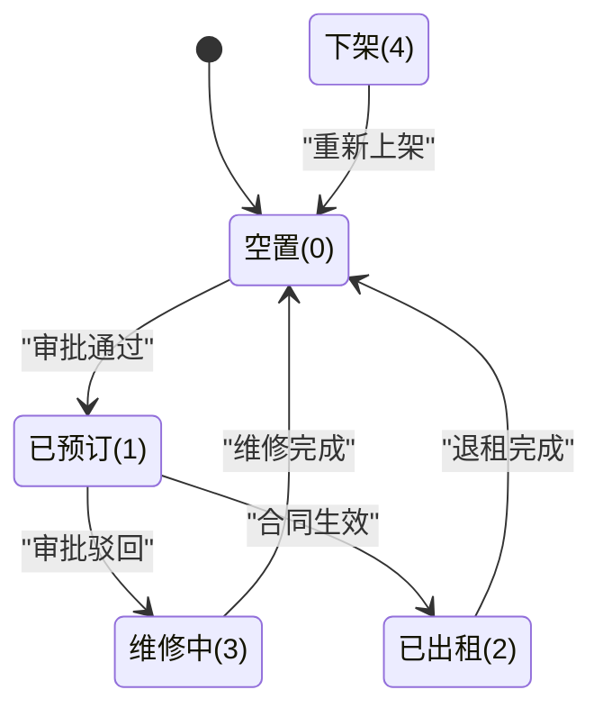

**图表来源**
- [HzHouse.java:114-117](file://ruoyi-system/src/main/java/com/ruoyi/system/domain/HzHouse.java#L114-L117)
- [HzBatchAllocationServiceImpl.java:168-196](file://ruoyi-system/src/main/java/com/ruoyi/system/service/impl/HzBatchAllocationServiceImpl.java#L168-L196)
- [HzBatchAllocationServiceImpl.java:726-752](file://ruoyi-system/src/main/java/com/ruoyi/system/service/impl/HzBatchAllocationServiceImpl.java#L726-L752)

**章节来源**
- [HzHouse.java:114-117](file://ruoyi-system/src/main/java/com/ruoyi/system/domain/HzHouse.java#L114-L117)
- [HzBatchAllocationServiceImpl.java:168-196](file://ruoyi-system/src/main/java/com/ruoyi/system/service/impl/HzBatchAllocationServiceImpl.java#L168-L196)
- [HzBatchAllocationServiceImpl.java:726-752](file://ruoyi-system/src/main/java/com/ruoyi/system/service/impl/HzBatchAllocationServiceImpl.java#L726-L752)

### 批量配租用户身份识别与豁免判定
**新增** 批量配租用户身份识别机制是本次更新的关键技术实现，确保合同到期处理的统一化：

- **身份识别机制**：通过 HzQualificationController 的 isBatchTenant 接口判断用户是否为批量配租用户。
- **识别依据**：基于用户身份证号码在 HzBatchTenant 表中的匹配记录进行判断。
- **豁免判定逻辑**：ContractExpireTask 中的 isBatchTenant 方法用于判断合同是否涉及批量配租用户。
- **统一处理原则**：批量配租用户在合同到期处理中不再享有特殊豁免，与普通用户遵循相同的时效规则。
- **预览用户豁免**：系统支持预览手机号白名单机制，预览用户可直接豁免资格校验。

**更新** 批量配租用户身份识别机制的引入，通过 HzQualificationController 和 ContractExpireTask 的协同工作，实现了对批量配租用户的精准识别和统一处理。

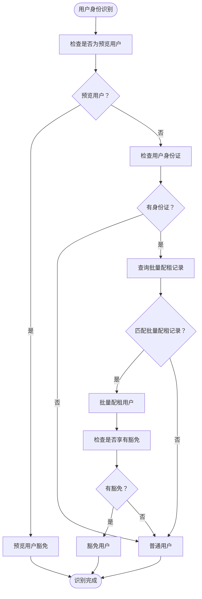

**图表来源**
- [HzQualificationController.java:73-99](file://ruoyi-admin/src/main/java/com/ruoyi/web/controller/h5/HzQualificationController.java#L73-L99)
- [ContractExpireTask.java:623-634](file://ruoyi-quartz/src/main/java/com/ruoyi/quartz/task/ContractExpireTask.java#L623-L634)

**章节来源**
- [HzQualificationController.java:73-99](file://ruoyi-admin/src/main/java/com/ruoyi/web/controller/h5/HzQualificationController.java#L73-L99)
- [ContractExpireTask.java:623-634](file://ruoyi-quartz/src/main/java/com/ruoyi/quartz/task/ContractExpireTask.java#L623-L634)

### HzHouseOrder 实体与订单状态管理
**新增** HzHouseOrder 实体是本次更新新增的核心组件，专门用于管理房屋预订订单的状态：

- 关键字段：订单ID、订单号、租户ID、房源ID、订单状态、合同ID、锁定过期时间、资料上传过期时间等。
- 订单状态定义：包含"待签约(0)、待付押金(1)、待上传资料(2)、已完成(3)、已过期(4)、已取消(5)"六种状态。
- 业务能力：
  - 订单创建与锁定：支持房屋预订锁定和过期时间管理，预订单锁定时间从10分钟延长至30分钟。
  - 订单状态推进：支持从待签约到待付押金、待上传资料、已完成的状态推进。
  - 订单过期处理：自动处理过期订单并释放房源。
  - 合同关联：与合同建立关联关系，支持合同到期后的订单状态更新。
  - 批量配租支持：支持批量配租用户的订单管理。
  - 倒计时管理：支持锁定过期时间和资料上传过期时间的计算与显示。

**更新** HzHouseOrder 实体的引入，为房屋预订订单管理提供了完整的数据模型支持，特别是"已过期(4)"状态的引入，为合同到期后的订单处理提供了明确的状态标识。预订单锁定过期时间从10分钟延长至30分钟，提升了用户体验。

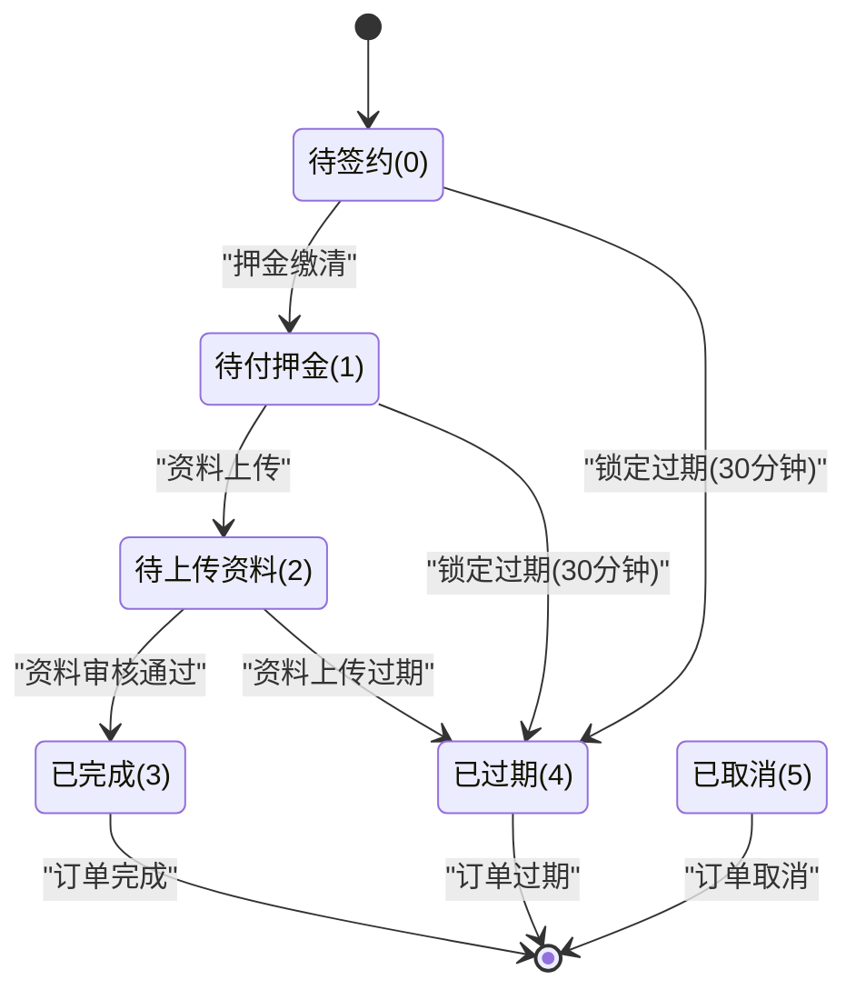

**图表来源**
- [HzHouseOrder.java:52-55](file://ruoyi-system/src/main/java/com/ruoyi/system/domain/HzHouseOrder.java#L52-L55)

**章节来源**
- [HzHouseOrder.java:52-55](file://ruoyi-system/src/main/java/com/ruoyi/system/domain/HzHouseOrder.java#L52-L55)

## 依赖关系分析
- HzContractServiceImpl 依赖 HzContractMapper、HzHouseMapper、HzProjectMapper、HzCheckoutApplyMapper，负责合同查询、分页、状态推进与到期释放。
- EsignServiceImpl 依赖多个 Mapper 与 IHzCheckInService、IHzUserMessageService，负责电子签流程、模板填充、状态同步与账单生成。
- HzContractController 依赖 IHzContractService、IHzDocumentService、EsignService，提供管理端操作入口与扩展查询。
- HzBatchAllocationServiceImpl 依赖批量配租相关 Mapper，负责批量配租批次的创建、审批、状态管理与房源锁定释放。
- HzContractAppController 依赖 HzBatchHouseMapper 进行批次日期检测，支持批量配租模式下的智能合同生成，新增倒计时计算逻辑。
- HzCheckoutServiceImpl 依赖退租相关 Mapper，负责退租申请、审批、确认与房屋释放的完整流程，新增管理员强制退租功能。
- HzBatchAllocationServiceImpl 依赖 HzHouseMapper 进行房屋状态管理，确保批量配租模式下的状态一致性。
- HzBillMapper 和 HzEnterpriseBillMapper 依赖 HzBill 和 HzEnterpriseBill 实体，负责账单数据的持久化管理。
- HzPaymentMapper 依赖 HzPayment 实体，负责支付方式的数据持久化管理。
- HzHouseOrderMapper 依赖 HzHouseOrder 实体，负责房屋订单数据的持久化管理。
- HzHouseOrderServiceImpl 依赖 HzHouseOrderMapper、HzHouseMapper、HzContractMapper 等，负责订单状态管理与合同推进，新增倒计时计算和过期处理逻辑。
- HzQualificationController 提供批量配租用户身份识别接口，ContractExpireTask 依赖此接口进行用户豁免判定。
- HzCheckOutController 提供 adminForceCheckout 接口，HzCheckoutServiceImpl 实现强制退租业务逻辑，ruoyi-ui 提供前端 API 调用支持。
- **合同到期级联更新**：HzContractServiceImpl 依赖 HzHouseOrderMapper 实现合同到期后的订单状态更新，确保数据一致性。
- **倒计时显示机制**：HzContractAppController 与 contract.vue 页面协同实现倒计时显示，提升用户体验。
- **微信支付回调兜底**：ContractExpireTask 依赖 WechatPayService 进行支付状态查询，支持所有账单类型的回调兜底处理。

**更新** 新增了合同到期处理增强相关的依赖关系，包括ContractExpireTask对所有账单类型的覆盖、批量配租用户豁免政策的调整、以及微信支付回调兜底机制的完善。

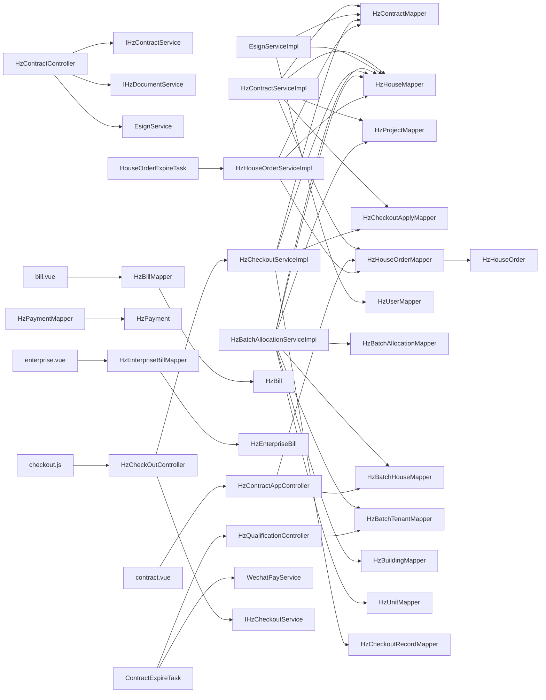

**图表来源**
- [HzContractServiceImpl.java:35-334](file://ruoyi-system/src/main/java/com/ruoyi/system/service/impl/HzContractServiceImpl.java#L35-L334)
- [EsignServiceImpl.java:54-74](file://ruoyi-system/src/main/java/com/ruoyi/system/service/impl/EsignServiceImpl.java#L54-L74)
- [HzContractController.java:36-51](file://ruoyi-admin/src/main/java/com/ruoyi/web/controller/system/HzContractController.java#L36-L51)
- [HzBatchAllocationServiceImpl.java:46-68](file://ruoyi-system/src/main/java/com/ruoyi/system/service/impl/HzBatchAllocationServiceImpl.java#L46-L68)
- [HzContractAppController.java:366-482](file://ruoyi-admin/src/main/java/com/ruoyi/web/controller/h5/HzContractAppController.java#L366-L482)
- [HzCheckoutServiceImpl.java:54-879](file://ruoyi-system/src/main/java/com/ruoyi/system/service/impl/HzCheckoutServiceImpl.java#L54-L879)
- [HzBill.java:124](file://ruoyi-system/src/main/java/com/ruoyi/system/domain/HzBill.java#L124)
- [HzEnterpriseBill.java:118](file://ruoyi-system/src/main/java/com/ruoyi/system/domain/HzEnterpriseBill.java#L118)
- [HzPayment.java:38](file://ruoyi-system/src/main/java/com/ruoyi/system/domain/HzPayment.java#L38)
- [bill.vue:296-333](file://uniapp-h5/subpkg/affairs/bill.vue#L296-L333)
- [enterprise.vue:27-61](file://uniapp-h5/subpkg/service/enterprise.vue#L27-L61)
- [HzQualificationController.java:73-99](file://ruoyi-admin/src/main/java/com/ruoyi/web/controller/h5/HzQualificationController.java#L73-L99)
- [ContractExpireTask.java:623-634](file://ruoyi-quartz/src/main/java/com/ruoyi/quartz/task/ContractExpireTask.java#L623-L634)
- [HzCheckOutController.java:181-193](file://ruoyi-admin/src/main/java/com/ruoyi/web/controller/system/HzCheckOutController.java#L181-L193)
- [checkout.js:80-87](file://ruoyi-ui/src/api/gangzhu/checkout.js#L80-L87)
- [HzHouseOrder.java:52-55](file://ruoyi-system/src/main/java/com/ruoyi/system/domain/HzHouseOrder.java#L52-L55)
- [HzHouseOrderMapper.java:16-36](file://ruoyi-system/src/main/java/com/ruoyi/system/mapper/HzHouseOrderMapper.java#L16-L36)
- [contract.vue:539-590](file://uniapp-h5/subpkg/affairs/contract.vue#L539-L590)
- [HouseOrderExpireTask.java:1-40](file://ruoyi-quartz/src/main/java/com/ruoyi/quartz/task/HouseOrderExpireTask.java#L1-L40)

**章节来源**
- [HzContractServiceImpl.java:35-334](file://ruoyi-system/src/main/java/com/ruoyi/system/service/impl/HzContractServiceImpl.java#L35-L334)
- [EsignServiceImpl.java:54-74](file://ruoyi-system/src/main/java/com/ruoyi/system/service/impl/EsignServiceImpl.java#L54-L74)
- [HzContractController.java:36-51](file://ruoyi-admin/src/main/java/com/ruoyi/web/controller/system/HzContractController.java#L36-L51)
- [HzBatchAllocationServiceImpl.java:46-68](file://ruoyi-system/src/main/java/com/ruoyi/system/service/impl/HzBatchAllocationServiceImpl.java#L46-L68)
- [HzContractAppController.java:366-482](file://ruoyi-admin/src/main/java/com/ruoyi/web/controller/h5/HzContractAppController.java#L366-L482)
- [HzCheckoutServiceImpl.java:54-879](file://ruoyi-system/src/main/java/com/ruoyi/system/service/impl/HzCheckoutServiceImpl.java#L54-L879)
- [HzHouseOrder.java:52-55](file://ruoyi-system/src/main/java/com/ruoyi/system/domain/HzHouseOrder.java#L52-L55)
- [HzHouseOrderMapper.java:16-36](file://ruoyi-system/src/main/java/com/ruoyi/system/mapper/HzHouseOrderMapper.java#L16-L36)
- [contract.vue:539-590](file://uniapp-h5/subpkg/affairs/contract.vue#L539-L590)
- [HouseOrderExpireTask.java:1-40](file://ruoyi-quartz/src/main/java/com/ruoyi/quartz/task/HouseOrderExpireTask.java#L1-L40)

## 性能考虑
- 模板填充与文件生成：模板填充涉及多表查询与设施统计，建议缓存常用设施映射与项目地址，减少重复计算。
- 签署流轮询：H5 端轮询间隔与最大次数应合理设置，避免频繁请求导致压力过大。
- 分页查询：管理端列表查询应使用索引列（如合同状态、创建时间）并限制返回字段，提升查询效率。
- 电子签回调：回调处理应幂等，避免重复生成账单或更新状态。
- 退租流程：退租确认涉及多表更新与状态同步，应使用事务保证数据一致性，避免部分更新导致的数据不一致。
- 批量配租查询：批次日期检测应使用索引优化，避免频繁的联表查询影响性能。
- 批量配租状态管理：批次状态更新应使用批量操作，减少数据库往返次数。
- 房源状态管理：房屋状态更新应使用原子操作，避免并发状态不一致问题。
- 房源占用冲突检测：冲突检测应使用批量查询优化，减少多次数据库往返。
- **日期计算优化**：统一的日期计算逻辑减少了复杂的日期边界处理，提升了系统性能和计算效率。
- **账单周期查询优化**：账单周期查询应使用索引优化，避免频繁的账单数据查询影响性能。
- **支付方式缓存**：支付方式配置应进行缓存，减少重复的支付方式查询。
- **前端周期格式化优化**：前端账单周期格式化应进行本地缓存，减少重复的格式化计算。
- **批量配租用户处理优化**：统一的批量配租用户处理逻辑减少了分支判断，提升了定时任务的执行效率。
- **批量配租用户识别优化**：HzQualificationController 的用户身份识别应使用缓存机制，避免重复查询数据库。
- **管理员强制退租性能优化**：强制退租操作应使用事务保证原子性，避免部分更新导致的数据不一致。
- **合同到期级联更新优化**：HzContractServiceImpl 中的级联更新操作应使用批量更新，减少数据库往返次数，提升性能。
- **倒计时显示优化**：contract.vue 页面的倒计时定时器应合理管理，避免过多定时器导致内存泄漏。
- **预订单锁定优化**：HzHouseOrderServiceImpl 中的锁定过期时间计算应使用高效算法，提升性能。
- **微信支付回调兜底优化**：ContractExpireTask 中的recoverLostWechatNotify方法应使用合理的扫描窗口和异常处理，避免对微信支付服务造成过大压力。

**更新** 新增了合同到期处理增强相关的性能考虑，包括所有账单类型的覆盖扫描、批量配租用户豁免政策的调整、以及微信支付回调兜底机制的性能优化。

## 故障排查指南
- 电子签模板填充失败：检查控件映射与字段长度限制，关注日志中"控件长度超限"警告，必要时调整模板上限或缩短文案。
- 签署流创建失败：核对 e签宝 返回码与错误信息，确认模板ID、签名人信息与签名位置配置正确。
- 状态不同步：若回调未到达，使用主动查询接口补救，确保合同状态最终一致。
- 订单过期导致合同失效：检查订单状态与到期任务，确保超时合同及时置为"超时失效"并释放房源。
- 前端无法获取 PDF：若无签署流ID，回退到合同内容字段中的 URL，确保兼容旧数据。
- 退租确认失败：检查退租申请状态、费用计算准确性、房屋状态释放条件，确保事务完整性。
- 房屋状态释放异常：验证房屋状态释放的前置条件（仅对"已预订/已出租"状态进行释放），避免误操作。
- 批量配租日期检测失败：检查 HzBatchHouseMapper 查询逻辑，确认批次状态为"已审批通过"且未被逻辑删除。
- 批量配租优惠应用失败：检查 BatchPreferenceVo 返回数据，确认优惠类型和免租期数配置正确。
- 批量配租用户识别失败：检查 HzQualificationController 的 isBatchTenant 接口，确认用户身份证与 HzBatchTenant 表匹配。
- 批量配租状态回退异常：检查 releaseHouseStatusByBatch 方法，确认"已预订"状态正确回退为"维修中"。
- 房源状态不一致：检查房屋状态更新的原子性操作，避免并发状态下出现状态不一致。
- **日期计算错误**：检查日期计算逻辑，确保使用统一的"加一个月后减一天"计算方式，避免月份天数差异导致的日期边界问题。
- **租期选择不一致**：检查前端是否正确固定显示12个月租期，避免用户选择不同租期导致的日期计算不一致。
- **账单周期显示异常**：检查 bill.vue 中的周期格式化逻辑，确认账单周期数据正确传递和格式化。
- **支付方式显示错误**：检查 HzBill 和 HzEnterpriseBill 实体的 payMethod 字段，确认支付方式数据正确存储和展示。
- **支付周期转换失败**：检查 HzContractAppController 中的 convertPaymentCycleToCode 方法，确认支付周期字符串正确转换为数字代码。
- **批量配租用户到期处理异常**：检查 ContractExpireTask 中的批量配租用户判断逻辑，确认已取消特殊豁免处理。
- **合同状态机异常**：检查合同状态转换逻辑，确保从"履行中"到"超时失效"的转换符合统一规则。
- **批量配租用户豁免判定错误**：检查 ContractExpireTask 的 isBatchTenant 方法，确认批量配租用户的识别逻辑正确。
- **管理员强制退租失败**：检查合同状态验证逻辑，确认仅对"已签署(2)"或"履行中(3)"状态的合同执行强制退租。
- **强制退租权限不足**：检查用户权限，确认具备 "gangzhu:checkout:forceCheckout" 权限。
- **强制退租数据不一致**：检查事务处理，确保退租申请创建、退租记录创建、合同状态更新和房源释放的原子性。
- **合同到期级联更新失败**：检查 HzContractServiceImpl 中的 expireContractAndReleaseHouse 方法，确认订单状态更新逻辑正确执行。
- **订单状态更新异常**：检查 HzHouseOrderMapper 的更新逻辑，确认仅对状态为"待签约(0)"、"待付押金(1)"、"待上传资料(2)"的订单进行更新。
- **数据一致性保证**：检查事务边界，确保合同状态更新与订单状态更新的原子性。
- **倒计时显示异常**：检查 contract.vue 中的倒计时定时器管理，确认定时器正确启动和清理。
- **倒计时计算错误**：检查 HzContractAppController 中的倒计时计算逻辑，确保使用正确的计算公式。
- **预订单锁定时间异常**：检查 HzHouseOrderServiceImpl 中的锁定过期时间计算，确认从10分钟延长至30分钟的逻辑正确执行。
- **微信支付回调兜底异常**：检查 ContractExpireTask 中的 recoverLostWechatNotify 方法，确认扫描范围和异常处理逻辑正确。
- **账单类型覆盖范围异常**：检查 recoverLostWechatNotify 方法中的账单类型过滤逻辑，确保所有账单类型都被正确处理。

**更新** 新增了合同到期处理增强相关的故障排查指南，包括所有账单类型的覆盖扫描异常、批量配租用户豁免政策调整异常、以及微信支付回调兜底机制的故障排除方法。

**章节来源**
- [EsignServiceImpl.java:196-221](file://ruoyi-system/src/main/java/com/ruoyi/system/service/impl/EsignServiceImpl.java#L196-L221)
- [EsignServiceImpl.java:735-750](file://ruoyi-system/src/main/java/com/ruoyi/system/service/impl/EsignServiceImpl.java#L735-L750)
- [HzHouseOrderServiceImpl.java:290-299](file://ruoyi-system/src/main/java/com/ruoyi/system/service/impl/HzHouseOrderServiceImpl.java#L290-L299)
- [HzContractController.java:274-298](file://ruoyi-admin/src/main/java/com/ruoyi/web/controller/system/HzContractController.java#L274-L298)
- [HzCheckoutServiceImpl.java:648-664](file://ruoyi-system/src/main/java/com/ruoyi/system/service/impl/HzCheckoutServiceImpl.java#L648-L664)
- [HzBatchAllocationServiceImpl.java:664-718](file://ruoyi-system/src/main/java/com/ruoyi/system/service/impl/HzBatchAllocationServiceImpl.java#L664-718)
- [HzBatchAllocationServiceImpl.java:726-752](file://ruoyi-system/src/main/java/com/ruoyi/system/service/impl/HzBatchAllocationServiceImpl.java#L726-L752)
- [bill.vue:296-333](file://uniapp-h5/subpkg/affairs/bill.vue#L296-L333)
- [HzContractAppController.java:1023-1040](file://ruoyi-admin/src/main/java/com/ruoyi/web/controller/h5/HzContractAppController.java#L1023-L1040)
- [ContractExpireTask.java:179-213](file://ruoyi-quartz/src/main/java/com/ruoyi/quartz/task/ContractExpireTask.java#L179-L213)
- [ContractExpireTask.java:220-251](file://ruoyi-quartz/src/main/java/com/ruoyi/quartz/task/ContractExpireTask.java#L220-L251)
- [ContractExpireTask.java:258-315](file://ruoyi-quartz/src/main/java/com/ruoyi/quartz/task/ContractExpireTask.java#L258-L315)
- [HzQualificationController.java:73-99](file://ruoyi-admin/src/main/java/com/ruoyi/web/controller/h5/HzQualificationController.java#L73-L99)
- [ContractExpireTask.java:623-634](file://ruoyi-quartz/src/main/java/com/ruoyi/quartz/task/ContractExpireTask.java#L623-L634)
- [HzCheckOutController.java:181-193](file://ruoyi-admin/src/main/java/com/ruoyi/web/controller/system/HzCheckOutController.java#L181-L193)
- [HzCheckoutServiceImpl.java:1103-1165](file://ruoyi-system/src/main/java/com/ruoyi/system/service/impl/HzCheckoutServiceImpl.java#L1103-L1165)
- [checkout.js:80-87](file://ruoyi-ui/src/api/gangzhu/checkout.js#L80-L87)
- [HzContractServiceImpl.java:370-375](file://ruoyi-system/src/main/java/com/ruoyi/system/service/impl/HzContractServiceImpl.java#L370-L375)
- [contract.vue:539-590](file://uniapp-h5/subpkg/affairs/contract.vue#L539-L590)
- [HzHouseOrderServiceImpl.java:122-142](file://ruoyi-system/src/main/java/com/ruoyi/system/service/impl/HzHouseOrderServiceImpl.java#L122-L142)
- [ContractExpireTask.java:407-477](file://ruoyi-quartz/src/main/java/com/ruoyi/quartz/task/ContractExpireTask.java#L407-L477)

## 结论
港好住合同业务流程通过清晰的状态机设计与严格的前置条件，实现了从合同生成、模板选择、候选人信息填写到电子签名与状态推进的闭环管理。HzContract、HzContractTemplate、HzContractSignature 三类核心实体分别承担主数据、模板与签名记录职责，配合 EsignServiceImpl 的电子签章能力与 HzContractServiceImpl 的业务编排，形成高可用、可追溯、可审计的合同生命周期管理体系。

**更新** 本次更新重点关注合同到期处理的完整性增强，包括ContractExpireTask定时任务覆盖所有账单类型的变更，以及批量配租用户豁免政策的调整。这些变更确保了系统在处理不同用户群体和账单类型时的公平性和一致性，通过微信支付回调兜底机制有效解决了回调丢失导致的账单状态不一致问题。前端 H5 页面提供良好的用户体验，管理端控制器提供完善的扩展能力，定时任务保障到期合同的自动化处理。整体方案兼顾了易用性、合规性与安全性，为港好住信息系统提供了可靠的合同管理基础。

## 附录
- 合同状态对照：草稿(0)、待签署(1)、已签署(2)、履行中(3)、已到期(4)、已解约(5)、超时失效(6)
- 合同类型：首次签约(1)、续租(2)、换房(3)
- 模板类型：人才公寓(1)、保租房(2)、市场租赁(3)
- 模板版本管理：通过版本号与默认模板标记实现模板演进与选择
- 退租申请状态：审批中(0)、审批通过(1)、审批驳回(2)、已取消(3)、待确认(4)、已完成(5)
- 房屋状态释放条件：仅对"已预订(1)"和"已出租(2)"状态的房源进行释放，确保业务逻辑的准确性
- 批量配租批次状态：待审批(0)、进行中(1)、已完成(2)、已作废(3)
- 批量配租优惠类型：无优惠(0)、免租期数(1)
- 批次日期检测逻辑：通过 HzBatchHouseMapper 查询房源所属批次的入驻开始/结束日期
- 自动合同条款配置：根据批次优惠类型自动应用免租期数等优惠政策
- 房源状态定义：空置(0)、已预订(1)、已出租(2)、维修中(3)、下架(4)
- 批量配租状态流转：审批通过→已预订，审批驳回→维修中，合同生效→已出租
- 房源占用冲突检测：防止同一房源被多个活跃批次同时占用
- **日期计算逻辑**：统一采用"加一个月后减一天"的计算方式，确保日期边界的一致性
- **租期选择界面**：前端固定显示12个月租期，移除了可能引起日期计算不一致的租期选择组件
- **账单周期管理**：HzContract 实体新增 payment_cycle 字段，支持月付、季付、半年付、年付等支付周期配置
- **支付方式可视化**：HzBill 和 HzEnterpriseBill 实体支持 payMethod 字段，前端页面支持账单周期格式化展示
- **支付周期转换**：HzContractAppController 提供 convertPaymentCycleToCode 方法，将英文支付周期转换为数字代码
- **账单类型覆盖范围**：recoverLostWechatNotify方法扫描所有账单类型，包括押金、租金、水费、电费、燃气费、物业费等
- **批量配租用户到期处理**：批量配租用户不再享有特殊豁免，统一适用所有用户的到期处理规则
- **合同状态机统一化**：所有用户类型的合同到期处理都遵循统一的状态转换规则
- **批量配租用户身份识别**：通过 HzQualificationController 的 isBatchTenant 接口进行用户身份识别
- **批量配租用户豁免判定**：ContractExpireTask 中的 isBatchTenant 方法用于判断合同是否涉及批量配租用户
- **预览用户豁免机制**：系统支持预览手机号白名单，预览用户可直接豁免资格校验
- **管理员强制退租功能**：支持对状态为"已签署(2)"或"履行中(3)"的合同执行强制退租，无需租户确认
- **强制退租权限控制**：需要具备 "gangzhu:checkout:forceCheckout" 权限才能执行强制退租操作
- **强制退租审计记录**：完整的操作记录，包括操作员、时间、原因等信息
- **强制退租状态更新**：直接将合同状态更新为"已解约(5)"并释放关联房源
- **HzHouseOrder 实体**：新增房屋订单实体，支持订单状态管理与合同关联
- **订单状态定义**：待签约(0)、待付押金(1)、待上传资料(2)、已完成(3)、已过期(4)、已取消(5)
- **合同到期级联更新**：合同到期后自动更新关联订单状态为"已过期(4)"，避免阻塞重新选房
- **级联更新范围**：仅更新状态为"待签约(0)"、"待付押金(1)"、"待上传资料(2)"的订单
- **数据一致性保证**：通过事务保证合同状态更新与订单状态更新的原子性
- **倒计时显示机制**：contract.vue 页面实现完整的倒计时显示与管理
- **倒计时计算逻辑**：已签署待付押金倒计时使用"签署时间 + 30分钟"计算
- **预订单锁定时间**：从10分钟延长至30分钟，提升用户操作时间
- **定时器管理**：contract.vue 页面合理管理倒计时定时器，避免内存泄漏
- **微信支付回调兜底**：ContractExpireTask 中的 recoverLostWechatNotify 方法扫描所有账单类型，提供全面的支付状态恢复机制

**更新** 新增了合同到期处理增强相关的完整说明，包括ContractExpireTask定时任务覆盖所有账单类型的变更、批量配租用户豁免政策的调整、以及微信支付回调兜底机制的完善。同时补充了HzHouseOrder实体的相关说明，完善了业务流程的完整性。

**章节来源**
- [HzContract.java:139-142](file://ruoyi-system/src/main/java/com/ruoyi/system/domain/HzContract.java#L139-L142)
- [HzContractTemplate.java:34-36](file://ruoyi-system/src/main/java/com/ruoyi/system/domain/HzContractTemplate.java#L34-L36)
- [03-合同管理.md:42-89](file://docs/数据字典/03-合同管理.md#L42-L89)
- [HzCheckoutApply.java:71-73](file://ruoyi-system/src/main/java/com/ruoyi/system/domain/HzCheckoutApply.java#L71-L73)
- [HzCheckoutServiceImpl.java:654-661](file://ruoyi-system/src/main/java/com/ruoyi/system/service/impl/HzCheckoutServiceImpl.java#L654-L661)
- [HzBatchAllocation.java:91-120](file://ruoyi-system/src/main/java/com/ruoyi/system/domain/HzBatchAllocation.java#L91-L120)
- [HzBatchHouseMapper.xml:7-22](file://ruoyi-system/src/main/resources/mapper/system/HzBatchHouseMapper.xml#L7-L22)
- [HzContractAppController.java:682-697](file://ruoyi-admin/src/main/java/com/ruoyi/web/controller/h5/HzContractAppController.java#L682-L697)
- [HzHouse.java:114-117](file://ruoyi-system/src/main/java/com/ruoyi/system/domain/HzHouse.java#L114-L117)
- [HzBatchAllocationServiceImpl.java:726-752](file://ruoyi-system/src/main/java/com/ruoyi/system/service/impl/HzBatchAllocationServiceImpl.java#L726-L752)
- [HzContract.java:107](file://ruoyi-system/src/main/java/com/ruoyi/system/domain/HzContract.java#L107)
- [HzContractTemplate.java:42](file://ruoyi-system/src/main/java/com/ruoyi/system/domain/HzContractTemplate.java#L42)
- [HzContractAppController.java:1023-1040](file://ruoyi-admin/src/main/java/com/ruoyi/web/controller/h5/HzContractAppController.java#L1023-L1040)
- [HzBill.java:124](file://ruoyi-system/src/main/java/com/ruoyi/system/domain/HzBill.java#L124)
- [HzEnterpriseBill.java:118](file://ruoyi-system/src/main/java/com/ruoyi/system/domain/HzEnterpriseBill.java#L118)
- [bill.vue:296-333](file://uniapp-h5/subpkg/affairs/bill.vue#L296-L333)
- [enterprise.vue:27-61](file://uniapp-h5/subpkg/service/enterprise.vue#L27-L61)
- [ContractExpireTask.java:179-213](file://ruoyi-quartz/src/main/java/com/ruoyi/quartz/task/ContractExpireTask.java#L179-L213)
- [ContractExpireTask.java:220-251](file://ruoyi-quartz/src/main/java/com/ruoyi/quartz/task/ContractExpireTask.java#L220-L251)
- [ContractExpireTask.java:258-315](file://ruoyi-quartz/src/main/java/com/ruoyi/quartz/task/ContractExpireTask.java#L258-L315)
- [HzQualificationController.java:73-99](file://ruoyi-admin/src/main/java/com/ruoyi/web/controller/h5/HzQualificationController.java#L73-L99)
- [ContractExpireTask.java:623-634](file://ruoyi-quartz/src/main/java/com/ruoyi/quartz/task/ContractExpireTask.java#L623-L634)
- [HzCheckOutController.java:181-193](file://ruoyi-admin/src/main/java/com/ruoyi/web/controller/system/HzCheckOutController.java#L181-L193)
- [HzCheckoutServiceImpl.java:1103-1165](file://ruoyi-system/src/main/java/com/ruoyi/system/service/impl/HzCheckoutServiceImpl.java#L1103-L1165)
- [checkout.js:80-87](file://ruoyi-ui/src/api/gangzhu/checkout.js#L80-L87)
- [HzContractServiceImpl.java:370-375](file://ruoyi-system/src/main/java/com/ruoyi/system/service/impl/HzContractServiceImpl.java#L370-L375)
- [HzHouseOrder.java:52-55](file://ruoyi-system/src/main/java/com/ruoyi/system/domain/HzHouseOrder.java#L52-L55)
- [contract.vue:539-590](file://uniapp-h5/subpkg/affairs/contract.vue#L539-L590)
- [HzHouseOrderServiceImpl.java:122-142](file://ruoyi-system/src/main/java/com/ruoyi/system/service/impl/HzHouseOrderServiceImpl.java#L122-L142)
- [ContractExpireTask.java:407-477](file://ruoyi-quartz/src/main/java/com/ruoyi/quartz/task/ContractExpireTask.java#L407-L477)