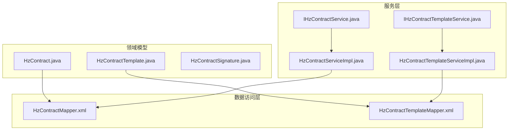
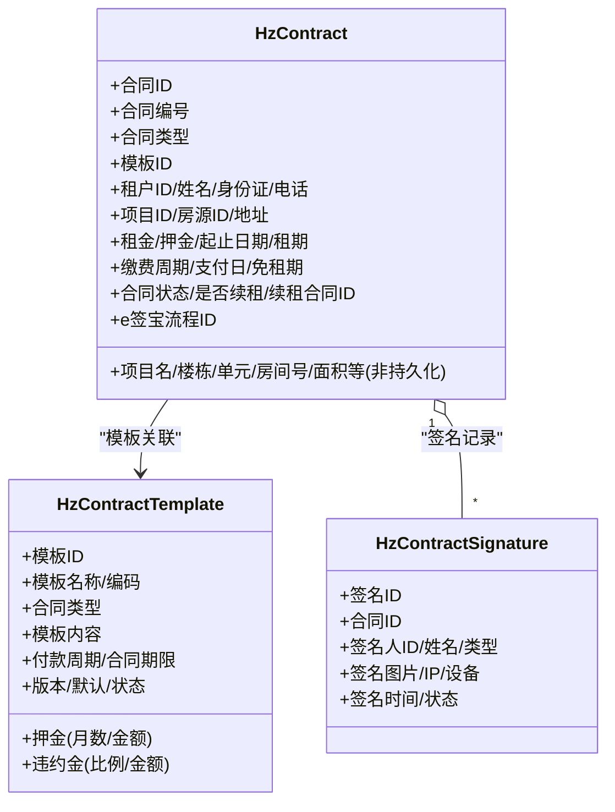
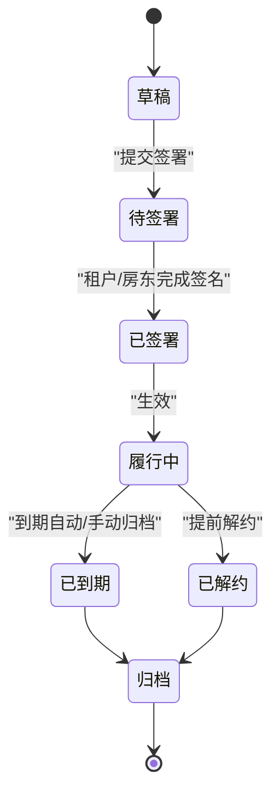
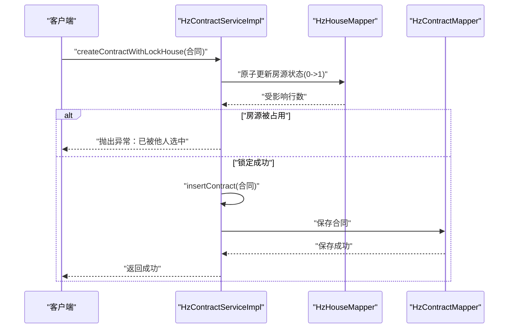
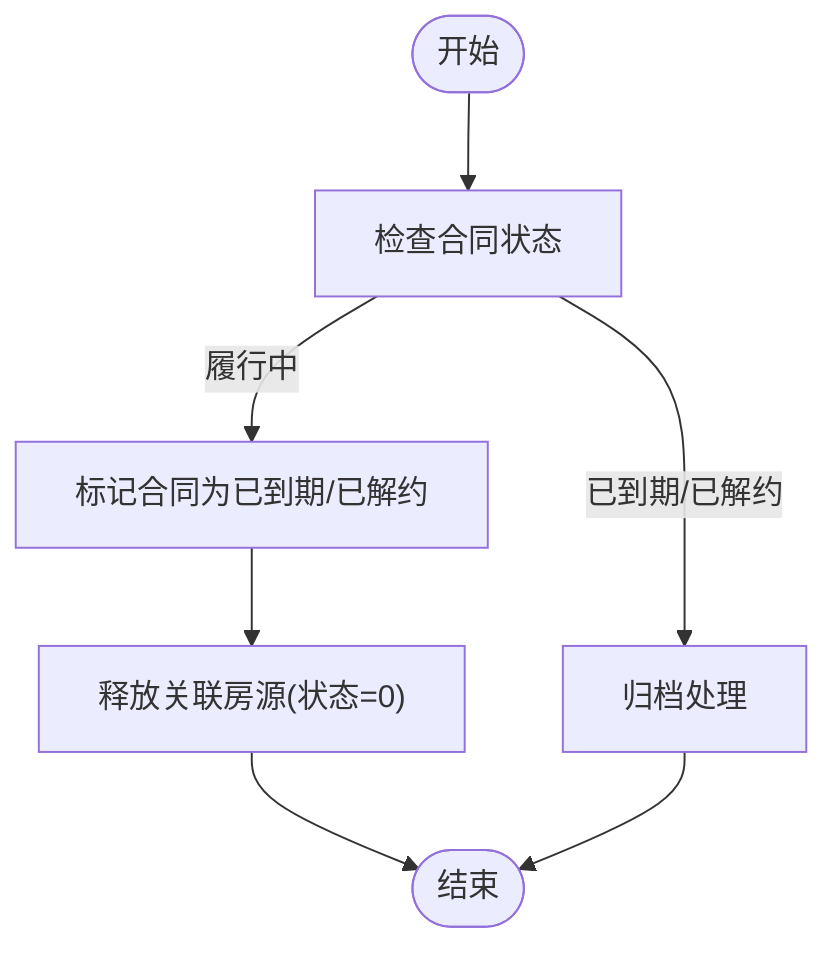
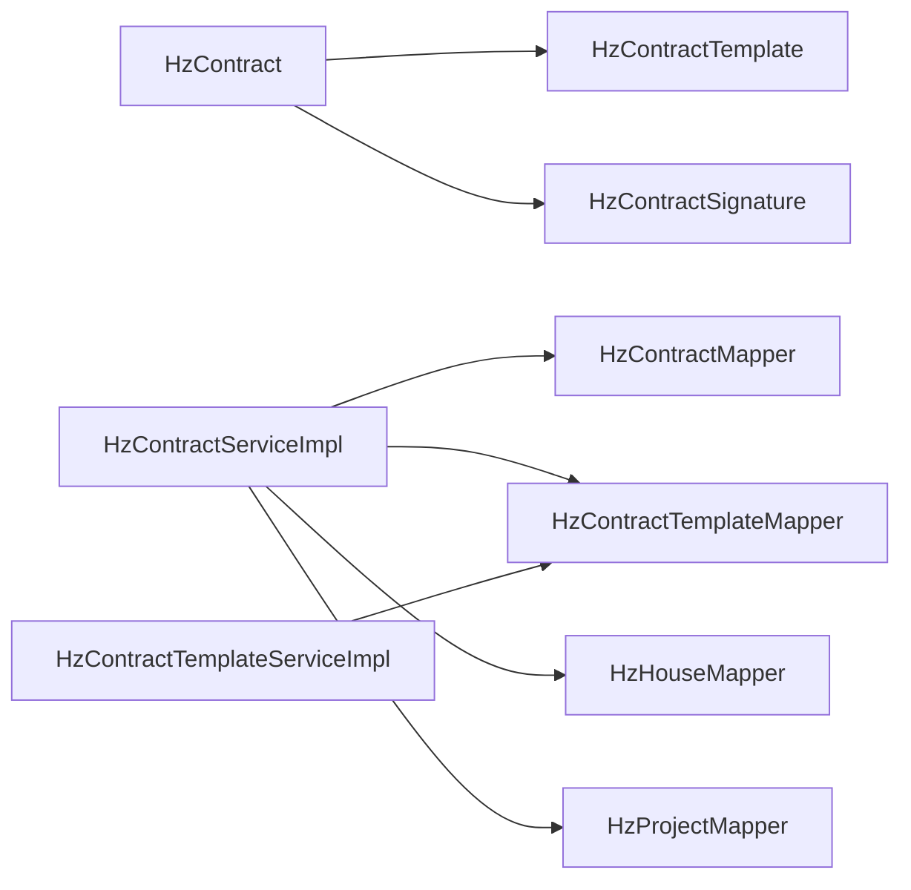

# 合同数据模型

<cite>
**本文引用的文件**
- [HzContract.java](file://ruoyi-system/src/main/java/com/ruoyi/system/domain/HzContract.java)
- [HzContractTemplate.java](file://ruoyi-system/src/main/java/com/ruoyi/system/domain/HzContractTemplate.java)
- [HzContractSignature.java](file://ruoyi-system/src/main/java/com/ruoyi/system/domain/HzContractSignature.java)
- [HzContractMapper.xml](file://ruoyi-system/src/main/resources/mapper/system/HzContractMapper.xml)
- [HzContractTemplateMapper.xml](file://ruoyi-system/src/main/resources/mapper/system/HzContractTemplateMapper.xml)
- [IHzContractService.java](file://ruoyi-system/src/main/java/com/ruoyi/system/service/IHzContractService.java)
- [IHzContractTemplateService.java](file://ruoyi-system/src/main/java/com/ruoyi/system/service/IHzContractTemplateService.java)
- [HzContractServiceImpl.java](file://ruoyi-system/src/main/java/com/ruoyi/system/service/impl/HzContractServiceImpl.java)
- [HzContractTemplateServiceImpl.java](file://ruoyi-system/src/main/java/com/ruoyi/system/service/impl/HzContractTemplateServiceImpl.java)
</cite>

## 目录
1. [简介](#简介)
2. [项目结构](#项目结构)
3. [核心组件](#核心组件)
4. [架构总览](#架构总览)
5. [详细组件分析](#详细组件分析)
6. [依赖关系分析](#依赖关系分析)
7. [性能考量](#性能考量)
8. [故障排查指南](#故障排查指南)
9. [结论](#结论)
10. [附录](#附录)

## 简介
本文件面向港好住信息系统中的合同数据模型，系统性梳理 HzContract、HzContractTemplate、HzContractSignature 三大核心实体的设计理念、字段定义与业务规则，并结合 MyBatis 映射文件与 Service 实现，阐述实体间关系映射（一对多、多对多）、合同生命周期管理（创建、更新、删除、归档）、数据库层面的主键/外键/索引/约束设计建议、数据访问层实现细节（SQL 查询优化、批量操作），以及数据安全与隐私保护策略。

## 项目结构
合同相关代码主要分布在如下位置：
- 领域模型：ruoyi-system/src/main/java/com/ruoyi/system/domain
- 映射文件：ruoyi-system/src/main/resources/mapper/system
- 服务接口与实现：ruoyi-system/src/main/java/com/ruoyi/system/service 与 impl

图表来源
- [HzContract.java:1-606](file://ruoyi-system/src/main/java/com/ruoyi/system/domain/HzContract.java#L1-L606)
- [HzContractTemplate.java:1-228](file://ruoyi-system/src/main/java/com/ruoyi/system/domain/HzContractTemplate.java#L1-L228)
- [HzContractSignature.java:1-174](file://ruoyi-system/src/main/java/com/ruoyi/system/domain/HzContractSignature.java#L1-L174)
- [HzContractMapper.xml:1-66](file://ruoyi-system/src/main/resources/mapper/system/HzContractMapper.xml#L1-L66)
- [HzContractTemplateMapper.xml:1-84](file://ruoyi-system/src/main/resources/mapper/system/HzContractTemplateMapper.xml#L1-L84)
- [IHzContractService.java:1-120](file://ruoyi-system/src/main/java/com/ruoyi/system/service/IHzContractService.java#L1-L120)
- [IHzContractTemplateService.java:1-77](file://ruoyi-system/src/main/java/com/ruoyi/system/service/IHzContractTemplateService.java#L1-L77)
- [HzContractServiceImpl.java:1-334](file://ruoyi-system/src/main/java/com/ruoyi/system/service/impl/HzContractServiceImpl.java#L1-L334)
- [HzContractTemplateServiceImpl.java:1-119](file://ruoyi-system/src/main/java/com/ruoyi/system/service/impl/HzContractTemplateServiceImpl.java#L1-L119)

章节来源
- [HzContract.java:1-606](file://ruoyi-system/src/main/java/com/ruoyi/system/domain/HzContract.java#L1-L606)
- [HzContractTemplate.java:1-228](file://ruoyi-system/src/main/java/com/ruoyi/system/domain/HzContractTemplate.java#L1-L228)
- [HzContractSignature.java:1-174](file://ruoyi-system/src/main/java/com/ruoyi/system/domain/HzContractSignature.java#L1-L174)
- [HzContractMapper.xml:1-66](file://ruoyi-system/src/main/resources/mapper/system/HzContractMapper.xml#L1-L66)
- [HzContractTemplateMapper.xml:1-84](file://ruoyi-system/src/main/resources/mapper/system/HzContractTemplateMapper.xml#L1-L84)
- [IHzContractService.java:1-120](file://ruoyi-system/src/main/java/com/ruoyi/system/service/IHzContractService.java#L1-L120)
- [IHzContractTemplateService.java:1-77](file://ruoyi-system/src/main/java/com/ruoyi/system/service/IHzContractTemplateService.java#L1-L77)
- [HzContractServiceImpl.java:1-334](file://ruoyi-system/src/main/java/com/ruoyi/system/service/impl/HzContractServiceImpl.java#L1-L334)
- [HzContractTemplateServiceImpl.java:1-119](file://ruoyi-system/src/main/java/com/ruoyi/system/service/impl/HzContractTemplateServiceImpl.java#L1-L119)

## 核心组件
本节聚焦三个核心实体的职责与字段语义：
- HzContract：合同主数据，承载合同编号、类型、租期、租金、押金、签署状态、e签宝流程 ID 等关键字段，并包含从房源表派生的展示字段（项目名、楼栋/单元/房间号、面积等，非持久化）。
- HzContractTemplate：合同模板，包含模板名称、编码、合同类型、模板内容、付款周期、合同期限、押金与违约金配置、版本与状态等。
- HzContractSignature：合同签名记录，记录每次签署的参与者（租户/房东/管理员）、签名图片、IP/设备、时间与状态。

章节来源
- [HzContract.java:14-606](file://ruoyi-system/src/main/java/com/ruoyi/system/domain/HzContract.java#L14-L606)
- [HzContractTemplate.java:13-228](file://ruoyi-system/src/main/java/com/ruoyi/system/domain/HzContractTemplate.java#L13-L228)
- [HzContractSignature.java:11-174](file://ruoyi-system/src/main/java/com/ruoyi/system/domain/HzContractSignature.java#L11-L174)

## 架构总览
合同数据模型采用“领域模型 + MyBatis 映射 + Service 服务”的分层架构。HzContract 与 HzContractTemplate 通过模板关联，HzContractSignature 记录各参与方的签名轨迹。Service 层负责业务编排、事务控制与跨表回填。

图表来源
- [HzContract.java:19-606](file://ruoyi-system/src/main/java/com/ruoyi/system/domain/HzContract.java#L19-L606)
- [HzContractTemplate.java:18-228](file://ruoyi-system/src/main/java/com/ruoyi/system/domain/HzContractTemplate.java#L18-L228)
- [HzContractSignature.java:16-174](file://ruoyi-system/src/main/java/com/ruoyi/system/domain/HzContractSignature.java#L16-L174)

## 详细组件分析

### HzContract 实体分析
- 设计要点
  - 使用注解标识表名与主键自增。
  - 大部分字段对应 hz_contract 表列，部分字段（如项目名、楼栋/单元/房间号、面积等）为非持久化字段，用于前端展示与导出。
  - 合同状态枚举值覆盖草稿、待签署、已签署、履行中、已到期、已解约等阶段。
- 关键字段与业务含义
  - 合同编号、类型、模板ID、批次ID、租户信息、项目/房源信息、租金/押金、起止日期/租期、缴费周期/支付日/免租期、合同内容/文件、租户/房东签名、签署时间、状态、是否续租、续租合同ID、e签宝流程ID等。
- 业务规则与约束
  - 必填字段：合同编号（若为空则自动生成）、模板ID、租户ID/姓名/身份证/电话、项目ID/房源ID/地址、租金/押金、起止日期、租期、缴费周期、合同状态默认草稿。
  - 数据类型与长度：字符串类字段（如编号、类型、状态、手机号、身份证号）长度以实际表结构为准；金额类使用高精度数值类型；日期类使用字符串或日期类型视数据库而定。
  - 业务逻辑校验：Service 层在创建/更新时进行状态机推进与并发控制（如原子锁定房源）。
- 生命周期管理
  - 创建：生成编号（若未提供）、设置默认草稿状态、保存。
  - 更新：按需更新字段。
  - 删除：逻辑删除（del_flag=2）。
  - 归档：到期或解约后可归档（状态变更至已到期/已解约）。
- 数据访问层实现
  - Mapper 提供按用户查询合同列表（联项目/楼栋/单元/房源）与按合同 ID 查询详情（联表回填展示字段）。
  - Service 在查询列表时回填项目名与“配租方式”（集中分配/常规分配）。
- 安全与隐私
  - 敏感信息（身份证号、手机号）建议在展示层脱敏处理；签名记录包含 IP/设备信息便于审计追踪。

章节来源
- [HzContract.java:19-606](file://ruoyi-system/src/main/java/com/ruoyi/system/domain/HzContract.java#L19-L606)
- [HzContractMapper.xml:7-66](file://ruoyi-system/src/main/resources/mapper/system/HzContractMapper.xml#L7-L66)
- [HzContractServiceImpl.java:47-334](file://ruoyi-system/src/main/java/com/ruoyi/system/service/impl/HzContractServiceImpl.java#L47-L334)

### HzContractTemplate 实体分析
- 设计要点
  - 模板作为合同生成的基础，包含模板内容、付款周期、合同期限、押金与违约金配置、默认模板标记与状态。
- 关键字段与业务含义
  - 模板名称/编码、合同类型、模板内容、付款周期、合同期限、押金（月数/金额）、违约金（比例/金额）、版本、是否默认、状态、删除标志。
- 业务规则与约束
  - 必填字段：模板名称、合同类型、模板内容。
  - 状态控制：正常/停用；默认模板通常仅允许一个。
- 生命周期管理
  - 创建：设置创建时间。
  - 更新：更新时间。
  - 删除：逻辑删除。
- 数据访问层实现
  - Mapper 提供模板列表、分页、按类型查询默认模板等查询能力。
  - Service 提供新增/修改/删除/分页查询等接口。

章节来源
- [HzContractTemplate.java:18-228](file://ruoyi-system/src/main/java/com/ruoyi/system/domain/HzContractTemplate.java#L18-L228)
- [HzContractTemplateMapper.xml:7-84](file://ruoyi-system/src/main/resources/mapper/system/HzContractTemplateMapper.xml#L7-L84)
- [HzContractTemplateServiceImpl.java:21-119](file://ruoyi-system/src/main/java/com/ruoyi/system/service/impl/HzContractTemplateServiceImpl.java#L21-L119)

### HzContractSignature 实体分析
- 设计要点
  - 记录每次签署的参与者与行为，支持租户、房东、管理员三类签名人类型。
- 关键字段与业务含义
  - 合同ID、签名人ID/姓名/类型、签名图片、IP/设备、签名时间、状态。
- 业务规则与约束
  - 必填字段：合同ID、签名人ID/姓名/类型、签名时间。
  - 状态：未签署/已签署。
- 生命周期管理
  - 创建：插入签名记录。
  - 更新：完成签名后更新状态。
  - 删除：逻辑删除。
- 数据访问层实现
  - 当前仓库未提供 HzContractSignature 的 Mapper XML 文件，但实体与 Service 接口存在，签名记录可通过 Service 层进行管理。

章节来源
- [HzContractSignature.java:16-174](file://ruoyi-system/src/main/java/com/ruoyi/system/domain/HzContractSignature.java#L16-L174)
- [IHzContractService.java:13-120](file://ruoyi-system/src/main/java/com/ruoyi/system/service/IHzContractService.java#L13-L120)

### 合同生命周期与状态机

图表来源
- [HzContract.java:139-142](file://ruoyi-system/src/main/java/com/ruoyi/system/domain/HzContract.java#L139-L142)
- [HzContractServiceImpl.java:304-332](file://ruoyi-system/src/main/java/com/ruoyi/system/service/impl/HzContractServiceImpl.java#L304-L332)

### 数据库表结构设计建议
- 主键与外键
  - hz_contract.contract_id：主键；template_id 外键指向 hz_contract_template.template_id；tenant_id 外键指向租户表；house_id 外键指向房源表；project_id 外键指向项目表。
  - hz_contract_template.template_id：主键。
  - hz_contract_signature.signature_id：主键；contract_id 外键指向 hz_contract.contract_id。
- 索引
  - hz_contract：tenant_id、house_id、project_id、contract_no、contract_status、sign_time、create_time 上建立索引以提升查询性能。
  - hz_contract_template：contract_type、status、template_code、template_name 上建立索引。
  - hz_contract_signature：contract_id、signer_id、sign_status、sign_time 上建立索引。
- 约束
  - del_flag 字段统一采用逻辑删除（0=存在，2=删除）。
  - 合同状态枚举值在业务层严格控制，避免非法状态流转。
  - 模板默认唯一性约束（同一合同类型仅允许一个默认模板）。

章节来源
- [HzContract.java:23-47](file://ruoyi-system/src/main/java/com/ruoyi/system/domain/HzContract.java#L23-L47)
- [HzContractTemplate.java:22-36](file://ruoyi-system/src/main/java/com/ruoyi/system/domain/HzContractTemplate.java#L22-L36)
- [HzContractSignature.java:20-38](file://ruoyi-system/src/main/java/com/ruoyi/system/domain/HzContractSignature.java#L20-L38)

### 数据访问层实现细节
- MyBatis 映射
  - HzContractMapper：提供按用户查询合同列表（联项目/楼栋/单元/房源）与按合同 ID 查询详情（联表回填展示字段）。
  - HzContractTemplateMapper：提供模板列表、分页、按类型查询默认模板等查询能力。
- SQL 查询优化
  - 使用 LEFT JOIN 联表回填展示字段，避免 N+1 查询。
  - 对高频过滤字段（如 tenant_id、contract_status、sign_time）建立索引。
  - 列表查询使用分页 Page 对象，避免一次性加载大量数据。
- 批量操作
  - Service 层在查询列表时批量回填项目名，减少多次数据库往返。
  - 逻辑删除通过 LambdaUpdateWrapper 批量更新 del_flag。

章节来源
- [HzContractMapper.xml:7-66](file://ruoyi-system/src/main/resources/mapper/system/HzContractMapper.xml#L7-L66)
- [HzContractTemplateMapper.xml:30-84](file://ruoyi-system/src/main/resources/mapper/system/HzContractTemplateMapper.xml#L30-L84)
- [HzContractServiceImpl.java:159-182](file://ruoyi-system/src/main/java/com/ruoyi/system/service/impl/HzContractServiceImpl.java#L159-L182)
- [HzContractTemplateServiceImpl.java:89-112](file://ruoyi-system/src/main/java/com/ruoyi/system/service/impl/HzContractTemplateServiceImpl.java#L89-L112)

### 合同创建流程（含原子锁定与并发控制）

图表来源
- [HzContractServiceImpl.java:304-316](file://ruoyi-system/src/main/java/com/ruoyi/system/service/impl/HzContractServiceImpl.java#L304-L316)

### 合同到期/解约归档流程

图表来源
- [HzContractServiceImpl.java:318-332](file://ruoyi-system/src/main/java/com/ruoyi/system/service/impl/HzContractServiceImpl.java#L318-L332)

### 数据安全与隐私保护
- 敏感信息处理
  - 身份证号、手机号等敏感字段在展示层进行脱敏（如仅显示后四位）。
- 数据脱敏
  - 建议在 DTO/VO 层统一脱敏策略，避免直接暴露原始数据。
- 访问控制
  - 通过数据权限与角色控制，限制对合同数据的查询/修改范围。
- 审计追踪
  - 签名记录包含 IP/设备/时间，便于审计与追溯。
- 传输与存储加密
  - 建议对敏感字段在传输与存储层面进行加密处理（视合规要求而定）。

## 依赖关系分析
- 实体关系
  - HzContract 与 HzContractTemplate：一对多（模板可生成多个合同）。
  - HzContract 与 HzContractSignature：一对多（合同可有多次签名记录）。
- 服务与映射
  - HzContractServiceImpl 依赖 HzContractMapper 与 HzContractTemplateMapper、HzHouseMapper、HzProjectMapper 等进行联表回填与状态更新。
  - HzContractTemplateServiceImpl 依赖 HzContractTemplateMapper 进行模板 CRUD。

图表来源
- [HzContractServiceImpl.java:38-46](file://ruoyi-system/src/main/java/com/ruoyi/system/service/impl/HzContractServiceImpl.java#L38-L46)
- [HzContractTemplateServiceImpl.java:23-24](file://ruoyi-system/src/main/java/com/ruoyi/system/service/impl/HzContractTemplateServiceImpl.java#L23-L24)

章节来源
- [HzContractServiceImpl.java:38-46](file://ruoyi-system/src/main/java/com/ruoyi/system/service/impl/HzContractServiceImpl.java#L38-L46)
- [HzContractTemplateServiceImpl.java:23-24](file://ruoyi-system/src/main/java/com/ruoyi/system/service/impl/HzContractTemplateServiceImpl.java#L23-L24)

## 性能考量
- 查询性能
  - 对 tenant_id、contract_status、sign_time、contract_no 等字段建立索引。
  - 列表分页使用 Page 对象，避免全量加载。
- 写入性能
  - 原子锁定房源使用条件更新（基于状态判断），避免重复锁定。
  - 逻辑删除减少物理删除带来的索引维护成本。
- 缓存策略
  - 对模板与项目信息进行缓存，减少频繁查询数据库。

## 故障排查指南
- 常见问题
  - 房源被占用：原子锁定失败，提示“已被他人选中”，请重新选择房源。
  - 合同状态异常：检查状态机推进逻辑，确保按顺序流转。
  - 模板未找到：确认模板状态为“正常”，且合同类型匹配。
- 排查步骤
  - 查看 Service 日志输出（列表查询包含调试信息）。
  - 核对 HzContractMapper 与 HzContractTemplateMapper 的 SQL 语句与索引。
  - 检查 HzContractSignature 的签名记录是否完整（若存在）。

章节来源
- [HzContractServiceImpl.java:311-313](file://ruoyi-system/src/main/java/com/ruoyi/system/service/impl/HzContractServiceImpl.java#L311-L313)
- [HzContractMapper.xml:7-66](file://ruoyi-system/src/main/resources/mapper/system/HzContractMapper.xml#L7-L66)
- [HzContractTemplateMapper.xml:77-81](file://ruoyi-system/src/main/resources/mapper/system/HzContractTemplateMapper.xml#L77-L81)

## 结论
本合同数据模型围绕 HzContract、HzContractTemplate、HzContractSignature 三者构建，通过清晰的状态机与严格的业务规则保障合同生命周期的可控性；借助 MyBatis 的联表查询与 Service 的批量回填，兼顾了查询性能与展示需求；在安全方面，建议强化脱敏与审计能力。后续可在签名记录完善（补充 HzContractSignatureMapper.xml）与模板默认唯一性约束等方面进一步增强。

## 附录
- 术语
  - 合同类型：首次签约、续租、换房。
  - 配租方式：集中分配（通过批次）与常规分配（无批次或备注非集中分配）。
- 参考路径
  - HzContract 列表查询与详情回填：[HzContractMapper.xml:7-66](file://ruoyi-system/src/main/resources/mapper/system/HzContractMapper.xml#L7-L66)
  - 模板列表与分页查询：[HzContractTemplateMapper.xml:30-84](file://ruoyi-system/src/main/resources/mapper/system/HzContractTemplateMapper.xml#L30-L84)
  - 合同创建与原子锁定：[HzContractServiceImpl.java:304-316](file://ruoyi-system/src/main/java/com/ruoyi/system/service/impl/HzContractServiceImpl.java#L304-L316)
  - 模板 CRUD 与分页：[HzContractTemplateServiceImpl.java:65-117](file://ruoyi-system/src/main/java/com/ruoyi/system/service/impl/HzContractTemplateServiceImpl.java#L65-L117)