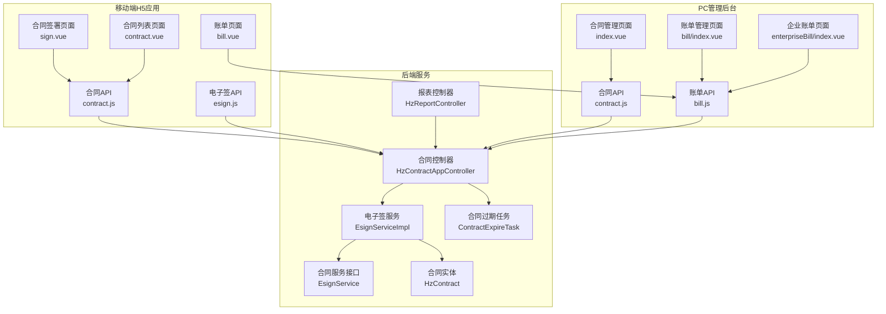
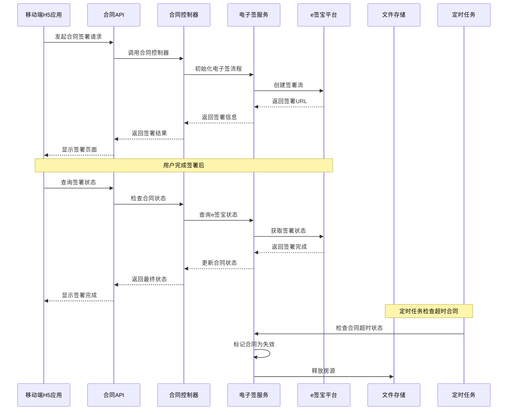
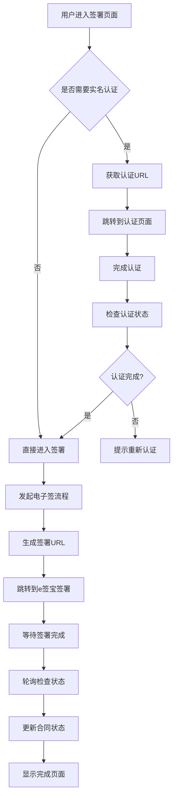
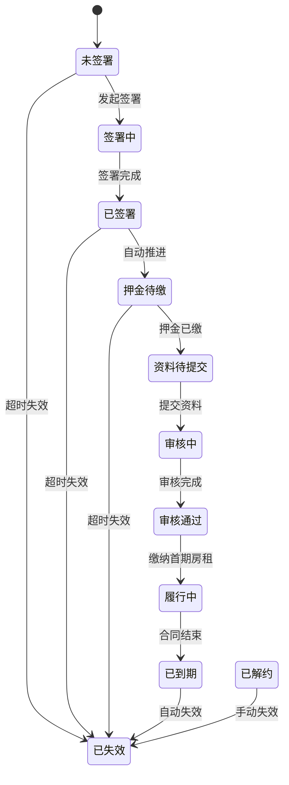
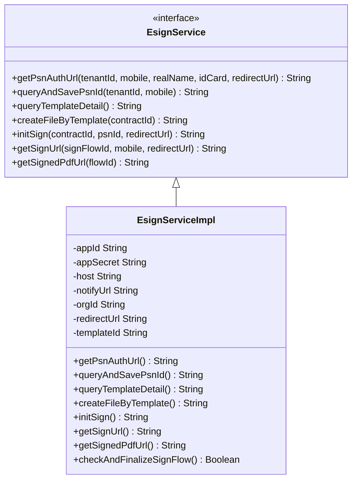
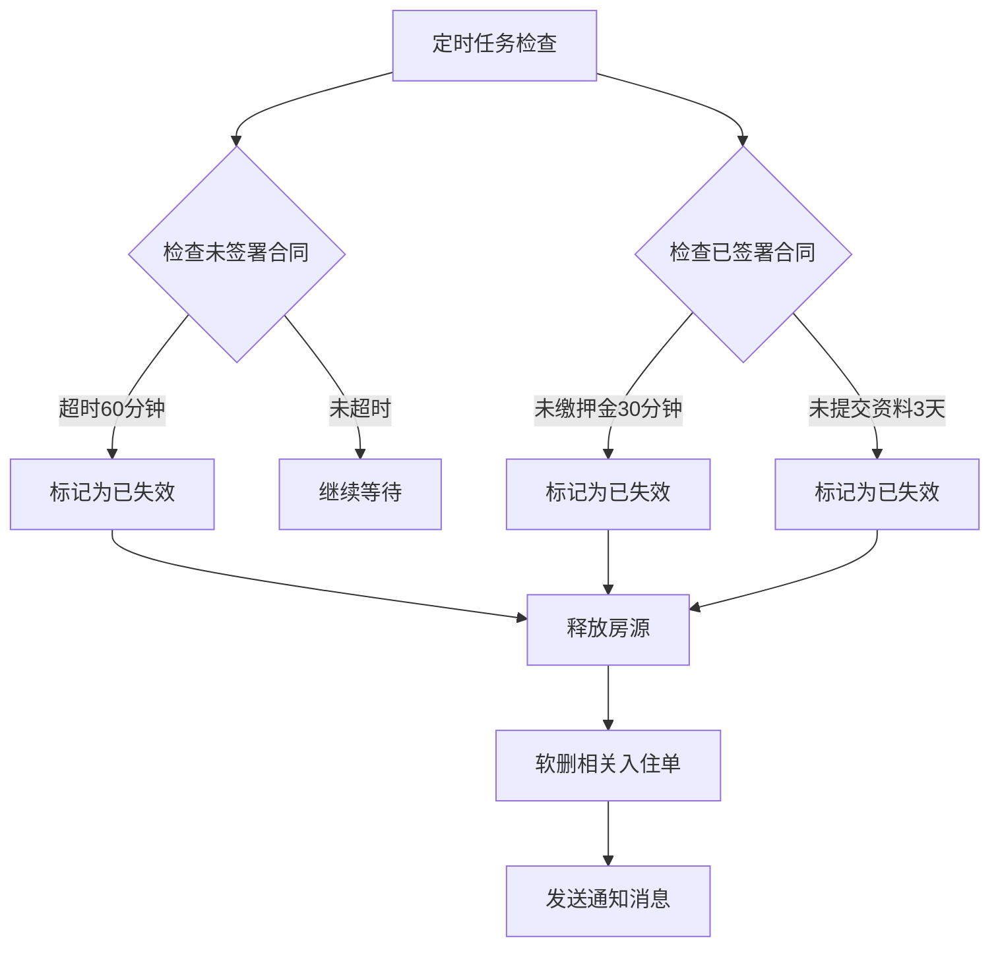
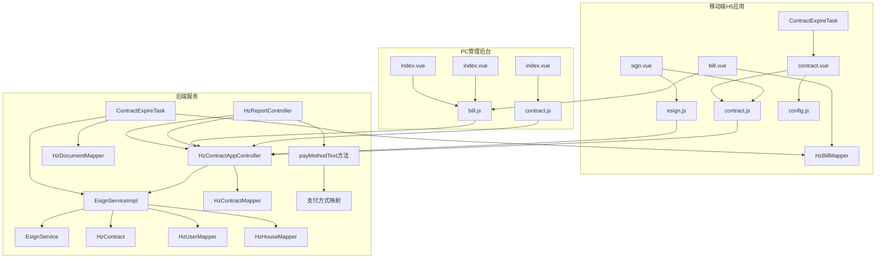

# 合同界面集成

<cite>
**本文档引用的文件**
- [sign.vue](file://uniapp-h5/pages/contract/sign.vue)
- [contract.vue](file://uniapp-h5/subpkg/affairs/contract.vue)
- [contract.js](file://uniapp-h5/api/contract.js)
- [esign.js](file://uniapp-h5/api/esign.js)
- [EsignService.java](file://ruoyi-system/src/main/java/com/ruoyi/system/service/EsignService.java)
- [EsignServiceImpl.java](file://ruoyi-system/src/main/java/com/ruoyi/system/service/impl/EsignServiceImpl.java)
- [HzContractAppController.java](file://ruoyi-admin/src/main/java/com/ruoyi/web/controller/h5/HzContractAppController.java)
- [HzContract.java](file://ruoyi-system/src/main/java/com/ruoyi/system/domain/HzContract.java)
- [contract.js](file://ruoyi-ui/src/api/gangzhu/contract.js)
- [index.vue](file://ruoyi-ui/src/views/gangzhu/contract/index.vue)
- [ContractExpireTask.java](file://ruoyi-quartz/src/main/java/com/ruoyi/quartz/task/ContractExpireTask.java)
- [03-合同管理.md](file://docs/数据字典/03-合同管理.md)
- [bill.vue](file://uniapp-h5/subpkg/affairs/bill.vue)
- [index.vue](file://ruoyi-ui/src/views/gangzhu/bill/index.vue)
- [index.vue](file://ruoyi-ui/src/views/gangzhu/enterpriseBill/index.vue)
- [HzReportController.java](file://ruoyi-admin/src/main/java/com/ruoyi/web/controller/system/HzReportController.java)
</cite>

## 更新摘要
**所做更改**
- 新增多日倒计时显示功能，提供更精确的计时信息
- 增强了合同账单界面的显示功能，包括账单序列号、周期起止日期的展示
- 新增了支付方式的人性化标签显示，支持多种支付方式的中文映射
- 优化了账单期次的显示逻辑，提供更直观的账单周期信息
- 完善了合同详情中的缴费记录展示，增强了用户体验
- 扩展了合同状态系统，从5个状态增加到7个状态，新增"已失效"状态

## 目录
1. [简介](#简介)
2. [项目结构](#项目结构)
3. [核心组件](#核心组件)
4. [架构概览](#架构概览)
5. [详细组件分析](#详细组件分析)
6. [依赖关系分析](#依赖关系分析)
7. [性能考虑](#性能考虑)
8. [故障排除指南](#故障排除指南)
9. [结论](#结论)

## 简介

港好住信息系统合同界面集成了PC管理后台和移动端H5应用的合同功能。该系统实现了完整的电子合同签署流程，包括实名认证、合同预览、电子签名绘制、签署确认等交互环节。系统支持前后端接口集成，提供合同状态的实时更新机制，包括签署进度显示、状态变更通知、文件下载等功能。

**更新** 合同状态系统已从5个状态扩展到7个状态，新增"已失效"状态(代码6)，并重构了条件渲染逻辑以改进不同合同状态下的界面展示和用户体验。同时，账单界面得到了显著增强，包括账单序列号、周期起止日期的展示，以及支付方式的人性化标签显示。移动端合同签署界面新增了多日倒计时显示功能，提供更精确的计时信息，提升了用户体验。

## 项目结构

系统采用前后端分离架构，主要包含以下模块：



**图表来源**
- [sign.vue:1-1020](file://uniapp-h5/pages/contract/sign.vue#L1-L1020)
- [contract.vue:1-1042](file://uniapp-h5/subpkg/affairs/contract.vue#L1-L1042)
- [bill.vue:1-500](file://uniapp-h5/subpkg/affairs/bill.vue#L1-L500)
- [HzContractAppController.java:1-1310](file://ruoyi-admin/src/main/java/com/ruoyi/web/controller/h5/HzContractAppController#L1-L1310)

**章节来源**
- [sign.vue:1-1020](file://uniapp-h5/pages/contract/sign.vue#L1-L1020)
- [contract.vue:1-1042](file://uniapp-h5/subpkg/affairs/contract.vue#L1-L1042)

## 核心组件

### 移动端合同签署组件

移动端H5应用提供了完整的合同签署体验，包括：

- **实名认证流程**：支持用户身份验证和认证状态检查
- **合同预览**：展示租户信息、房源信息、合同条款等详细内容
- **电子签名**：集成SmoothSignature库实现手写签名功能
- **多日倒计时显示**：提供精确的剩余时间显示，支持日、小时、分钟的多层次计时
- **超时失效处理**：支持倒计时显示和自动状态转换

### 合同列表管理组件

合同列表页面提供了全面的合同管理功能：

- **状态可视化**：通过步骤指示器展示合同签署流程的各个阶段
- **多日倒计时**：实时显示合同签署和支付的剩余时间
- **PDF文件管理**：提供合同文件的查看和下载功能
- **操作按钮集成**：根据合同状态提供相应的操作选项
- **失效状态标识**：明确显示已失效的合同状态

### 账单界面增强组件

**更新** 新增了账单界面的多项增强功能：

- **账单序列号显示**：在合同详情中展示账单序列号，如"第1期"
- **周期起止日期展示**：提供详细的账单周期起止日期显示
- **支付方式人性化标签**：支持微信支付、支付宝、现金、银行转账等多种支付方式的中文显示
- **账单期次格式化**：根据账单类型提供相应的期次显示格式

### 后端服务组件

后端服务提供了完整的合同管理能力：

- **电子签服务**：集成e签宝API实现电子合同签署
- **合同状态管理**：维护合同生命周期状态转换，包括新增的失效状态
- **文件生成服务**：自动生成PDF合同文件
- **账单生成**：根据合同条款生成相应的账单
- **过期处理机制**：定时任务自动处理超时合同并标记为失效
- **支付方式映射**：提供支付方式的中文标签映射服务

**章节来源**
- [contract.js:1-86](file://uniapp-h5/api/contract.js#L1-L86)
- [esign.js:1-44](file://uniapp-h5/api/esign.js#L1-L44)
- [EsignService.java:1-37](file://ruoyi-system/src/main/java/com/ruoyi/system/service/EsignService.java#L1-L37)

## 架构概览

系统采用分层架构设计，实现了前后端的清晰分离：



**图表来源**
- [sign.vue:476-562](file://uniapp-h5/pages/contract/sign.vue#L476-L562)
- [HzContractAppController.java:1281-1298](file://ruoyi-admin/src/main/java/com/ruoyi/web/controller/h5/HzContractAppController#L1281-L1298)

## 详细组件分析

### 合同签署页面组件

合同签署页面实现了完整的签署流程，包含以下关键功能：

#### 多日倒计时显示功能

**更新** 新增了精确的多日倒计时显示功能：

```mermaid
flowchart TD
A[合同状态: 待签署] --> B{剩余时间计算}
B --> |超过1天| C[显示"X天后到期"]
B --> |1-24小时| D[显示"X小时后到期"]
B --> |1-60分钟| E[显示"X分钟后到期"]
B --> |小于1分钟| F[显示"即将到期"]
C --> G[倒计时更新]
D --> G
E --> G
F --> G
G --> H{倒计时结束?}
H --> |是| I[标记为已失效]
H --> |否| J[继续显示倒计时]
I --> K[状态更新]
J --> A
```

**图表来源**
- [sign.vue:500-530](file://uniapp-h5/pages/contract/sign.vue#L500-L530)
- [sign.vue:547-562](file://uniapp-h5/pages/contract/sign.vue#L547-L562)

#### 实名认证流程



**图表来源**
- [sign.vue:500-530](file://uniapp-h5/pages/contract/sign.vue#L500-L530)
- [sign.vue:547-562](file://uniapp-h5/pages/contract/sign.vue#L547-L562)

#### 合同预览功能

合同预览页面展示了完整的合同信息，包括：

- **租户信息**：姓名、手机号、身份证号
- **房源信息**：项目名称、房间号
- **合同条款**：月租金、押金、租期、合同期限
- **倒计时显示**：精确的剩余时间显示
- **操作按钮**：确认并签署按钮

#### 电子签名绘制

系统集成了SmoothSignature库实现手写签名功能：

- **签名画布**：提供触摸友好的签名界面
- **签名确认**：支持签名确认和重新绘制
- **签名数据**：生成Base64格式的签名图片

**章节来源**
- [sign.vue:1-1020](file://uniapp-h5/pages/contract/sign.vue#L1-L1020)

### 合同列表管理组件

合同列表页面提供了全面的合同管理功能：

#### 状态可视化展示



**图表来源**
- [contract.vue:77-118](file://uniapp-h5/subpkg/affairs/contract.vue#L77-L118)

#### 多日倒计时显示

**更新** 新增了精确的多日倒计时显示功能：

系统实现了多层次的倒计时显示机制：

- **日级显示**：超过1天的剩余时间显示为"X天后到期"
- **小时级显示**：1-24小时的剩余时间显示为"X小时后到期"
- **分钟级显示**：1-60分钟的剩余时间显示为"X分钟后到期"
- **即时提醒**：小于1分钟的剩余时间显示为"即将到期"
- **自动更新**：倒计时每分钟更新一次，确保时间准确性

#### 实时状态更新

系统实现了多种状态更新机制：

- **倒计时显示**：显示合同签署和支付的剩余时间
- **自动刷新**：定期检查合同状态并更新界面
- **乐观更新**：前端预估状态变化，提升用户体验
- **失效状态处理**：倒计时结束后自动标记为已失效状态

**更新** 新增了超时失效机制，当倒计时结束时，系统会自动将合同状态从"待签署"或"押金待缴"转换为"已失效"，并通过前端乐观更新立即反映到用户界面。

**章节来源**
- [contract.vue:557-590](file://uniapp-h5/subpkg/affairs/contract.vue#L557-L590)

### 账单界面增强组件

**更新** 新增了账单界面的多项增强功能：

#### 账单序列号和周期显示

账单界面现在提供更详细的账单信息展示：

- **账单序列号**：显示账单的期次编号，如"第1期"
- **周期起止日期**：提供详细的账单周期起止日期范围
- **账单类型映射**：根据账单类型显示相应的人性化标签

```mermaid
flowchart TD
A[账单数据] --> B{账单类型}
B --> |1| C[押金]
B --> |2| D[租金 - 显示期次]
B --> |3| E[水费]
B --> |4| F[电费]
B --> |5| G[燃气费]
B --> |6| H[物业费]
B --> |其他| I[其他费用]
D --> J{是否有billSeq}
J --> |是| K[显示"第X期房租"]
J --> |否| L[显示"YYYY年MM月房租"]
```

**图表来源**
- [bill.vue:296-333](file://uniapp-h5/subpkg/affairs/bill.vue#L296-L333)

#### 支付方式人性化标签

系统提供了多种支付方式的中文标签映射：

- **微信支付**：支持"wechat"、"WECHAT"、"wxpay"、"2"等多种标识
- **支付宝**：支持"alipay"、"ALIPAY"、"1"等多种标识  
- **现金支付**：支持"cash"、"3"等多种标识
- **银行转账**：支持"bank"、"transfer"、"4"等多种标识
- **线下支付**：支持"offline"、"5"等多种标识

#### 合同详情中的缴费记录

在合同详情页面，缴费记录得到了显著增强：

- **账单类型显示**：显示账单类型的中文标签
- **账单号展示**：提供完整的账单编号显示
- **账期信息**：显示详细的账期信息和周期范围
- **状态标签**：提供直观的状态标签显示

**章节来源**
- [bill.vue:296-333](file://uniapp-h5/subpkg/affairs/bill.vue#L296-L333)
- [index.vue:383-399](file://ruoyi-ui/src/views/gangzhu/contract/index.vue#L383-L399)

### 后端服务组件

#### 电子签服务实现

电子签服务实现了完整的e签宝集成：



**图表来源**
- [EsignService.java:1-37](file://ruoyi-system/src/main/java/com/ruoyi/system/service/EsignService.java#L1-L37)
- [EsignServiceImpl.java:28-74](file://ruoyi-system/src/main/java/com/ruoyi/system/service/impl/EsignServiceImpl.java#L28-L74)

#### 合同状态管理

系统维护了完整的合同生命周期状态，现已扩展到7个状态：

| 状态码 | 状态名称 | 描述 | 前端状态映射 |
|--------|----------|------|-------------|
| 0 | 草稿 | 合同初始状态 | pending(待签署) |
| 1 | 待签署 | 等待用户签署 | pending(待签署) |
| 2 | 已签署 | 电子合同签署完成 | signed(已签署) |
| 3 | 履行中 | 合同正常执行 | active(履行中) |
| 4 | 已到期 | 合同自然结束 | expired(已到期) |
| 5 | 已解约 | 合同提前解除 | expired(已解约) |
| 6 | 已失效 | 合同超时自动失效 | voided(已失效) |

**更新** 新增了状态6"已失效"，用于表示因超时而自动失效的合同状态。系统通过定时任务和前端倒计时机制实现自动状态转换。

#### 过期处理机制

系统实现了智能的合同过期处理机制：



**图表来源**
- [ContractExpireTask.java:186-301](file://ruoyi-quartz/src/main/java/com/ruoyi/quartz/task/ContractExpireTask.java#L186-L301)

#### 支付方式映射服务

**更新** 新增了支付方式的中文映射服务：

系统提供了完整的支付方式中文标签映射功能：

- **历史数据兼容**：支持历史导入数据的代码值映射
- **新数据支持**：支持新的英文标识符
- **多格式支持**：支持大小写混合的标识符
- **默认回退**：不匹配的标识符保持原样显示

**章节来源**
- [HzContract.java:139-142](file://ruoyi-system/src/main/java/com/ruoyi/system/domain/HzContract.java#L139-L142)
- [contract.vue:504-515](file://uniapp-h5/subpkg/affairs/contract.vue#L504-L515)
- [HzReportController.java:774-801](file://ruoyi-admin/src/main/java/com/ruoyi/web/controller/system/HzReportController.java#L774-L801)

### PC管理后台组件

#### 合同管理界面

PC管理后台提供了专业的合同管理功能：

- **合同列表展示**：显示所有合同的详细信息，包括新增的失效状态
- **合同状态管理**：支持合同状态的手动更新，包括失效状态
- **文件下载功能**：提供合同PDF文件的下载
- **实时状态刷新**：支持手动刷新合同状态
- **失效状态标识**：明确显示已失效的合同状态

#### 合同详情展示

```mermaid
graph LR
A[合同基本信息] --> B[租户信息]
A --> C[房源信息]
A --> D[合同条款]
A --> E[附件管理]
A --> F[电子合同PDF]
B --> B1[姓名]
B --> B2[联系方式]
B --> B3[身份证号]
C --> C1[项目名称]
C --> C2[房间号]
C --> C3[地址信息]
D --> D1[月租金]
D --> D2[押金]
D --> D3[租期]
D --> D4[合同期限]
D --> D5[状态: 已失效]
A --> G[缴费记录]
G --> G1[账单类型: 押金]
G --> G2[账单号: GHZ20240101001]
G --> G3[账期: 第1期 (2024.01.01-2024.01.31)]
G --> G4[状态: 已支付]
```

**图表来源**
- [index.vue:334-368](file://ruoyi-ui/src/views/gangzhu/contract/index.vue#L334-L368)

#### 账单管理界面

**更新** 账单管理界面得到了显著增强：

- **账单序列号显示**：在账单列表中显示账单序列号
- **周期日期展示**：提供详细的账单周期起止日期
- **支付方式标签**：显示人性化的支付方式标签
- **状态分类管理**：支持多种账单状态的分类管理

**章节来源**
- [contract.js:1-86](file://ruoyi-ui/src/api/gangzhu/contract.js#L1-L86)

## 依赖关系分析

系统各组件之间的依赖关系如下：



**图表来源**
- [sign.vue:198-199](file://uniapp-h5/pages/contract/sign.vue#L198-L199)
- [contract.vue:191-193](file://uniapp-h5/subpkg/affairs/contract.vue#L191-L193)
- [HzContractAppController.java:48-87](file://ruoyi-admin/src/main/java/com/ruoyi/web/controller/h5/HzContractAppController.java#L48-L87)

**章节来源**
- [EsignServiceImpl.java:55-74](file://ruoyi-system/src/main/java/com/ruoyi/system/service/impl/EsignServiceImpl.java#L55-L74)

## 性能考虑

系统在设计时充分考虑了性能优化：

### 前端性能优化

- **懒加载策略**：合同页面按需加载，减少初始加载时间
- **状态缓存**：使用本地存储缓存合同状态，减少重复请求
- **防抖处理**：对频繁操作进行防抖处理，避免重复请求
- **图片优化**：签名图片采用Base64编码，减少HTTP请求
- **倒计时优化**：智能倒计时管理，避免不必要的定时器
- **账单数据优化**：账单数据采用虚拟滚动，提升大数据量显示性能
- **多日倒计时优化**：采用高效的日期计算算法，确保倒计时精度

### 后端性能优化

- **异步处理**：电子签流程采用异步处理，避免阻塞主线程
- **连接池管理**：合理配置数据库连接池，提高并发处理能力
- **缓存策略**：对常用数据进行缓存，减少数据库查询
- **文件存储优化**：采用分布式文件存储，提高文件访问速度
- **定时任务优化**：批量处理过期合同，减少数据库压力
- **支付方式映射缓存**：缓存支付方式映射结果，提升查询性能

## 故障排除指南

### 常见问题及解决方案

#### 实名认证失败

**问题描述**：用户完成实名认证后仍提示需要认证

**解决方案**：
1. 检查认证状态查询接口是否正常
2. 确认e签宝回调是否正确处理
3. 验证用户信息是否正确保存

#### 签署链接无效

**问题描述**：用户点击签署链接后无法打开签署页面

**解决方案**：
1. 检查签署URL的有效期
2. 验证redirectUrl配置是否正确
3. 确认e签宝平台状态正常

#### 合同状态不同步

**问题描述**：前端显示的合同状态与实际状态不符

**解决方案**：
1. 检查轮询机制是否正常工作
2. 验证WebSocket连接状态
3. 确认后端状态更新逻辑

#### 多日倒计时显示异常

**问题描述**：倒计时显示不准确或出现负数

**解决方案**：
1. 检查服务器时间同步状态
2. 验证客户端时间设置
3. 确认倒计时计算逻辑
4. 检查网络延迟影响

#### PDF文件下载失败

**问题描述**：用户无法下载或查看合同PDF文件

**解决方案**：
1. 检查PDF生成服务是否正常
2. 验证文件存储权限设置
3. 确认浏览器兼容性问题

#### 合同意外失效

**问题描述**：合同在未完成签署的情况下变为"已失效"

**解决方案**：
1. 检查倒计时配置是否正确
2. 验证定时任务是否正常运行
3. 确认用户是否在规定时间内完成操作
4. 检查网络连接稳定性

#### 账单显示异常

**问题描述**：账单界面显示的账单序列号或周期日期不正确

**解决方案**：
1. 检查账单数据源是否正确
2. 验证账单序列号字段是否存在
3. 确认周期起止日期格式是否正确
4. 检查账单类型映射逻辑

#### 支付方式显示问题

**问题描述**：支付方式显示为原始代码而非中文标签

**解决方案**：
1. 检查支付方式映射服务是否正常工作
2. 验证支付方式字段的数据格式
3. 确认后端映射方法是否正确调用
4. 检查前端显示逻辑是否正确

**更新** 新增了多日倒计时显示异常和支付方式显示问题的故障排除指南，帮助用户解决新增功能的相关问题。

**章节来源**
- [sign.vue:596-617](file://uniapp-h5/pages/contract/sign.vue#L596-L617)
- [contract.vue:273-334](file://uniapp-h5/subpkg/affairs/contract.vue#L273-L334)

## 结论

港好住信息系统合同界面集成为用户提供了完整的电子合同签署体验。系统通过前后端分离的设计，实现了PC管理后台和移动端H5应用的统一合同管理。关键特性包括：

- **完整的签署流程**：从实名认证到合同签署的全流程覆盖
- **实时状态更新**：提供准确的签署进度和状态显示
- **智能失效处理**：通过倒计时和定时任务实现智能超时失效
- **多日倒计时显示**：提供精确的剩余时间显示，支持日、小时、分钟的多层次计时
- **跨平台兼容**：支持H5和小程序等多种平台
- **文件管理功能**：完善的合同文件生成、查看和下载功能
- **账单界面增强**：显著提升了账单显示的详细程度和用户体验
- **支付方式优化**：提供人性化的支付方式标签显示

**更新** 系统已成功从5个合同状态扩展到7个状态，新增的"已失效"状态通过智能超时机制提升了系统的自动化程度和用户体验。同时，账单界面得到了显著增强，包括账单序列号、周期起止日期的展示，以及支付方式的人性化标签显示，大幅提升了用户的账单管理体验。移动端合同签署界面新增的多日倒计时显示功能，为用户提供更精确的计时信息，提升了整体用户体验。

系统在设计时充分考虑了用户体验和性能优化，通过合理的架构设计和实现策略，为用户提供了稳定可靠的合同管理服务。未来可以进一步优化移动端适配和性能表现，提升整体用户体验。