# 电子合同系统

<cite>
**本文引用的文件**
- [HzContract.java](file://ruoyi-system/src/main/java/com/ruoyi/system/domain/HzContract.java)
- [HzContractTemplate.java](file://ruoyi-system/src/main/java/com/ruoyi/system/domain/HzContractTemplate.java)
- [HzContractSignature.java](file://ruoyi-system/src/main/java/com/ruoyi/system/domain/HzContractSignature.java)
- [HzContractFiling.java](file://ruoyi-system/src/main/java/com/ruoyi/system/domain/HzContractFiling.java)
- [HzCoupon.java](file://ruoyi-system/src/main/java/com/ruoyi/system/domain/HzCoupon.java)
- [HzCouponReceive.java](file://ruoyi-system/src/main/java/com/ruoyi/system/domain/HzCouponReceive.java)
- [HzSubsidyApply.java](file://ruoyi-system/src/main/java/com/ruoyi/system/domain/HzSubsidyApply.java)
- [HzCheckIn.java](file://ruoyi-system/src/main/java/com/ruoyi/system/domain/HzCheckIn.java)
- [HzCheckoutApply.java](file://ruoyi-system/src/main/java/com/ruoyi/system/domain/HzCheckoutApply.java)
- [HzCheckoutRecord.java](file://ruoyi-system/src/main/java/com/ruoyi/system/domain/HzCheckoutRecord.java)
- [HzHouseFacility.java](file://ruoyi-system/src/main/java/com/ruoyi/system/domain/HzHouseFacility.java)
- [HzHouseTypeFacility.java](file://ruoyi-system/src/main/java/com/ruoyi/system/domain/HzHouseTypeFacility.java)
- [HzFacilityItem.java](file://ruoyi-system/src/main/java/com/ruoyi/system/domain/HzFacilityItem.java)
- [HzContractServiceImpl.java](file://ruoyi-system/src/main/java/com/ruoyi/system/service/impl/HzContractServiceImpl.java)
- [HzContractTemplateServiceImpl.java](file://ruoyi-system/src/main/java/com/ruoyi/system/service/impl/HzContractTemplateServiceImpl.java)
- [HzContractFilingServiceImpl.java](file://ruoyi-system/src/main/java/com/ruoyi/system/service/impl/HzContractFilingServiceImpl.java)
- [HzCouponServiceImpl.java](file://ruoyi-system/src/main/java/com/ruoyi/system/service/impl/HzCouponServiceImpl.java)
- [HzSubsidyApplyServiceImpl.java](file://ruoyi-system/src/main/java/com/ruoyi/system/service/impl/HzSubsidyApplyServiceImpl.java)
- [EsignService.java](file://ruoyi-system/src/main/java/com/ruoyi/system/service/EsignService.java)
- [EsignServiceImpl.java](file://ruoyi-system/src/main/java/com/ruoyi/system/service/impl/EsignServiceImpl.java)
- [EsignController.java](file://ruoyi-admin/src/main/java/com/ruoyi/web/controller/h5/EsignController.java)
- [HzContractAppController.java](file://ruoyi-admin/src/main/java/com/ruoyi/web/controller/h5/HzContractAppController.java)
- [HzContractFilingAppController.java](file://ruoyi-admin/src/main/java/com/ruoyi/web/controller/h5/HzContractFilingAppController.java)
- [HzCouponAppController.java](file://ruoyi-admin/src/main/java/com/ruoyi/web/controller/h5/HzCouponAppController.java)
- [HzSubsidyApplyAppController.java](file://ruoyi-admin/src/main/java/com/ruoyi/web/controller/h5/HzSubsidyApplyAppController.java)
- [HzCheckInAppController.java](file://ruoyi-admin/src/main/java/com/ruoyi/web/controller/h5/HzCheckInAppController.java)
- [HzHouseFacilityController.java](file://ruoyi-system/src/main/java/com/ruoyi/system/controller/HzHouseFacilityController.java)
- [HzHouseTypeFacilityController.java](file://ruoyi-system/src/main/java/com/ruoyi/system/controller/HzHouseTypeFacilityController.java)
- [HzHouseFacilityServiceImpl.java](file://ruoyi-system/src/main/java/com/ruoyi/system/service/impl/HzHouseFacilityServiceImpl.java)
- [HzHouseTypeFacilityServiceImpl.java](file://ruoyi-system/src/main/java/com/ruoyi/system/service/impl/HzHouseTypeFacilityServiceImpl.java)
- [EsignHttpHelper.java](file://ruoyi-system/src/main/java/com/ruoyi/system/esign/EsignHttpHelper.java)
- [EsignCoreSdkInfo.java](file://ruoyi-system/src/main/java/com/ruoyi/system/esign/EsignCoreSdkInfo.java)
- [HzContractMapper.xml](file://ruoyi-system/src/main/resources/mapper/system/HzContractMapper.xml)
- [HzContractTemplateMapper.xml](file://ruoyi-system/src/main/resources/mapper/system/HzContractTemplateMapper.xml)
- [HzBatchHouseMapper.xml](file://ruoyi-system/src/main/resources/mapper/system/HzBatchHouseMapper.xml)
- [ContractExpireTask.java](file://ruoyi-quartz/src/main/java/com/ruoyi/quartz/task/ContractExpireTask.java)
- [HouseOrderExpireTask.java](file://ruoyi-quartz/src/main/java/com/ruoyi/quartz/task/HouseOrderExpireTask.java)
- [HzHouseOrderServiceImpl.java](file://ruoyi-system/src/main/java/com/ruoyi/system/service/impl/HzHouseOrderServiceImpl.java)
- [IHzHouseOrderService.java](file://ruoyi-system/src/main/java/com/ruoyi/system/service/IHzHouseOrderService.java)
- [HzHouseFacilityMapper.java](file://ruoyi-system/src/main/java/com/ruoyi/system/mapper/HzHouseFacilityMapper.java)
- [HzHouseTypeFacilityMapper.java](file://ruoyi-system/src/main/java/com/ruoyi/system/mapper/HzHouseTypeFacilityMapper.java)
- [HzFacilityItemMapper.java](file://ruoyi-system/src/main/java/com/ruoyi/system/mapper/HzFacilityItemMapper.java)
- [BatchPreferenceVo.java](file://ruoyi-system/src/main/java/com/ruoyi/system/domain/vo/BatchPreferenceVo.java)
- [HzBatchAllocation.java](file://ruoyi-system/src/main/java/com/ruoyi/system/domain/HzBatchAllocation.java)
- [HzBatchHouse.java](file://ruoyi-system/src/main/java/com/ruoyi/system/domain/HzBatchHouse.java)
- [HzHouseOrder.java](file://ruoyi-system/src/main/java/com/ruoyi/system/domain/HzHouseOrder.java)
- [HzHouseOrderMapper.java](file://ruoyi-system/src/main/java/com/ruoyi/system/mapper/HzHouseOrderMapper.java)
- [checkin.js](file://uniapp-h5/api/checkin.js)
- [sign.vue](file://uniapp-h5/pages/contract/sign.vue)
</cite>

## 更新摘要
**所做更改**
- 更新HzContractAppController中房间锁定机制，将房间锁定过期时间从10分钟延长到30分钟，以更好地适应合同签署过程中的时间需求
- 新增预订单锁定过期时间延长至30分钟的机制，与押金支付超时时间对齐
- 更新合同列表中已签署待付押金倒计时的锁定过期时间计算逻辑
- 完善房间锁定机制的时间配置，提升合同签署流程的用户体验

## 目录
1. [简介](#简介)
2. [项目结构](#项目结构)
3. [核心组件](#核心组件)
4. [架构总览](#架构总览)
5. [详细组件分析](#详细组件分析)
6. [依赖关系分析](#依赖关系分析)
7. [性能考虑](#性能考虑)
8. [故障排查指南](#故障排查指南)
9. [结论](#结论)
10. [附录](#附录)

## 简介
本电子合同系统基于港好住信息系统，集成了 e签宝电子合同能力，提供从合同模板管理、候选人信息收集、电子签名生成、状态跟踪到归档存储的完整闭环。系统通过标准化的数据模型与服务层封装，实现了合同生命周期的自动化管理，并通过定时任务保障合同状态的准确性与时效性。

**更新** 新增合同备案、优惠券、代购补贴申请等新功能，进一步完善了系统的业务生态。新增入住超时自动解约功能，实现合同风险的智能化管控。设施映射逻辑经过重大优化，从复杂的聚合统计简化为直接一对一映射，提升了系统性能和维护性。**新增** 安全保护机制，防止外部系统对已过期合同进行状态篡改，提升系统安全性。**新增** 批量优惠处理逻辑的重大改进，从只处理免租优惠扩展为处理所有批次优惠，始终设置batchId确保批次信息记录，改进了合同创建流程的健壮性。**更新** 房间锁定机制优化，将房间锁定过期时间从10分钟延长到30分钟，更好地适应合同签署过程中的时间需求。

## 项目结构
电子合同系统主要分布在以下模块：
- 领域模型：HzContract、HzContractTemplate、HzContractSignature、HzContractFiling、HzCoupon、HzCouponReceive、HzSubsidyApply、HzCheckIn、HzCheckoutApply、HzCheckoutRecord、HzHouseFacility、HzHouseTypeFacility、HzFacilityItem、BatchPreferenceVo、HzBatchAllocation、HzBatchHouse
- 服务层：HzContractServiceImpl、HzContractTemplateServiceImpl、HzContractFilingServiceImpl、HzCouponServiceImpl、HzSubsidyApplyServiceImpl、EsignServiceImpl、HzHouseOrderServiceImpl、HzHouseFacilityServiceImpl、HzHouseTypeFacilityServiceImpl
- 控制器：EsignController（H5/小程序）、HzContractAppController、HzContractFilingAppController、HzCouponAppController、HzSubsidyApplyAppController、HzCheckInAppController、HzHouseFacilityController、HzHouseTypeFacilityController
- e签宝SDK封装：EsignHttpHelper、EsignCoreSdkInfo
- 定时任务：ContractExpireTask（合同到期处理）、HouseOrderExpireTask（选房预订单过期处理）
- 业务服务：IHzHouseOrderService（选房订单服务接口）、IHzHouseFacilityService（房源设施服务接口）、IHzHouseTypeFacilityService（户型设施服务接口）
- 批次优惠处理：BatchPreferenceVo（批次优惠信息）、HzBatchAllocation（批次优惠配置）、HzBatchHouse（批次房源关联）
- 房源锁定机制：HzHouseOrder（预订单锁定过期时间管理）

```mermaid
graph TB
subgraph "领域模型"
A["HzContract<br/>合同实体"]
B["HzContractTemplate<br/>合同模板实体"]
C["HzContractSignature<br/>合同签名实体"]
D["HzContractFiling<br/>合同备案实体"]
E["HzCoupon<br/>优惠券实体"]
F["HzCouponReceive<br/>优惠券领取记录实体"]
G["HzSubsidyApply<br/>代购补贴申请实体"]
H["HzCheckIn<br/>入住记录实体"]
I["HzCheckoutApply<br/>退租申请实体"]
J["HzCheckoutRecord<br/>退租记录实体"]
K["HzHouseFacility<br/>房源设施实体"]
L["HzHouseTypeFacility<br/>户型设施实体"]
M["HzFacilityItem<br/>设施物品实体"]
N["BatchPreferenceVo<br/>批次优惠信息"]
O["HzBatchAllocation<br/>批次优惠配置"]
P["HzBatchHouse<br/>批次房源关联"]
Q["HzHouseOrder<br/>选房预订单实体"]
end
subgraph "服务层"
R["HzContractServiceImpl<br/>合同业务服务"]
S["HzContractTemplateServiceImpl<br/>模板业务服务"]
T["HzContractFilingServiceImpl<br/>合同备案服务"]
U["HzCouponServiceImpl<br/>优惠券服务"]
V["HzSubsidyApplyServiceImpl<br/>补贴申请服务"]
W["EsignServiceImpl<br/>e签宝集成服务"]
X["HzHouseOrderServiceImpl<br/>选房订单服务"]
Y["HzHouseFacilityServiceImpl<br/>房源设施服务"]
Z["HzHouseTypeFacilityServiceImpl<br/>户型设施服务"]
end
subgraph "控制器"
AA["EsignController<br/>H5/小程序接口"]
BB["HzContractAppController<br/>合同业务接口"]
CC["HzContractFilingAppController<br/>合同备案接口"]
DD["HzCouponAppController<br/>优惠券接口"]
EE["HzSubsidyApplyAppController<br/>补贴申请接口"]
FF["HzCheckInAppController<br/>入住管理接口"]
GG["HzHouseFacilityController<br/>房源设施接口"]
HH["HzHouseTypeFacilityController<br/>户型设施接口"]
end
subgraph "e签宝SDK"
II["EsignHttpHelper<br/>HTTP请求封装"]
JJ["EsignCoreSdkInfo<br/>SDK版本信息"]
end
subgraph "定时任务"
KK["ContractExpireTask<br/>合同到期处理"]
LL["HouseOrderExpireTask<br/>选房订单过期处理"]
end
AA --> W
BB --> R
CC --> T
DD --> U
EE --> V
FF --> R
GG --> Y
HH --> Z
W --> II
W --> JJ
R --> A
S --> B
T --> D
U --> E
V --> G
R --> H
R --> I
R --> J
R --> K
R --> L
R --> M
N --> O
O --> P
Q --> BB
KK --> R
LL --> X
```

**图表来源**
- [HzContract.java](file://ruoyi-system/src/main/java/com/ruoyi/system/domain/HzContract.java)
- [HzContractTemplate.java](file://ruoyi-system/src/main/java/com/ruoyi/system/domain/HzContractTemplate.java)
- [HzContractSignature.java](file://ruoyi-system/src/main/java/com/ruoyi/system/domain/HzContractSignature.java)
- [HzContractFiling.java](file://ruoyi-system/src/main/java/com/ruoyi/system/domain/HzContractFiling.java)
- [HzCoupon.java](file://ruoyi-system/src/main/java/com/ruoyi/system/domain/HzCoupon.java)
- [HzCouponReceive.java](file://ruoyi-system/src/main/java/com/ruoyi/system/domain/HzCouponReceive.java)
- [HzSubsidyApply.java](file://ruoyi-system/src/main/java/com/ruoyi/system/domain/HzSubsidyApply.java)
- [HzCheckIn.java](file://ruoyi-system/src/main/java/com/ruoyi/system/domain/HzCheckIn.java)
- [HzCheckoutApply.java](file://ruoyi-system/src/main/java/com/ruoyi/system/domain/HzCheckoutApply.java)
- [HzCheckoutRecord.java](file://ruoyi-system/src/main/java/com/ruoyi/system/domain/HzCheckoutRecord.java)
- [HzHouseFacility.java](file://ruoyi-system/src/main/java/com/ruoyi/system/domain/HzHouseFacility.java)
- [HzHouseTypeFacility.java](file://ruoyi-system/src/main/java/com/ruoyi/system/domain/HzHouseTypeFacility.java)
- [HzFacilityItem.java](file://ruoyi-system/src/main/java/com/ruoyi/system/domain/HzFacilityItem.java)
- [BatchPreferenceVo.java](file://ruoyi-system/src/main/java/com/ruoyi/system/domain/vo/BatchPreferenceVo.java)
- [HzBatchAllocation.java](file://ruoyi-system/src/main/java/com/ruoyi/system/domain/HzBatchAllocation.java)
- [HzBatchHouse.java](file://ruoyi-system/src/main/java/com/ruoyi/system/domain/HzBatchHouse.java)
- [HzHouseOrder.java](file://ruoyi-system/src/main/java/com/ruoyi/system/domain/HzHouseOrder.java)
- [HzContractServiceImpl.java](file://ruoyi-system/src/main/java/com/ruoyi/system/service/impl/HzContractServiceImpl.java)
- [HzContractTemplateServiceImpl.java](file://ruoyi-system/src/main/java/com/ruoyi/system/service/impl/HzContractTemplateServiceImpl.java)
- [HzContractFilingServiceImpl.java](file://ruoyi-system/src/main/java/com/ruoyi/system/service/impl/HzContractFilingServiceImpl.java)
- [HzCouponServiceImpl.java](file://ruoyi-system/src/main/java/com/ruoyi/system/service/impl/HzCouponServiceImpl.java)
- [HzSubsidyApplyServiceImpl.java](file://ruoyi-system/src/main/java/com/ruoyi/system/service/impl/HzSubsidyApplyServiceImpl.java)
- [EsignService.java](file://ruoyi-system/src/main/java/com/ruoyi/system/service/EsignService.java)
- [EsignServiceImpl.java](file://ruoyi-system/src/main/java/com/ruoyi/system/service/impl/EsignServiceImpl.java)
- [EsignController.java](file://ruoyi-admin/src/main/java/com/ruoyi/web/controller/h5/EsignController.java)
- [HzContractAppController.java](file://ruoyi-admin/src/main/java/com/ruoyi/web/controller/h5/HzContractAppController.java)
- [HzContractFilingAppController.java](file://ruoyi-admin/src/main/java/com/ruoyi/web/controller/h5/HzContractFilingAppController.java)
- [HzCouponAppController.java](file://ruoyi-admin/src/main/java/com/ruoyi/web/controller/h5/HzCouponAppController.java)
- [HzSubsidyApplyAppController.java](file://ruoyi-admin/src/main/java/com/ruoyi/web/controller/h5/HzSubsidyApplyAppController.java)
- [HzCheckInAppController.java](file://ruoyi-admin/src/main/java/com/ruoyi/web/controller/h5/HzCheckInAppController.java)
- [HzHouseFacilityController.java](file://ruoyi-system/src/main/java/com/ruoyi/system/controller/HzHouseFacilityController.java)
- [HzHouseTypeFacilityController.java](file://ruoyi-system/src/main/java/com/ruoyi/system/controller/HzHouseTypeFacilityController.java)
- [HzHouseFacilityServiceImpl.java](file://ruoyi-system/src/main/java/com/ruoyi/system/service/impl/HzHouseFacilityServiceImpl.java)
- [HzHouseTypeFacilityServiceImpl.java](file://ruoyi-system/src/main/java/com/ruoyi/system/service/impl/HzHouseTypeFacilityServiceImpl.java)
- [EsignHttpHelper.java](file://ruoyi-system/src/main/java/com/ruoyi/system/esign/EsignHttpHelper.java)
- [EsignCoreSdkInfo.java](file://ruoyi-system/src/main/java/com/ruoyi/system/esign/EsignCoreSdkInfo.java)
- [ContractExpireTask.java](file://ruoyi-quartz/src/main/java/com/ruoyi/quartz/task/ContractExpireTask.java)
- [HouseOrderExpireTask.java](file://ruoyi-quartz/src/main/java/com/ruoyi/quartz/task/HouseOrderExpireTask.java)
- [HzHouseOrderServiceImpl.java](file://ruoyi-system/src/main/java/com/ruoyi/system/service/impl/HzHouseOrderServiceImpl.java)

## 核心组件
- 合同实体（HzContract）：承载合同基础信息、模板关联、签署状态、e签宝流程ID等关键字段，支持与房源、项目等维度的扩展属性，**新增** 包含batchId字段用于批次配租合同的识别。
- 合同模板（HzContractTemplate）：定义合同模板的类型、内容、支付周期、期限、押金与违约金规则、版本与状态等。
- 合同签名（HzContractSignature）：记录每次签署的参与者、签名图片、IP与设备信息、签名时间与状态等。
- **新增** 合同备案（HzContractFiling）：记录购房合同备案信息，支持租户提交、管理端审批的完整流程。
- **新增** 优惠券（HzCoupon）：管理优惠券的类型、金额、有效期、适用范围等属性，支持满减、折扣、抵扣等多种形式。
- **新增** 优惠券领取（HzCouponReceive）：追踪租户优惠券的领取、使用、过期状态，实现完整的生命周期管理。
- **新增** 代购补贴申请（HzSubsidyApply）：管理租户购房后的补贴申请，整合承诺书签署与审批流程。
- 入住记录（HzCheckIn）：记录租户的入住申请、审核状态、入住时间、设施确认等信息。
- 退租申请（HzCheckoutApply）：记录退租申请的详细信息，包括押金退款、违约金、审批状态等。
- 退租记录（HzCheckoutRecord）：记录退租执行过程中的退款状态、支付方式、退款备注等。
- **新增** 房源设施（HzHouseFacility）：记录房源的设施配置，包括设施名称、类别、数量等信息，支持每个设施的独立配置。
- **新增** 户型设施（HzHouseTypeFacility）：记录户型的默认设施配置，作为房源设施的回退选项。
- **新增** 设施物品（HzFacilityItem）：管理设施物品的分类、排序、状态等基础信息，为设施映射提供数据支撑。
- **新增** 批次优惠信息（BatchPreferenceVo）：封装批次优惠的完整信息，包括批次ID、优惠类型、免租期数、入驻日期等。
- **新增** 批次优惠配置（HzBatchAllocation）：管理批次层面的优惠配置，支持免租期数等优惠类型的设置。
- **新增** 批次房源关联（HzBatchHouse）：建立批次与具体房源的关联关系，支持批次配租模式。
- **新增** 选房预订单（HzHouseOrder）：管理选房预订单的创建、锁定过期时间、状态流转等功能，**更新** 锁定过期时间从10分钟延长到30分钟。
- 合同服务（HzContractServiceImpl）：提供合同查询、分页、创建、状态变更、到期释放等能力，并与房源锁定/解锁配合，新增入住超时自动解约功能。
- 模板服务（HzContractTemplateServiceImpl）：提供模板的增删改查、分页查询与默认模板选择。
- **新增** 合同备案服务（HzContractFilingServiceImpl）：提供备案的提交、审批、查询、统计等完整服务能力。
- **新增** 优惠券服务（HzCouponServiceImpl）：提供优惠券的发放、领取、使用、统计等全生命周期管理。
- **新增** 补贴申请服务（HzSubsidyApplyServiceImpl）：提供补贴申请的提交、审批、查询、统计等服务能力。
- **更新** e签宝服务（EsignServiceImpl）：封装实名认证、模板填充、签署流创建与启动、签署链接获取、状态轮询、回调处理等全流程，优化设施映射逻辑，**新增** 超时失效合同回调拦截保护机制。
- H5控制器（HzContractAppController）：对外提供合同生成、签署、续租等接口，**更新** 房间锁定机制优化，将房间锁定过期时间从10分钟延长到30分钟，**更新** 预订单锁定过期时间延长至30分钟，与押金支付超时时间对齐。
- H5控制器（EsignController）：对外提供实名认证、一键签署、签署链接获取、回调接收、状态轮询等接口。
- **新增** 合同备案控制器（HzContractFilingAppController）：提供合同备案的查询、详情、提交等接口。
- **新增** 优惠券控制器（HzCouponAppController）：提供优惠券的可领取列表、我的列表、领取等接口。
- **新增** 补贴申请控制器（HzSubsidyApplyAppController）：提供补贴申请的查询、详情、提交等接口。
- 入住管理控制器（HzCheckInAppController）：提供入住倒计时查询、入住确认等接口。
- **新增** 房源设施控制器（HzHouseFacilityController）：提供房源设施的查询、批量保存、从户型拉取等接口。
- **新增** 户型设施控制器（HzHouseTypeFacilityController）：提供户型设施的查询、批量保存等接口。
- e签宝SDK封装（EsignHttpHelper、EsignCoreSdkInfo）：统一HTTP请求、签名构造、头部构建与SDK版本信息。
- 选房订单服务（HzHouseOrderServiceImpl）：管理选房预订单的创建、状态流转、过期处理等功能，**更新** 锁定过期时间从10分钟延长到30分钟。
- **新增** 房源设施服务（HzHouseFacilityServiceImpl）：管理房源设施的配置、查询、更新等业务逻辑。
- **新增** 户型设施服务（HzHouseTypeFacilityServiceImpl）：管理户型设施的配置、查询、更新等业务逻辑。
- 定时任务：ContractExpireTask（合同到期处理，新增入住超时自动解约）、HouseOrderExpireTask（选房订单过期处理）。

**章节来源**
- [HzContract.java](file://ruoyi-system/src/main/java/com/ruoyi/system/domain/HzContract.java)
- [HzContractTemplate.java](file://ruoyi-system/src/main/java/com/ruoyi/system/domain/HzContractTemplate.java)
- [HzContractSignature.java](file://ruoyi-system/src/main/java/com/ruoyi/system/domain/HzContractSignature.java)
- [HzContractFiling.java](file://ruoyi-system/src/main/java/com/ruoyi/system/domain/HzContractFiling.java)
- [HzCoupon.java](file://ruoyi-system/src/main/java/com/ruoyi/system/domain/HzCoupon.java)
- [HzCouponReceive.java](file://ruoyi-system/src/main/java/com/ruoyi/system/domain/HzCouponReceive.java)
- [HzSubsidyApply.java](file://ruoyi-system/src/main/java/com/ruoyi/system/domain/HzSubsidyApply.java)
- [HzCheckIn.java](file://ruoyi-system/src/main/java/com/ruoyi/system/domain/HzCheckIn.java)
- [HzCheckoutApply.java](file://ruoyi-system/src/main/java/com/ruoyi/system/domain/HzCheckoutApply.java)
- [HzCheckoutRecord.java](file://ruoyi-system/src/main/java/com/ruoyi/system/domain/HzCheckoutRecord.java)
- [HzHouseFacility.java](file://ruoyi-system/src/main/java/com/ruoyi/system/domain/HzHouseFacility.java)
- [HzHouseTypeFacility.java](file://ruoyi-system/src/main/java/com/ruoyi/system/domain/HzHouseTypeFacility.java)
- [HzFacilityItem.java](file://ruoyi-system/src/main/java/com/ruoyi/system/domain/HzFacilityItem.java)
- [BatchPreferenceVo.java](file://ruoyi-system/src/main/java/com/ruoyi/system/domain/vo/BatchPreferenceVo.java)
- [HzBatchAllocation.java](file://ruoyi-system/src/main/java/com/ruoyi/system/domain/HzBatchAllocation.java)
- [HzBatchHouse.java](file://ruoyi-system/src/main/java/com/ruoyi/system/domain/HzBatchHouse.java)
- [HzHouseOrder.java](file://ruoyi-system/src/main/java/com/ruoyi/system/domain/HzHouseOrder.java)
- [HzContractServiceImpl.java](file://ruoyi-system/src/main/java/com/ruoyi/system/service/impl/HzContractServiceImpl.java)
- [HzContractTemplateServiceImpl.java](file://ruoyi-system/src/main/java/com/ruoyi/system/service/impl/HzContractTemplateServiceImpl.java)
- [HzContractFilingServiceImpl.java](file://ruoyi-system/src/main/java/com/ruoyi/system/service/impl/HzContractFilingServiceImpl.java)
- [HzCouponServiceImpl.java](file://ruoyi-system/src/main/java/com/ruoyi/system/service/impl/HzCouponServiceImpl.java)
- [HzSubsidyApplyServiceImpl.java](file://ruoyi-system/src/main/java/com/ruoyi/system/service/impl/HzSubsidyApplyServiceImpl.java)
- [EsignService.java](file://ruoyi-system/src/main/java/com/ruoyi/system/service/EsignService.java)
- [EsignServiceImpl.java](file://ruoyi-system/src/main/java/com/ruoyi/system/service/impl/EsignServiceImpl.java)
- [EsignController.java](file://ruoyi-admin/src/main/java/com/ruoyi/web/controller/h5/EsignController.java)
- [HzContractAppController.java](file://ruoyi-admin/src/main/java/com/ruoyi/web/controller/h5/HzContractAppController.java)
- [HzContractFilingAppController.java](file://ruoyi-admin/src/main/java/com/ruoyi/web/controller/h5/HzContractFilingAppController.java)
- [HzCouponAppController.java](file://ruoyi-admin/src/main/java/com/ruoyi/web/controller/h5/HzCouponAppController.java)
- [HzSubsidyApplyAppController.java](file://ruoyi-admin/src/main/java/com/ruoyi/web/controller/h5/HzSubsidyApplyAppController.java)
- [HzCheckInAppController.java](file://ruoyi-admin/src/main/java/com/ruoyi/web/controller/h5/HzCheckInAppController.java)
- [HzHouseFacilityController.java](file://ruoyi-system/src/main/java/com/ruoyi/system/controller/HzHouseFacilityController.java)
- [HzHouseTypeFacilityController.java](file://ruoyi-system/src/main/java/com/ruoyi/system/controller/HzHouseTypeFacilityController.java)
- [EsignHttpHelper.java](file://ruoyi-system/src/main/java/com/ruoyi/system/esign/EsignHttpHelper.java)
- [EsignCoreSdkInfo.java](file://ruoyi-system/src/main/java/com/ruoyi/system/esign/EsignCoreSdkInfo.java)
- [HzHouseOrderServiceImpl.java](file://ruoyi-system/src/main/java/com/ruoyi/system/service/impl/HzHouseOrderServiceImpl.java)
- [HzHouseFacilityServiceImpl.java](file://ruoyi-system/src/main/java/com/ruoyi/system/service/impl/HzHouseFacilityServiceImpl.java)
- [HzHouseTypeFacilityServiceImpl.java](file://ruoyi-system/src/main/java/com/ruoyi/system/service/impl/HzHouseTypeFacilityServiceImpl.java)
- [IHzHouseOrderService.java](file://ruoyi-system/src/main/java/com/ruoyi/system/service/IHzHouseOrderService.java)

## 架构总览
系统采用"控制器-服务-领域模型-外部SDK"的分层架构，结合e签宝提供的模板填充、签署流管理与回调通知能力，形成完整的电子合同闭环。

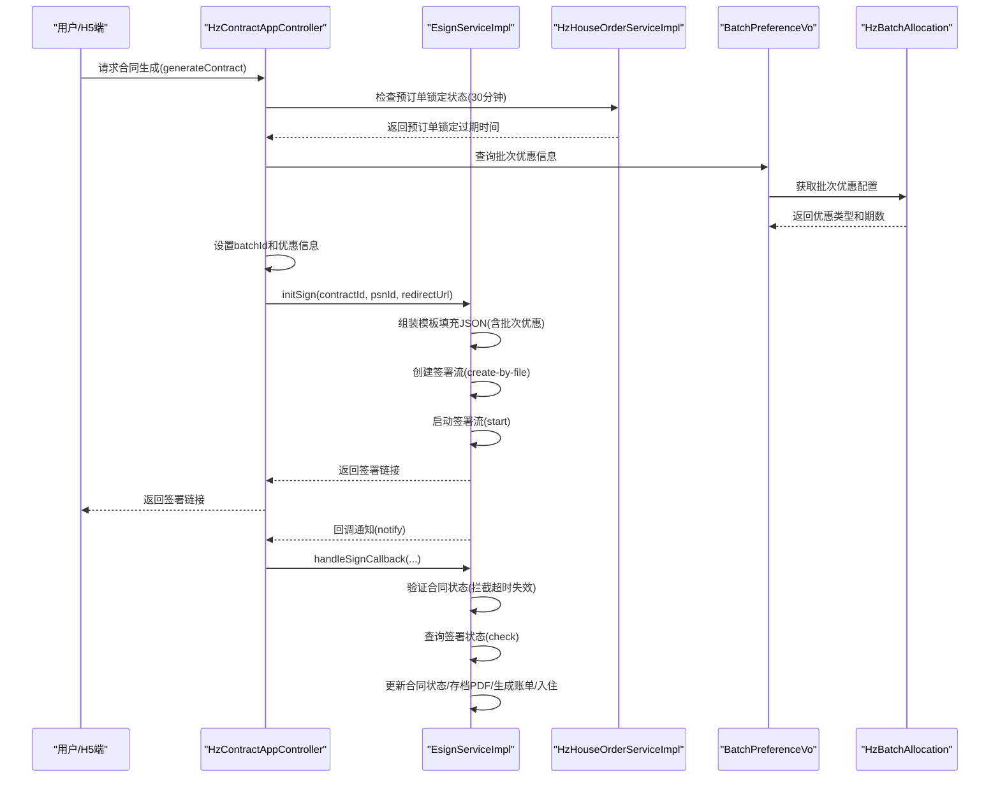

**图表来源**
- [HzContractAppController.java](file://ruoyi-admin/src/main/java/com/ruoyi/web/controller/h5/HzContractAppController.java)
- [EsignServiceImpl.java](file://ruoyi-system/src/main/java/com/ruoyi/system/service/impl/EsignServiceImpl.java)
- [HzHouseOrderServiceImpl.java](file://ruoyi-system/src/main/java/com/ruoyi/system/service/impl/HzHouseOrderServiceImpl.java)
- [BatchPreferenceVo.java](file://ruoyi-system/src/main/java/com/ruoyi/system/domain/vo/BatchPreferenceVo.java)
- [HzBatchAllocation.java](file://ruoyi-system/src/main/java/com/ruoyi/system/domain/HzBatchAllocation.java)

## 详细组件分析

### 数据模型设计与关系映射
HzContract、HzContractTemplate、HzContractSignature、HzContractFiling、HzCoupon、HzCouponReceive、HzSubsidyApply、HzCheckIn、HzCheckoutApply、HzCheckoutRecord、HzHouseFacility、HzHouseTypeFacility、HzFacilityItem、BatchPreferenceVo、HzBatchAllocation、HzBatchHouse、HzHouseOrder十者构成合同数据模型的核心，分别对应合同主体、模板、签名记录、合同备案、优惠券、优惠券领取、补贴申请、入住管理、退租流程、设施配置、批次优惠和选房预订单。

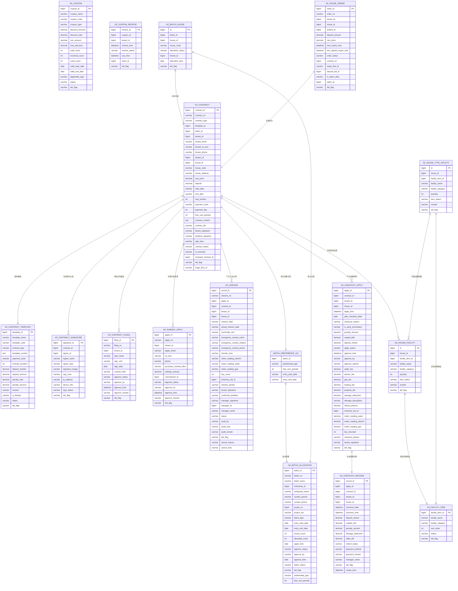

- HzContract：合同主表，包含合同编号、类型、模板ID、租户信息、房源信息、金额与周期、合同状态、e签宝流程ID等，**新增** batchId字段用于批次配租合同识别。
- HzContractTemplate：模板表，包含模板类型、内容、支付周期、期限、押金与违约金规则、版本与状态等。
- HzContractSignature：签名记录表，记录每次签署的参与者、签名图片、IP与设备信息、签名时间与状态等。
- **新增** HzContractFiling：合同备案表，记录购房合同的备案信息，支持审批状态跟踪。
- **新增** HzCoupon：优惠券表，管理优惠券的类型、金额、有效期、适用范围等属性。
- **新增** HzCouponReceive：优惠券领取记录表，追踪租户优惠券的领取、使用、过期状态。
- **新增** HzSubsidyApply：代购补贴申请表，管理租户购房后的补贴申请流程。
- HzCheckIn：入住记录表，记录租户的入住申请、审核状态、入住时间、设施确认、取消原因等。
- HzCheckoutApply：退租申请表，记录退租申请的详细信息，包括押金退款、违约金、审批状态等。
- HzCheckoutRecord：退租记录表，记录退租执行过程中的退款状态、支付方式、退款备注等。
- **新增** HzHouseFacility：房源设施表，记录每个房源的设施配置，包括设施名称、类别、数量等。
- **新增** HzHouseTypeFacility：户型设施表，记录户型的默认设施配置，作为房源设施的回退选项。
- **新增** HzFacilityItem：设施物品表，管理设施物品的基础信息，包括分类、排序、状态等。
- **新增** BatchPreferenceVo：批次优惠信息表，封装批次优惠的完整信息，包括批次ID、优惠类型、免租期数、入驻日期等。
- **新增** HzBatchAllocation：批次优惠配置表，管理批次层面的优惠配置，支持免租期数等优惠类型的设置。
- **新增** HzBatchHouse：批次房源关联表，建立批次与具体房源的关联关系，支持批次配租模式。
- **新增** HzHouseOrder：选房预订单表，管理选房预订单的锁定过期时间，**更新** 锁定过期时间从10分钟延长到30分钟。

**图表来源**
- [HzContract.java](file://ruoyi-system/src/main/java/com/ruoyi/system/domain/HzContract.java)
- [HzContractTemplate.java](file://ruoyi-system/src/main/java/com/ruoyi/system/domain/HzContractTemplate.java)
- [HzContractSignature.java](file://ruoyi-system/src/main/java/com/ruoyi/system/domain/HzContractSignature.java)
- [HzContractFiling.java](file://ruoyi-system/src/main/java/com/ruoyi/system/domain/HzContractFiling.java)
- [HzCoupon.java](file://ruoyi-system/src/main/java/com/ruoyi/system/domain/HzCoupon.java)
- [HzCouponReceive.java](file://ruoyi-system/src/main/java/com/ruoyi/system/domain/HzCouponReceive.java)
- [HzSubsidyApply.java](file://ruoyi-system/src/main/java/com/ruoyi/system/domain/HzSubsidyApply.java)
- [HzCheckIn.java](file://ruoyi-system/src/main/java/com/ruoyi/system/domain/HzCheckIn.java)
- [HzCheckoutApply.java](file://ruoyi-system/src/main/java/com/ruoyi/system/domain/HzCheckoutApply.java)
- [HzCheckoutRecord.java](file://ruoyi-system/src/main/java/com/ruoyi/system/domain/HzCheckoutRecord.java)
- [HzHouseFacility.java](file://ruoyi-system/src/main/java/com/ruoyi/system/domain/HzHouseFacility.java)
- [HzHouseTypeFacility.java](file://ruoyi-system/src/main/java/com/ruoyi/system/domain/HzHouseTypeFacility.java)
- [HzFacilityItem.java](file://ruoyi-system/src/main/java/com/ruoyi/system/domain/HzFacilityItem.java)
- [BatchPreferenceVo.java](file://ruoyi-system/src/main/java/com/ruoyi/system/domain/vo/BatchPreferenceVo.java)
- [HzBatchAllocation.java](file://ruoyi-system/src/main/java/com/ruoyi/system/domain/HzBatchAllocation.java)
- [HzBatchHouse.java](file://ruoyi-system/src/main/java/com/ruoyi/system/domain/HzBatchHouse.java)
- [HzHouseOrder.java](file://ruoyi-system/src/main/java/com/ruoyi/system/domain/HzHouseOrder.java)

**章节来源**
- [HzContract.java](file://ruoyi-system/src/main/java/com/ruoyi/system/domain/HzContract.java)
- [HzContractTemplate.java](file://ruoyi-system/src/main/java/com/ruoyi/system/domain/HzContractTemplate.java)
- [HzContractSignature.java](file://ruoyi-system/src/main/java/com/ruoyi/system/domain/HzContractSignature.java)
- [HzContractFiling.java](file://ruoyi-system/src/main/java/com/ruoyi/system/domain/HzContractFiling.java)
- [HzCoupon.java](file://ruoyi-system/src/main/java/com/ruoyi/system/domain/HzCoupon.java)
- [HzCouponReceive.java](file://ruoyi-system/src/main/java/com/ruoyi/system/domain/HzCouponReceive.java)
- [HzSubsidyApply.java](file://ruoyi-system/src/main/java/com/ruoyi/system/domain/HzSubsidyApply.java)
- [HzCheckIn.java](file://ruoyi-system/src/main/java/com/ruoyi/system/domain/HzCheckIn.java)
- [HzCheckoutApply.java](file://ruoyi-system/src/main/java/com/ruoyi/system/domain/HzCheckoutApply.java)
- [HzCheckoutRecord.java](file://ruoyi-system/src/main/java/com/ruoyi/system/domain/HzCheckoutRecord.java)
- [HzHouseFacility.java](file://ruoyi-system/src/main/java/com/ruoyi/system/domain/HzHouseFacility.java)
- [HzHouseTypeFacility.java](file://ruoyi-system/src/main/java/com/ruoyi/system/domain/HzHouseTypeFacility.java)
- [HzFacilityItem.java](file://ruoyi-system/src/main/java/com/ruoyi/system/domain/HzFacilityItem.java)
- [BatchPreferenceVo.java](file://ruoyi-system/src/main/java/com/ruoyi/system/domain/vo/BatchPreferenceVo.java)
- [HzBatchAllocation.java](file://ruoyi-system/src/main/java/com/ruoyi/system/domain/HzBatchAllocation.java)
- [HzBatchHouse.java](file://ruoyi-system/src/main/java/com/ruoyi/system/domain/HzBatchHouse.java)
- [HzHouseOrder.java](file://ruoyi-system/src/main/java/com/ruoyi/system/domain/HzHouseOrder.java)

### 合同业务流程
系统支持从合同创建、模板填充、签署、状态跟踪到账单生成与入住登记的完整流程。核心流程如下：

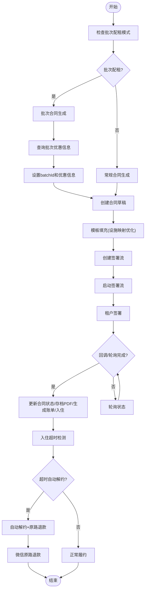

- **更新** 批量优惠处理：从只处理免租优惠扩展为处理所有批次优惠，始终设置batchId确保批次信息记录，改进了合同创建流程的健壮性。
- **更新** 模板填充：设施映射逻辑从复杂的聚合统计简化为一对一直接映射，移除了原有的设施数量聚合逻辑，直接根据设施映射数组进行填充。
- **更新** 房间锁定机制：将房间锁定过期时间从10分钟延长到30分钟，更好地适应合同签署过程中的时间需求，**更新** 预订单锁定过期时间延长至30分钟，与押金支付超时时间对齐。
- 签署流：自动盖章（平台企业）与手动签名（租户），支持多页签章与签署日期展示。
- 状态跟踪：通过回调与轮询双重机制确保状态一致性，完成后自动触发账单与入住流程。
- **新增** 合同备案：租户提交购房合同备案，管理端审批通过后进入正式合同流程。
- **新增** 优惠券：系统发放优惠券，租户领取后可在合同签署或入住时使用。
- **新增** 代购补贴：租户购房后申请代购补贴，需先签署承诺书再提交申请。
- **新增** 入住超时自动解约：合同推进到履行中状态后，系统监控入住申请提交情况，超时自动解约并原路退款。
- **新增** 安全保护机制：在回调处理中增加对状态为'6'（超时失效）的合同的拦截保护，防止外部系统对已过期合同进行状态篡改。

**图表来源**
- [HzContractAppController.java](file://ruoyi-admin/src/main/java/com/ruoyi/web/controller/h5/HzContractAppController.java)
- [EsignServiceImpl.java](file://ruoyi-system/src/main/java/com/ruoyi/system/service/impl/EsignServiceImpl.java)
- [EsignController.java](file://ruoyi-admin/src/main/java/com/ruoyi/web/controller/h5/EsignController.java)
- [ContractExpireTask.java](file://ruoyi-quartz/src/main/java/com/ruoyi/quartz/task/ContractExpireTask.java)

**章节来源**
- [HzContractAppController.java](file://ruoyi-admin/src/main/java/com/ruoyi/web/controller/h5/HzContractAppController.java)
- [EsignServiceImpl.java](file://ruoyi-system/src/main/java/com/ruoyi/system/service/impl/EsignServiceImpl.java)
- [EsignController.java](file://ruoyi-admin/src/main/java/com/ruoyi/web/controller/h5/EsignController.java)
- [ContractExpireTask.java](file://ruoyi-quartz/src/main/java/com/ruoyi/quartz/task/ContractExpireTask.java)

### e签宝集成架构
- SDK封装：EsignHttpHelper负责HTTP请求、签名构造与头部构建；EsignCoreSdkInfo提供SDK版本信息。
- 服务接口：EsignService定义实名认证、模板查询、文件创建、签署流管理、状态轮询与回调处理等接口。
- 控制器：EsignController提供H5/小程序端的统一入口，包括认证URL获取、一键签署、签署链接获取、回调接收与状态轮询。

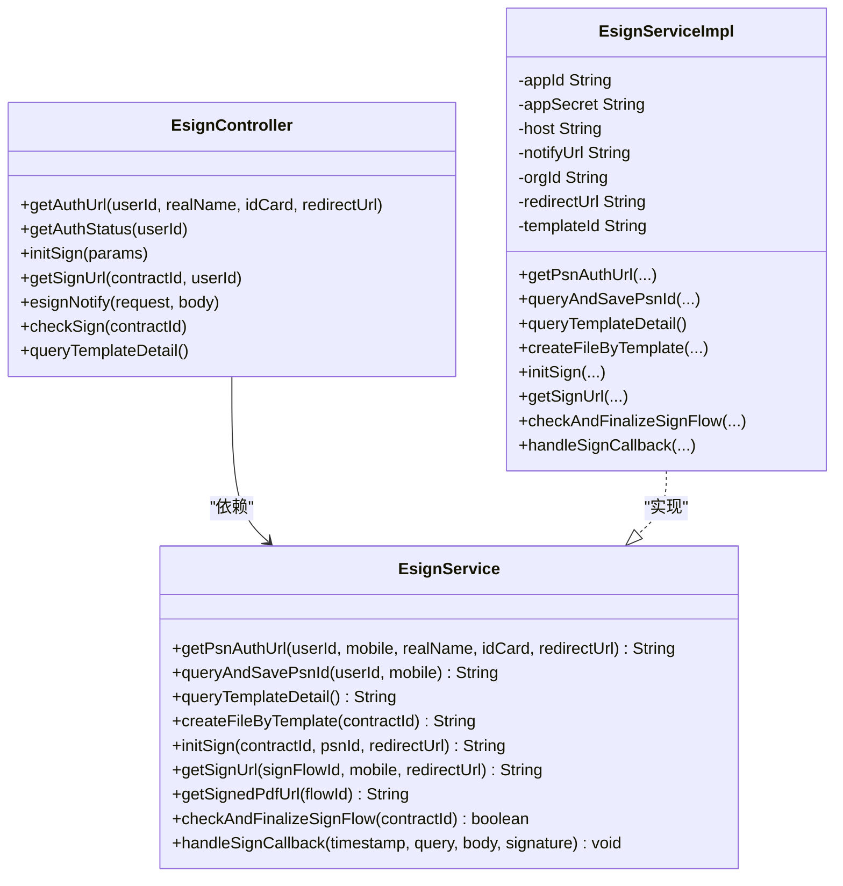

**图表来源**
- [EsignService.java](file://ruoyi-system/src/main/java/com/ruoyi/system/service/EsignService.java)
- [EsignServiceImpl.java](file://ruoyi-system/src/main/java/com/ruoyi/system/service/impl/EsignServiceImpl.java)
- [EsignController.java](file://ruoyi-admin/src/main/java/com/ruoyi/web/controller/h5/EsignController.java)

**章节来源**
- [EsignService.java](file://ruoyi-system/src/main/java/com/ruoyi/system/service/EsignService.java)
- [EsignServiceImpl.java](file://ruoyi-system/src/main/java/com/ruoyi/system/service/impl/EsignServiceImpl.java)
- [EsignController.java](file://ruoyi-admin/src/main/java/com/ruoyi/web/controller/h5/EsignController.java)

### 合同状态管理与到期处理
- 合同状态：草稿（0）、待签署（1）、已签署（2）、履行中（3）、已到期（4）、已解约（5）、超时失效（6）。
- **更新** 合同备案状态：待审批（0）、已通过（1）、已驳回（2）。
- **更新** 优惠券状态：未使用（0）、已使用（1）、已过期（2）。
- **更新** 代购补贴状态：待审批（0）、已通过（1）、已驳回（2）。
- **更新** 入住超时自动解约：当合同状态为履行中且超过设定时限未提交入住申请时，系统自动执行解约流程。
- 到期处理：通过ContractExpireTask定时任务扫描合同状态，对超时未签署的合同进行失效处理并释放房源占用。

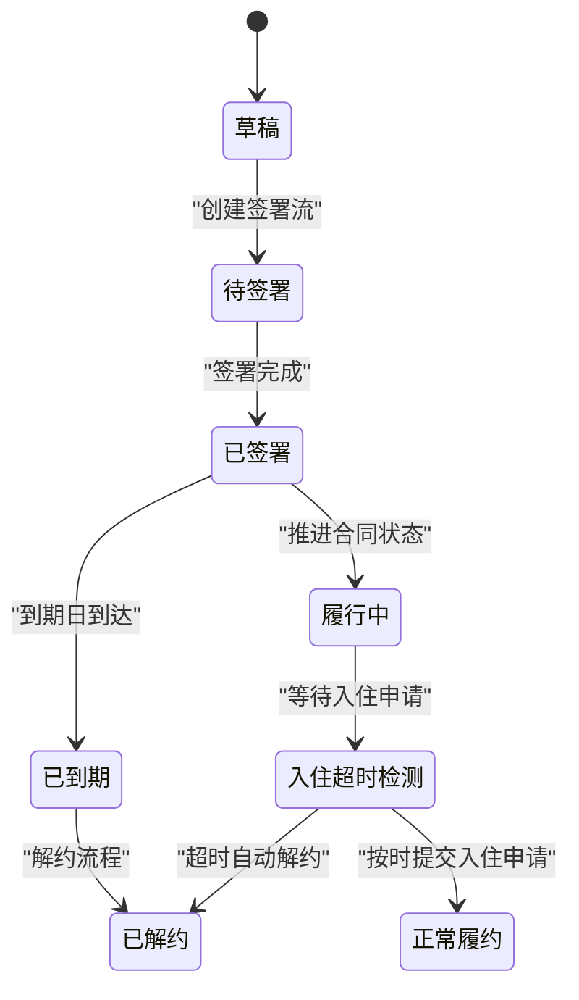

**图表来源**
- [HzContractServiceImpl.java](file://ruoyi-system/src/main/java/com/ruoyi/system/service/impl/HzContractServiceImpl.java)
- [ContractExpireTask.java](file://ruoyi-quartz/src/main/java/com/ruoyi/quartz/task/ContractExpireTask.java)
- [HzContract.java](file://ruoyi-system/src/main/java/com/ruoyi/system/domain/HzContract.java)

**章节来源**
- [HzContractServiceImpl.java](file://ruoyi-system/src/main/java/com/ruoyi/system/service/impl/HzContractServiceImpl.java)
- [ContractExpireTask.java](file://ruoyi-quartz/src/main/java/com/ruoyi/quartz/task/ContractExpireTask.java)
- [HzContract.java](file://ruoyi-system/src/main/java/com/ruoyi/system/domain/HzContract.java)

### 房间锁定机制优化
**更新** 系统对房间锁定机制进行了重要优化，将房间锁定过期时间从10分钟延长到30分钟，更好地适应合同签署过程中的时间需求。

#### 房间锁定机制改进原理
- **锁定过期时间延长**：将预订单锁定过期时间从10分钟延长到30分钟，与押金支付超时时间对齐。
- **预订单锁定机制**：当用户通过预订单创建合同时，系统会延长锁定过期时间至30分钟，避免签约耗时较长导致原10分钟锁房到期后房源被误释放。
- **合同列表锁定机制**：对于已签署但尚未支付押金的合同，系统使用签署时间加30分钟计算锁定过期时间，确保用户有充足时间完成押金支付。
- **批次配租锁定机制**：批次配租用户的锁定过期时间根据批次入住结束日期设置，不再受10分钟限制。

#### 房间锁定机制实现
```java
// 已签署待付押金倒计时的锁定过期时间计算（更新）
// 用签署时间 + 30分钟 计算锁定过期时间
Object signTimeObj = contract.get("sign_time");
if (signTimeObj != null) {
    try {
        java.util.Date signTime;
        if (signTimeObj instanceof java.time.LocalDateTime) {
            java.time.LocalDateTime ldt = (java.time.LocalDateTime) signTimeObj;
            signTime = java.util.Date.from(ldt.atZone(java.time.ZoneId.systemDefault()).toInstant());
        } else if (signTimeObj instanceof java.util.Date) {
            signTime = (java.util.Date) signTimeObj;
        } else {
            String s = signTimeObj.toString().replace("T", " ");
            signTime = new java.text.SimpleDateFormat("yyyy-MM-dd HH:mm:ss").parse(s);
        }
        java.util.Calendar cal = java.util.Calendar.getInstance();
        cal.setTime(signTime);
        cal.add(java.util.Calendar.MINUTE, 30); // 从10分钟延长到30分钟
        contract.put("lock_expire_time", cal.getTime());
    } catch (Exception e) {
        // sign_time 格式异常，忽略
    }
}

// 预订单锁定过期时间延长（更新）
// 更新预订单：关联合同ID，状态从 '0'(待签约) 改为 '1'(待付押金)
// 同时将锁房到期时间延长至30分钟（与押金支付超时对齐）
if (result > 0) {
    matchedOrder.setContractId(contract.getContractId());
    matchedOrder.setOrderStatus("1");
    java.util.Calendar lockCal = java.util.Calendar.getInstance();
    lockCal.add(java.util.Calendar.MINUTE, 30); // 从10分钟延长到30分钟
    matchedOrder.setLockExpireTime(lockCal.getTime());
    matchedOrder.setUpdateTime(new java.util.Date());
    houseOrderService.updateById(matchedOrder);
}
```

#### 房间锁定机制优化效果
- **提升用户体验**：用户有更充足的时间完成合同签署和押金支付，减少因时间不足导致的流程中断。
- **降低系统压力**：延长锁定时间减少了用户频繁重新选择房源的情况，降低了系统压力。
- **增强业务灵活性**：与押金支付超时时间对齐，确保整个签约流程的协调一致。
- **批次配租支持**：批次配租用户的锁定机制更加灵活，不再受固定10分钟限制。

**章节来源**
- [HzContractAppController.java:157-195](file://ruoyi-admin/src/main/java/com/ruoyi/web/controller/h5/HzContractAppController.java#L157-L195)
- [HzContractAppController.java:763-773](file://ruoyi-admin/src/main/java/com/ruoyi/web/controller/h5/HzContractAppController.java#L763-L773)
- [HzHouseOrderServiceImpl.java:122-142](file://ruoyi-system/src/main/java/com/ruoyi/system/service/impl/HzHouseOrderServiceImpl.java#L122-L142)

### 批量优惠处理逻辑改进
**更新** 系统对批量优惠处理逻辑进行了重大改进，从只处理免租优惠扩展为处理所有批次优惠，始终设置batchId确保批次信息记录，改进了合同创建流程的健壮性。

#### 批量优惠处理改进原理
- **优惠类型扩展**：支持所有批次优惠类型，不仅限于免租优惠，还包括其他批次层面的优惠政策。
- **批次ID强制设置**：无论是否有优惠，始终设置batchId字段，确保批次信息的完整记录。
- **批次优惠配置**：通过HzBatchAllocation表的preferential_type字段区分不同的优惠类型。
- **批次配租模式识别**：通过batchId字段判断合同是否属于批次配租模式。

#### 批次优惠信息结构
```java
// 批次优惠信息封装
public class BatchPreferenceVo {
    private Long batchId;                    // 批次ID
    private String preferentialType;         // 优惠类型(0:无优惠 1:免租期数)
    private Integer freeRentPeriods;         // 免租期数
    private String entryStartDate;           // 入驻开始日期
    private String entryEndDate;             // 入驻结束日期
}

// 批次优惠配置
public class HzBatchAllocation {
    private Long batchId;
    private String preferentialType;         // 优惠类型
    private Integer freeRentPeriods;         // 免租期数
    // ... 其他批次配置字段
}
```

#### 批次优惠处理流程
```java
// 批量优惠处理（改进后）
try {
    BatchPreferenceVo batchPreference = batchHouseMapper.selectBatchPreferenceByHouseId(houseId);
    if (batchPreference != null) {
        // 始终记录批次ID（用于配租方式判定）
        contract.setBatchId(batchPreference.getBatchId());
        
        // 处理所有批次优惠类型
        if ("1".equals(batchPreference.getPreferentialType())) {
            // 免租优惠
            contract.setFreeRentPeriods(batchPreference.getFreeRentPeriods());
            logger.info("房源 {} 属于配租批次 {}，享受免租 {} 期优惠", 
                       houseId, batchPreference.getBatchId(), batchPreference.getFreeRentPeriods());
        } else {
            // 其他批次优惠类型处理
            contract.setFreeRentPeriods(0);
            logger.info("房源 {} 属于配租批次 {}，优惠类型：{}，无免租优惠", 
                       houseId, batchPreference.getBatchId(), batchPreference.getPreferentialType());
        }
    } else {
        // 非批次配租
        contract.setFreeRentPeriods(0);
    }
} catch (Exception ex) {
    logger.error("获取批次优惠信息失败，默认无优惠: {}", ex.getMessage());
    contract.setFreeRentPeriods(0);
}
```

#### 批次配租模式下的合同生成
```java
// 批次配租模式下的合同生成逻辑
if (isBatchMode) {
    // 批次配租模式：使用批次入驻日期
    startDate = LocalDate.parse(batchStartDate);
    contract.setBatchId(batchPreference.getBatchId());
    contract.setFreeRentPeriods(batchPreference.getFreeRentPeriods());
} else if (oldContractId != null) {
    // 续租模式：从原合同到期日开始
    // ... 续租逻辑
} else {
    // 新签模式：当前日期+3天
    startDate = LocalDate.now().plusDays(3);
}
```

#### 性能提升效果
- **逻辑简化**：统一处理所有批次优惠类型，避免了针对不同优惠类型的分支判断。
- **数据完整性**：始终设置batchId，确保批次信息的完整记录，便于后续的批次管理和统计分析。
- **扩展性增强**：新的优惠类型可以在HzBatchAllocation表中直接添加，无需修改业务逻辑代码。
- **健壮性提升**：即使批次优惠配置异常，也能保证合同创建流程的正常进行。

**章节来源**
- [HzContractAppController.java:682-702](file://ruoyi-admin/src/main/java/com/ruoyi/web/controller/h5/HzContractAppController.java#L682-L702)
- [BatchPreferenceVo.java](file://ruoyi-system/src/main/java/com/ruoyi/system/domain/vo/BatchPreferenceVo.java)
- [HzBatchAllocation.java](file://ruoyi-system/src/main/java/com/ruoyi/system/domain/HzBatchAllocation.java)
- [HzBatchHouseMapper.xml](file://ruoyi-system/src/main/resources/mapper/system/HzBatchHouseMapper.xml)

### 设施映射逻辑优化
**更新** 系统对设施映射逻辑进行了重大优化，从复杂的聚合统计简化为直接一对一映射，显著提升了系统性能和维护性。

#### 设施映射优化原理
- **优先级规则**：优先使用房源单独配置（hz_house_facility）；若房源未单独配置，回退使用户型默认配置（hz_house_type_facility）。
- **一对一映射**：移除原有的设施数量聚合逻辑，直接通过facilityMapping数组进行一对一映射填充。
- **简化流程**：设施数据不再需要复杂的统计和合并，直接根据映射关系填充到对应的e签宝控件。

#### 新增设施类别
系统支持以下设施类别的直接映射：
- **墙面**：墙面装修状况（如乳胶漆、壁纸等）
- **地板**：地板材质（如实木地板、复合地板、瓷砖等）
- **地毯**：地毯铺设情况
- **密码锁**：门锁类型（如智能密码锁、传统门锁等）
- **厨房推拉门**：厨房门类型（推拉门、平开门等）
- **窗户**：窗户类型和数量（塑钢窗、断桥铝窗等）

#### 设施映射实现
```java
// 设施映射数组（示例）
String[][] facilityMapping = {
    {"墙面", "component_wall"},      // 墙面设施映射
    {"地板", "component_floor"},      // 地板设施映射
    {"地毯", "component_carpet"},     // 地毯设施映射
    {"密码锁", "component_lock"},     // 密码锁设施映射
    {"厨房推拉门", "component_kitchen_door"}, // 厨房推拉门映射
    {"窗户", "component_window"}      // 窗户设施映射
};

// 一对一直接映射填充
for (String[] mapping : facilityMapping) {
    int qty = facilityQtyMap.getOrDefault(mapping[0], 0);
    if (qty > 0) {
        sb.append("  {\"componentId\": \"" + mapping[1] + "\", \"componentValue\": \"" + qty + "\"},\n");
    }
}
```

#### 性能提升效果
- **查询优化**：移除复杂的聚合查询，直接使用facilityQtyMap进行快速查找
- **逻辑简化**：去除了原有的设施数量统计和合并逻辑
- **维护性提升**：一对一映射更直观，便于理解和维护
- **扩展性增强**：新增设施类别只需在facilityMapping中添加映射关系即可

**章节来源**
- [EsignServiceImpl.java:471-537](file://ruoyi-system/src/main/java/com/ruoyi/system/service/impl/EsignServiceImpl.java#L471-L537)
- [HzHouseFacility.java](file://ruoyi-system/src/main/java/com/ruoyi/system/domain/HzHouseFacility.java)
- [HzHouseTypeFacility.java](file://ruoyi-system/src/main/java/com/ruoyi/system/domain/HzHouseTypeFacility.java)
- [HzFacilityItem.java](file://ruoyi-system/src/main/java/com/ruoyi/system/domain/HzFacilityItem.java)

### 安全保护机制
**新增** 系统在EsignServiceImpl中新增了对状态为'6'（超时失效）的合同的回调拦截保护机制，防止外部系统对已过期合同进行状态篡改，提升系统安全性。

#### 安全保护机制原理
- **状态验证**：在handleSignCallback方法中增加对合同状态的严格验证
- **拦截逻辑**：当检测到合同状态为'6'（超时失效）时，立即拒绝处理并记录安全日志
- **防护目标**：防止恶意外部系统通过回调接口对已过期合同进行状态篡改
- **安全级别**：采用严格的白名单机制，只允许正常状态的合同进行回调处理

#### 安全保护实现
```java
// 回调处理中的安全验证（示例）
public void handleSignCallback(String timestamp, String requestQuery, String body, String signature) throws Exception {
    // 1. 验证回调签名
    if (!verifySignature(timestamp, requestQuery, body, signature)) {
        throw new SecurityException("回调签名验证失败");
    }
    
    // 2. 获取合同状态
    HzContract contract = contractMapper.selectById(contractId);
    if (contract == null) {
        throw new RuntimeException("合同不存在: " + contractId);
    }
    
    // 3. 安全拦截：检查合同状态
    if ("6".equals(contract.getContractStatus())) {
        log.warn("安全拦截：尝试对超时失效合同进行状态篡改 contractId={}, status={}", 
                 contractId, contract.getContractStatus());
        throw new SecurityException("无法处理已超时失效的合同状态变更");
    }
    
    // 4. 继续正常的回调处理流程...
    processCallback(contract, body);
}
```

#### 安全保护效果
- **防篡改**：完全阻止对已过期合同的状态修改请求
- **审计追踪**：所有拦截事件都会记录详细的日志信息
- **系统稳定**：防止恶意攻击导致的系统状态混乱
- **合规保障**：符合金融行业对电子合同安全性的严格要求

**章节来源**
- [EsignServiceImpl.java:830](file://ruoyi-system/src/main/java/com/ruoyi/system/service/impl/EsignServiceImpl.java#L830)

### 合同备案功能
**新增** 系统实现合同备案功能，提供完整的备案提交、审批、查询闭环管理。

#### 备案流程设计
- **提交阶段**：租户填写备案信息并上传合同附件，系统生成备案编号并设置待审批状态。
- **审批阶段**：管理端查看备案详情，支持通过或驳回操作，填写审批意见。
- **状态跟踪**：支持按审批状态查询个人备案记录，实时跟踪处理进度。

#### 核心功能特性
- **多附件支持**：支持多文件上传，合同附件以逗号分隔存储。
- **审批权限控制**：只有管理端用户可进行审批操作，确保流程合规性。
- **状态管理**：完整的审批状态流转，支持驳回后重新提交。

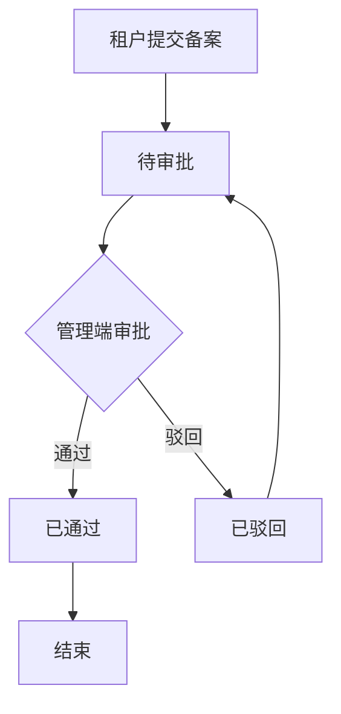

**图表来源**
- [HzContractFilingAppController.java](file://ruoyi-admin/src/main/java/com/ruoyi/web/controller/h5/HzContractFilingAppController.java)
- [HzContractFilingServiceImpl.java](file://ruoyi-system/src/main/java/com/ruoyi/system/service/impl/HzContractFilingServiceImpl.java)

**章节来源**
- [HzContractFilingAppController.java](file://ruoyi-admin/src/main/java/com/ruoyi/web/controller/h5/HzContractFilingAppController.java)
- [HzContractFilingServiceImpl.java](file://ruoyi-system/src/main/java/com/ruoyi/system/service/impl/HzContractFilingServiceImpl.java)
- [HzContractFiling.java](file://ruoyi-system/src/main/java/com/ruoyi/system/domain/HzContractFiling.java)

### 优惠券功能
**新增** 系统实现完整的优惠券生命周期管理，支持多种优惠券类型的发放与使用。

#### 优惠券类型与规则
- **满减券**：消费满指定金额减固定金额
- **折扣券**：消费享受指定折扣率
- **抵扣券**：直接抵扣指定金额

#### 发放与领取机制
- **原子性发放**：使用数据库级原子操作控制优惠券发放，避免超发。
- **并发控制**：通过唯一键约束防止重复领取，确保数据一致性。
- **有效期管理**：自动过滤过期优惠券，支持精确的时间控制。

#### 使用与统计
- **使用追踪**：记录优惠券使用时间、订单关联等详细信息。
- **状态统计**：实时统计各状态优惠券的数量，便于运营分析。
- **个人中心**：租户可查看已领取、已使用、已过期的优惠券列表。

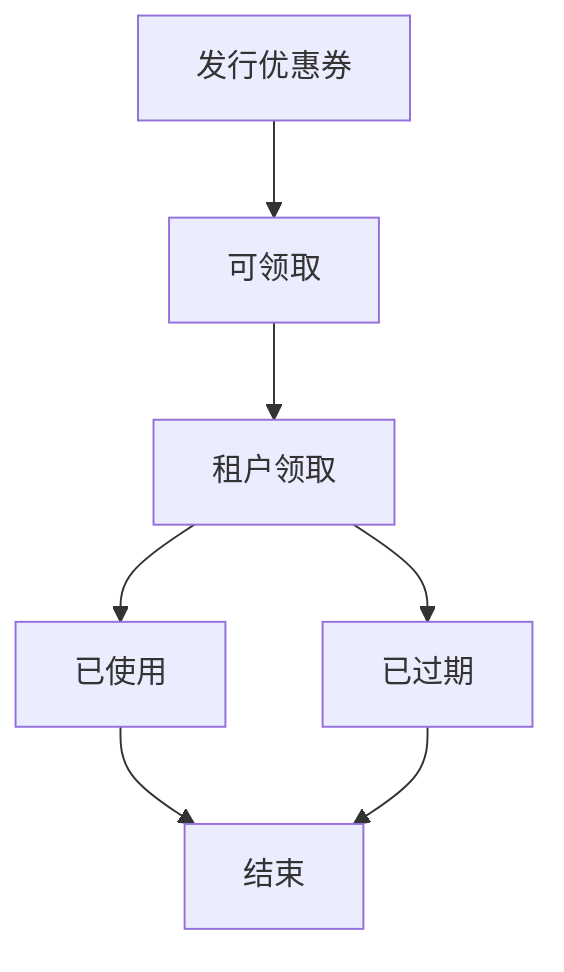

**图表来源**
- [HzCouponAppController.java](file://ruoyi-admin/src/main/java/com/ruoyi/web/controller/h5/HzCouponAppController.java)
- [HzCouponServiceImpl.java](file://ruoyi-system/src/main/java/com/ruoyi/system/service/impl/HzCouponServiceImpl.java)

**章节来源**
- [HzCouponAppController.java](file://ruoyi-admin/src/main/java/com/ruoyi/web/controller/h5/HzCouponAppController.java)
- [HzCouponServiceImpl.java](file://ruoyi-system/src/main/java/com/ruoyi/system/service/impl/HzCouponServiceImpl.java)
- [HzCoupon.java](file://ruoyi-system/src/main/java/com/ruoyi/system/domain/HzCoupon.java)
- [HzCouponReceive.java](file://ruoyi-system/src/main/java/com/ruoyi/system/domain/HzCouponReceive.java)

### 代购补贴申请功能
**新增** 系统实现代购补贴申请的完整流程，整合承诺书签署与补贴申请的协同工作。

#### 申请流程设计
- **承诺书签署**：租户先签署承诺书，获得承诺书ID作为申请前提。
- **申请提交**：填写申请人信息、上传购房合同附件、填写补贴金额。
- **审批管理**：管理端审核申请材料，支持通过或驳回操作。

#### 核心业务逻辑
- **前置条件**：必须先完成承诺书签署，确保申请的合法性。
- **材料完整性**：购房合同附件必须上传，保证申请的真实性。
- **金额控制**：补贴金额需与购房合同金额匹配，防止超额申请。

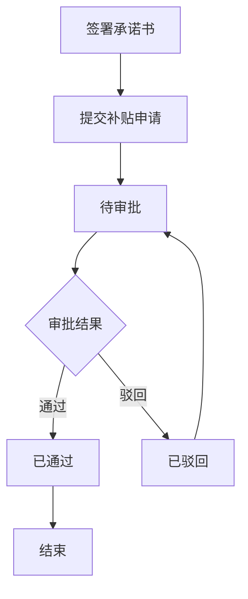

**图表来源**
- [HzSubsidyApplyAppController.java](file://ruoyi-admin/src/main/java/com/ruoyi/web/controller/h5/HzSubsidyApplyAppController.java)
- [HzSubsidyApplyServiceImpl.java](file://ruoyi-system/src/main/java/com/ruoyi/system/service/impl/HzSubsidyApplyServiceImpl.java)

**章节来源**
- [HzSubsidyApplyAppController.java](file://ruoyi-admin/src/main/java/com/ruoyi/web/controller/h5/HzSubsidyApplyAppController.java)
- [HzSubsidyApplyServiceImpl.java](file://ruoyi-system/src/main/java/com/ruoyi/system/service/impl/HzSubsidyApplyServiceImpl.java)
- [HzSubsidyApply.java](file://ruoyi-system/src/main/java/com/ruoyi/system/domain/HzSubsidyApply.java)

### 入住超时自动解约功能
**更新** 系统实现入住超时自动解约功能，提供完整的超时检测、自动取消、退款处理生命周期管理。

#### 超时检测机制
- **配置参数**：支持通过系统配置启用/禁用、设置启用日期、超时小时数（默认72小时）、演练模式等。
- **候选合同筛选**：扫描合同状态为履行中、创建时间在启用日期之后的合同。
- **豁免条件**：若租户已提交过任何入住申请（状态≥1）则永久豁免超时处理。

#### 自动取消流程
- **演练模式**：在演练模式下仅发送提醒通知，不实际执行解约操作。
- **真实执行**：调用事务方法完成数据库操作，包括创建退租申请、退租记录、修改合同状态、释放房源、软删除入住单等。
- **退款处理**：调用微信退款API，对押金和首期租金进行原路退款。

#### 退款处理机制
- **退款条件**：必须具备transaction_no才能进行原路退款。
- **退款顺序**：先申请押金退款，再申请首期租金退款。
- **状态更新**：根据退款结果更新退租记录的状态为成功或失败。

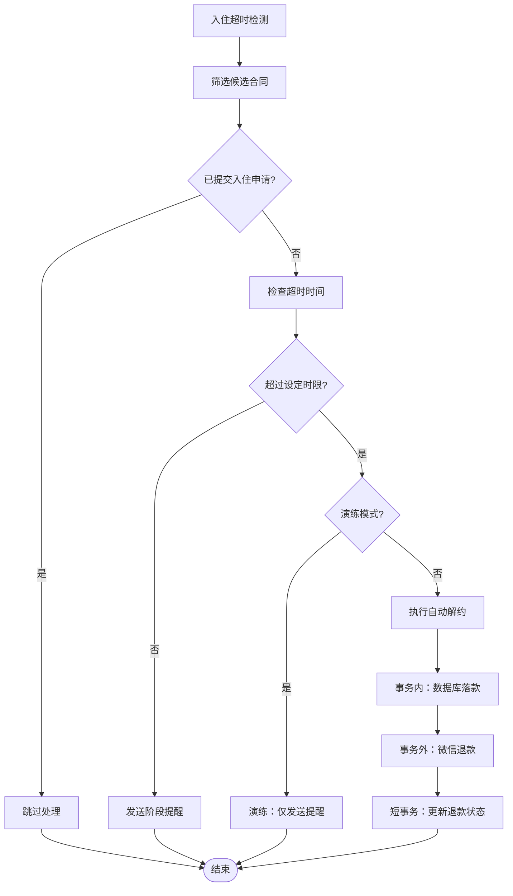

**图表来源**
- [ContractExpireTask.java](file://ruoyi-quartz/src/main/java/com/ruoyi/quartz/task/ContractExpireTask.java)
- [HzContractServiceImpl.java](file://ruoyi-system/src/main/java/com/ruoyi/system/service/impl/HzContractServiceImpl.java)

**章节来源**
- [ContractExpireTask.java](file://ruoyi-quartz/src/main/java/com/ruoyi/quartz/task/ContractExpireTask.java)
- [HzContractServiceImpl.java](file://ruoyi-system/src/main/java/com/ruoyi/system/service/impl/HzContractServiceImpl.java)

### 入住超时倒计时功能
**更新** 系统提供入住超时倒计时功能，帮助租户了解剩余时间并及时办理入住手续。

#### 倒计时计算逻辑
- **起始时间**：以押金账单的支付时间为基准。
- **截止时间**：支付时间加上超时小时数（默认72小时）。
- **剩余时间**：当前时间距离截止时间的剩余秒数。
- **显示规则**：当剩余时间≤0时显示"已超时"，否则显示剩余小时数。

#### API接口
- **接口名称**：getCheckinCountdown
- **参数**：contractId（合同ID）
- **返回值**：包含showCountdown、remainingSeconds、totalSeconds、deadline、timeoutHours等字段
- **用途**：前端显示入住倒计时，提醒租户及时办理入住

**章节来源**
- [HzCheckInAppController.java](file://ruoyi-admin/src/main/java/com/ruoyi/web/controller/h5/HzCheckInAppController.java)
- [checkin.js](file://uniapp-h5/api/checkin.js)

### 模板版本管理与批量签署
- 版本管理：模板表包含version字段，支持模板迭代与默认模板切换。
- 批量签署：可通过批量创建签署流的方式实现多合同并行签署，结合状态轮询与回调处理提升效率。

**章节来源**
- [HzContractTemplate.java](file://ruoyi-system/src/main/java/com/ruoyi/system/domain/HzContractTemplate.java)
- [HzContractTemplateServiceImpl.java](file://ruoyi-system/src/main/java/com/ruoyi/system/service/impl/HzContractTemplateServiceImpl.java)
- [EsignServiceImpl.java](file://ruoyi-system/src/main/java/com/ruoyi/system/service/impl/EsignServiceImpl.java)

### 用户体验与合规保障
- 用户体验：提供一键签署、实名认证、签署链接获取、状态轮询、入住倒计时、合同备案、优惠券领取、补贴申请等接口，简化业务流程。
- 合规保障：模板填充严格遵循e签宝控件规范，金额大写、日期拆分、设施统计等字段均符合法律要求。
- 安全性：通过SDK签名、MD5校验、回调验签与IP/设备记录等手段保障签署安全。
- **更新** 自动解约保障：入住超时自动解约功能确保系统在租户未按时履约时能够及时止损，保护双方权益。
- **新增** 多功能集成：合同备案、优惠券、补贴申请等功能与电子合同系统无缝集成，提升整体业务价值。
- **更新** 设施映射优化：设施映射逻辑的简化提升了模板填充的性能和准确性，减少了因设施统计错误导致的签署失败。
- **新增** 安全保护机制：新增的回调拦截保护机制有效防止外部系统对已过期合同的状态篡改，提升了系统的整体安全性。
- **新增** 批量优惠处理：批量优惠处理逻辑的重大改进提升了批次配租模式的灵活性和健壮性，支持更多样化的优惠类型。
- **更新** 房间锁定机制：房间锁定过期时间从10分钟延长到30分钟，更好地适应合同签署过程中的时间需求，提升用户体验。

**章节来源**
- [EsignController.java](file://ruoyi-admin/src/main/java/com/ruoyi/web/controller/h5/EsignController.java)
- [HzContractAppController.java](file://ruoyi-admin/src/main/java/com/ruoyi/web/controller/h5/HzContractAppController.java)
- [EsignServiceImpl.java](file://ruoyi-system/src/main/java/com/ruoyi/system/service/impl/EsignServiceImpl.java)
- [EsignHttpHelper.java](file://ruoyi-system/src/main/java/com/ruoyi/system/esign/EsignHttpHelper.java)
- [HzCheckInAppController.java](file://ruoyi-admin/src/main/java/com/ruoyi/web/controller/h5/HzCheckInAppController.java)

### 代购补贴申请前端实现
**新增** 系统提供完整的代购补贴申请前端界面，支持承诺书查看、签署和申请提交的一体化流程。

#### 前端界面设计
- **承诺书卡片**：展示承诺书模板内容，支持查看和签署
- **申请表单**：包含申请人信息、联系方式、补贴金额等字段
- **文件上传**：支持购房合同附件的多文件上传
- **状态提示**：显示承诺书签署状态和申请进度

#### 关键交互逻辑
- **承诺书加载**：通过模板代码获取承诺书内容
- **签署流程**：用户同意承诺内容后跳转至签署页面
- **申请提交**：填写必要信息后提交申请，等待审批
- **状态跟踪**：支持查看申请状态和审批结果

**章节来源**
- [subsidy-submit.vue](file://uniapp-h5/subpkg/purchase/subsidy-submit.vue)

### 设施数据模型关系完善
**更新** 完善了设施数据模型之间的关系映射，明确了各实体之间的关联关系。

#### 数据模型关系
- HzHouseFacility与HzFacilityItem：通过facility_item_id关联，实现设施物品的分类管理。
- HzHouseTypeFacility与HzFacilityItem：同样通过facility_item_id关联，确保户型设施与设施物品的一致性。
- HzContract与HzHouseFacility：通过house_id关联，实现合同与房源设施的绑定。
- HzContract与HzHouseTypeFacility：通过house_id关联，实现合同与户型设施的回退机制。
- **新增** BatchPreferenceVo与HzBatchAllocation：通过batch_id关联，实现批次优惠信息与配置的绑定。
- **新增** HzBatchHouse与BatchPreferenceVo：通过house_id关联，实现房源与批次优惠的关联。
- **新增** HzHouseOrder与HzContract：通过contract_id关联，实现预订单与合同的关联。

#### 优先级规则
- **房源设施优先**：优先使用HzHouseFacility中的设施配置。
- **户型设施回退**：当HzHouseFacility中无配置时，使用HzHouseTypeFacility中的默认配置。
- **设施物品映射**：通过HzFacilityItem实现设施名称与分类的标准化管理。
- **批次优惠优先**：优先使用批次优惠配置，支持多样化的优惠类型。
- **锁定机制优先**：预订单锁定过期时间根据业务需求动态调整，不再固定为10分钟。

**章节来源**
- [HzHouseFacility.java](file://ruoyi-system/src/main/java/com/ruoyi/system/domain/HzHouseFacility.java)
- [HzHouseTypeFacility.java](file://ruoyi-system/src/main/java/com/ruoyi/system/domain/HzHouseTypeFacility.java)
- [HzFacilityItem.java](file://ruoyi-system/src/main/java/com/ruoyi/system/domain/HzFacilityItem.java)
- [HzContract.java](file://ruoyi-system/src/main/java/com/ruoyi/system/domain/HzContract.java)
- [BatchPreferenceVo.java](file://ruoyi-system/src/main/java/com/ruoyi/system/domain/vo/BatchPreferenceVo.java)
- [HzBatchAllocation.java](file://ruoyi-system/src/main/java/com/ruoyi/system/domain/HzBatchAllocation.java)
- [HzBatchHouse.java](file://ruoyi-system/src/main/java/com/ruoyi/system/domain/HzBatchHouse.java)
- [HzHouseOrder.java](file://ruoyi-system/src/main/java/com/ruoyi/system/domain/HzHouseOrder.java)

## 依赖关系分析
- 控制器依赖服务接口，服务实现依赖领域模型与外部SDK。
- 合同服务与模板服务分别操作HzContract与HzContractTemplate，e签宝服务贯穿合同生命周期。
- **更新** 合同备案服务、优惠券服务、补贴申请服务提供独立的功能模块。
- **更新** 入住超时自动解约功能依赖HzCheckIn、HzCheckoutApply、HzCheckoutRecord等实体。
- **更新** 设施映射优化增强了HzHouseFacility、HzHouseTypeFacility与HzFacilityItem的依赖关系。
- **新增** 批次优惠处理增强了BatchPreferenceVo、HzBatchAllocation与HzBatchHouse的依赖关系。
- **更新** 房间锁定机制优化增强了HzHouseOrder与HzContract的依赖关系。
- 定时任务依赖合同服务，实现到期状态的自动化处理。
- **新增** 选房订单服务提供入住前置检查和订单状态管理。
- **新增** 房源设施服务提供设施配置的查询和管理功能。
- **新增** 户型设施服务提供户型设施的查询和管理功能。
- **新增** 安全保护机制依赖合同状态验证，防止对超时失效合同的回调处理。
- **新增** 批量优惠处理逻辑依赖HzBatchHouseMapper的批次优惠查询功能。
- **更新** 房间锁定机制依赖HzHouseOrderServiceImpl的锁定过期时间计算。

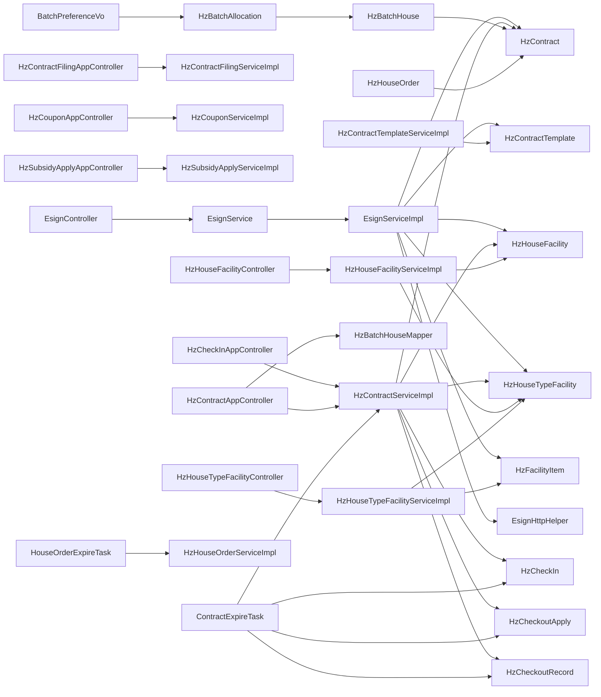

**图表来源**
- [EsignController.java](file://ruoyi-admin/src/main/java/com/ruoyi/web/controller/h5/EsignController.java)
- [EsignService.java](file://ruoyi-system/src/main/java/com/ruoyi/system/service/EsignService.java)
- [EsignServiceImpl.java](file://ruoyi-system/src/main/java/com/ruoyi/system/service/impl/EsignServiceImpl.java)
- [HzContract.java](file://ruoyi-system/src/main/java/com/ruoyi/system/domain/HzContract.java)
- [HzContractTemplate.java](file://ruoyi-system/src/main/java/com/ruoyi/system/domain/HzContractTemplate.java)
- [HzHouseFacility.java](file://ruoyi-system/src/main/java/com/ruoyi/system/domain/HzHouseFacility.java)
- [HzHouseTypeFacility.java](file://ruoyi-system/src/main/java/com/ruoyi/system/domain/HzHouseTypeFacility.java)
- [HzFacilityItem.java](file://ruoyi-system/src/main/java/com/ruoyi/system/domain/HzFacilityItem.java)
- [BatchPreferenceVo.java](file://ruoyi-system/src/main/java/com/ruoyi/system/domain/vo/BatchPreferenceVo.java)
- [HzBatchAllocation.java](file://ruoyi-system/src/main/java/com/ruoyi/system/domain/HzBatchAllocation.java)
- [HzBatchHouse.java](file://ruoyi-system/src/main/java/com/ruoyi/system/domain/HzBatchHouse.java)
- [HzContractFilingAppController.java](file://ruoyi-admin/src/main/java/com/ruoyi/web/controller/h5/HzContractFilingAppController.java)
- [HzCouponAppController.java](file://ruoyi-admin/src/main/java/com/ruoyi/web/controller/h5/HzCouponAppController.java)
- [HzSubsidyApplyAppController.java](file://ruoyi-admin/src/main/java/com/ruoyi/web/controller/h5/HzSubsidyApplyAppController.java)
- [HzCheckInAppController.java](file://ruoyi-admin/src/main/java/com/ruoyi/web/controller/h5/HzCheckInAppController.java)
- [HzHouseFacilityController.java](file://ruoyi-system/src/main/java/com/ruoyi/system/controller/HzHouseFacilityController.java)
- [HzHouseTypeFacilityController.java](file://ruoyi-system/src/main/java/com/ruoyi/system/controller/HzHouseTypeFacilityController.java)
- [HzContractServiceImpl.java](file://ruoyi-system/src/main/java/com/ruoyi/system/service/impl/HzContractServiceImpl.java)
- [HzContractTemplateServiceImpl.java](file://ruoyi-system/src/main/java/com/ruoyi/system/service/impl/HzContractTemplateServiceImpl.java)
- [ContractExpireTask.java](file://ruoyi-quartz/src/main/java/com/ruoyi/quartz/task/ContractExpireTask.java)
- [HouseOrderExpireTask.java](file://ruoyi-quartz/src/main/java/com/ruoyi/quartz/task/HouseOrderExpireTask.java)
- [HzHouseOrderServiceImpl.java](file://ruoyi-system/src/main/java/com/ruoyi/system/service/impl/HzHouseOrderServiceImpl.java)
- [HzHouseFacilityServiceImpl.java](file://ruoyi-system/src/main/java/com/ruoyi/system/service/impl/HzHouseFacilityServiceImpl.java)
- [HzHouseTypeFacilityServiceImpl.java](file://ruoyi-system/src/main/java/com/ruoyi/system/service/impl/HzHouseTypeFacilityServiceImpl.java)
- [HzBatchHouseMapper.java](file://ruoyi-system/src/main/java/com/ruoyi/system/mapper/HzBatchHouseMapper.java)
- [HzHouseOrder.java](file://ruoyi-system/src/main/java/com/ruoyi/system/domain/HzHouseOrder.java)

**章节来源**
- [EsignController.java](file://ruoyi-admin/src/main/java/com/ruoyi/web/controller/h5/EsignController.java)
- [EsignService.java](file://ruoyi-system/src/main/java/com/ruoyi/system/service/EsignService.java)
- [EsignServiceImpl.java](file://ruoyi-system/src/main/java/com/ruoyi/system/service/impl/EsignServiceImpl.java)
- [HzContract.java](file://ruoyi-system/src/main/java/com/ruoyi/system/domain/HzContract.java)
- [HzContractTemplate.java](file://ruoyi-system/src/main/java/com/ruoyi/system/domain/HzContractTemplate.java)
- [HzHouseFacility.java](file://ruoyi-system/src/main/java/com/ruoyi/system/domain/HzHouseFacility.java)
- [HzHouseTypeFacility.java](file://ruoyi-system/src/main/java/com/ruoyi/system/domain/HzHouseTypeFacility.java)
- [HzFacilityItem.java](file://ruoyi-system/src/main/java/com/ruoyi/system/domain/HzFacilityItem.java)
- [BatchPreferenceVo.java](file://ruoyi-system/src/main/java/com/ruoyi/system/domain/vo/BatchPreferenceVo.java)
- [HzBatchAllocation.java](file://ruoyi-system/src/main/java/com/ruoyi/system/domain/HzBatchAllocation.java)
- [HzBatchHouse.java](file://ruoyi-system/src/main/java/com/ruoyi/system/domain/HzBatchHouse.java)
- [HzContractFilingAppController.java](file://ruoyi-admin/src/main/java/com/ruoyi/web/controller/h5/HzContractFilingAppController.java)
- [HzCouponAppController.java](file://ruoyi-admin/src/main/java/com/ruoyi/web/controller/h5/HzCouponAppController.java)
- [HzSubsidyApplyAppController.java](file://ruoyi-admin/src/main/java/com/ruoyi/web/controller/h5/HzSubsidyApplyAppController.java)
- [HzCheckInAppController.java](file://ruoyi-admin/src/main/java/com/ruoyi/web/controller/h5/HzCheckInAppController.java)
- [HzHouseFacilityController.java](file://ruoyi-system/src/main/java/com/ruoyi/system/controller/HzHouseFacilityController.java)
- [HzHouseTypeFacilityController.java](file://ruoyi-system/src/main/java/com/ruoyi/system/controller/HzHouseTypeFacilityController.java)
- [HzContractServiceImpl.java](file://ruoyi-system/src/main/java/com/ruoyi/system/service/impl/HzContractServiceImpl.java)
- [HzContractTemplateServiceImpl.java](file://ruoyi-system/src/main/java/com/ruoyi/system/service/impl/HzContractTemplateServiceImpl.java)
- [ContractExpireTask.java](file://ruoyi-quartz/src/main/java/com/ruoyi/quartz/task/ContractExpireTask.java)
- [HouseOrderExpireTask.java](file://ruoyi-quartz/src/main/java/com/ruoyi/quartz/task/HouseOrderExpireTask.java)
- [HzHouseOrderServiceImpl.java](file://ruoyi-system/src/main/java/com/ruoyi/system/service/impl/HzHouseOrderServiceImpl.java)
- [HzHouseFacilityServiceImpl.java](file://ruoyi-system/src/main/java/com/ruoyi/system/service/impl/HzHouseFacilityServiceImpl.java)
- [HzHouseTypeFacilityServiceImpl.java](file://ruoyi-system/src/main/java/com/ruoyi/system/service/impl/HzHouseTypeFacilityServiceImpl.java)
- [HzBatchHouseMapper.java](file://ruoyi-system/src/main/java/com/ruoyi/system/mapper/HzBatchHouseMapper.java)
- [HzHouseOrder.java](file://ruoyi-system/src/main/java/com/ruoyi/system/domain/HzHouseOrder.java)

## 性能考虑
- **更新** 批量优惠处理：从只处理免租优惠扩展为处理所有批次优惠，始终设置batchId确保批次信息记录，提升了批次配租模式的处理效率。
- **更新** 模板填充：设施映射逻辑从聚合统计简化为一对一直接映射，显著提升了模板填充性能，减少了数据库查询次数和内存占用。
- **更新** 房间锁定机制：将房间锁定过期时间从10分钟延长到30分钟，减少了用户因时间不足导致的流程中断，提升了整体用户体验。
- 状态轮询：在签署完成前采用指数退避策略，降低API压力；完成后立即停止轮询。
- 文件就绪：模板填充后进行多次轮询等待文件状态稳定，避免后续流程阻塞。
- 定时任务：合理设置任务间隔，避免对数据库造成过大压力。
- **更新** 入住超时检测：采用分批处理策略，避免一次性处理大量合同导致系统负载过高。
- **新增** 优惠券并发控制：使用数据库原子操作和唯一键约束，确保优惠券发放的并发安全性。
- **新增** 备案审批优化：通过状态过滤和分页查询，提升大批量备案的处理效率。
- **新增** 设施查询优化：房源设施与户型设施的查询逻辑更加高效，减少了不必要的数据处理。
- **新增** 设施映射优化：一对一映射减少了数据聚合和统计的复杂度，提升了整体性能。
- **新增** 安全保护机制：回调拦截保护机制采用轻量级状态检查，对系统性能影响极小。
- **新增** 批次优惠查询优化：通过BatchPreferenceVo的直接查询减少联表操作，提升了批次优惠处理的性能。
- **新增** 房间锁定机制优化：预订单锁定过期时间延长至30分钟，与押金支付超时时间对齐，提升了系统协调性。

## 故障排查指南
- 实名认证失败：检查手机号是否正确、模板控件是否预填、回调地址是否可达。
- 模板填充失败：核对控件ID与设施映射数组，确认必填字段（如身份证号、手机号）不为空。
- 签署流创建失败：检查文件ID是否有效、签署流配置是否正确、回调地址是否可用。
- 回调验签失败：核对请求头名称（TIMESTAMP/SIGNATURE）、签名算法与时间戳。
- 状态轮询异常：确认合同是否存在签署流ID、e签宝返回状态是否为完成。
- **新增** 批次优惠处理失败：检查BatchPreferenceVo查询结果、HzBatchAllocation配置、HzBatchHouse关联关系。
- **新增** 合同批次信息缺失：确认HzContract.batchId字段是否正确设置、批次优惠类型是否支持。
- **新增** 批量优惠类型不支持：检查HzBatchAllocation.preferential_type字段配置、BatchPreferenceVo映射关系。
- **新增** 合同备案失败：检查租户ID、签约人姓名、合同附件是否完整。
- **新增** 优惠券领取失败：确认优惠券状态、有效期、领取上限限制。
- **新增** 补贴申请异常：验证承诺书ID、购房合同附件、申请人信息完整性。
- **新增** 入住超时自动解约失败：检查系统配置参数、微信退款API调用状态、数据库事务执行情况。
- **新增** 倒计时显示异常：检查押金账单支付时间格式、系统时间设置、超时小时数配置。
- **新增** 设施映射异常：检查facilityMapping数组配置、设施名称匹配、房源设施与户型设施配置。
- **新增** 设施填充失败：确认设施类别是否在facilityMapping中定义、设施数量是否大于0。
- **新增** 设施物品映射异常：检查HzFacilityItem表中的设施分类和排序配置。
- **新增** 安全保护拦截异常：检查合同状态是否正确、拦截日志是否正常记录、回调签名是否有效。
- **新增** 房间锁定机制异常：检查HzHouseOrder.lockExpireTime字段是否正确设置、锁定时间是否符合预期。
- **新增** 预订单锁定过期时间异常：检查HzContractAppController中锁定过期时间计算逻辑、是否正确延长至30分钟。

**章节来源**
- [EsignController.java](file://ruoyi-admin/src/main/java/com/ruoyi/web/controller/h5/EsignController.java)
- [HzContractAppController.java](file://ruoyi-admin/src/main/java/com/ruoyi/web/controller/h5/HzContractAppController.java)
- [EsignServiceImpl.java](file://ruoyi-system/src/main/java/com/ruoyi/system/service/impl/EsignServiceImpl.java)
- [ContractExpireTask.java](file://ruoyi-quartz/src/main/java/com/ruoyi/quartz/task/ContractExpireTask.java)
- [HzCheckInAppController.java](file://ruoyi-admin/src/main/java/com/ruoyi/web/controller/h5/HzCheckInAppController.java)
- [HzContractFilingAppController.java](file://ruoyi-admin/src/main/java/com/ruoyi/web/controller/h5/HzContractFilingAppController.java)
- [HzCouponAppController.java](file://ruoyi-admin/src/main/java/com/ruoyi/web/controller/h5/HzCouponAppController.java)
- [HzSubsidyApplyAppController.java](file://ruoyi-admin/src/main/java/com/ruoyi/web/controller/h5/HzSubsidyApplyAppController.java)
- [HzHouseFacilityController.java](file://ruoyi-system/src/main/java/com/ruoyi/system/controller/HzHouseFacilityController.java)
- [HzHouseTypeFacilityController.java](file://ruoyi-system/src/main/java/com/ruoyi/system/controller/HzHouseTypeFacilityController.java)
- [EsignServiceImpl.java:471-537](file://ruoyi-system/src/main/java/com/ruoyi/system/service/impl/EsignServiceImpl.java#L471-L537)
- [HzHouseOrderServiceImpl.java:122-142](file://ruoyi-system/src/main/java/com/ruoyi/system/service/impl/HzHouseOrderServiceImpl.java#L122-L142)

## 结论
本电子合同系统通过标准化的数据模型与完善的业务流程，结合e签宝的模板填充与签署流能力，实现了从候选人信息收集、合同模板管理、电子签名生成到状态跟踪与归档存储的全链路闭环。系统具备良好的扩展性与合规性，能够满足港好住信息系统的合同管理需求。

**更新** 新增的合同备案、优惠券、代购补贴申请等功能进一步丰富了系统的业务生态，形成了完整的租住服务闭环。新增的入住超时自动解约功能通过智能化的风险控制机制，有效提升了系统的运营效率和资金安全保障能力。设施映射逻辑的重大优化显著提升了系统性能，为未来的功能扩展奠定了坚实基础。**新增** 安全保护机制的引入有效防止了外部系统对已过期合同的状态篡改，进一步提升了系统的整体安全性与稳定性。**新增** 批量优惠处理逻辑的重大改进从只处理免租优惠扩展为处理所有批次优惠，始终设置batchId确保批次信息记录，改进了合同创建流程的健壮性，为批次配租模式提供了更强大的支持。**更新** 房间锁定机制的优化将房间锁定过期时间从10分钟延长到30分钟，更好地适应合同签署过程中的时间需求，提升了用户体验和系统协调性。

## 附录
- 集成测试建议：覆盖实名认证、模板填充、签署流创建、回调处理、状态轮询等关键路径；模拟异常场景（网络中断、回调失败、模板控件缺失）验证系统鲁棒性；**新增** 测试批次优惠处理流程，包括免租优惠和其他优惠类型的处理；**新增** 测试合同批次信息记录功能，验证batchId字段的正确设置；**新增** 测试批量优惠类型扩展功能，验证所有批次优惠类型的处理逻辑；**新增** 测试合同备案、优惠券、补贴申请等新功能的完整流程；**新增** 测试入住超时自动解约功能，包括正常超时、演练模式、退款失败等场景；**新增** 测试设施映射优化功能，验证一对一映射的准确性和性能提升效果；**新增** 测试设施物品映射功能，验证设施分类和排序的正确性；**新增** 测试安全保护机制，验证对超时失效合同的回调拦截保护功能；**新增** 测试房间锁定机制优化，验证锁定过期时间从10分钟延长到30分钟的效果；**新增** 测试预订单锁定过期时间延长功能，验证与押金支付超时时间对齐的机制。
- 性能优化：对高频查询建立索引、缓存常用模板与项目信息、异步处理耗时操作（如账单生成）；**更新** 优化定时任务执行频率，避免对数据库造成过大压力；**新增** 优化批次优惠查询性能，利用BatchPreferenceVo的直接查询减少联表操作；**新增** 优化设施查询性能，利用一对一映射减少数据处理开销；**新增** 优化优惠券并发控制，提升大批量发放的响应速度；**新增** 优化设施物品查询性能，提升设施映射的响应速度；**新增** 优化安全保护机制的性能开销，确保拦截检查的高效性；**新增** 优化房间锁定机制性能，减少锁定过期时间计算的系统开销。
- 故障处理：完善日志记录与告警机制，确保回调与轮询异常可快速定位与恢复；**新增** 建立批次优惠处理的监控告警机制，及时发现和处理批次优惠配置异常；**新增** 建立合同批次信息记录的监控告警机制，确保batchId字段的正确设置；**新增** 建立批量优惠类型扩展的监控告警机制，验证所有优惠类型的处理逻辑；**新增** 建立合同备案、优惠券、补贴申请的监控告警机制；**新增** 建立入住超时自动解约的监控告警机制，及时发现和处理退款异常；**新增** 建立设施映射异常的监控告警机制，确保设施填充的准确性；**新增** 建立设施物品映射异常的监控告警机制，确保设施分类和排序的正确性；**新增** 建立安全保护机制的监控告警机制，及时发现和处理可疑的回调攻击行为；**新增** 建立房间锁定机制异常的监控告警机制，确保锁定过期时间的正确设置；**新增** 建立预订单锁定过期时间异常的监控告警机制，验证锁定时间延长功能的正常运行。