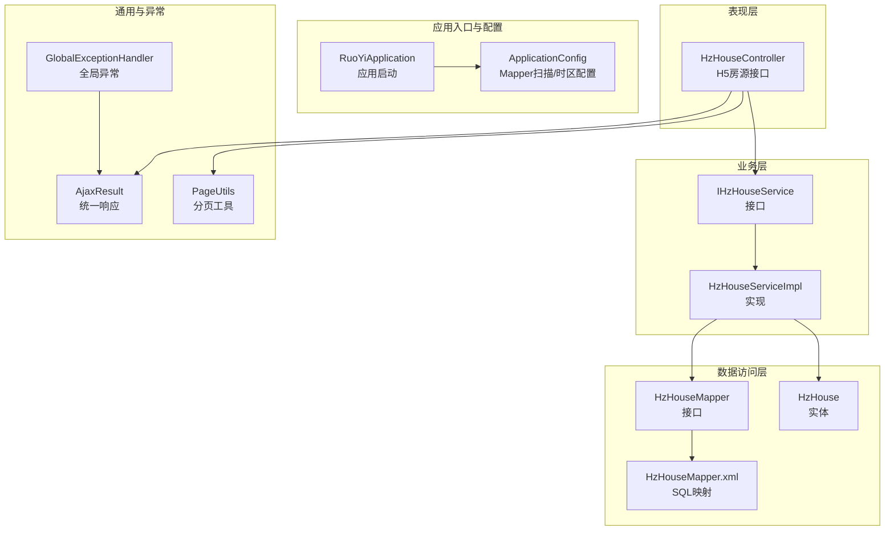
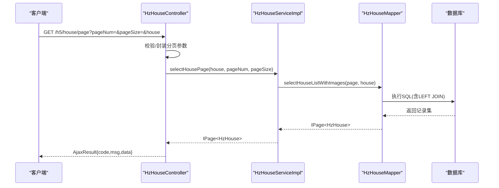
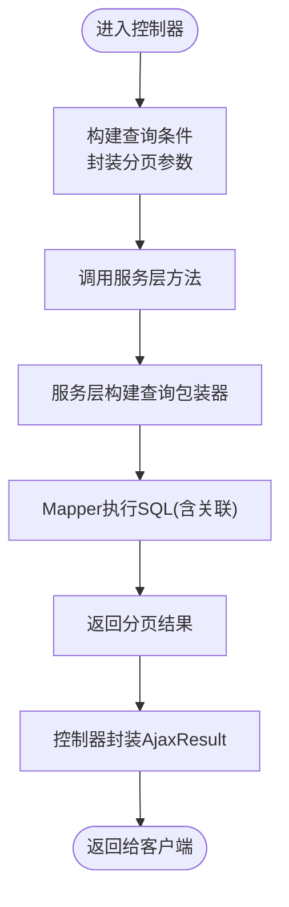
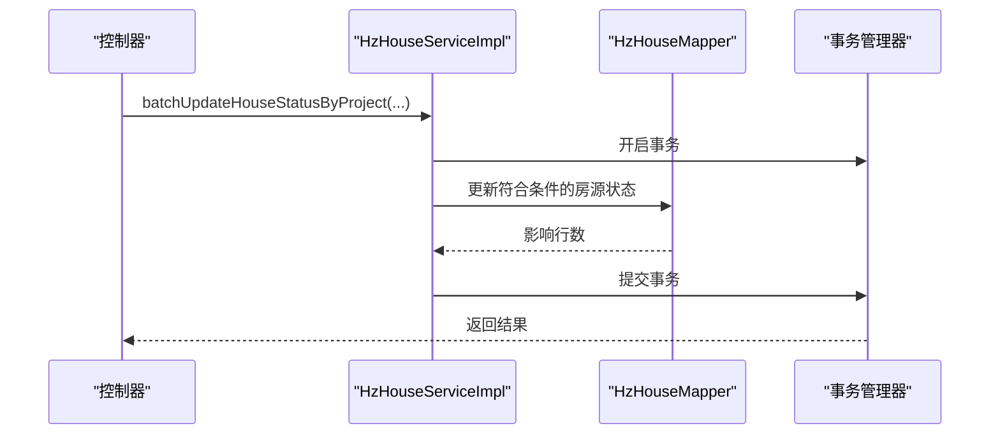
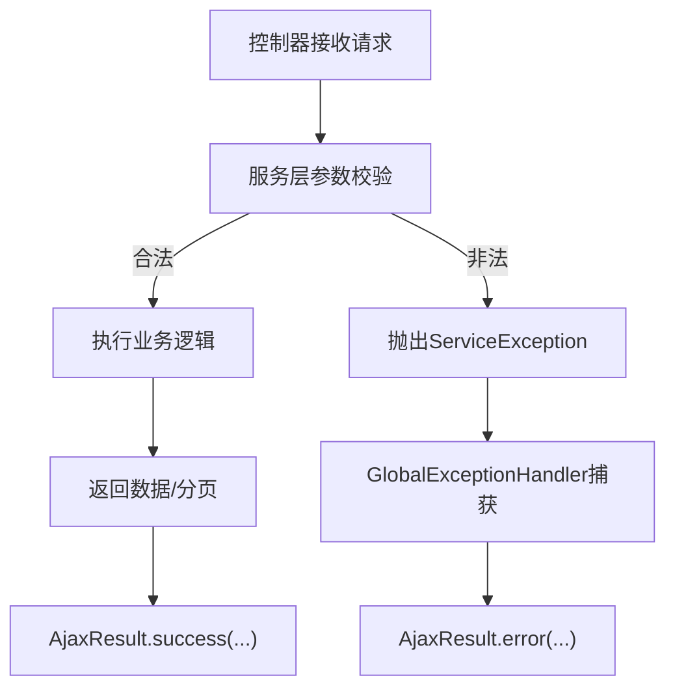
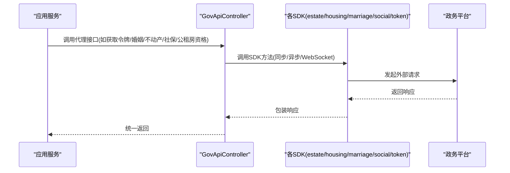
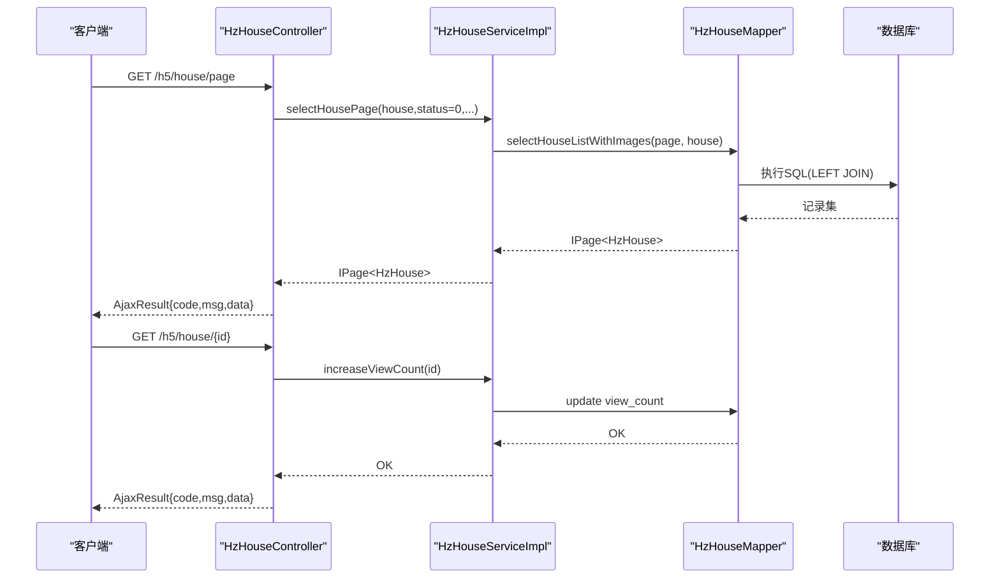
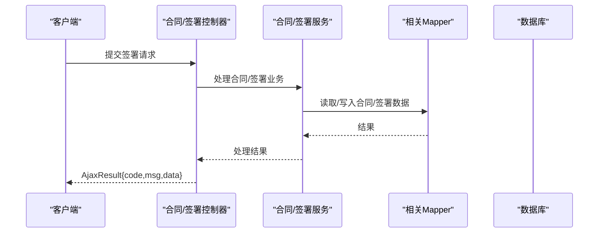
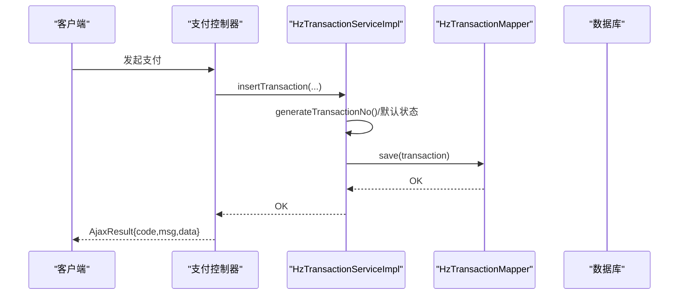
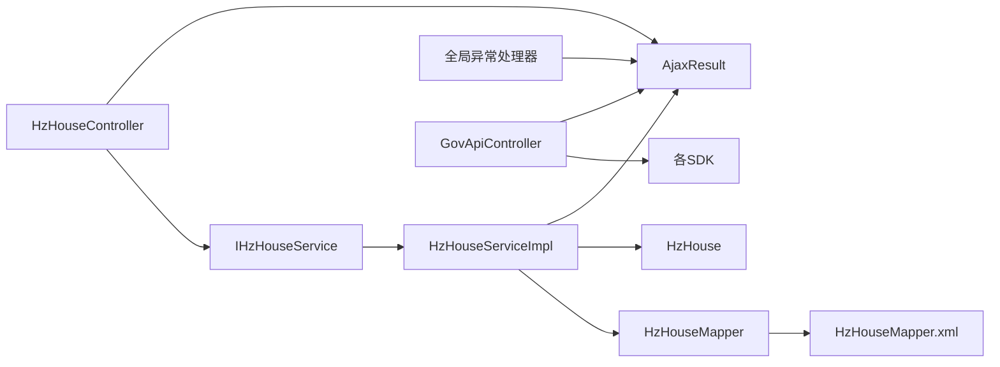

# 数据流设计

<cite>
**本文引用的文件**   
- [RuoYiApplication.java](file://ruoyi-admin/src/main/java/com/ruoyi/RuoYiApplication.java)
- [ApplicationConfig.java](file://ruoyi-framework/src/main/java/com/ruoyi/framework/config/ApplicationConfig.java)
- [HzHouseController.java](file://ruoyi-admin/src/main/java/com/ruoyi/web/controller/h5/HzHouseController.java)
- [IHzHouseService.java](file://ruoyi-system/src/main/java/com/ruoyi/system/service/IHzHouseService.java)
- [HzHouseServiceImpl.java](file://ruoyi-system/src/main/java/com/ruoyi/system/service/impl/HzHouseServiceImpl.java)
- [HzHouseMapper.java](file://ruoyi-system/src/main/java/com/ruoyi/system/mapper/HzHouseMapper.java)
- [HzHouseMapper.xml](file://ruoyi-system/src/main/resources/mapper/system/HzHouseMapper.xml)
- [HzHouse.java](file://ruoyi-system/src/main/java/com/ruoyi/system/domain/HzHouse.java)
- [PageUtils.java](file://ruoyi-common/src/main/java/com/ruoyi/common/utils/PageUtils.java)
- [AjaxResult.java](file://ruoyi-common/src/main/java/com/ruoyi/common/core/domain/AjaxResult.java)
- [GlobalExceptionHandler.java](file://ruoyi-framework/src/main/java/com/ruoyi/framework/web/exception/GlobalExceptionHandler.java)
- [HzTransactionServiceImpl.java](file://ruoyi-system/src/main/java/com/ruoyi/system/service/impl/HzTransactionServiceImpl.java)
- [HzTransactionMapper.java](file://ruoyi-system/src/main/java/com/ruoyi/system/mapper/HzTransactionMapper.java)
- [IHzTransactionService.java](file://ruoyi-system/src/main/java/com/ruoyi/system/service/IHzTransactionService.java)
- [HzContract.java](file://ruoyi-system/src/main/java/com/ruoyi/system/domain/HzContract.java)
- [HzContractSignature.java](file://ruoyi-system/src/main/java/com/ruoyi/system/domain/HzContractSignature.java)
- [HzOrder.java](file://ruoyi-system/src/main/java/com/ruoyi/system/domain/HzOrder.java)
- [HzBill.java](file://ruoyi-system/src/main/java/com/ruoyi/system/domain/HzBill.java)
- [HzPayment.java](file://ruoyi-system/src/main/java/com/ruoyi/system/domain/HzPayment.java)
- [GovApiController.java](file://ghz-gov-proxy/src/main/java/com/ghz/gov/controller/GovApiController.java)
- [SdkEstateApp.java](file://jiekou-sdk/java/RELEASE/ShieldAsyncApp_获取访问令牌_87BD3A66EA7749EC970C966E3DAAEE41.java)
- [SdkHousingApp.java](file://jiekou-sdk/java-2/RELEASE/ShieldAsyncApp_授权_省民政_婚姻实时信息V2接口_67E20E7BE2B14F8CB716D965D5ECF0FA.java)
- [SdkMarriageApp.java](file://jiekou-sdk/java-3/RELEASE/ShieldAsyncApp_授权_不动产登记信息V1_4D90543CC15F4933A0614AE2B9B2935B.java)
- [SdkSocialApp.java](file://jiekou-sdk/java-4/RELEASE/ShieldAsyncApp_授权省人社_参保单位社会保险缴费信息V7_548E6780B5974C92B3CE92274AC14375.java)
- [SdkTokenApp.java](file://jiekou-sdk/java5/RELEASE/ShieldAsyncApp_公租房申请人信息查询V1_12842C37F2F542E18E76279B0DCD3415.java)
</cite>

## 目录
1. [引言](#引言)
2. [项目结构](#项目结构)
3. [核心组件](#核心组件)
4. [架构总览](#架构总览)
5. [详细组件分析](#详细组件分析)
6. [依赖分析](#依赖分析)
7. [性能考虑](#性能考虑)
8. [故障排查指南](#故障排查指南)
9. [结论](#结论)
10. [附录](#附录)

## 引言
本文件面向港好住信息系统，聚焦“数据流设计”。围绕用户请求处理流程、业务数据流转、外部接口调用流程，系统性阐述MVC架构中Controller到Service再到Mapper的数据传递机制；解释事务管理、数据验证、异常处理等横切关注点的数据处理方式；给出典型业务场景（在线选房、合同签署、支付处理）的数据流图；并提供数据一致性保证机制与性能优化策略。

## 项目结构
系统采用前后端分离与多模块划分：后端基于Spring Boot + MyBatis-Plus，按领域与层次拆分模块，包括通用基础、框架支撑、业务系统、UI与接口等。核心入口与配置位于ruoyi-admin与ruoyi-framework，业务实体与Mapper位于ruoyi-system，通用工具与返回体位于ruoyi-common，外部政务接口代理位于ghz-gov-proxy，SDK位于jiekou-sdk。

图表来源
- [RuoYiApplication.java:12-20](file://ruoyi-admin/src/main/java/com/ruoyi/RuoYiApplication.java#L12-L20)
- [ApplicationConfig.java:21-36](file://ruoyi-framework/src/main/java/com/ruoyi/framework/config/ApplicationConfig.java#L21-L36)
- [HzHouseController.java:17-83](file://ruoyi-admin/src/main/java/com/ruoyi/web/controller/h5/HzHouseController.java#L17-L83)
- [IHzHouseService.java:18-158](file://ruoyi-system/src/main/java/com/ruoyi/system/service/IHzHouseService.java#L18-L158)
- [HzHouseServiceImpl.java:44-629](file://ruoyi-system/src/main/java/com/ruoyi/system/service/impl/HzHouseServiceImpl.java#L44-L629)
- [HzHouseMapper.java:17-28](file://ruoyi-system/src/main/java/com/ruoyi/system/mapper/HzHouseMapper.java#L17-L28)
- [HzHouseMapper.xml:5-57](file://ruoyi-system/src/main/resources/mapper/system/HzHouseMapper.xml#L5-L57)
- [HzHouse.java:20-440](file://ruoyi-system/src/main/java/com/ruoyi/system/domain/HzHouse.java#L20-L440)
- [AjaxResult.java:13-216](file://ruoyi-common/src/main/java/com/ruoyi/common/core/domain/AjaxResult.java#L13-L216)
- [GlobalExceptionHandler.java:27-145](file://ruoyi-framework/src/main/java/com/ruoyi/framework/web/exception/GlobalExceptionHandler.java#L27-L145)
- [PageUtils.java:12-54](file://ruoyi-common/src/main/java/com/ruoyi/common/utils/PageUtils.java#L12-L54)

章节来源
- [RuoYiApplication.java:12-20](file://ruoyi-admin/src/main/java/com/ruoyi/RuoYiApplication.java#L12-L20)
- [ApplicationConfig.java:21-36](file://ruoyi-framework/src/main/java/com/ruoyi/framework/config/ApplicationConfig.java#L21-L36)

## 核心组件
- 应用入口与配置
  - 应用启动类负责引导Spring Boot容器启动。
  - 应用配置启用AspectJ代理与Mapper扫描，并设置Jackson时区。
- 控制器层
  - H5房源控制器接收HTTP请求，封装分页参数，调用服务层，组装统一响应。
- 服务层
  - 房源服务接口定义业务契约；实现类承担查询、导入、批量状态变更、关联数据聚合等逻辑，并通过多个Mapper访问底层数据。
- 数据访问层
  - Mapper接口继承MyBatis-Plus基类；XML映射文件定义SQL与关联查询；实体类映射hz_house表。
- 通用与异常
  - AjaxResult提供统一响应结构；全局异常处理器捕获各类异常并返回标准错误响应；分页工具提供MyBatis-Plus分页参数构建。

章节来源
- [HzHouseController.java:17-83](file://ruoyi-admin/src/main/java/com/ruoyi/web/controller/h5/HzHouseController.java#L17-L83)
- [IHzHouseService.java:18-158](file://ruoyi-system/src/main/java/com/ruoyi/system/service/IHzHouseService.java#L18-L158)
- [HzHouseServiceImpl.java:44-629](file://ruoyi-system/src/main/java/com/ruoyi/system/service/impl/HzHouseServiceImpl.java#L44-L629)
- [HzHouseMapper.java:17-28](file://ruoyi-system/src/main/java/com/ruoyi/system/mapper/HzHouseMapper.java#L17-L28)
- [HzHouseMapper.xml:5-57](file://ruoyi-system/src/main/resources/mapper/system/HzHouseMapper.xml#L5-L57)
- [HzHouse.java:20-440](file://ruoyi-system/src/main/java/com/ruoyi/system/domain/HzHouse.java#L20-L440)
- [AjaxResult.java:13-216](file://ruoyi-common/src/main/java/com/ruoyi/common/core/domain/AjaxResult.java#L13-L216)
- [GlobalExceptionHandler.java:27-145](file://ruoyi-framework/src/main/java/com/ruoyi/framework/web/exception/GlobalExceptionHandler.java#L27-L145)
- [PageUtils.java:12-54](file://ruoyi-common/src/main/java/com/ruoyi/common/utils/PageUtils.java#L12-L54)

## 架构总览
系统遵循经典的MVC分层与职责分离：
- 控制器层：解析请求参数、调用服务层、封装响应。
- 服务层：编排业务规则、协调多个Mapper、处理事务边界。
- 数据访问层：通过MyBatis-Plus执行SQL，完成持久化。
- 通用与异常：统一响应与异常兜底，保障接口稳定性。

图表来源
- [HzHouseController.java:27-37](file://ruoyi-admin/src/main/java/com/ruoyi/web/controller/h5/HzHouseController.java#L27-L37)
- [HzHouseServiceImpl.java:71-78](file://ruoyi-system/src/main/java/com/ruoyi/system/service/impl/HzHouseServiceImpl.java#L71-L78)
- [HzHouseMapper.xml:22-55](file://ruoyi-system/src/main/resources/mapper/system/HzHouseMapper.xml#L22-L55)
- [AjaxResult.java:67-103](file://ruoyi-common/src/main/java/com/ruoyi/common/core/domain/AjaxResult.java#L67-L103)

## 详细组件分析

### MVC数据流：Controller → Service → Mapper
- 参数传递
  - 控制器接收URL参数与对象参数，构造查询条件；通过分页工具构建Page对象。
  - 服务层接收条件对象与分页参数，内部可能再次封装查询包装器。
- 关联查询
  - Mapper XML中通过LEFT JOIN关联项目、楼栋、单元等维度，减少N+1查询。
- 响应封装
  - 服务层返回IPage或聚合Map；控制器最终封装为AjaxResult统一返回。

图表来源
- [HzHouseController.java:27-37](file://ruoyi-admin/src/main/java/com/ruoyi/web/controller/h5/HzHouseController.java#L27-L37)
- [HzHouseServiceImpl.java:71-78](file://ruoyi-system/src/main/java/com/ruoyi/system/service/impl/HzHouseServiceImpl.java#L71-L78)
- [HzHouseMapper.xml:22-55](file://ruoyi-system/src/main/resources/mapper/system/HzHouseMapper.xml#L22-L55)
- [AjaxResult.java:67-103](file://ruoyi-common/src/main/java/com/ruoyi/common/core/domain/AjaxResult.java#L67-L103)

章节来源
- [HzHouseController.java:27-37](file://ruoyi-admin/src/main/java/com/ruoyi/web/controller/h5/HzHouseController.java#L27-L37)
- [HzHouseServiceImpl.java:71-78](file://ruoyi-system/src/main/java/com/ruoyi/system/service/impl/HzHouseServiceImpl.java#L71-L78)
- [HzHouseMapper.xml:22-55](file://ruoyi-system/src/main/resources/mapper/system/HzHouseMapper.xml#L22-L55)
- [AjaxResult.java:67-103](file://ruoyi-common/src/main/java/com/ruoyi/common/core/domain/AjaxResult.java#L67-L103)

### 事务管理与数据一致性
- 事务边界
  - 服务层对涉及多表更新或跨实体的状态变更使用@Transactional标注，确保原子性。
- 一致性策略
  - 交易流水服务在新增时默认状态与编号生成，保证幂等与可追溯。
  - 房源批量状态变更仅对允许状态集合进行更新，避免与订单/合同状态冲突。

图表来源
- [HzHouseServiceImpl.java:484-522](file://ruoyi-system/src/main/java/com/ruoyi/system/service/impl/HzHouseServiceImpl.java#L484-L522)

章节来源
- [HzHouseServiceImpl.java:484-522](file://ruoyi-system/src/main/java/com/ruoyi/system/service/impl/HzHouseServiceImpl.java#L484-L522)

### 数据验证与异常处理
- 输入验证
  - 服务层在批量状态变更前对目标状态与参数进行合法性校验，抛出业务异常。
- 异常处理
  - 全局异常处理器捕获权限、参数类型、业务、运行时等异常，统一返回AjaxResult错误响应。
- 统一响应
  - AjaxResult提供SUCCESS/WARN/ERROR三态与链式put，便于前后端约定。

图表来源
- [GlobalExceptionHandler.java:58-64](file://ruoyi-framework/src/main/java/com/ruoyi/framework/web/exception/GlobalExceptionHandler.java#L58-L64)
- [AjaxResult.java:133-171](file://ruoyi-common/src/main/java/com/ruoyi/common/core/domain/AjaxResult.java#L133-L171)

章节来源
- [GlobalExceptionHandler.java:58-64](file://ruoyi-framework/src/main/java/com/ruoyi/framework/web/exception/GlobalExceptionHandler.java#L58-L64)
- [AjaxResult.java:133-171](file://ruoyi-common/src/main/java/com/ruoyi/common/core/domain/AjaxResult.java#L133-L171)

### 外部接口调用流程
系统通过gov-proxy与jiekou-sdk对接外部政务平台，实现数据互通与能力开放。

图表来源
- [GovApiController.java:1-200](file://ghz-gov-proxy/src/main/java/com/ghz/gov/controller/GovApiController.java#L1-L200)
- [SdkEstateApp.java:1-200](file://jiekou-sdk/java/RELEASE/ShieldAsyncApp_获取访问令牌_87BD3A66EA7749EC970C966E3DAAEE41.java#L1-L200)
- [SdkHousingApp.java:1-200](file://jiekou-sdk/java-2/RELEASE/ShieldAsyncApp_授权_省民政_婚姻实时信息V2接口_67E20E7BE2B14F8CB716D965D5ECF0FA.java#L1-L200)
- [SdkMarriageApp.java:1-200](file://jiekou-sdk/java-3/RELEASE/ShieldAsyncApp_授权_不动产登记信息V1_4D90543CC15F4933A0614AE2B9B2935B.java#L1-L200)
- [SdkSocialApp.java:1-200](file://jiekou-sdk/java-4/RELEASE/ShieldAsyncApp_授权省人社_参保单位社会保险缴费信息V7_548E6780B5974C92B3CE92274AC14375.java#L1-L200)
- [SdkTokenApp.java:1-200](file://jiekou-sdk/java5/RELEASE/ShieldAsyncApp_公租房申请人信息查询V1_12842C37F2F542E18E76279B0DCD3415.java#L1-L200)

章节来源
- [GovApiController.java:1-200](file://ghz-gov-proxy/src/main/java/com/ghz/gov/controller/GovApiController.java#L1-L200)
- [SdkEstateApp.java:1-200](file://jiekou-sdk/java/RELEASE/ShieldAsyncApp_获取访问令牌_87BD3A66EA7749EC970C966E3DAAEE41.java#L1-L200)
- [SdkHousingApp.java:1-200](file://jiekou-sdk/java-2/RELEASE/ShieldAsyncApp_授权_省民政_婚姻实时信息V2接口_67E20E7BE2B14F8CB716D965D5ECF0FA.java#L1-L200)
- [SdkMarriageApp.java:1-200](file://jiekou-sdk/java-3/RELEASE/ShieldAsyncApp_授权_不动产登记信息V1_4D90543CC15F4933A0614AE2B9B2935B.java#L1-L200)
- [SdkSocialApp.java:1-200](file://jiekou-sdk/java-4/RELEASE/ShieldAsyncApp_授权省人社_参保单位社会保险缴费信息V7_548E6780B5974C92B3CE92274AC14375.java#L1-L200)
- [SdkTokenApp.java:1-200](file://jiekou-sdk/java5/RELEASE/ShieldAsyncApp_公租房申请人信息查询V1_12842C37F2F542E18E76279B0DCD3415.java#L1-L200)

### 典型业务场景数据流

#### 场景一：在线选房
- 数据流要点
  - 客户端发起分页查询，控制器设置状态为“正常”，服务层构建查询包装器，Mapper执行带关联的分页查询，返回IPage。
  - 详情页增加浏览次数，服务层更新房源视图计数。
- 关键路径
  - 控制器 → 服务层分页查询 → Mapper SQL关联 → 统一响应。

图表来源
- [HzHouseController.java:27-50](file://ruoyi-admin/src/main/java/com/ruoyi/web/controller/h5/HzHouseController.java#L27-L50)
- [HzHouseServiceImpl.java:71-78](file://ruoyi-system/src/main/java/com/ruoyi/system/service/impl/HzHouseServiceImpl.java#L71-L78)
- [HzHouseServiceImpl.java:232-242](file://ruoyi-system/src/main/java/com/ruoyi/system/service/impl/HzHouseServiceImpl.java#L232-L242)
- [HzHouseMapper.xml:22-55](file://ruoyi-system/src/main/resources/mapper/system/HzHouseMapper.xml#L22-L55)

章节来源
- [HzHouseController.java:27-50](file://ruoyi-admin/src/main/java/com/ruoyi/web/controller/h5/HzHouseController.java#L27-L50)
- [HzHouseServiceImpl.java:71-78](file://ruoyi-system/src/main/java/com/ruoyi/system/service/impl/HzHouseServiceImpl.java#L71-L78)
- [HzHouseServiceImpl.java:232-242](file://ruoyi-system/src/main/java/com/ruoyi/system/service/impl/HzHouseServiceImpl.java#L232-L242)
- [HzHouseMapper.xml:22-55](file://ruoyi-system/src/main/resources/mapper/system/HzHouseMapper.xml#L22-L55)

#### 场景二：合同签署
- 数据流要点
  - 合同实体与签署实体作为业务数据载体，服务层协调合同与签署状态流转，必要时与交易流水、账单等关联。
  - 通过统一响应返回操作结果，异常由全局处理器兜底。
- 关键路径
  - 控制器 → 服务层合同/签署处理 → 数据持久化 → 统一响应。

图表来源
- [HzContract.java:1-200](file://ruoyi-system/src/main/java/com/ruoyi/system/domain/HzContract.java#L1-L200)
- [HzContractSignature.java:1-200](file://ruoyi-system/src/main/java/com/ruoyi/system/domain/HzContractSignature.java#L1-L200)
- [AjaxResult.java:67-103](file://ruoyi-common/src/main/java/com/ruoyi/common/core/domain/AjaxResult.java#L67-L103)

章节来源
- [HzContract.java:1-200](file://ruoyi-system/src/main/java/com/ruoyi/system/domain/HzContract.java#L1-L200)
- [HzContractSignature.java:1-200](file://ruoyi-system/src/main/java/com/ruoyi/system/domain/HzContractSignature.java#L1-L200)
- [AjaxResult.java:67-103](file://ruoyi-common/src/main/java/com/ruoyi/common/core/domain/AjaxResult.java#L67-L103)

#### 场景三：支付处理
- 数据流要点
  - 交易流水服务负责生成流水号、设置默认状态、持久化交易记录；与订单、账单、支付等实体协同。
  - 统一响应返回处理结果，异常由全局处理器兜底。
- 关键路径
  - 控制器 → 交易服务 → 生成流水号/持久化 → 统一响应。

图表来源
- [HzTransactionServiceImpl.java:73-99](file://ruoyi-system/src/main/java/com/ruoyi/system/service/impl/HzTransactionServiceImpl.java#L73-L99)
- [HzTransactionMapper.java:13-15](file://ruoyi-system/src/main/java/com/ruoyi/system/mapper/HzTransactionMapper.java#L13-L15)
- [AjaxResult.java:67-103](file://ruoyi-common/src/main/java/com/ruoyi/common/core/domain/AjaxResult.java#L67-L103)

章节来源
- [HzTransactionServiceImpl.java:73-99](file://ruoyi-system/src/main/java/com/ruoyi/system/service/impl/HzTransactionServiceImpl.java#L73-L99)
- [HzTransactionMapper.java:13-15](file://ruoyi-system/src/main/java/com/ruoyi/system/mapper/HzTransactionMapper.java#L13-L15)
- [AjaxResult.java:67-103](file://ruoyi-common/src/main/java/com/ruoyi/common/core/domain/AjaxResult.java#L67-L103)

## 依赖分析
- 组件耦合
  - 控制器依赖服务接口；服务实现依赖多个Mapper；Mapper依赖XML映射与实体。
- 外部依赖
  - gov-proxy与jiekou-sdk形成对外部政务平台的适配层，控制器通过代理间接调用。
- 横切关注点
  - 全局异常处理器与统一响应贯穿所有层，保证错误与返回格式一致。

图表来源
- [HzHouseController.java:17-83](file://ruoyi-admin/src/main/java/com/ruoyi/web/controller/h5/HzHouseController.java#L17-L83)
- [IHzHouseService.java:18-158](file://ruoyi-system/src/main/java/com/ruoyi/system/service/IHzHouseService.java#L18-L158)
- [HzHouseServiceImpl.java:44-629](file://ruoyi-system/src/main/java/com/ruoyi/system/service/impl/HzHouseServiceImpl.java#L44-L629)
- [HzHouseMapper.java:17-28](file://ruoyi-system/src/main/java/com/ruoyi/system/mapper/HzHouseMapper.java#L17-L28)
- [HzHouseMapper.xml:5-57](file://ruoyi-system/src/main/resources/mapper/system/HzHouseMapper.xml#L5-L57)
- [HzHouse.java:20-440](file://ruoyi-system/src/main/java/com/ruoyi/system/domain/HzHouse.java#L20-L440)
- [GlobalExceptionHandler.java:27-145](file://ruoyi-framework/src/main/java/com/ruoyi/framework/web/exception/GlobalExceptionHandler.java#L27-L145)
- [AjaxResult.java:13-216](file://ruoyi-common/src/main/java/com/ruoyi/common/core/domain/AjaxResult.java#L13-L216)
- [GovApiController.java:1-200](file://ghz-gov-proxy/src/main/java/com/ghz/gov/controller/GovApiController.java#L1-L200)

章节来源
- [HzHouseController.java:17-83](file://ruoyi-admin/src/main/java/com/ruoyi/web/controller/h5/HzHouseController.java#L17-L83)
- [IHzHouseService.java:18-158](file://ruoyi-system/src/main/java/com/ruoyi/system/service/IHzHouseService.java#L18-L158)
- [HzHouseServiceImpl.java:44-629](file://ruoyi-system/src/main/java/com/ruoyi/system/service/impl/HzHouseServiceImpl.java#L44-L629)
- [HzHouseMapper.java:17-28](file://ruoyi-system/src/main/java/com/ruoyi/system/mapper/HzHouseMapper.java#L17-L28)
- [HzHouseMapper.xml:5-57](file://ruoyi-system/src/main/resources/mapper/system/HzHouseMapper.xml#L5-L57)
- [HzHouse.java:20-440](file://ruoyi-system/src/main/java/com/ruoyi/system/domain/HzHouse.java#L20-L440)
- [GlobalExceptionHandler.java:27-145](file://ruoyi-framework/src/main/java/com/ruoyi/framework/web/exception/GlobalExceptionHandler.java#L27-L145)
- [AjaxResult.java:13-216](file://ruoyi-common/src/main/java/com/ruoyi/common/core/domain/AjaxResult.java#L13-L216)
- [GovApiController.java:1-200](file://ghz-gov-proxy/src/main/java/com/ghz/gov/controller/GovApiController.java#L1-L200)

## 性能考虑
- 分页与查询
  - 使用MyBatis-Plus Page对象显式传参，避免ThreadLocal污染；通过Mapper XML进行关联查询，减少多次往返。
- 缓存与索引
  - 建议对高频查询字段（如项目ID、楼栋ID、状态）建立索引；对热点数据引入缓存（Redis）。
- 事务与锁
  - 批量状态变更使用精确条件更新，避免全表扫描；对并发更新场景使用乐观锁或分布式锁。
- 外部接口
  - SDK调用建议设置超时与重试策略，避免阻塞主线程；对幂等接口做好去重与重放控制。

## 故障排查指南
- 常见异常
  - 权限不足：返回403提示。
  - 请求方式不支持：返回不支持的HTTP方法。
  - 业务异常：抛出ServiceException，统一返回错误信息。
  - 参数类型不匹配：返回参数类型错误提示。
  - 运行时异常：记录日志并返回通用错误。
- 排查步骤
  - 查看全局异常处理器日志定位异常类型。
  - 核对控制器参数绑定与服务层校验逻辑。
  - 检查Mapper SQL与数据库索引是否合理。
  - 对外部接口调用，确认SDK参数与返回码。

章节来源
- [GlobalExceptionHandler.java:35-144](file://ruoyi-framework/src/main/java/com/ruoyi/framework/web/exception/GlobalExceptionHandler.java#L35-L144)

## 结论
本设计文档梳理了港好住信息系统在MVC架构下的数据流路径，明确了Controller到Service再到Mapper的传递机制，覆盖事务管理、数据验证与异常处理等横切关注点，并给出了典型业务场景的数据流图与性能优化建议。通过统一响应与异常处理，系统在复杂业务与外部接口交互中保持稳定与一致。

## 附录
- 统一响应结构
  - 字段：code、msg、data；提供success/warn/error静态方法与链式put。
- 分页工具
  - 通过TableSupport构建PageDomain，再生成MyBatis-Plus Page对象。
- 实体与映射
  - HzHouse实体映射hz_house表，Mapper XML定义LEFT JOIN与条件过滤。

章节来源
- [AjaxResult.java:13-216](file://ruoyi-common/src/main/java/com/ruoyi/common/core/domain/AjaxResult.java#L13-L216)
- [PageUtils.java:12-54](file://ruoyi-common/src/main/java/com/ruoyi/common/utils/PageUtils.java#L12-L54)
- [HzHouse.java:20-440](file://ruoyi-system/src/main/java/com/ruoyi/system/domain/HzHouse.java#L20-L440)
- [HzHouseMapper.xml:5-57](file://ruoyi-system/src/main/resources/mapper/system/HzHouseMapper.xml#L5-L57)