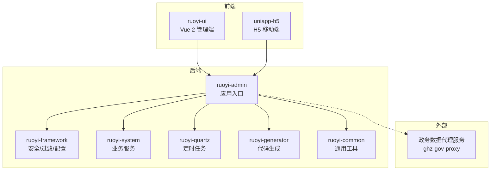
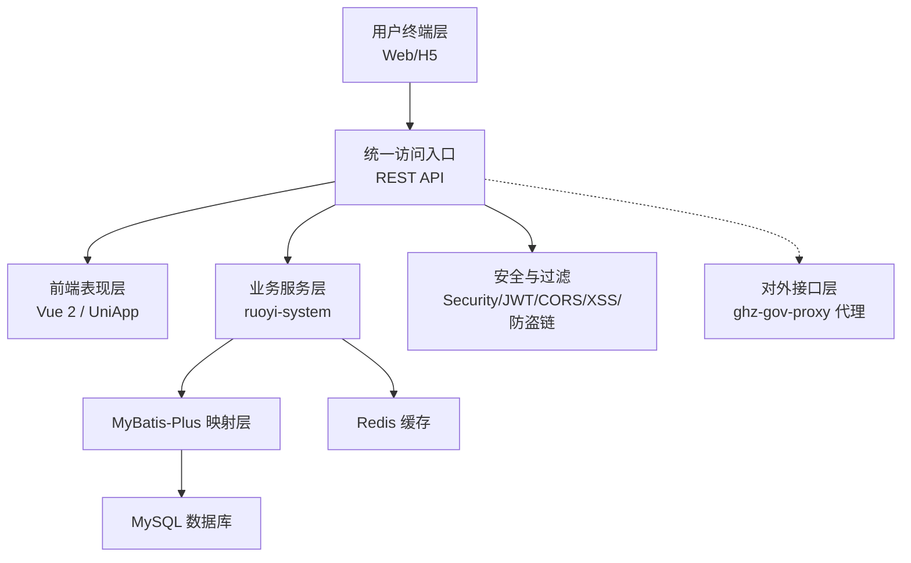
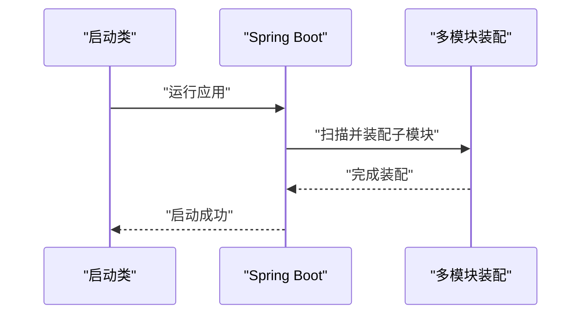
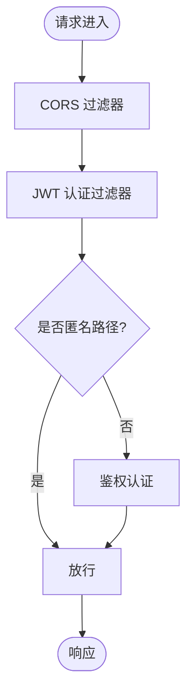
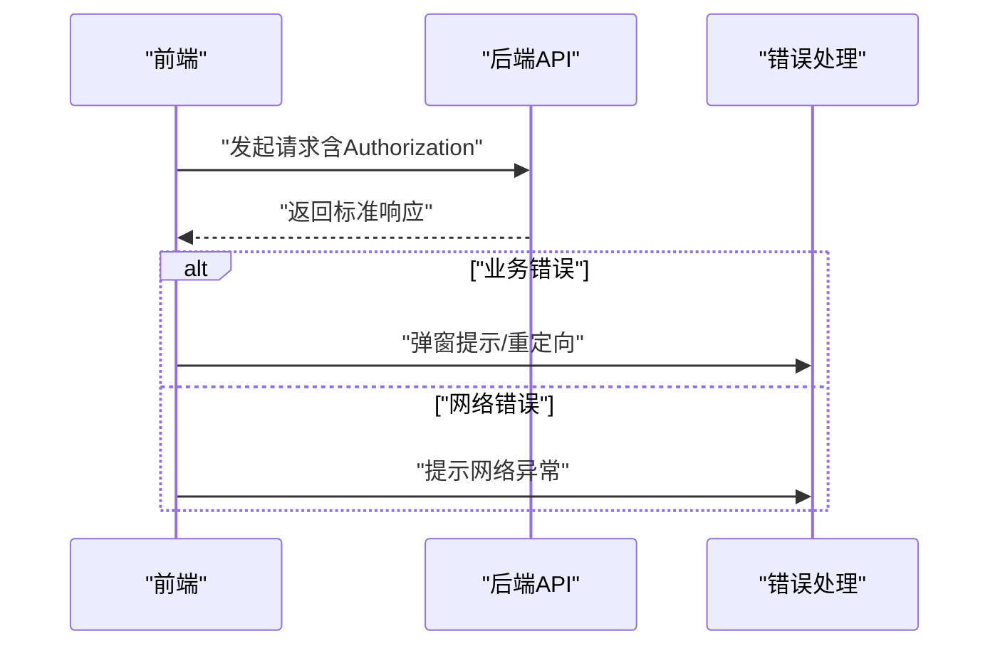
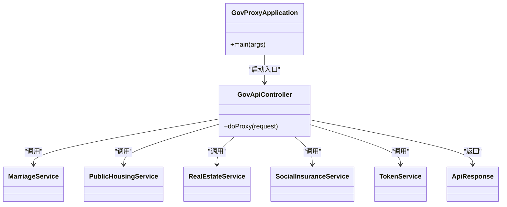
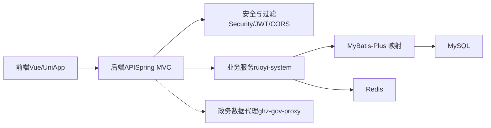

# 整体架构概览

<cite>
**本文引用的文件**
- [pom.xml](file://pom.xml)
- [RuoYiApplication.java](file://ruoyi-admin/src/main/java/com/ruoyi/RuoYiApplication.java)
- [application.yml](file://ruoyi-admin/src/main/resources/application.yml)
- [SecurityConfig.java](file://ruoyi-framework/src/main/java/com/ruoyi/framework/config/SecurityConfig.java)
- [ApplicationConfig.java](file://ruoyi-framework/src/main/java/com/ruoyi/framework/config/ApplicationConfig.java)
- [FilterConfig.java](file://ruoyi-framework/src/main/java/com/ruoyi/framework/config/FilterConfig.java)
- [JwtAuthenticationTokenFilter.java](file://ruoyi-framework/src/main/java/com/ruoyi/framework/security/filter/JwtAuthenticationTokenFilter.java)
- [main.js（前端主入口）](file://ruoyi-ui/src/main.js)
- [request.js（前端Axios封装）](file://ruoyi-ui/src/utils/request.js)
- [main.js（H5 UniApp主入口）](file://uniapp-h5/main.js)
- [request.js（H5 UniApp请求封装）](file://uniapp-h5/utils/request.js)
- [package.json（前端工程）](file://ruoyi-ui/package.json)
- [package.json（H5工程）](file://uniapp-h5/package.json)
- [GovProxyApplication.java](file://ghz-gov-proxy/src/main/java/com/ghz/gov/GovProxyApplication.java)
- [application.yml（代理服务）](file://ghz-gov-proxy/src/main/resources/application.yml)
- [pom.xml（代理服务）](file://ghz-gov-proxy/pom.xml)
- [GovApiController.java](file://ghz-gov-proxy/src/main/java/com/ghz/gov/controller/GovApiController.java)
- [SdkEstateApp.java](file://ghz-gov-proxy/src/main/java/com/ghz/gov/sdk/SdkEstateApp.java)
- [SdkHousingApp.java](file://ghz-gov-proxy/src/main/java/com/ghz/gov/sdk/SdkHousingApp.java)
- [SdkMarriageApp.java](file://ghz-gov-proxy/src/main/java/com/ghz/gov/sdk/SdkMarriageApp.java)
- [SdkSocialApp.java](file://ghz-gov-proxy/src/main/java/com/ghz/gov/sdk/SdkSocialApp.java)
- [SdkTokenApp.java](file://ghz-gov-proxy/src/main/java/com/ghz/gov/sdk/SdkTokenApp.java)
- [MarriageService.java](file://ghz-gov-proxy/src/main/java/com/ghz/gov/service/MarriageService.java)
- [PublicHousingService.java](file://ghz-gov-proxy/src/main/java/com/ghz/gov/service/PublicHousingService.java)
- [RealEstateService.java](file://ghz-gov-proxy/src/main/java/com/ghz/gov/service/RealEstateService.java)
- [SocialInsuranceService.java](file://ghz-gov-proxy/src/main/java/com/ghz/gov/service/SocialInsuranceService.java)
- [TokenService.java](file://ghz-gov-proxy/src/main/java/com/ghz/gov/service/TokenService.java)
- [ApiResponse.java](file://ghz-gov-proxy/src/main/java/com/ghz/gov/dto/ApiResponse.java)
</cite>

## 目录
1. [简介](#简介)
2. [项目结构](#项目结构)
3. [核心组件](#核心组件)
4. [架构总览](#架构总览)
5. [详细组件分析](#详细组件分析)
6. [依赖分析](#依赖分析)
7. [性能考虑](#性能考虑)
8. [故障排查指南](#故障排查指南)
9. [结论](#结论)
10. [附录](#附录)

## 简介
本文件面向港好住信息系统，提供整体架构概览文档。系统采用前后端分离设计，后端基于 Spring Boot 3 + MyBatis-Plus 的模块化分层架构，前端包含 Web 管理端（Vue 2）与 H5 移动端（UniApp）。系统通过统一的安全与跨域策略、RESTful API、以及对政务数据的代理服务，实现多终端一致的业务体验与安全可控的数据集成。

## 项目结构
系统采用 Maven 多模块组织，核心模块包括：
- ruoyi-admin：后端应用入口，负责业务 API 提供与统一配置
- ruoyi-framework：安全、过滤器、MyBatis 扫描、Jackson 时区等基础设施
- ruoyi-system：业务领域模型与 Mapper/Service 层
- ruoyi-quartz：定时任务模块
- ruoyi-generator：代码生成模块
- ruoyi-common：通用常量、注解、工具、异常与过滤器
- ruoyi-ui：Web 管理端前端（Vue 2）
- uniapp-h5：H5 移动端（UniApp）
- ghz-gov-proxy：政务数据接口代理服务（独立 Spring Boot）

**图表来源**
- [pom.xml:184-191](file://pom.xml#L184-L191)
- [RuoYiApplication.java:12-21](file://ruoyi-admin/src/main/java/com/ruoyi/RuoYiApplication.java#L12-L21)

**章节来源**
- [pom.xml:184-191](file://pom.xml#L184-L191)
- [RuoYiApplication.java:12-21](file://ruoyi-admin/src/main/java/com/ruoyi/RuoYiApplication.java#L12-L21)

## 核心组件
- 应用入口与打包：后端通过 Spring Boot 启动类引导，Maven 多模块聚合构建
- 安全与跨域：基于 Spring Security + JWT + CORS，开放匿名访问路径与静态资源
- 前后端通信：前端 Axios/Uni.request 统一封装，统一设置 Authorization 与错误处理
- 政务数据代理：独立代理服务，封装多套 SDK，统一对外提供稳定接口
- 配置中心：集中配置 token、文件上传、微信/电子签、政务网关等

**章节来源**
- [RuoYiApplication.java:12-21](file://ruoyi-admin/src/main/java/com/ruoyi/RuoYiApplication.java#L12-L21)
- [SecurityConfig.java:86-124](file://ruoyi-framework/src/main/java/com/ruoyi/framework/config/SecurityConfig.java#L86-L124)
- [request.js（前端Axios封装）:16-80](file://ruoyi-ui/src/utils/request.js#L16-L80)
- [request.js（H5 UniApp请求封装）:20-71](file://uniapp-h5/utils/request.js#L20-L71)
- [application.yml:95-238](file://ruoyi-admin/src/main/resources/application.yml#L95-L238)

## 架构总览
系统分层设计如下：
- 用户终端层：Web 管理端、H5 移动端
- 统一访问入口：后端 REST API（Spring MVC）
- 前端表现层：Vue 2（管理端）、UniApp（H5）
- 业务服务层：ruoyi-system + ruoyi-framework（安全/过滤/配置）
- 数据层：MyBatis-Plus + Druid 连接池 + Redis 缓存
- 对外接口层：ghz-gov-proxy 代理政务数据

**图表来源**
- [SecurityConfig.java:86-124](file://ruoyi-framework/src/main/java/com/ruoyi/framework/config/SecurityConfig.java#L86-L124)
- [ApplicationConfig.java:21-36](file://ruoyi-framework/src/main/java/com/ruoyi/framework/config/ApplicationConfig.java#L21-L36)
- [application.yml:105-148](file://ruoyi-admin/src/main/resources/application.yml#L105-L148)

## 详细组件分析

### 后端应用入口与模块装配
- 启动类排除数据源自动装配，由业务模块按需加载
- Maven 聚合管理各子模块，统一版本与插件

**图表来源**
- [RuoYiApplication.java:12-21](file://ruoyi-admin/src/main/java/com/ruoyi/RuoYiApplication.java#L12-L21)
- [pom.xml:184-191](file://pom.xml#L184-L191)

**章节来源**
- [RuoYiApplication.java:12-21](file://ruoyi-admin/src/main/java/com/ruoyi/RuoYiApplication.java#L12-L21)
- [pom.xml:184-191](file://pom.xml#L184-L191)

### 安全与跨域、过滤器链
- 禁用 CSRF，基于无状态 Session（STATELESS）
- 允许匿名访问的路径：登录、注册、验证码、用户端 APP/H5 接口、静态资源、Swagger/Druid
- 添加 JWT 过滤器与 CORS 过滤器，确保跨域与鉴权顺序正确
- XSS 与 Referer 防护可按配置启用

**图表来源**
- [SecurityConfig.java:86-124](file://ruoyi-framework/src/main/java/com/ruoyi/framework/config/SecurityConfig.java#L86-L124)
- [JwtAuthenticationTokenFilter.java:30-43](file://ruoyi-framework/src/main/java/com/ruoyi/framework/security/filter/JwtAuthenticationTokenFilter.java#L30-L43)

**章节来源**
- [SecurityConfig.java:86-124](file://ruoyi-framework/src/main/java/com/ruoyi/framework/config/SecurityConfig.java#L86-L124)
- [JwtAuthenticationTokenFilter.java:30-43](file://ruoyi-framework/src/main/java/com/ruoyi/framework/security/filter/JwtAuthenticationTokenFilter.java#L30-L43)
- [FilterConfig.java:35-78](file://ruoyi-framework/src/main/java/com/ruoyi/framework/config/FilterConfig.java#L35-L78)

### 前端通信与错误处理
- Web 管理端：Axios 封装，自动注入 Authorization，GET 参数序列化，重复提交拦截，统一错误提示
- H5 端：基于 uni.request，统一设置 Authorization，按后端标准响应格式处理业务错误

**图表来源**
- [request.js（前端Axios封装）:24-80](file://ruoyi-ui/src/utils/request.js#L24-L80)
- [request.js（H5 UniApp请求封装）:20-71](file://uniapp-h5/utils/request.js#L20-L71)

**章节来源**
- [request.js（前端Axios封装）:24-80](file://ruoyi-ui/src/utils/request.js#L24-L80)
- [request.js（H5 UniApp请求封装）:20-71](file://uniapp-h5/utils/request.js#L20-L71)

### 政务数据代理服务
- 独立 Spring Boot 应用，提供统一网关与 SDK 封装
- 支持婚姻、不动产、社保等多类接口，统一返回结构
- 通过配置项控制 base-url 与 API Key，便于多环境切换

**图表来源**
- [GovProxyApplication.java](file://ghz-gov-proxy/src/main/java/com/ghz/gov/GovProxyApplication.java)
- [GovApiController.java](file://ghz-gov-proxy/src/main/java/com/ghz/gov/controller/GovApiController.java)
- [MarriageService.java](file://ghz-gov-proxy/src/main/java/com/ghz/gov/service/MarriageService.java)
- [PublicHousingService.java](file://ghz-gov-proxy/src/main/java/com/ghz/gov/service/PublicHousingService.java)
- [RealEstateService.java](file://ghz-gov-proxy/src/main/java/com/ghz/gov/service/RealEstateService.java)
- [SocialInsuranceService.java](file://ghz-gov-proxy/src/main/java/com/ghz/gov/service/SocialInsuranceService.java)
- [TokenService.java](file://ghz-gov-proxy/src/main/java/com/ghz/gov/service/TokenService.java)
- [ApiResponse.java](file://ghz-gov-proxy/src/main/java/com/ghz/gov/dto/ApiResponse.java)

**章节来源**
- [pom.xml（代理服务）:27-94](file://ghz-gov-proxy/pom.xml#L27-L94)
- [application.yml（代理服务）:1-108](file://ghz-gov-proxy/src/main/resources/application.yml#L1-L108)
- [GovApiController.java](file://ghz-gov-proxy/src/main/java/com/ghz/gov/controller/GovApiController.java)

## 依赖分析
- 技术栈选择理由
  - Spring Boot 3 + MyBatis-Plus：成熟生态、易维护、性能稳定
  - Vue 2 + Element UI：管理端快速开发与组件复用
  - Axios/Uni.request：统一请求封装与错误处理
  - Spring Security + JWT：无状态鉴权，适合多终端
  - Druid + Redis：连接池与缓存优化
  - Swagger UI：接口文档与调试友好
- 模块耦合与内聚
  - ruoyi-admin 作为聚合入口，低耦合接入各子模块
  - ruoyi-framework 提供横切能力，提升内聚性
  - 前端通过 REST API 与后端解耦，便于独立演进
- 外部依赖
  - 政务数据代理服务独立部署，通过配置项隔离环境差异

**图表来源**
- [SecurityConfig.java:86-124](file://ruoyi-framework/src/main/java/com/ruoyi/framework/config/SecurityConfig.java#L86-L124)
- [ApplicationConfig.java:21-36](file://ruoyi-framework/src/main/java/com/ruoyi/framework/config/ApplicationConfig.java#L21-L36)
- [application.yml:105-148](file://ruoyi-admin/src/main/resources/application.yml#L105-L148)

**章节来源**
- [package.json（前端工程）:26-51](file://ruoyi-ui/package.json#L26-L51)
- [package.json（H5工程）:1-6](file://uniapp-h5/package.json#L1-L6)
- [application.yml:105-148](file://ruoyi-admin/src/main/resources/application.yml#L105-L148)

## 性能考虑
- 连接池与缓存：Druid 连接池与 Redis 缓存提升并发与响应速度
- 文件上传：针对 VR 全景图/大图适当提高上传限制
- 日志与监控：开启 Druid 与日志级别，结合 Springdoc 查看接口文档
- 前端缓存：合理利用本地缓存与重复提交拦截，减少无效请求

## 故障排查指南
- 登录态失效：前端拦截 401，弹窗提示并引导重新登录
- 网络异常：统一错误提示“后端接口连接异常/超时”
- 业务错误：依据后端标准响应 code 判断并提示
- 跨域问题：确认 CORS 过滤器顺序与允许域名配置
- 防盗链与 XSS：按需开启 Referer/XSS 过滤，注意富文本场景排除

**章节来源**
- [request.js（前端Axios封装）:82-131](file://ruoyi-ui/src/utils/request.js#L82-L131)
- [FilterConfig.java:35-78](file://ruoyi-framework/src/main/java/com/ruoyi/framework/config/FilterConfig.java#L35-L78)
- [SecurityConfig.java:86-124](file://ruoyi-framework/src/main/java/com/ruoyi/framework/config/SecurityConfig.java#L86-L124)

## 结论
港好住信息系统通过前后端分离与模块化分层，实现了统一的安全与跨域策略、稳定的 RESTful API 以及灵活的政务数据集成。系统具备良好的扩展性与可维护性，建议持续完善接口文档、监控告警与自动化测试，保障多终端一致体验与业务连续性。

## 附录
- 系统边界定义
  - 内部：ruoyi-* 模块与前端工程
  - 外部：ghz-gov-proxy 代理服务与第三方政务平台
- 架构演进与规划
  - 逐步引入 API 网关与服务治理，增强可观测性与弹性
  - 前端组件库升级与模块化重构，提升开发效率
  - 政务接口标准化与版本化，降低耦合度