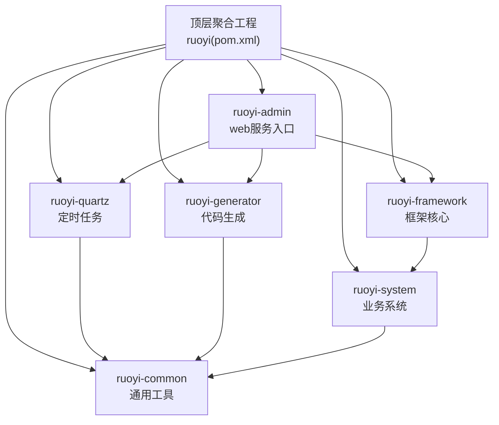
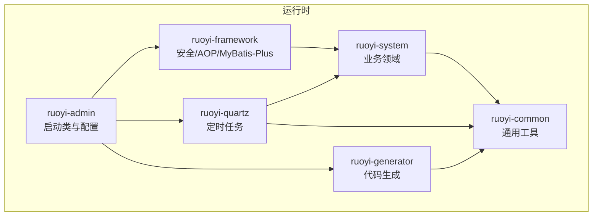
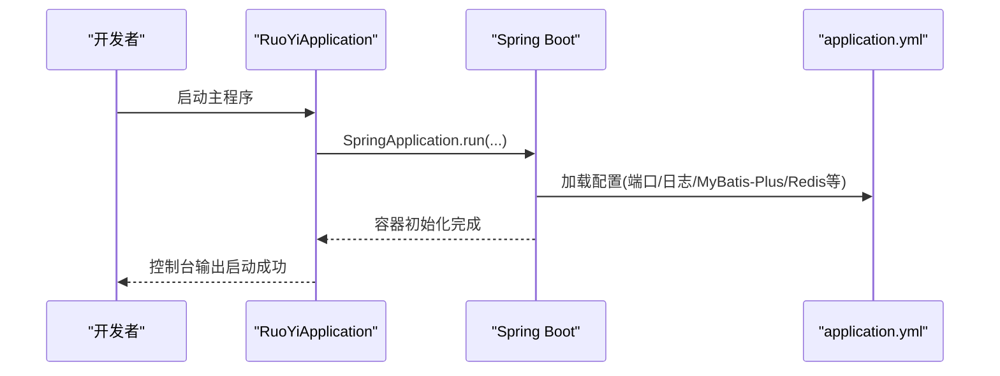
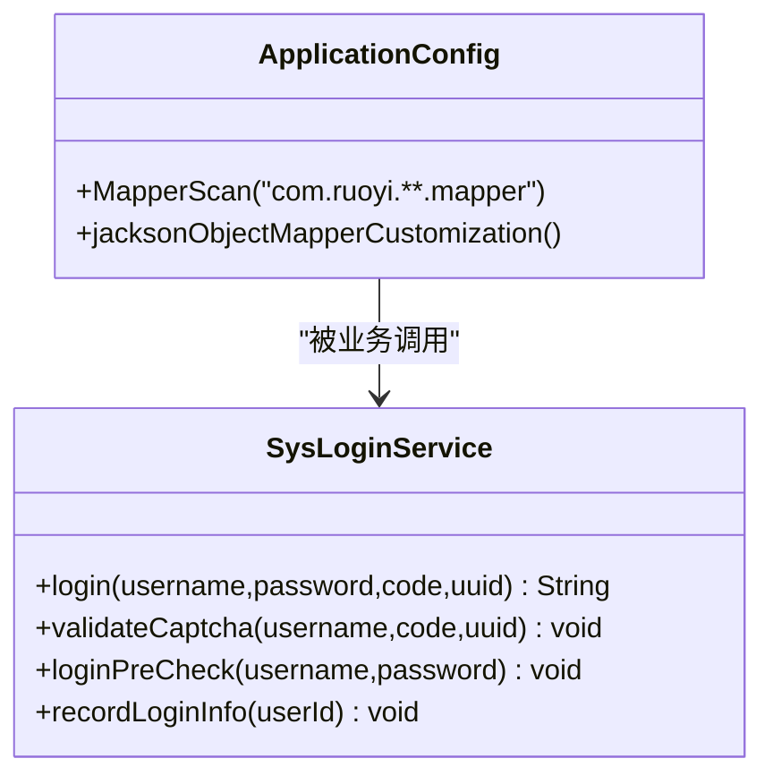
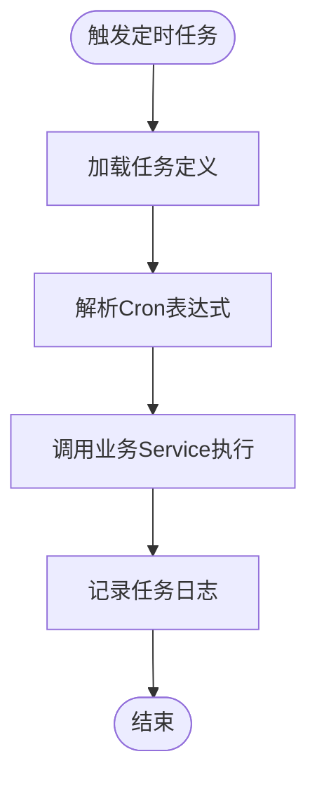
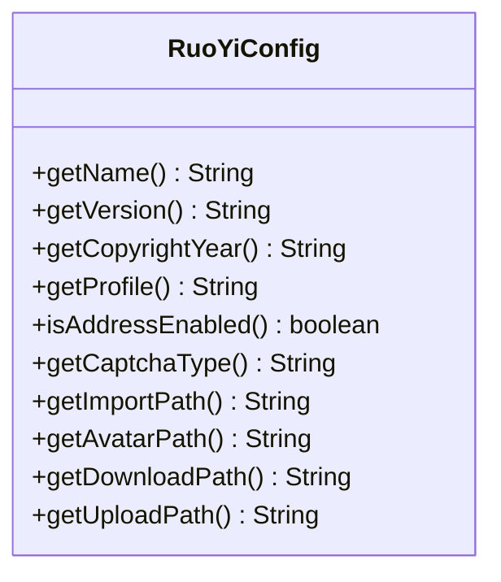
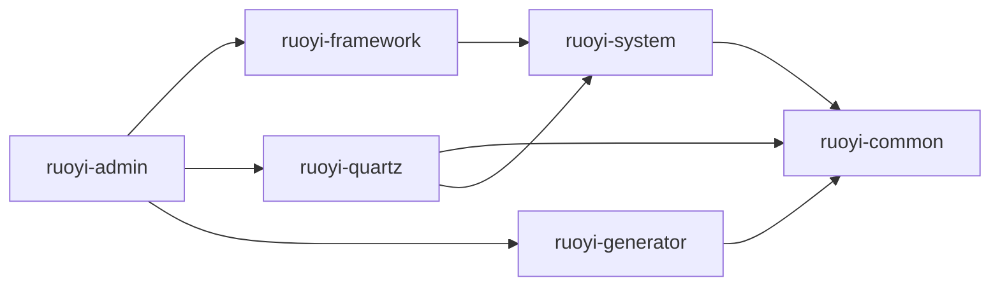

# 模块化设计

<cite>
**本文引用的文件**
- [pom.xml](file://pom.xml)
- [ruoyi-admin/pom.xml](file://ruoyi-admin/pom.xml)
- [ruoyi-framework/pom.xml](file://ruoyi-framework/pom.xml)
- [ruoyi-system/pom.xml](file://ruoyi-system/pom.xml)
- [ruoyi-quartz/pom.xml](file://ruoyi-quartz/pom.xml)
- [ruoyi-generator/pom.xml](file://ruoyi-generator/pom.xml)
- [ruoyi-common/pom.xml](file://ruoyi-common/pom.xml)
- [ruoyi-admin/src/main/resources/application.yml](file://ruoyi-admin/src/main/resources/application.yml)
- [ruoyi-admin/src/main/java/com/ruoyi/RuoYiApplication.java](file://ruoyi-admin/src/main/java/com/ruoyi/RuoYiApplication.java)
- [ruoyi-framework/src/main/java/com/ruoyi/framework/config/ApplicationConfig.java](file://ruoyi-framework/src/main/java/com/ruoyi/framework/config/ApplicationConfig.java)
- [ruoyi-common/src/main/java/com/ruoyi/common/config/RuoYiConfig.java](file://ruoyi-common/src/main/java/com/ruoyi/common/config/RuoYiConfig.java)
- [ruoyi-framework/src/main/java/com/ruoyi/framework/web/service/SysLoginService.java](file://ruoyi-framework/src/main/java/com/ruoyi/framework/web/service/SysLoginService.java)
</cite>

## 目录
1. [简介](#简介)
2. [项目结构](#项目结构)
3. [核心组件](#核心组件)
4. [架构总览](#架构总览)
5. [详细组件分析](#详细组件分析)
6. [依赖分析](#依赖分析)
7. [性能考虑](#性能考虑)
8. [故障排查指南](#故障排查指南)
9. [结论](#结论)
10. [附录](#附录)

## 简介
本文件面向“港好住信息系统”，基于 RuoYi 框架的模块化架构进行系统性设计说明。目标是清晰阐述各模块的职责边界、依赖关系、接口契约与通信机制，并从代码复用、职责分离、团队协作等维度分析模块化优势，同时提供配置示例与扩展机制建议，帮助开发者快速理解与高效迭代。

## 项目结构
本项目采用 Maven 多模块聚合结构，顶层 POM 统一管理版本与依赖，子模块按功能域拆分，形成“入口服务 + 框架核心 + 业务系统 + 定时任务 + 代码生成 + 通用工具”的标准分层。

- 顶层聚合工程：统一版本、插件与依赖管理，声明子模块集合
- 子模块划分：
  - ruoyi-admin：Web 服务入口，整合框架、定时任务、代码生成等能力
  - ruoyi-framework：安全、拦截、缓存、MyBatis-Plus、AOP 等基础设施
  - ruoyi-system：业务领域模型、Mapper/Service/Controller 层
  - ruoyi-quartz：定时任务调度与日志
  - ruoyi-generator：代码生成模板与工具
  - ruoyi-common：通用常量、异常、工具类、注解、配置读取等

图表来源
- [pom.xml:184-191](file://pom.xml#L184-L191)
- [ruoyi-admin/pom.xml:39-55](file://ruoyi-admin/pom.xml#L39-L55)
- [ruoyi-framework/pom.xml:67-70](file://ruoyi-framework/pom.xml#L67-L70)
- [ruoyi-quartz/pom.xml:32-42](file://ruoyi-quartz/pom.xml#L32-L42)
- [ruoyi-generator/pom.xml:26-30](file://ruoyi-generator/pom.xml#L26-L30)
- [ruoyi-system/pom.xml:20-24](file://ruoyi-system/pom.xml#L20-L24)

章节来源
- [pom.xml:184-191](file://pom.xml#L184-L191)
- [ruoyi-admin/pom.xml:39-55](file://ruoyi-admin/pom.xml#L39-L55)
- [ruoyi-framework/pom.xml:67-70](file://ruoyi-framework/pom.xml#L67-L70)
- [ruoyi-system/pom.xml:20-24](file://ruoyi-system/pom.xml#L20-L24)
- [ruoyi-quartz/pom.xml:32-42](file://ruoyi-quartz/pom.xml#L32-L42)
- [ruoyi-generator/pom.xml:26-30](file://ruoyi-generator/pom.xml#L26-L30)
- [ruoyi-common/pom.xml:18-122](file://ruoyi-common/pom.xml#L18-L122)

## 核心组件
- ruoyi-admin：作为应用启动入口与对外服务载体，负责加载框架、定时任务与代码生成能力，提供 OpenAPI/Swagger 文档与静态资源托管。
- ruoyi-framework：提供安全认证、AOP 切面、MyBatis-Plus 扫描、Redis、Druid 连接池、国际化、跨域与过滤器等基础能力。
- ruoyi-system：承载业务实体、Mapper、Service、Controller 以及 e签宝、微信支付、政务数据对接等集成。
- ruoyi-quartz：基于 Quartz 的定时任务调度，包含任务与日志 Mapper/Service/Controller，依赖业务 Service 执行具体逻辑。
- ruoyi-generator：Velocity 模板引擎驱动的代码生成器，依赖通用工具与 Druid 连接池。
- ruoyi-common：常量、枚举、异常体系、工具类、注解、配置读取器等横切能力。

章节来源
- [ruoyi-admin/src/main/java/com/ruoyi/RuoYiApplication.java:12-21](file://ruoyi-admin/src/main/java/com/ruoyi/RuoYiApplication.java#L12-L21)
- [ruoyi-framework/src/main/java/com/ruoyi/framework/config/ApplicationConfig.java:21-36](file://ruoyi-framework/src/main/java/com/ruoyi/framework/config/ApplicationConfig.java#L21-L36)
- [ruoyi-common/src/main/java/com/ruoyi/common/config/RuoYiConfig.java:12-89](file://ruoyi-common/src/main/java/com/ruoyi/common/config/RuoYiConfig.java#L12-L89)

## 架构总览
整体采用“入口服务 + 框架核心 + 业务系统 + 定时任务 + 代码生成 + 通用工具”的分层架构，ruoyi-admin 作为聚合入口，通过依赖装配各子模块；ruoyi-framework 提供横切能力；ruoyi-system 负责业务实现；ruoyi-quartz 与 ruoyi-generator 分别提供异步调度与自动化开发能力；ruoyi-common 为所有模块提供通用支撑。

图表来源
- [ruoyi-admin/src/main/java/com/ruoyi/RuoYiApplication.java:12-21](file://ruoyi-admin/src/main/java/com/ruoyi/RuoYiApplication.java#L12-L21)
- [ruoyi-admin/src/main/resources/application.yml:52-148](file://ruoyi-admin/src/main/resources/application.yml#L52-L148)
- [ruoyi-framework/src/main/java/com/ruoyi/framework/config/ApplicationConfig.java:21-36](file://ruoyi-framework/src/main/java/com/ruoyi/framework/config/ApplicationConfig.java#L21-L36)
- [ruoyi-system/pom.xml:20-24](file://ruoyi-system/pom.xml#L20-L24)
- [ruoyi-quartz/pom.xml:32-42](file://ruoyi-quartz/pom.xml#L32-L42)
- [ruoyi-generator/pom.xml:26-30](file://ruoyi-generator/pom.xml#L26-L30)
- [ruoyi-common/pom.xml:18-122](file://ruoyi-common/pom.xml#L18-L122)

## 详细组件分析

### ruoyi-admin：启动与配置
- 启动类：排除数据源自动装配，交由框架与业务模块按需加载，便于多数据源与动态数据源场景。
- 配置要点：
  - 服务器端口、上下文路径、Tomcat 线程池参数
  - 日志级别、国际化资源、文件上传大小
  - Redis、MyBatis-Plus、OpenAPI/Swagger
  - 郑好办网关、微信支付、e签宝、政务代理等外部集成配置
  - XSS、防盗链等安全策略

图表来源
- [ruoyi-admin/src/main/java/com/ruoyi/RuoYiApplication.java:12-21](file://ruoyi-admin/src/main/java/com/ruoyi/RuoYiApplication.java#L12-L21)
- [ruoyi-admin/src/main/resources/application.yml:20-148](file://ruoyi-admin/src/main/resources/application.yml#L20-L148)

章节来源
- [ruoyi-admin/src/main/java/com/ruoyi/RuoYiApplication.java:12-21](file://ruoyi-admin/src/main/java/com/ruoyi/RuoYiApplication.java#L12-L21)
- [ruoyi-admin/src/main/resources/application.yml:20-238](file://ruoyi-admin/src/main/resources/application.yml#L20-L238)

### ruoyi-framework：基础设施与横切能力
- 关键能力：
  - Mapper 扫描路径统一配置
  - Jackson 时区定制
  - AOP 开启与代理暴露
  - 安全认证、权限校验、Token 管理、登录服务
  - 异步任务管理、线程池、Redis 序列化器、过滤器链
- 与 ruoyi-system 的关系：通过依赖引入业务模块，使框架侧的认证、缓存、日志等能力服务于业务层。

图表来源
- [ruoyi-framework/src/main/java/com/ruoyi/framework/config/ApplicationConfig.java:21-36](file://ruoyi-framework/src/main/java/com/ruoyi/framework/config/ApplicationConfig.java#L21-L36)
- [ruoyi-framework/src/main/java/com/ruoyi/framework/web/service/SysLoginService.java:63-100](file://ruoyi-framework/src/main/java/com/ruoyi/framework/web/service/SysLoginService.java#L63-L100)

章节来源
- [ruoyi-framework/src/main/java/com/ruoyi/framework/config/ApplicationConfig.java:21-36](file://ruoyi-framework/src/main/java/com/ruoyi/framework/config/ApplicationConfig.java#L21-L36)
- [ruoyi-framework/src/main/java/com/ruoyi/framework/web/service/SysLoginService.java:63-177](file://ruoyi-framework/src/main/java/com/ruoyi/framework/web/service/SysLoginService.java#L63-L177)

### ruoyi-system：业务域与集成
- 职责：承载业务实体、Mapper/Service/Controller，以及 e签宝、微信支付、政务数据对接等第三方集成。
- 依赖：依赖 ruoyi-common 提供的工具与常量，依赖 ruoyi-framework 的安全与持久化能力。
- 扩展点：新增业务实体时，遵循 ruoyi-generator 生成的模板，结合 ruoyi-framework 的 AOP 与缓存能力提升可维护性。

章节来源
- [ruoyi-system/pom.xml:20-58](file://ruoyi-system/pom.xml#L20-L58)

### ruoyi-quartz：定时任务
- 职责：提供任务调度、日志记录、并发控制等能力；任务执行通常委托给 ruoyi-system 的业务 Service。
- 依赖：依赖 ruoyi-common 与 ruoyi-system，确保任务执行具备统一的异常处理与日志记录。

图表来源
- [ruoyi-quartz/pom.xml:32-42](file://ruoyi-quartz/pom.xml#L32-L42)

章节来源
- [ruoyi-quartz/pom.xml:18-44](file://ruoyi-quartz/pom.xml#L18-L44)

### ruoyi-generator：代码生成
- 职责：基于 Velocity 模板生成 Controller/Service/ServiceImpl/Entity/Mapper/Xml 等代码骨架，加速业务开发。
- 依赖：依赖 ruoyi-common 与 Druid 连接池，保证生成过程的数据库元数据读取与模板渲染。

章节来源
- [ruoyi-generator/pom.xml:18-38](file://ruoyi-generator/pom.xml#L18-L38)

### ruoyi-common：通用工具与配置
- 职责：提供常量、枚举、异常、工具类、注解、配置读取器等横切能力，被所有模块复用。
- 代表：RuoYiConfig 用于集中读取 ruoyi.* 前缀的项目配置，如上传路径、验证码类型等。

图表来源
- [ruoyi-common/src/main/java/com/ruoyi/common/config/RuoYiConfig.java:12-122](file://ruoyi-common/src/main/java/com/ruoyi/common/config/RuoYiConfig.java#L12-L122)

章节来源
- [ruoyi-common/src/main/java/com/ruoyi/common/config/RuoYiConfig.java:12-122](file://ruoyi-common/src/main/java/com/ruoyi/common/config/RuoYiConfig.java#L12-L122)

## 依赖分析
- 依赖方向：
  - ruoyi-admin 依赖 ruoyi-framework、ruoyi-quartz、ruoyi-generator
  - ruoyi-framework 依赖 ruoyi-system
  - ruoyi-quartz 依赖 ruoyi-common 与 ruoyi-system
  - ruoyi-generator 依赖 ruoyi-common
  - ruoyi-system 依赖 ruoyi-common
- 依赖特征：
  - 低耦合：模块间通过依赖声明解耦，避免直接耦合具体实现
  - 可替换：框架与业务分离，便于替换安全、缓存、ORM 等实现
  - 可扩展：新增模块只需在顶层 POM 声明并在子模块中按需依赖

图表来源
- [pom.xml:184-191](file://pom.xml#L184-L191)
- [ruoyi-admin/pom.xml:39-55](file://ruoyi-admin/pom.xml#L39-L55)
- [ruoyi-framework/pom.xml:67-70](file://ruoyi-framework/pom.xml#L67-L70)
- [ruoyi-quartz/pom.xml:32-42](file://ruoyi-quartz/pom.xml#L32-L42)
- [ruoyi-generator/pom.xml:26-30](file://ruoyi-generator/pom.xml#L26-L30)
- [ruoyi-system/pom.xml:20-24](file://ruoyi-system/pom.xml#L20-L24)

章节来源
- [pom.xml:184-191](file://pom.xml#L184-L191)
- [ruoyi-admin/pom.xml:39-55](file://ruoyi-admin/pom.xml#L39-L55)
- [ruoyi-framework/pom.xml:67-70](file://ruoyi-framework/pom.xml#L67-L70)
- [ruoyi-quartz/pom.xml:32-42](file://ruoyi-quartz/pom.xml#L32-L42)
- [ruoyi-generator/pom.xml:26-30](file://ruoyi-generator/pom.xml#L26-L30)
- [ruoyi-system/pom.xml:20-24](file://ruoyi-system/pom.xml#L20-L24)

## 性能考虑
- 线程池与连接池：合理设置 Tomcat 最大线程、最小空闲、最大连接数与等待时间，避免高并发下的资源争用。
- 缓存策略：利用 Redis 缓存热点数据与验证码，降低数据库压力；注意缓存失效与一致性。
- ORM 优化：MyBatis-Plus 分页查询、批量插入、逻辑删除字段配置，减少不必要的全表扫描。
- 异步处理：登录失败、操作日志等非关键路径使用异步任务，避免阻塞主线程。
- 定时任务：使用并发控制注解避免重复执行；任务粒度拆分，避免长耗时任务影响系统稳定性。

## 故障排查指南
- 启动失败
  - 检查 ruoyi-admin 的启动类是否排除了数据源自动装配，确认业务模块已正确引入数据源配置
  - 查看 application.yml 的端口占用与上下文路径冲突
- 登录异常
  - 校验验证码开关与 Redis 是否可用；检查验证码键前缀与过期策略
  - 核对用户名/密码长度规则与黑名单 IP 配置
- 定时任务未执行
  - 检查 Cron 表达式与任务状态；确认任务依赖的业务 Service 是否正常
- 代码生成异常
  - 确认数据库连接与 Druid 配置；检查 Velocity 模板目录是否存在
- 业务接口报错
  - 查看 ruoyi-common 的异常体系与日志级别；定位具体异常类型并结合业务 Service 排查

章节来源
- [ruoyi-admin/src/main/java/com/ruoyi/RuoYiApplication.java:12-21](file://ruoyi-admin/src/main/java/com/ruoyi/RuoYiApplication.java#L12-L21)
- [ruoyi-admin/src/main/resources/application.yml:52-148](file://ruoyi-admin/src/main/resources/application.yml#L52-L148)
- [ruoyi-framework/src/main/java/com/ruoyi/framework/web/service/SysLoginService.java:110-165](file://ruoyi-framework/src/main/java/com/ruoyi/framework/web/service/SysLoginService.java#L110-L165)
- [ruoyi-quartz/pom.xml:32-42](file://ruoyi-quartz/pom.xml#L32-L42)
- [ruoyi-generator/pom.xml:26-30](file://ruoyi-generator/pom.xml#L26-L30)

## 结论
本模块化设计以 RuoYi 为基础，通过“入口服务 + 框架核心 + 业务系统 + 定时任务 + 代码生成 + 通用工具”的分层，实现了职责清晰、依赖可控、易于扩展与维护的系统架构。模块间通过明确的依赖关系与配置契约协同工作，既满足港好住信息系统的当前需求，也为未来横向扩展与纵向演进提供了坚实基础。

## 附录
- 模块配置示例（节选）
  - 服务器与日志：参考 [application.yml:20-148](file://ruoyi-admin/src/main/resources/application.yml#L20-L148)
  - MyBatis-Plus：参考 [application.yml:105-134](file://ruoyi-admin/src/main/resources/application.yml#L105-L134)
  - Redis：参考 [application.yml:72-94](file://ruoyi-admin/src/main/resources/application.yml#L72-L94)
  - OpenAPI/Swagger：参考 [application.yml:136-147](file://ruoyi-admin/src/main/resources/application.yml#L136-L147)
- 扩展机制
  - 新增业务模块：在 ruoyi-system 下新增实体、Mapper、Service、Controller，并在 ruoyi-admin 中注册路由
  - 新增定时任务：在 ruoyi-quartz 中新增任务类与日志 Mapper/Service/Controller
  - 代码生成：使用 ruoyi-generator 生成 CRUD 基础代码，再根据业务补充复杂逻辑
  - 配置中心：通过 ruoyi-common 的 RuoYiConfig 读取 ruoyi.* 前缀配置，便于集中管理