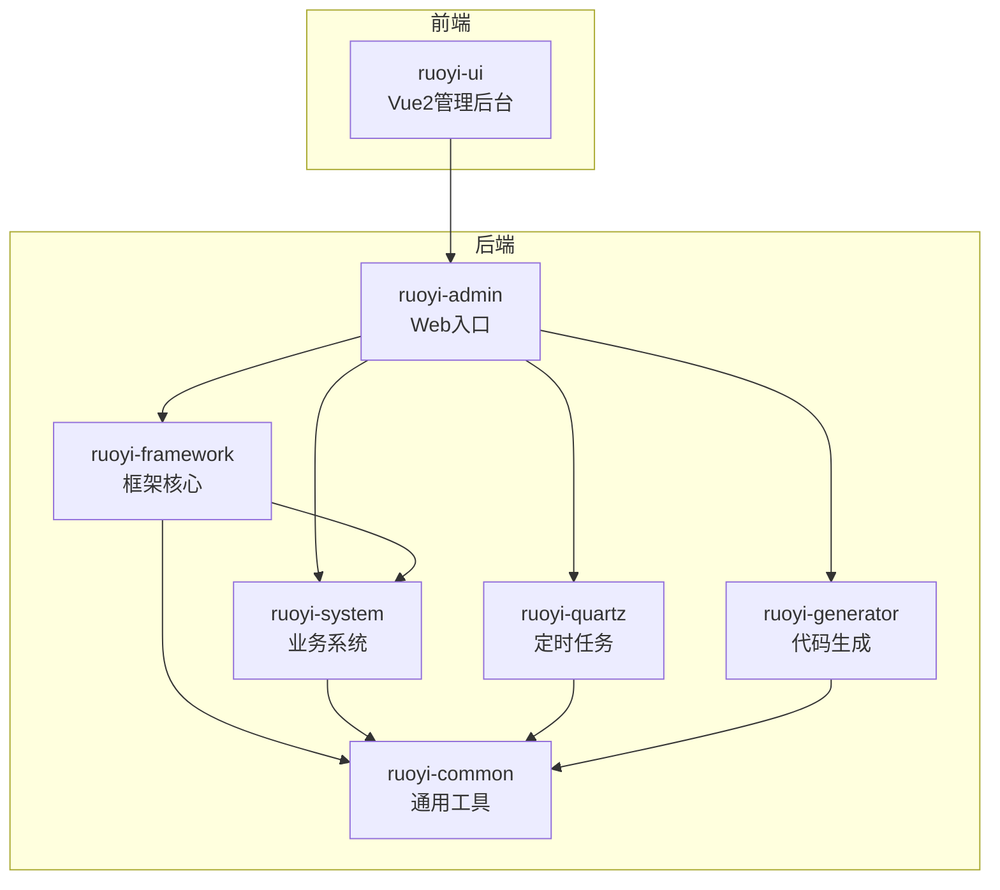
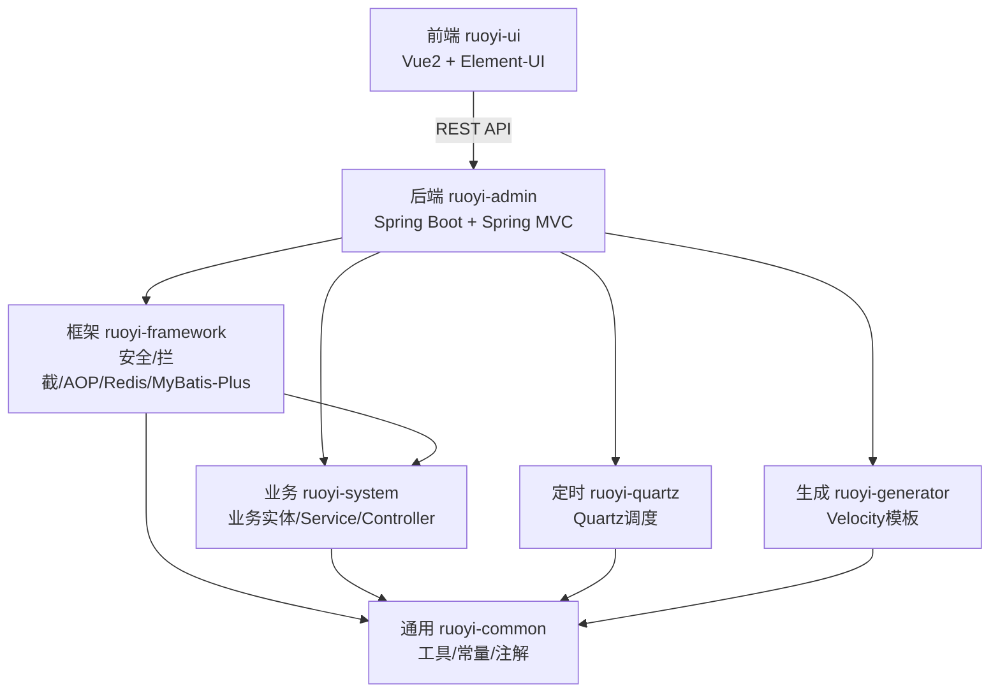
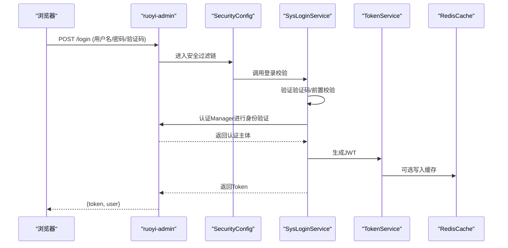
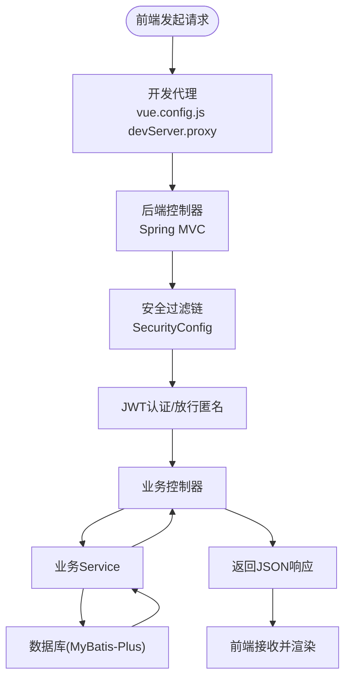
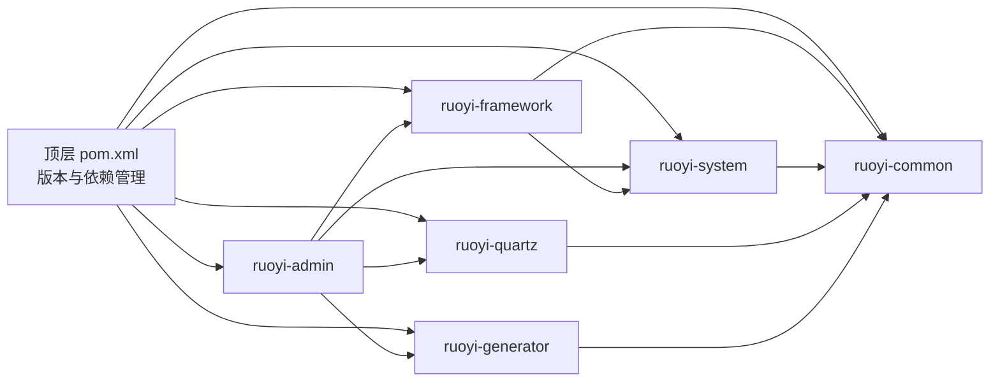

# 系统架构设计

<cite>
**本文引用的文件**
- [pom.xml](file://pom.xml)
- [ruoyi-admin/pom.xml](file://ruoyi-admin/pom.xml)
- [ruoyi-system/pom.xml](file://ruoyi-system/pom.xml)
- [ruoyi-framework/pom.xml](file://ruoyi-framework/pom.xml)
- [ruoyi-quartz/pom.xml](file://ruoyi-quartz/pom.xml)
- [ruoyi-generator/pom.xml](file://ruoyi-generator/pom.xml)
- [ruoyi-common/pom.xml](file://ruoyi-common/pom.xml)
- [ruoyi-admin/src/main/resources/application.yml](file://ruoyi-admin/src/main/resources/application.yml)
- [ruoyi-admin/src/main/java/com/ruoyi/RuoYiApplication.java](file://ruoyi-admin/src/main/java/com/ruoyi/RuoYiApplication.java)
- [ruoyi-framework/src/main/java/com/ruoyi/framework/config/SecurityConfig.java](file://ruoyi-framework/src/main/java/com/ruoyi/framework/config/SecurityConfig.java)
- [ruoyi-framework/src/main/java/com/ruoyi/framework/config/ApplicationConfig.java](file://ruoyi-framework/src/main/java/com/ruoyi/framework/config/ApplicationConfig.java)
- [ruoyi-framework/src/main/java/com/ruoyi/framework/web/service/SysLoginService.java](file://ruoyi-framework/src/main/java/com/ruoyi/framework/web/service/SysLoginService.java)
- [ruoyi-ui/package.json](file://ruoyi-ui/package.json)
- [ruoyi-ui/src/main.js](file://ruoyi-ui/src/main.js)
- [ruoyi-ui/vue.config.js](file://ruoyi-ui/vue.config.js)
</cite>

## 目录
1. [简介](#简介)
2. [项目结构](#项目结构)
3. [核心组件](#核心组件)
4. [架构总览](#架构总览)
5. [详细组件分析](#详细组件分析)
6. [依赖分析](#依赖分析)
7. [性能考量](#性能考量)
8. [故障排查指南](#故障排查指南)
9. [结论](#结论)
10. [附录](#附录)

## 简介
本文件面向“港好住信息系统”的架构设计，基于仓库中现有的多模块 Maven 工程与前后端分离实践，系统性阐述整体架构模式、分层与模块化设计、微服务思想的体现、前后端分离与 RESTful API 设计、数据流与组件交互、集成模式与扩展机制，并给出部署架构图、系统边界与跨领域关注点（安全、监控、缓存等）的设计考虑。

## 项目结构
系统采用 Maven 多模块聚合工程组织，顶层 pom 统一管理版本与依赖，各子模块职责清晰：
- ruoyi-admin：Web 服务入口与对外 API 提供者，整合框架、系统、定时任务与代码生成模块，承载业务控制器与第三方 SDK 依赖。
- ruoyi-framework：框架核心，提供安全、拦截器、MyBatis-Plus、Redis、异步任务等基础设施。
- ruoyi-system：业务系统模块，包含完整的业务实体、Mapper、Service、Controller 以及 e签宝、微信支付等外部集成。
- ruoyi-quartz：定时任务模块，调度业务任务并记录日志。
- ruoyi-generator：代码生成模块，基于模板引擎生成前后端代码。
- ruoyi-common：通用工具与常量、异常、注解、XSS/防爬等基础能力。

图表来源
- [pom.xml:184-191](file://pom.xml#L184-L191)
- [ruoyi-admin/pom.xml:39-55](file://ruoyi-admin/pom.xml#L39-L55)
- [ruoyi-framework/pom.xml:67-70](file://ruoyi-framework/pom.xml#L67-L70)
- [ruoyi-system/pom.xml:20-24](file://ruoyi-system/pom.xml#L20-L24)
- [ruoyi-quartz/pom.xml:32-42](file://ruoyi-quartz/pom.xml#L32-L42)
- [ruoyi-generator/pom.xml:18-30](file://ruoyi-generator/pom.xml#L18-L30)
- [ruoyi-common/pom.xml:18-122](file://ruoyi-common/pom.xml#L18-L122)

章节来源
- [pom.xml:184-191](file://pom.xml#L184-L191)
- [ruoyi-admin/pom.xml:39-55](file://ruoyi-admin/pom.xml#L39-L55)
- [ruoyi-framework/pom.xml:67-70](file://ruoyi-framework/pom.xml#L67-L70)
- [ruoyi-system/pom.xml:20-24](file://ruoyi-system/pom.xml#L20-L24)
- [ruoyi-quartz/pom.xml:32-42](file://ruoyi-quartz/pom.xml#L32-L42)
- [ruoyi-generator/pom.xml:18-30](file://ruoyi-generator/pom.xml#L18-L30)
- [ruoyi-common/pom.xml:18-122](file://ruoyi-common/pom.xml#L18-L122)

## 核心组件
- 应用入口与启动
  - 后端启动类位于 ruoyi-admin，排除数据源自动装配，由框架统一配置。
  - 应用配置集中于 ruoyi-admin/src/main/resources/application.yml，涵盖服务器、日志、MyBatis-Plus、Redis、Token、XSS、微信支付、e签宝、政务代理等。
- 框架核心
  - 安全配置：基于 Spring Security + JWT，开启 CORS，放行匿名接口，禁用 CSRF，无状态 Session。
  - 应用配置：Mapper 扫描路径、Jackson 时区、AOP 代理等。
- 业务系统
  - 业务实体与 Mapper/Service/Controller 分层，集成 e签宝、微信支付等外部能力。
- 定时任务
  - Quartz 调度，结合业务 Service 执行周期性任务。
- 代码生成
  - Velocity 模板引擎，生成前后端代码。
- 通用工具
  - 常量、异常、注解、XSS、缓存、国际化、校验、工具类等。

章节来源
- [ruoyi-admin/src/main/java/com/ruoyi/RuoYiApplication.java:12-21](file://ruoyi-admin/src/main/java/com/ruoyi/RuoYiApplication.java#L12-L21)
- [ruoyi-admin/src/main/resources/application.yml:19-238](file://ruoyi-admin/src/main/resources/application.yml#L19-L238)
- [ruoyi-framework/src/main/java/com/ruoyi/framework/config/SecurityConfig.java:86-124](file://ruoyi-framework/src/main/java/com/ruoyi/framework/config/SecurityConfig.java#L86-L124)
- [ruoyi-framework/src/main/java/com/ruoyi/framework/config/ApplicationConfig.java:21-36](file://ruoyi-framework/src/main/java/com/ruoyi/framework/config/ApplicationConfig.java#L21-L36)
- [ruoyi-framework/src/main/java/com/ruoyi/framework/web/service/SysLoginService.java:63-100](file://ruoyi-framework/src/main/java/com/ruoyi/framework/web/service/SysLoginService.java#L63-L100)

## 架构总览
系统采用“前后端分离 + 多模块后端”的架构模式：
- 前端：Vue2 管理后台，通过 axios 请求后端 REST API，开发时通过 vue.config.js 的 devServer.proxy 将 /api 代理到后端。
- 后端：Spring Boot + Spring MVC，基于 Spring Security + JWT 实现无状态认证，MyBatis-Plus 访问数据库，Redis 缓存，Druid 监控。
- 模块化：ruoyi-admin 作为聚合入口，引入 framework/system/quartz/generator/common；framework 作为基础设施，system 作为业务核心，quartz 与 generator 作为支撑模块。
- 微服务思想：模块边界清晰、依赖倒置（admin 依赖 framework/common），便于独立演进与替换；通过 REST API 与第三方服务（e签宝、微信支付、政务代理）集成。

图表来源
- [ruoyi-ui/vue.config.js:33-53](file://ruoyi-ui/vue.config.js#L33-L53)
- [ruoyi-admin/pom.xml:39-55](file://ruoyi-admin/pom.xml#L39-L55)
- [ruoyi-framework/pom.xml:67-70](file://ruoyi-framework/pom.xml#L67-L70)
- [ruoyi-system/pom.xml:20-24](file://ruoyi-system/pom.xml#L20-L24)
- [ruoyi-quartz/pom.xml:32-42](file://ruoyi-quartz/pom.xml#L32-L42)
- [ruoyi-generator/pom.xml:18-30](file://ruoyi-generator/pom.xml#L18-L30)
- [ruoyi-common/pom.xml:18-122](file://ruoyi-common/pom.xml#L18-L122)

## 详细组件分析

### 安全与认证流程（登录）
系统采用基于 JWT 的无状态认证，登录流程如下：

图表来源
- [ruoyi-framework/src/main/java/com/ruoyi/framework/config/SecurityConfig.java:86-124](file://ruoyi-framework/src/main/java/com/ruoyi/framework/config/SecurityConfig.java#L86-L124)
- [ruoyi-framework/src/main/java/com/ruoyi/framework/web/service/SysLoginService.java:63-100](file://ruoyi-framework/src/main/java/com/ruoyi/framework/web/service/SysLoginService.java#L63-L100)

章节来源
- [ruoyi-framework/src/main/java/com/ruoyi/framework/config/SecurityConfig.java:86-124](file://ruoyi-framework/src/main/java/com/ruoyi/framework/config/SecurityConfig.java#L86-L124)
- [ruoyi-framework/src/main/java/com/ruoyi/framework/web/service/SysLoginService.java:63-100](file://ruoyi-framework/src/main/java/com/ruoyi/framework/web/service/SysLoginService.java#L63-L100)

### 前后端分离与 RESTful API
- 前端
  - 通过 axios 发起请求，开发时通过 devServer.proxy 将 /api 重写到后端地址。
  - 通过路由守卫与权限插件控制页面访问与按钮级权限。
- 后端
  - Spring MVC 提供 REST 控制器，SecurityConfig 放行匿名接口（登录、验证码、静态资源、Swagger、H5/App 等）。
  - CORS 通过 CorsFilter 全局生效，配合 Spring Security 的 addFilterBefore 顺序保证跨域在认证前处理。

图表来源
- [ruoyi-ui/vue.config.js:33-53](file://ruoyi-ui/vue.config.js#L33-L53)
- [ruoyi-framework/src/main/java/com/ruoyi/framework/config/SecurityConfig.java:100-122](file://ruoyi-framework/src/main/java/com/ruoyi/framework/config/SecurityConfig.java#L100-L122)

章节来源
- [ruoyi-ui/src/main.js:18-19](file://ruoyi-ui/src/main.js#L18-L19)
- [ruoyi-ui/vue.config.js:33-53](file://ruoyi-ui/vue.config.js#L33-L53)
- [ruoyi-framework/src/main/java/com/ruoyi/framework/config/SecurityConfig.java:100-122](file://ruoyi-framework/src/main/java/com/ruoyi/framework/config/SecurityConfig.java#L100-L122)

### 数据流与组件交互
- 数据持久化：MyBatis-Plus 通过 Mapper XML 与实体类交互，全局配置驼峰映射、逻辑删除字段、Banner 控制台输出等。
- 缓存：Redis 用于验证码、Token、限流等场景，配置在 application.yml 中。
- 异步与监控：AsyncManager/AsyncFactory 提交异步任务（如登录日志），Drift 监控与日志级别在 application.yml 中配置。
- 第三方集成：微信支付、e签宝、政务代理等通过各自 SDK 与配置项接入，统一在 ruoyi-admin 的 application.yml 中管理。

章节来源
- [ruoyi-admin/src/main/resources/application.yml:105-134](file://ruoyi-admin/src/main/resources/application.yml#L105-L134)
- [ruoyi-admin/src/main/resources/application.yml:72-94](file://ruoyi-admin/src/main/resources/application.yml#L72-L94)
- [ruoyi-framework/src/main/java/com/ruoyi/framework/config/ApplicationConfig.java:21-36](file://ruoyi-framework/src/main/java/com/ruoyi/framework/config/ApplicationConfig.java#L21-L36)

### 集成模式与扩展机制
- 模块扩展：新增功能优先在 ruoyi-system 新增实体/Service/Controller，或在 ruoyi-common 增加通用能力，避免耦合到 admin。
- 外部系统：通过 SDK 与配置项（如 wechat、esign、gov.proxy）扩展，保持配置隔离与环境变量覆盖。
- 代码生成：ruoyi-generator 基于 Velocity 模板快速生成 CRUD 代码，降低重复劳动。
- 定时任务：ruoyi-quartz 通过 Cron 触发业务任务，日志落库便于追踪。

章节来源
- [ruoyi-system/pom.xml:32-56](file://ruoyi-system/pom.xml#L32-L56)
- [ruoyi-admin/src/main/resources/application.yml:179-230](file://ruoyi-admin/src/main/resources/application.yml#L179-L230)
- [ruoyi-quartz/pom.xml:18-42](file://ruoyi-quartz/pom.xml#L18-L42)
- [ruoyi-generator/pom.xml:18-37](file://ruoyi-generator/pom.xml#L18-L37)

## 依赖分析
- 顶层依赖管理：统一版本与依赖范围，确保模块间一致性。
- 子模块依赖：
  - ruoyi-admin 依赖 framework/system/quartz/generator 与第三方 SDK。
  - ruoyi-framework 依赖 web、aop、druid、kaptcha、oshi、MyBatis-Plus、system。
  - ruoyi-system 依赖 common、MyBatis-Plus、微信支付、e签宝 SDK。
  - ruoyi-quartz 依赖 common 与 system。
  - ruoyi-generator 依赖 common、druid、velocity。
  - ruoyi-common 依赖 spring-web、security、validation、jackson/fastjson、poi、yaml、redis、mybatis-plus 等。

图表来源
- [pom.xml:39-182](file://pom.xml#L39-L182)
- [ruoyi-admin/pom.xml:39-55](file://ruoyi-admin/pom.xml#L39-L55)
- [ruoyi-framework/pom.xml:18-70](file://ruoyi-framework/pom.xml#L18-L70)
- [ruoyi-system/pom.xml:18-56](file://ruoyi-system/pom.xml#L18-L56)
- [ruoyi-quartz/pom.xml:18-42](file://ruoyi-quartz/pom.xml#L18-L42)
- [ruoyi-generator/pom.xml:18-37](file://ruoyi-generator/pom.xml#L18-L37)
- [ruoyi-common/pom.xml:18-122](file://ruoyi-common/pom.xml#L18-L122)

章节来源
- [pom.xml:39-182](file://pom.xml#L39-L182)
- [ruoyi-admin/pom.xml:39-55](file://ruoyi-admin/pom.xml#L39-L55)
- [ruoyi-framework/pom.xml:18-70](file://ruoyi-framework/pom.xml#L18-L70)
- [ruoyi-system/pom.xml:18-56](file://ruoyi-system/pom.xml#L18-L56)
- [ruoyi-quartz/pom.xml:18-42](file://ruoyi-quartz/pom.xml#L18-L42)
- [ruoyi-generator/pom.xml:18-37](file://ruoyi-generator/pom.xml#L18-L37)
- [ruoyi-common/pom.xml:18-122](file://ruoyi-common/pom.xml#L18-L122)

## 性能考量
- 前端
  - 通过 gzip 压缩与分包策略优化首屏加载；SVG 图标资源优化；Element-UI 与第三方库拆分打包。
- 后端
  - MyBatis-Plus 配置驼峰映射与日志实现，减少 ORM 映射成本；Redis 缓存热点数据与验证码；Tomcat 线程池参数可调优并发能力。
- 定时任务
  - Quartz 调度与日志分离，避免阻塞主业务；任务粒度细化，避免长耗时任务影响系统稳定性。

章节来源
- [ruoyi-ui/vue.config.js:68-78](file://ruoyi-ui/vue.config.js#L68-L78)
- [ruoyi-ui/vue.config.js:111-134](file://ruoyi-ui/vue.config.js#L111-L134)
- [ruoyi-admin/src/main/resources/application.yml:20-36](file://ruoyi-admin/src/main/resources/application.yml#L20-L36)
- [ruoyi-admin/src/main/resources/application.yml:105-134](file://ruoyi-admin/src/main/resources/application.yml#L105-L134)

## 故障排查指南
- 登录失败
  - 检查验证码是否过期或不匹配；查看登录前置校验（长度、黑名单）；确认 Redis 中验证码键是否存在。
- 跨域问题
  - 确认 SecurityConfig 中 CORS 过滤器顺序正确；核对 devServer.proxy 的 pathRewrite 与目标地址。
- Swagger 文档
  - 确认 springdoc.group-configs 与扫描包路径；生产环境谨慎开放 API 文档。
- 第三方集成
  - 微信支付与 e签宝配置项需与实际环境一致；证书与回调地址需公网可达。
- 定时任务
  - 检查 Quartz 配置与 Cron 表达式；核对任务日志表记录。

章节来源
- [ruoyi-framework/src/main/java/com/ruoyi/framework/web/service/SysLoginService.java:110-129](file://ruoyi-framework/src/main/java/com/ruoyi/framework/web/service/SysLoginService.java#L110-L129)
- [ruoyi-framework/src/main/java/com/ruoyi/framework/config/SecurityConfig.java:118-122](file://ruoyi-framework/src/main/java/com/ruoyi/framework/config/SecurityConfig.java#L118-L122)
- [ruoyi-ui/vue.config.js:37-51](file://ruoyi-ui/vue.config.js#L37-L51)
- [ruoyi-admin/src/main/resources/application.yml:135-148](file://ruoyi-admin/src/main/resources/application.yml#L135-L148)
- [ruoyi-admin/src/main/resources/application.yml:179-218](file://ruoyi-admin/src/main/resources/application.yml#L179-L218)

## 结论
本系统以“前后端分离 + 多模块后端”为核心，通过 ruoyi-admin 聚合框架、业务、定时任务与代码生成模块，形成清晰的分层与模块化架构。安全方面采用 JWT 无状态认证与 CORS 全局处理，业务通过 MyBatis-Plus 与 Redis 提升效率，第三方集成通过配置化与 SDK 实现。整体具备良好的扩展性与可维护性，适合在持续迭代中演进为更细粒度的微服务架构。

## 附录
- 前端技术栈：Vue2、Element-UI、Axios、Vuex、Vue Router。
- 后端技术栈：Spring Boot 3、Spring Security、Spring MVC、MyBatis-Plus、Redis、Quartz、Druid、JWT、FastJSON2、Kaptcha、OpenAPI/SpringDoc。

章节来源
- [ruoyi-ui/package.json:26-50](file://ruoyi-ui/package.json#L26-L50)
- [ruoyi-ui/src/main.js:10-15](file://ruoyi-ui/src/main.js#L10-L15)