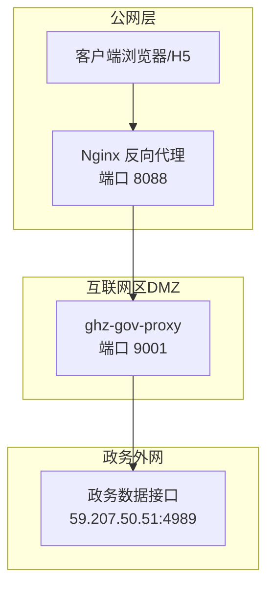
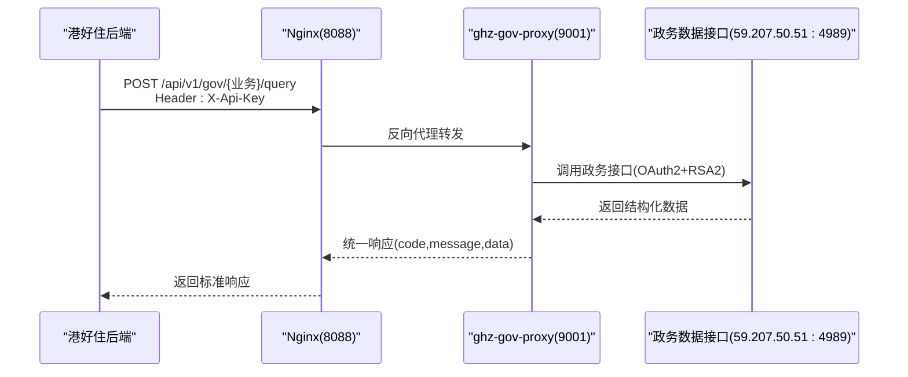
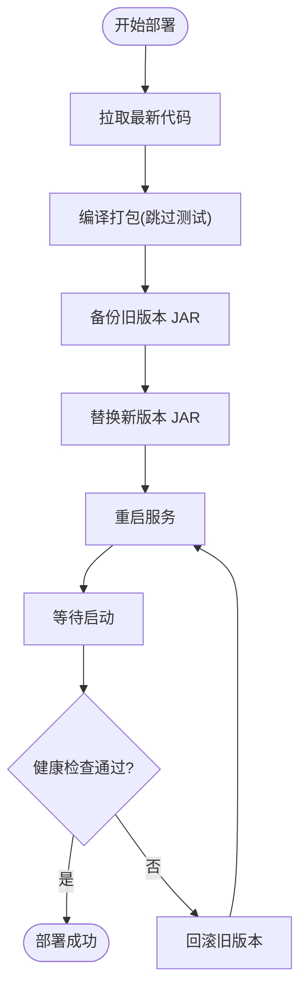
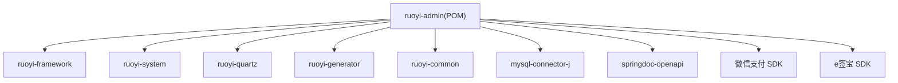

# 部署架构

<cite>
**本文引用的文件**
- [ghz-gov-proxy 部署说明](file://ghz-gov-proxy/deploy/README.md)
- [ghz-gov-proxy 对接指南](file://ghz-gov-proxy/deploy/港好住后端对接指南.md)
- [ghz-gov-proxy 生产配置](file://ghz-gov-proxy/deploy/application-prod.yml)
- [ghz-gov-proxy Nginx 配置](file://ghz-gov-proxy/deploy/nginx-ghz-gov-proxy.conf)
- [ghz-gov-proxy 启动脚本](file://ghz-gov-proxy/deploy/start.sh)
- [ghz-gov-proxy 停止脚本](file://ghz-gov-proxy/deploy/stop.sh)
- [ruoyi-admin 应用配置](file://ruoyi-admin/src/main/resources/application.yml)
- [ruoyi-admin 数据源配置](file://ruoyi-admin/src/main/resources/application-druid.yml)
- [ruoyi-admin 模块 POM](file://ruoyi-admin/pom.xml)
- [根 POM 依赖管理](file://pom.xml)
- [后端部署流水线](file://.github/workflows/backend-deploy.yml)
- [服务器部署脚本](file://server-deploy.sh)
- [CI/CD 方案](file://gitee的ci-cd方案.md)
- [ruoyi 框架配置](file://ruoyi-framework/src/main/java/com/ruoyi/framework/config/ApplicationConfig.java)
- [ruoyi 框架线程池配置](file://ruoyi-framework/src/main/java/com/ruoyi/framework/config/ThreadPoolConfig.java)
- [ruoyi 框架 Redis 配置](file://ruoyi-framework/src/main/java/com/ruoyi/framework/config/RedisConfig.java)
- [ruoyi 框架安全配置](file://ruoyi-framework/src/main/java/com/ruoyi/framework/config/SecurityConfig.java)
- [ruoyi 框架服务器监控](file://ruoyi-admin/src/main/java/com/ruoyi/web/controller/monitor/ServerController.java)
- [ruoyi UI 服务器监控接口](file://ruoyi-ui/src/api/monitor/server.js)
</cite>

## 目录
1. [简介](#简介)
2. [项目结构](#项目结构)
3. [核心组件](#核心组件)
4. [架构总览](#架构总览)
5. [详细组件分析](#详细组件分析)
6. [依赖关系分析](#依赖关系分析)
7. [性能考虑](#性能考虑)
8. [故障排查指南](#故障排查指南)
9. [结论](#结论)
10. [附录](#附录)

## 简介
本文件面向港好住信息系统，提供完整的部署架构文档，涵盖单体部署与分布式部署两种模式，详细说明负载均衡策略、高可用性设计、容灾备份方案，并给出各模块部署要求（JVM 配置、内存设置、端口规划等）。同时包含容器化部署方案、Docker 镜像构建与 Kubernetes 编排策略，以及生产环境部署流程、环境配置管理、版本发布策略与回滚机制、监控告警配置与运维管理最佳实践。

## 项目结构
系统采用前后端分离架构，后端基于 Spring Boot 3 + 若依框架，前端采用 Vue 3 + Element Plus，辅以 Nginx 作为公网入口反向代理。政务数据接口通过专用代理服务跨网访问，确保合规与安全。

图表来源
- [ghz-gov-proxy 部署说明:3-14](file://ghz-gov-proxy/deploy/README.md#L3-L14)
- [ghz-gov-proxy Nginx 配置:7-44](file://ghz-gov-proxy/deploy/nginx-ghz-gov-proxy.conf#L7-L44)

章节来源
- [ghz-gov-proxy 部署说明:1-177](file://ghz-gov-proxy/deploy/README.md#L1-L177)
- [ghz-gov-proxy Nginx 配置:1-45](file://ghz-gov-proxy/deploy/nginx-ghz-gov-proxy.conf#L1-L45)

## 核心组件
- 港好住后端（公网业务系统）：部署于公有云，负责对外提供业务接口与调用代理服务。
- Nginx 反向代理：部署于互联网区 DMZ，负责公网入口、请求转发与超时控制。
- 政务代理服务（ghz-gov-proxy）：部署于政务外网，提供统一 REST 接口并调用政务 SDK。
- 政务数据接口：位于电子政务外网，提供婚姻、社保、公租房、不动产等数据查询。

章节来源
- [ghz-gov-proxy 部署说明:3-14](file://ghz-gov-proxy/deploy/README.md#L3-L14)
- [ghz-gov-proxy Nginx 配置:7-44](file://ghz-gov-proxy/deploy/nginx-ghz-gov-proxy.conf#L7-L44)

## 架构总览
系统采用三层跨网架构，满足政务外网与互联网物理隔离的要求。公网入口通过 Nginx 将请求转发至政务外网的代理服务，代理服务负责与政务接口交互并返回标准化结果。

图表来源
- [ghz-gov-proxy 对接指南:24-50](file://ghz-gov-proxy/deploy/港好住后端对接指南.md#L24-L50)
- [ghz-gov-proxy Nginx 配置:19-38](file://ghz-gov-proxy/deploy/nginx-ghz-gov-proxy.conf#L19-L38)

## 详细组件分析

### 港好住后端（ruoyi-admin）
- 服务端口：8090（开发环境配置）
- 文件上传：单文件最大 200MB，总上传 300MB
- 数据库连接：Druid 连接池，主库地址指向 36.133.39.148:33061
- 政务代理配置：可通过环境变量覆盖代理基地址与 API Key
- 监控接口：/monitor/server 提供服务器硬件信息

章节来源
- [ruoyi-admin 应用配置:20-22](file://ruoyi-admin/src/main/resources/application.yml#L20-L22)
- [ruoyi-admin 应用配置:59-65](file://ruoyi-admin/src/main/resources/application.yml#L59-L65)
- [ruoyi-admin 数据源配置:12-14](file://ruoyi-admin/src/main/resources/application-druid.yml#L12-L14)
- [ruoyi-admin 应用配置:220-229](file://ruoyi-admin/src/main/resources/application.yml#L220-L229)
- [ruoyi-admin 模块 POM:1-140](file://ruoyi-admin/pom.xml#L1-L140)
- [ruoyi 框架配置:1-200](file://ruoyi-framework/src/main/java/com/ruoyi/framework/config/ApplicationConfig.java#L1-L200)
- [ruoyi 框架线程池配置:1-200](file://ruoyi-framework/src/main/java/com/ruoyi/framework/config/ThreadPoolConfig.java#L1-L200)
- [ruoyi 框架 Redis 配置:1-200](file://ruoyi-framework/src/main/java/com/ruoyi/framework/config/RedisConfig.java#L1-L200)
- [ruoyi 框架安全配置:1-200](file://ruoyi-framework/src/main/java/com/ruoyi/framework/config/SecurityConfig.java#L1-L200)
- [ruoyi 框架服务器监控:1-27](file://ruoyi-admin/src/main/java/com/ruoyi/web/controller/monitor/ServerController.java#L1-L27)
- [ruoyi UI 服务器监控接口:1-9](file://ruoyi-ui/src/api/monitor/server.js#L1-L9)

### 政务代理服务（ghz-gov-proxy）
- 端口：9001
- API Key：生产环境固定值，调用时需在请求头 X-Api-Key 传入
- 日志：输出到 run.log，并落盘到 /opt/ghz-gov-proxy/logs/ghz-gov-proxy.log
- Nginx 转发：监听 8088，超时配置读取 60s，适配政务接口慢响应
- 启停脚本：支持优雅启停与健康检查

章节来源
- [ghz-gov-proxy 生产配置:7-25](file://ghz-gov-proxy/deploy/application-prod.yml#L7-L25)
- [ghz-gov-proxy Nginx 配置:7-44](file://ghz-gov-proxy/deploy/nginx-ghz-gov-proxy.conf#L7-L44)
- [ghz-gov-proxy 启动脚本:21-28](file://ghz-gov-proxy/deploy/start.sh#L21-L28)
- [ghz-gov-proxy 停止脚本:25-38](file://ghz-gov-proxy/deploy/stop.sh#L25-L38)

### 部署拓扑与高可用设计
- 单体部署：代理服务与 Nginx 分离部署，代理服务独立于公网，仅在 DMZ 与政务外网之间转发。
- 分布式部署：可在 DMZ 与政务外网分别横向扩展 Nginx 与代理服务实例，结合负载均衡器实现高可用。
- 高可用策略：Nginx 与代理服务均支持多实例部署，配合健康检查与自动故障转移。

章节来源
- [ghz-gov-proxy 部署说明:3-14](file://ghz-gov-proxy/deploy/README.md#L3-L14)
- [ghz-gov-proxy Nginx 配置:7-44](file://ghz-gov-proxy/deploy/nginx-ghz-gov-proxy.conf#L7-L44)

### 负载均衡策略
- 公网入口：Nginx 作为反向代理，支持多实例横向扩展，结合 Keepalived 或 SLB 实现高可用。
- 代理服务：多实例部署，结合健康检查与自动注册发现，实现流量分发。
- 超时与熔断：Nginx 读取超时设置为 60s，适配政务接口慢响应；代理服务内部可引入熔断与重试策略。

章节来源
- [ghz-gov-proxy Nginx 配置:32-34](file://ghz-gov-proxy/deploy/nginx-ghz-gov-proxy.conf#L32-L34)

### 容灾备份方案
- 数据库备份：全量备份每日凌晨 2 点，增量备份每 4 小时，保留 30 天。
- 文件备份：每日备份到 NAS，保留 30 天。
- 代理服务：Nginx 与代理服务多实例部署，结合健康检查与自动故障转移，降低单点风险。

章节来源
- [技术方案.html:1937-1943](file://技术方案.html#L1937-L1943)

### 模块部署要求

#### JVM 配置与内存设置
- 代理服务：JVM 堆设置为 512MB，使用 G1 垃圾回收器，字符集与时区设置为 UTF-8 与 Asia/Shanghai。
- 后端服务：根据业务规模调整线程池与连接池参数，确保高并发下的稳定性。

章节来源
- [ghz-gov-proxy 启动脚本:21-24](file://ghz-gov-proxy/deploy/start.sh#L21-L24)
- [ruoyi 框架线程池配置:1-200](file://ruoyi-framework/src/main/java/com/ruoyi/framework/config/ThreadPoolConfig.java#L1-L200)

#### 端口规划
- Nginx：监听 8088，公网入口。
- 代理服务：监听 9001，仅在 DMZ 与政务外网之间可达。
- 后端服务：默认 8090（开发环境），生产环境可根据需要调整。

章节来源
- [ghz-gov-proxy Nginx 配置:8-21](file://ghz-gov-proxy/deploy/nginx-ghz-gov-proxy.conf#L8-L21)
- [ghz-gov-proxy 生产配置:7-9](file://ghz-gov-proxy/deploy/application-prod.yml#L7-L9)
- [ruoyi-admin 应用配置:20-22](file://ruoyi-admin/src/main/resources/application.yml#L20-L22)

#### 数据库与缓存
- 数据库：Druid 连接池，主库地址 36.133.39.148:33061，初始连接 5，最大活跃 20。
- 缓存：Redis 默认配置，用于会话与业务缓存。

章节来源
- [ruoyi-admin 数据源配置:22-33](file://ruoyi-admin/src/main/resources/application-druid.yml#L22-L33)
- [ruoyi 框架 Redis 配置:1-200](file://ruoyi-framework/src/main/java/com/ruoyi/framework/config/RedisConfig.java#L1-L200)

### 容器化部署方案
- Docker 镜像构建：后端服务可打包为 Spring Boot 可执行 JAR，容器内通过 Java 命令启动；Nginx 镜像用于公网入口。
- Kubernetes 编排：使用 Deployment 管理副本数，Service 暴露服务，Ingress 管理外部访问；Secret 管理 API Key 与数据库凭据；ConfigMap 管理配置文件。

章节来源
- [ruoyi-admin 模块 POM:109-137](file://ruoyi-admin/pom.xml#L109-L137)
- [根 POM 依赖管理:15-36](file://pom.xml#L15-L36)

### 生产环境部署流程
- 代码拉取：从 Git 仓库拉取最新代码。
- 编译打包：跳过测试，仅打包 ruoyi-admin 模块。
- 备份旧版本：复制现有 JAR 至备份文件。
- 替换新版本：将新构建的 JAR 替换旧版本。
- 重启服务：通过守护进程或容器编排重启服务。
- 健康检查：等待启动并检查服务状态，失败则回滚。

图表来源
- [服务器部署脚本:7-41](file://server-deploy.sh#L7-L41)
- [CI/CD 方案:132-177](file://gitee的ci-cd方案.md#L132-L177)

章节来源
- [服务器部署脚本:1-42](file://server-deploy.sh#L1-L42)
- [后端部署流水线:1-31](file://.github/workflows/backend-deploy.yml#L1-L31)
- [CI/CD 方案:130-195](file://gitee的ci-cd方案.md#L130-L195)

### 环境配置管理
- 环境变量：代理服务基地址与 API Key 可通过环境变量覆盖。
- 配置文件：生产环境配置集中管理，日志与安全配置分离。
- 密钥管理：API Key 作为敏感信息，避免硬编码与提交到版本库。

章节来源
- [ruoyi-admin 应用配置:220-229](file://ruoyi-admin/src/main/resources/application.yml#L220-L229)
- [ghz-gov-proxy 生产配置:12-16](file://ghz-gov-proxy/deploy/application-prod.yml#L12-L16)

### 版本发布策略与回滚机制
- 发布策略：通过 CI/CD 流水线自动触发部署，确保一致性与可追溯性。
- 回滚机制：部署失败时自动回滚至上一个稳定版本，并重新启动服务。

章节来源
- [后端部署流水线:11-27](file://.github/workflows/backend-deploy.yml#L11-L27)
- [服务器部署脚本:30-39](file://server-deploy.sh#L30-L39)
- [CI/CD 方案:162-172](file://gitee的ci-cd方案.md#L162-L172)

### 监控告警配置与运维管理最佳实践
- 服务器监控：/monitor/server 接口提供 CPU、内存、磁盘等信息，前端通过 API 获取。
- 健康检查：代理服务提供 /api/v1/gov/ping 接口，无需鉴权，便于自动化探活。
- 日志管理：Nginx 与应用日志分离存储，便于定位问题。
- 安全策略：API Key 严格保密，避免泄露；白名单仅允许特定出口 IP 访问。

章节来源
- [ruoyi 框架服务器监控:1-27](file://ruoyi-admin/src/main/java/com/ruoyi/web/controller/monitor/ServerController.java#L1-L27)
- [ruoyi UI 服务器监控接口:1-9](file://ruoyi-ui/src/api/monitor/server.js#L1-L9)
- [ghz-gov-proxy 对接指南:586-593](file://ghz-gov-proxy/deploy/港好住后端对接指南.md#L586-L593)
- [ghz-gov-proxy Nginx 配置:15-17](file://ghz-gov-proxy/deploy/nginx-ghz-gov-proxy.conf#L15-L17)

## 依赖关系分析

图表来源
- [ruoyi-admin 模块 POM:39-106](file://ruoyi-admin/pom.xml#L39-L106)
- [根 POM 依赖管理:160-181](file://pom.xml#L160-L181)

章节来源
- [ruoyi-admin 模块 POM:1-140](file://ruoyi-admin/pom.xml#L1-L140)
- [根 POM 依赖管理:184-191](file://pom.xml#L184-L191)

## 性能考虑
- 线程池与连接池：根据业务并发量调整线程池大小与数据库连接池参数，避免阻塞与超时。
- 超时设置：Nginx 读取超时 60s，代理服务内部建议针对不同接口设置合理的超时与重试策略。
- 缓存策略：对低频变更数据（婚姻、不动产）建议本地缓存，减少对政务接口的依赖。

章节来源
- [ruoyi 框架线程池配置:1-200](file://ruoyi-framework/src/main/java/com/ruoyi/framework/config/ThreadPoolConfig.java#L1-L200)
- [ruoyi-admin 数据源配置:22-33](file://ruoyi-admin/src/main/resources/application-druid.yml#L22-L33)
- [ghz-gov-proxy Nginx 配置:32-34](file://ghz-gov-proxy/deploy/nginx-ghz-gov-proxy.conf#L32-L34)
- [ghz-gov-proxy 对接指南:563-574](file://ghz-gov-proxy/deploy/港好住后端对接指南.md#L563-L574)

## 故障排查指南
- L1 失败：检查代理服务进程与日志，确认端口监听正常。
- L2 失败：检查 DMZ 与政务外网连通性，确认 Nginx 反代配置正确。
- L3 失败：检查公网 NAT 与防火墙策略，确认白名单 IP 正确。
- 401 错误：确认请求头 X-Api-Key 正确，避免泄露。
- 504 超时：政务接口响应较慢，适当延长超时或优化查询条件。

章节来源
- [ghz-gov-proxy 部署说明:154-163](file://ghz-gov-proxy/deploy/README.md#L154-L163)

## 结论
港好住信息系统采用三层跨网架构，既满足政务外网与互联网物理隔离的安全要求，又通过 Nginx 与代理服务实现高可用与可扩展性。通过完善的 CI/CD、监控告警与回滚机制，能够保障生产环境的稳定运行与快速修复。

## 附录
- 部署文件清单与步骤参考 ghz-gov-proxy 部署说明与对接指南。
- 生产环境配置与 API Key 管理遵循敏感信息保护原则。

章节来源
- [ghz-gov-proxy 部署说明:25-33](file://ghz-gov-proxy/deploy/README.md#L25-L33)
- [ghz-gov-proxy 对接指南:132-177](file://ghz-gov-proxy/deploy/港好住后端对接指南.md#L132-L177)