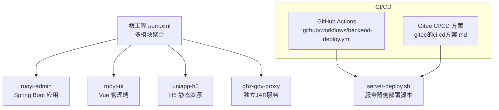
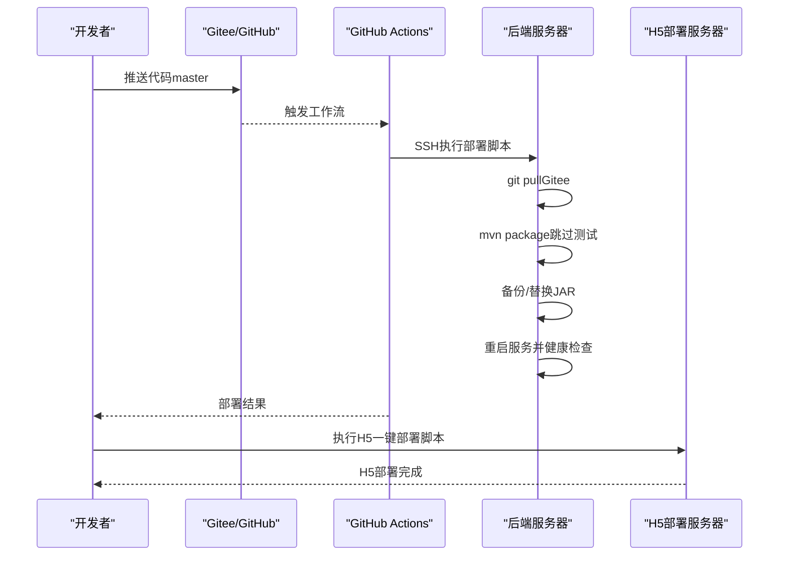
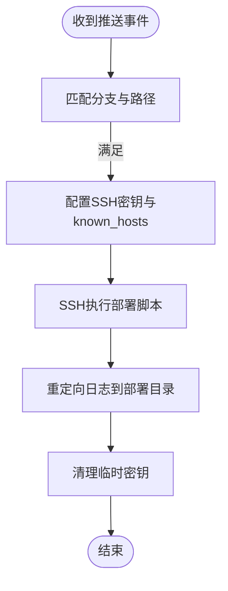
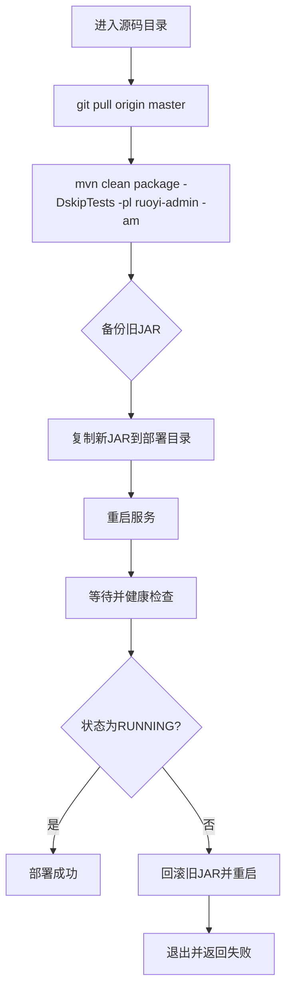
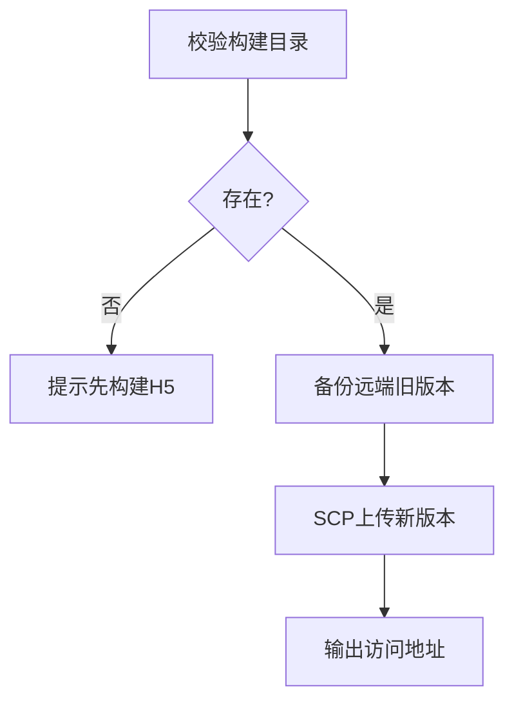
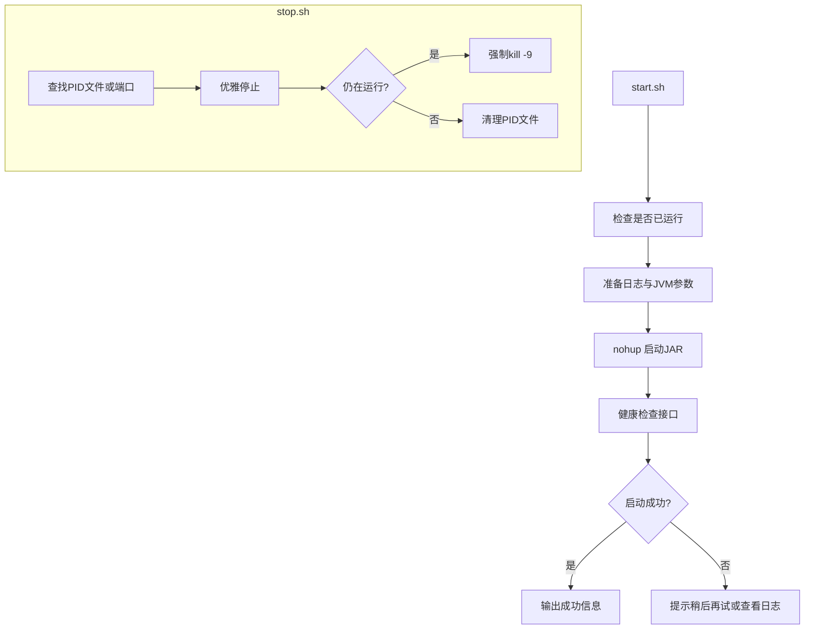
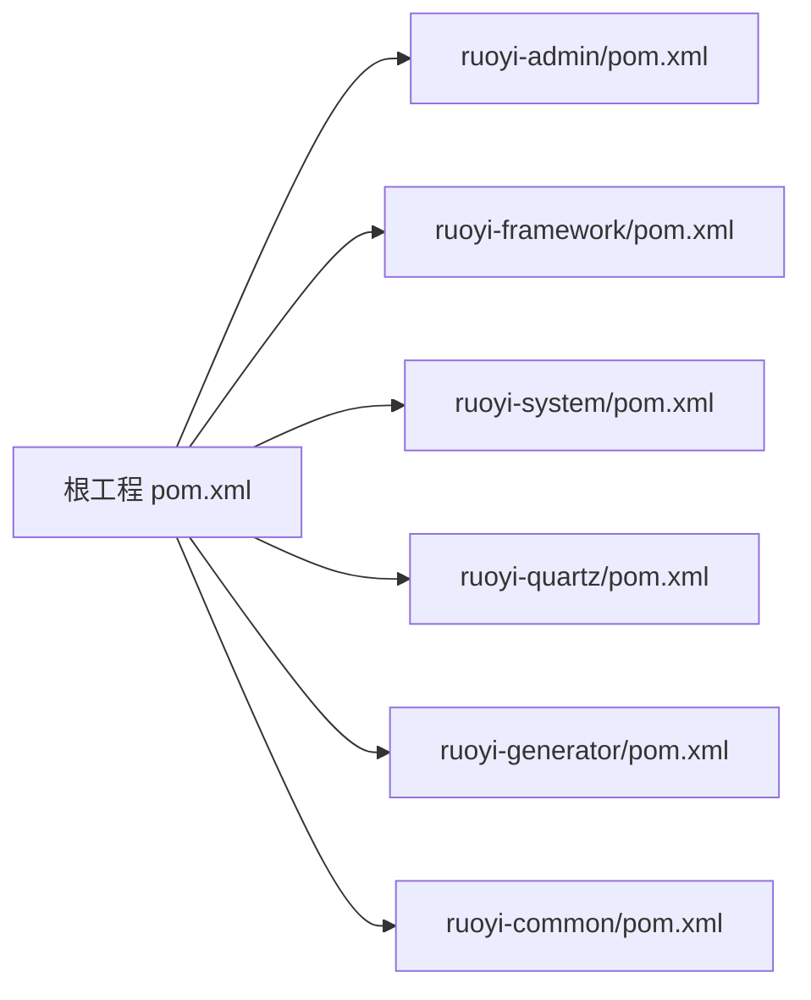
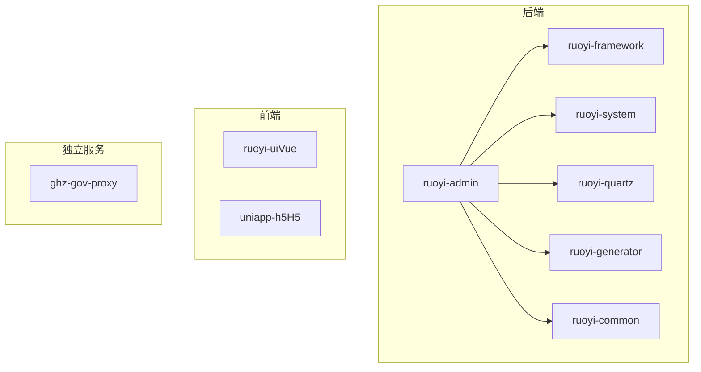

# CI/CD自动化流程

<cite>
**本文引用的文件**
- [gitee的ci-cd方案.md](file://gitee的ci-cd方案.md)
- [server-deploy.sh](file://server-deploy.sh)
- [backend-deploy.yml](file://.github/workflows/backend-deploy.yml)
- [pom.xml](file://pom.xml)
- [ruoyi-admin/pom.xml](file://ruoyi-admin/pom.xml)
- [ruoyi-ui/package.json](file://ruoyi-ui/package.json)
- [ruoyi-ui/bin/build.bat](file://ruoyi-ui/bin/build.bat)
- [uniapp-h5/deploy-h5.sh](file://uniapp-h5/deploy-h5.sh)
- [ghz-gov-proxy/deploy/start.sh](file://ghz-gov-proxy/deploy/start.sh)
- [ghz-gov-proxy/deploy/stop.sh](file://ghz-gov-proxy/deploy/stop.sh)
</cite>

## 目录
1. [简介](#简介)
2. [项目结构](#项目结构)
3. [核心组件](#核心组件)
4. [架构总览](#架构总览)
5. [详细组件分析](#详细组件分析)
6. [依赖关系分析](#依赖关系分析)
7. [性能考虑](#性能考虑)
8. [故障排查指南](#故障排查指南)
9. [结论](#结论)
10. [附录](#附录)

## 简介
本指南面向“港好住信息系统”的CI/CD自动化流程，覆盖GitHub Actions与Gitee CI/CD两种落地方式，围绕代码提交触发、自动构建、测试验证、部署发布、多阶段流水线、环境变量与密钥管理、构建缓存优化、手动/自动部署策略以及分支保护规则等主题，提供可操作的实施建议与排障方法。

## 项目结构
本项目采用多模块Maven聚合工程组织后端服务，前端包含Vue管理端与UniApp-H5两套产物；另有独立的政务代理服务模块。CI/CD涉及的关键路径如下：
- 后端主工程：ruoyi-admin（Spring Boot可执行JAR）
- 前端管理端：ruoyi-ui（Vue CLI工程）
- 前端H5：uniapp-h5（H5静态资源）
- 政务代理：ghz-gov-proxy（独立JAR服务）
- CI/CD配置：GitHub Actions工作流与Gitee CI/CD方案文档

图表来源
- [pom.xml:184-192](file://pom.xml#L184-L192)
- [ruoyi-admin/pom.xml:1-20](file://ruoyi-admin/pom.xml#L1-L20)
- [gitee的ci-cd方案.md:10-24](file://gitee的ci-cd方案.md#L10-L24)
- [server-deploy.sh:1-42](file://server-deploy.sh#L1-L42)

章节来源
- [pom.xml:184-192](file://pom.xml#L184-L192)
- [ruoyi-admin/pom.xml:1-20](file://ruoyi-admin/pom.xml#L1-L20)
- [gitee的ci-cd方案.md:10-24](file://gitee的ci-cd方案.md#L10-L24)
- [server-deploy.sh:1-42](file://server-deploy.sh#L1-L42)

## 核心组件
- 后端主应用（ruoyi-admin）：Spring Boot可执行JAR，作为CI/CD流水线的构建目标。
- 前端管理端（ruoyi-ui）：基于Vue CLI，提供生产构建脚本与打包产物。
- 前端H5（uniapp-h5）：H5静态资源，支持一键部署脚本。
- 政务代理（ghz-gov-proxy）：独立JAR服务，配套启停脚本。
- CI/CD执行器：GitHub Actions工作流与Gitee CI/CD方案文档。

章节来源
- [ruoyi-admin/pom.xml:109-140](file://ruoyi-admin/pom.xml#L109-L140)
- [ruoyi-ui/package.json:7-12](file://ruoyi-ui/package.json#L7-L12)
- [uniapp-h5/deploy-h5.sh:1-42](file://uniapp-h5/deploy-h5.sh#L1-L42)
- [ghz-gov-proxy/deploy/start.sh:1-47](file://ghz-gov-proxy/deploy/start.sh#L1-L47)
- [ghz-gov-proxy/deploy/stop.sh:1-42](file://ghz-gov-proxy/deploy/stop.sh#L1-L42)

## 架构总览
本项目的CI/CD采用“云端触发 + 服务器本地构建”的混合架构，以规避跨境外网传输瓶颈。核心流程：
- 提交代码至Gitee（国内镜像源）与GitHub（触发器）
- GitHub Actions仅发送SSH指令，服务器侧执行git pull、mvn package、替换JAR、重启服务与健康检查
- 前端H5通过SSH一键上传静态资源
- 政务代理服务通过独立启停脚本进行部署

图表来源
- [gitee的ci-cd方案.md:10-24](file://gitee的ci-cd方案.md#L10-L24)
- [gitee的ci-cd方案.md:220-256](file://gitee的ci-cd方案.md#L220-L256)
- [server-deploy.sh:7-41](file://server-deploy.sh#L7-L41)
- [uniapp-h5/deploy-h5.sh:26-41](file://uniapp-h5/deploy-h5.sh#L26-L41)

## 详细组件分析

### GitHub Actions工作流（触发器）
- 触发条件：针对master分支，限定ruoyi-**/**、pom.xml与工作流文件变更
- 步骤要点：
  - 安装SSH密钥与主机公钥指纹
  - 通过SSH登录后端服务器，执行部署脚本并将日志写入指定路径
  - 清理临时密钥
- 适用场景：自动化触发、最小化云端传输

图表来源
- [gitee的ci-cd方案.md:220-256](file://gitee的ci-cd方案.md#L220-L256)

章节来源
- [gitee的ci-cd方案.md:220-256](file://gitee的ci-cd方案.md#L220-L256)

### 服务器侧部署脚本（server-deploy.sh）
- 功能链路：
  - 拉取最新代码（从Gitee拉取，国内速度快）
  - 本地编译打包（跳过测试，缩短构建时间）
  - 备份旧JAR并替换新JAR
  - 重启服务并通过状态脚本进行健康检查
  - 失败自动回滚
- 关键点：使用项目内定义的最终产物名称与部署路径，确保与后端服务配置一致

图表来源
- [server-deploy.sh:1-42](file://server-deploy.sh#L1-L42)

章节来源
- [server-deploy.sh:1-42](file://server-deploy.sh#L1-L42)

### 前端H5一键部署脚本（uniapp-h5/deploy-h5.sh）
- 功能链路：
  - 校验构建产物目录存在
  - 备份远端旧版本目录
  - SCP上传新版本
  - 输出访问地址供验证
- 关键点：与GitHub Secrets保持一致的主机、用户、端口、密钥路径与远端路径

图表来源
- [uniapp-h5/deploy-h5.sh:17-41](file://uniapp-h5/deploy-h5.sh#L17-L41)

章节来源
- [uniapp-h5/deploy-h5.sh:1-42](file://uniapp-h5/deploy-h5.sh#L1-L42)

### 政务代理服务启停脚本（ghz-gov-proxy）
- 启动脚本：设置JVM参数、PID文件、日志输出，健康检查接口验证启动状态
- 停止脚本：根据PID优雅停止，超时强制终止，清理PID文件

图表来源
- [ghz-gov-proxy/deploy/start.sh:13-46](file://ghz-gov-proxy/deploy/start.sh#L13-L46)
- [ghz-gov-proxy/deploy/stop.sh:10-41](file://ghz-gov-proxy/deploy/stop.sh#L10-L41)

章节来源
- [ghz-gov-proxy/deploy/start.sh:1-47](file://ghz-gov-proxy/deploy/start.sh#L1-L47)
- [ghz-gov-proxy/deploy/stop.sh:1-42](file://ghz-gov-proxy/deploy/stop.sh#L1-L42)

### Maven多模块与构建配置
- 根工程定义Java版本、插件版本、仓库镜像与模块划分
- ruoyi-admin子模块定义打包插件、最终产物名与依赖项
- 通过Maven聚合构建，实现多模块统一管理与并行构建

图表来源
- [pom.xml:15-36](file://pom.xml#L15-L36)
- [pom.xml:184-192](file://pom.xml#L184-L192)
- [ruoyi-admin/pom.xml:109-140](file://ruoyi-admin/pom.xml#L109-L140)

章节来源
- [pom.xml:15-36](file://pom.xml#L15-L36)
- [pom.xml:184-192](file://pom.xml#L184-L192)
- [ruoyi-admin/pom.xml:109-140](file://ruoyi-admin/pom.xml#L109-L140)

### Vue管理端构建配置
- 提供生产构建脚本，用于生成dist产物
- 与CI/CD结合，可在云端或本地执行构建

章节来源
- [ruoyi-ui/package.json:7-12](file://ruoyi-ui/package.json#L7-L12)
- [ruoyi-ui/bin/build.bat:10](file://ruoyi-ui/bin/build.bat#L10)

## 依赖关系分析
- 后端服务依赖ruoyi-*各模块，最终打包为ruoyi-admin可执行JAR
- 前端管理端与H5分别产出不同部署物，部署路径与服务器角色不同
- 政务代理服务独立于后端主工程，拥有独立启停脚本

图表来源
- [pom.xml:184-192](file://pom.xml#L184-L192)
- [ruoyi-admin/pom.xml:39-56](file://ruoyi-admin/pom.xml#L39-L56)

章节来源
- [pom.xml:184-192](file://pom.xml#L184-L192)
- [ruoyi-admin/pom.xml:39-56](file://ruoyi-admin/pom.xml#L39-L56)

## 性能考虑
- 传输优化：将编译与打包移至服务器端，避免大体积JAR从境外传至国内，显著缩短总耗时
- 依赖缓存：服务器端首次构建需下载依赖，建议配置Maven镜像加速，后续利用本地缓存提升速度
- 测试跳过：在CI中默认跳过测试，缩短构建时间；如需严格质量门禁，可在PR或特定分支开启测试
- 并行构建：Maven聚合工程支持多模块并行构建，合理规划模块间依赖可减少串行等待

章节来源
- [gitee的ci-cd方案.md:26-35](file://gitee的ci-cd方案.md#L26-L35)
- [gitee的ci-cd方案.md:289-296](file://gitee的ci-cd方案.md#L289-L296)
- [server-deploy.sh:11-13](file://server-deploy.sh#L11-L13)

## 故障排查指南
- SSH连接失败（Permission denied）
  - 检查SSH config与公钥是否正确配置
  - 使用SSH测试连通性验证密钥
- 依赖下载缓慢
  - 在服务器端配置Maven镜像，加速依赖下载
- 部署日志定位
  - 实时查看部署日志文件，定位失败节点
- 健康检查失败
  - 查看服务日志与健康检查接口响应
  - 若失败自动回滚，确认回滚是否成功

章节来源
- [gitee的ci-cd方案.md:277-323](file://gitee的ci-cd方案.md#L277-L323)
- [server-deploy.sh:29-39](file://server-deploy.sh#L29-L39)

## 结论
本方案通过“云端触发 + 服务器本地构建”的组合，有效规避跨境外网传输瓶颈，兼顾构建效率与部署稳定性。建议在生产环境中结合分支保护、密钥轮换与日志审计，持续优化构建缓存与健康检查策略，确保交付质量与可追溯性。

## 附录

### 发布策略与最佳实践
- 自动部署条件
  - master分支推送且命中限定路径（ruoyi-**/**、pom.xml、工作流文件）
- 手动触发部署
  - 通过执行服务器端部署脚本或H5一键部署脚本
- 分支保护规则
  - master分支禁止直接推送，必须通过PR合并
  - 强制要求审查与CI通过
- 环境变量与密钥
  - GitHub Actions使用SSH私钥与目标主机信息
  - H5部署使用SSH密钥与远端路径配置
- 构建缓存优化
  - Maven镜像加速与本地缓存复用
  - 前端构建产物缓存与增量上传

章节来源
- [gitee的ci-cd方案.md:220-256](file://gitee的ci-cd方案.md#L220-L256)
- [uniapp-h5/deploy-h5.sh:9-15](file://uniapp-h5/deploy-h5.sh#L9-L15)