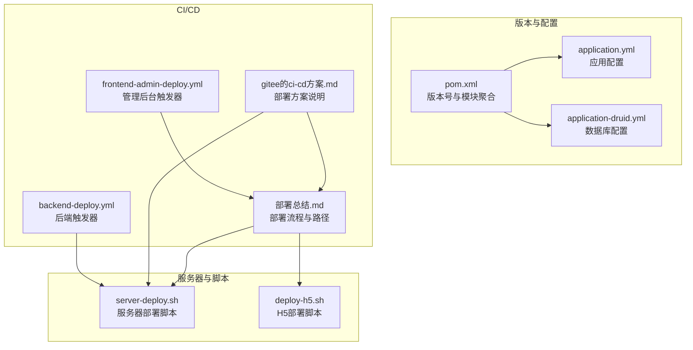
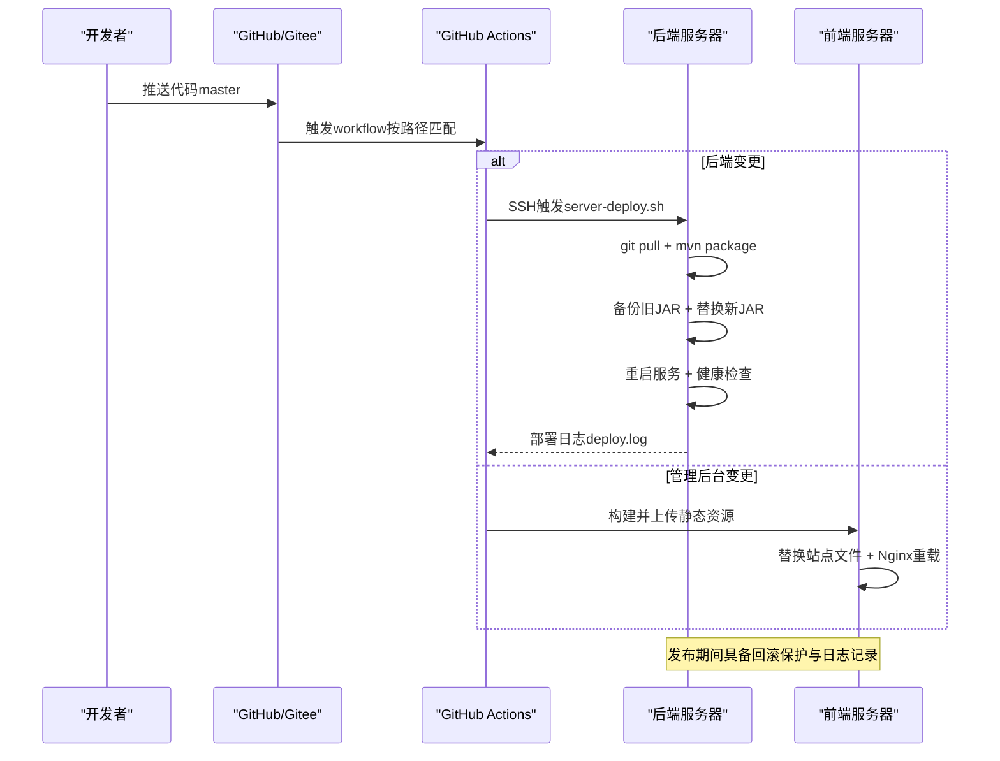
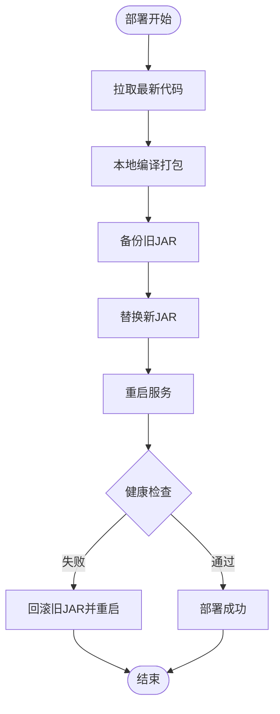
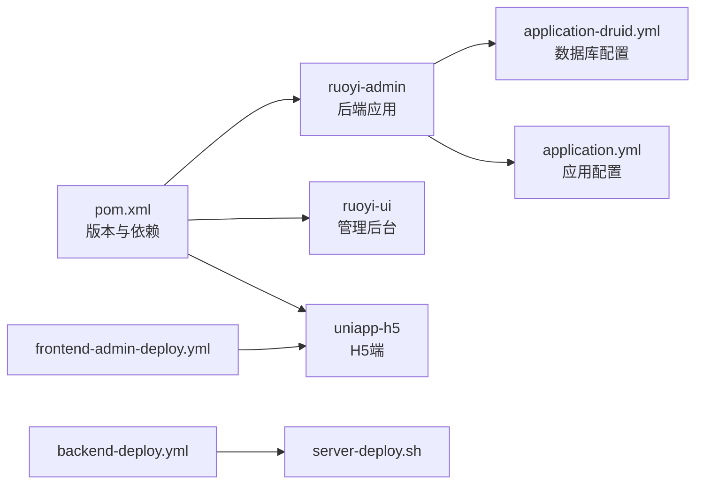
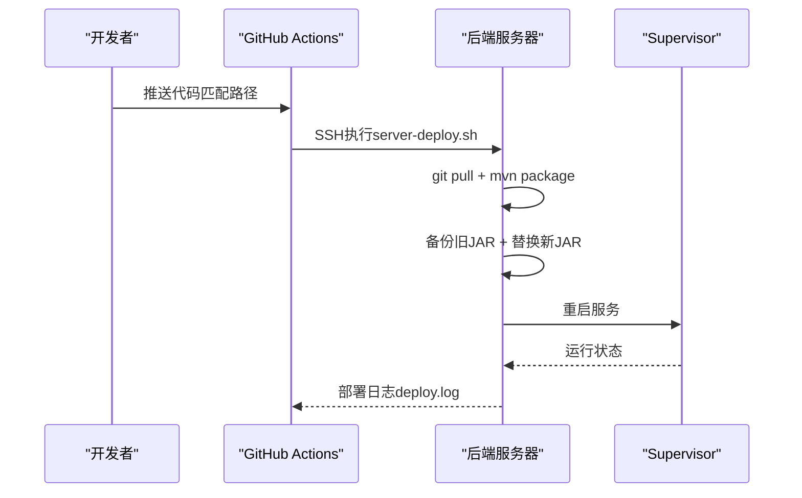

# 版本发布管理

<cite>
**本文引用的文件**
- [pom.xml](file://pom.xml)
- [ruoyi-admin/src/main/resources/application.yml](file://ruoyi-admin/src/main/resources/application.yml)
- [ruoyi-admin/src/main/resources/application-druid.yml](file://ruoyi-admin/src/main/resources/application-druid.yml)
- [gitee的ci-cd方案.md](file://gitee的ci-cd方案.md)
- [部署总结.md](file://部署总结.md)
- [.github/workflows/backend-deploy.yml](file://.github/workflows/backend-deploy.yml)
- [.github/workflows/frontend-admin-deploy.yml](file://.github/workflows/frontend-admin-deploy.yml)
- [server-deploy.sh](file://server-deploy.sh)
- [uniapp-h5/deploy-h5.sh](file://uniapp-h5/deploy-h5.sh)
- [README_数据清理研究.md](file://README_数据清理研究.md)
</cite>

## 目录
1. [简介](#简介)
2. [项目结构](#项目结构)
3. [核心组件](#核心组件)
4. [架构总览](#架构总览)
5. [详细组件分析](#详细组件分析)
6. [依赖分析](#依赖分析)
7. [性能考虑](#性能考虑)
8. [故障排查指南](#故障排查指南)
9. [结论](#结论)
10. [附录](#附录)

## 简介
本文件面向港好住信息系统，系统化梳理版本发布管理的策略与实践，涵盖版本号管理、发布周期、功能分支管理、灰度与蓝绿部署、滚动更新、回滚策略、A/B测试、用户通知、发布前后质量保障机制，以及发布文档模板、变更日志与用户升级指南等管理工具与规范。文档基于仓库现有CI/CD脚本、配置文件与部署说明进行归纳与可视化呈现，确保发布流程可追溯、可审计、可回滚。

## 项目结构
本项目采用多模块Maven工程组织，后端Spring Boot应用位于ruoyi-admin模块，前端分为管理后台ruoyi-ui与H5端uniapp-h5。CI/CD通过GitHub Actions触发，结合服务器侧部署脚本与Supervisor进程守护，实现自动化发布与快速回滚。

**图表来源**
- [pom.xml](file://pom.xml)
- [ruoyi-admin/src/main/resources/application.yml](file://ruoyi-admin/src/main/resources/application.yml)
- [ruoyi-admin/src/main/resources/application-druid.yml](file://ruoyi-admin/src/main/resources/application-druid.yml)
- [gitee的ci-cd方案.md](file://gitee的ci-cd方案.md)
- [部署总结.md](file://部署总结.md)
- [.github/workflows/backend-deploy.yml](file://.github/workflows/backend-deploy.yml)
- [.github/workflows/frontend-admin-deploy.yml](file://.github/workflows/frontend-admin-deploy.yml)
- [server-deploy.sh](file://server-deploy.sh)
- [uniapp-h5/deploy-h5.sh](file://uniapp-h5/deploy-h5.sh)

**章节来源**
- [pom.xml](file://pom.xml)
- [ruoyi-admin/src/main/resources/application.yml](file://ruoyi-admin/src/main/resources/application.yml)
- [ruoyi-admin/src/main/resources/application-druid.yml](file://ruoyi-admin/src/main/resources/application-druid.yml)
- [gitee的ci-cd方案.md](file://gitee的ci-cd方案.md)
- [部署总结.md](file://部署总结.md)
- [.github/workflows/backend-deploy.yml](file://.github/workflows/backend-deploy.yml)
- [.github/workflows/frontend-admin-deploy.yml](file://.github/workflows/frontend-admin-deploy.yml)
- [server-deploy.sh](file://server-deploy.sh)
- [uniapp-h5/deploy-h5.sh](file://uniapp-h5/deploy-h5.sh)

## 核心组件
- 版本号与模块管理：统一在根pom中定义ruoyi版本号，各模块共享依赖版本，便于发布时统一升级与一致性校验。
- 应用配置：后端application.yml集中管理端口、文件上传、Redis、MyBatis-Plus、微信/电子签等集成配置；application-druid.yml集中管理数据库连接池与Druid控制台。
- CI/CD触发与执行：GitHub Actions根据路径变化触发后端与管理后台的构建与部署；H5端通过手动脚本部署。
- 服务器部署脚本：server-deploy.sh负责拉取代码、本地编译、备份与替换、健康检查与回滚；H5部署脚本负责构建产物上传与站点替换。
- 部署与运维：部署总结文档明确服务器角色、域名、路径、日志与常见问题；Supervisor守护进程确保服务稳定运行。

**章节来源**
- [pom.xml](file://pom.xml)
- [ruoyi-admin/src/main/resources/application.yml](file://ruoyi-admin/src/main/resources/application.yml)
- [ruoyi-admin/src/main/resources/application-druid.yml](file://ruoyi-admin/src/main/resources/application-druid.yml)
- [gitee的ci-cd方案.md](file://gitee的ci-cd方案.md)
- [部署总结.md](file://部署总结.md)
- [server-deploy.sh](file://server-deploy.sh)
- [uniapp-h5/deploy-h5.sh](file://uniapp-h5/deploy-h5.sh)

## 架构总览
发布架构由“代码提交—CI触发—服务器执行—健康检查—回滚保护”构成，后端与前端分别独立触发与部署，确保变更可控、可追踪。

**图表来源**
- [.github/workflows/backend-deploy.yml](file://.github/workflows/backend-deploy.yml)
- [.github/workflows/frontend-admin-deploy.yml](file://.github/workflows/frontend-admin-deploy.yml)
- [gitee的ci-cd方案.md](file://gitee的ci-cd方案.md)
- [部署总结.md](file://部署总结.md)
- [server-deploy.sh](file://server-deploy.sh)
- [uniapp-h5/deploy-h5.sh](file://uniapp-h5/deploy-h5.sh)

## 详细组件分析

### 版本号管理策略
- 统一版本：根pom定义ruoyi版本号，作为各模块共享的版本基准，发布时统一升级，避免版本漂移。
- 语义化版本：建议遵循主.次.修订格式，配合变更日志记录重大变更、修复与废弃项，便于用户升级与审计。
- 发布标签：建议在Git打tag并推送，作为发布里程碑，配合发布说明与回滚依据。

**章节来源**
- [pom.xml](file://pom.xml)

### 发布周期规划
- 周期节奏：建议采用固定周期（如双周/月）发布常规版本，紧急修复单独hotfix分支快速回归。
- 冲刺与合并：功能分支在合并前进行代码评审与单元测试，合并至master触发CI发布。
- 回归验证：每次发布前在测试环境执行冒烟与回归测试，发布后进行监控与用户反馈收集。

[本节为通用实践说明，无需特定文件引用]

### 功能分支管理
- 分支策略：采用feature/*命名功能分支，发布前合并至develop或master；hotfix/*用于紧急修复。
- 合并与冲突：合并前确保分支与上游同步，减少冲突；合并后立即触发CI验证。
- 工作树与并行：仓库存在工作树示例，可用于并行开发场景，但需注意分支与工作树的同步与清理。

**章节来源**
- [gitee的ci-cd方案.md](file://gitee的ci-cd方案.md)

### 灰度发布策略
- 服务端灰度：通过负载均衡或网关层将流量按百分比切分至新旧实例，结合健康检查与日志监控，逐步扩大流量。
- 前端灰度：管理后台与H5端可通过域名或Cookie策略定向放量，观察用户行为与错误率后再全量。
- 配置开关：引入特性开关（Feature Flag）在配置中心动态控制功能开启/关闭，降低风险。

[本节为通用实践说明，无需特定文件引用]

### 蓝绿部署方案
- 蓝绿环境：准备两套完全相同的生产环境（蓝/绿），部署新版本到备用环境，健康检查通过后切换流量至新环境，旧环境作为回滚目标。
- 切换与回滚：切换过程仅涉及路由/负载均衡配置变更，回滚时快速切回旧环境，确保业务零停机。

[本节为通用实践说明，无需特定文件引用]

### 滚动更新机制
- 逐批替换：按节点分批停止旧实例、拉起新实例、健康检查、再处理下一批，减少单点压力与中断时间。
- 并发与队列：结合限流与熔断，避免滚动过程中对下游造成冲击。

[本节为通用实践说明，无需特定文件引用]

### 回滚策略
- 自动回滚：服务器部署脚本在健康检查失败时自动回滚至上一个版本JAR，并重启服务。
- 手动回滚：数据库变更或配置变更失败时，依据备份与回滚脚本进行恢复。
- 回滚验证：回滚后进行功能验证与监控指标核对，确保业务恢复正常。

**图表来源**
- [server-deploy.sh](file://server-deploy.sh)
- [部署总结.md](file://部署总结.md)

**章节来源**
- [server-deploy.sh](file://server-deploy.sh)
- [部署总结.md](file://部署总结.md)
- [README_数据清理研究.md](file://README_数据清理研究.md)

### A/B测试
- 流量分桶：通过网关或前端SDK将用户随机分配到不同版本或功能组。
- 指标采集：收集转化率、错误率、时延等关键指标，对比A/B组差异。
- 结论与决策：基于统计显著性得出结论，决定功能是否全量或下线。

[本节为通用实践说明，无需特定文件引用]

### 用户通知
- 发布公告：在管理后台与H5端发布版本说明与注意事项，引导用户升级。
- 强制升级：对于破坏性变更，可在前端拦截并提示强制升级。
- 变更日志：提供清晰的变更摘要与升级指引，降低用户困惑。

[本节为通用实践说明，无需特定文件引用]

### 发布前检查清单
- 代码与评审：功能完成、代码评审通过、单元测试通过。
- 配置校验：数据库连接、第三方密钥、域名与证书、特性开关状态。
- 环境准备：测试环境验证通过、生产环境备份完成、回滚方案就绪。
- 通知与演练：用户公告、演练回滚、监控告警阈值调整。

[本节为通用实践说明，无需特定文件引用]

### 发布后验证流程
- 健康检查：服务状态、接口可用性、数据库连通性。
- 监控指标：响应时延、错误率、吞吐量、资源占用。
- 用户验证：关键路径功能验证、日志与告警核查。
- 归档与复盘：发布日志归档、问题复盘、改进项跟踪。

[本节为通用实践说明，无需特定文件引用]

### 质量保证机制
- CI流水线：按路径触发后端与前端构建，自动上传与部署。
- 配置中心：集中管理数据库、第三方接口与开关配置，避免硬编码。
- 日志与监控：应用日志与部署日志分离，结合告警策略快速定位问题。

**章节来源**
- [.github/workflows/backend-deploy.yml](file://.github/workflows/backend-deploy.yml)
- [.github/workflows/frontend-admin-deploy.yml](file://.github/workflows/frontend-admin-deploy.yml)
- [部署总结.md](file://部署总结.md)
- [ruoyi-admin/src/main/resources/application.yml](file://ruoyi-admin/src/main/resources/application.yml)
- [ruoyi-admin/src/main/resources/application-druid.yml](file://ruoyi-admin/src/main/resources/application-druid.yml)

### 发布文档模板
- 版本说明：版本号、发布日期、主要变更、影响范围。
- 升级指南：前置检查、升级步骤、回滚步骤、常见问题。
- 验证清单：接口验证、数据库验证、配置验证、监控验证。
- 附件：变更日志、回滚脚本、配置文件样例。

[本节为通用实践说明，无需特定文件引用]

### 变更日志管理
- 结构化记录：按功能模块记录新增、修改、修复、废弃项。
- 版本对应：每个版本对应唯一的变更日志，便于用户对照升级。
- 自动化生成：可结合Git log与PR标题生成草稿，人工审校后发布。

[本节为通用实践说明，无需特定文件引用]

### 用户升级指南
- 渐进式升级：优先通知重要用户，收集反馈后扩大范围。
- 引导与帮助：提供FAQ、升级视频或图文说明，降低升级成本。
- 回退通道：保留旧版本访问路径与回滚能力，确保用户可快速回到稳定版本。

[本节为通用实践说明，无需特定文件引用]

## 依赖分析
- 版本耦合：后端ruoyi-admin模块受根pom版本号与依赖管理约束，升级时需同步校验。
- 配置耦合：数据库配置与应用配置分离，部署时需确保环境变量与密钥正确注入。
- CI耦合：后端与前端分别绑定不同路径触发器，避免无关变更触发不必要部署。

**图表来源**
- [pom.xml](file://pom.xml)
- [ruoyi-admin/src/main/resources/application.yml](file://ruoyi-admin/src/main/resources/application.yml)
- [ruoyi-admin/src/main/resources/application-druid.yml](file://ruoyi-admin/src/main/resources/application-druid.yml)
- [.github/workflows/backend-deploy.yml](file://.github/workflows/backend-deploy.yml)
- [.github/workflows/frontend-admin-deploy.yml](file://.github/workflows/frontend-admin-deploy.yml)
- [server-deploy.sh](file://server-deploy.sh)
- [uniapp-h5/deploy-h5.sh](file://uniapp-h5/deploy-h5.sh)

**章节来源**
- [pom.xml](file://pom.xml)
- [ruoyi-admin/src/main/resources/application.yml](file://ruoyi-admin/src/main/resources/application.yml)
- [ruoyi-admin/src/main/resources/application-druid.yml](file://ruoyi-admin/src/main/resources/application-druid.yml)
- [.github/workflows/backend-deploy.yml](file://.github/workflows/backend-deploy.yml)
- [.github/workflows/frontend-admin-deploy.yml](file://.github/workflows/frontend-admin-deploy.yml)
- [server-deploy.sh](file://server-deploy.sh)
- [uniapp-h5/deploy-h5.sh](file://uniapp-h5/deploy-h5.sh)

## 性能考虑
- 传输优化：后端CI采用服务器本地编译与部署，避免大体积JAR跨网络传输，缩短发布时长。
- 缓存与镜像：前端构建在GitHub Actions执行，利用缓存与镜像加速依赖下载。
- 资源与并发：合理设置Tomcat线程数、连接池大小与文件上传限额，满足高峰期访问。

[本节为通用实践说明，无需特定文件引用]

## 故障排查指南
- 后端部署失败：检查部署日志与服务状态，必要时手动回滚旧版本JAR并重启。
- 健康检查失败：查看应用日志与数据库连接，确认配置正确与资源充足。
- 前端404或样式缺失：检查OpenResty伪静态配置与文件上传权限。
- H5 API地址错误：确认H5配置文件中的环境变量与构建产物路径。

**章节来源**
- [部署总结.md](file://部署总结.md)
- [ruoyi-admin/src/main/resources/application.yml](file://ruoyi-admin/src/main/resources/application.yml)
- [ruoyi-admin/src/main/resources/application-druid.yml](file://ruoyi-admin/src/main/resources/application-druid.yml)
- [server-deploy.sh](file://server-deploy.sh)
- [uniapp-h5/deploy-h5.sh](file://uniapp-h5/deploy-h5.sh)

## 结论
本项目已形成较为完善的版本发布体系：统一版本号、清晰的CI触发与服务器部署脚本、自动健康检查与回滚保护、以及完善的部署路径与日志记录。建议在此基础上进一步完善灰度/蓝绿策略、A/B测试与用户通知机制，持续优化发布效率与稳定性。

[本节为总结性内容，无需特定文件引用]

## 附录

### 发布流程图（代码级映射）

**图表来源**
- [.github/workflows/backend-deploy.yml](file://.github/workflows/backend-deploy.yml)
- [server-deploy.sh](file://server-deploy.sh)
- [部署总结.md](file://部署总结.md)