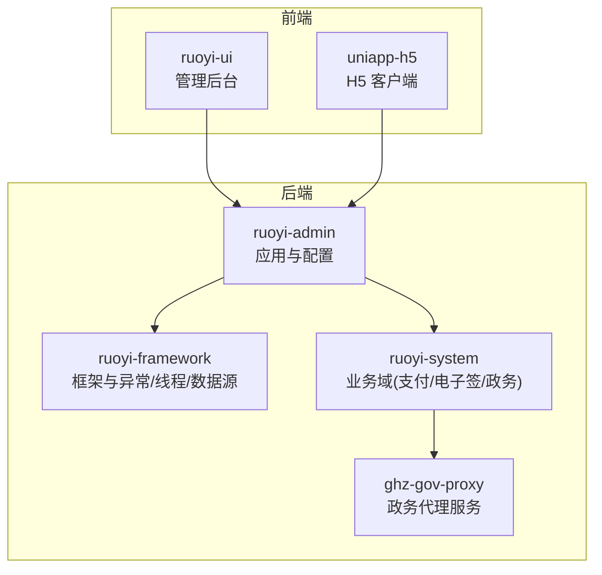
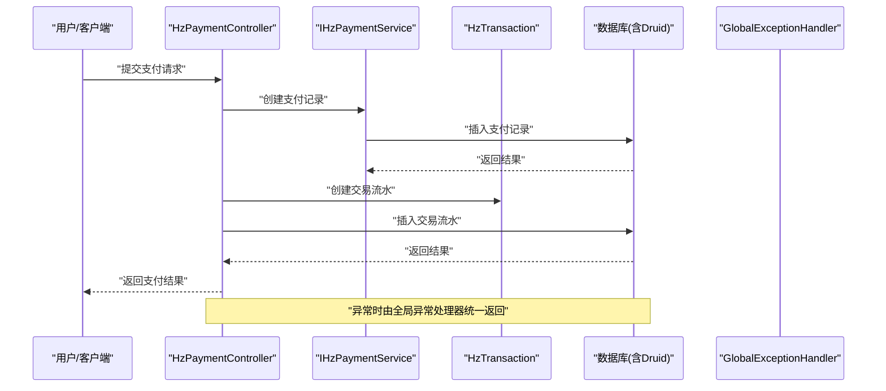
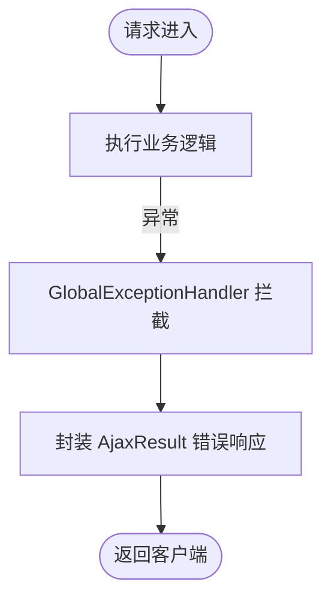
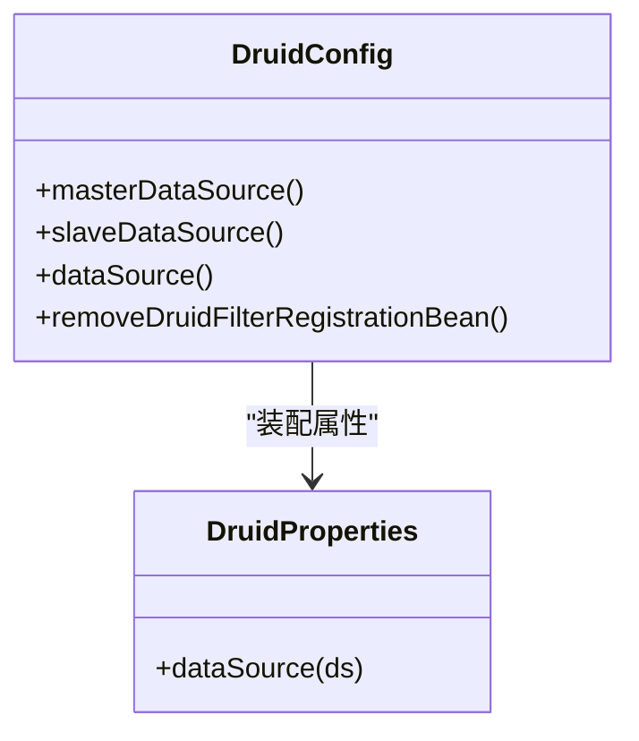
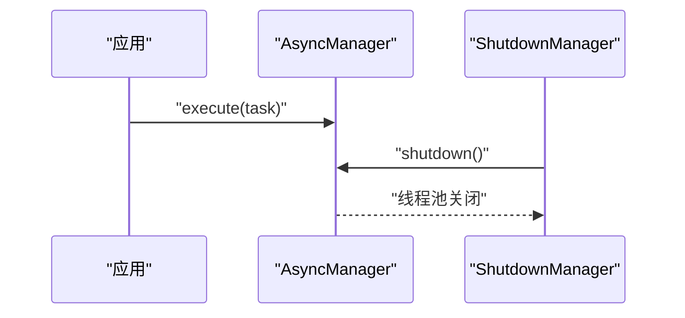
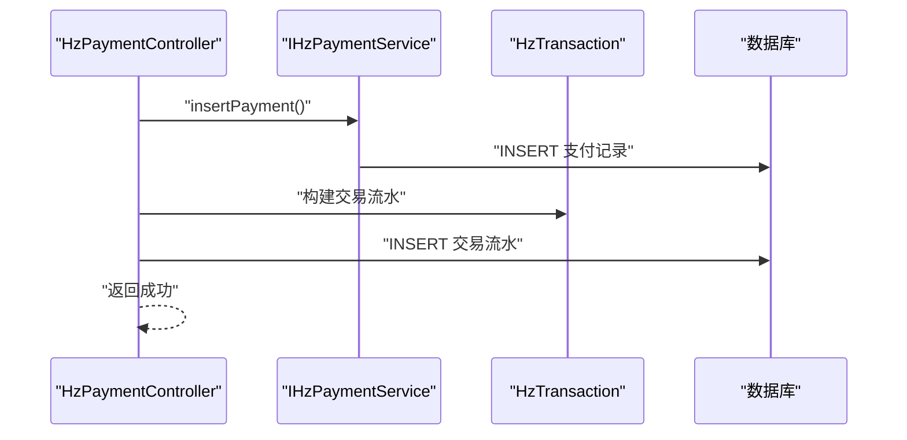
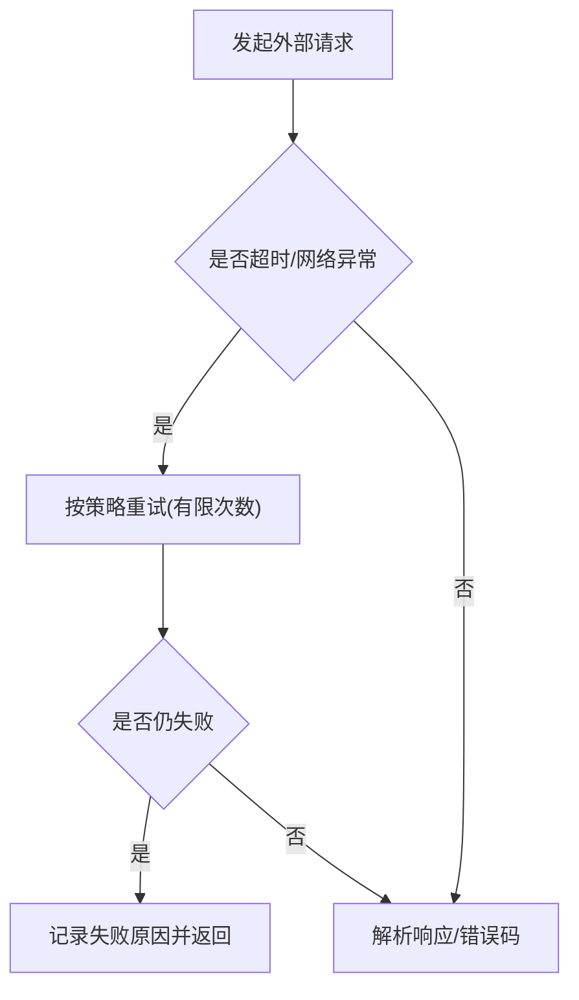
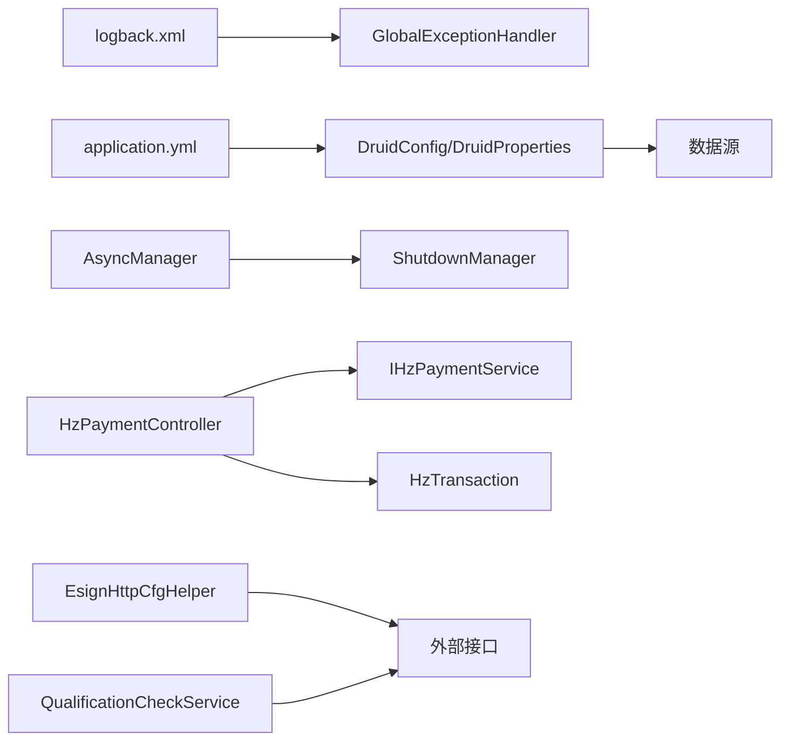

# 故障排查指南

<cite>
**本文引用的文件**
- [ruoyi-admin/src/main/resources/logback.xml](file://ruoyi-admin/src/main/resources/logback.xml)
- [ruoyi-admin/src/main/resources/application.yml](file://ruoyi-admin/src/main/resources/application.yml)
- [ruoyi-framework/src/main/java/com/ruoyi/framework/web/exception/GlobalExceptionHandler.java](file://ruoyi-framework/src/main/java/com/ruoyi/framework/web/exception/GlobalExceptionHandler.java)
- [ruoyi-common/src/main/java/com/ruoyi/common/exception/GlobalException.java](file://ruoyi-common/src/main/java/com/ruoyi/common/exception/GlobalException.java)
- [ruoyi-framework/src/main/java/com/ruoyi/framework/config/DruidConfig.java](file://ruoyi-framework/src/main/java/com/ruoyi/framework/config/DruidConfig.java)
- [ruoyi-framework/src/main/java/com/ruoyi/framework/config/properties/DruidProperties.java](file://ruoyi-framework/src/main/java/com/ruoyi/framework/config/properties/DruidProperties.java)
- [ruoyi-framework/src/main/java/com/ruoyi/framework/manager/AsyncManager.java](file://ruoyi-framework/src/main/java/com/ruoyi/framework/manager/AsyncManager.java)
- [ruoyi-framework/src/main/java/com/ruoyi/framework/manager/ShutdownManager.java](file://ruoyi-framework/src/main/java/com/ruoyi/framework/manager/ShutdownManager.java)
- [ruoyi-common/src/main/java/com/ruoyi/common/utils/Threads.java](file://ruoyi-common/src/main/java/com/ruoyi/common/utils/Threads.java)
- [ruoyi-system/src/main/java/com/ruoyi/system/service/IHzPaymentService.java](file://ruoyi-system/src/main/java/com/ruoyi/system/service/IHzPaymentService.java)
- [ruoyi-admin/src/main/java/com/ruoyi/web/controller/h5/HzPaymentController.java](file://ruoyi-admin/src/main/java/com/ruoyi/web/controller/h5/HzPaymentController.java)
- [ruoyi-system/src/main/java/com/ruoyi/system/domain/HzTransaction.java](file://ruoyi-system/src/main/java/com/ruoyi/system/domain/HzTransaction.java)
- [ruoyi-system/src/main/java/com/ruoyi/system/esign/EsignHttpCfgHelper.java](file://ruoyi-system/src/main/java/com/ruoyi/system/esign/EsignHttpCfgHelper.java)
- [ruoyi-system/src/main/java/com/ruoyi/system/gov/service/QualificationCheckService.java](file://ruoyi-system/src/main/java/com/ruoyi/system/gov/service/QualificationCheckService.java)
- [ghz-gov-proxy/deploy/README.md](file://ghz-gov-proxy/deploy/README.md)
- [ghz-gov-proxy/deploy/港好住后端对接指南.md](file://ghz-gov-proxy/deploy/港好住后端对接指南.md)
- [ghz-gov-proxy/deploy/start.sh](file://ghz-gov-proxy/deploy/start.sh)
- [ghz-gov-proxy/src/main/java/com/ghz/gov/GovProxyApplication.java](file://ghz-gov-proxy/src/main/java/com/ghz/gov/GovProxyApplication.java)
</cite>

## 目录
1. [简介](#简介)
2. [项目结构](#项目结构)
3. [核心组件](#核心组件)
4. [架构总览](#架构总览)
5. [详细组件分析](#详细组件分析)
6. [依赖关系分析](#依赖关系分析)
7. [性能考量](#性能考量)
8. [故障排查指南](#故障排查指南)
9. [结论](#结论)
10. [附录](#附录)

## 简介
本指南面向港好住信息系统运维与开发人员，提供一套系统化的故障分类与排查流程，覆盖系统故障、业务故障、网络故障、数据故障等场景，并结合代码库中的日志配置、异常处理、数据库连接池、异步任务与关闭流程、支付与电子签等关键模块，给出可落地的定位方法、日志分析技巧、应急响应机制与预防性监控建议。

## 项目结构
系统采用前后端分离与多模块划分：后端基于 Spring Boot 与 RuoYi 框架，前端包含 Vue 管理后台与 H5 客户端；支付、电子签章、政务接口代理等通过独立模块与配置文件支撑。

**图表来源**
- [ruoyi-admin/src/main/resources/application.yml:1-238](file://ruoyi-admin/src/main/resources/application.yml#L1-L238)
- [ghz-gov-proxy/src/main/java/com/ghz/gov/GovProxyApplication.java:1-15](file://ghz-gov-proxy/src/main/java/com/ghz/gov/GovProxyApplication.java#L1-L15)

**章节来源**
- [ruoyi-admin/src/main/resources/application.yml:1-238](file://ruoyi-admin/src/main/resources/application.yml#L1-L238)
- [ghz-gov-proxy/src/main/java/com/ghz/gov/GovProxyApplication.java:1-15](file://ghz-gov-proxy/src/main/java/com/ghz/gov/GovProxyApplication.java#L1-L15)

## 核心组件
- 日志与异常处理：统一日志输出与全局异常捕获，便于快速定位错误来源与上下文。
- 数据库连接池：Druid 多数据源配置与属性定制，支撑读写分离与性能调优。
- 异步任务与优雅停机：异步任务调度与退出时线程池安全关闭，降低停机风险。
- 支付与交易：支付记录与交易流水模型及控制器，支撑支付流程闭环。
- 电子签与政务接口：HTTP 客户端重试策略与超时控制，保障外部接口稳定性。

**章节来源**
- [ruoyi-admin/src/main/resources/logback.xml:1-93](file://ruoyi-admin/src/main/resources/logback.xml#L1-L93)
- [ruoyi-framework/src/main/java/com/ruoyi/framework/web/exception/GlobalExceptionHandler.java:1-146](file://ruoyi-framework/src/main/java/com/ruoyi/framework/web/exception/GlobalExceptionHandler.java#L1-L146)
- [ruoyi-framework/src/main/java/com/ruoyi/framework/config/DruidConfig.java:1-127](file://ruoyi-framework/src/main/java/com/ruoyi/framework/config/DruidConfig.java#L1-L127)
- [ruoyi-framework/src/main/java/com/ruoyi/framework/manager/AsyncManager.java:1-56](file://ruoyi-framework/src/main/java/com/ruoyi/framework/manager/AsyncManager.java#L1-L56)
- [ruoyi-framework/src/main/java/com/ruoyi/framework/manager/ShutdownManager.java:1-40](file://ruoyi-framework/src/main/java/com/ruoyi/framework/manager/ShutdownManager.java#L1-L40)
- [ruoyi-system/src/main/java/com/ruoyi/system/service/IHzPaymentService.java:1-89](file://ruoyi-system/src/main/java/com/ruoyi/system/service/IHzPaymentService.java#L1-L89)
- [ruoyi-admin/src/main/java/com/ruoyi/web/controller/h5/HzPaymentController.java:79-132](file://ruoyi-admin/src/main/java/com/ruoyi/web/controller/h5/HzPaymentController.java#L79-L132)
- [ruoyi-system/src/main/java/com/ruoyi/system/esign/EsignHttpCfgHelper.java:208-224](file://ruoyi-system/src/main/java/com/ruoyi/system/esign/EsignHttpCfgHelper.java#L208-L224)

## 架构总览
系统运行时涉及日志采集、异常拦截、数据库访问、外部接口调用与支付/电子签处理。以下图展示关键交互路径与故障易发点。

**图表来源**
- [ruoyi-admin/src/main/java/com/ruoyi/web/controller/h5/HzPaymentController.java:79-132](file://ruoyi-admin/src/main/java/com/ruoyi/web/controller/h5/HzPaymentController.java#L79-L132)
- [ruoyi-system/src/main/java/com/ruoyi/system/service/IHzPaymentService.java:1-89](file://ruoyi-system/src/main/java/com/ruoyi/system/service/IHzPaymentService.java#L1-L89)
- [ruoyi-system/src/main/java/com/ruoyi/system/domain/HzTransaction.java:166-201](file://ruoyi-system/src/main/java/com/ruoyi/system/domain/HzTransaction.java#L166-L201)
- [ruoyi-framework/src/main/java/com/ruoyi/framework/web/exception/GlobalExceptionHandler.java:1-146](file://ruoyi-framework/src/main/java/com/ruoyi/framework/web/exception/GlobalExceptionHandler.java#L1-L146)

## 详细组件分析

### 组件一：日志与异常处理
- 日志配置：控制台与滚动文件输出，区分 info/error 与用户行为日志，便于按级别检索。
- 全局异常：统一拦截权限不足、请求方式不支持、参数不匹配、业务异常、运行时异常等，保证对外一致的错误语义。
- 全局异常类：提供 detailMessage 字段用于补充内部诊断信息。

**图表来源**
- [ruoyi-admin/src/main/resources/logback.xml:1-93](file://ruoyi-admin/src/main/resources/logback.xml#L1-L93)
- [ruoyi-framework/src/main/java/com/ruoyi/framework/web/exception/GlobalExceptionHandler.java:1-146](file://ruoyi-framework/src/main/java/com/ruoyi/framework/web/exception/GlobalExceptionHandler.java#L1-L146)
- [ruoyi-common/src/main/java/com/ruoyi/common/exception/GlobalException.java:1-58](file://ruoyi-common/src/main/java/com/ruoyi/common/exception/GlobalException.java#L1-L58)

**章节来源**
- [ruoyi-admin/src/main/resources/logback.xml:1-93](file://ruoyi-admin/src/main/resources/logback.xml#L1-L93)
- [ruoyi-framework/src/main/java/com/ruoyi/framework/web/exception/GlobalExceptionHandler.java:1-146](file://ruoyi-framework/src/main/java/com/ruoyi/framework/web/exception/GlobalExceptionHandler.java#L1-L146)
- [ruoyi-common/src/main/java/com/ruoyi/common/exception/GlobalException.java:1-58](file://ruoyi-common/src/main/java/com/ruoyi/common/exception/GlobalException.java#L1-L58)

### 组件二：数据库连接池与数据源
- 多数据源：主从配置与动态切换，支持条件启用从库。
- 属性定制：初始/最大/最小连接数、连接超时、Socket 超时、空闲回收周期等。
- 广告移除：监控页面底部广告过滤，便于内网监控。

**图表来源**
- [ruoyi-framework/src/main/java/com/ruoyi/framework/config/DruidConfig.java:1-127](file://ruoyi-framework/src/main/java/com/ruoyi/framework/config/DruidConfig.java#L1-L127)
- [ruoyi-framework/src/main/java/com/ruoyi/framework/config/properties/DruidProperties.java:51-75](file://ruoyi-framework/src/main/java/com/ruoyi/framework/config/properties/DruidProperties.java#L51-L75)

**章节来源**
- [ruoyi-framework/src/main/java/com/ruoyi/framework/config/DruidConfig.java:1-127](file://ruoyi-framework/src/main/java/com/ruoyi/framework/config/DruidConfig.java#L1-L127)
- [ruoyi-framework/src/main/java/com/ruoyi/framework/config/properties/DruidProperties.java:51-75](file://ruoyi-framework/src/main/java/com/ruoyi/framework/config/properties/DruidProperties.java#L51-L75)

### 组件三：异步任务与优雅停机
- 异步任务：统一调度器延迟执行任务，避免高频操作抖动。
- 优雅停机：应用销毁前关闭异步线程池，防止任务丢失与资源泄漏。

**图表来源**
- [ruoyi-framework/src/main/java/com/ruoyi/framework/manager/AsyncManager.java:1-56](file://ruoyi-framework/src/main/java/com/ruoyi/framework/manager/AsyncManager.java#L1-L56)
- [ruoyi-framework/src/main/java/com/ruoyi/framework/manager/ShutdownManager.java:1-40](file://ruoyi-framework/src/main/java/com/ruoyi/framework/manager/ShutdownManager.java#L1-L40)
- [ruoyi-common/src/main/java/com/ruoyi/common/utils/Threads.java:42-64](file://ruoyi-common/src/main/java/com/ruoyi/common/utils/Threads.java#L42-L64)

**章节来源**
- [ruoyi-framework/src/main/java/com/ruoyi/framework/manager/AsyncManager.java:1-56](file://ruoyi-framework/src/main/java/com/ruoyi/framework/manager/AsyncManager.java#L1-L56)
- [ruoyi-framework/src/main/java/com/ruoyi/framework/manager/ShutdownManager.java:1-40](file://ruoyi-framework/src/main/java/com/ruoyi/framework/manager/ShutdownManager.java#L1-L40)
- [ruoyi-common/src/main/java/com/ruoyi/common/utils/Threads.java:1-100](file://ruoyi-common/src/main/java/com/ruoyi/common/utils/Threads.java#L1-L100)

### 组件四：支付与交易流水
- 支付记录：提供查询、分页、新增、更新、状态变更等接口。
- 控制器：创建支付记录与交易流水，回调更新支付状态并联动账单状态。
- 交易模型：包含第三方流水号、支付渠道、失败原因等字段，便于审计与重试。

**图表来源**
- [ruoyi-admin/src/main/java/com/ruoyi/web/controller/h5/HzPaymentController.java:79-132](file://ruoyi-admin/src/main/java/com/ruoyi/web/controller/h5/HzPaymentController.java#L79-L132)
- [ruoyi-system/src/main/java/com/ruoyi/system/service/IHzPaymentService.java:1-89](file://ruoyi-system/src/main/java/com/ruoyi/system/service/IHzPaymentService.java#L1-L89)
- [ruoyi-system/src/main/java/com/ruoyi/system/domain/HzTransaction.java:166-201](file://ruoyi-system/src/main/java/com/ruoyi/system/domain/HzTransaction.java#L166-L201)

**章节来源**
- [ruoyi-admin/src/main/java/com/ruoyi/web/controller/h5/HzPaymentController.java:79-132](file://ruoyi-admin/src/main/java/com/ruoyi/web/controller/h5/HzPaymentController.java#L79-L132)
- [ruoyi-system/src/main/java/com/ruoyi/system/service/IHzPaymentService.java:1-89](file://ruoyi-system/src/main/java/com/ruoyi/system/service/IHzPaymentService.java#L1-L89)
- [ruoyi-system/src/main/java/com/ruoyi/system/domain/HzTransaction.java:166-201](file://ruoyi-system/src/main/java/com/ruoyi/system/domain/HzTransaction.java#L166-L201)

### 组件五：电子签与政务接口
- 电子签 HTTP 配置：针对无响应、SSL 握手、IO 中断等异常设置有限次重试策略。
- 政务资格校验：对各接口设置超时等待，避免长时间阻塞；聚合失败原因并截断过长描述。
- 政务代理：提供健康检查、业务测试与故障排查清单，明确不同层级的可能原因与排查方向。

**图表来源**
- [ruoyi-system/src/main/java/com/ruoyi/system/esign/EsignHttpCfgHelper.java:208-224](file://ruoyi-system/src/main/java/com/ruoyi/system/esign/EsignHttpCfgHelper.java#L208-L224)
- [ruoyi-system/src/main/java/com/ruoyi/system/gov/service/QualificationCheckService.java:516-546](file://ruoyi-system/src/main/java/com/ruoyi/system/gov/service/QualificationCheckService.java#L516-L546)
- [ghz-gov-proxy/deploy/README.md:154-165](file://ghz-gov-proxy/deploy/README.md#L154-L165)

**章节来源**
- [ruoyi-system/src/main/java/com/ruoyi/system/esign/EsignHttpCfgHelper.java:208-224](file://ruoyi-system/src/main/java/com/ruoyi/system/esign/EsignHttpCfgHelper.java#L208-L224)
- [ruoyi-system/src/main/java/com/ruoyi/system/gov/service/QualificationCheckService.java:516-546](file://ruoyi-system/src/main/java/com/ruoyi/system/gov/service/QualificationCheckService.java#L516-L546)
- [ghz-gov-proxy/deploy/README.md:154-165](file://ghz-gov-proxy/deploy/README.md#L154-L165)

## 依赖关系分析
- 日志与异常：全局异常处理器依赖日志框架与统一响应体，日志配置决定可观测性粒度。
- 数据库：DruidConfig 与 DruidProperties 共同决定连接池行为，直接影响数据库访问稳定性。
- 异步与停机：AsyncManager 与 ShutdownManager 依赖线程池与 Spring 生命周期钩子。
- 支付与交易：控制器依赖服务接口与领域模型，最终落库于数据库。
- 外部接口：电子签与政务接口依赖 HTTP 客户端配置与超时策略。

**图表来源**
- [ruoyi-admin/src/main/resources/logback.xml:1-93](file://ruoyi-admin/src/main/resources/logback.xml#L1-L93)
- [ruoyi-framework/src/main/java/com/ruoyi/framework/web/exception/GlobalExceptionHandler.java:1-146](file://ruoyi-framework/src/main/java/com/ruoyi/framework/web/exception/GlobalExceptionHandler.java#L1-L146)
- [ruoyi-admin/src/main/resources/application.yml:1-238](file://ruoyi-admin/src/main/resources/application.yml#L1-L238)
- [ruoyi-framework/src/main/java/com/ruoyi/framework/config/DruidConfig.java:1-127](file://ruoyi-framework/src/main/java/com/ruoyi/framework/config/DruidConfig.java#L1-L127)
- [ruoyi-framework/src/main/java/com/ruoyi/framework/config/properties/DruidProperties.java:51-75](file://ruoyi-framework/src/main/java/com/ruoyi/framework/config/properties/DruidProperties.java#L51-L75)
- [ruoyi-framework/src/main/java/com/ruoyi/framework/manager/AsyncManager.java:1-56](file://ruoyi-framework/src/main/java/com/ruoyi/framework/manager/AsyncManager.java#L1-L56)
- [ruoyi-framework/src/main/java/com/ruoyi/framework/manager/ShutdownManager.java:1-40](file://ruoyi-framework/src/main/java/com/ruoyi/framework/manager/ShutdownManager.java#L1-L40)
- [ruoyi-admin/src/main/java/com/ruoyi/web/controller/h5/HzPaymentController.java:79-132](file://ruoyi-admin/src/main/java/com/ruoyi/web/controller/h5/HzPaymentController.java#L79-L132)
- [ruoyi-system/src/main/java/com/ruoyi/system/service/IHzPaymentService.java:1-89](file://ruoyi-system/src/main/java/com/ruoyi/system/service/IHzPaymentService.java#L1-L89)
- [ruoyi-system/src/main/java/com/ruoyi/system/domain/HzTransaction.java:166-201](file://ruoyi-system/src/main/java/com/ruoyi/system/domain/HzTransaction.java#L166-L201)
- [ruoyi-system/src/main/java/com/ruoyi/system/esign/EsignHttpCfgHelper.java:208-224](file://ruoyi-system/src/main/java/com/ruoyi/system/esign/EsignHttpCfgHelper.java#L208-L224)
- [ruoyi-system/src/main/java/com/ruoyi/system/gov/service/QualificationCheckService.java:516-546](file://ruoyi-system/src/main/java/com/ruoyi/system/gov/service/QualificationCheckService.java#L516-L546)

## 性能考量
- 连接池参数：合理设置初始/最大/最小连接数、最大等待时间、连接与 Socket 超时，避免“连接饥饿”与“超时风暴”。
- 异步延迟：异步任务调度器延迟执行可平滑突发流量，减少瞬时压力。
- 优雅停机：停机前主动关闭线程池，确保未完成任务得到妥善处理。
- 外部接口：对无响应类异常进行有限次重试，避免雪崩式失败。

**章节来源**
- [ruoyi-framework/src/main/java/com/ruoyi/framework/config/properties/DruidProperties.java:51-75](file://ruoyi-framework/src/main/java/com/ruoyi/framework/config/properties/DruidProperties.java#L51-L75)
- [ruoyi-framework/src/main/java/com/ruoyi/framework/manager/AsyncManager.java:1-56](file://ruoyi-framework/src/main/java/com/ruoyi/framework/manager/AsyncManager.java#L1-L56)
- [ruoyi-common/src/main/java/com/ruoyi/common/utils/Threads.java:42-64](file://ruoyi-common/src/main/java/com/ruoyi/common/utils/Threads.java#L42-L64)
- [ruoyi-system/src/main/java/com/ruoyi/system/esign/EsignHttpCfgHelper.java:208-224](file://ruoyi-system/src/main/java/com/ruoyi/system/esign/EsignHttpCfgHelper.java#L208-L224)

## 故障排查指南

### 一、故障分类与识别
- 系统故障：服务无法启动、端口占用、线程池异常、优雅停机失败。
- 业务故障：支付失败、账单状态不一致、交易流水缺失、电子签回调异常。
- 网络故障：外部接口超时/无响应、API Key 错误、NAT/防火墙导致连通性问题。
- 数据故障：数据库连接异常、事务未提交、主从不同步、连接池耗尽。

**章节来源**
- [ghz-gov-proxy/deploy/README.md:154-165](file://ghz-gov-proxy/deploy/README.md#L154-L165)
- [ghz-gov-proxy/deploy/港好住后端对接指南.md:497-528](file://ghz-gov-proxy/deploy/港好住后端对接指南.md#L497-L528)

### 二、常见故障与排查思路
- 服务启动失败
  - 现象：进程未就绪、健康检查失败。
  - 排查：查看启动脚本日志与 PID 文件，确认 JVM 参数与配置文件路径正确。
  - 参考：[启动脚本:1-46](file://ghz-gov-proxy/deploy/start.sh#L1-L46)，[应用入口:1-15](file://ghz-gov-proxy/src/main/java/com/ghz/gov/GovProxyApplication.java#L1-L15)。

- 数据库连接异常
  - 现象：SQL 执行超时、连接池耗尽、事务失败。
  - 排查：核对连接池参数、连接超时与 Socket 超时，检查主从配置与只读路由。
  - 参考：[Druid 配置:1-127](file://ruoyi-framework/src/main/java/com/ruoyi/framework/config/DruidConfig.java#L1-L127)，[Druid 属性:51-75](file://ruoyi-framework/src/main/java/com/ruoyi/framework/config/properties/DruidProperties.java#L51-L75)。

- 接口响应超时
  - 现象：外部接口慢、Nginx 超时、408/504。
  - 排查：确认上游超时阈值、网络连通性、API Key 有效性；对无响应类异常做有限重试。
  - 参考：[政务代理故障排查:154-165](file://ghz-gov-proxy/deploy/README.md#L154-L165)，[电子签重试策略:208-224](file://ruoyi-system/src/main/java/com/ruoyi/system/esign/EsignHttpCfgHelper.java#L208-L224)。

- 支付失败
  - 现象：支付记录创建失败、回调未更新、账单状态不一致。
  - 排查：检查支付控制器创建流程、交易流水插入、回调状态更新与账单联动逻辑。
  - 参考：[支付控制器:79-132](file://ruoyi-admin/src/main/java/com/ruoyi/web/controller/h5/HzPaymentController.java#L79-L132)，[支付服务接口:1-89](file://ruoyi-system/src/main/java/com/ruoyi/system/service/IHzPaymentService.java#L1-L89)，[交易模型:166-201](file://ruoyi-system/src/main/java/com/ruoyi/system/domain/HzTransaction.java#L166-L201)。

- 电子签回调异常
  - 现象：签署完成未回调、状态未更新。
  - 排查：检查回调地址配置、签名/证书路径、回调幂等与失败重试。
  - 参考：[电子签 HTTP 配置:208-224](file://ruoyi-system/src/main/java/com/ruoyi/system/esign/EsignHttpCfgHelper.java#L208-L224)。

- 政务接口失败
  - 现象：401、504、参数校验失败、超时。
  - 排查：核对 API Key、请求头、入参完整性；按业务码与错误码采取重试或修正。
  - 参考：[业务层错误码:497-528](file://ghz-gov-proxy/deploy/港好住后端对接指南.md#L497-L528)，[资格校验超时处理:516-546](file://ruoyi-system/src/main/java/com/ruoyi/system/gov/service/QualificationCheckService.java#L516-L546)。

### 三、标准化排查流程
- 问题定位
  - 明确故障范围（系统/业务/网络/数据）。
  - 快速复现与最小化现场。
- 日志分析
  - 查看系统日志与错误日志，定位异常栈与关键上下文。
  - 关注用户行为日志与业务日志，还原用户路径。
  - 参考：[日志配置:1-93](file://ruoyi-admin/src/main/resources/logback.xml#L1-L93)。
- 性能监控
  - 观察连接池指标、线程池状态、外部接口 RT/错误率。
  - 参考：[Druid 属性:51-75](file://ruoyi-framework/src/main/java/com/ruoyi/framework/config/properties/DruidProperties.java#L51-L75)，[异步任务:1-56](file://ruoyi-framework/src/main/java/com/ruoyi/framework/manager/AsyncManager.java#L1-L56)。
- 依赖检查
  - 核对数据库连接串、Redis、微信/电子签证书与回调地址。
  - 参考：[应用配置:1-238](file://ruoyi-admin/src/main/resources/application.yml#L1-L238)。
- 修复与验证
  - 小范围灰度验证，逐步扩大。
  - 记录变更与回滚预案。

### 四、日志分析方法
- 错误日志解读
  - 使用全局异常处理器输出的统一错误结构，快速识别异常类型与请求上下文。
  - 参考：[全局异常处理器:1-146](file://ruoyi-framework/src/main/java/com/ruoyi/framework/web/exception/GlobalExceptionHandler.java#L1-L146)。
- 性能日志分析
  - 关注慢查询、连接池等待时间、外部接口耗时分布。
  - 参考：[Druid 属性:51-75](file://ruoyi-framework/src/main/java/com/ruoyi/framework/config/properties/DruidProperties.java#L51-L75)。
- 业务日志追踪
  - 通过用户行为日志与关键业务节点日志串联用户路径，定位问题环节。
  - 参考：[日志配置:60-93](file://ruoyi-admin/src/main/resources/logback.xml#L60-L93)。

### 五、应急响应机制
- 故障上报
  - 明确分级标准（P0/P1/P2），填写故障工单，同步值班群。
- 处理流程
  - 快速隔离、回滚变更、恢复服务、根因分析、修复验证。
- 升级机制
  - 超出处理时限或影响范围扩大时，自动升级至更高级别响应。

### 六、故障预防与监控预警
- 连接池与线程池
  - 设定合理阈值与告警阈值，定期压测评估容量。
- 外部接口
  - 限流与熔断、超时与重试策略、健康检查与降级。
- 日志与可观测
  - 统一日志格式、关键链路埋点、错误率与 RT 告警。
- 配置治理
  - 通过环境变量与配置中心统一管理敏感配置，避免误配。

## 结论
通过统一的日志与异常处理、稳健的数据库连接池、规范的异步与停机流程、以及完善的支付与电子签链路，港好住信息系统具备了较强的故障定位与恢复能力。建议在现有基础上完善监控告警、自动化演练与应急预案，持续提升系统韧性与可维护性。

## 附录
- 常用排查命令与路径
  - 政务代理健康检查与业务测试：[参考:122-150](file://ghz-gov-proxy/deploy/README.md#L122-L150)
  - 政务代理启动脚本：[参考:1-46](file://ghz-gov-proxy/deploy/start.sh#L1-L46)
  - 政务代理错误码与重试策略：[参考:497-528](file://ghz-gov-proxy/deploy/港好住后端对接指南.md#L497-L528)
- 关键配置与参数
  - 应用端口、Tomcat 线程与文件上传大小：[参考:20-66](file://ruoyi-admin/src/main/resources/application.yml#L20-L66)
  - Redis 连接与超时：[参考:72-94](file://ruoyi-admin/src/main/resources/application.yml#L72-L94)
  - 日志级别与输出：[参考:37-42](file://ruoyi-admin/src/main/resources/application.yml#L37-L42)，[日志回滚配置:16-93](file://ruoyi-admin/src/main/resources/logback.xml#L16-L93)