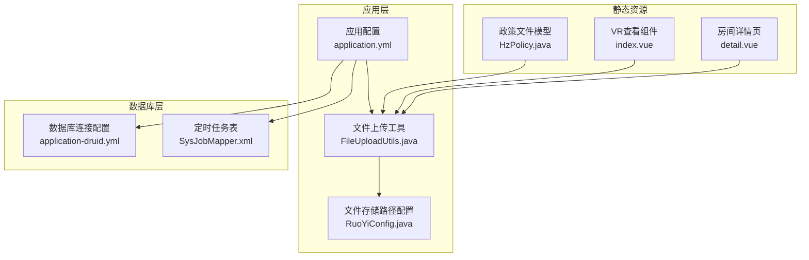
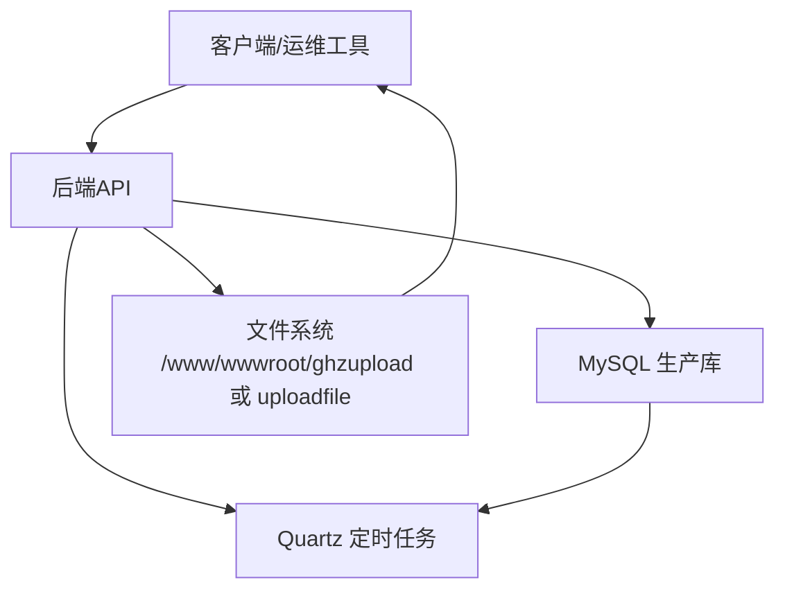
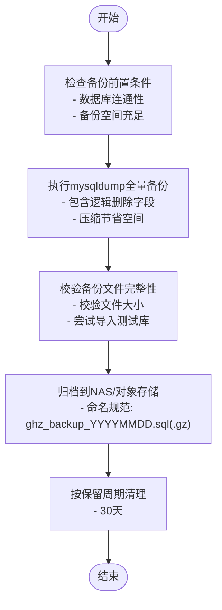
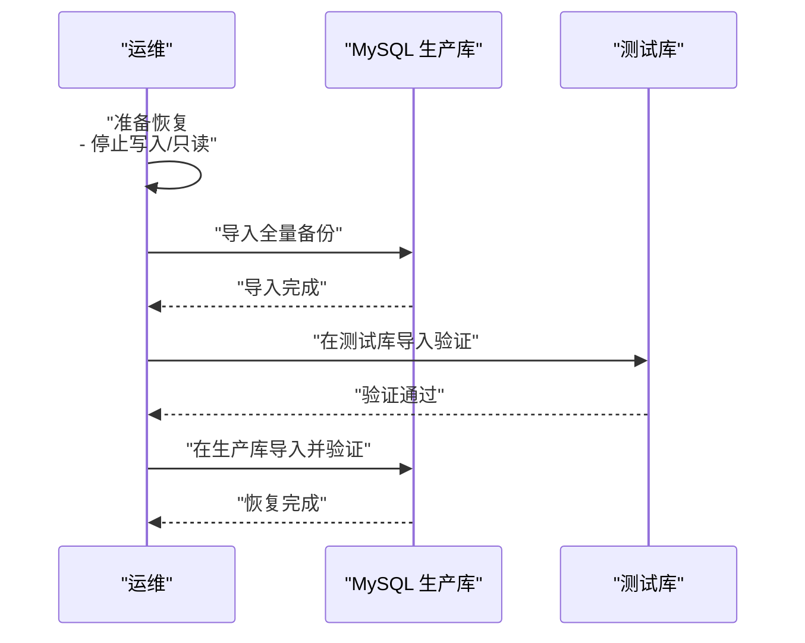
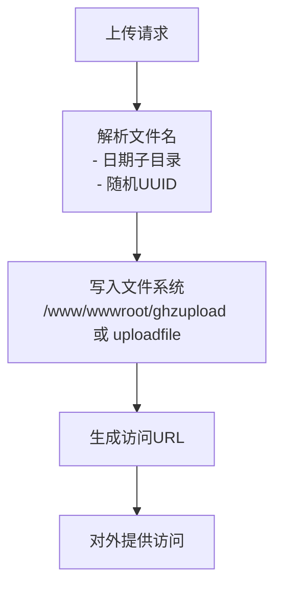
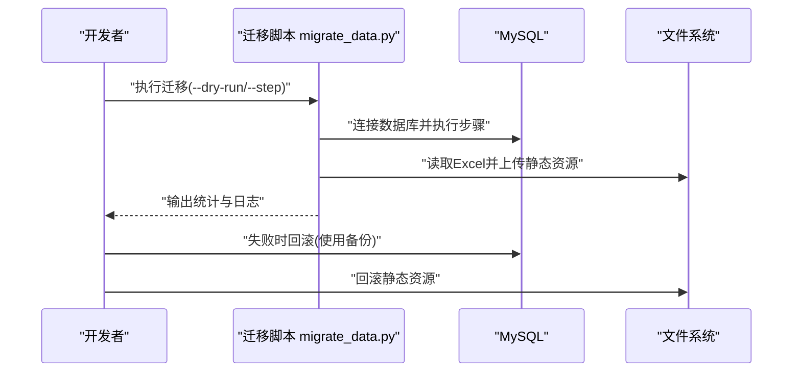
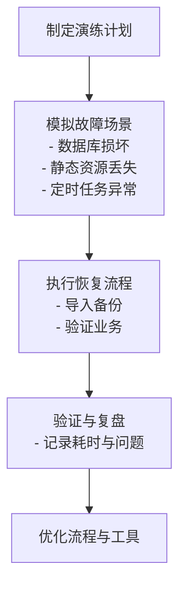
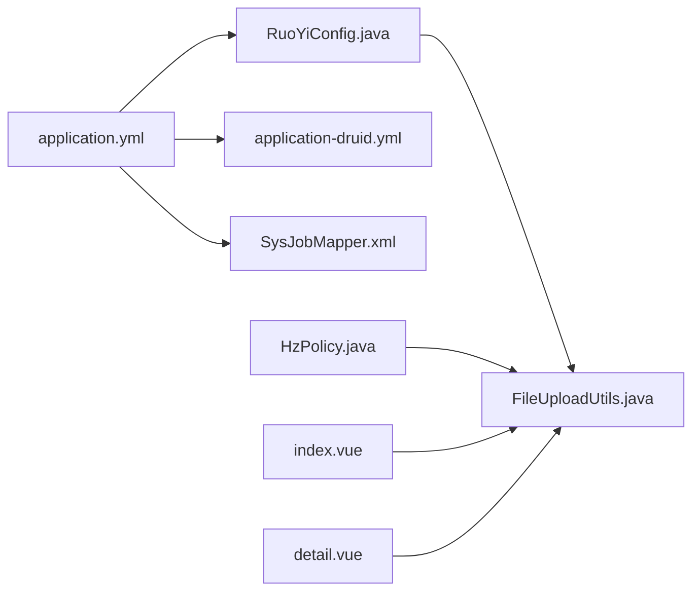

# 数据备份与恢复

<cite>
**本文引用的文件**
- [README_数据清理研究.md](file://README_数据清理研究.md)
- [数据迁移检查报告.md](file://数据迁移检查报告.md)
- [数据迁移问题清单.txt](file://数据迁移问题清单.txt)
- [migrate_data.py](file://migrate_data.py)
- [application.yml](file://ruoyi-admin/src/main/resources/application.yml)
- [application-druid.yml](file://ruoyi-admin/src/main/resources/application-druid.yml)
- [RuoYiConfig.java](file://ruoyi-common/src/main/java/com/ruoyi/common/config/RuoYiConfig.java)
- [FileUploadUtils.java](file://ruoyi-common/src/main/java/com/ruoyi/common/utils/file/FileUploadUtils.java)
- [logback.xml](file://ruoyi-admin/src/main/resources/logback.xml)
- [技术方案.html](file://技术方案.html)
- [HzPolicy.java](file://ruoyi-admin/src/main/java/com/ruoyi/gangzhu/policy/domain/HzPolicy.java)
- [09-消息通知.md](file://docs/数据字典/09-消息通知.md)
- [detail.vue](file://uniapp-h5/pages/room/detail.vue)
- [index.vue](file://ruoyi-ui/src/components/VrViewer/index.vue)
- [SysJobMapper.xml](file://ruoyi-quartz/src/main/resources/mapper/quartz/SysJobMapper.xml)
- [SysJobServiceImpl.java](file://ruoyi-quartz/src/main/java/com/ruoyi/quartz/service/impl/SysJobServiceImpl.java)
- [SysJob.java](file://ruoyi-quartz/src/main/java/com/ruoyi/quartz/domain/SysJob.java)
</cite>

## 目录
1. [简介](#简介)
2. [项目结构](#项目结构)
3. [核心组件](#核心组件)
4. [架构总览](#架构总览)
5. [详细组件分析](#详细组件分析)
6. [依赖分析](#依赖分析)
7. [性能考量](#性能考量)
8. [故障排查指南](#故障排查指南)
9. [结论](#结论)
10. [附录](#附录)

## 简介
本指南围绕“港好住信息系统”的数据备份与恢复，提供数据库与静态资源（图片、文档、VR）的备份策略、存储与命名规范、保留周期、恢复流程、迁移场景下的备份恢复最佳实践，以及备份恢复测试与故障演练方法。文档以仓库内现有脚本、配置与文档为依据，结合系统架构与数据模型，形成可落地的运维规范。

## 项目结构
- 后端服务配置与数据库连接
  - 应用配置文件定义上传路径、文件大小限制、逻辑删除字段等
  - 数据库连接配置指向远程生产库
- 文件上传与存储
  - 上传路径由配置决定，采用日期子目录+随机文件名策略
  - 支持图片、文档、VR等静态资源
- 定时任务与日志
  - Quartz定时任务用于周期性任务
  - 日志按天滚动，便于审计与问题定位

图表来源
- [application.yml:1-238](file://ruoyi-admin/src/main/resources/application.yml#L1-L238)
- [application-druid.yml:1-34](file://ruoyi-admin/src/main/resources/application-druid.yml#L1-L34)
- [RuoYiConfig.java:1-123](file://ruoyi-common/src/main/java/com/ruoyi/common/config/RuoYiConfig.java#L1-L123)
- [FileUploadUtils.java:1-169](file://ruoyi-common/src/main/java/com/ruoyi/common/utils/file/FileUploadUtils.java#L1-L169)
- [SysJobMapper.xml:1-111](file://ruoyi-quartz/src/main/resources/mapper/quartz/SysJobMapper.xml#L1-L111)
- [HzPolicy.java:126-184](file://ruoyi-admin/src/main/java/com/ruoyi/gangzhu/policy/domain/HzPolicy.java#L126-L184)
- [index.vue:1-207](file://ruoyi-ui/src/components/VrViewer/index.vue#L1-L207)
- [detail.vue:254-289](file://uniapp-h5/pages/room/detail.vue#L254-L289)

章节来源
- [application.yml:1-238](file://ruoyi-admin/src/main/resources/application.yml#L1-L238)
- [application-druid.yml:1-34](file://ruoyi-admin/src/main/resources/application-druid.yml#L1-L34)
- [RuoYiConfig.java:1-123](file://ruoyi-common/src/main/java/com/ruoyi/common/config/RuoYiConfig.java#L1-L123)
- [FileUploadUtils.java:1-169](file://ruoyi-common/src/main/java/com/ruoyi/common/utils/file/FileUploadUtils.java#L1-L169)
- [SysJobMapper.xml:1-111](file://ruoyi-quartz/src/main/resources/mapper/quartz/SysJobMapper.xml#L1-L111)
- [HzPolicy.java:126-184](file://ruoyi-admin/src/main/java/com/ruoyi/gangzhu/policy/domain/HzPolicy.java#L126-L184)
- [index.vue:1-207](file://ruoyi-ui/src/components/VrViewer/index.vue#L1-L207)
- [detail.vue:254-289](file://uniapp-h5/pages/room/detail.vue#L254-L289)

## 核心组件
- 数据库备份与恢复
  - 使用mysqldump进行全量备份，恢复通过导入SQL文件实现
  - 生产库连接信息与凭据在配置文件中定义
- 文件存储备份
  - 上传路径由配置决定，采用日期子目录+随机文件名策略
  - 政策文件URL字段用于记录静态资源路径
- 定时任务与日志
  - Quartz定时任务表与服务初始化逻辑
  - 日志按天滚动，便于审计与问题定位

章节来源
- [README_数据清理研究.md:155-243](file://README_数据清理研究.md#L155-L243)
- [application-druid.yml:12-14](file://ruoyi-admin/src/main/resources/application-druid.yml#L12-L14)
- [application.yml:10-12](file://ruoyi-admin/src/main/resources/application.yml#L10-L12)
- [SysJobServiceImpl.java:37-46](file://ruoyi-quartz/src/main/java/com/ruoyi/quartz/service/impl/SysJobServiceImpl.java#L37-L46)
- [logback.xml:40-77](file://ruoyi-admin/src/main/resources/logback.xml#L40-L77)

## 架构总览
系统采用后端Spring Boot + MySQL + Quartz + 前端Vue/UniApp的典型架构。静态资源上传至本地目录，通过配置的profile路径对外提供访问。数据库通过Druid连接池连接远程生产库，支持逻辑删除与定时任务。

图表来源
- [application.yml:10-12](file://ruoyi-admin/src/main/resources/application.yml#L10-L12)
- [application-druid.yml:12-14](file://ruoyi-admin/src/main/resources/application-druid.yml#L12-L14)
- [SysJobMapper.xml:1-111](file://ruoyi-quartz/src/main/resources/mapper/quartz/SysJobMapper.xml#L1-L111)

## 详细组件分析

### 数据库备份策略
- 全量备份
  - 使用mysqldump导出数据库，备份文件命名包含日期
  - 建议在业务低峰期执行，确保一致性
- 增量备份
  - 仓库未提供现成的增量备份方案，可在生产环境中引入binlog归档与时间点恢复（PITR）策略
- 定时备份
  - 建议在生产环境配置定时任务，每日凌晨执行全量备份
- 备份保留周期
  - 建议按30天保留，超过周期自动清理
- 备份存储位置
  - 建议将备份文件存放于独立的NAS或对象存储，避免与应用同盘

图表来源
- [README_数据清理研究.md:155-243](file://README_数据清理研究.md#L155-L243)
- [技术方案.html:1937-1943](file://技术方案.html#L1937-L1943)

章节来源
- [README_数据清理研究.md:155-243](file://README_数据清理研究.md#L155-L243)
- [技术方案.html:1937-1943](file://技术方案.html#L1937-L1943)

### 数据库恢复流程
- 恢复前准备
  - 停止应用写入，必要时降级或只读
  - 备份当前数据库（可选，但强烈建议）
  - 确认恢复目标数据库版本兼容
- 恢复操作步骤
  - 选择最近一次成功的全量备份
  - 在测试库验证导入成功且数据一致
  - 在生产库执行导入（注意锁表与事务边界）
- 恢复验证
  - 校验关键表记录数与关键字段
  - 验证业务流程（登录、列表、详情、支付等）

图表来源
- [README_数据清理研究.md:233-243](file://README_数据清理研究.md#L233-L243)

章节来源
- [README_数据清理研究.md:233-243](file://README_数据清理研究.md#L233-L243)

### 文件存储备份策略
- 存储位置
  - 上传路径由配置文件定义，支持本地目录或外部挂载
- 命名规范
  - 采用“日期子目录 + 随机文件名 + 原扩展名”策略
- 保留周期
  - 建议与数据库备份保持一致（30天）
- 备份方案
  - 建议使用rsync/快照/对象存储进行定期备份
  - 对VR全景图等大文件，建议单独压缩归档

图表来源
- [application.yml:10-12](file://ruoyi-admin/src/main/resources/application.yml#L10-L12)
- [FileUploadUtils.java:144-155](file://ruoyi-common/src/main/java/com/ruoyi/common/utils/file/FileUploadUtils.java#L144-L155)

章节来源
- [application.yml:10-12](file://ruoyi-admin/src/main/resources/application.yml#L10-L12)
- [FileUploadUtils.java:144-155](file://ruoyi-common/src/main/java/com/ruoyi/common/utils/file/FileUploadUtils.java#L144-L155)

### 数据迁移场景下的备份恢复
- 迁移前备份
  - 执行数据库全量备份
  - 备份静态资源目录
- 迁移脚本与断点续传
  - 迁移脚本支持dry-run、step、from-step等参数
  - ID映射器支持保存/加载映射文件，便于断点续传
- 恢复策略
  - 若迁移失败，使用备份快速回滚
  - 对静态资源，可单独回滚到上一版本

图表来源
- [migrate_data.py:1-200](file://migrate_data.py#L1-L200)
- [migrate_data.py:1882-1913](file://migrate_data.py#L1882-L1913)
- [数据迁移检查报告.md:1-393](file://数据迁移检查报告.md#L1-L393)
- [数据迁移问题清单.txt:1-205](file://数据迁移问题清单.txt#L1-L205)

章节来源
- [migrate_data.py:1-200](file://migrate_data.py#L1-L200)
- [migrate_data.py:1882-1913](file://migrate_data.py#L1882-L1913)
- [数据迁移检查报告.md:1-393](file://数据迁移检查报告.md#L1-L393)
- [数据迁移问题清单.txt:1-205](file://数据迁移问题清单.txt#L1-L205)

### 备份恢复测试与故障演练
- 测试验证
  - 在测试库执行备份导入与业务验证
  - 验证逻辑删除字段与外键关系
- 故障模拟
  - 模拟数据库损坏、静态资源丢失、定时任务异常
  - 验证恢复流程与SLA
- 日志与审计
  - 使用按天滚动的日志定位问题
  - 定时任务状态与执行记录用于审计

图表来源
- [logback.xml:40-77](file://ruoyi-admin/src/main/resources/logback.xml#L40-L77)
- [SysJobServiceImpl.java:37-46](file://ruoyi-quartz/src/main/java/com/ruoyi/quartz/service/impl/SysJobServiceImpl.java#L37-L46)

章节来源
- [logback.xml:40-77](file://ruoyi-admin/src/main/resources/logback.xml#L40-L77)
- [SysJobServiceImpl.java:37-46](file://ruoyi-quartz/src/main/java/com/ruoyi/quartz/service/impl/SysJobServiceImpl.java#L37-L46)

## 依赖分析
- 应用配置依赖
  - 上传路径依赖RuoYiConfig
  - 文件上传工具依赖上传路径与MIME类型
- 数据库依赖
  - 数据库连接配置指向远程生产库
  - 定时任务依赖Quartz表结构与初始化
- 静态资源依赖
  - 政策文件URL字段与VR查看组件依赖上传路径

图表来源
- [application.yml:10-12](file://ruoyi-admin/src/main/resources/application.yml#L10-L12)
- [RuoYiConfig.java:63-121](file://ruoyi-common/src/main/java/com/ruoyi/common/config/RuoYiConfig.java#L63-L121)
- [FileUploadUtils.java:1-169](file://ruoyi-common/src/main/java/com/ruoyi/common/utils/file/FileUploadUtils.java#L1-L169)
- [application-druid.yml:12-14](file://ruoyi-admin/src/main/resources/application-druid.yml#L12-L14)
- [SysJobMapper.xml:1-111](file://ruoyi-quartz/src/main/resources/mapper/quartz/SysJobMapper.xml#L1-L111)
- [HzPolicy.java:126-184](file://ruoyi-admin/src/main/java/com/ruoyi/gangzhu/policy/domain/HzPolicy.java#L126-L184)
- [index.vue:1-207](file://ruoyi-ui/src/components/VrViewer/index.vue#L1-L207)
- [detail.vue:254-289](file://uniapp-h5/pages/room/detail.vue#L254-L289)

章节来源
- [application.yml:10-12](file://ruoyi-admin/src/main/resources/application.yml#L10-L12)
- [RuoYiConfig.java:63-121](file://ruoyi-common/src/main/java/com/ruoyi/common/config/RuoYiConfig.java#L63-L121)
- [FileUploadUtils.java:1-169](file://ruoyi-common/src/main/java/com/ruoyi/common/utils/file/FileUploadUtils.java#L1-L169)
- [application-druid.yml:12-14](file://ruoyi-admin/src/main/resources/application-druid.yml#L12-L14)
- [SysJobMapper.xml:1-111](file://ruoyi-quartz/src/main/resources/mapper/quartz/SysJobMapper.xml#L1-L111)
- [HzPolicy.java:126-184](file://ruoyi-admin/src/main/java/com/ruoyi/gangzhu/policy/domain/HzPolicy.java#L126-L184)
- [index.vue:1-207](file://ruoyi-ui/src/components/VrViewer/index.vue#L1-L207)
- [detail.vue:254-289](file://uniapp-h5/pages/room/detail.vue#L254-L289)

## 性能考量
- 备份性能
  - 全量备份建议在业务低峰期执行
  - 对大表可考虑分区或分批导出
- 恢复性能
  - 恢复前先在测试库验证导入速度
  - 恢复过程中避免并发写入
- 文件系统
  - 大文件上传建议启用压缩与分块传输
  - VR全景图等资源建议单独归档

## 故障排查指南
- 数据库问题
  - 使用备份快速回滚
  - 检查逻辑删除字段与外键关系
- 文件系统问题
  - 检查上传路径权限与磁盘空间
  - 校验静态资源URL与访问权限
- 定时任务问题
  - 检查任务状态与执行日志
  - 重启或重建定时任务

章节来源
- [README_数据清理研究.md:233-243](file://README_数据清理研究.md#L233-L243)
- [logback.xml:40-77](file://ruoyi-admin/src/main/resources/logback.xml#L40-L77)
- [SysJobServiceImpl.java:37-46](file://ruoyi-quartz/src/main/java/com/ruoyi/quartz/service/impl/SysJobServiceImpl.java#L37-L46)

## 结论
本指南基于仓库内的配置、脚本与文档，给出了数据库与静态资源的备份策略、存储与命名规范、恢复流程、迁移场景下的最佳实践，以及测试与演练方法。建议在生产环境中补充增量备份与PITR能力，并持续完善备份恢复测试与演练机制，确保业务连续性。

## 附录
- 备份命名规范示例
  - 数据库：ghz_backup_YYYYMMDD.sql(.gz)
  - 静态资源：ghz_files_backup_YYYYMMDD.tar.gz
- 恢复验证清单
  - 关键表记录数核对
  - 业务流程验证（登录、列表、详情、支付）
  - 日志与定时任务状态检查