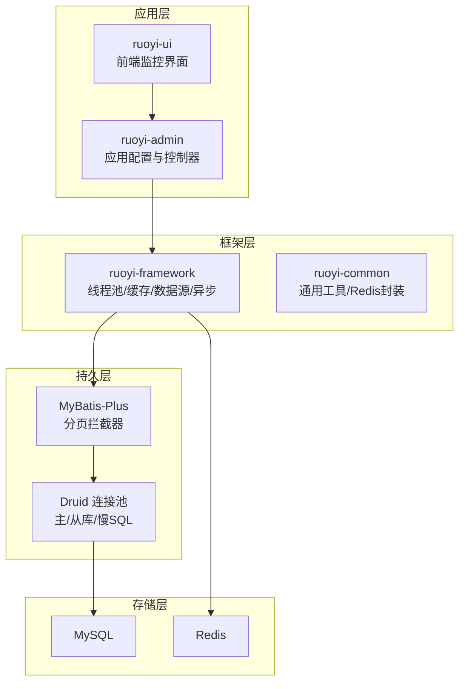
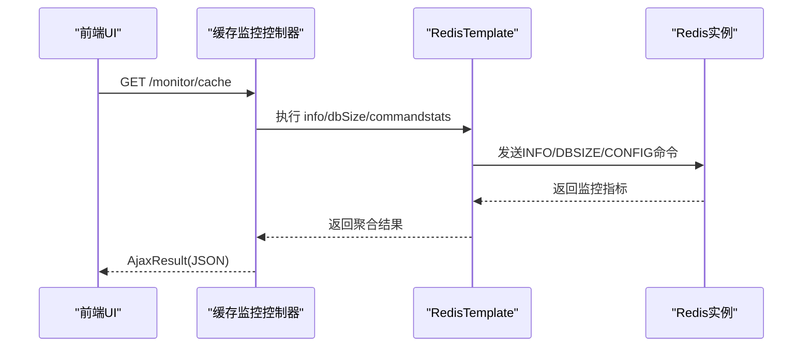
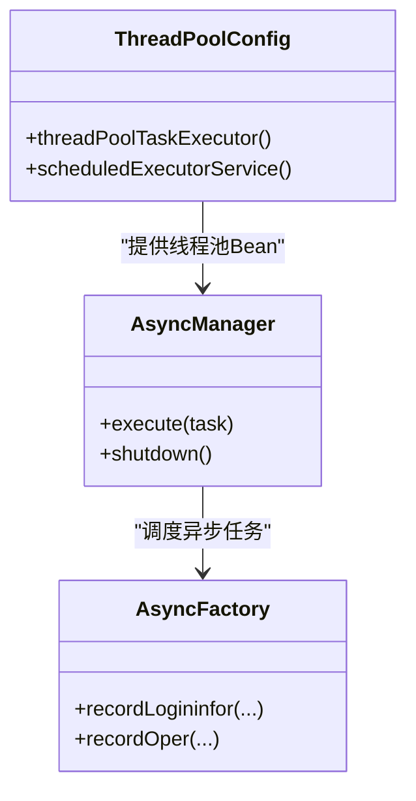
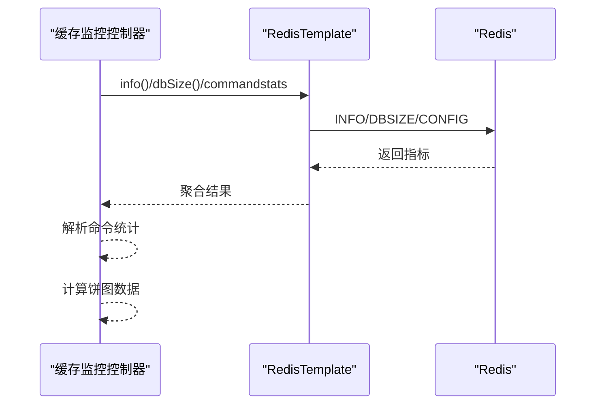
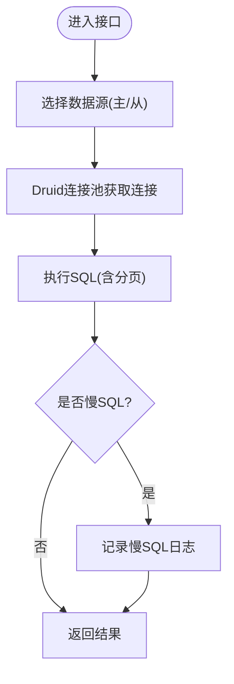
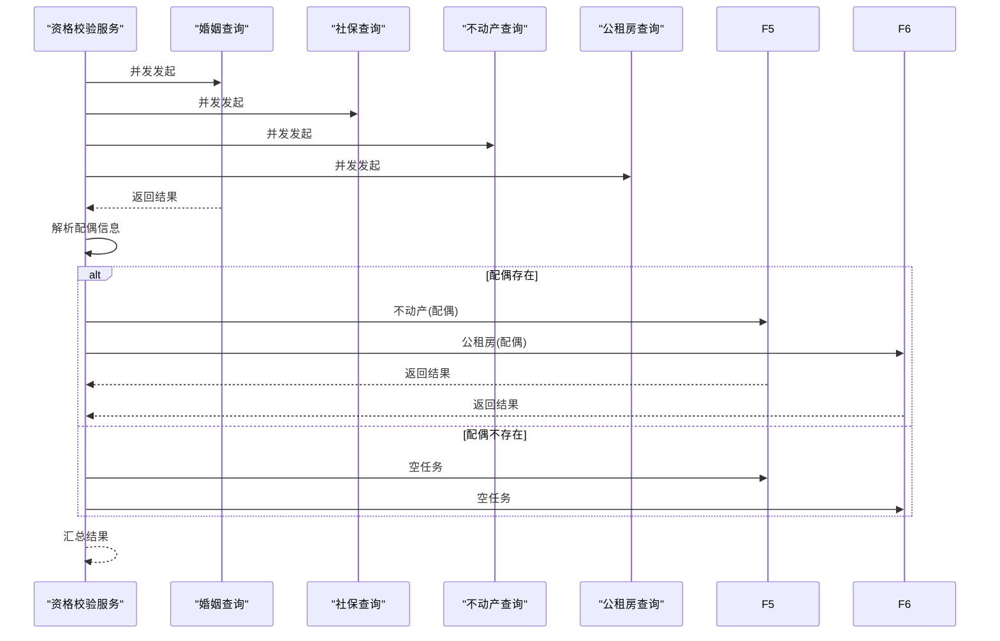
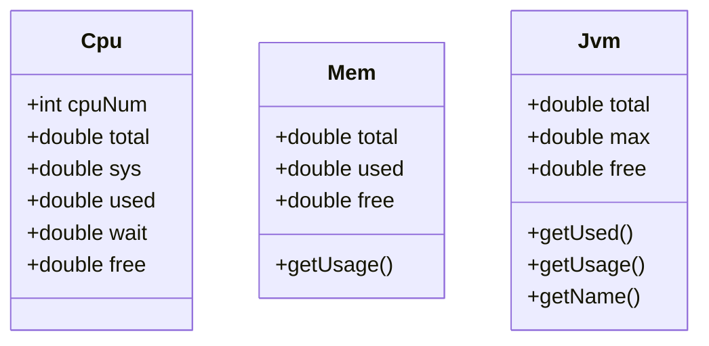
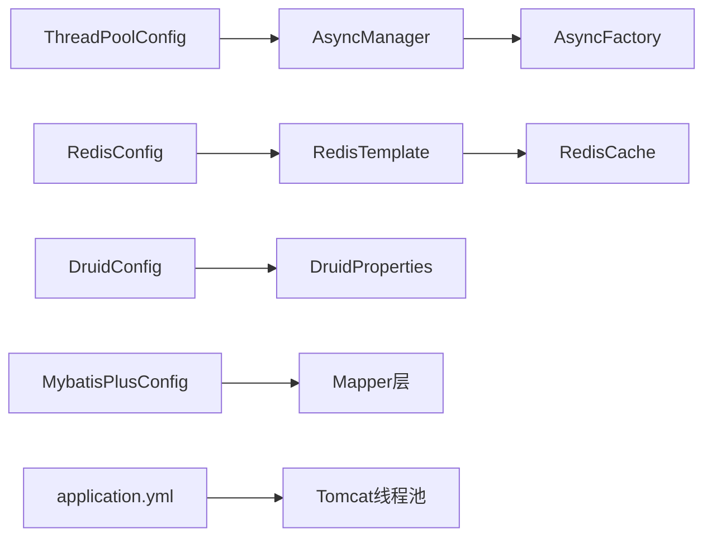

# 系统性能调优

<cite>
**本文引用的文件**   
- [ruoyi-admin/src/main/resources/application.yml](file://ruoyi-admin/src/main/resources/application.yml)
- [ruoyi-admin/src/main/resources/application-druid.yml](file://ruoyi-admin/src/main/resources/application-druid.yml)
- [ruoyi-framework/src/main/java/com/ruoyi/framework/config/ThreadPoolConfig.java](file://ruoyi-framework/src/main/java/com/ruoyi/framework/config/ThreadPoolConfig.java)
- [ruoyi-framework/src/main/java/com/ruoyi/framework/config/RedisConfig.java](file://ruoyi-framework/src/main/java/com/ruoyi/framework/config/RedisConfig.java)
- [ruoyi-framework/src/main/java/com/ruoyi/framework/config/DruidConfig.java](file://ruoyi-framework/src/main/java/com/ruoyi/framework/config/DruidConfig.java)
- [ruoyi-framework/src/main/java/com/ruoyi/framework/config/MybatisPlusConfig.java](file://ruoyi-framework/src/main/java/com/ruoyi/framework/config/MybatisPlusConfig.java)
- [ruoyi-framework/src/main/java/com/ruoyi/framework/config/properties/DruidProperties.java](file://ruoyi-framework/src/main/java/com/ruoyi/framework/config/properties/DruidProperties.java)
- [ruoyi-framework/src/main/java/com/ruoyi/framework/manager/AsyncManager.java](file://ruoyi-framework/src/main/java/com/ruoyi/framework/manager/AsyncManager.java)
- [ruoyi-framework/src/main/java/com/ruoyi/framework/manager/factory/AsyncFactory.java](file://ruoyi-framework/src/main/java/com/ruoyi/framework/manager/factory/AsyncFactory.java)
- [ruoyi-common/src/main/java/com/ruoyi/common/core/redis/RedisCache.java](file://ruoyi-common/src/main/java/com/ruoyi/common/core/redis/RedisCache.java)
- [ruoyi-admin/src/main/java/com/ruoyi/web/controller/monitor/CacheController.java](file://ruoyi-admin/src/main/java/com/ruoyi/web/controller/monitor/CacheController.java)
- [ruoyi-framework/src/main/java/com/ruoyi/framework/web/domain/server/Cpu.java](file://ruoyi-framework/src/main/java/com/ruoyi/framework/web/domain/server/Cpu.java)
- [ruoyi-framework/src/main/java/com/ruoyi/framework/web/domain/server/Mem.java](file://ruoyi-framework/src/main/java/com/ruoyi/framework/web/domain/server/Mem.java)
- [ruoyi-framework/src/main/java/com/ruoyi/framework/web/domain/server/Jvm.java](file://ruoyi-framework/src/main/java/com/ruoyi/framework/web/domain/server/Jvm.java)
- [ruoyi-common/src/main/java/com/ruoyi/common/utils/Threads.java](file://ruoyi-common/src/main/java/com/ruoyi/common/utils/Threads.java)
- [ruoyi-system/src/main/java/com/ruoyi/system/gov/service/QualificationCheckService.java](file://ruoyi-system/src/main/java/com/ruoyi/system/gov/service/QualificationCheckService.java)
</cite>

## 目录
1. [简介](#简介)
2. [项目结构](#项目结构)
3. [核心组件](#核心组件)
4. [架构总览](#架构总览)
5. [详细组件分析](#详细组件分析)
6. [依赖分析](#依赖分析)
7. [性能考量](#性能考量)
8. [故障排查指南](#故障排查指南)
9. [结论](#结论)
10. [附录](#附录)

## 简介
本指南面向港好住信息系统，聚焦于系统性能调优的实操方法与最佳实践。内容涵盖：
- 性能瓶颈识别：数据库性能分析、接口响应时间监控、内存使用分析
- 数据库优化：SQL优化、索引设计、连接池配置
- 缓存优化：Redis命中率提升、失效策略、缓存穿透防护
- 并发优化：线程池配置、异步任务、并发控制
- JVM优化：参数调优、内存分配、GC调优
- 结合监控数据与调优案例，提供可落地的建议

## 项目结构
系统采用前后端分离与多模块架构，后端基于Spring Boot + MyBatis-Plus，集成Druid连接池、Redis缓存、Tomcat线程池与异步任务管理器。前端通过Vue生态提供可视化监控界面。

**章节来源**
- [ruoyi-admin/src/main/resources/application.yml:19-94](file://ruoyi-admin/src/main/resources/application.yml#L19-L94)
- [ruoyi-framework/src/main/java/com/ruoyi/framework/config/ThreadPoolConfig.java:12-64](file://ruoyi-framework/src/main/java/com/ruoyi/framework/config/ThreadPoolConfig.java#L12-L64)
- [ruoyi-framework/src/main/java/com/ruoyi/framework/config/RedisConfig.java:12-71](file://ruoyi-framework/src/main/java/com/ruoyi/framework/config/RedisConfig.java#L12-L71)
- [ruoyi-framework/src/main/java/com/ruoyi/framework/config/DruidConfig.java:27-127](file://ruoyi-framework/src/main/java/com/ruoyi/framework/config/DruidConfig.java#L27-L127)
- [ruoyi-framework/src/main/java/com/ruoyi/framework/config/MybatisPlusConfig.java:9-28](file://ruoyi-framework/src/main/java/com/ruoyi/framework/config/MybatisPlusConfig.java#L9-L28)

## 核心组件
- 线程池与异步：统一的线程池配置与异步任务调度器，用于并发控制与后台任务处理
- 缓存：RedisTemplate序列化配置与限流脚本，支撑热点数据与流量治理
- 数据库：Druid连接池与动态数据源，配合慢SQL监控与分页插件
- 监控：CPU/内存/JVM指标模型与前端缓存监控接口，便于性能观测

**章节来源**
- [ruoyi-framework/src/main/java/com/ruoyi/framework/config/ThreadPoolConfig.java:12-64](file://ruoyi-framework/src/main/java/com/ruoyi/framework/config/ThreadPoolConfig.java#L12-L64)
- [ruoyi-framework/src/main/java/com/ruoyi/framework/manager/AsyncManager.java:9-56](file://ruoyi-framework/src/main/java/com/ruoyi/framework/manager/AsyncManager.java#L9-L56)
- [ruoyi-framework/src/main/java/com/ruoyi/framework/config/RedisConfig.java:12-71](file://ruoyi-framework/src/main/java/com/ruoyi/framework/config/RedisConfig.java#L12-L71)
- [ruoyi-common/src/main/java/com/ruoyi/common/core/redis/RedisCache.java:16-269](file://ruoyi-common/src/main/java/com/ruoyi/common/core/redis/RedisCache.java#L16-L269)
- [ruoyi-framework/src/main/java/com/ruoyi/framework/config/DruidConfig.java:27-127](file://ruoyi-framework/src/main/java/com/ruoyi/framework/config/DruidConfig.java#L27-L127)
- [ruoyi-framework/src/main/java/com/ruoyi/framework/config/MybatisPlusConfig.java:9-28](file://ruoyi-framework/src/main/java/com/ruoyi/framework/config/MybatisPlusConfig.java#L9-L28)
- [ruoyi-framework/src/main/java/com/ruoyi/framework/web/domain/server/Cpu.java:10-102](file://ruoyi-framework/src/main/java/com/ruoyi/framework/web/domain/server/Cpu.java#L10-L102)
- [ruoyi-framework/src/main/java/com/ruoyi/framework/web/domain/server/Mem.java:10-61](file://ruoyi-framework/src/main/java/com/ruoyi/framework/web/domain/server/Mem.java#L10-L61)
- [ruoyi-framework/src/main/java/com/ruoyi/framework/web/domain/server/Jvm.java:12-85](file://ruoyi-framework/src/main/java/com/ruoyi/framework/web/domain/server/Jvm.java#L12-L85)

## 架构总览
系统性能相关的关键交互如下：

**图表来源**
- [ruoyi-admin/src/main/java/com/ruoyi/web/controller/monitor/CacheController.java:48-71](file://ruoyi-admin/src/main/java/com/ruoyi/web/controller/monitor/CacheController.java#L48-L71)
- [ruoyi-common/src/main/java/com/ruoyi/common/core/redis/RedisCache.java:16-269](file://ruoyi-common/src/main/java/com/ruoyi/common/core/redis/RedisCache.java#L16-L269)

## 详细组件分析

### 线程池与异步任务优化
- 线程池配置要点
  - 核心线程数、最大线程数、队列容量、空闲存活时间
  - 拒绝策略：调用调用线程执行，避免丢任务
  - 定时任务线程池：异常打印与守护命名
- 异步任务管理
  - 延迟调度与优雅停机
  - 登录日志、操作日志等异步写入，降低接口延迟

**图表来源**
- [ruoyi-framework/src/main/java/com/ruoyi/framework/config/ThreadPoolConfig.java:12-64](file://ruoyi-framework/src/main/java/com/ruoyi/framework/config/ThreadPoolConfig.java#L12-L64)
- [ruoyi-framework/src/main/java/com/ruoyi/framework/manager/AsyncManager.java:9-56](file://ruoyi-framework/src/main/java/com/ruoyi/framework/manager/AsyncManager.java#L9-L56)
- [ruoyi-framework/src/main/java/com/ruoyi/framework/manager/factory/AsyncFactory.java:19-103](file://ruoyi-framework/src/main/java/com/ruoyi/framework/manager/factory/AsyncFactory.java#L19-L103)

**章节来源**
- [ruoyi-framework/src/main/java/com/ruoyi/framework/config/ThreadPoolConfig.java:12-64](file://ruoyi-framework/src/main/java/com/ruoyi/framework/config/ThreadPoolConfig.java#L12-L64)
- [ruoyi-framework/src/main/java/com/ruoyi/framework/manager/AsyncManager.java:9-56](file://ruoyi-framework/src/main/java/com/ruoyi/framework/manager/AsyncManager.java#L9-L56)
- [ruoyi-framework/src/main/java/com/ruoyi/framework/manager/factory/AsyncFactory.java:19-103](file://ruoyi-framework/src/main/java/com/ruoyi/framework/manager/factory/AsyncFactory.java#L19-L103)
- [ruoyi-common/src/main/java/com/ruoyi/common/utils/Threads.java:11-64](file://ruoyi-common/src/main/java/com/ruoyi/common/utils/Threads.java#L11-L64)

### 缓存策略优化（Redis）
- 序列化与键空间
  - Key采用字符串序列化，Value采用JSON序列化，避免跨语言兼容问题
  - 提供限流脚本，基于Lua原子性控制QPS
- 命令统计与容量监控
  - 通过/info与/commandstats聚合命令使用情况
  - 展示DB大小与内存使用，辅助容量规划
- 常见优化点
  - 命中率低：热点键加TTL、拆分大对象、合理分区
  - 内存压力：定期清理过期键、淘汰策略调整、禁用LRU（如适用）
  - 穿透防护：布隆过滤器或本地缓存兜底
  - 击穿保护：互斥锁或热点永不过期+异步刷新

**图表来源**
- [ruoyi-admin/src/main/java/com/ruoyi/web/controller/monitor/CacheController.java:48-71](file://ruoyi-admin/src/main/java/com/ruoyi/web/controller/monitor/CacheController.java#L48-L71)
- [ruoyi-framework/src/main/java/com/ruoyi/framework/config/RedisConfig.java:43-70](file://ruoyi-framework/src/main/java/com/ruoyi/framework/config/RedisConfig.java#L43-L70)

**章节来源**
- [ruoyi-framework/src/main/java/com/ruoyi/framework/config/RedisConfig.java:12-71](file://ruoyi-framework/src/main/java/com/ruoyi/framework/config/RedisConfig.java#L12-L71)
- [ruoyi-common/src/main/java/com/ruoyi/common/core/redis/RedisCache.java:16-269](file://ruoyi-common/src/main/java/com/ruoyi/common/core/redis/RedisCache.java#L16-L269)
- [ruoyi-admin/src/main/java/com/ruoyi/web/controller/monitor/CacheController.java:25-86](file://ruoyi-admin/src/main/java/com/ruoyi/web/controller/monitor/CacheController.java#L25-L86)

### 数据库性能优化（Druid + MyBatis-Plus）
- 连接池配置
  - 初始化/最小/最大连接数、获取连接最大等待、连接/套接字超时
  - 空闲驱逐周期、最小/最大空闲生命周期、有效性检测
  - 开启慢SQL记录与白名单控制台
- 动态数据源与从库
  - 主从切换、条件启用从库
- 分页与SQL治理
  - MyBatis-Plus分页插件，避免全表扫描
  - 慢SQL告警与SQL审计

**图表来源**
- [ruoyi-framework/src/main/java/com/ruoyi/framework/config/DruidConfig.java:27-127](file://ruoyi-framework/src/main/java/com/ruoyi/framework/config/DruidConfig.java#L27-L127)
- [ruoyi-framework/src/main/java/com/ruoyi/framework/config/MybatisPlusConfig.java:9-28](file://ruoyi-framework/src/main/java/com/ruoyi/framework/config/MybatisPlusConfig.java#L9-L28)
- [ruoyi-framework/src/main/java/com/ruoyi/framework/config/properties/DruidProperties.java:54-88](file://ruoyi-framework/src/main/java/com/ruoyi/framework/config/properties/DruidProperties.java#L54-L88)

**章节来源**
- [ruoyi-admin/src/main/resources/application-druid.yml:1-64](file://ruoyi-admin/src/main/resources/application-druid.yml#L1-L64)
- [ruoyi-framework/src/main/java/com/ruoyi/framework/config/DruidConfig.java:27-127](file://ruoyi-framework/src/main/java/com/ruoyi/framework/config/DruidConfig.java#L27-L127)
- [ruoyi-framework/src/main/java/com/ruoyi/framework/config/MybatisPlusConfig.java:9-28](file://ruoyi-framework/src/main/java/com/ruoyi/framework/config/MybatisPlusConfig.java#L9-L28)
- [ruoyi-framework/src/main/java/com/ruoyi/framework/config/properties/DruidProperties.java:14-89](file://ruoyi-framework/src/main/java/com/ruoyi/framework/config/properties/DruidProperties.java#L14-L89)

### 并发与异步处理（接口级优化）
- 并发控制
  - 线程池参数与队列容量匹配业务峰值
  - 拒绝策略避免请求堆积导致雪崩
- 异步任务
  - 登录日志、操作日志异步落库，降低接口延迟
  - 定时任务异常打印，保障可观测性
- 异步编程范式
  - 业务场景中使用CompletableFuture实现多路并发查询，减少总体等待时间

**图表来源**
- [ruoyi-system/src/main/java/com/ruoyi/system/gov/service/QualificationCheckService.java:178-198](file://ruoyi-system/src/main/java/com/ruoyi/system/gov/service/QualificationCheckService.java#L178-L198)

**章节来源**
- [ruoyi-framework/src/main/java/com/ruoyi/framework/config/ThreadPoolConfig.java:12-64](file://ruoyi-framework/src/main/java/com/ruoyi/framework/config/ThreadPoolConfig.java#L12-L64)
- [ruoyi-framework/src/main/java/com/ruoyi/framework/manager/AsyncManager.java:9-56](file://ruoyi-framework/src/main/java/com/ruoyi/framework/manager/AsyncManager.java#L9-L56)
- [ruoyi-framework/src/main/java/com/ruoyi/framework/manager/factory/AsyncFactory.java:19-103](file://ruoyi-framework/src/main/java/com/ruoyi/framework/manager/factory/AsyncFactory.java#L19-L103)
- [ruoyi-system/src/main/java/com/ruoyi/system/gov/service/QualificationCheckService.java:178-198](file://ruoyi-system/src/main/java/com/ruoyi/system/gov/service/QualificationCheckService.java#L178-L198)

### JVM与系统资源监控
- JVM指标
  - 总内存、最大可用、空闲、使用量、使用率、版本与路径
- 系统指标
  - CPU核心数、总使用率、系统/用户/等待/空闲占比
  - 内存总量、使用量、剩余、使用率
- 前端展示
  - 命令统计饼图、内存使用仪表盘

**图表来源**
- [ruoyi-framework/src/main/java/com/ruoyi/framework/web/domain/server/Cpu.java:10-102](file://ruoyi-framework/src/main/java/com/ruoyi/framework/web/domain/server/Cpu.java#L10-L102)
- [ruoyi-framework/src/main/java/com/ruoyi/framework/web/domain/server/Mem.java:10-61](file://ruoyi-framework/src/main/java/com/ruoyi/framework/web/domain/server/Mem.java#L10-L61)
- [ruoyi-framework/src/main/java/com/ruoyi/framework/web/domain/server/Jvm.java:12-85](file://ruoyi-framework/src/main/java/com/ruoyi/framework/web/domain/server/Jvm.java#L12-L85)

**章节来源**
- [ruoyi-framework/src/main/java/com/ruoyi/framework/web/domain/server/Cpu.java:10-102](file://ruoyi-framework/src/main/java/com/ruoyi/framework/web/domain/server/Cpu.java#L10-L102)
- [ruoyi-framework/src/main/java/com/ruoyi/framework/web/domain/server/Mem.java:10-61](file://ruoyi-framework/src/main/java/com/ruoyi/framework/web/domain/server/Mem.java#L10-L61)
- [ruoyi-framework/src/main/java/com/ruoyi/framework/web/domain/server/Jvm.java:12-85](file://ruoyi-framework/src/main/java/com/ruoyi/framework/web/domain/server/Jvm.java#L12-L85)

## 依赖分析
- 组件耦合
  - AsyncManager依赖线程池Bean，统一异步调度
  - AsyncFactory封装异步任务，职责清晰
  - RedisConfig提供序列化与限流脚本，RedisCache封装常用操作
  - DruidConfig与DruidProperties共同配置连接池，MyBatis-Plus分页插件贯穿DAO层
- 外部依赖
  - MySQL与Redis作为核心存储
  - Tomcat线程池由application.yml控制

**图表来源**
- [ruoyi-framework/src/main/java/com/ruoyi/framework/config/ThreadPoolConfig.java:12-64](file://ruoyi-framework/src/main/java/com/ruoyi/framework/config/ThreadPoolConfig.java#L12-L64)
- [ruoyi-framework/src/main/java/com/ruoyi/framework/manager/AsyncManager.java:9-56](file://ruoyi-framework/src/main/java/com/ruoyi/framework/manager/AsyncManager.java#L9-L56)
- [ruoyi-framework/src/main/java/com/ruoyi/framework/manager/factory/AsyncFactory.java:19-103](file://ruoyi-framework/src/main/java/com/ruoyi/framework/manager/factory/AsyncFactory.java#L19-L103)
- [ruoyi-framework/src/main/java/com/ruoyi/framework/config/RedisConfig.java:12-71](file://ruoyi-framework/src/main/java/com/ruoyi/framework/config/RedisConfig.java#L12-L71)
- [ruoyi-common/src/main/java/com/ruoyi/common/core/redis/RedisCache.java:16-269](file://ruoyi-common/src/main/java/com/ruoyi/common/core/redis/RedisCache.java#L16-L269)
- [ruoyi-framework/src/main/java/com/ruoyi/framework/config/DruidConfig.java:27-127](file://ruoyi-framework/src/main/java/com/ruoyi/framework/config/DruidConfig.java#L27-L127)
- [ruoyi-framework/src/main/java/com/ruoyi/framework/config/MybatisPlusConfig.java:9-28](file://ruoyi-framework/src/main/java/com/ruoyi/framework/config/MybatisPlusConfig.java#L9-L28)
- [ruoyi-admin/src/main/resources/application.yml:19-94](file://ruoyi-admin/src/main/resources/application.yml#L19-L94)

**章节来源**
- [ruoyi-framework/src/main/java/com/ruoyi/framework/config/ThreadPoolConfig.java:12-64](file://ruoyi-framework/src/main/java/com/ruoyi/framework/config/ThreadPoolConfig.java#L12-L64)
- [ruoyi-framework/src/main/java/com/ruoyi/framework/manager/AsyncManager.java:9-56](file://ruoyi-framework/src/main/java/com/ruoyi/framework/manager/AsyncManager.java#L9-L56)
- [ruoyi-framework/src/main/java/com/ruoyi/framework/manager/factory/AsyncFactory.java:19-103](file://ruoyi-framework/src/main/java/com/ruoyi/framework/manager/factory/AsyncFactory.java#L19-L103)
- [ruoyi-framework/src/main/java/com/ruoyi/framework/config/RedisConfig.java:12-71](file://ruoyi-framework/src/main/java/com/ruoyi/framework/config/RedisConfig.java#L12-L71)
- [ruoyi-common/src/main/java/com/ruoyi/common/core/redis/RedisCache.java:16-269](file://ruoyi-common/src/main/java/com/ruoyi/common/core/redis/RedisCache.java#L16-L269)
- [ruoyi-framework/src/main/java/com/ruoyi/framework/config/DruidConfig.java:27-127](file://ruoyi-framework/src/main/java/com/ruoyi/framework/config/DruidConfig.java#L27-L127)
- [ruoyi-framework/src/main/java/com/ruoyi/framework/config/MybatisPlusConfig.java:9-28](file://ruoyi-framework/src/main/java/com/ruoyi/framework/config/MybatisPlusConfig.java#L9-L28)
- [ruoyi-admin/src/main/resources/application.yml:19-94](file://ruoyi-admin/src/main/resources/application.yml#L19-L94)

## 性能考量
- 数据库
  - 连接池参数与业务QPS匹配，避免连接争用
  - 慢SQL优先定位与索引优化，必要时引入物化视图或读写分离
  - 分页查询避免“深度分页”，考虑游标/时间戳分页
- 缓存
  - 热点键TTL与互斥锁，避免击穿
  - 大对象拆分与压缩，控制内存占用
  - 命令统计异常峰值时，评估限流与降级
- 并发
  - 线程池队列容量与拒绝策略平衡吞吐与延迟
  - 异步任务避免阻塞主线程，注意异常兜底
- JVM
  - GC日志与堆外内存监控，避免Full GC与内存泄漏
  - 参数随负载动态调整，结合CPU/内存指标

[本节为通用指导，无需具体文件引用]

## 故障排查指南
- 缓存异常
  - 通过缓存监控接口查看命令统计与DB大小，定位异常峰值
  - 清理指定命名空间或键名，验证影响范围
- 数据库慢查询
  - 开启慢SQL记录，核对阈值与白名单
  - 检查连接池等待时间与最大活跃连接
- 线程池问题
  - 观察队列长度与拒绝次数，调整核心/最大线程与队列容量
  - 关注定时任务异常打印，确保可观测性
- JVM与系统资源
  - 监控CPU/内存/JVM使用率，结合业务高峰时段分析

**章节来源**
- [ruoyi-admin/src/main/java/com/ruoyi/web/controller/monitor/CacheController.java:25-86](file://ruoyi-admin/src/main/java/com/ruoyi/web/controller/monitor/CacheController.java#L25-L86)
- [ruoyi-admin/src/main/resources/application-druid.yml:55-64](file://ruoyi-admin/src/main/resources/application-druid.yml#L55-L64)
- [ruoyi-framework/src/main/java/com/ruoyi/framework/config/ThreadPoolConfig.java:12-64](file://ruoyi-framework/src/main/java/com/ruoyi/framework/config/ThreadPoolConfig.java#L12-L64)
- [ruoyi-framework/src/main/java/com/ruoyi/framework/web/domain/server/Cpu.java:10-102](file://ruoyi-framework/src/main/java/com/ruoyi/framework/web/domain/server/Cpu.java#L10-L102)
- [ruoyi-framework/src/main/java/com/ruoyi/framework/web/domain/server/Mem.java:10-61](file://ruoyi-framework/src/main/java/com/ruoyi/framework/web/domain/server/Mem.java#L10-L61)
- [ruoyi-framework/src/main/java/com/ruoyi/framework/web/domain/server/Jvm.java:12-85](file://ruoyi-framework/src/main/java/com/ruoyi/framework/web/domain/server/Jvm.java#L12-L85)

## 结论
通过线程池与异步任务的合理配置、Redis缓存的序列化与限流策略、Druid连接池与慢SQL治理、以及JVM与系统资源的持续监控，港好住信息系统可在高并发场景下保持稳定与高性能。建议以监控数据为依据，逐步迭代优化参数与策略，形成闭环的性能治理体系。

[本节为总结，无需具体文件引用]

## 附录
- 关键配置参考
  - 应用端口、Tomcat线程池、Redis连接池、MyBatis-Plus全局配置
- 调优清单
  - 连接池：初始/最小/最大连接、等待与超时、空闲驱逐
  - 缓存：序列化策略、TTL与互斥锁、穿透防护
  - 并发：线程池参数、队列容量、拒绝策略
  - 数据库：分页策略、索引优化、慢SQL治理
  - JVM：GC策略、堆内存与元空间、线程栈

**章节来源**
- [ruoyi-admin/src/main/resources/application.yml:19-142](file://ruoyi-admin/src/main/resources/application.yml#L19-L142)
- [ruoyi-admin/src/main/resources/application-druid.yml:22-64](file://ruoyi-admin/src/main/resources/application-druid.yml#L22-L64)
- [ruoyi-framework/src/main/java/com/ruoyi/framework/config/RedisConfig.java:12-71](file://ruoyi-framework/src/main/java/com/ruoyi/framework/config/RedisConfig.java#L12-L71)
- [ruoyi-framework/src/main/java/com/ruoyi/framework/config/MybatisPlusConfig.java:9-28](file://ruoyi-framework/src/main/java/com/ruoyi/framework/config/MybatisPlusConfig.java#L9-L28)